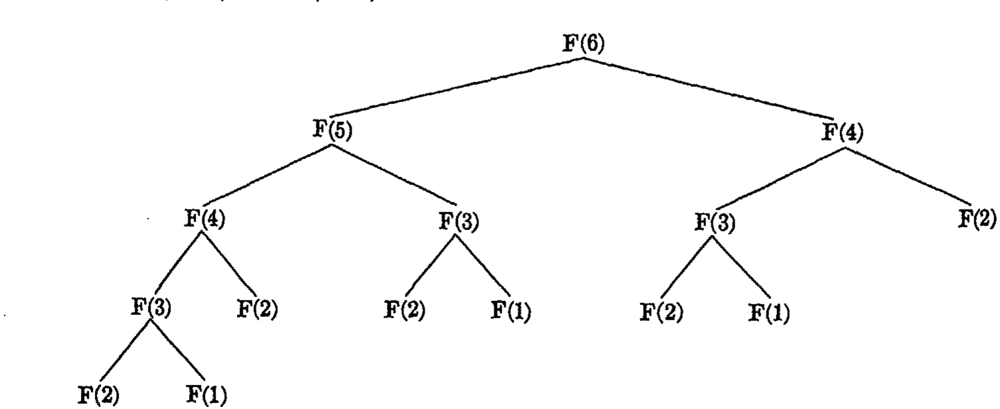
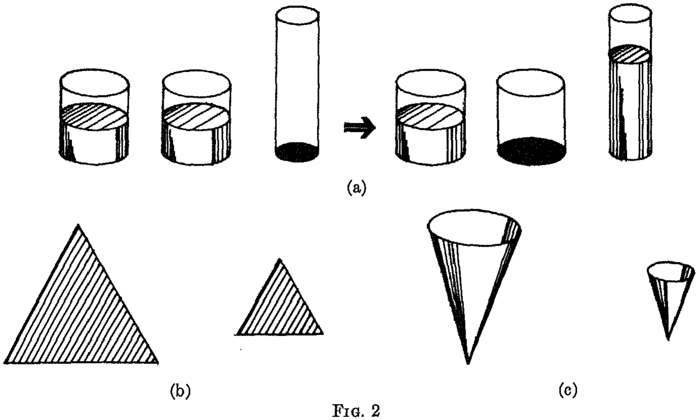
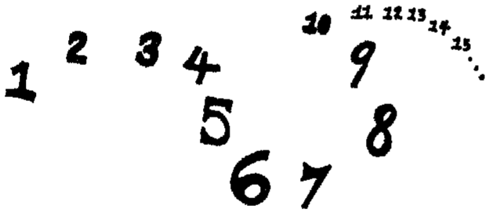
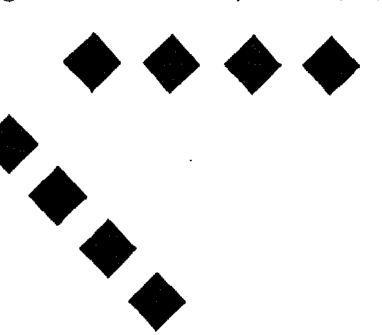
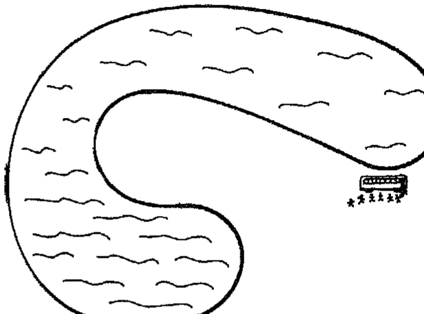
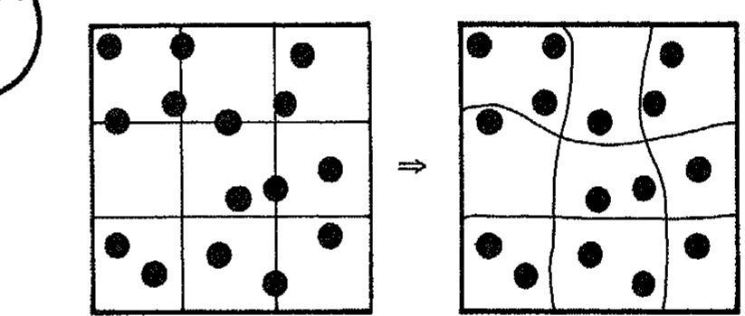
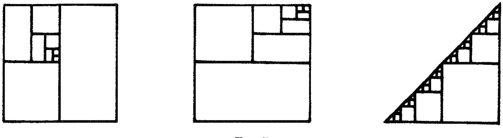

# 计算机科学中的形式与内容

**Form and Content in Computer Science**

> 马文·明斯基(Marvin Minsky)〔译注9〕
> 1969 年 ACM 图灵奖演讲
> 原载 *Journal of the ACM*, Vol. 17, No. 2 (1970 年 4 月), pp. 197–215
> 译自 `1283920.1283924.pdf`(个人学习用途)

> 当今计算机科学的问题在于对形式而非内容的病态关注。

## 摘要

对形式主义的过度关注正在阻碍计算机科学的发展。本文讨论了计算理论、编程语言和教育这三个领域中形式与内容的混淆。

**关键词与短语**：教育，编程语言，编译器，程序设计理论，启发式，初等教育，计算机科学课程，自扩展语言，“新数学”
**CR 类别**：1.50, 3.66, 4.12, 4.29, 5.24

---

当今计算机科学的问题在于对形式而非内容的病态关注。

不，这不是一个好的开头。按照以往的任何标准，计算机科学的活力都是巨大的；还有哪个智力领域能在二十年内取得如此长足的进步？此外，计算理论或许在某种程度上包含了形式科学，因此这种关注并非完全错位。尽管如此，我仍将论证，对形式主义的过度痴迷正在阻碍我们的发展。

在进入正式讨论之前，我想记录下我的同事、学生和我本人从这次图灵奖中获得的满足感。围绕理解智能的一系列问题——曾经是哲学问题，现在是科学问题——是艾伦·图灵（Alan Turing）〔译注1〕最为关心的，他与少数其他思想家——特别是沃伦·S·麦卡洛克（Warren S. McCulloch）及其年轻合伙人沃尔特·皮茨（Walter Pitts）——一起进行了许多早期分析，这些分析既促成了计算机本身的诞生，也促成了人工智能这一新技术。在认可这一领域的同时，该奖项应将注意力集中在我所属的科学家族的其他工作上——特别是雷·索洛莫诺夫（Ray Solomonoff）、奥利弗·塞尔弗里奇（Oliver Selfridge）、约翰·麦卡锡（John McCarthy）、艾伦·纽厄尔（Allen Newell）、赫伯特·西蒙（Herbert Simon）和西摩·帕佩特（Seymour Papert）〔译注2〕，他们是我十年工作中最亲密的伙伴。帕佩特的观点贯穿了本文。

本文分为三个部分，分别指出了计算理论、编程语言和教育中形式与内容的混淆。

## 1. 计算理论

要建立一个理论，需要对该学科的基础现象有深入的了解。在计算理论中，我们对这些现象的了解还不足以进行非常抽象的教学。相反，我们应该更多地教授我们目前已经彻底理解的具体例子，并希望从中产生出一种更广泛、更实质性的理论。目前，我们正面临着一种危险，即试图在没有足够事实基础的情况下建立一个宏大的架构。

我们将能够猜测并证明更普遍的原理。我这样说不仅仅是为了对那些可能正确但尚未证明的事情保持保守。我认为我们许多看似常识的信念都是错误的。我们对时间与内存之间可能的交换、时间与程序复杂度之间的权衡、软件与硬件、数字与模拟电路、串行与并行计算、关联存储器与寻址存储器等等，都存在严重的误解。

考虑与物理学的类比是有启发性的，在物理学中，人们可以将大部分基础知识组织为一组相当紧凑的守恒定律。当然，这只是描述的一种方式；人们可以使用微分方程、极小值原理、平衡定律等。例如，能量守恒可以被解释为定义了各种形式的势能和动能之间的交换，例如高度与速度平方之间，或者温度与压强-体积之间。量子理论的发展可以建立在位置与动量的确定性之间的权衡，或者时间与能量之间的权衡之上。这并没有什么特别之处；任何具有相当平滑解的方程都可以被视为定义了其变量之间某种权衡。但是有很多方法可以表述事物，过度依恋某种特定的形式或定律并进而相信它是真正的基本原理是有风险的。参见费曼（Feynman）[1]〔译注3〕关于此点的论述。

尽管如此，对交换的识别往往是一门科学的构思，而对它们的量化则是其诞生。在计算领域，我们有什么具有这种特征的东西吗？在递归函数论中，我们有香农（Shannon）〔译注12〕[2] 的观察
：任何具有 Q 个状态和 R 个符号的图灵机都等价于一个具有 2 个状态和 nQR 个符号的图灵机，也等价于一个具有 2 个符号和 n'QR 个状态的图灵机，其中 n 和 n' 是较小的数字。
因此，状态-符号乘积 QR 在分类机器时具有几乎不变的性质。不幸的是，人们不能将该乘积等同于机器复杂度的有用度量，因为这反过来又与机器编码过程的复杂度存在权衡——而这种权衡对于有用的应用来说似乎太难以捉摸了。

让我们考虑一个更初级但仍然令人困惑的权衡，即加法和乘法之间的权衡。计算一个 3 X 3 的行列式需要多少次乘法？如果我们把展开式写成六个三项积，我们需要十二次乘法。如果我们利用分配律提取因子，这会减少到九次。最小次数是多少，以及如何证明它，在这种情况和 n X n 的情况下？重点不在于我们需要答案。而在于我们不知道如何判断或证明所提出的答案是正确的！对于一个特定的公式，人们或许可以使用某种穷举搜索，但这无法建立一个通用的规则。我们的主要研究目标之一应该是开发一些方法，来证明特定的程序在各种意义上都是计算极小的。

在库克（Cook）[3]〔译注4〕的论文中，关于乘法本身有一个惊人的发现，该论文使用了图姆（Toom）的一个结果；高德纳（Knuth）[4]〔译注5〕对此进行了讨论。考虑乘法十进制数的普通算法：对于两个 n 位数，这需要 n² 次个位数乘法。通常认为这是极小的。但假设我们将数字分成两半，使得乘积为 N = (10^(n/2) A + B)(10^(n/2) C + D)，其中 10^(n/2) 代表乘以 10^(n/2)。（左移操作被认为成本可以忽略不计。）那么可以验证：

N = 10ⁿ AC + BD + 10^(n/2) (A + B)(C + D) - 10^(n/2) (AC + BD).

这只涉及三次半长乘法，而不是人们可能认为需要的四次。对于较大的 n，这种减少显然可以反复应用于更小的数字。代价是加法次数的增加。通过结合这一想法和其他想法，库克证明了对于任何 ε 和足够大的 n，乘法需要的乘积少于 n^(1+ε) 次，而不是预期的 n² 次。同样，V. Strassen 最近证明，要将两个 m X m 矩阵相乘，乘积的数量可以减少到 m^(log₂ 7) 的量级，而人们一直认为这个数量必须是立方级的，因为结果中有 m² 项，每项似乎都需要一个单独的内积，包含 m 次乘法。在这两种情况下，普通的直觉长期以来都是错误的，错得如此离谱，以至于显然没有人去寻找更好的方法。我们仍然没有一套足以在矩阵情况下精确建立乘法和加法之间最小权衡交换的证明方法。

乘法-加法交换本身似乎并不至关重要，但如果我们不能彻底理解如此简单的事情，我们可以预见到在处理任何更复杂的事情时都会遇到严重的麻烦。

考虑另一种权衡，即内存大小和计算时间之间的权衡。在我们的书 [5] 中，帕佩特和我提出了一个简单的问题：给定一个任意的 n 位单词集合，需要多少次内存引用才能判断这些单词中哪一个与一个任意给定的单词最接近（在一致的位数上）？由于有许多方法可以对“库”集合进行编码，有些比其他的占用更多内存，因此更精确的问题是：内存大小必须如何增长才能实现内存引用次数的给定减少？这一点是微不足道的：如果内存足够大，只需要一次引用，因为我们可以将问题本身作为地址，并将答案存储在如此寻址的寄存器中。但如果内存刚好大到足以存储库中的信息，那么就必须搜索所有的信息——而且我们不知道任何有价值的中间结果。这无疑是信息检索的一个基本理论问题，但似乎没有人知道如何为这种基本权衡设定一个好的下界。

另一个是串行-并行交换。假设我们有 n 台计算机而不仅仅是一台。我们可以将哪些计算加速多少？对于某些计算，我们肯定可以获得 n 倍的加速。但这些情况很少见。对于其他的，我们可以获得 log n 的加速，但很难找到任何例子或证明它们的性质。而对于大多数计算，我认为我们几乎无法获得任何加速；这种情况存在许多高度分支的条件语句，因此对可能分支的预判通常会被浪费。我们对此几乎一无所知；大多数人认为（这无疑是错误的乐观主义），并行性通常是加速大多数计算的有利方式。

这些只是关于计算权衡的少数几个了解甚少的问题。没有篇幅讨论其他问题，例如数字-模拟问题。（[5] 中概述了一些关于局部计算与全局计算的问题。）而且我们对数值计算和符号计算之间的权衡知之甚少。

在今天的计算机科学课程中，很少有人关注这些问题的已知情况；几乎所有的时间都花在了语法语言类型的形式分类、失败主义的不可解性理论、关于系统编程的民间传说，以及通常微不足道的“逻辑设计优化”片段上——后者往往发生在启发式〔译注11〕编程艺术已经远远超出了那些被严厉教授和测试的特例“理论”的情况下——以及关于编程风格的祈祷，而这些风格在学生毕业前几乎肯定会过时。
即使是那些看似最抽象的递归函数论和形式逻辑课程，似乎也忽略了在证明编译器事实或程序等价性方面少数已知的有用结果。大多数课程将人工智能的工作成果（有些现在已经有十五年的历史了）视为外围的特殊应用集合，而事实上，它们代表了对真实计算问题的经验和理论探索的最大主体之一。在所有这些对形式的关注被对计算中实质性问题的关注所取代之前，一个年轻的学生最好避开大部分计算机科学课程，学习编程，尽可能多地掌握数学和其他科学，并研究人工智能、复杂性和优化理论方面的当前文献。

## 2. 编程语言

即使在编程语言和编译器领域，也存在过多对形式的关注。我说“即使”，是因为人们可能觉得这是一个形式理应成为主要关注点的领域。但让我们考虑两个断言：(1) 语言正变得语法过多，(2) 语言正被描述得语法过多。

编译器对表达式、断言和描述的含义关注不够。使用上下文无关文法来描述语言片段，在规范和实现的一致性方面取得了重要进展。但是，尽管这在简单情况下效果很好，但使用它的尝试可能会阻碍更复杂领域的发展。在使用文法来描述涉及执行以及规范过程的自修改或自扩展语言时，存在严重的问题。人们无法通过语法——也就是说，静态地——描述一种正在变化的语言的有效表达式。

语法扩展机制当然必须被描述，但如果这些机制是用现代模式匹配语言（如 SNOBOL、CONVERT [6] 或 MATCHLESS [7]）给出的，那么解析程序和语言描述本身之间就不需要有区别。未来的计算机语言将更多地关注目标，而较少关注程序员指定的程序。以下论点有点极端，但鉴于当今对形式的关注，这种越界不会造成伤害。（有些想法归功于 C. Hewitt 和 T. Winograd。）

### 2.1. 语法通常是不必要的

一个人可以靠比通常意识到的少得多的语法生存。编程语法的大部分关注点在于括号的抑制或作用域标记的强调。有一些替代方案一直未被充分利用。

请不要认为我反对在人机界面上使用中缀表达式和运算符优先级等手段。它们有其地位。但它们对整个计算机科学的重要性被如此夸大，以至于开始腐蚀年轻人。

考虑众所周知的平方根算法，正如它可能在现代代数语言中编写的那样，忽略数据类型声明等事项。给定初始估计值 X 和误差限制 E，要求 A 的平方根。

```
.DEFINE SQRT(A,X,E) :
    if ABS(A - X*X) < E then X else SQRT(A, (X + A/X) / 2, E).
```

在 LISP 的一个虚构但可辨认的版本中（见 Levin [8] 或 Weissman [9]），同样的程序可以写成：

```lisp
(DEFINE (SQRT A X E)
    (IF (LESS (ABS (- A (* X X))) E) THEN X
    ELSE (SQRT A (/ (+ X (/ A X)) 2) E)))
```

在这里，函数名紧跟在它们的括号内。对于人类来说，写下所有括号的笨拙显而易见；而无需学习所有约定（例如 `(X + A / X)` 是 `(+ X (/ A X))` 而不是 `(/ (+ X A) X)`）的优势却往往被忽视。

带有显式分隔符的语法是保守的，还是未来的浪潮，仍有待观察。它在编辑、解释以及由其他程序创建程序方面具有重要优势。LISP 的完整语法可以在一小时左右学会；解释器紧凑且并不极其复杂，学生通常可以通过阅读解释器程序本身来回答有关系统的问题。当然，这并不能回答有关真实的、实际的实现的所有问题，但任何可行的语法规则集也都做不到。此外，尽管该语言很笨拙，但许多前沿工作者认为它具有出色的表达能力。几乎所有关于通过构建和修改假设来解决问题的程序的工作都是用这种或相关的语言编写的。不幸的是，语言设计者通常不熟悉这一领域，并倾向于将其视为“符号处理技术”的专门主体。

通过使用语言本身之外的缩进和其他布局手段，可以大大澄清这种“弱语法”语言中表达式的结构。例如，可以使用属于输入预处理器的“推迟”符号 `↓` 将上述内容重写为：

```
DEFINE (SQRT A X E) ↓ .
    IF ↓ THEN X ELSE ↓ .
        LESS (ABS ↓ ) E.
            - A (* X X).
        SQRT A ↓ E.
            / (+ X (/ A X)) 2
```

其中点表示 `)(`，箭头表示“在此处插入下一个可用的表达式，该表达式由点分隔，并在（递归地）替换其自身的箭头后可用”。缩进是可选的。这通过两个简单的手段获得了通常的作用域指示符和约定的很大一部分效果，这两个手段都可以由读取程序琐碎地处理，并且易于编辑，因为子表达式通常在每一行上都是完整的。

为了体会推迟运算符的力量和局限性，读者应该拿自己喜欢的语言和喜欢的算法看看会发生什么。他会发现许多推迟的选择，并且他会对先说什么、强调哪些参数等等做出判断。当然，`↓` 并不是所有问题的答案；列表片段也需要推迟装置，而这需要它自己的分隔符。无论如何，这些只是迈向更图形化的程序描述系统的步骤，因为我们不会永远局限于仅仅是符号串。

Dana Scott〔译注13〕建议的另一种说明手段
是使用替代括号来指示从右到左的函数组合，这样当人们想要更自然地指示一个量在计算过程中发生了什么时，可以写成 `(((x)h)g)f` 而不是 `f(g(h(x)))`。
这允许不同的“重音”，如 `f((h(x))g)`，可以读作：“计算 f，其参数是你先计算 h(x) 然后对其应用 g 得到的结果。”

这一点或许通过类比比通过例子更能说明问题。在对语法的狂热关注中，语言设计者变得过于以句子为中心。有了 `↓` 之类的装置，人们可以构造更像段落的对象，而无需完全退回到流程图。

当今的高级编程语言在风格灵活性意义上的表达能力很弱。如果不改变算法本身，人们就无法很好地控制思想呈现的顺序。

### 2.2. 效率与理解程序

编译器是做什么用的？通常的回答类似于“将一种语言翻译成另一种语言”或“获取算法的描述并将其组装成程序，填补许多小细节”。对于未来，需要一种更宏大的观点。大多数编译器将是“给定效果描述，生成算法”的系统。现代图形格式系统已经做到了这一点；它们完成所有创造性工作，而用户仅提供所需格式的示例：在这里，编译器比用户更专业。模式匹配语言也是很好的例子。

但除了少数此类特例，编译器设计者在编写好程序方面几乎没有取得进展。对公共子表达式的识别、内循环的优化、多个寄存器的分配等，只能带来效率上的微小线性改进——而编译器甚至对这些也做得不够。自动存储分配可能更有价值。但真正的回报在于对算法本身计算内容的分析，而不是程序员写下它的方式。例如，考虑：

```
DEFINE FIB(N) : if N = 1 then 1, if N = 2 then 1,
else FIB(N - 1) + FIB(N - 2).
```

斐波那契数 1, 1, 2, 3, 5, 8, 13, ... 的这种递归定义可以交给任何体面的算法语言，并将导致图 1 所示的评估步骤分支树。



**图 1.** FIB(6) 的递归求值树。

可以看到，机器将要完成的工作量随 N 指数级增长。（更准确地说，它经过了 FIB(N) 数量级的定义评估。）

有更好的方法来计算这个函数。因此，我们可以定义两个临时寄存器，并在以下代码中评估 FIB(N)：

```
DEFINE FIB(N A B): if N = 1 then A else FIB(N - 1 A + B A).
```

它是单递归的，避免了分支树，或者甚至使用：

```
LOOP
    A = 0
    B = 1
    SWAP A B
    if N = 1 return A
    N = N - 1
    B = A + B
    goto LOOP
```

任何程序员一旦看到分支评估中发生了什么，很快就会想到这些。这是一种可以将“值域”递归转换为简单迭代的情况。当今的编译器甚至无法识别此类转换的简单情况，尽管指数级阶数的降低远胜于代码局部“优化”可能带来的任何收益。抗议此类收益罕见或此类事项是程序员的责任都是徒劳的。如果节省编译时间很重要，那么这些能力可以被切除。例如，对于用模式匹配语言编写的程序，确实经常进行此类简化。通过为 BNF 系统编译一个高效的树解析器，而不是执行暴力的综合分析，通常会获胜。

诚然，此类转换的系统理论是困难的。一个系统必须非常聪明才能检测哪些转换是相关的，以及何时值得使用它们。由于程序员已经知道他的意图，如果提议的算法伴随着（甚至被替换为）合适的目标声明表达式，问题通常会更容易。

为了朝这个方向迈进，我们需要关于分析和综合程序的知识体系。在理论方面，现在有很多关于算法和模式等价性的研究，以及关于证明程序具有所述性质的研究。在实践方面，W. A. Martin [10] 和 J. Moses [11] 的工作说明了如何使系统了解特定数学技术的符号转换，从而显著补充其用户的应用数学能力。

程序约简问题在一般情况下是递归不可解的，这一事实并没有实际后果。无论如何，人们可以预期程序最终在这项活动中将远远超过人类的能力，并以形式纯化的形式利用大量的程序转换。这些将不容易直接应用。相反，人们可以预期发展将遵循我们在符号积分中看到的路线，例如 Slagle [12] 和 Moses [11]。首先开发了一组对应于积分表基本条目的简单形式转换。在此基础上，Slagle 构建了一组启发式技术，用于将实际问题的代数和分析转换转换为那些已经理解的元素；这涉及一组可以被称为使用“模式识别”的特征化和匹配程序。在 Moses 的系统中，匹配程序和转换都得到了极大的改进，以至于在大多数实际问题中，在 Slagle 程序的性能中起很大作用的启发式搜索策略变成了对 Moses 系统中所包含的确定知识及其熟练应用的次要补充。启发式编译器系统最终将需要比符号积分系统多得多的通用知识和常识，因为它的目标更像是造就一个完整的数学家，而不是一个专门的积分器。

### 2.3. 描述编程系统

无论一种语言如何被描述，计算机都必须使用一个过程来解释它。应该记住，在描述一种语言时，主要目标是解释如何用它编写程序以及这些程序的含义。主要目标不是描述语法。

在语法规则、范式、Post 生成式和其他此类方案的静态框架内，人们获得了具有公理、推理规则和定理的逻辑系统的等价物。设计一个无歧义的语法就对应于设计一个数学系统，其中每个定理恰好有一个证明！但在计算框架中，这完全不是重点。人们有一个额外的成分——控制——它位于逻辑系统的通常框架之外；一组额外的规则，规定何时使用推理规则。

因此，对于许多目的来说，歧义是一个伪问题。如果我们将程序视为一个过程，我们可以记住，我们最强大的过程描述工具是程序本身，它们本质上是无歧义的。

用程序定义编程语言并无悖论。当然，必须理解过程定义。人们可以通过用另一种语言编写的定义来实现这种理解，另一种语言可能与被定义的语言不同、更熟悉或更简单。但使用同一种语言往往是实际、方便且恰当的！因为要理解定义，人们只需要知道该特定程序的运行方式，而不需要知道该语言所有可能应用的所有含义。正是这种特殊化使得自举（bootstrapping）〔译注5〕成为可能，这一点经常困扰初学者以及显而易见的权威。

使用 BNF 来描述表达式的形成可能会阻碍新语言的发展，这些新语言将引用、自修改和符号操作平滑地融入传统的算法框架中。这反过来又阻碍了向解决问题、面向目标的编程系统的进展。

矛盾的是，尽管现代编程思想的发展是因为过程难以用经典的数学符号来描绘，但设计者们却在正需要程序的情况下转回了早期的形式——方程。在关于教育的第 3 节中，在教学中也看到了类似的情况，其后果可能更为严重。

## 3. 学习、教学与“新数学”

教育是计算机科学家混淆形式与内容的另一个领域，但这次混淆涉及他的职业角色。他认为自己的主要职能是为旧的和新的教育方案提供程序和机器。这很好，但我相信他有一项更复杂的责任——制定并传播教育过程本身的模型。

在下面的讨论中，我简要概述了产生这一信念的观点（与西摩·帕佩特共同开发）。以下陈述是我们观点的典型代表：

*   帮助人们学习就是帮助他们在头脑中建立各种计算模型。
*   这最好由一位在头脑中对学生头脑中的东西有合理模型的老师来完成。
*   出于同样的原因，学生在调试自己的模型和过程时，应该对自己正在做的事情有一个模型，并且必须了解良好的调试技术，例如如何制定简单但关键的测试用例。
*   了解一些关于计算模型和编程的知识将对学生有所帮助。例如，调试（debugging）〔译注6〕本身的想法就是一个非常强大的概念——这与我们的文化遗产所宣扬的关于天赋、才能和资质的无助感形成鲜明对比。后者鼓励“我不擅长这个”，而不是“我怎样才能让自己更擅长这个？”

这些听起来像是常识，但它们并不在任何流行的教育方案的基本原则之列，如“操作性强化”、“发现法”、视听协同等。这并不是因为教育工作者忽略了心理模型的可能性，而是因为在开始模拟思维过程的工作之前，他们根本没有有效的方法来描述、构建和测试此类想法。

我们不能在这里离题去回答那些觉得将头脑与程序进行比较太简单化（如果不是不虔诚或猥亵的话）的怀疑论者。我们可以向许多此类批评者推荐图灵的论文 [13]。对于那些觉得答案不可能存在于任何机器（数字或其他）中的人，可以论证 [14]，当机器变得智能时，它们很可能也会有同样的感觉。有关该领域的一些概述，请参见 Feigenbaum 和 Feldman [15] 以及 Minsky [16]；只有通过阅读当代关于人工智能的博士论文和会议论文，才能在这个快速发展的领域保持真正的最新状态。

支持我们命题的一个基本务实点。孩子需要模型：为了理解城市，他可以使用生物模型；它必须进食、呼吸、排泄、防御自己等。这不是一个很好的模型，但足够有用。反过来，他可以通过与发动机的比较来理解真实生物的新陈代谢。但为了模拟他自己，他不能使用发动机、生物、城市或电话交换机；除了计算机及其程序和其中的错误（bug）之外，什么都不管用。最终，在早期教育中，编程本身（如 Logo 语言〔译注10〕）将变得比数学更重要。
尽管如此，我还是选择了数学作为本文剩余部分的主题，部分原因是我们对它了解得更多，但主要是因为对编程作为一门学术科目的偏见会引起太多的抵触。我想任何其他科目也可以，但数学问题和概念是最尖锐的，最不容易被高度情绪化的问题所混淆。²

> ² 图灵非常擅长调试硬件。他会保持电源开启，以免失去对事物的“感觉”。今天每个人都这样做，但现在电路都在三伏或五伏下工作，情况已经不同了。

### 3.1. 小孩的数学肖像

想象一个五到六岁之间、即将进入一年级的小孩。如果我们推断今天的趋势，他的数学教育将由导向不良的老师以及部分由编程不良的机器来完成；两者都无法对“正确”和“错误”答案之外的东西做出反应，更不用说对孩子所做或所说的事情做出合理的解释了，因为两者都不会包含良好的孩子模型，或良好的孩子智力发展理论。孩子将从简单的算术、集合论和一点几何开始；十年后，他将对实数的形式理论有一点了解，对线性方程有一点了解，对几何有更多了解，而对连续和极限过程几乎一无所知。他将成为一个对分析思维几乎没有兴趣的青少年，无法运用十年的经验来理解他的新世界。

让我们更仔细地观察我们的年幼孩子，这是一幅根据皮亚杰（Piaget）〔译注7〕和其他孩子心理构建观察者的工作绘制的综合画像。

我们的孩子将能够说出“一、二、三……”至少到三十，可能到一千。他会知道一些较大数字的名字，但无法理解，例如，为什么一万是百个一百。除非他最近对此非常感兴趣，否则他在倒数方面会有严重的困难。（擅长倒数会使简单的减法更容易，可能值得一些练习。）他对奇数和偶数没有太大的感觉。

他可以非常可靠地数出四到六个物体，但对于十五个散乱的物体，他不会每次都得到相同的计数。他会为此感到恼火，因为他很确定每次都得到相同的数字。因此，观察者会认为孩子对数字概念有很好的想法，但他不太擅长应用它。

然而，按照成人的标准，他数字概念的重要方面根本不牢固。例如，当物体在他眼前重新排列时，他对数量的印象会受到几何排列的影响。因此，他会说在以下排列中 x 的数量少于 y：

```
X       X       X       X       X
  Y   Y   Y   Y   Y   Y   Y   Y
```

而当我们把 x 移动到：

```
X X X X X
Y   Y   Y   Y   Y   Y   Y   Y
```

他会说 x 的数量多于 y。〔译注：此处原文及 OCR 存在混乱，可能将移动后的 x 称为 z，或将点误认为字母。〕诚然，他在（他自己的头脑中）正确地回答了一个关于大小的不同问题，但这正是重点：在这些情况下，数字的不变性对他几乎没有约束力。他无法有效地利用它进行推理，尽管他在被问及时表现出他知道事物的数量不会仅仅因为它们被重新排列而改变。

同样，当水从一个玻璃杯倒入另一个玻璃杯时（图 2(a)），他会说高罐子里的水比矮罐子里的多。他对平面面积的估计很差，因此我们无法找到一个语境，让他将图 2(b) 中较大的面积视为较小面积的四倍。顺便说一句，当他成年后，给定两个容器，其中一个在所有维度上都是另一个的两倍（图 2(c)），他会认为其中一个的容量大约是另一个的四倍：可能他永远不会获得更好的体积估计。



**图 2**：容器与水量判断示意图：(a) 高罐与矮罐；(b)、(c) 面积与体积估计。

至于数字本身，我们对他的想法知之甚少。根据高尔顿（Galton）〔译注14〕[17] 的说法
，百分之三十的孩子会将小数字与他们身体形象前方空间中的特定视觉位置联系起来，并以某种独特的方式排列，如图 3 所示。



**图 3**：数字形式（number form）：小数字与身体形象前方特定视觉位置的联系。
他们成年后可能仍会保留这些，并可能以某种模糊的半意识方式使用它们来记住电话号码；他们可能会为历史日期等建立不同的空间视觉表示。老师永远不会听说过这种事情，如果一个孩子谈论它，即使是拥有自己数字形式的老师也不太可能做出认可的反应。（我的经验是，在这些成年人中的一个做出反应“哦，是的；3 在那边，再往后一点”之前，需要进行一系列精心设计的问题。）当我们的孩子学习列求和时，他可能会通过将舌头抵住某些牙齿来跟踪进位，或者使用某些其他模糊的临时记忆装置，而且没有人会知道。也许有些方法比其他方法更好。

他的几何世界与我们的不同。他看不清三角形是刚性的，因此与其他多边形不同。他不知道圆的 100 线近似与圆是无法区分的，除非它非常大。他不画透视立方体。他直到最近才意识到正方形放在顶点上就变成了菱形。这种感知差异在成年人中依然存在。因此，在图 4 中，正如 Attneave [18] 所指出的，正方形与菱形的印象受到场景中其他对齐方式的影响，显然是通过决定我们选择哪条对称轴用于主观描述。



**图 4**：正方形与菱形的印象受场景中其他对齐方式的影响（Attneave [18]）。

我们的孩子对封闭的拓扑思想理解得很好。为什么？在经典数学中这是一个非常复杂的概念，但就计算过程而言，它或许并不那么困难。但我们的孩子几乎肯定会对图 5 中的情况感到困惑（见 Papert [19]）：“当公共汽车开始环湖旅行时，一个男孩坐在远离水的一侧。他在旅途中的某个时刻会坐在靠湖的一侧吗？”对此的困难可能会持续到孩子的八岁，或许与他在处理其他抽象的双重反转（如减去负数）时的困难有关，或者与理解连续性的其他后果有关——“在旅途中的哪一点发生了突然的变化？”——或者与局部和全局之间的其他桥梁有关。



**图 5**：公共汽车环湖旅行：男孩能否在旅途中坐到靠湖的一侧？（Papert [19]）

我们的画像在有关发展心理学的文献中有更详细的描述。但还没有人建立起足够的儿童计算模型，来看看这些能力和局限性是如何连接在一个与他能如此有效地做的其他事情相兼容（或许是其结果）的结构中的。然而，此类工作正在开始，我预计未来十年将看到此类模型的实质性进展。

如果我们对这些事情了解得更多，我们或许能够帮助孩子。目前我们甚至没有良好的诊断：他表现出的学习正式问题正确答案的能力可能只表明他开发了一些孤立的库例程。如果这些不能被他的中央问题解决程序调用，因为它们使用了不兼容的数据结构或其他原因，我们可能会得到一个高分的考试通过者，但他永远不会思考得很好。

在计算出现之前，关于思维本质的思想共同体太薄弱，无法支持有效的发展和学习理论。无论是行为主义者的有限状态模型、弗洛伊德派的液压和经济类比，还是格式塔学派的“兔从帽出”式的洞察力，都没有提供足够的成分来理解这样一个复杂的主题。它需要一个由已经调试过的理论和相关但更简单问题的解决方案组成的底层。现在，我们有大量此类想法，定义明确且已实现，用于思考思维；在传统心理学中只有一小部分得到了体现：

符号表 (symbol table)
纯过程 (pure procedure)
分时 (time-sharing)
调用序列 (calling sequence)
函数参数 (functional argument)
内存保护 (memory protection)
调度表 (dispatch table)
错误消息 (error message)
函数调用跟踪 (function-call trace)
断点 (breakpoint)
语言 (languages)
编译器 (compiler)
间接寻址 (indirect address)
宏 (macro)
属性列表 (property list)
数据类型 (data type)
哈希编码 (hash coding)
微程序 (microprogram)
格式匹配 (format matching)
封闭子程序 (closed subroutines)
下推列表 (pushdown list)
中断 (interrupt)
通信单元 (communication cell)
公共存储 (common storage)
决策树 (decision tree)
硬件-软件权衡 (hardware-software trade-off)
串行-并行权衡 (serial-parallel trade-off)
时间-内存权衡 (time-memory trade-off)
条件断点 (conditional breakpoint)
异步处理器 (asynchronous processor)
解释器 (interpreter)
垃圾回收 (garbage collection)
列表结构 (list structure)
块结构 (block structure)
前瞻 (look-ahead)
后顾 (look-behind)
诊断程序 (diagnostic program)
执行程序 (executive program)

这些只是通用系统编程和调试中的一些想法；我们还没有谈到语言、人工智能、计算机硬件或其他先进领域中更多专门相关的概念。所有这些在今天都作为一种好奇而复杂的工艺——编程——的工具。但正如天文学在开普勒定律之后接替了占星术一样，在机器智力过程的经验探索中发现原理应该会产生一门科学。（在教育领域，我们仍面临同样的竞争！《波士顿环球报》在其“漫画”板块有一个占星术页面。帮助打击智力污染！）

回到我们的孩子，我们的计算思想如何帮助他建立数字概念？婴儿时期，他学会了识别某些特殊的对配置，如两只手或两只鞋。很久以后，他学会了一些“三”——也许长期的间隔是因为环境中没有很多固定的三元组：如果他碰巧发现了三个便士，他很可能很快就会丢失或得到一个。最终，他会找到一些处理五个或六个事物的过程，他将不再受发现和丢失的摆布。但对于超过六个或七个事物，他仍将受遗忘的摆布；即使他的口头计数完美无缺，他的枚举过程也会有缺陷。他会跳过一些项目并重复计算其他项目。我们可以通过提出更好的过程来提供帮助；把东西放进盒子里几乎是万无一失的，划掉它们也是如此。但对于固定的物体，他将需要一些心理分组过程。

首先应该尝试了解孩子在做什么；眼动研究可能会有所帮助，询问他可能就足够了。他可能正在使用某种不可靠的、近乎随机的方法选择下一个项目，没有好的方法来跟踪已经计数的项目。我们可能会建议：滑动光标；发明易于记忆的组；绘制粗网格。

在每种情况下，构建可以是真实的也可以是想象的。在使用网格方法时，必须记住不要重复计算跨越网格线的物体。老师应该展示提前计划是有好处的，如图 6 所示，扭曲网格以避免歧义！在数学上，重要的概念是“每个正确的计数过程都会产生相同的数字”。孩子将理解，任何满足以下条件的算法都是正确的：(1) 计数所有物体，(2) 不重复计数其中任何一个。



**图 6**：扭曲网格（mesh）以避免计数歧义。


也许这个过程条件看起来太简单了；甚至成年人也能理解。无论如何，这并不是当今通常被称为“新数学”并在我们小学教授的数字概念。接下来的辩论将讨论这一点。

### 3.2. “新数学”

我所说的“新数学”〔译注8〕，是指某些小学试图模仿专业数学家的形式化产出的尝试。在对早期教育的广泛新关注中，许多学校仓促采用了这种方法，我认为这种方法通常很糟糕，因为存在几种形式-内容的错位。这些给老师和孩子都带来了问题。

由于形式化的方法，老师将无法在表述问题方面给孩子提供太多帮助。因为她自己也会感到不安，当她就空集与无（nothing）的区别，或者“数码”（numeral）3+5 与作为数字 8 的“常用名”的数码 8 之间的区别对孩子进行训练时，她希望孩子不会问分数 8/1 的常用名是什么，这可能与有理数 8/1 不同，与商 8/1 不同，与“所示除法”8/1 不同，也与有序对 (8, 1) 不同。她会对讨论平行线持保留态度。因为她知道平行线通常不会相交，但她听说如果延伸得足够远，它们可能会相交，因为俄罗斯数学家的一次实验中不是发生过类似的事情吗？但老师的问题就说到这里：现在让我们从孩子的角度考虑三类反对意见。

**发展性反对意见**。坚持让孩子将知识保持在简单的有序层次结构中是非常糟糕的。为了检索他需要的东西，他必须有一个多重连接的网络，这样他就可以尝试几种方法来做每件事。他可能无法将第一种方法与问题的需求相匹配。在这个阶段强调“形式证明”是破坏性的，因为寻找证明和理解证明所需的知识远比证明中提到的知识复杂（且用处较小）。理解几何所需的知识网络是一个由例子和现象组成的网，以及对它们之间相似性和差异性的观察。在孩子身上找不到证据表明此类网是像逻辑系统的公理和定理那样有序排列的，或者如果孩子有一个格（lattice），他能使用它。在理解了一个现象之后，为它建立一个形式系统可能非常有价值，可以使理解更高级的事物变得更容易。但即便如此，这样的形式系统也只是许多可能的模型之一；新数学的作者们似乎混淆了他们的公理-定理模型与数字系统本身。在算术公理的情况下，我现在将论证，形式主义往往可能对理解更高级的事物弊大于利。

从历史上看，新数学中使用的“集合”方法源于一种形式主义尝试，即试图从近乎有限的集合论中推导出连续统的直觉性质。他们在这个噱头（或者用一些程序员的话说，“黑客技巧”[hack]）上取得了一定成功，但其方式如此复杂，以至于如果遵循这个模型，直到高中才能认真谈论实数。拓扑学的思想被推迟到很久以后。但六岁的孩子已经有了完善的几何和拓扑思想，只是他们操纵抽象符号和定义的能力还很弱。我们应该从孩子的强项出发进行构建，而不是通过试图用他们还无法处理的结构来取代他们已有的东西来削弱他们。但这正像是数学家——肯定是世界上最糟糕的解说者——会想的：“只要定义足够精确，你可以教孩子任何东西”，或者“如果我们第一次就把所有定义都弄对，以后就不会有任何麻烦了”。我们不是在用 FORTRAN 为一台空机器编程：我们是在干预一个了解甚少的大型系统，该系统在正常的启发式行为中典型地使用多重定义的符号。

**直觉性反对意见**。新数学强调这样一种观点：一个数字可以等同于所有可以建立一一对应关系的集合的等价类。然后，有理数被定义为整数对的等价类，并引入了一套迷宫般的形式主义来防止孩子将有理数与商或分数混为一谈。函数通常被视为集合，尽管一些教材展示了具有表面算法风味的“函数机”。“变量”的定义是另一个极其复杂的迷宫，涉及名称、值、表达式、子句、句子、数码、“所示操作”等等。（事实上，在现实的问题解决中存在如此多不同类型的数据，以至于现实生活中的数学家通常不会给它们正式的区别，而是使用整个问题背景来解释它们。）

在追求这种形式主义痴迷的过程中，课程从未呈现过关于真实数学现象或过程（离散或连续）、关于其符号语法所关注的代数或关于几何的任何连贯图景。不时“证明”的“定理”，如“一个数字 x 只有一个加法逆元 -x”，是如此平庸和显而易见，以至于老师和学生都无法弄清楚证明的目的。“官方”证明会在 x + (-y) = 0 的两边都加上 y，应用结合律，然后是交换律，然后是 y + (-y) = 0 定律，最后是相等的公理，以证明 y 必须等于 x。孩子的头脑可以更容易地理解更深层的思想：“在 x + (-y) = 0 中，如果 y 小于 x，就会有一些剩余；而如果 x 小于 y，就会剩下一个负数——所以它们必须完全相等。”孩子不被允许使用这种顺序加连续性的思维，大概是因为它使用了“更高级的知识”，因此不是“真正证明”的一部分。但在孩子需要的思想网络中，这种联系具有平等的逻辑地位，并且肯定具有更大的启发价值。再举一个例子，学生被要求清楚地地区分加法的逆运算和距离的相反方向，这种歧视似乎完全违背了这些概念的融合，而这种融合似乎是可取的。

**计算性反对意见**。过程的思想，以及从学习如何测试、修改和调整过程中获得的诀窍，可以转移到孩子的许多其他活动中。传统的学术科目，如代数和算术，其发展意义相对较小，特别是当它们在直觉几何方面很弱时。（哪种学习可以“转移”到其他活动中，这是教育理论中的一个基本问题：我再次强调我们的猜想，即过程和调试的思想将在其可转移性方面被证明是独特的。）在代数中，正如我们所指出的，“变量”的概念很复杂；但在计算中，孩子可以很容易地将 "x + y + z" 视为描述一个过程（任何加法过程！），其中 "x"、"y" 和 "z" 指向它的“数据”。函数作为过程很容易掌握，如果想象成有序对则很难。如果你想要一个图形，描述一台画图形的机器；如果你有一个图形，描述一台可以读取它以找到函数值的机器。两者都是简单且有用的概念。

让我们不要掉进文化陷阱：数学的集合论“基础”今天在数学家中很流行，因为这是他们在大学里攻读并掌握的。这些科学家通常根本不熟悉计算，也不熟悉 Post-Turing-McCulloch-Pitts-McCarthy-Newell-Simon-... 这一系列理论，而这些理论在孩子们长大后会重要得多。集合论并不像逻辑学家和出版商所说的那样，是数学唯一且真实的基础；它是一种对于研究超穷（transfinite）相当不错，但在理解实数方面表现平平，在学习算术、代数和几何方面相当不达标的观点。

总结我的反对意见，新数学强调使用形式主义和符号操作，而不是学科内容的启发式和直觉内容。孩子被期望学习如何解决问题，但我们没有教给他们我们所知道的东西，无论是关于学科还是关于问题解决。³

> ³ 在对新数学教科书的一次精辟而幽默的讨论中，费曼 [20] 探讨了区分事物本身与其名称的后果。一本书说“给球的图片涂上红色”，而不是“把球涂成红色”。费曼问：“我们是应该给球图像出现的整个正方形区域涂色，还是只给球的圆圈内部涂色？”（“把球涂成红色”大概必须是“给球集合所有成员的圆圈内部涂色”之类的话。）

作为一个关于对形式的关注（在这种情况下是算术公理）如何扭曲一个人的内容观点的例子，让我们检查一下那种坚持加法最终只是对两个量进行操作的古怪冲动。在新数学中，a + b + c 必须“真正”是 (a + (b + c)) 或 ((a + b) + c) 之一，而 a + b + c + d 只有在多次应用结合律后才有意义。这在许多语境下都是愚蠢的。孩子已经有了一个很好的直觉想法，即把几个集合放在一起意味着什么；混合五种颜色的珠子和混合两种一样容易。因此，加法已经是一个 n 元操作。但听听书里试图证明事实并非如此：

> 加法……总是对两个数字进行的。乍一看这似乎不合理，因为你经常加一长串数字。在你自己身上做一个实验。尝试同时加数字 7, 8, 3。无论你如何尝试，你都被迫选择其中的两个数字，将它们相加，然后将第三个数字加到它们的和上。
> ——摘自一本九年级教材

塔的高度是按一定顺序成对相加其各层的结果吗？物体的长度或面积是以这种方式由其各部分产生的吗？为什么他们引入了集合和一一对应，却错过了重点？显然，他们已经说服自己相信他们为代数选择的公理具有某种特殊的真理！

让我们考虑一些在小学不怎么讨论的重要且漂亮的想法。首先考虑总和 1/2 + 1/4 + 1/8 + ...。解释为面积，可以得到迷人的重新分组想法，如图 7 所示。一旦孩子知道如何做除法，他就可以计算并欣赏极限过程的一些定量方面：.5, .75, .875, .9375, .96875, ...，他可以学习折叠和切割，以及流行病和人口。他可以学习 x → px + qx，其中 p + q = 1，从而欣赏稀释；他可以学习 1/2, 2/3, 3/4, 4/5, 5/6, ... → 1，并开始理解此类事项的许多丰富多彩且符合常识的几何和拓扑后果。



**图 7**：把 1/2 + 1/4 + 1/8 + … 解释为面积的重新分组。


但在新数学中，有理数、商和分数之间的语法区别被推得如此之远，以至于为了看 3/8 和 4/9 哪个更大，人们不被允许计算并比较 .375 和 .4444。必须交叉相乘。交叉相乘非常可爱，但它有两个缺陷：(1) 没有人能记住结果条件应该向哪个方向分支，(2) 它没有告诉这两个数字相距多远。抽象的顺序概念非常优雅（另一套关于显而易见事物的公理），但孩子们已经相当好地理解了顺序，并且想知道数量。

另一个痴迷是对数制的关注。让孩子们清楚地理解 223 是“两百”加“二十”加“三”是件好事，我认为这应该尽可能简单，而不是复杂化。⁴ 我不认为这个想法如此丰富，以至于应该训练年幼的孩子用几种进制做算术！因为这个微弱的概念几乎无法转移到其他事物上，而且它冒着对学生脆弱的算术造成毁灭性打击的风险，这些学生已经在为 6 + 7 = 13 感到困扰，现在却发现 6 + 7 = 15。此外，尽管对数制如此关注，我在我孩子的书里没有看到任何关于哪怕是少数非平凡含义的关注——这些概念可能证明这种关注是合理的，例如：

*   为什么写十进制整数只有一种方法？
*   为什么弃九法（casting out nines）有效？（甚至没有提到。）
*   如果我们使用任意的非幂次，例如 a + 37b + 24c + 11d + ... 而不是通常的 a + 10b + 100c + 1000d + ...，会发生什么？

如果他们不讨论这些事项，他们一定有另一个目的。我的猜想是，整个大惊小怪是为了让孩子们更好地理解乘法和除法的过程。但从发展的观点来看，这可能是一个严重的错误——无论是在旧的还是“新”的数学课程策略中。充其量，长除法的标准算法是繁琐的，大多数孩子永远不会用它来探索数字现象。而且，虽然了解它是如何工作的有一定的兴趣，但写出整个展示过程表明教育者认为孩子应该每次都理解那个可怕的东西！这是错误的。重要的想法（如果有的话）是重复减法；其余的只是一个聪明但非至关重要的编程技巧。

如果我们能通过死记硬背教一种实用的除法算法，那很好。但无论如何，让我们给他们小计算器；如果那太贵了，为什么不给计算尺。请不要给出一个不可能的解释。重要的事情是进入实数！新数学对整数的关注是如此狂热，以至于让我想起了（如果我可以提到另一种伪科学的话）命理学（numerology）。（《波士顿环球报》，你觉得呢？）

柯西-戴德金-罗素-怀特海（Cauchy-Dedekind-Russell-Whitehead）的集合论形式化是一项巨大的成就——是继欧几里得之后的一系列论证中的又一个，证明了许多数学思想可以从少数原语中推导出来，尽管路径漫长而曲折。但孩子的问题是根本无法获得这些思想；他需要了解现实。就他可用的概念而言，整个集合论的形式主义都无法与一个更古老、更简单、可能也更伟大的思想相提并论：直觉实数线的非终止十进制表示。

逻辑学家的目标与教育者的目标之间存在真正的冲突。逻辑学家想要最小化思想的多样性，并且不介意一条漫长而细长的路径。教育者（正确地）想要缩短路径，并且不介意——事实上，更喜欢——与其他许多思想的联系。而且他几乎完全不在意链接的方向。

至于更好地理解整数，我认为无数让小孩画一一对应图的练习不会有帮助。毫无疑问，这会有助于他们学习有价值的算法，不是为了数字，而是为了在不交叉的情况下绘制路径等重要的拓扑和过程问题。正是这类现在完全被偶然对待的问题，才是我们应该关注的。

计算机科学家因此对教育负有责任。不像他所想的那样，是因为他将不得不为教学机器编程。当然也不是因为他是“有限数学”的熟练使用者。他知道如何调试程序；他必须告诉教育工作者如何帮助孩子们调试他们自己的问题解决过程。他知道过程如何依赖于它们的数据结构；他可以告诉教育工作者如何让孩子们为新思想做好准备。他知道为什么使用在以后的调试和扩大程序中会困扰自己的双重目的技巧是糟糕的。（因此，你可以通过将小数字与任意颜色联系起来来捕捉孩子们的兴趣。但这个技巧对他们以后尝试将数字思想应用于面积、体积或价值会有什么影响？）计算机科学家是必须研究此类事项的人，因为他是过程概念的所有者，这是教育工作者长期以来一直在寻找的秘密。

## 参考文献

1. FEYNMAN, R. P. Development of the space-time view of quantum electrodynamics. *Science 153*, No. 3737 (Aug. 1966), 699-708.
2. SHANNON, C. E. A universal Turing machine with two internal states. In *Automata Studies*, Shannon, C. E., and McCarthy, J. (Eds.), Princeton U. Press, Princeton, N. J., 1956, pp. 157-165.
3. COOK, S. A. On the minimum computation time for multiplication. Doctoral diss., Harvard U., Cambridge, Mass., 1966.
4. KNUTH, D. *The Art of Computer Programming*, Vol. II. Addison-Wesley, Reading, Mass., 1969.
5. MINSKY, M., AND PAPERT, S. *Perceptrons: An Introduction to Computational Geometry*. MIT Press, Cambridge, Mass., 1969.
6. GUZMAN, A., AND MCINTOSH, H. V. CONVERT. *Comm. ACM 9*, 8 (Aug. 1966), 604-615.
7. HEWITT, C. PLANNER: A language for proving theorems in robots. In: *Proc. of the International Joint Conference on Artificial Intelligence*, May 7-9, 1969, Washington, D. C., Walker, D. E., and Norton, L. M. (Eds.), pp. 295-301.
8. LEVIN, M., ET AL. *The LISP 1.5 Programmer's Manual*. MIT Press, Cambridge, Mass., 1965.
9. WEISSMAN, CLARK. *The LISP 1.5 Primer*. Dickenson Pub. Co., Belmont, Calif., 1967.
10. MARTIN, W. A. Symbolic mathematical laboratory. Doctoral diss., MIT, Cambridge, Mass., Jan. 1967.
11. MOSES, J. Symbolic integration. Doctoral diss., MIT, Cambridge, Mass., Dec. 1967.
12. SLAGLE, J. R. A heuristic program that solves symbolic integration problems in Freshman calculus. In *Computers and Thought*, Feigenbaum, E. A., and Feldman, J. (Eds.), McGraw-Hill, New York, 1963.
13. TURING, A. M. Computing machinery and intelligence. *Mind 59* (Oct. 1950), 433-460; reprinted in *Computers and Thought*, Feigenbaum, E. A., and Feldman, J. (Eds.), McGraw-Hill, New York, 1963.
14. MINSKY, M. Matter, mind and models. *Proc. IFIP Congress 65*, Vol. 1, pp. 45-49 (Spartan Books, Washington, D. C.). Reprinted in *Semantic Information Processing*, Minsky, M. (Ed.), MIT Press, Cambridge, Mass., 1968, pp. 425-432.
15. FEIGENBAUM, E. A., AND FELDMAN, J. *Computers and Thought*. McGraw-Hill, New York, 1963.
16. MINSKY, M. (Ed.). *Semantic Information Processing*. MIT Press, Cambridge, Mass., 1968.
17. GALTON, F. *Inquiries into Human Faculty and Development*. Macmillan, New York, 1883.
18. ATTNEAVE, FRED. Triangles as ambiguous figures. *Amer. J. Psychol. 81*, 3 (Sept. 1968), 447-453.
19. PAPERT, S. Principes analogues à la récurrence. In *Problèmes de la Construction du Nombre*, Presses Universitaires de France, Paris, 1960.
20. FEYNMAN, R. P. New textbooks for the "new" mathematics. *Engineering and Science 28*, 6 (March 1965), 9-15 (California Inst. of Technology, Pasadena).
21. LEHRER, T. New math. In *That Was the Year That Was*, Reprise 6179, Warner Bros. Records.

收稿日期：1969 年 10 月；修订日期：1969 年 12 月

---

## 译注

**文本与翻译说明**

1. 〔译注1〕 艾伦·图灵（Alan Turing, 1912–1954）：英国数学家、逻辑学家、密码学家和计算机科学家，被誉为“计算机科学之父”和“人工智能之父”。1950 年发表著名论文《计算机器与智能》（参考文献 [13]），提出图灵测试。
2. 〔译注2〕 明斯基在此列举了他的“科学家族”成员，均为人工智能领域的先驱：
   - 雷·索洛莫诺夫（Ray Solomonoff）：算法信息论的奠基人。
   - 奥利弗·塞尔弗里奇（Oliver Selfridge）：机器视觉和模式识别先驱，“黑板”架构和“魔鬼”模型（Pandemonium）的提出者。
   - 约翰·麦卡锡（John McCarthy）：LISP 语言发明者，1971 年图灵奖得主。
   - 艾伦·纽厄尔（Allen Newell）与赫伯特·西蒙（Herbert Simon）：认知心理学和人工智能先驱，1975 年图灵奖得主。
   - 西摩·帕佩特（Seymour Papert）：Logo 语言发明者，建构主义教育理论家，明斯基在 MIT AI 实验室的长期合作伙伴。
3. 〔译注3〕 理查德·费曼（Richard Feynman, 1918–1988）：诺贝尔物理学奖得主。明斯基在此引用的是费曼关于物理定律不同表述形式（如微分方程与极小值原理）等价性及其直觉意义的观点。
4. 〔译注4〕 史蒂芬·库克（Stephen Cook）：1982 年图灵奖得主，以证明 NP 完全性（Cook 定理）闻名。此处引用的是他关于乘法复杂度的早期研究。
5. 〔译注5〕 唐纳德·高德纳（Donald Knuth）：1974 年图灵奖得主，巨著《计算机程序设计艺术》（TAOCP）的作者。
6. 〔译注6〕 调试（debugging）：明斯基认为调试不仅是编程技术，更是一种核心的认知技能，即通过识别和修正模型中的错误来学习。

**背景与文化注**

7. 〔译注7〕 让·皮亚杰（Jean Piaget, 1896–1980）：瑞士心理学家，以儿童智力发展阶段理论闻名。明斯基和帕佩特的教育思想深受皮亚杰的影响，但也对其缺乏计算模型提出了批评。
8. 〔译注8〕 “新数学”（New Math）：20 世纪 60 年代美国的一场数学教育改革运动，旨在通过引入集合论、形式逻辑和非十进制数制等抽象概念来提高数学教学水平。因过于强调形式化、脱离直觉且难以被家长和老师理解而广受批评。
9. 〔译注9〕 马文·明斯基（Marvin Minsky, 1927–2016）：人工智能先驱，MIT AI 实验室联合创始人。他的著作包括《感知机》（参考文献 [5]）、《心智社会》（*The Society of Mind*）等。
10. 〔译注10〕 Logo 语言：由帕佩特等人开发的编程语言，旨在通过操纵“海龟”绘图来教孩子编程和几何思想。
11. 〔译注11〕 启发式（heuristics）：指在问题解决中使用经验法则或直觉发现，而非穷举搜索。明斯基认为启发式编程的实践往往领先于形式化理论。
12. 〔译注12〕 克劳德·香农（Claude Shannon, 1916–2001）：信息论创始人。
13. 〔译注13〕 达纳·斯科特（Dana Scott）：1976 年图灵奖得主，在编程语言语义学方面有重大贡献。
14. 〔译注14〕 弗朗西斯·高尔顿（Francis Galton, 1822–1911）：英国博学家，优生学创始人，对人类能力的个体差异有深入研究。

**OCR 与印刷勘误**

15. 扫描件 OCR 质量较差，多处数学公式和代码存在误识别。例如：
    - 第 201 页平方根算法代码中，OCR 将 `(X + A / X) / 2` 识别为 `(X + A + X) + 2`，已根据算法逻辑和页面图像校正。
    - LISP 代码中，`(* X X)` 被识别为 `(, X X)`，`(/ (+ X (/ A X)) 2)` 被识别为 `(+ (+ X (+ A X)) 2)`，已校正。
    - 参考文献中多处拼写错误（如 `Ma0hinery` 应为 `Machinery`）已校正。
16. 第 201 页的推迟符号 `↓` 在原文中为向下箭头，用于表示表达式的嵌套和推迟求值。
17. 原文七幅插图已按原版样式从扫描页中裁剪提取为 PNG 并内嵌于正文相应位置（见 zh/assets/1969-minsky/）：图 1 FIB(6) 递归求值树（第 6 页）、图 2 容器与水量判断（第 11 页）、图 3 数字形式（第 11 页）、图 4 正方形与菱形感知（第 11 页）、图 5 公共汽车环湖旅行（第 13 页）、图 6 扭曲网格计数（第 13 页）、图 7 面积重新分组（第 17 页）。原刊图题多为手写体/小字号，扫描件 OCR 未能识别（如 "FzG. 2" "FIO. 7"），本译文按正文引用顺序编号恢复。
