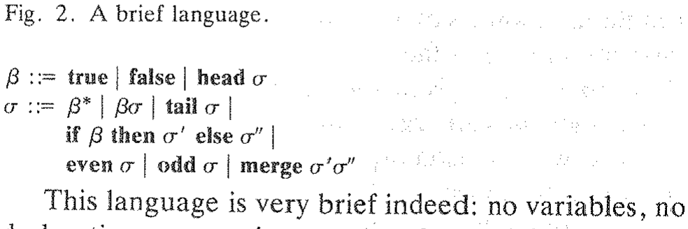
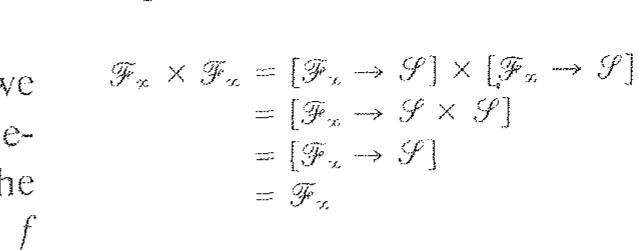
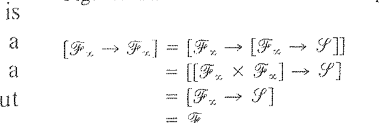

# 逻辑与程序设计语言

**Logic and Programming Languages**

> 达纳·斯科特(Dana S. Scott)
> 1976 年 ACM 图灵奖演讲(与 Michael Rabin 同获)
> 原载 *Communications of the ACM*, Vol. 20, No. 9 (1977 年 9 月), pp. 634–641
> 译自 ACM DL 扫描件 `1283920.1283932.pdf`(个人学习用途)

逻辑学长期以来一直关注某些问题的答案在原则上是否可计算，因为其结果为形式化的可能性设定了界限。最近，通过复杂性理论的发展，决策方法在时间效率上的精确比较已成为可能。然而，这些是逻辑在计算中的应用，而一个大问题是，逻辑的方法对于计算理论中更偏应用的部分是否在另一个方向上具有重要意义。

程序设计语言提供了一个显而易见的机会，因为它们的语法形式化已经非常先进；然而，语义理论很难说是完整的。虽然我们有很多例子，但我们仍需对这些疑问给出广泛的数学回答：什么是机器？什么是可计算过程？机器如何（或如何好地）模拟一个过程？程序自然地进入了对过程的描述中。定义程序的精确含义随后要求我们解释什么是计算对象（在某种程度上，是问题的静态部分）以及它们如何被转换（动态部分）。

到目前为止，自动机理论和网络理论虽然对动态部分非常有趣，但只形式化了该领域的一部分，而且可能过于集中在有限状态和代数方面。似乎对高级程序特性的理解涉及无限对象，并且必须经过几个解释层次，才能从概念想法转到在真实机器上的最终模拟。如果我们能找到合适的抽象来表示必要的结构，这些层次可以在数学上变得精确。

许多独立工作者在使用数据类型作为信息内容序下的格（或偏序）及其连续映射方法方面的经验，证明了这种方法在提供定义和证明方面的灵活性，这些定义和证明清晰且不依赖于实现。尽管如此，在展示抽象概念化如何（或不能）被实现之前，仍有很多工作要做，然后我们才能说我们拥有一个统一的理论。

作为第十一个半（eleven-and-one-half-th）图灵奖演讲者〔译注1〕，我非常高兴能与 Michael Rabin 分享这一奖项和这个讲坛。遗憾的是，自 1959 年撰写论文以来，我们没有太多合作的机会，这对我来说是一个巨大的损失。我最擅长合作，但要安排合适的条件并不容易——特别是在跨学科领域以及人们被国界隔开的情况下。但我一直以深厚的兴趣和钦佩关注着他的职业生涯。正如你们今天所听到的，Rabin 能够将逻辑中有关可判定性、可计算性和复杂性的思想应用于具有真正数学和计算意义的问题。他以及许多其他人正在积极为一大类算法问题创造新的分析方法，这在未来具有巨大的前景。然而，计算理论的这些方面完全超出了我的能力范围，因为多年来我的兴趣已与 Rabin 的兴趣分道扬镳。从 20 世纪 60 年代后期开始，我自己的工作集中在观察逻辑的思想是否可以用于对程序设计语言给出更好的概念理解。因此，我今天不会详细谈论我过去与 Rabin 的合作，而是谈谈我自己的发展以及对未来的一些计划和希望。

在委员会构建庞大的“通用”计算机语言期间，出现了获得语言精确全局视图的困难。我们现在似乎站在另一场技术革命的门口，在这场革命中，我们对机器和软件的想法将完全改变。（我刚刚注意到 ACM 正在再次开展运动，试图完全消除“机器”这个词。）大而全的语言可能被证明不太适应环境，但我认为语义问题肯定会保留下来。我想认为，再次与其他人合作完成的工作——最著名的是与已故的 Christopher Strachey〔译注2〕合作——对语义事业的基础做出了基本贡献。好吧，我们将拭目以待。我也希望语义研究不会太久地与像 Rabin 那样的调查保持脱节。

## 道歉与非道歉

通常，我认为公开演讲者不应该道歉：这只会让听众感到不舒服。然而，在这样的会议上，一个道歉是必要的（连同一个免责声明）。

你们中了解我背景的人可能会想起《名士》（*The Virtuoso*）一剧中的英雄 Nicholas Gimcrack 爵士。该剧由 Thomas Shadwell 于 1676 年编写，旨在嘲讽当时在伦敦皇家学会进行的非凡实验。在剧中的一个场景中，Nicholas 爵士被发现躺在桌子上，试图通过模仿碗中青蛙的动作来学习游泳。当被问及是否曾在水中练习过游泳时，他回答说他讨厌水，永远不会靠近水！“我满足于，”他说，“游泳的投机部分；我不在乎实际部分，我很少把任何东西付诸实用……知识是最终目的。”

虽然我们的最终目标是一样的，但我赶忙声明，我与那种蔑视实际的态度划清界限。然而，事实是我在当今的程序设计方面没有实际经验；出于必要，我不得不将自己局限于投机性编程，通过观察各种青蛙和其他生物来获得我能获得的二手知识。对我来说幸运的是，有些青蛙会说话。对于其中一些，我不得不学习一种陌生的语言，也许我还没有理解它们在做什么。但我尝试阅读并跟上发展，我为自己不是程序设计领域的专业人士而道歉，因此我当然不会尝试说教：过去的许多图灵奖演讲者对此都有很好的准备，他们给了我们非常好的建议。我尝试做的是，将逻辑中一些在我看来与计算相关的结果，让那些能够利用它们的人能够理解。我也尝试加入一些我自己的结果，我必须留给你们来判断我的活动有多成功。

非常幸运的是，今天我不必为缺乏已发表的材料而道歉；如果我在收到邀请的那天写这个演讲，我可能会道歉。但在 8 月份的《通讯》中，我们有 Robert Tennent [14] 关于指称语义的优秀教程论文，我非常热烈地推荐它作为起点。Tennent 不仅提供了远远超出 Strachey 和我曾经发表过的严肃例子，而且他还拥有一个组织良好的参考文献。

就在上个月，Milne 和 Strachey [9] 的那本厚书出版了。Strachey 令人震惊的突然且不合时宜的去世不幸地阻止了他开始修订手稿。由于 Strachey 的离去，我们在风格和洞察力（更不用说灵感）方面损失了很多，但 Robert Milne 出色地执行了他们的计划。这本书的重要性在于，它从头到尾推动了对一种复杂语言的讨论。有些人可能会觉得演示过于严谨，但关键是书中的语义不仅仅是投机，而是真实的东西。它是严肃且见多识广的思想产物；因此，人们有详细的证据来决定这种方法是否会富有成效。Milne 组织了论述，使人们可以在许多层次上掌握语言，直到最终的编译器。他没有试图回避任何困难。虽然不像 Strachey 在谈话中那样轻松和尖锐，但这本书是 Strachey 工作最后阶段的一个非常合适的纪念，它包含了 Milne 本人的许多原创贡献。（我可以这么说，因为我本人没有参与编写这本书。）

最近还出版了 Donahue [4] 的著作。这是一部不太长且非常易读的作品，讨论了前面提到的参考文献未涵盖或未从同一观点涵盖的问题。同样，它是完全独立于 Strachey 和我编写的，我很高兴看到它的出现。

Joe Stoy [13] 的教科书即将出版。这将补充这些其他作品，并且对于教学应该非常有用，因为 Stoy 在牛津大学和麻省理工学院都有丰富的讲课经验。

在基础方面，我自己的修订论文 (Scott [12]) 随时会在 *SIAM Journal on Computing* 上发表。由于它是从更“经典”的递归论中的枚举算子的观点编写的，它与实际计算的相关性起初可能根本不清楚。因此，我感到宽慰的是，这些其他参考文献以我预期的方式解释了该理论的用途。

幸运的是，上述所有作者都广泛引用了文献，因此我今天可以忽略进一步的历史细节。我只想说，许多其他人已经采用了 Strachey 和我的一些想法，你们不仅可以从这些参考文献中了解他们的工作，还可以从最近的两个会议论文集 Manes [7] 和 Böhm [1] 中了解。如果我尝试在这里列出名字，我只会遗漏一些——那些与我有过接触的人知道我多么感激他们的兴趣和贡献。

## 个人笔记

我出生在加利福尼亚州，20 世纪 50 年代初在伯克利读本科时开始研究数理逻辑。主要的影​​响当然是 Alfred Tarski 以及他在加州大学的许多同事和学生。在许多其他事情中，我从 Raphael 和 Julia Robinson 那里学习了递归函数论，我要感谢他们的无数见解。此外，当时通过自学，我发现了 Curry 和 Church 的 $\lambda$-演算（起初这确实让我做噩梦）。对我后来的想法特别重要的是对 Tarski 语义学及其对形式化语言真理定义的学习。如你所知，这些概念今天在自然语言哲学中仍在激烈辩论。我尝试将 Tarski 方法的精神延续到算法语言中，算法语言至少具有在语法上相当好地形式化的优势。我是否在 Strachey 的方案指导下（并由许多人完成）找到了正确的项的指称，是需要讨论的。我是第一个说并非所有问题都仅仅通过给某些语言提供指称就能解决的人。像（非常纯粹的）$\lambda$-演算这样的语言得到了很好的服务，但许多程序设计概念仍未涵盖。

我的研究生工作于 1958 年在普林斯顿大学完成，导师是 Alonzo Church，他也指导了 Michael Rabin 的论文。Rabin 和我当时相遇，但正是在 1957 年的一次 IBM 暑期工作中，我们完成了关于自动机理论的共同工作〔译注3〕。这很难说是在真空中进行的，因为许多人都在该领域工作；但我们确实设法将一些基本思想清晰地呈现出来。当时我肯定在考虑一个给出机器数学定义的项目。我现在觉得有限状态方法只是部分成功，没有太多的实际意义。诚然，许多物理机器可以建模为有限状态设备；但有限性很难说是最重要的特征，自动机的观点往往相当肤浅。

后来的两个发展使自动机对我来说变得更有趣，至少在数学上是这样：Chomsky 层次结构以及与半群的联系。从代数的观点来看（至少对我而言），Eilenberg——自动机理论的欧几里得——在他的书 [5] 中几乎说了最后一句话。我也注意到他避免了抽象范畴论。范畴可能会带来好的东西，但过早使用只会使事情变得太难理解。这是我个人的看法。

在某些方面，Chomsky 层次结构最终令人失望。上下文无关语言非常重要，每个人都必须学习它们，但我根本不清楚接下来会发生什么——如果有的话。还有很多其他语言家族，但混乱中并没有产生多少秩序。我不认为这里已经说了最后一句话。正是因为不知道该转向何处，并且对我认为过度复杂的东西感到不满，使我放弃了自动机理论的研究。我曾尝试以某种方式通过建议一种更系统地将机器与程序分离的方法来连接自动机和程序设计语言。Eilenberg 非常不喜欢这个想法，但我很高兴看到 Clark 和 Cowell [2] 最近的书，在 Peter Landin 的建议下，这个想法得到了很好的执行。我承认这不是代数，但在我看来它是（初级的，有些理论性的）程序设计。我想看到下一步，它将落在 Manna [8] 和 Milne-Strachey [9] 之间的某个地方。

正是在普林斯顿，我第一次接触到了真正的机器——现在几乎是史前的冯·诺依曼机器。我要为此感谢 Forman Acton。虽然现在看来过时了，但它仍然是真实的；Hale Trotter 和我从中获得了极大的乐趣。看到史密森尼博物馆里那具完全死去的尸体，没有任何迹象表明它活着时是什么样子，我确实感到非常难过。

从普林斯顿我去了芝加哥大学数学系教了两年书。虽然我当时遇到了 Bob Ashenhurst 和 Nick Metropolis，但我的逗留时间太短，无法向他们学习；而且像往常一样，系与系之间总是距离太远。（当然，既然我只写与计算的联系，我就不打算解释我在数学和逻辑方面的其他活动。）

从芝加哥我去了伯克利三年。在那里，我通过 Harry Huskey 和 René de Vogelaere 认识了许多计算机界人士，后者向我介绍了 Algol 60 的细节。然而，当时伯克利并没有专门的计算机科学系。出于个人原因，我很快决定搬到斯坦福大学。因此，虽然我在伯克利教了一个学期的计算理论课程，但我的工作并没有产生任何结果。关于伯克利和计算，我将永远遗憾的一件事是我从未了解 Dick 和 Emma Lehmer 工作的细节，因为我非常钦佩他们通过机器获得数论结果的方式。现在我们有了通过机器解决的四色问题，我们将看到大规模、特殊用途定理证明的巨大活动。我很遗憾没有参与其中。

斯坦福大学从 20 世纪 60 年代初就拥有全国最好的计算机科学系之一，这是大家公认的。你会奇怪我为什么要离开。答案可能是我的任命是哲学系和数学系之间的混合任命。我想我个人的困难在于知道我应该在哪里以及我想做什么。但撇开个人缺点不谈，我在 Forsythe 出色的系里有很好的联系，与研究生关系也很好，我们有很多生动的课程和研讨会。John McCarthy 和 Pat Suppes 以及他们小组的人对我和我的计算观点有很大影响。在逻辑方面，与我的同事 Sol Feferman 和 Georg Kreisel 一起，我们有一个非常活跃的小组。在逻辑系的许多博士生中，Richard Platek 的工作在几年后，当我看到如何使用他的一些想法时，对我产生了很大影响。

此时我在阿姆斯特丹休了一年假，这出乎意料地证明是我智力发展的转折点。我不会详述，因为故事很复杂；但 1968/69 学年对我来说是一个深刻的危机，回想起来仍然非常痛苦。然而，幸运的是，Pat Suppes 提议我加入 IFIP Working Group 2.2（现在称为程序设计概念的形式化描述）。当时 Tom Steel 是主席，正是在维也纳会议上我第一次见到了 Christopher Strachey。如果这个小组中争论的激烈程度有任何迹象的话，我真的很庆幸我没有参与像 Algol 委员会那样重要的任何事情。但我认为战斗是有治疗作用的：它带出了人们最好和最坏的一面。无论如何，学会保护自己是件好事。在各种战斗人员中，我最喜欢 Strachey 的风格和思想，尽管我认为他经常夸大其词；但他所说的说服了我应该学习更多。

直到我在阿姆斯特丹的那年年底，我才开始与 Jaco de Bakker 交谈，直到那个夏天的通信，我们的想法才有了明确的形式。我通过 WG 2.2 认识的维也纳 IBM 小组在这个阶段也影响了我。与此同时，我决定离开斯坦福去普林斯顿哲学系；但由于我和家人在欧洲，我申请了额外一个学期的假期，以便在 1969 年秋天访问牛津的 Strachey。那个学期对我来说是狂热活动的时期；事实上，有几天，我觉得自己好像患了某种真正的脑热。在那几周里与 Strachey 的合作是我职业生涯中最好的经历之一。第二年夏天我们在普林斯顿又重复了一次，尽管兴奋程度不同。遗憾的是，到 1972 年我永久来到牛津时，我们都忙于教学和行政职务，真正的合作几乎不可能。Strachey 也因为持续缺乏研究资金和教学帮助而变得非常沮丧，他基本上退出了，去和 Milne 一起写他的书。（这是一次巨大的努力，我认为这对他的健康没有任何好处；我多么希望他能看到它出版。）

回到 1969 年，我开始做的是向 Strachey 展示他完全错了，他应该以另一种方式做事。他最初是由 Roger Penrose 引起对 $\lambda$-演算的关注的，并发展出一种方便的风格，使用这种符号进行函数抽象来解释程序设计概念。然而，这是一种形式化的装置，我试图争辩说它没有数学基础。我以前讲过这个故事，所以长话短说，让我只说首先我实际上通过“优越的逻辑”说服了他放弃无类型的 $\lambda$-演算。但随后，随着我的建议一个接一个地产生结果，我开始看到可以在各种各样的空间上定义可计算函数。真正的步骤是看到函数空间是好的空间，我清楚地记得当时也在访问牛津的逻辑学家 Andrzej Mostowski 根本不相信我定义的这种函数空间具有构造性描述。但当我看到它们确实具有时，我开始怀疑使用函数空间的可能性可能比我们想象的更令人惊讶。一旦我对试图强加给 Strachey 的逻辑类型的强制刚性产生怀疑，不久我就发现其中一个空间与其自身的函数空间同构，这提供了“无类型” $\lambda$-演算的一个模型〔译注5〕。故事的其余部分见文献。

（关于 $\lambda$-演算的一个有趣插曲是 Alan Turing 的角色。他在普林斯顿跟随 Church 学习，并在 1936/37 年左右将可计算性与（形式化的）$\lambda$-演算联系起来。关于 Steve Kleene 如何看待他的工作（以及 $\lambda$-演算的进一步影响）的启发性细节可以在 Crossley [3] 中找到。（当然，图灵后来关于计算机的想法极大地影响了 Strachey，但现在不是进行完整历史分析的时候。）虽然我从未见过图灵（他于 1954 年去世），但通过 Church 和 Strachey 以及我现在的牛津同事 Les Fox 和 Robin Gandy 的二手联系相当密切，尽管到我在普林斯顿读研究生时，Church 已经不再研究 $\lambda$-演算了，我们从未讨论过他与图灵的经历。）

非常奇怪的是，我的 $\lambda$-演算模型没有早点被别人发现；但我感到非常鼓舞的是，现在正在发现具有新属性的新型模型，例如 Gordon Plotkin [10] 的“幂域”（powerdomains）。我个人深信，该领域无论是在理论方面还是在应用方面都已牢固确立。John Reynolds 和 Robert Milne 独立引入了一种证明等价性的新归纳方法，Robin Milner 关于 LCF 及其证明技术的一项有趣工作在爱丁堡继续进行。这种证明模型属性的方向是由 David Park 关于关联不动点算子和所谓的 $\lambda$-演算悖论组合子的定理开始的，它开启了对无限但可计算算子的研究，该研究现在沿着许多路线继续进行。另一个工作方向在诺夫哥罗德由 Yu.L. Ershov 进行，Karl H. Hofmann 及其小组向我指出了与拓扑代数的惊人联系。这里没有空间甚至无法开始列出许多贡献者。

展望未来几年，我特别高兴地在这次会议上报告，Tony Hoare 最近接受了牛津大学计算讲席教授的职位〔译注6〕，自 Strachey 去世后，该职位现已成为永久性的。这为合作开启了各种新的可能性，无论是与 Hoare 还是与他明年上任后将吸引的许多学生。而且，如你所知，牛津大学肯定会强调计算机语言的使用和设计以及程序设计方法论的实际方面（我赶忙补充，Strachey 也是这么做的），这都是好事；但理论研究也有极好的希望。

## 一些语义结构

现在转到技术细节，我想简要说明我的构造是如何进行的，以及它是如何接受相当大的变化的。在这里不可能争辩说这些是“正确的”抽象，这就是为什么提到那些容易获得的参考文献是一种解脱。

也许最快说明我所指内容的方法是由两个域提供的：$\mathscr{B}$，布尔值的域，以及 $\mathscr{S} = \mathscr{B}^\infty$，布尔值无限序列的域。第一个要点是，我们将接受偏函数的想法，在数学上通过不时给函数赋予偏值（partial values）来表示。就 $\mathscr{B}$ 而言，这个想法非常琐碎：我们写

$$\mathscr{B} = \{true, false, \perp\}$$

其中 $\perp$ 是一个额外的元素，称为“未定义”。为了让 $\perp$ 各就其位，我们在域 $\mathscr{B}$ 上施加一个偏序 $\sqsubseteq$，其中

当且仅当 $x = \perp$ 或 $x = y$ 时，$x \sqsubseteq y$，

对于所有 $x, y \in \mathscr{B}$。在这里 $\mathscr{B}$ 中这并不意味着全部，但我们可以将“$\sqsubseteq$”读作 $x$ 的信息内容包含在 $y$ 的信息内容中。因此，元素 $\perp$ 具有空的信息内容。该方案如图 1 所示。

**图 1. 布尔值。**

〔图 1 缺失说明：原刊该位置的布尔值格图（$\perp \sqsubseteq x$ 对一切 $x \in \mathscr{B}$）在所用扫描件中未出现（正文与图题之间为空白，全页无对应图形），故无法恢复为图片。〕〔译注10〕

（顺便提一句：在许多出版物中，我一直主张使用格，作为偏序，格既有“顶”元素 $\top$ 也有“底”元素 $\perp$，这样我们可以断言对于域的所有元素都有 $\perp \sqsubseteq x \sqsubseteq \top$。由于许多我无法在这里详述的原因，这个建议并没有被很好地接受。关于其合理性的一些讨论可以在 Scott [12] 中找到，但当然那里研究的结构是特殊的。可能最好既不排除也不包括 $\top$；并且，为了简单起见，我今天将不再提及它。）

现在看序列域 $\mathscr{S}$，我们将采用一种简写符号，其中下标表示坐标；因此，

$$x = \langle x_n \rangle_{n=0}^\infty$$

对于所有 $x \in \mathscr{S}$。每一项都满足 $x_n \in \mathscr{B}$，因为 $\mathscr{S} = \mathscr{B}^\infty$。从技术上讲，旨在实现结构的“直积”，因此我们通过以下方式在 $\mathscr{S}$ 上定义 $\sqsubseteq$：

对于所有 $n$，$x \sqsubseteq y$ 当且仅当 $x_n \sqsubseteq y_n$。

直观地说，序列 $y$ 在信息上比序列 $x$ “更好”，当且仅当 $x$ 的一些“未定义”坐标在从 $x$ 转到 $y$ 时已变为“已定义”。例如，以下每个序列都与后续序列处于 $\sqsubseteq$ 关系中：

$\langle \perp, \perp, \perp, \perp, \dots \rangle$,
$\langle true, \perp, \perp, \perp, \dots \rangle$,
$\langle true, false, \perp, \perp, \dots \rangle$,
$\langle true, false, true, \perp, \dots \rangle$.

显然，这个列表可以无限扩展，而且也没有必要按严格的顺序 $n = 0, 1, 2 \dots$ 处理坐标。因此，$\mathscr{S}$ 上的 $\sqsubseteq$ 关系比 $\mathscr{B}$ 上原始的 $\sqsubseteq$ 复杂得多。

$\mathscr{B}$ 和 $\mathscr{S}$ 之间的一个明显区别是 $\mathscr{B}$ 是有限的，而 $\mathscr{S}$ 有无限多个元素。在 $\mathscr{S}$ 中，某些元素也具有无限的信息内容，而在 $\mathscr{B}$ 中则不然。然而，我们可以利用 $\mathscr{S}$ 中的偏序来抽象地解释我们所说的“有限近似”和“极限”是什么意思。上面列出的序列在 $\mathscr{S}$ 中是有限的，因为它们只有有限多个坐标不同于 $\perp$。给定任何 $x \in \mathscr{S}$，我们可以通过定义将其削减为有限元素

$$(x \upharpoonright m)_n = \begin{cases} x_n, & \text{如果 } n < m; \\ \perp, & \text{否则.} \end{cases}$$

从我们的定义中很容易看出

$$x \upharpoonright m \sqsubseteq x \upharpoonright (m + 1) \sqsubseteq x,$$

因此 $x \upharpoonright m$ 正在“累积”到一个极限；事实上，那个极限就是原始的 $x$。我们将其写为

$$x = \bigsqcup_{m=0}^\infty (x \upharpoonright m),$$

其中 $\bigsqcup$ 是偏序集 $\mathscr{S}$ 中的上确界或最小上界操作。关键是 $\mathscr{S}$ 有很多上确界；并且，每当我们有 $\mathscr{S}$ 中的元素 $y^{(m)} \sqsubseteq y^{(m+1)}$（无论它们是否有限），我们都可以定义“极限” $z$，其中

$$z = \bigsqcup_{m=0}^\infty y^{(m)}.$$

（提示：问问你自己 $z$ 的坐标必须是什么。）我们不能在这里重新讨论细节，但 $\mathscr{S}$ 确实是一个拓扑空间，而 $z$ 确实是一个极限。因此，虽然 $\mathscr{S}$ 是无限的，但很有可能我们可以让操作回退到有限操作，并能够讨论 $\mathscr{S}$ 以及更复杂域上的可计算操作。

除了 $\mathscr{S}$ 上的序列和偏序结构外，我们还可以定义许多种代数结构。这就是为什么 $\mathscr{S}$ 是一个很好的例子。例如，在同构意义下，该空间满足

$$\mathscr{S} \cong \mathscr{S} \times \mathscr{S},$$

其中右侧旨在表示通常的二元直积。抽象地，域 $\mathscr{S} \times \mathscr{S}$ 由所有有序对 $\langle x, y \rangle$ 组成，其中 $x, y \in \mathscr{S}$，我们在 $\mathscr{S} \times \mathscr{S}$ 上定义 $\sqsubseteq$ 为

$\langle x, y \rangle \sqsubseteq \langle x', y' \rangle$ 当且仅当 $x \sqsubseteq x'$ 且 $y \sqsubseteq y'$。

但出于所有实际目的，将 $\langle x, y \rangle$ 与 $\mathscr{S}$ 中已有的序列等同起来并无大碍；事实上，在坐标方面我们可以定义

$$\langle x, y \rangle_n = \begin{cases} x_k, & \text{如果 } n = 2k; \\ y_k, & \text{如果 } n = 2k + 1. \end{cases}$$

上述对对之间 $\sqsubseteq$ 的标准将得到验证，我们可以说 $\mathscr{S}$ 具有一个（双射）配对函数。

$\mathscr{S}$ 上的配对函数 $\langle \cdot, \cdot \rangle$ 具有许多有趣的属性。实际上我们已经注意到它是单调的（直观地说：当你增加 $x$ 和 $y$的信息内容时，你就增加了 $\langle x, y \rangle$ 的信息内容）。更重要的是，$\langle \cdot, \cdot \rangle$ 在以下精确意义上是连续的：

$$\langle x, y \rangle = \bigsqcup_{m=0}^\infty \langle x \upharpoonright m, y \upharpoonright m \rangle,$$

这意味着 $\langle \cdot, \cdot \rangle$ 在取有限近似下表现良好。这只是一个例子；单调和连续函数的整个理论对于这种方法非常重要。

即使我们在 $\mathscr{S}$ 上只放了少量的结构，一种语言也会浮现出来。为了说明起见，我们集中讨论 $\mathscr{S}$ 满足的两个同构；即 $\mathscr{S} \cong \mathscr{B} \times \mathscr{S}$ 和 $\mathscr{S} \cong \mathscr{S} \times \mathscr{S}$。第一个确定了 $\mathscr{S}$ 与布尔值（无限）序列有关；而第二个提醒我们上面关于配对函数的讨论。在图 2 中，我们列出了具有两种表达式的语言的简要 BNF 定义：布尔型（$\beta$）和序列型（$\sigma$）。

**图 2. 简要语言。**
$\beta ::= true \mid false \mid \mathbf{head} \sigma$
$\sigma ::= \beta^* \mid \beta \sigma \mid \mathbf{tail} \sigma \mid$
$\quad \mathbf{if} \beta \mathbf{then} \sigma' \mathbf{else} \sigma'' \mid$
$\quad \mathbf{even} \sigma \mid \mathbf{odd} \sigma \mid \mathbf{merge} \sigma' \sigma''$

这种语言确实非常简短：没有变量，没有声明，没有赋值，只有一小部分常量项。请注意，所选的符号旨在使这些表达式的含义显而易见。因此，如果 $\sigma$ 表示一个序列 $x$，那么 $\mathbf{head} \sigma$ 必须表示序列 $x$ 的第一项 $x_0$〔译注8〕。由于 $x_0 \in \mathscr{B}$ 且 $x \in \mathscr{S}$，我们保持了类型的正确。

更精确地说，对于每个表达式，我们可以定义其（常量）值 $\llbracket \cdot \rrbracket$；使得对于布尔表达式 $\beta$，$\llbracket \beta \rrbracket \in \mathscr{B}$，而对于序列表达式 $\sigma$，$\llbracket \sigma \rrbracket \in \mathscr{S}$〔译注8〕。由于 BNF 语言定义中有十个子句，我们将不得不列出十个方程来完全指定该示例的语义；我们在这里仅满足于选定的方程。继续上一段的评论：

$$\llbracket \mathbf{head} \sigma \rrbracket = \llbracket \sigma \rrbracket_0.$$

另一方面，表达式 $\beta^*$ 创建一个布尔值的无限序列：

$$\llbracket \beta^* \rrbracket = \langle \llbracket \beta \rrbracket, \llbracket \beta \rrbracket, \llbracket \beta \rrbracket, \dots \rangle.$$

（这种表示法虽然粗略，但很清晰。）同样地：

$$\llbracket \beta \sigma \rrbracket = \langle \llbracket \beta \rrbracket, \llbracket \sigma \rrbracket_0, \llbracket \sigma \rrbracket_1, \llbracket \sigma \rrbracket_2, \dots \rangle;$$

而我们有

$$\llbracket \mathbf{tail} \sigma \rrbracket = \langle \llbracket \sigma \rrbracket_1, \llbracket \sigma \rrbracket_2, \llbracket \sigma \rrbracket_3, \dots \rangle.$$

再进一步：

$$\llbracket \mathbf{even} \sigma \rrbracket = \langle \llbracket \sigma \rrbracket_0, \llbracket \sigma \rrbracket_2, \llbracket \sigma \rrbracket_4, \dots \rangle;$$

以及

$$\llbracket \mathbf{merge} \sigma' \sigma'' \rrbracket = \langle \llbracket \sigma' \rrbracket, \llbracket \sigma'' \rrbracket \rangle.$$

这些应该足以给出想法。还应该清楚的是，我们所拥有的实际上只是一个选择，因为 $\mathscr{S}$ 满足更多的同构（例如，$\mathscr{S} \cong \mathscr{S} \times \mathscr{S} \times \mathscr{S}$），并且有很多很多方法可以拆分和重新组合布尔值序列——所有这些都是以相当可计算的方式进行的。

## 函数空间

不应得出前一节包含了我全部想法的结论：这将使我们停留在程序模式（program schemes）的初级水平（例如 van Emden-Kowalski [6] 或 Manna [8]（最后一章））。有些人所谓的“不动点语义”（我本人不喜欢缩写词“fixpoint”）只是第一章。第二章已经包括了将过程作为参数的过程——高阶过程——我们已经远远超出了程序模式。诚然，不动点技术可以应用于这些高阶过程，但这并不是支持它们的唯一理由。使之明确所需的语义结构是函数空间。我从 1969 年开始就试图强调这一点，但许多人对我理解得不够。

假设 $\mathscr{D}'$ 和 $\mathscr{D}''$ 是我们一直在讨论的那种域（比如 $\mathscr{B}$ 或 $\mathscr{B} \times \mathscr{B}$ 或 $\mathscr{S}$ 或更糟的东西）。通过 $[\mathscr{D}' \to \mathscr{D} '']$，让我们理解从 $\mathscr{D}'$ 映射到 $\mathscr{D}''$ 的所有单调且连续函数 $f$ 的域。这就是我所说的函数空间。这在数学上并不那么困难，但 $[\mathscr{D}' \to \mathscr{D}'']$ 再次是“同一种”域（尽管公认具有更复杂的结构）也并不那么显而易见。我无法在这里证明它，但至少我可以在函数空间上定义 $\sqsubseteq$ 关系：

$f \sqsubseteq g$ 当且仅当对于所有 $x \in \mathscr{D}'$，$f(x) \sqsubseteq g(x)$。

将函数视为抽象对象并不是什么新鲜事；需要检查的是它们是否也是相当合理的计算对象。$[\mathscr{D}' \to \mathscr{D}'']$ 上的 $\sqsubseteq$ 关系是检查这一点的第一步，它导致了一个定义良好的函数有限近似的概念。（抱歉！这里没有时间更精确了。）当看到这一点时，通往函数空间迭代的道路就敞开了；如在 $[[\mathscr{D}' \to \mathscr{D}''] \to \mathscr{D}''']$ 中。这并不像起初看起来那么疯狂，因为我们的理论将 $f(x)$ 识别为变量 $f$ 和变量 $x$ 的可计算二元函数。因此，作为一个操作，它可以被视为函数空间的一个元素：

$$[[\mathscr{D}' \to \mathscr{D}''] \times \mathscr{D}'] \to \mathscr{D}''.$$

这只是这些算子（或组合子，如 Curry 和 Church 所称）理论的开始。

吞下这一切，让我们尝试从 $\mathscr{S}$ 开始进行函数空间的无限迭代。我们定义 $\mathscr{F}_0 = \mathscr{S}$ 且 $\mathscr{F}_{n+1} = [\mathscr{F}_n \to \mathscr{S}]$。因此 $\mathscr{F}_1 = [\mathscr{S} \to \mathscr{S}]$ 且

$$\mathscr{F}_2 = [[\mathscr{S} \to \mathscr{S}] \to \mathscr{S}].$$

你只需要相信我，这一切都是高度构造性的（因为我们只使用连续函数）。

很明显，这在某种自然意义上是累积的。首先，$\mathscr{S}$ 作为子空间“包含在” $[\mathscr{S} \to \mathscr{S}]$ 中：将每个 $x \in \mathscr{S}$ 与 $[\mathscr{S} \to \mathscr{S}]$ 中相应的常数函数等同起来。显然，根据我们的定义，这是一种保序对应。此外，每个 $f \in [\mathscr{S} \to \mathscr{S}]$ 都由一个常数（粗略地）近似，即 $f(\perp)$（这是所有值 $f(x)$ 的“最佳”元素 $\sqsubseteq$）。子空间和空间之间近似的这种关系将表示为 $\mathscr{S} \lhd [\mathscr{S} \to \mathscr{S}]$。

我们可以说

$$[\mathscr{S} \to \mathscr{S}] \lhd [[\mathscr{S} \to \mathscr{S}] \to \mathscr{S}],$$

但现在是出于不同的原因。一旦我们确定了为什么 $\mathscr{S} \lhd [\mathscr{S} \to \mathscr{S}]$ 的原因，我们就必须尊重更高层 $\mathscr{F}_n$ 的函数空间结构。在特殊情况下，假设 $f \in [\mathscr{S} \to \mathscr{S}]$。我们想将 $f$ 注入下一个空间，所以称之为 $i(f) \in [[\mathscr{S} \to \mathscr{S}] \to \mathscr{S}]$。如果 $g$ 是 $[[\mathscr{S} \to \mathscr{S}] \to \mathscr{S}]$ 中的任何元素，我们被要求定义 $i(f)(g) \in \mathscr{S}$。现在，由于 $g \in [\mathscr{S} \to \mathscr{S}]$，我们有原始的向后投影 $j(g) = g(\perp) \in \mathscr{S}$。因此，由于这是我们在 $\mathscr{S}$ 中能得到的对 $g$ 的最佳近似，我们只能定义

$$i(f)(g) = f(j(g)).$$

这给出了下一个映射 $i: \mathscr{F}_1 \to \mathscr{F}_2$。为了定义相应的投影 $j: \mathscr{F}_2 \to \mathscr{F}_1$，我们以类似的方式论证并定义

$$j(\phi)(x) = \phi(i(x)),$$

其中我们有 $\phi \in [[\mathscr{S} \to \mathscr{S}] \to \mathscr{S}]$，而 $i(x) \in [\mathscr{S} \to \mathscr{S}]$ 是值为 $x$ 的常数函数。考虑到这种进展，在定义 $i: \mathscr{F}_2 \to \mathscr{F}_3$ 和 $j: \mathscr{F}_3 \to \mathscr{F}_2$ 等方面使用完全类似的方案没有困难，从而给出了累积的精确含义：

$$\mathscr{F}_0 \lhd \mathscr{F}_1 \lhd \mathscr{F}_2 \lhd \dots \lhd \mathscr{F}_n \lhd \mathscr{F}_{n+1} \lhd \dots$$

有了这一切，不传递到极限（这次是空间极限）将是一件遗憾的事，而这正是我想让你们接受的。通过规定存在一个空间

$$\mathscr{F}_\infty = \lim_{n \to \infty} \mathscr{F}_n$$

得到什么？由于各个阶段的交互如下：

$$\mathscr{F}_{n+1} = [\mathscr{F}_n \to \mathscr{S}],$$

猜测

$$\mathscr{F}_\infty \cong [\mathscr{F}_\infty \to \mathscr{S}]$$

成立（至少在同构意义下）并不那么奇怪。它确实成立，但我只能指出这种同构的原因（和合理性）的梗概。首先，各个空间 $\mathscr{F}_n$ 已被一个接一个地放置，这不仅形成了一个空间塔，而且还将组合 $f(x)$ 尊重为两个变量的代数操作。$\mathscr{F}_\infty$ 在精确意义上是 $\mathscr{F}_n$ 并集的完备化；也就是说，在这些空间内，我们可以想到函数塔，每个函数都近似于下一个（通过使用 $i$ 和 $j$ 映射），使得在 $\mathscr{F}_\infty$ 中这些塔被赋予极限。如果塔被截断，那么我们可以争辩说每个空间 $\mathscr{F}_n \lhd \mathscr{F}_\infty$。

现在为什么在 $\mathscr{F}_\infty$ 上有同构？取 $[\mathscr{F}_\infty \to \mathscr{S}]$ 中的一个函数（连续的！）。根据其连续性，它将由它对有限层 $\mathscr{F}_n$ 的作用决定。也就是说，它在 $[\mathscr{F}_n \to \mathscr{S}] = \mathscr{F}_{n+1}$ 中会有越来越好的近似；因此，近似“居住”在 $\mathscr{F}_\infty$ 的有限层中。它们的极限应该正好给我们返回我们开始时的函数 $[\mathscr{F}_\infty \to \mathscr{S}]$。以同样的方式，$\mathscr{F}_\infty$ 中的任何元素都可以被视为 $[\mathscr{F}_n \to \mathscr{S}]$ 空间中近似函数的极限。诚然，有细节需要检查；但在极限情况下，$\mathscr{F}_\infty$ 和 $[\mathscr{F}_\infty \to \mathscr{S}]$ 之间没有真正的区别：无限层的高阶函数就是它自己的函数空间。（一如既往：这是连续性的结果。）

这里潜伏着很多结构；事实上比我起初想的还要多。在图 3 中，我说明了一个同构链，它表明 $\mathscr{F}_\infty$ 获得了我们已经熟悉的 $\mathscr{S}$ 的大部分特征。这些之所以有效的原因如下。首先，我们将 $\mathscr{F}_\infty$ 视为一个函数空间。现在，函数对可以同构地与承担成对值的函数建立对应关系。但 $\mathscr{S} \times \mathscr{S} \cong \mathscr{S}$，正如我们已经知道的那样。最后一步只是将 $\mathscr{F}_\infty$ 上的函数放回 $\mathscr{F}_\infty$ 的元素。

**图 3. 第一个同构链。**
$\mathscr{F}_\infty \times \mathscr{F}_\infty \cong [\mathscr{F}_\infty \to \mathscr{S}] \times [\mathscr{F}_\infty \to \mathscr{S}]$
$\quad \cong [\mathscr{F}_\infty \to \mathscr{S} \times \mathscr{S}]$
$\quad \cong [\mathscr{F}_\infty \to \mathscr{S}]$
$\quad \cong \mathscr{F}_\infty$

利用图 3 的同构，我们可以获得图 4 所示的进一步结果。原因相当清楚。取一个从 $\mathscr{F}_\infty$ 到 $\mathscr{F}_\infty$ 的函数。该函数的值可以解释为函数。但考虑到一个其值为函数的函数（在空间同构意义下）只是一个具有两个参数的函数。正如我们在图 3 中看到的，$\mathscr{F}_\infty \times \mathscr{F}_\infty \cong \mathscr{F}_\infty$，因此我们获得了最终的简化（在同构意义下）。

**图 4. 第二个同构链。**
$[\mathscr{F}_\infty \to \mathscr{F}_\infty] \cong [\mathscr{F}_\infty \to [\mathscr{F}_\infty \to \mathscr{S}]]$
$\quad \cong [\mathscr{F}_\infty \times \mathscr{F}_\infty \to \mathscr{S}]$
$\quad \cong [\mathscr{F}_\infty \to \mathscr{S}]$
$\quad \cong \mathscr{F}_\infty$

我们所做的是勾勒出为什么 $\mathscr{F}_\infty$（无限类型函数的空间）是 $\lambda$-演算的一个模型。$\lambda$-演算是一种语言（此处未说明），其中每个项都可以被视为同时表示一个参数（或值）和一个函数。形式细节非常简单，但语义细节正是我们一直在研究的：空间 $\mathscr{F}_\infty$ 的每个元素都可以同时被视为空间 $[\mathscr{F}_\infty \to \mathscr{F}_\infty]$ 的一个元素；因此，$\mathscr{F}_\infty$ 提供了一个模型，但它只是众多模型中的一个。

在无法明确说明的情况下，为一种纯粹的过程语言（还有图 2 中的对和所有其他东西）勾勒了指称（或数学）语义。在引用的关于真实程序设计语言的参考文献中，添加了所有其他特性（赋值、顺序、声明等）。在这些参考文献中已经确立的是，语义定义的方法确实有效。我希望你们能研究一下。

## 参考文献

1. Böhm, C., Ed. *$\lambda$-Calculus and Computer Science Theory*. Lecture Notes in Computer Science, Vol. 37, Springer-Verlag, New York, 1975.
2. Clark, K.L., and Cowell, D.F. *Programs, Machines, and Computation*. McGraw-Hill, New York, 1976.
3. Crossley, J.N., ed. *Algebra and Logic*. Papers from the 1974 Summer Res. Inst. Australian Math. Soc., Monash U. Clayton, Victoria, Australia. Lecture Notes in Mathematics, Vol. 450, Springer-Verlag, New York, 1975.
4. Donahue, J.E. *Complementary Definitions of Programming Language Semantics*. Lecture Notes in Computer Science, Vol. 42, Springer-Verlag, 1976.
5. Eilenberg, S. *Automata, Languages, and Machines*. Academic Press, New York, 1974.
6. van Emden, M.H., and Kowalski, R.A. The semantics of predicate logic as a programming language. *J. ACM 23*, 4 (Oct. 1976), 733-742.
7. Manes, E.G., Ed. *Category Theory Applied to Computation and Control*. First Int. Symp. Lecture Notes in Computer Science, Vol. 25, Springer-Verlag, New York, 1976.
8. Manna, Z. *Mathematical Theory of Computation*. McGraw-Hill, New York, 1974.
9. Milne, R., and Strachey, C. *A Theory of Programming Language Semantics*. Chapman and Hall, London, and Wiley, New York, 2 Vols., 1976.
10. Plotkin, G.D. A powerdomain construction. *SIAM J. Comptng. 5* (1976), 452-487.
11. Rabin, M.O., and Scott, D.S. Finite automata and their decision problems. *IBM J. Res. and Develop. 3* (1959), 114-125.
12. Scott, D.S. Data types as lattices. *SIAM J. Comptng. 5* (1976), 522-587.
13. Stoy, J.E. *Denotational Semantics: The Scott-Strachey Approach to Programming Language Theory*. M.I.T. Press, Cambridge, Mass. 1977.〔译注9〕
14. Tennent, R.D. The denotational semantics of programming languages. *Comm. ACM 19*, 8 (Aug. 1976), 437-453.

---

## 译注

**文本与翻译说明**

1. 〔译注1〕 Scott 在演讲开头自称“第十一个半”（eleven-and-one-half-th）图灵奖演讲者，是因为 1976 年的奖项由他与 Michael Rabin 共同获得。在图灵奖历史上，这是第二次由两人分享奖项（第一次是 1975 年的 Newell 和 Simon）。
2. 〔译注2〕 Christopher Strachey (1916–1975)，英国计算机科学家，指称语义学（Denotational Semantics）的奠基人之一。他于 1975 年因病突然去世，Scott 在此表达了深切的哀悼。

**背景与文化注**(译者补注,原文无)

3. 〔译注3〕 Rabin-Scott 1959 论文：即参考文献 [11] *Finite automata and their decision problems*。这篇论文引入了非确定性有限自动机（NFA）的概念，并证明了它与确定性有限自动机（DFA）的等价性，是计算理论的奠基性工作。Scott 和 Rabin 因此获得 1976 年图灵奖。
4. 〔译注4〕 域理论（Domain Theory）：Scott 在 20 世纪 60 年代末为了给 $\lambda$-演算提供数学模型而创立的理论。它使用偏序集（特别是格）来表示计算过程中的信息累积，是现代程序设计语言语义学的基础。
5. 〔译注5〕 $D_\infty$ 模型：Scott 在 1969 年发现的第一个无类型 $\lambda$-演算的数学模型。在此之前，人们普遍认为由于康托尔对角线论证，不存在与其自身函数空间同构的非平凡集合。Scott 通过引入连续函数和拓扑结构解决了这一矛盾。
6. 〔译注6〕 Tony Hoare (1934– )，公理语义学（Hoare Logic）的创立者，1980 年图灵奖得主。他于 1977 年接替去世的 Strachey 担任牛津大学计算讲席教授。
7. 〔译注7〕 提到的学者：Alonzo Church ($\lambda$-演算创立者)，Haskell Curry (组合逻辑奠基人)，Alfred Tarski (模型论奠基人)，Gordon Plotkin (幂域理论提出者)。

**OCR 与印刷勘误**

8. 〔译注8〕 扫描件中数学符号 OCR 损毁严重：$\sqsubseteq$ 常被识别为 `c` 或 `r-`，$\bigsqcup$ 被识别为 `LI` 或 `U`，$\mathscr{S}$ 被识别为 `S` 或 `J`，$\mathscr{B}$ 被识别为 `B` 或 `27/3`。本译文已对照原刊页面图像全部校正为 LaTeX 格式。
9. 〔译注9〕 参考文献 [13] 在原刊中标记为 "To appear"，实际出版于 1977 年。
10. 〔译注10〕 原刊三幅插图已从扫描页中裁剪提取为 PNG 并内嵌于正文相应位置（见 zh/assets/1976-scott/）：图 2 为简要语言的 BNF 语法定义（本 PDF 第 6 页），图 3 与图 4 为两个同构链（第 7 页右栏）。图 1（布尔值）在扫描件中缺失，无法恢复。
