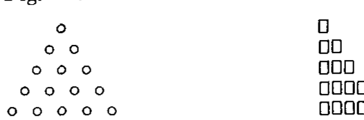
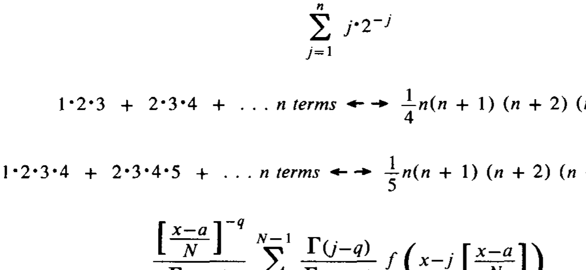

# 作为思维工具的记号

**Notation as a Tool of Thought**

> 作者 肯尼斯·艾佛森（Kenneth E. Iverson）
> 1979 年 ACM 图灵奖演讲
> 原载 *Communications of the ACM*, Vol. 23, No. 8 (1980 年 8 月), pp. 444–465
> 译自 `1283920.1283935.pdf`（个人学习用途）

〔1979 年 ACM 图灵奖由奖项委员会主席 Walter Carlson〔译注6〕在 1979 年 10 月 29 日于密歇根州底特律举行的 ACM 年度会议上授予肯尼斯·艾佛森（Kenneth E. Iverson）。

在评选中，通用技术成就奖委员会表彰了艾佛森在编程语言和数学记号方面的开创性努力，其成果即为当今计算领域所熟知的 APL。委员会还提到了艾佛森在交互式系统实现、APL 的教学应用以及编程语言理论与实践方面的贡献。

艾佛森出生并成长于加拿大，1954 年在哈佛大学获得博士学位。1955 年至 1960 年，他在哈佛担任应用数学助理教授。随后他加入国际商业机器公司（IBM），并于 1970 年因对 APL 开发的贡献被授予“IBM 院士”（IBM Fellow）称号。

艾佛森博士目前就职于多伦多的 I.P. Sharp Associates 公司。他发表了大量关于编程语言的文章，并撰写了四本关于编程与数学的著作：《一种编程语言》（*A Programming Language*, 1962）、《初等函数》（*Elementary Functions*, 1966）、《代数：一种算法化的处理方式》（*Algebra: An Algorithmic Treatment*, 1972）以及《初等分析》（*Elementary Analysis*, 1976）。〕

---

术语、记号和语言作为思维工具的重要性早已为人所知。例如在化学和植物学中，拉瓦锡（Lavoisier）和林奈（Linnaeus）建立的命名体系极大地刺激并引导了后来的研究。关于语言，乔治·布尔（George Boole）在其《思维规律》（*Laws of Thought*）[1, p. 24] 中断言：“语言是人类理性的工具，而不仅仅是表达思想的媒介，这是一个被普遍承认的真理。”〔译注1〕

数学记号或许是自觉地将语言用作思维工具的最著名且最成熟的例子。数学家们对记号重要作用的认可，从卡约里（Cajori）的《数学记号史》（*A History of Mathematical Notations*）[2, pp. 332, 331]〔译注5〕中引用的数学家语录中可见一斑。这些语录非常值得全文阅读，以下摘录暗示了其基调：

> 通过减轻大脑所有不必要的工作，良好的记号使大脑能够自由地专注于更高级的问题，并实际上增加了人类的精神力量。
> —— A.N. 怀特海（A.N. Whitehead）〔译注2〕

> 代数符号在狭小空间内压缩的意义量，是促进我们习惯于借助它们进行推理的另一个因素。
> —— 查尔斯·巴贝奇（Charles Babbage）〔译注3〕

然而，数学记号存在严重的缺陷。特别是它缺乏通用性，必须根据主题、作者甚至即时上下文进行不同的解释。编程语言因为是为指挥计算机而设计的，作为思维工具具有重要的优势。它们不仅是通用的（通用目的），而且是可执行且无歧义的。可执行性使得利用计算机对以编程语言表达的想法进行广泛实验成为可能，而无歧义性则使精确的思想实验成为可能。但在其他方面，大多数编程语言显然逊色于数学记号，很少以应用数学家认为重要的方式被用作思维工具。

本文的论点是，编程语言中发现的可执行性和通用性优势可以有效地与数学记号提供的优势结合在单一、连贯的语言中。本文分四个阶段展开：

(a) 第 1 节确定数学记号的显著特征，并使用简单问题说明如何在可执行记号中提供这些特征。
(b) 第 2 节和第 3 节通过对一组选定主题的深入处理继续这种说明，这些主题具有普遍的兴趣和实用性。第 2 节涉及多项式，第 3 节涉及与许多主题相关的函数表示之间的转换，包括排列和有向图。虽然这些主题可能被归类为数学，但它们与计算机编程直接相关，随着编程继续发展成为一门正统的数学学科，它们的相关性将会增加。
(c) 第 4 节提供了恒等式和形式化证明的例子。其中许多形式化证明涉及前几节中非正式建立并使用的恒等式。
(d) 结论部分提供了一些与数学记号的一般比较、对其他主题处理方式的引用，以及对在上下文中引入记号问题的讨论。

所使用的可执行语言是 APL，这是一种通用语言，起源于在写作和教学中提供清晰精确表达的尝试，并且仅在经过数年的使用和开发后才作为编程语言实现 [3]〔译注4〕。

虽然许多读者可能不熟悉 APL，但我选择不提供单独的介绍，而是根据需要在上下文中引入它〔译注9〕。数学记号总是以这种方式引入，而不是像编程语言通常那样在单独的课程中教授。适用于任何主题的思维工具记号应当允许在该主题的上下文中轻松引入；在这里引入 APL 的一个优势是读者可以评估这种引入的相对难度。

然而，在上下文中引入与对每个记号的所有细微差别进行完整讨论是不相容的，读者必须准备好根据后续使用的需要，以明显且系统的方式扩展定义，或者查阅参考资料。本文使用的所有记号都总结在附录 A 中，并在《APL 语言》（*APL Language*）[4] 的第 24-60 页中有详细介绍。

拥有 APL 计算机实现手段的读者可能希望将此处以直接定义形式 [5, p. 10]（使用 `⍺` 和 `⍵` 分别代表左、右参数）给出的函数定义转换为执行所需的规范形式。附录 B 中给出了一个自动执行此转换的函数。

## 1. 记号的重要特征

除了引言中强调的可执行性和通用性外，良好的记号还应体现任何数学记号使用者所熟悉的特征：

* 易于表达问题中出现的构造。
* 启发性（Suggestivity）。
* 能够从属于细节（Subordinate detail）。
* 经济性。
* 易于进行形式化证明。

上述列表并非旨在详尽无遗，但将用于构建随后的讨论。

所引入记号的无歧义可执行性仍然很重要，并将通过在表达式下方显示其产生的显式结果来强调。为了保持表达式与结果之间的区别，表达式将像在 APL 计算机上那样自动缩进。例如，由 `⍳` 表示的整数函数在应用于参数 `n` 时产生前 `n` 个整数的向量，而由 `+/` 表示的求和归约（sum reduction）产生其向量参数的元素之和，显示如下：

```apl
      ⍳ 5
1 2 3 4 5
      +/⍳ 5
15
```

我们将使用一个不可执行的记号：出现在两个表达式之间的符号 `↔` 断言它们的等价性。

### 1.1 易于表达问题中出现的构造

如果记号要作为有效的思维工具，它必须不仅能方便地表达直接源自问题的概念，还能表达在随后的分析、泛化和特化中出现的概念。

例如，考虑图 1 所示的水晶结构，其中连续的原子层不是直接叠放在一起，而是“紧密堆积”在下方原子之间。因此，图 1 中从顶部开始的各行原子数由 `⍳ 5` 给出，总数由 `+/⍳ 5` 给出。



**图 1**：原子密堆积（晶体结构）示意图。

这种水晶的三维结构也是紧密堆积的；位于图 1 所在平面上方的原子将位于其下方平面的原子之间，并且其底层行将有四个原子。因此，对应于图 1 的完整三维结构是一个四面体，其各平面的底层长度分别为 1、2、3、4 和 5。因此，连续平面中的原子数是向量 `⍳ 5` 的部分和，即第一个元素的和、前两个元素的和，依此类推。向量 `v` 的此类部分和由 `+\v` 表示，函数 `+\` 被称为求和扫描（sum scan）。因此：

```apl
      +\⍳ 5
1 3 6 10 15
      +/+\⍳ 5
35
```

最后的表达式给出了四面体中的原子总数。

求和 `+/⍳ 5` 也可以用其他方式以图形表示，如图 2 左侧所示。结合右侧的反转模式，这种表示暗示该和可能与矩形中的单位数（即乘积）有简单的关系。


**图 2**：`+/⍳5` 的图形表示（求和三角，左）及其反转模式（右）。

将图 2 的两部分推在一起形成的图形的各行长度，可以通过将向量 `⍳ 5` 与其自身反转后的向量相加得到。因此：

```apl
      ⍳ 5
1 2 3 4 5
      ⌽⍳ 5
5 4 3 2 1
      (⍳ 5)+(⌽⍳ 5)
6 6 6 6 6
```

这种 6 的 5 次重复模式可以表示为 `5⍴6`，我们有：

```apl
      5⍴6
6 6 6 6 6
      +/5⍴6
30
      6×5
30
```

`+/5⍴6 ↔ 6×5` 这一事实源于乘法作为重复加法的定义。上述过程暗示 `+/⍳ 5 ↔ (6×5)÷2`，更一般地：

`+/⍳N ↔ ((N+1)×N)÷2` (A.1)

### 1.2 启发性

如果一个记号在处理一组问题时出现的表达式形式，能暗示出在其他问题中得到应用的相关表达式，那么该记号就被认为是具有启发性的。我们现在考虑目前为止引入的函数的相关用途，即：

`⍳  ⌽  ⍴  +/  +\`

例子：

```apl
      5⍴2
2 2 2 2 2
      ×/5⍴2
32
```

暗示 `×/M⍴N ↔ N*M`，其中 `*` 代表幂函数。因此，幂函数之于乘法，与乘法之于加法的定义相似性可以展示如下：

```apl
×/M⍴N ↔ N*M
+/M⍴N ↔ N×M
```

部分和与部分积的类似表达式可以推导如下：

```apl
×\M⍴N ↔ N*⍳M
+\M⍴N ↔ N×⍳M
```

因为它们可以用图 1 那样的三角形表示，所以和 `+\⍳ 5` 被称为三角形数。它们是重复应用求和扫描得到的有形数（figurate numbers）的一个特例，可以从 `+\⍳ 5` 开始，或者从 `+\5⍴1` 开始。因此：

```apl
      5⍴1
1 1 1 1 1
      +\5⍴1
1 2 3 4 5
      +\+\5⍴1
1 3 6 10 15
      +\+\+\5⍴1
1 4 10 20 35
```

将连续整数的和替换为积，可以得到阶乘，如下所示：

```apl
      ⍳ 5
1 2 3 4 5
      ×/⍳ 5
120
      ×\⍳ 5
1 2 6 24 120
      !⍳ 5
1 2 6 24 120
      !5
120
```

语言启发能力的一部分在于能够以简短、通用且易于记忆的形式表示恒等式。我们将通过以一种包含德·摩根定律（De Morgan's laws）、使用对数的乘法以及其他较不熟悉的恒等式的形式来表达函数之间的对偶性（dualities）来说明这一点。

如果 `v` 是正数向量，那么乘积 `×/v` 可以通过取 `v` 的每个元素的自然对数（记为 `⍟v`）、对它们求和（`+/⍟v`）并应用指数函数（`*+/⍟v`）来获得。因此：

`×/V ↔ *+/⍟V`

由于指数函数 `*` 是自然对数 `⍟` 的反函数，恒等式右侧暗示的通用形式为：

`IG F/G V`

其中 `IG` 是 `G` 的反函数。

使用 `∧` 和 `∨` 表示“与”和“或”函数，并使用 `~` 表示逻辑非的自反函数，我们可以将任意数量元素的德·摩根定律表示为：

```apl
~∧/B ↔ ∨/~B
~∨/B ↔ ∧/~B
```

当然，`B` 的元素被限制为布尔值 0 和 1。使用关系符号表示函数（例如，如果 `x` 小于 `y`，`x<y` 产生 1，否则产生 0），我们可以表达进一步的对偶性，例如：

```apl
≠/B ↔ ~=/B
=/B ↔ ~≠/B
```

最后，使用 `⌈` 和 `⌊` 表示最大值和最小值函数，我们可以表达涉及算术取反的对偶性：

```apl
⌈/V ↔ -⌊/-V
⌊/V ↔ -⌈/-V
```

还可以注意到，在上述任何对偶性中，扫描（`F\`）可以替换归约（`F/`）。

### 1.3 从属于细节

正如巴贝奇在卡约里引用的段落中所言，简练有助于推理。简练是通过使细节从属于整体来实现的，我们在这里将考虑实现这一点的三种重要方式：数组的使用、为函数和变量分配名称，以及算子（operators）的使用。

我们已经看到了在一维数组（向量）处理对偶性时提供的简练性，矩阵和其他更高秩的数组提供了进一步的细节从属，因为定义在向量上的函数被系统地扩展到更高秩的数组。

特别地，可以指定函数应用的轴。例如，`⌽[1]M` 作用于矩阵 `M` 的第一轴以反转每一列，而 `⌽[2]M` 反转每一行；`M,[1]N` 连接列（将 `M` 置于 `N` 之上），而 `M,[2]N` 连接行；`+/[1]M` 对列求和，而 `+/[2]M` 对行求和。如果没有指定轴，函数将作用于最后一轴。因此 `+/M` 对行求和。最后，沿第一轴的归约和扫描可以用符号 `⌿` 和 `⍀` 表示。

可以区分名称的两种用途：具有固定指称的常量名称用于具有非常通用用途的实体，而临时名称（通过符号 `←`）分配给在较窄上下文中感兴趣的量。例如，常量（名称）`144` 具有固定的指称，但由表达式分配的名称 `CRATE`、`LAYER` 和 `ROW`：

```apl
CRATE ← 144
LAYER ← CRATE×8
ROW ← LAYER÷3
```

是临时的或变量名。还提供了向量的常量名称，如 `2 3 5 7 11` 表示五个元素的数值向量，`'ABCDE'` 表示五个元素的字符向量。

在函数的名称中也做了类似的区分。常量名称如 `+`、`×` 和 `*` 被分配给所谓的具有通用用途的原始函数（primitive functions）。详细的定义，如用于 `N×M` 的 `+/M⍴N` 和用于 `N*M` 的 `×/M⍴N`，由常量名称 `×` 和 `*` 使其从属于整体。

较不熟悉的常量函数名称例子由逗号提供，它连接其参数，如下所示：

```apl
      (⍳ 5),(⌽⍳ 5)
1 2 3 4 5 5 4 3 2 1
```

以及由进制表示函数 `⊤` 提供，它产生其右参数在左参数指定的基数下的表示。例如：

```apl
      2 2 2 ⊤ 3
0 1 1
      2 2 2 ⊤ 4
1 0 0
      BN ← 2 2 2 ⊤ 0 1 2 3 4 5 6 7
      BN
0 0 0 0 1 1 1 1
0 0 1 1 0 0 1 1
0 1 0 1 0 1 0 1
      BN,⌽BN
0 0 0 0 1 1 1 1 1 1 1 1 0 0 0 0
0 0 1 1 0 0 1 1 1 1 0 0 1 1 0 0
0 1 0 1 0 1 0 1 1 0 1 0 1 0 1 0
```

矩阵 `BN` 是一个重要的矩阵，因为它可以从几种方式来看待。除了表示二进制数外，各列还表示三个元素集合的所有子集，以及三个布尔参数真值表中的条目。`N` 个元素的通用表达式很容易看出是 `(N⍴2)⊤(⍳2*N)-1`，我们可能希望为这个函数分配一个临时名称。使用直接定义形式（附录 B），名称 `T` 被分配给该函数如下：

`T:(⍵⍴2)⊤(⍳2*⍵)-1` (A.2)

符号 `⍵` 代表函数的参数；在有两个参数的情况下，左参数由 `⍺` 代表。在这样定义函数 `T` 之后，表达式 `T 3` 产生上面显示的布尔矩阵 `BN`。

三个由冒号分隔的表达式也用于定义函数，如下所示：中间的表达式首先执行；如果其值为零，则执行第一个表达式，否则执行最后一个表达式。这种形式便于递归定义，其中函数在其自身的定义中使用。例如，一个产生由其参数指定的阶数的二项式系数的函数可以递归定义如下：

`BC:(X,0)+(0,X←BC ⍵-1):⍵=0:1` (A.3)

因此 `BC 0 ↔ 1`，`BC 1 ↔ 1 1`，`BC 4 ↔ 1 4 6 4 1`。

术语“算子”（operator）在数学定义的严格意义上使用，而不是松散地作为函数的同义词，它指的是应用于函数以产生函数的实体；一个例子是导数算子。

我们已经遇到了两个算子，归约和扫描，由 `/` 和 `\` 表示，并看到它们如何通过应用于不同的函数来产生相关函数族（如 `+/`、`×/` 和 `∧/`）从而有助于简练。我们现在将通过引入由句点表示的内积（inner product）算子来进一步说明这一概念。由算子产生的函数（如 `+/`）将被称为派生函数（derived function）。

如果 `P` 和 `Q` 是两个向量，那么内积 `+.×` 定义为：

`P+.×Q ↔ +/P×Q`

对于 `+` 和 `×` 以外的函数对，类似的定义也成立。例如：

```apl
      P ← 2 3 5
      Q ← 2 1 2
      P+.×Q
17
      P×.*Q
300
      P⌊.+Q
4
```

上述每个表达式都至少有一个有用的解释：`P+.×Q` 是单价为 `P` 的商品订购数量为 `Q` 时的总成本；因为 `P` 是质数向量，`P×.*Q` 是其质因数分解由指数 `Q` 给出的数；如果 `P` 给出从源点到转运点的距离，而 `Q` 给出从转运点到目的地的距离，那么 `P⌊.+Q` 给出可能的最小距离。函数 `+.×` 等价于数学中的内积或点积，并像数学中那样扩展到矩阵。其他情况如 `×.*` 也类似扩展。例如，如果 `T` 是由 A.2 定义的函数，那么：

```apl
      T 3
0 0 0 0 1 1 1 1
0 0 1 1 0 0 1 1
0 1 0 1 0 1 0 1
      P+.×T 3
0 5 3 8 2 7 5 10
      P×.*T 3
1 5 3 15 2 10 6 30
```

这些例子揭示了一个重点：如果 `B` 是布尔值，那么 `P+.×B` 产生由 `B` 中的 1 指定的 `P` 子集的和，而 `P×.*B` 产生子集的积。

短语 `∘.×` 是内积算子的一种特殊用法，用于产生一个派生函数，该函数产生其左参数的每个元素与右参数的每个元素的乘积。例如：

```apl
      2 3 5 ∘.× 1 5
 2 10
 3 15
 5 25
```

函数 `∘.×` 被称为外积（outer product），正如它在张量分析中那样，函数如 `∘.⌊`、`∘.⌈` 和 `∘.<` 也类似定义，为特定函数产生“函数表”。例如：

```apl
      D ← 0 1 2 3
      D∘.⌊D
0 0 0 0
0 1 1 1
0 1 2 2
0 1 2 3
      D∘.⌈D
0 1 2 3
1 1 2 3
2 2 2 3
3 3 3 3
      D∘.!D
1 0 0 0
1 1 0 0
1 1 1 0
1 1 1 1
```

符号 `!` 代表二项式系数函数，表 `D∘.!D` 被看到包含顶点在左侧的帕斯卡三角形；如果扩展到负参数（如 `D ← ¯3 ¯2 ¯1 0 1 2 3`），它将被看到也包含三角形数和更高阶的有形数。这种对负参数的扩展对其他函数也很有趣。例如，表 `D∘.×D` 由被零行和零列分隔的四个象限组成，这些象限清楚地显示了乘法的符号规则。

这些函数表中的模式展示了函数的其他性质，允许对穷举证明进行简短陈述。例如，交换律表现为关于对角线的对称。更准确地说，如果转置函数 `⍉`（它反转其参数的轴的顺序）应用于表 `T ← D∘.f D` 的结果与 `T` 一致，那么函数 `f` 在该域上是可交换的。例如，`T = ⍉T ← D∘.⌈D` 产生全 1 的表，因为 `⌈` 是可交换的。

相应的结合律测试需要形如 `D∘.f(D∘.f D)` 和 `(D∘.f D)∘.f D` 的秩 3 表。例如：

```apl
      D ← 0 1
      D∘.∧(D∘.∧D)
0 0
0 0

0 0
0 1
      (D∘.∧D)∘.∧D
0 0
0 0

0 0
0 1
      D∘.⍲(D∘.⍲D)
1 1
1 1

0 1
0 1
      (D∘.⍲D)∘.⍲D
1 1
0 1

1 1
0 1
```

### 1.4 经济性

语言作为思维工具的效用随着它可以处理的主题范围而增加，但随着用户必须记住的词汇量和语法规则的复杂性而减少。因此，记号的经济性非常重要。

经济性要求大量的想法可以用相对较小的词汇量来表达。实现这一点的一个基本方案是引入语法规则，通过这些规则，可以通过组合词汇元素来构造有意义的短语和句子。

这个方案可以通过处理的第一个例子来说明——前 `N` 个整数之和这个相对简单且广泛有用的概念，并不是作为原始概念引入的，而是作为由两个更通用的有用概念构造的短语：用于产生整数向量的函数 `⍳`，以及用于对向量元素求和的函数 `+/`。此外，派生函数 `+/` 本身也是一个短语，求和是构造自应用于特定函数的归约算子这一更通用概念的派生函数。

经济性还通过引入函数的通用性来实现。例如，由 `!` 表示的阶乘函数的定义不限于整数，因此 `x` 的伽马函数可以写成 `!x-1`。类似地，定义在所有实数参数上的关系在应用于布尔参数时提供了几个重要的逻辑函数：异或（`≠`）、实质蕴涵（`≤`）和等价（`=`）。

到目前为止处理的事项所实现的经济性可以通过回顾引入的词汇来评估：

`⍳  ⍴  ⌽  ⊤  ,`
`/  \  ⌿  ⍀  .`
`∘. +  -  ×  ÷  *  ⍟  !  ⌈  ⌊`
`~  ∨  ∧  <  ≤  =  ≥  >  ≠`

前两行中列出的五个函数和三个算子是主要关注点，其余熟悉的函数是为了说明算子的多功能性而引入的。

通过允许任何符号同时代表一元函数（即一个参数的函数）和二元函数，实现了符号的显著经济性（相对于函数的经济性），其方式与减号通常用于减法和取反的方式相同。因为所代表的两个函数可能像减号的情况那样相关，所以减轻了记忆符号的负担。

例如，`X*Y` 和 `*Y` 分别代表幂和指数，`X⍟Y` 和 `⍟Y` 分别代表以 `X` 为底的对数和自然对数，`X÷Y` 和 `÷Y` 分别代表除法和倒数，`X!Y` 和 `!Y` 分别代表二项式系数函数和阶乘（即 `X!Y ↔ (!Y)÷(!X)×(!Y-X)`）。用于二元复制函数的符号 `⍴` 也代表一个给出参数形状的一元函数（即 `X ↔ ⍴⍴X`），用于一元反转函数的符号 `⌽` 也代表二元旋转函数，例如 `2⌽⍳ 5 ↔ 3 4 5 1 2` 和 `¯2⌽⍳ 5 ↔ 4 5 1 2 3`，最后，逗号不仅代表连接，还代表一元展平（ravel），它产生其参数元素按“行优先”顺序排列的向量。例如：

```apl
      T 2
0 0 1 1
0 1 0 1
      ,T 2
0 0 1 1 0 1 0 1
```

记号语法规则的简单性也很重要。因为到目前为止使用的规则都是数学记号中熟悉的规则，所以没有明确说明，但应指出执行顺序中的两个简化：

(1) 所有函数都被同等对待，没有诸如 `×` 在 `+` 之前执行之类的优先级规则。
(2) 一元函数的右参数是其右侧整个表达式的值这一规则（隐含在诸如 `SIN LOG ⍳N` 之类表达式的执行顺序中）被扩展到二元函数。

第二条规则在归约和扫描中具有某些有用的后果。由于 `F/v` 等价于在 `v` 的元素之间放置函数 `f`，表达式 `-/v` 给出 `v` 的元素的交错和，而 `÷/v` 给出交错积。此外，如果 `B` 是布尔向量，那么 `<\B` “隔离”了 `B` 中的第一个 1，因为其后的所有元素都变为 0。例如：

```apl
      <\ 0 0 1 1 0 1 1 ↔ 0 0 1 0 0 0 0
```

通过采用所有二元函数（出现在其参数之间）和所有一元函数（出现在其参数之前）的单一形式，进一步简化了句法规则。这与数学中的各种规则形成对比。例如，取反、阶乘和绝对值的一元函数符号分别位于其参数之前、之后和周围。二元函数显示出更多的多样性。

### 1.5 易于进行形式化证明

形式化证明和推导的重要性从它们在数学中的作用中可见一斑。第 4 节主要致力于形式化证明，我们在这里将讨论限制在所用形式的介绍上。

穷举证明包括穷举检查有限数量的所有特殊情况。这种穷举通常可以通过将某些外积应用于包含相关域的所有元素的参数来简单地表达。例如，如果 `D ← 0 1`，那么 `D∘.∧D` 给出“与”函数应用的所有情况。此外，德·摩根定律可以通过比较矩阵 `D∘.∧D` 的每个元素与 `~(~D)∘.∨(~D)` 的每个元素来穷举证明，如下所示：

```apl
      D∘.∧D
0 0
0 1
      ~(~D)∘.∨(~D)
0 0
0 1
      (D∘.∧D) = (~(~D)∘.∨(~D))
1 1
1 1
```

结合律问题可以类似地处理，以下表达式显示了“与”的结合律和“与非”的非结合律：

```apl
      ∧/ ,((D∘.∧D)∘.∧D) = (D∘.∧(D∘.∧D))
1
      ∧/ ,((D∘.⍲D)∘.⍲D) = (D∘.⍲(D∘.⍲D))
0
```

通过一系列恒等式进行的证明是通过列出一系列表达式来呈现的，每个表达式都附有支持其与其前身等价的证据。例如，对第一个处理的例子所暗示的恒等式 A.1 的形式化证明将呈现如下：

```apl
      +/⍳N
      +/(⌽⍳N)                               + 是结合且交换的
      ((+/⍳N)+(+/⌽⍳N))÷2                    (X+X)÷2 ↔ X
      (+/((⍳N)+(⌽⍳N)))÷2                    + 是结合且交换的
      (+/((N+1)⍴N))÷2                       引理
      ((N+1)×N)÷2                           × 的定义
```

上面的第四个注释涉及一个恒等式，在观察了特殊情况 `(⍳ 5)+(⌽⍳ 5)` 中的模式后，该恒等式可能被认为是显而易见的，或者可能被认为值得在单独的引理中进行形式化证明。

归纳证明分两步进行：1) 假设某个恒等式（称为归纳假设）对于某个参数 `N` 的固定整数值成立，并使用此假设证明该恒等式对于值 `N+1` 也成立；2) 显示该恒等式对于某个整数值 `K` 成立。结论是该恒等式对于所有等于或超过 `K` 的整数值 `N` 都成立。

作为例子，我们将使用 A.3 给出的二项式系数函数 `BC` 的递归定义进行归纳证明，显示 `N` 阶二项式系数之和为 `2*N`。作为归纳假设，我们假设恒等式：

`+/BC N ↔ 2*N`

并进行如下推导：

```apl
      +/BC N+1
      +/((X,0)+(0,X←BC N))                  A.3
      (+/X,0)+(+/0,X)                       + 是结合且交换的
      (+/X)+(+/X)                           0+Y ↔ Y
      2×+/X                                 Y+Y ↔ 2×Y
      2×+/BC N                              X 的定义
      2×2*N                                 归纳假设
      2*N+1                                 幂 (*) 的性质
```

剩下的工作是显示归纳假设对于某个整数值 `N` 为真。根据递归定义 A.3，`BC 0` 的值是最右侧表达式的值，即 1。因此，`+/BC 0` 为 1，因此等于 `2*0`。

我们将以标量参数的德·摩根定律（由下式表示）的证明作为结束：

`A∧B ↔ ~(~A)∨(~B)` (A.4)

并且通过穷举证明，确实可以扩展到任意长度的向量，如前面由假定的恒等式所指出的：

`∧/V ↔ ~∨/~V` (A.5)

作为归纳假设，我们将假设 A.5 对于长度为 `(⍴V)-1` 的向量成立。

我们将首先给出派生函数“与归约”和“或归约”（`∧/` 和 `∨/`）的形式化递归定义，使用两个新的原始操作：索引和删除（drop）。索引由 `X[I]` 形式的表达式表示，其中 `I` 是向量 `X` 的单个索引或索引数组。例如，如果 `X ← 2 3 5 7`，那么 `X[2]` 是 3，`X[2 1]` 是 3 2。删除由 `X↓Y` 表示，定义为从 `Y` 中删除 `|X`（即 `X` 的绝对值）个元素，如果 `X>0` 则从头部删除，如果 `X<0` 则从尾部删除。例如，`2↓X` 是 `5 7`，`¯2↓X` 是 `2 3`。取（take）函数（稍后使用）由 `↑` 表示，定义类似。例如，`3↑X` 是 `2 3 5`，`¯3↑X` 是 `3 5 7`。

以下函数提供了“与归约”和“或归约”的形式化定义：

`ANDRED:⍵[1]∧ANDRED 1↓⍵ : 0=⍴⍵ : 1` (A.6)
`ORRED:⍵[1]∨ORRED 1↓⍵ : 0=⍴⍵ : 0` (A.7)

A.5 的归纳证明如下：

```apl
      ∧/V
      (V[1])∧(∧/1↓V)                        A.6
      ~(~V[1])∨(~∧/1↓V)                     A.4
      ~(~V[1])∨(~~∨/~1↓V)                   A.5
      ~(~V[1])∨(∨/~1↓V)                     ~~X ↔ X
      ~∨/(~V[1]),(~1↓V)                     A.7
      ~∨/~(V[1],1↓V)                        ∨ 对 , 满足分配律
      ~∨/~V                                 ,（连接）的定义
```

## 2. 多项式

如果 `c` 是系数向量且 `x` 是标量，那么以 `c` 为系数的 `x` 的多项式可以简单地写为 `+/c×x*¯1+⍳⍴c`，或 `+/(x*¯1+⍳⍴c)×c`，或 `(x*¯1+⍳⍴c)+.×c`。

然而，为了应用于非标量参数数组 `x`，幂函数 `*` 应替换为幂表 `∘.*`，如以下多项式函数的定义所示：

`P:(⍵∘.*¯1+⍳⍴⍺)+.×⍺` (B.1)

例如，`1 3 3 1 P 0 1 2 3 4 5 ↔ 1 8 27 64 125`。如果 `⍺` 被替换为 `⍺←,⍺`，那么该函数也适用于系数集的矩阵和更高维数组，代表（沿 `⍺` 的主轴）不同多项式的系数集合。

这个定义清楚地表明多项式是系数向量的线性函数。此外，如果 `⍺` 和 `⍵` 是形状相同的向量，那么前乘数 `⍵∘.*¯1+⍳⍴⍵` 是 `⍵` 的范德蒙矩阵（Vandermonde matrix），因此如果 `⍵` 的元素互不相同，该矩阵是可逆的。因此，如果 `c` 和 `x` 是形状相同的向量，且如果 `Y ← c P x`，那么曲线拟合问题显然可以通过对范德蒙矩阵应用矩阵求逆函数 `⌹` 并使用以下恒等式来解决：

`C ↔ (⌹X∘.*¯1+⍳⍴X)+.×Y`

### 2.1 多项式的积

“两个多项式 `B` 和 `C` 的积”通常被理解为系数向量 `D`，使得：

`D P X ↔ (B P X)×(C P X)`

众所周知，`D` 可以通过对来自 `B` 和 `C` 的所有元素对取积，并对这些积中与结果中相同指数相关的子集求和来计算。这些积出现在函数表 `B∘.×C` 中，并且很容易非正式地显示，与 `B∘.×C` 的元素相关的 `x` 的幂由加法表 `E ← (¯1+⍳⍴B)∘.+(¯1+⍳⍴C)` 给出。例如：

```apl
      X ← 2
      B ← 3 1 2 3
      C ← 2 0 3
      E ← (¯1+⍳⍴B)∘.+(¯1+⍳⍴C)
      B∘.×C
 6 0 9
 2 0 3
 4 0 6
 6 0 9
      E
0 1 2
1 2 3
2 3 4
3 4 5
      +/ ,(B∘.×C)×X*E
518
      (B P X)×(C P X)
518
```

上述过程暗示了以下恒等式，该恒等式将在第 4 节中正式建立：

`(B P X)×(C P X) ↔ +/,(B∘.×C)×X*(¯1+⍳⍴B)∘.+(¯1+⍳⍴C)` (B.2)

此外，指数表 `E` 的模式显示，位于对角线上的 `B∘.×C` 元素与相同的幂相关联，因此乘积多项式的系数向量由这些对角线上的和给出。因此，表 `B∘.×C` 为多项式乘积的手算提供了极佳的组织方式。在本例中，这些和给出向量 `D ← 6 2 13 9 6 9`，并且可以看到 `D P X` 等于 518。

对 `B∘.×C` 所需对角线的求和也可以通过在其周围补零、通过按连续整数旋转连续行来使结果倾斜，然后对列求和来获得。我们从而获得多项式乘积函数的定义如下：

`PP:+/(1-⍳⍴⍺)⌽⍺∘.×⍵,0⍴⍺,1+0×⍺`

我们现在将开发一种基于简单观察的替代方法：如果 `B PP C` 产生多项式 `B` 和 `C` 的积，那么 `B PP C` 对其两个参数都是线性的。因此，

`PP:⍺+.×A+.×⍵`

其中 `A` 是待定的数组。`A` 必须是秩 3 的，并且必须取决于左参数的指数 `(¯1+⍳⍴⍺)`、结果的指数 `(¯1+⍳⍴⍺+⍴⍵-1)` 以及右参数的指数。右指数的“亏损”由差值表 `(⍳⍴⍺+⍴⍵-1)∘.-¯1+⍳⍴⍵` 给出，将这些值与左指数进行比较即可得到 `A`。因此

`A ← (¯1+⍳⍴⍺)∘.=((⍳⍴⍺+⍴⍵-1)∘.-¯1+⍳⍴⍵)`

且

`PP:⍺+.×((¯1+⍳⍴⍺)∘.=(⍳⍴⍺+⍴⍵-1)∘.-¯1+⍳⍴⍵)+.×⍵`

由于 `⍺+.×A` 是一个矩阵，这种表述暗示如果 `D ← B PP C`，那么 `C` 可以通过将 `D` 前乘逆矩阵 `(⌹B+.×A)` 来从 `D` 获得，从而提供多项式的除法。由于 `B+.×A` 不是方阵（行数多于列数），这行不通，但通过将 `M ← B+.×A` 替换为其领先方阵部分 `(2⍴⌊/⍴M)↑M`，或替换为其尾随方阵部分 `(-2⍴⌊/⍴M)↑M`，可以得到两个结果，一个对应于带低阶余数项的除法，另一个对应于带高阶余数项的除法。

### 2.2 多项式的导数

由于 `X*N` 的导数是 `N×X*N-1`，我们可以使用函数和的导数规则以及函数与常数乘积的导数规则，来显示多项式 `c P x` 的导数是多项式 `(1↓cׯ1+⍳⍴c) P x`。利用这一结果，显然积分是多项式 `(A,c÷⍳⍴c) P x`，其中 `A` 是任意标量常数。表达式 `1⌽cׯ1+⍳⍴c` 也产生导数的系数，但是作为一个与 `c` 形状相同且最后一个元素为零的向量。

### 2.3 多项式关于其根的导数

如果 `R` 是三个元素的向量，那么多项式 `×/X-R` 关于其三个根中每一个的导数分别是 `-(X-R[2])×(X-R[3])`、`-(X-R[1])×(X-R[3])` 和 `-(X-R[1])×(X-R[2])`。更一般地，`×/X-R` 关于 `R[J]` 的导数简写为 `-(X-R)×.*J≠⍳⍴R`，关于每个根的导数向量是 `-(X-R)×.*⍉⍳⍴R∘.≠⍳⍴R`。

多项式根为 `R` 的表达式 `×/X-R` 仅适用于标量 `X`，更通用的表达式是 `×/X∘.-R`。因此，在 `X[I]` 处评估的多项式关于根 `R[J]` 的导数矩阵的通用表达式由下式给出：

`-(X∘.-R)×.*⍉⍳⍴R∘.≠⍳⍴R` (B.3)

### 2.4 多项式的展开

二项式展开涉及为表达式 `(X+Y)*N` 开发多项式形式的恒等式。对于 `Y=1` 的特殊情况，我们有众所周知的以 `N` 阶二项式系数表示的表达式：

`(X+1)*N ↔ ((0,⍳N)!N) P X`

通过扩展，我们将多项式的展开称为确定系数 `D` 的问题，使得：

`C P X+Y ↔ D P X`

系数 `D` 通常是 `Y` 的函数。如果 `Y=1`，它们再次仅取决于二项式系数，但在这种情况下取决于各种阶数的若干二项式系数，具体取决于矩阵 `J∘.!J←¯1+⍳⍴C`。

例如，如果 `C ← 3 1 2 4`，且 `C P X+1 ↔ D P X`，那么 `D` 取决于矩阵：

```apl
      J ← 0 1 2 3
      J∘.!J
1 0 0 0
1 1 0 0
1 1 1 0
1 1 1 1
      D ← (J∘.!J←¯1+⍳⍴C)+.×C
```

记下系数矩阵并执行指示的矩阵乘积，为组织原本杂乱的展开手算提供了一种快速可靠的方法。

如果 `B` 是适当的二项式系数矩阵，那么 `D ← B+.×C`，展开函数显然在系数 `c` 上是线性的。此外，`Y=¯1` 的展开必须由逆矩阵 `⌹B` 给出，该矩阵将被看到包含交错二项式系数。最后，由于：

`C P X+(K+1) ↔ C P (X+K)+1 ↔ (B+.×C) P (X+K)`

由此可见，对于正整数值 `Y`，展开必须由以下形式的乘积给出：

`B+.×B+.×B+.×B+.×C`

其中 `B` 出现 `Y` 次。

因为 `+.×` 是结合的，上述内容可以写成 `M+.×C`，其中 `M` 是 `B` 的 `Y` 次乘积。研究 `B` 的连续幂是很有趣的，可以通过手算或通过机器执行以下内积幂函数：

`IPP:⍺+.×⍺ IPP ⍵-1:⍵=0:J∘.=J←¯1+⍳1↑⍴⍺`

将 `B IPP K` 与几个 `K` 值下的 `B` 进行比较，显示出一个明显的模式，可以表示为：

`B IPP K ↔ B×K*0⌈-J∘.-J←¯1+⍳1↑⍴B`

有趣的是，这个恒等式的右侧对于非整数值 `K` 也是有意义的，事实上，它提供了通用展开 `C P X+Y` 所需的表达式：

`C P(X+Y) ↔ (((J∘.!J)×Y*0⌈-J∘.-J←¯1+⍳⍴C)+.×C) P X` (B.4)

B.4 的右侧具有 `(M+.×C) P X` 的形式，其中 `M` 本身具有 `B×Y*E` 的形式，可以非正式地显示（对于 `4=⍴C` 的情况）如下：

```apl
1 1 1 1      0 1 2 3
0 1 2 3  ×Y* 0 0 1 2
0 0 1 3      0 0 0 1
0 0 0 1      0 0 0 0
```

由于 `Y*K` 乘以单对角线矩阵 `B×(K=E)`，`M` 的表达式也可以写成内积 `(Y*J)+.×T`，其中 `T` 是秩 3 数组，其第 `K` 个平面是矩阵 `B×(K=E)`。这样的秩 3 数组可以从上三角矩阵 `M` 构造，方法是制作一个第一平面为 `M` 的秩 3 数组（即 `(1=⍳1+⍴M)∘.×M`），并沿第一轴通过矩阵 `J∘.-J` 对其进行旋转，该矩阵的第 `K` 条超对角线具有值 `-K`。因此：

`DS:(⍺∘.-⍵)⊖[1](1=⍳1+⍴⍵)∘.×⍵` (B.5)

```apl
      DS J∘.!J←¯1+⍳3
1 0 0
0 1 0
0 0 1

0 1 0
0 0 2
0 0 0

0 0 1
0 0 0
0 0 0
```

将这些结果代入 B.4 并利用 `+.×` 的结合律，我们得到以下多项式展开恒等式，对非整数以及整数值 `Y` 均有效：

`C P X+Y ↔ ((Y*J)+.×(DS J∘.!J←¯1+⍳⍴C)+.×C) P X` (B.6)

例如：

```apl
      Y ← 3
      C ← 3 1 4 2
      M ← (Y*J)+.×DS J∘.!J←¯1+⍳⍴C
      M
1 3 9 27
0 1 6 27
0 0 1 9
0 0 0 1
      M+.×C
79 82 22 2
      (M+.×C) P X ← 2
358
      C P X+Y
358
```

## 3. 表示法

数学分析和计算的主题可以用多种方式表示，每种表示法都可能具有特定的优势。例如，正整数 `n` 可以简单地用 `n` 个勾选标记表示；不那么简单但更紧凑地用罗马数字表示；甚至更不简单但在执行加法和乘法时更方便地用十进制系统表示；以及较不为人熟知但在计算最小公倍数和最大公约数时更方便地用此处讨论的质因数分解方案表示。

图（Graphs）涉及一组元素之间的连接，是具有多种有用表示法的更复杂实体的例子。例如，一个包含 `n` 个元素（通常称为节点）的简单有向图可以用一个 `n` 乘 `n` 的布尔矩阵 `B`（通常称为邻接矩阵）表示，使得如果存在从节点 `i` 到节点 `j` 的连接，则 `B[i;j]=1`。由 `B` 中的 1 表示的每个连接称为一条边，图也可以由一个 `+/ ,B` 乘 `n` 的矩阵表示，其中每一行显示由特定边连接的节点。

函数也允许不同的有用表示。例如，产生其向量参数 `x` 的元素重新排序的排列函数，可以由排列向量 `P` 表示，使得排列函数简写为 `x[P]`；也可以由更直接呈现函数结构的循环表示（cycle representation）表示；或者由布尔矩阵 `B ← P∘.=⍳⍴P` 表示，使得排列函数为 `B+.×x`；或者由基数表示 `R` 表示，它采用矩阵 `1+(⌽⍳n)⊤¯1+⍳!n←⍴x` 的其中一列，并具有 `2|+/R-1` 是所表示排列的奇偶性的性质。

为了方便地使用不同的表示法，能够清晰精确地表达表示法之间的转换非常重要。传统的数学记号在这方面往往力有不逮，本节致力于开发在多种主题中有用的表示法转换表达式：数系、多项式、排列、图和布尔代数。

### 3.1 数系

我们将从一个熟悉的例子开始讨论表示法，即正整数的不同表示及其之间的转换。我们将不使用通常处理的位值或进位表示，而是使用质因数分解，这种表示法有趣的性质使其在引入对数概念以及数字表示方面非常有用 [6, Ch. 16]。

如果 `P` 是前 `⍴P` 个质数的向量，而 `E` 是非负整数向量，那么 `E` 可以用来表示数字 `P×.*E`，并且所有小于 `×/P` 的整数都可以这样表示。例如，`2 3 5 7 ×.* 0 0 0 0` 是 1，而 `2 3 5 7 ×.* 1 1 0 0` 是 6，并且：

```apl
      P
2 3 5 7
      ME
0 1 0 2 0 1 0 3 0 1
0 0 1 0 0 1 0 0 2 0
0 0 0 0 1 0 0 0 0 1
0 0 0 0 0 0 1 0 0 0
      P×.*ME
1 2 3 4 5 6 7 8 9 10
```

与对数的相似性可以从以下恒等式中看出：

`×/P×.*ME ↔ P×.*+/ME`

它可以用来通过加法实现乘法。

此外，如果我们定义 `GCD` 和 `LCM` 来给出向量参数元素的最高公因数和最低公倍数，那么：

```apl
      GCD P×.*ME ↔ P×.*⌊/ME
      LCM P×.*ME ↔ P×.*⌈/ME

      ME                    V←P×.*ME
2 1 0                       V
3 1 2                 18900 7350 3087
2 2 0                       GCD V
1 2 3                 21
                            P×.*⌊/ME
                      21
                            LCM V
                      926100
                            P×.*⌈/ME
                      926100
```

在定义函数 `GCD` 时，我们将使用带有布尔参数 `B` 的算子 `/`（如 `B/`）。它产生压缩函数，根据 `B` 中的 1 从其右参数中选择元素。例如，`1 0 1 0 1 / ⍳ 5` 是 `1 3 5`。此外，应用于矩阵参数的函数 `B/` 压缩行（从而选择某些列），而函数 `B⌿` 压缩列以选择行。因此：

`GCD:GCD ⍵, (M←⌊/R) | R: 1 2⍴R ← (⍵≠0)/⍵ : +/R`
`LCM:(×/X)÷GCD X←(1↑⍵),LCM 1↓⍵ : 0=⍴⍵ : 1`

从质因数分解表示到数值的转换（VFR）以及从数值到表示的逆转换（RFV）由下式给出：

`VFR:⍺×.*⍵`
`RFV:D+⍺ RFV ⍵÷⍺×.*D:∧/~D←0=⍺|⍵:D`

例如：

```apl
      P VFR 2 1 3 1
10500
      P RFV 10500
2 1 3 1
```

逆转换 `RFV` 更困难，但可以表示为如下的逐次逼近方案：

### 3.2 多项式

第 2 节引入了一个标量参数 `x` 的多项式的两种表示，第一种是以系数向量 `c` 表示（即 `+/c×x*¯1+⍳⍴c`），第二种是以其根 `R` 表示（即 `×/x-R`）。系数表示便于多项式相加（`c+D`）和求导（`1↓cׯ1+⍳⍴c`）。根表示便于其他用途，包括由 `R1,R2` 给出的乘法。

我们现在将开发一个函数 `CFR`（Coefficients From Roots），它将根表示转换为等价的系数表示，以及一个逆函数 `RFC`。开发过程将是非正式的；`CFR` 的形式化推导出现在第 4 节。

`CFR` 的表达式将基于牛顿对称函数，它将系数作为根 `R` 的算术取反（即 `-R`）的所有子集乘积的和。例如，常数项的系数由 `×/-R`（整个集合的乘积）给出，下一项的系数是 `-R` 的元素每次取 `(⍴R)-1` 个的乘积之和。

A.2 定义的函数 `T` 可用于给出所有子集的乘积，如下所示：

`P ← (-R)×.*M ← T ⍴R`

求和产生给定系数的元素 `P` 取决于从特定乘积中排除的 `R` 的元素数量，即取决于 `+⌿~M`，即布尔“子集”矩阵 `T ⍴R` 的补码的列和。

因此，对 `P` 的求和可以表示为 `((0,⍳⍴R)∘.=+⌿~M)+.×P`，系数 `c` 的完整表达式变为：

`C ← ((0,⍳⍴R)∘.=+⌿~M)+.×(-R)×.*M ← T ⍴R`

例如，如果 `R ← 2 3 5`，那么

```apl
      M                     +⌿~M
0 0 0 0 1 1 1 1       3 2 2 1 2 1 1 0
0 0 1 1 0 0 1 1       (0,⍳⍴R)∘.=+⌿~M
0 1 0 1 0 1 0 1       0 0 0 0 0 0 0 1
      (-R)×.*M        0 0 0 1 0 1 1 0
1 ¯5 ¯3 15 ¯2 10 6 ¯30 0 1 1 0 1 0 0 0
                      1 0 0 0 0 0 0 0
      ((0,⍳⍴R)∘.=+⌿~M)+.×(-R)×.*M ← T ⍴R
¯30 31 ¯10 1
```

产生根到系数转换的函数 `CFR` 因此可以定义并使用如下：

`CFR:((0,⍳⍴⍵)∘.=+⌿~M)+.×(-⍵)×.*M←T ⍴⍵` (C.1)

```apl
      CFR 2 3 5
¯30 31 ¯10 1
      (CFR 2 3 5) P X ← 1 2 3 4 5 6 7 8
¯8 0 0 2 0 12 40 90
      ×/X∘.-2 3 5
¯8 0 0 2 0 12 40 90
```

结果中根的顺序当然是无关紧要的。`RFC` 的任何参数的最后一个元素必须是 1，因为任何等价于 `×/x-R` 的多项式在高阶项上的系数必然为 1。

上述 `RFC` 的定义仅适用于所有根均为实数的多项式系数。`RFC` 中 `G` 的左参数提供了（通常令人满意的）根的初始近似值，但在一般情况下，至少有一些根必须是复数。以下示例使用单位根作为初始近似值，是在处理复数的 APL 系统上执行的：

`(*○0J2×(¯1+⍳N)÷N←⍴1↓⍵) G ⍵` (C.2)

```apl
      D ← C ← CFR 1 1J2 1J¯2
      D
10 ¯14 11 ¯4
      RFC C
1J2 1J1 1 1J¯1 1J¯2
```

上面使用的一元函数 `○` 将其参数乘以 pi。

在求标量函数 `F` 的根的牛顿法中，下一个近似值由 `A ← A-(F A)÷DF A` 给出，其中 `DF` 是 `F` 的导数。函数 `STEP` 是牛顿法在 `F` 是向量的向量函数情况下的推广。它的形式为 `(⌹M)+.×B`，其中 `B` 是以 `⍺`（`RFC` 的原始参数）为系数的多项式在 `⍵`（当前的根近似值）处评估的值；类似于推导 B.3 的分析表明，`M` 是根为 `⍵` 的多项式的导数矩阵，导数在 `⍵` 处评估。

检查 `M` 的表达式表明其非对角线元素均为零，因此表达式 `(⌹M)+.×B` 可以替换为 `B÷D`，其中 `D` 是 `M` 的对角元素向量。由于 `(I,J)↓N` 从矩阵 `N` 中删除 `I` 行 and `J` 列，向量 `D` 可以表示为 `×/0 1↓(¯1,⍳⍴⍵)⌽⍵∘.-⍵`；因此函数 `STEP` 的定义可以替换为更有效的定义：

`STEP:((⍺∘.*¯1+⍳⍴⍵)+.×⍵)÷×/0 1↓(¯1+⍳⍴⍺)⌽⍺∘.-⍺` (C.3)

最后这个是 Kerner [7] 的优雅方法。使用 C.2 中 `G` 的左参数给出的起始值，它在七步内（容差 `TOL ← 1E-8`）收敛于 Kerner 给出的六阶示例。

### 3.3 排列

如果向量 `P` 的元素是其索引的某种排列（即 `∧/⍳⍴P = ⍋⍋P`），则称其为排列向量。如果 `D` 是一个排列向量，使得 `(⍴X)=⍴D`，那么 `X[D]` 是 `X` 的一个排列，`D` 将被称为该排列的直接表示（direct representation）。

排列 `X[D]` 也可以表示为 `B+.×X`，其中 `B` 是布尔矩阵 `D∘.=⍳⍴D`。矩阵 `B` 将被称为排列的布尔表示。直接表示和布尔表示之间的转换是：

`BFD:⍵∘.=⍳⍴⍵`
`DFB:⍵+.×⍳1↑⍴⍵`

因为排列是结合的，排列的复合满足以下关系：

```apl
(X[D1])[D2] ↔ X[(D1[D2])]
B2+.×(B1+.×X) ↔ (B2+.×B1)+.×X
```

布尔表示 `B` 的逆是 `⍉B`，直接表示的逆是 `⍋D` 或 `D⍳⍴D`。（排序函数 `⍋` 对其参数进行排序，给出其元素按升序排列的索引向量，在相等元素之间保持现有顺序。因此 `⍋3 7 1 4` 是 `3 1 4 2`，而 `⍋3 7 3 4` 是 `1 3 4 2`。索引函数 `⍳` 确定其左参数中每个右参数元素的最小索引。例如，`'ABCDE'⍳'BABE'` 是 `2 1 2 5`，而 `'BABE'⍳'ABCDE'` 是 `2 1 5 5 4`。）

循环表示也采用排列向量。考虑一个排列向量 `C` 和由向量 `V ← ⌊\C` 标记出的 `C` 的段。例如，如果 `C ← 7 3 6 5 2 1 4`，那么 `C=⌊\C` 是 `1 0 0 1 1 1 0`，块为：

```apl
7
3 6 5
2
1 4
```

每个块在相关排列中确定一个“循环”，其含义是如果 `R` 是排列 `X` 的结果，那么：

```apl
R[7] 是 X[7]
R[3] 是 X[6]      R[6] 是 X[5]      R[5] 是 X[3]
R[2] 是 X[2]
R[1] 是 X[4]      R[4] 是 X[1]
```

如果 `C` 的首元素是最小的（即 1），那么 `C` 由单个循环组成，它所代表的向量 `X` 的排列由 `X[C] ← X[1⌽C]` 给出。例如：

```apl
      X ← 'ABCDEFG'
      C ← 1 7 6 5 2 4 3
      X[C] ← X[1⌽C]
      X
GDACBEF
```

由于 `X[Q] ← A` 等价于 `X ← X[A⍋Q]`，因此 `X[C] ← X[1⌽C]` 等价于 `X ← X[(1⌽C)[⍋C]]`，等价于 `C` 的直接表示向量 `D` 因此（对于单个循环的特殊情况）由 `D ← (1⌽C)[⍋C]` 给出。

在更一般的情况下，完整向量的旋转（即 `1⌽C`）必须替换为由 `C=⌊\C` 标记的各个子循环的旋转，如以下从循环表示到直接表示的转换定义所示：

`DFC:(⍵[⍋X+1⌽X←⍵=⌊\⍵])[⍋⍵]`

如果希望连接一组不相交的循环以形成单个向量 `C` 使得 `C=⌊\C` 标记出各个循环，那么每个循环 `Ci` 必须首先通过旋转 `(-⍳⍴Ci⍳⌊/Ci)⌽Ci` 变为标准形式，并且所得向量必须按其首元素的降序连接。

从直接表示到循环表示的逆转换更复杂，但可以通过首先产生 `D` 的所有幂直到第 `⍴D` 次的矩阵来接近，即其连续列为 `D` 和 `D[D]` 和 `(D[D])[D]` 等的矩阵。这是通过将函数 `POW` 应用于由 `D` 形成的单列矩阵 `D∘.+,0` 来获得的，其中 `POW` 定义并使用如下：

`POW:POW ⍵, (D←⍵[;1])[⍵] : ⍴⍴⍵ : ⍵`

```apl
      D ← D ← DFC C ← 7, 3 6 5, 2, 1 4
      4 2 6 1 3 5 7
      POW D∘.+,0
4 1 4 1 4 1 4
2 2 2 2 2 2 2
6 5 3 6 5 3 6
1 4 1 4 1 4 1
3 6 5 3 6 5 3
5 3 6 5 3 6 5
7 7 7 7 7 7 7
```

如果 `M ← POW D∘.+,0`，那么 `D` 的循环表示可以通过从 `M` 中仅选择以其最小元素开头的“标准”行（`SSR`），通过按其首元素降序排列这些剩余行（`DOL`），然后连接这些行中的循环（`CIR`）来获得。因此：

`CFD:CIR DOL SSR POW ⍵∘.+,0`

`SSR:(∧/M=⌊\M←⍉⍵)/⍵`
`DOL:⍵[⍋⍵[;1];]`
`CIR:(,1,∧\0≠⍵=⌊\⍵)/,⍵`

```apl
      DFC C ← 7, 3 6 5, 2, 1 4
4 2 6 1 3 5 7
      CFD DFC C
7 3 6 5 2 1 4
```

在 `DOL` 的定义中，索引应用于矩阵。连续坐标的索引由分号分隔，任何轴的空白条目表示选择沿该轴的所有元素。因此 `M[;1]` 选择 `M` 的第 1 列。

循环表示便于确定所表示排列中的循环数（`NC:+/⍵=⌊\⍵`）、循环长度（`CL:X-0,¯1↓X←(1,1↓⍵=⌊\⍵)/⍳⍴⍵`）和排列的幂（`PP:LCM CL ⍵`）。另一方面，它对于复合和求逆来说很笨拙。

矩阵 `(⌽⍳n)⊤¯1+⍳!n` 的 `!n` 个列向量都是互不相同的，因此为 `n` 阶的 `!n` 个排列提供了一个潜在的基数表示 [8]。我们将改用通过将每个元素增加 1 获得的相关形式：

`RR:1+(⌽⍳⍵)⊤¯1+⍳!⍵`

```apl
      RR 4
1 1 1 1 1 1 2 2 2 2 2 2 3 3 3 3 3 3 4 4 4 4 4 4
1 1 2 2 3 3 1 1 2 2 3 3 1 1 2 2 3 3 1 1 2 2 3 3
1 2 1 2 1 2 1 2 1 2 1 2 1 2 1 2 1 2 1 2 1 2 1 2
1 1 1 1 1 1 1 1 1 1 1 1 1 1 1 1 1 1 1 1 1 1 1 1
```

这种表示与直接形式之间的转换由下式给出：

`DFR:⍵[1],X+⍵[1]≤X←DFR 1↓⍵ : 0=⍴⍵ : ⍬`
`RFD:⍵[1],RFD X-⍵[1]≤X←1↓⍵ : 0=⍴⍵ : ⍬`

这种替代表示的一些特征或许最好通过修改 `DFR` 以应用于矩阵参数的所有列，并将修改后的函数 `MF` 应用于函数 `RR` 的结果来展示：

`MF:⍵[1;],X+⍵[1;]≤X←MF 1↓⍵ : 0=1↑⍴⍵ : ⍵`

```apl
      MF RR 4
1 1 1 1 1 1 2 2 2 2 2 2 3 3 3 3 3 3 4 4 4 4 4 4
2 2 3 3 4 4 1 1 3 3 4 4 1 1 2 2 4 4 1 1 2 2 3 3
3 4 2 4 2 3 3 4 1 4 1 3 2 4 1 4 1 2 2 3 1 3 1 2
4 3 4 2 3 2 4 3 4 1 3 1 4 2 4 1 2 1 3 2 3 1 2 1
```

该结果各列中的直接排列按词典顺序（即按两个向量不同的第一个元素的升序）出现；这在一般情况下也是正确的，因此替代表示提供了一种按词典顺序产生直接表示的便捷方式。

替代表示还具有一个有用的性质，即直接排列的奇偶性由 `2|+/¯1+RFD D` 给出，其中 `M|N` 代表 `N` 模 `M` 的余数。直接表示的奇偶性也可以由下述函数确定：

`PAR:2|+/,(⍳⍴⍵)∘.>⍳⍴⍵ ∧ ⍵∘.>⍵`

### 3.4 有向图

一个简单的有向图由一组 `n` 个节点和一组节点对之间的有向连接定义。有向连接可以方便地由一个 `n` 乘 `n` 的布尔连接矩阵 `C` 表示，其中 `C[i;j]=1` 表示从第 `i` 个节点到第 `j` 个节点的连接。

例如，如果图的四个节点由 `N ← 'QRST'` 表示，并且如果存在从节点 `S` 到节点 `Q`、从 `R` 到 `T` 以及从 `T` 到 `Q` 的连接，那么相应的连接矩阵由下式给出：

```apl
0 0 0 0
0 0 0 1
1 0 0 0
1 0 0 0
```

不允许从节点到自身的连接（称为自环），因此连接矩阵的对角线必须为零。

如果 `P` 是 `⍴N` 阶的任何排列向量，那么 `N1 ← N[P]` 是节点的重新排序，相应的连接矩阵由 `C[P;P]` 给出。我们可以（并且将会）在不失一般性的情况下对节点使用数值标签 `⍳n`，因为如果 `N` 是节点的任何任意名称向量，而 `L` 是任何数值标签列表，那么表达式 `Q ← N[L]` 给出相应的名称列表，反之， `N⍳Q` 给出数值标签列表 `L`。

连接矩阵 `C` 便于表达图上的许多有用函数。例如，`+/C` 给出节点的出度，`+⌿C` 给出入度，`+/ ,C` 给出连接或边的数量，`⍉C` 给出边方向反转的相关图，而 `C∨⍉C` 给出相关的“对称”或“无向”图。

此外，如果我们使用布尔向量 `B ← ∨/(⍳1↑⍴C)∘.=L` 来表示节点列表 `L`，那么 `B∨.∧C` 给出表示直接从集合 `B` 可达的节点集合的布尔向量。因此， `C∨.∧C` 给出图 `C` 中长度为 2 的路径的连接，而 `C∨C∨.∧C` 给出长度为 1 或 2 的路径的连接。这导致了以下用于图的传递闭包（transitive closure）的函数，它给出了通过任何长度路径的所有连接：

`TC:TC Z:∧/ ,W=Z←W∨W∨.∧W:Z`

如果 `(TC C)[i;j]=1`，则称节点 `j` 从节点 `i` 可达。如果每个节点都从每个节点可达，即 `∧/ ,TC C`，则图是强连通的。

如果 `D ← TC C` 且对于某些 `i` 有 `D[i;i]=1`，那么节点 `i` 通过某种长度的路径从自身可达；该路径称为回路（circuit），节点 `i` 被称为包含在回路中。

如果没有回路且其入度不超过 1（即 `∧/1≥+⌿T`），则图 `T` 被称为树。树中入度为 0 的任何节点称为根，如果 `K ← +/0=+⌿T`，则 `T` 被称为 `K` 根树。由于树是无回路的， `K` 必须至少为 1。除非另有说明，通常假设树是单根的（即 `K=1`）；多根树有时被称为森林。

如果 `∧/ ,G≥T`，则图 `G` 覆盖图 `T`。如果 `G` 是强连通图且 `T` 是（单根）树，那么如果 `G` 覆盖 `T` 且所有节点都从 `T` 的根可达，则称 `T` 是 `G` 的生成树（spanning tree），即：

`(^/ ,G≥T) ∧ ∧/R∨R∨.∧TC T`

其中 `R` 是 `T` 的根的（布尔表示）。

图 `G` 的深度优先生成树 [9] 是通过从根开始经过 `G` 中的直接后代而产生的生成树，始终选择已访问节点列表中最后一个仍拥有不在列表中的后代的节点的后代作为下一个节点。这是一个相对复杂的过程，可以用来展示连接矩阵表示的效用：

`DFST:((,1)∘.=K) R ⍵^K∘.≠K←⍺:1↑⍴⍵` (C.4)

`R:(C,[1]⍺) R ⍵^~C←<\U∧P∨.∧⍵ : ~∨/P←(<\⍺∨.∧⍵∨.∧U←~∨/⍺)∨.∧⍺ : ⍵`

使用来自 [9] 的图 `G` 作为示例：

```apl
      G                             1 DFST G
0 0 1 1 0 0 0 0 0 0 0 0       0 0 1 1 0 0 0 0 0 0 0 0
0 0 0 0 1 0 0 0 0 0 0 0       0 0 0 0 1 0 0 0 0 0 0 0
0 1 0 0 1 1 0 0 0 0 0 0       0 1 0 0 0 1 0 0 0 0 0 0
0 0 0 0 0 0 1 1 0 0 0 0       0 0 0 0 0 0 1 1 0 0 0 0
0 0 0 0 0 0 0 0 1 0 0 0       0 0 0 0 0 0 0 0 1 0 0 0
0 0 0 0 0 0 0 0 1 0 0 0       0 0 0 0 0 0 0 0 0 0 0 0
0 0 0 0 0 0 0 0 0 1 0 0       0 0 0 0 0 0 0 0 0 1 0 0
0 0 0 0 0 0 0 0 0 1 1 0       0 0 0 0 0 0 0 0 0 0 1 0
0 0 1 0 0 0 0 0 0 0 0 1       0 0 0 0 0 0 0 0 0 0 0 1
1 0 0 0 0 0 0 0 0 0 0 1       0 0 0 0 0 0 0 0 0 0 0 0
0 0 0 0 0 0 0 0 0 1 0 0       0 0 0 0 0 0 0 0 0 0 0 0
1 0 0 0 0 0 0 0 0 0 0 0       0 0 0 0 0 0 0 0 0 0 0 0
```

函数 `DFST` 将递归 `R` 的左参数建立为代表由 `DFST` 的左参数指定的根的单行矩阵，并将右参数建立为删除了进入根 `K` 的连接的原始图。递归 `R` 的第一行显示它通过在左参数中迄今组装的节点列表顶部追加下一个子节点 `C`，并从右参数中删除进入所选子节点 `C` 的所有连接（除了来自其父节点 `P` 的连接）来继续。子节点 `C` 从所选父节点的可达节点（`P∨.∧⍵`）中选择，但仅限于尚未触及的节点（`U∧P∨.∧⍵`），并任意取其中的第一个（`<\U∧P∨.∧⍵`）。

`P` 和 `U` 的确定显示在第二行， `P` 从那些在未触及节点中有子节点的节点（`⍵∨.∧U`）中选择。这些节点按左参数中节点的顺序排列（`⍺∨.∧...`），使最后访问的节点排在最前面，最后 `P` 被选为其中的第一个。

`R` 的最后一行显示最终结果为所得的右参数 `⍵`，即原始图，其中进入每个节点的连接都被切断，除了其在生成树中的父节点。由于 `⍺` 的最终值是一个方阵，按访问顺序的反序给出树的节点，将 `⍵` 替换为 `⍵,⍉⍺`（或等效地 `⍵,⍺⍋⍺`）将产生形状为 `2 ⍴⍴⍵` 的结果，包含生成树及其“前序遍历”信息。

有向图的另一种经常使用的表示法（至少是隐含地）是所有节点对 `v,w` 的列表，使得存在从 `v` 到 `w` 的连接。从连接矩阵到此列表形式的转换可以定义并使用如下：

`LFC:(,⍵)/⍉(⍴⍵)⊤¯1+⍳×/⍴⍵`

```apl
      C                             LFC C
0 0 1 1                       1 1 2 3 3 4
0 0 1 0                       3 4 3 2 4 1
0 1 0 1
1 0 0 0
```

然而，这种表示法是有缺陷的，因为它本身不能确定图中的节点数，尽管在本例中这由 `⌈/ ,LFC C` 给出，因为编号最高的节点恰好有一个连接。相关的布尔表示由表达式 `(LFC ⍵)∘.=⍳1↑⍴⍵` 提供，第一平面显示出连接，第二平面显示入连接。

在处理电路时经常使用的关联矩阵（incidence matrix）表示 [10] 由这些平面的差给出，如下所示：

`IFC:-/(LFC ⍵)∘.=⍳1↑⍴⍵`

例如：

```apl
      (LFC C)∘.=⍳1↑⍴⍵               IFC C
1 0 0 0                       1  0 ¯1  0
1 0 0 0                       1  0  0 ¯1
0 1 0 0                       0  1 ¯1  0
0 0 1 0                       0 ¯1  1  0
0 0 1 0                       0  0  1 ¯1
0 0 0 1                      ¯1  0  0  1
```

在处理无向图时，有时使用从这些平面的“或”导出的表示（`∨⌿`）。这等价于 `|IFC C`。

关联矩阵 `I` 具有许多有用的性质。例如，`+/I` 为零，`+⌿I` 给出每个节点的入度和出度之差，`⍴I` 给出边数后跟节点数，而 `×/⍴I` 给出它们的乘积。然而，所有这些也可以很容易地用连接矩阵表示，关联矩阵更显著的性质见于其在电路中的应用。例如，如果边代表连接在节点之间的组件，且如果 `v` 是节点电压向量，那么支路电压由 `I+.×v` 给出；如果 `Bi` 是支路电流向量，那么节点电流向量由 `⍉I+.×Bi` 给出。

从关联矩阵到连接矩阵的逆转换由下式给出：

`CFI:⍉(¯1+⍳×/⍴⍵)∊⍵+.×(1 ¯1∘.=⍵)+.ׯ1+⍳1+⍴⍵+⌊\⍴⍵`

集合成员函数 `∊` 产生一个布尔数组，其形状与其左参数相同，显示其哪些元素属于右参数。

### 3.5 符号逻辑

`n` 个参数的布尔函数可以用多种方式由 `2*n` 个元素的布尔向量表示，包括有时被称为析取范式、合取范式、等价范式和异或析取范式。任何一对这些形式之间的转换可以简练地表示为由相关内积形成的某个 `2*n` 乘 `2*n` 矩阵，例如 `T∨.∧T`，其中 `T ← T N` 是由 A.2 定义的函数 `T` 形成的“真值表”。这些事项在 [11, Ch. 7] 中有详尽处理。

## 4. 恒等式与证明

在本节中，我们将介绍一些广泛使用的恒等式，并为其中一些提供形式化证明，包括牛顿对称函数和内积的结合律，这些在通常情况下很少得到形式化证明。

### 4.1 内积中的对偶性

为归约和扫描开发的对偶性以显而易见的方式扩展到内积。如果 `DF` 是 `F` 的对偶， `DG` 是 `G` 关于具有逆 `MI` 的一元函数 `M` 的对偶，且如果 `A` 和 `B` 是矩阵，那么：

`A F.G B ↔ MI (M A) DF.DG (M B)`

例如：

```apl
A∨.∧B ↔ ~(~A)∧.∨(~B)
A∧.=B ↔ ~(~A)∨.≠(~B)
A⌊.+B ↔ -(-A)⌈.+(-B)
```

内积、归约和扫描的对偶性可用于从表达式中消除许多布尔取反的使用，特别是与以下形式的恒等式结合使用时：

```apl
A∧(~B) ↔ A>B
(~A)∧B ↔ A<B
(~A)∧(~B) ↔ ~A∨B
```

### 4.2 分块恒等式

数组的分块（Partitioning）产生许多明显且有用的恒等式。例如：

`×/3 1 4 2 6 ↔ (×/3 1) × (×/4 2 6)`

更一般地，对于任何结合函数 `F`：

```apl
F/V ↔ (F/K↑V) F (F/K↓V)
F/V,W ↔ (F/V) F (F/W)
```

如果 `F` 既是结合的又是交换的，分块不必限于前缀和后缀，分块可以通过布尔向量 `U` 的压缩来进行：

`F/V ↔ (F/U/V) F (F/(~U)/V)`

如果 `E` 是空向量（`0=⍴E`），归约 `F/E` 产生函数 `F` 的单位元，因此恒等式在极限情况 `K=0` 和 `U=0⍴U` 下成立。

分块恒等式以显而易见的方式扩展到矩阵。例如，如果 `V`、`M` 和 `A` 分别是秩 1、2 和 3 的数组，那么：

`V+.×M ↔ ((K↑V)+.×(K,1↑⍴M)↑M)+(K↓V)+.×(K,0)↓M` (D.1)
`(I,J)↑A+.×V ↔ ((I,J,0)↑A)+.×V` (D.2)

### 4.3 汇总与分布

考虑以下函数的定义和使用：

`⍳:(∨/<\⍵∘.=⍵)/⍵` (D.3)
`S:(⍳⍵)∘.=⍵` (D.4)

```apl
      A ← 3 1 4 1
      C ← 10 20 30 40 50
      ⍳ A                   S A                   (S A)+.×C
3 1 4                 1 0 0 0 0             30 80 40
                      0 1 0 1 0
                      0 0 1 0 0
```

函数 `⍳`（此处指 nub 函数）从向量参数中选择其“精华”（nub），即它包含的互不相同元素的集合。表达式 `S A` 产生一个布尔“汇总矩阵”，它将 `A` 的元素与其精华元素联系起来。如果 `A` 是账号向量， `C` 是相关的成本向量，那么上面评估的表达式 `(S A)+.×C` 汇总或“归纳”了 `A` 中出现的几个账号的费用。

作为后乘数，在 `W+.×S A` 形式的表达式中，汇总矩阵可用于分布结果。例如，如果 `F` 是一个评估成本很高的函数，且其参数 `V` 具有重复元素，那么仅将 `F` 应用于 `V` 的精华并按以下恒等式建议的方式分布结果可能更有效：

`F V ↔ (F ⍳ V)+.×S V` (D.5)

`⍳ V` 元素的顺序与其在 `V` 中的顺序相同，有时使用有序精华和相应的有序汇总更方便，由下式给出：

`QN:⍵[⍋⍵]` (D.6)
`QS:(QN ⍵)∘.=⍵` (D.7)

对应于 D.5 的恒等式是：

`F V ↔ (F QN V)+.×QS V` (D.8)

汇总函数应用于 A.2 定义的函数 `T` 时产生一个有趣的结果：

`+/S +⌿T N ↔ (0,⍳N)!N`

换句话说，`N` 阶子集矩阵的列和的汇总矩阵的行和，是 `N` 阶二项式系数向量。

### 4.4 分配律

一个函数对另一个函数的分配律（Distributivity）是数学中的一个重要概念，我们现在提出如何以通用方式表示这一点的问题。由于乘法对加法满足右分配律，我们有 `a×(b+q) ↔ ab+aq`，由于它满足左分配律，我们有 `(a+p)×b ↔ ab+pb`。这些导致了更一般的情况：

`(a+p)×(b+q) ↔ ab+aq+pb+pq`
`(a+p)×(b+q)×(c+r) ↔ abc+abr+aqc+aqr+pbc+pbr+pqc+pqr`
`(a+p)×(b+q)×...×(c+r) ↔ ab...c + ... + pq...r`

使用 `V ← A,B` 和 `W ← P,Q` 或 `V ← A,B,C` 和 `W ← P,Q,R` 等概念，左侧可以简单地用归约表示为 `×/V+W`。对于三个元素的情况，右侧可以写成以下矩阵各列乘积之和：

```apl
V[0]  V[0]  V[0]  V[0]  W[0]  W[0]  W[0]  W[0]
V[1]  V[1]  W[1]  W[1]  V[1]  V[1]  W[1]  W[1]
V[2]  W[2]  V[2]  W[2]  V[2]  W[2]  V[2]  W[2]
```

上面的 `V` 和 `W` 模式恰好是矩阵 `T ← T ⍴V` 中 0 和 1 的模式，因此各列的乘积由 `(V×.*~T)×(W×.*T)` 给出。因此：

`×/V+W ↔ +/(V×.*~T)×W×.*T←T ⍴V` (D.9)

我们现在将提供 D.9 的形式化归纳证明，假设归纳假设为 D.9 对所有形状为 `N` 的 `V` 和 `W` 成立（即 `∧/N=(⍴V),⍴W`），并证明它对形状 `N+1` 成立，即对 `X,V` 和 `Y,W` 成立，其中 `X` 和 `Y` 是任意标量。

为了在归纳证明中使用，我们将首先给出函数 `T` 的递归定义，等价于 A.2 并基于以下概念：如果 `M ← T N` 是 `N` 阶的结果，那么：

```apl
      M                     0,[1]M                (0,[1]M),(1,[1]M)
0 0 1 1               0 0 0 0 1 1           0 0 0 0 1 1 1 1 1 1 1 1
1 0 1 0               0 1 0 1 0 1           0 1 0 1 0 1 0 1 0 1 0 1
                      0 0 0 0 0 0           1 1 1 1 1 1 0 0 0 0 0 0
                                            0 0 0 0 0 0 1 1 1 1 1 1
```

因此：

`T:(0,[1]T),(1,[1]T←T ⍵-1):⍵=0:1 0⍴0` (D.10)

```apl
      +/((C←X,V)×.*~Q)×D×.*Q←T ⍴(D←Y,W)
      +/(C×.*~Z,U)×D×.*(Z←0,[1]T),U←1,[1]T←T ⍴W     D.10
      +/((C×.*~Z),C×.*~U)×(D×.*Z),D×.*U             注 1
      +/((C×.*~Z),C×.*~U)×((Y*0)×W×.*T),(Y*1)×W×.*T 注 2
      +/((C×.*~Z),C×.*~U)×(W×.*T),Y×W×.*T           Y*0 ↔ 1 且 Y*1 ↔ Y
      +/((X×V×.*~T),V×.*~T)×(W×.*T),Y×W×.*T         注 2
      +/(X×(V×.*~T)×W×.*T),(Y×(V×.*~T)×W×.*T)       注 3
      +/(X××/V+W),(Y××/V+W)                         归纳假设
      +/(X,Y)××/V+W                                 (X×S),(Y×S) ↔ (X,Y)×S
      ×/(X,Y),(V+W)                                 ×/ 的定义
      ×/(X,V)+(Y,W)                                 + 对 , 满足分配律
```

注 1：`M+.×N,P ↔ (M+.×N),M+.×P`（矩阵上的分块恒等式）
注 2：`V+.×M ↔ ((1↑V)+.×(1,¯1+⍴M)↑M)+(¯1↓V)+.×(¯1,0)↓M`（矩阵上的分块恒等式以及 `C,D,Z,U` 的定义）
注 3：`(V,W)×P,Q ↔ (V×P),W×Q`

为了完成归纳证明，我们必须显示假定的恒等式 D.9 对某个 `N` 值成立。如果 `N=0`，向量 `A` 和 `B` 为空，因此 `X,A ↔ ,X` 且 `Y,B ↔ ,Y`。因此左侧变为 `×/X+Y`，或简写为 `X+Y`。右侧变为 `+/(X×.*~Q)×Y×.*Q`，其中 `~Q` 是单行矩阵 `1 0` 且 `Q` 是 `0 1`。右侧因此等价于 `(X×1)+(1×Y)`，或 `X+Y`。对 `N=1` 情况的类似检查可能会很有启发。

### 4.5 牛顿对称函数

如果 `X` 是标量且 `R` 是任何向量，那么 `×/X-R` 是以 `R` 为根的 `X` 的多项式。因此它等价于某个多项式 `c P x`，假设这种等价性意味着 `c` 是 `R` 的函数。我们现在将使用 D.8 和 D.9 来推导这个函数，它通常基于牛顿对称函数：

```apl
      ×/X-R
      ×/X+(-R)
      +/(X×.*~T)×(-R)×.*T←T ⍴R                      D.9
      (X×.*~T)+.×P←(-R)×.*T                         +.× 的定义
      (X*S←+⌿~T)+.×P                                注 1
      ((X*QN S)+.×QS S)+.×P                         D.8
      (X*QN S)+.×((QS S)+.×P)                       +.× 是结合的
      (X*0,⍳⍴R)+.×((QS S)+.×P)                      注 2
      ((QS S)+.×P) P X                              B.1 (多项式)
      ((QS +⌿~T)+.×((-R)×.*T←T ⍴R)) P X             S 和 P 的定义
```

注 1：如果 `X` 是标量且 `B` 是布尔向量，那么 `X×.*B ↔ X*+/B`。
注 2：由于 `T` 是布尔值且有 `⍴R` 行，其列和范围从 0 到 `⍴R`，它们的有序精华因此是 `0,⍳⍴R`。

### 4.6 二元转置

由 `⍉` 表示的二元转置是一元转置的推广，它置换右参数的轴，和（或）通过合并某些轴形成右参数的“切片”，所有这些都由左参数决定。我们在这里引入它作为处理内积性质的便捷工具。

二元转置将根据选择函数正式定义：

`SF:(,⍵)[1+(⍴⍵)⊥⍺-1]`

它从其右参数中选择其向量左参数给出索引的元素，左参数的形状显然必须等于右参数的秩。`K⍉A` 结果的秩是 `⌈/K`，如果 `I` 是选择 `I SF K⍉A` 的任何合适左参数，那么：

`I SF K⍉A ↔ (I[K]) SF A` (D.11)

例如，如果 `M` 是矩阵，那么 `2 1⍉M ↔ ⍉M` 且 `1 1⍉M` 是 `M` 的对角线；如果 `T` 是秩 3 数组，那么 `1 2 2⍉T` 是通过将最后两个轴合并在一起产生的 `T` 的矩阵“对角切片”，而向量 `1 1 1⍉T` 是 `T` 的主对角线。

以下恒等式将在后续使用：

`J⍉K⍉A ↔ (J[K])⍉A` (D.12)

证明：
```apl
      I SF J⍉K⍉A
      (I[J]) SF K⍉A                                 ⍉ 的定义 (D.11)
      ((I[J])[K]) SF A                              ⍉ 的定义
      (I[(J[K])]) SF A                              索引是结合的
      I SF (J[K])⍉A                                 ⍉ 的定义
```

### 4.7 内积

以下证明仅针对矩阵参数和特定内积 `+.×` 进行陈述。它们很容易扩展到更高秩的数组以及其他内积 `F.G`，其中 `F` 和 `G` 仅需具备证明中对 `+` 和 `×` 所假设的性质。

以下恒等式（在数学中为人熟知，即对由第一个参数的列与第二个参数的相应行形成的（外）积矩阵求和）将用于建立内积的结合律和分配律：

`M+.×N ↔ +/1 3 3 2⍉M∘.×N` (D.13)

证明：`(I,J) SF M+.×N` 定义为对 `K` 求和，其中 `V[K] ↔ M[I;K]×N[K;J]`。类似地，`+/1 (I,J) SF 1 3 3 2⍉M∘.×N` 是对向量 `W` 求和，使得 `W[K] ↔ (I,J,K) SF 1 3 3 2⍉M∘.×N`。

因此：
```apl
      W[K]
      (I,J,K) SF 1 3 3 2⍉M∘.×N
      (I,J,K)[1 3 3 2] SF M∘.×N                     D.12
      (I,K,K,J) SF M∘.×N                            索引的定义
      M[I;K]×N[K;J]                                 外积的定义
      V[K]
```

矩阵乘积对加法满足分配律如下：

`M+.×(N+P) ↔ (M+.×N)+(M+.×P)` (D.14)

证明：
```apl
      M+.×(N+P)
      +/(J←1 3 3 2)⍉M∘.N+P                          D.13
      +/J⍉(M∘.×N)+(M∘.×P)                           × 对 + 满足分配律
      (+/J⍉M∘.×N)+(+/J⍉M∘.×P)                       + 是结合且交换的
      (M+.×N)+(M+.×P)                               D.13
```

矩阵乘积满足结合律如下：

`M+.×(N+.×P) ↔ (M+.×N)+.×P` (D.15)

证明：我们首先将每一侧简化为对外积切片的求和，然后比较这些和。第二个简化的注释留给读者：

```apl
      M+.×(N+.×P)
      M+.×+/1 3 3 2⍉N∘.×P                           D.13
      +/1 3 3 2⍉M∘.×+/1 3 3 2⍉N∘.×P                 D.13
      +/1 3 3 2⍉+/M∘.×1 3 3 2⍉N∘.×P                 × 对 + 满足分配律
      +/1 3 3 2⍉+/1 2 3 5 5 4⍉M∘.×N∘.×P             注 1
      +/+/1 3 3 2 4⍉1 2 3 5 5 4⍉M∘.×N∘.×P           注 2
      +/+/1 3 4 4 2⍉M∘.×N∘.×P                       D.12
      +/+/1 3 4 4 2⍉(M∘.×N)∘.×P                     × 是结合的
      +/+/1 4 3 3 2⍉(M∘.×N)∘.×P                     + 是交换的

      (M+.×N)+.×P
      (+/1 3 3 2⍉M∘.×N)+.×P
      +/1 3 3 2⍉(+/1 3 3 2⍉M∘.×N)∘.×P
      +/1 3 3 2⍉+/1 5 5 2 3 4⍉(M∘.×N)∘.×P
      +/+/1 3 3 2 4⍉1 5 5 2 3 4⍉(M∘.×N)∘.×P
      +/+/1 4 3 3 2⍉(M∘.×N)∘.×P
```

注 1：`+/M∘.×J⍉A ↔ +/((⍳⍴⍴M),J+⍴⍴M)⍉M∘.×A`
注 2：`J⍉+/A ↔ +/(J,1+⌈/J)⍉A`

### 4.8 多项式的积

用于多项式乘法的恒等式 B.2 现在将正式推导：

```apl
      (B P X)×(C P X)
      (+/B×X*¯1+⍳⍴B)×(+/C×X*F←¯1+⍳⍴C)               B.1
      +/+/(B×X*E)∘.×(C×X*F)                         注 1
      +/+/(B∘.×C)×((X*E)∘.×(X*F))                   注 2
      +/+/(B∘.×C)×(X*(E∘.+F))                       注 3
```

注 1：`(+/V)×(+/W) ↔ +/+/V∘.×W`，因为 `×` 对 `+` 满足分配律，且 `+` 是结合且交换的，或者见 [12, p. 21] 的证明。
注 2：`(P×V)∘.×(Q×W)` 与 `(P∘.×Q)×(V∘.×W)` 的等价性可以通过检查每个表达式的典型元素来建立。
注 3：`(X*I)×(X*J) ↔ X*(I+J)`

上述证明是由 Orth [13, p. 52] 以简略形式提出的，他还定义了多项式复合的函数。

### 4.9 多项式的导数

由于多项式函数能够逼近大量有用的函数，并且在加法、乘法、复合、微分和积分下是封闭的，因此多项式函数在引入微积分研究时非常有吸引力。然而，初等微积分中对它们的处理通常被推迟，因为多项式的导数是间接接近的，如第 2 节所述，通过一系列更一般的结果。

以下直接从通过点 `x, F x` 和 `(x+y), F(x+y)` 的割线斜率表达式推导多项式的导数：

```apl
      ((C P X+Y)-(C P X))÷Y
      ((C P X+Y)-(C P X+0))÷Y                       0*0 ↔ 1 ↔ Y*0
      (C P X+Y)-((0*J)+.×(A←DS J∘.!J←¯1+⍳⍴C)+.×C) P X ÷ Y  B.6
      ((((Y*J)+.×M) P X)-((0*J)+.×M←A+.×C) P X)÷Y   B.6
      (((Y*J)+.×M)-(0*J)+.×M) P X ÷ Y               P 对 - 满足分配律
      (((Y*J)-0*J)+.×M) P X ÷ Y                     +.× 对 - 满足分配律
      ((0,Y*1+J)+.×M) P X ÷ Y                       注 1
      ((Y*1+J)+.×1↓M) P X ÷ Y                       D.1
      ((Y*1+J)+.×(1 0 0↓A)+.×C) P X ÷ Y             D.2
      (Y*1+J-1)+.×(1 0 0↓A)+.×C) P X                (Y*A)÷Y ↔ Y*A-1
      (Y*¯1+⍳¯1+⍴C)+.×(1 0 0↓A)+.×C) P X            J 的定义
```

注 1：`0*0 ↔ 1 ↔ Y*0` 且 `∧/0=0*1+J`

导数是割线斜率在 `y` 趋于零时的极限值，上述最后一个表达式可以在这种情况下进行评估，因为如果 `E ← ¯1+⍳¯1+⍴V` 是 `Y` 的指数向量，那么 `E` 的所有元素都是非负的。此外，`0*E` 简化为一个 1 后跟若干个零，因此与 `1 0 0↓A` 的内积简化为 `1 0 0↓A` 的第一个平面，或者等价地， `A` 的第二个平面。

如果 `B ← J∘.!J←¯1+⍳⍴C` 是二项式系数矩阵，那么 `A` 是 `DS B`，根据 B.5 中 `DS` 的定义， `A` 的第二个平面是 `B×1=-J∘.-J`，即除了第一条超对角线外全部替换为零的矩阵 `B`。因此，作为多项式 `C P x` 导数的多项式系数的最终表达式为：

`((J∘.!J)×1=-J∘.-J←¯1+⍳⍴C)+.×C`

例如：

```apl
      C ← 5 7 11 13
      (J∘.!J)×1=-J∘.-J←¯1+⍳⍴C
0 1 0 0
0 0 2 0
0 0 0 3
0 0 0 0
      ((J∘.!J)×1=-J∘.-J←¯1+⍳⍴C)+.×C
7 22 39 0
```

由于二项式系数矩阵 `(⍳N)∘.!⍳N` 的超对角线是 `(¯1+⍳N-1)!⍳N-1`，或者简写为 `⍳N-1`，最终结果是 `1↓Cׯ1+⍳⍴C`，与早先的推导一致。

在结束关于证明的讨论时，我们将再次强调这样一个事实：上述证明中的所有陈述都是可执行的，因此可以使用计算机来识别错误。例如，使用规范函数定义模式 [4, p. 81]，可以定义一个函数，其陈述是前述证明的前四个陈述，如下所示：

```apl
    ∇ F
[1] ((C P X+Y)-(C P X))÷Y
[2] ((C P X+Y)-(C P X+0))÷Y
[3] ((C P X+Y)-((0*J)+.×(A←DS J∘.!J←¯1+⍳⍴C)+.×C) P X)÷Y
[4] ((((Y*J)+.×M) P X)-((0*J)+.×M←A+.×C) P X)÷Y
    ∇
```

然后可以通过为变量赋值并执行 `F` 来执行证明的陈述，如下所示：

```apl
      C ← 5 2 3 1
      Y ← 5
      X ← 3
      F
132 66 96
132 66 96
132 66 96
132 66 96
      X ← ⍳10
      F
132 174 222 276 336 402 474 552
132 174 222 276 336 402 474 552
132 174 222 276 336 402 474 552
132 174 222 276 336 402 474 552
```

注释也可以作为行间的注释添加，而不影响执行。

---

## 5. 结论

前几节试图阐述这样一个论点：与编程语言相关的可执行性和通用性，可以在单一语言中与数学记号那些使其成为如此有效的思维工具的著名性质相结合。这是一个重要的问题，无论这次以 APL 为基础的尝试成功与否，都应得到进一步的关注。

特别地，我希望其他人能使用其他编程语言和传统的数学记号来探讨同样的问题。如果这些探讨针对一组共同的主题（如本文所探讨的主题），就可以对语言进行一些客观的比较。本文涵盖的一些主题的处理方式已经可以进行比较。例如，Kerner [7] 用 ALGOL 和传统数学记号表达了算法 C.3。

本结论部分更为通用，涉及与数学记号的比较、引入记号的问题、进一步增强 APL 效用的扩展，以及对前几节演示模式的讨论。

### 5.1 与传统数学记号的比较

数学记号中被指出的任何缺陷，可能都能在数学的某个特定分支或某个特定出版物中找到其纠正的例子；此处所做的比较是指数学记号更一般和普遍的使用。

APL 在许多重要方面与传统数学记号相似：使用具有显式参数和显式结果的函数；伴随使用将函数应用于其他函数结果的复合表达式；为更常用的函数提供图形符号；使用向量、矩阵和更高秩的数组；以及使用像数学中的导数和卷积算子那样应用于函数以产生函数的算子。

在对函数的处理上，APL 的不同之处在于提供了一种精确的形式化机制来定义新函数。本文中使用的直接定义形式或许最适合阐述和分析，但引言中提到并在 [4, p. 81] 中定义的规范形式通常在其他用途上更方便。

在复合表达式的解释上，APL 在括号的使用上是一致的，但不同之处在于避开了优先级层次，以便对所有函数（用户定义的以及原始函数）一视同仁，并采用单一规则来应用一元和二元函数：函数的右参数是其右侧整个表达式的值。这一规则的一个重要后果是，表达式中任何不含括号的部分都可以从左到右进行分析式阅读（因为任何阶段的领先函数都是要应用于其右侧结果的“外部”或整体函数），并从右到左进行构造性阅读（因为该规则很容易被看到等价于执行是从右到左进行的规则）。

尽管卡约里在其两卷本的数学记号史中甚至没有提到执行顺序的规则，但似乎可以合理地假设，熟悉的优先级层次（幂先于 ×，× 先于 + 或 -）源于使多项式在不使用括号的情况下可表达的愿望。在表达多项式时方便地使用向量（如 `+/c×x*E`）在很大程度上消除了这种动机。此外，APL 中采用的规则也使得霍纳（Horner）高效的多项式表达式在不使用括号的情况下可表达：

`+/3 1 4 2 5×X*0 1 2 3 4 ↔ 3+X×1+X×4+X×2+X×5`

在为常用函数提供图形符号方面，APL 走得更远，并为数学中隐含拒绝符号的函数（如幂函数）提供了符号。这在引入算子时变得很重要；在前几节中，内积 `×.*`（它必须使用幂符号）与普通内积 `+.×` 扮演了同等的角色。禁止省略函数符号（如 `×`）使得无歧义地使用变量和函数的多字符名称成为可能。

在数组的使用上，APL 与数学记号相似，但更为系统。例如，`v+w` 在两者中具有相同的含义，而在 APL 中，其他函数的定义以相同的逐元素方式扩展。然而，在数学中，诸如 `v×w` 和 `v*w` 之类的表达式定义不同或根本没有定义。

例如，`v×w` 通常表示向量积 [14, p. 308]。它在 APL 中可以用多种方式表达。定义

`VP:$(1⌽⍺$ׯ1⌽⍵)-$¯1⌽⍺$×1⌽⍵`

为证明 `VP` 是“反对称”的（即 `v VP w ↔ -w VP v`）提供了一个方便的基础，并且（利用对于 3 元素向量 `¯1⌽x ↔ 2⌽x` 这一事实）可以简单证明在 3 维空间中 `v` 和 `w` 都与其向量积正交，即 `∧/0=v+.×v VP w` 且 `∧/0=w+.×v VP w`。

APL 在使用算子产生数组函数方面也更为系统：归约在 `+/` 和 `×/` 中提供了 sigma 和 pi 记号的等价物，以及大量类似的有用情况；外积将张量分析的外积扩展到 `×` 以外的函数；内积将普通矩阵乘积（`+.×`）扩展到许多情况，如 `∨.∧` 和 `⌊.+`，对于这些情况通常会进行临时定义。

当人们学会了一些相当机械的替换后，APL 与传统记号之间的相似性变得更加明显，数学表达式的翻译也很有启发性。例如，在图 3 所示的第一个表达式中，人们只需将 `j` 的每次出现替换为 `⍳n`，并将 sigma 替换为 `+/`。因此：



**图 3**：求和级数恒等式示例。

`+/$⍳N$×2*-⍳N` 或 `+/J×2*-J←⍳N`

诸如 Jolley 的《级数求和》（*Summation of Series*）[15] 之类的合集为此类练习提供了有趣的表达式，特别是如果有计算机可用于执行结果。例如，在第 8 页和第 9 页，我们有图 3 中第二个和第三个例子所示的恒等式。这些将写为：

`+/×/¯1+⍳N ∘.+ ⍳ 3 ↔ $×/N+0,⍳ 3$÷4`
`+/×/¯1+⍳N ∘.+ ⍳ 4 ↔ $×/N+0,⍳ 4$÷5`

这些共同暗示了以下恒等式：

`+/×/¯1+⍳N ∘.+ ⍳ K ↔ $×/N+0,⍳ K$÷K+1`

读者可以尝试用 Jolley 的记号重新陈述这个通用恒等式（甚至是 `K=0` 的特殊情况）。

图 3 的最后一个表达式取自对分数微积分的处理 [16, p. 30]，代表了对函数 `f` 的 `q` 阶导数的近似。它将写为：

`$S*-Q$×+/$J!J-1+Q$×F X-$J←¯1+⍳N$×S←$X-A$÷N`

翻译成 APL 是对 `⍳` 的简单使用（如上所述），结合一个简单的恒等式，该恒等式将伽马函数的几次出现合并为对二项式系数函数 `!` 的单次使用，其定义域当然不限于整数。

在上述内容中，参数 `Q` 如果为正，则指定导数的阶数；如果为负，则指定积分（从 `A` 到 `x`）的阶数。分数值给出分数导数和积分，通过首先定义函数 `F` 并为 `N` 和 `A` 分配适当的值，以下函数可用于对 [16] 中讨论的导数进行数值实验：

`DS:$S*-Q$×+/$J!J-1+Q$×F X-$J←¯1+⍳N$×S←$X-A$÷N`

虽然在数学记号中大量使用了“形式化”操作，但通过显式算法进行的真正形式化操作是非常困难的。APL 在这方面要容易处理得多。在第 2 节中我们看到，例如，多项式表达式 `$⍵∘.*¯1+⍳⍴⍺$+.×⍺` 的导数由 `$1↓⍺ׯ1+⍳⍴⍺$+.×⍵∘.*¯1+⍳¯1+⍴⍺` 给出，而 Orth 在其对微积分的处理 [13] 中给出的一组用于 APL 表达式形式化微分的函数占不到一页。形式化操作函数的其他例子出现在 [17, p. 347] 的向量微积分建模算子中。

关于与数学记号关系的进一步讨论可以在 [3] 和论文《作为语言的代数》（*Algebra as a Language*）[6, p. 325] 中找到。

最后关于印刷的评论，这在传统记号中一直是一个严重的问题。虽然 APL 确实使用了一些出版商尚未普遍提供的符号，但它仅使用 88 个基本字符，加上一些通过叠加成对基本字符形成的复合字符。此外，它不提出诸如在下标和上标中使用下线、上线和较小字体之类的要求。

### 5.2 记号的引入

在开始时，在上下文中引入记号的难易程度被建议作为记号适用性的衡量标准，并要求读者观察引入 APL 的过程。这一衡量标准的效用很可能被接受为不言而喻的真理，但它是一个需要一些澄清的真理。

一方面，为某个特定主题精确提供所需函数的临时记号很容易在上下文中引入。有必要进一步询问所需的记号总量、记号的结构化程度，以及为特定目的引入的记号在多大程度上证明具有更普遍的用途。

其次，区分描述和学习一段记号的难度与掌握其含义的难度是很重要的。例如，学习计算矩阵乘积的规则很容易，但掌握其含义（如其结合律、对加法的分配律，以及它表示线性函数和几何运算的能力）则是另一回事，而且困难得多。

事实上，记号本身的启发性可能会使其看起来更难学习，因为它暗示了许多可供探索的性质。例如，矩阵乘积的记号 `+.×` 不会使学习其计算规则变得更难，因为它至少起到了提醒该过程是乘积之和的作用，但任何根据该记号对矩阵乘积性质的讨论都禁不住会暗示出一系列问题，如：`∨.∧` 是结合的吗？它对什么满足分配律？`B∨.∧C ↔ ~$~C$∧.∨$~B$` 是有效的恒等式吗？

### 5.3 APL 的扩展

为了确保本文中使用的记号是定义良好的且在现有计算机系统上广泛可用，它被限制在 [4] 中定义的当前 APL 以及由 ACM SIGPLAN APL 技术委员会 STAPL 发布的更正式的标准 [17, p. 409] 中。我们现在将简要评论一些潜在的扩展，这些扩展将增加其在处理此处所述主题时的便利性，并增强其在处理其他主题（如常微分和向量微积分）时的适用性。

一种类型的扩展已经通过展示一个例子（多项式的根）在基于复数的 APL 系统上的执行而得到暗示。这并不意味着函数符号的改变，尽管某些函数的定义域必须扩展。例如，`|X` 将给出复数以及实数参数的模，`+X` 将给出复数参数的共轭以及它现在为实数参数给出的平凡结果，初等函数将得到适当扩展，如引用示例中 `○` 的使用所暗示的那样。它还暗示了有意义地包含多项式零点以及矩阵特征值和特征向量的原始函数的可能性。

前几节也暗示了第二种类型，包括为特定目的定义但显示出通用用途前景的函数。例子包括由 D.3 定义的精华（nub）函数 `⍳`，以及由 D.4 定义的汇总函数 `S`。这些和其他扩展在 [18] 中有讨论。

McDonnell [19, p. 240] 提议将“与”和“或”推广到非布尔值，使得 `A∨B` 是 `A` 和 `B` 的 GCD，而 `A∧B` 是 LCM。第 3 节中定义的函数 `GCD` 和 `LCM` 就可以简单地定义为 `GCD:∨/⍵` 和 `LCM:∧/⍵`。

更一般的开发路线涉及算子，在前几节中由归约、内积和外积说明。关于 APL 中现有算子的讨论可以在 [20] 和 [17, p. 129] 中找到，提议的用于向量微积分的新算子在 [17, p. 47] 中有讨论，其他算子在 [18] 和 [17, p. 129] 中有讨论。

### 5.4 演示模式

前几节的处理涉及一组简短的主题，重点在于所得算法的清晰度而非效率。这两点都值得进一步评论。

对某个更完整主题的处理，其范围足以涵盖（比方说）一两个学期的课程，提供了一种有些不同、或许也更现实的记号测试。特别是，它能更好地衡量在正常课程作业中要引入的记号量。

此类以 APL 处理若干主题的资料已经可用，包括：高中代数 [6]、初等分析 [5]、微积分 [13]、数字系统设计 [21]、电阻电路 [10] 和晶体学 [22]。所有这些都提供了引入所需记号难易程度的迹象，其中一个还提供了关于其使用经验的评论。Blaauw 教授在讨论数字系统设计 [21] 时说，“APL 使得描述复杂系统中真正发生的事情成为可能”，“APL 特别适合此目的，因为它允许在高级架构级别、最低实现级别以及两者之间的所有级别进行表达”，并且“……学习该语言在计算机设计领域内外都有回报”。

计算机和编程语言的使用者通常主要关注算法的执行效率，因此可能会草率地否定此处介绍的许多算法。这种否定将是短视的，因为算法的清晰陈述通常可以用作基础，从中可以很容易地推导出更高效的算法。例如，在第 3.2 节的函数 `RFC` 中，可以通过进行 `⍺⌹M` 形式的替换来显著提高效率，而在使用 `+/c×x*¯1+⍳⍴c` 的表达式中，可以替换为 `x⊥c`，或者采用相反的系数顺序约定，替换为表达式 `x⊥⌽c`。

也可以进行更复杂的转换。例如，Kerner 的方法（C.3）源于一个相当明显但未正式陈述的恒等式。类似地，在获取深度优先生成树（C.4）所用的递归函数 `R` 中，使用矩阵来表示排列可以替换为可能更紧凑的节点列表使用，以一种相当明显但并非完全形式化的方式用索引替换内积。此外，此类递归定义可以转换为更高效的非递归形式。

最后，任何以数组清晰表达的算法都可以通过简单但乏味的修改，转换为或许更高效的采用标量元素迭代的算法。例如，`+/x` 的评估取决于 `x` 的每个元素，不允许有太多改进，但 `∨/B` 的评估可以在第一个等于 1 的元素处停止，因此可以通过以索引表达的迭代算法来改进。

先开发一个过程的清晰精确定义而不考虑效率，然后将其作为指导和测试来探索具有其他特征（如更高效率）的等价过程，这种做法在数学中非常普遍。这是一种非常富有成效的做法，不应因过早强调计算机执行效率而受挫。

效率的衡量标准往往是不现实的，因为它们关注的是诸如乘法和加法之类的“实质性”函数的计数，而忽略了内务处理（索引和其他选择过程），这些处理往往会因不那么直接的算法而大大增加。此外，现实的衡量标准强烈依赖于计算机和语言体现的当前设计。例如，因为发现布尔函数（如 `∧/B` 和 `∨/B`）在 APL 中被大量使用，实现者已经提供了它们的高效执行。最后，过度强调效率会导致设计中不幸的循环性：出于效率原因，早期的编程语言反映了早期计算机的特征，而每一代计算机又反映了前一代编程语言的需求。

**致谢**。我感谢我的同事 A.D. Falkoff〔译注7〕提出的建议，这些建议极大地改进了论文的组织结构；也感谢 Donald McIntyre 教授〔译注8〕在阅读草案后提出的建议。

## 附录 A. 记号摘要

### 标量函数

| 符号 | 一元 (⍺F⍵) | 二元 (⍺F⍵) |
| :--- | :--- | :--- |
| `+` | 加 | 共轭 |
| `-` | 减 | 取反 |
| `×` | 乘 | 符号 |
| `÷` | 除 | 倒数 |
| `|` | 模 | 绝对值 |
| `⌊` | 最小值 | 地板 |
| `⌈` | 最大值 | 天花板 |
| `*` | 幂 | 指数 |
| `⍟` | 对数 | 自然对数 |
| `!` | 二项式系数 | 阶乘 |
| `○` | Pi 倍 | (⍵>0)-⍵<0 |

**布尔函数**：`∨ ∧ ~ ⍲ ⍱`（或、与、非、与非、或非）
**关系函数**：`< ≤ = ≥ > ≠`（如果关系成立则为 1）

### 数组函数

| 函数 | 示例 | 结果 |
| :--- | :--- | :--- |
| 整数 | `⍳ 5` | `1 2 3 4 5` |
| 形状 | `⍴ 2 3 5` | `3` |
| 连接 | `V,V` | `2 3 5 2 3 5` |
| 展平 | `,M` | `1 2 3 4 5 6` |
| 索引 | `V[3 1]` | `5 2` |
| 压缩 | `1 0 1 / V` | `2 5` |
| 取、删 | `2↑V` | `2 3` |
| 反转 | `⌽V` | `5 3 2` |
| 旋转 | `2⌽V` | `5 2 3` |
| 转置 | `⍉M` | 置换轴 |
| 排序 | `⍋V` | 升序索引 |
| 进制值 | `10⊥V` | `235` |
| 进制表示 | `10 10 10⊤235` | `2 3 5` |
| 成员 | `V∊3` | `0 1 0` |
| 逆 | `⌹M` | 矩阵逆 |
| 归约 | `+/V` | `10` |
| 扫描 | `+\V` | `2 5 10` |
| 内积 | `+.×` | 矩阵乘积 |
| 外积 | `3 ∘.+ 1 2` | `4 5` |
| 轴 | `F[I]` | 沿轴 I 应用 F |

## 附录 B. 从直接定义到规范形式的编译器

此编译器改编自 [22, p. 222]。它不处理包含引号内的 `←`、`:` 或 `⋄` 的定义。它由函数 `FIX` 和 `eg` 以及字符矩阵 `C9` 和 `A9` 组成：

```apl
    ∇ FIX
[1] ⍎⎕DFX F9
    ∇

    ∇ D←F9 E;F;I;K
[1] F←(,(E='⍺')∘.∧¯5+⍳1)/,E,(4,⍴E)⍴' Y9 '
[2] F←(,(F='⍵')∘.∧¯5+⍳1)/,F,(4,⍴F)⍴' X9 '
[3] F←1+⍴D←(0,+/¯6,I)+(-(3×I)++\I←':'=F)⌽F,(6,⍴F)⍴' '
[4] D←3⍴C9[I+(1+'⍺'∊E),I,0;],⍉D[;1,(I←2+⍳F),2]
[5] K←K+2×K<I←K←I∧K←(>/I 0⍴'←D'∘.=E)/K←+\~I←E∊A9
[6] F←(0,1+⍴E)[⍴D←D,(F,⍴E)↑⍬]
[7] ¯24⍴K⍴' ',E,[1.5]';'
[8] D←(F⍴D),[1]F[2]
    ∇

'n',E
C9
A9
Z9←
012345678
Y9Z9←
9ABCDEFGH
Y9Z9←X9
IJKLMNOPQ
)/3+(0=1+,
RSTUVWXYZ
```

**示例**：
```apl
      FIX
      FIB:Z,+/¯2↑Z←FIB ⍵-1:⍵=1:1 1
      FIB 15
1 1 2 3 5 8 13 21 34 55 89 144 233 377 610
```

## 参考文献

1. Boole, G. *An Investigation of the Laws of Thought*, Dover Publications, N.Y., 1951. 最初于 1854 年由伦敦的 Walton and Maberly 以及剑桥的 MacMillan and Co. 出版。亦见于 *Collected Logical Works of George Boole* 第 II 卷, Open Court Publishing Co., La Salle, Illinois, 1916.
2. Cajori, F. *A History of Mathematical Notations*, Volume II, Open Court Publishing Co., La Salle, Illinois, 1929.
3. Falkoff, A.D., and Iverson, K.E. The Evolution of APL, *Proceedings of a Conference on the History of Programming Languages*, ACM SIGPLAN, 1978.
4. *APL Language*, Form No. GC26-3847-4, IBM Corporation.
5. Iverson, K.E. *Elementary Analysis*, APL Press, Pleasantville, N.Y., 1976.
6. Iverson, K.E. *Algebra: an algorithmic treatment*, APL Press, Pleasantville, N.Y., 1972.
7. Kerner, I.O. Ein Gesamtschrittverfahren zur Berechnung der Nullstellen von Polynomen, *Numerische Mathematik*, Vol. 8, 1966, pp. 290-294.
8. Beckenbach, E.F., ed. *Applied Combinatorial Mathematics*, John Wiley and Sons, New York, N.Y., 1964.
9. Tarjan, R.E, Testing Flow Graph Reducibility, *Journal of Computer and Systems Sciences*, Vol. 9 No. 3, Dec. 1974.
10. Spence, R. *Resistive Circuit Theory*, APL Press, Pleasantville, N.Y., 1972.
11. Iverson, K.E. *A Programming Language*, John Wiley and Sons, New York, N.Y., 1962.
12. Iverson, K.E. *An Introduction to APL for Scientists and Engineers*, APL Press, Pleasantville, N.Y.
13. Orth, D.L. *Calculus in a new key*, APL Press, Pleasantville, N.Y., 1976.
14. Apostol, T.M. *Mathematical Analysis*, Addison Wesley Publishing Co., Reading, Mass., 1957.
15. Jolley, L.B.W. *Summation of Series*, Dover Publications, N.Y.
16. Oldham, K.B., and Spanier, J. *The Fractional Calculus*, Academic Press, N.Y., 1974.
17. *APL Quote Quad*, Vol. 9, No. 4, June 1979, ACM STAPL.
18. Iverson, K.E., Operators and Functions, IBM Research Report RC 7091, 1978.
19. McDonnell, E.E., A Notation for the GCD and LCM Functions, *APL 75, Proceedings of an APL Conference*, ACM, 1975.
20. Iverson, K.E., Operators, *ACM Transactions on Programming Languages And Systems*, October 1979.
21. Blaauw, G.A., *Digital System Implementation*, Prentice-Hall, Englewood Cliffs, N.J., 1976.
22. McIntyre, D.B., The Architectural Elegance of Crystals Made Clear by APL, *An APL Users Meeting*, I.P. Sharp Associates, Toronto, Canada, 1978.

## 译注

**文本与翻译说明**

1. 本文翻译遵循 APL 符号的 Unicode 标准。由于原始扫描件质量问题，部分 APL 表达式通过页面图像人工比对重建。
2. 艾佛森在文中使用的“直接定义”（direct definition）形式是 APL 的一种非正式扩展，用于教学和阐述，其形式为 `Name:expression : condition : expression`。

**背景与文化注**（译者补注，原文无）

1. 〔译注1〕 乔治·布尔（George Boole, 1815–1864），英国数学家、哲学家和逻辑学家，布尔代数的创始人。引文出自其名著《思维规律》（*An Investigation of the Laws of Thought*）。
2. 〔译注2〕 阿尔弗雷德·诺斯·怀特海（Alfred North Whitehead, 1861–1947），英国数学家、哲学家。他与罗素合著了《数学原理》（*Principia Mathematica*）。
3. 〔译注3〕 查尔斯·巴贝奇（Charles Babbage, 1791–1871），英国数学家、发明家，被誉为“计算机之父”，设计了差分机和分析机。
4. 〔译注4〕 APL 的发展始于艾佛森在哈佛大学任教期间（1950 年代末），最初是作为一种描述计算机体系结构的数学记号。1962 年出版的《一种编程语言》（*A Programming Language*）奠定了其理论基础。IBM 360 上的第一个实现（APL\360）于 1966 年问世。
5. 〔译注5〕 弗洛里安·卡约里（Florian Cajori, 1859–1930），著名的数学史学家。其两卷本《数学记号史》至今仍是该领域的权威著作。
6. 〔译注6〕 沃尔特·卡尔森（Walter Carlson），当时 ACM 奖项委员会主席。
7. 〔译注7〕 阿丁·法尔科夫（Adin Falkoff, 1921–2017），美国计算机科学家，与艾佛森共同开发了 APL 语言。
8. 〔译注8〕 唐纳德·麦金泰尔（Donald McIntyre），波莫纳学院地质学教授，APL 的早期倡导者和应用者。
9. 〔译注9〕 **APL 原始函数简表**：
   - `⍳` (iota)：产生前 N 个整数。
   - `⍴` (rho)：形状（一元）或重塑（二元）。
   - `⌽` (reverse)：反转（一元）或旋转（二元）。
   - `+/` (sum reduction)：求和。
   - `+\` (sum scan)：前缀和。
   - `∘.×` (outer product)：外积（如乘法表）。
   - `+.×` (inner product)：内积（如矩阵乘法）。
   - `⌹` (domino)：矩阵求逆或求解线性方程组。
   - `*` (star)：指数（一元）或幂（二元）。
   - `⍟` (log)：自然对数（一元）或以 N 为底的对数（二元）。
   - `!` (factorial)：阶乘（一元）或二项式系数（二元）。

**OCR 与印刷勘误**

1. 扫描件中部分 APL 符号（如 `⍳`、`⍴`、`⌽`）被 OCR 识别为普通字母或数字，已对照原刊图像校正。
2. 第 3.1 节末尾的 `RFC` 在文中语境下应为 `RFV`（Representation From Value），已在译文中保留原样并加注。
3. 附录 B 中的编译器代码包含大量 APL 特殊符号，已根据 APL 语法逻辑和图像细节尽可能还原。
4. 原文三幅插图已按原版样式从扫描页中裁剪提取为 PNG 并内嵌于正文相应位置（见 zh/assets/1979-iverson/）：图 1 为原子密堆积（晶体结构）示意图（第 3 页右栏上部），图 2 为 `+/⍳5` 的求和三角图形表示（第 3 页右栏下部），图 3 为求和级数恒等式示例（第 19 页上部）。
