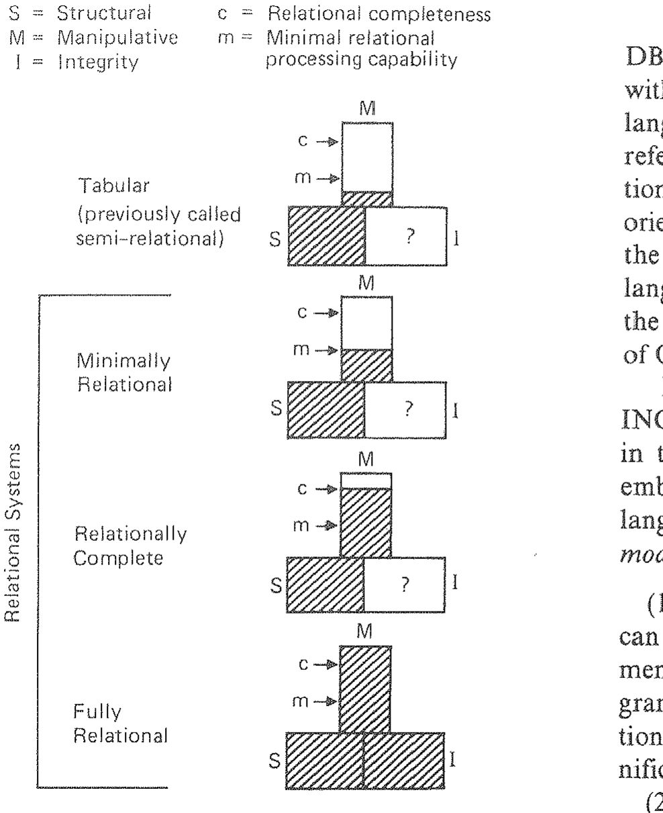

# 关系数据库：生产力的实用基础

**Relational Database: A Practical Foundation for Productivity**

> 埃德加·科德(Edgar F. Codd)
> 1981 年 ACM 图灵奖演讲
> 原载 *Communications of the ACM*, Vol. 25, No. 2 (1982 年 2 月), pp. 109–117
> 译自 `1283920.1283937.pdf`(个人学习用途)

> 众所周知，终端用户对新应用的需求增长速度，已经超过了数据处理部门实现相应应用程序的能力。解决这一问题有两种互补的方法（且两者皆不可或缺）：一是让终端用户直接接触存储在计算机中的信息；二是提高数据处理专业人员开发应用程序的生产力。而较少为人所知的是，单一的技术——关系数据库管理，为这两种方法都提供了实用的基础。本文将解释其原因。
>
> 在阐述这一生产力主题的同时，文中指出，现在是时候在关系型与非关系型数据库系统之间划清界限了，以免“关系型”这一标签被误用。划清界限的关键在于一种被称为“关系处理能力”的东西。

## 1981 年 ACM 图灵奖演讲
1981 年 11 月 9 日发表于加利福尼亚州洛杉矶 ACM '81 年会

1981 年 11 月 9 日，在加利福尼亚州洛杉矶举行的 ACM 年会上，ACM 主席 Peter Denning 将 1981 年 ACM 图灵奖授予了 IBM 圣何塞研究实验室（San Jose Research Laboratory）的 IBM 院士（IBM Fellow）埃德加·科德（Edgar F. Codd）。这是该协会为表彰对计算社区做出技术贡献而设立的最高奖项。

ACM 通用技术成就奖委员会选择科德，是因其“对数据库管理系统的理论与实践做出的基础性且持续性的贡献”。作为数据库关系模型的创始人，科德在关系代数、关系演算以及关系规范化（normalization）的发展方面也做出了进一步的重要贡献。

埃德加·科德于 1949 年加入 IBM，为选择序列电子计算器（SSEC）编写程序。此后，他在计算领域的工作涵盖了计算机逻辑设计（IBM 701 和 Stretch）、管理加拿大的一个计算中心、领导开发了首批具有通用多道程序设计能力的操作系统之一、为自复制自动机（self-reproducing automata）的逻辑做出贡献、开发软件规范的高级技术、创建并扩展了数据库管理的关系方法，以及为关系数据库的普通用户开发了一个英语分析与合成子系统。他还是 ACM 专著系列早期卷册《细胞自动机》（*Cellular Automata*）的作者。

科德在英国牛津大学获得数学学士和硕士学位，并在密歇根大学获得计算机与通信科学硕士和博士学位。他是美国国家工程院院士，也是英国计算机学会院士。

ACM 图灵奖每年颁发一次，以纪念对计算科学做出重大贡献的英国数学家 A. M. 图灵（A. M. Turing）。

---

## 1. 引言

人们普遍承认，在开发商业和工业应用的“运行代码”方面存在生产力危机。终端用户对新应用的需求增长速度，正超过数据处理部门实现相应应用程序的能力。在 60 年代末和 70 年代初，计算领域的许多人希望数据库管理系统（通常缩写为 DBMS）的引入能通过消除应用程序员在处理输入和输出文件方面的许多问题，显著提高他们的生产力。DBMS（连同数据字典）作为数据控制工具似乎非常成功，它们确实从应用程序员的关注点中移除了许多文件处理细节。那么，为什么它们没能成为生产力的助推器呢？

主要原因有三个：

(1) 这些系统给应用程序员增加了许多与其数据检索和操作任务无关的概念，迫使他们在不必要的低级结构细节上进行思考和编码（CODASYL DBTG 的“主属系”〔owner-member set〕就是一个突出的例子〔译注1〕）；

(2) 没有提供一次处理多条记录的命令——换句话说，DBMS 不支持集合处理（set processing），结果程序员被迫以往往不必要的迭代循环进行思考和编码（这里我们是在传统的数学意义上使用“集合”一词，而不是 CODASYL DBTG 的链式结构意义）；

(3) 终端用户与数据库直接交互的需求，特别是不可预见性质的交互，没有得到充分认识——查询能力被认为是可以稍后添加到 DBMS 中的东西。

回顾 60 年代末的数据库管理系统，我们可以轻易观察到，程序员的（逻辑）数据视图与存储中的（物理）数据表示之间没有明确的区别。尽管所谓的逻辑层通常提供了免受以存储地址和字节偏移量表示的放置细节影响的保护，但许多面向存储的概念仍是该层不可分割的一部分。

要求程序员沿着访问路径导航（navigate）以到达目标数据（在某些情况下必须直接处理存储中的数据布局，在其他情况下必须遵循指针链），这对开发生产力产生了巨大的负面影响。此外，如果不时修改存储布局，就必须同时修订所有依赖于先前结构的程序。引入索引也可能产生类似的影响。结果，太多的人力被投入到对应用程序持续（且可避免）的维护中。

另一个后果是，由于在数据库激活之前，需要花费大量时间学习系统并规划逻辑和物理层的数据组织，这些系统的安装往往极其缓慢。这种预先规划的目的是“一劳永逸地搞定”，从而避免随后对数据描述的更改，因为这反过来会迫使应用程序进行代码更改。当然，这样的目标只是海市蜃楼，即使当时已经知道数据库设计的健全原则（当然，当时并不知道）。

为了展示关系数据库管理系统如何避免上述三个陷阱，我们将首先回顾关系模型的动机并讨论其一些特性。然后，我们将对基于该模型的系统进行分类。在讨论过程中，我们将强调应用程序员的生产力，尽管对终端用户的好处同样巨大，因为关于关系数据库对终端用户的价值已经有了很多论述和演示（见 [23] 及其引用的论文）。

## 2. 动机

导致关系模型研究工作的最重要动机，是目标在于在数据库管理的逻辑和物理方面（包括数据库设计、数据检索和数据操作）之间提供一个尖锐且清晰的边界。我们称之为**数据独立性**（data independence）目标。

第二个目标是使模型在结构上简单，以便各种用户和程序员都能对数据有共同的理解，并因此能够就数据库进行相互沟通。我们称之为**可沟通性**（communicability）目标。

第三个目标是引入高级语言概念（而非特定语法），使用户能够一次对大块信息表达操作。这需要为面向集合的处理（即在单个语句中表达一次处理多个记录集的能力）提供基础。我们称之为**集合处理**（set-processing）目标。

还有其他目标，例如为数据库组织和管理提供健全的理论基础，但这些目标与我们当前的生产力主题关系较小。

## 3. 关系模型

为了满足这三个目标，有必要抛弃所有那些终端用户不熟悉的结构概念（例如重复组、链式结构），并重新审视数据的寻址方式。

位置概念在计算机寻址中一直扮演着重要角色，从接线板寻址开始，然后是绝对数值寻址、相对数值寻址，以及具有算术属性的符号寻址（例如汇编语言中的符号地址 A + 3；Fortran、Algol 或 PL/I 数组 X 中元素的地址 X(I + 1, Y - 2)）。在关系模型中，我们用**完全关联寻址**（totally associative addressing）取代了位置寻址。关系数据库中的每个数据项都可以通过关系名、主键值和属性名唯一寻址。这种形式的关联寻址使终端用户（是的，甚至也包括程序员！）能够将其留给系统来 (1) 确定正在插入数据库的新信息片段的放置细节，以及 (2) 在检索数据时选择适当的访问路径。

关系数据库中的所有信息都由表中的值表示（甚至表名也作为字符串出现在至少一个表中）。按值寻址而非按位置寻址，提高了程序员和终端用户的生产力（序列中项的位置通常易于变动，且人难以跟踪，特别是如果序列包含许多项时）。此外，程序员和终端用户都以相同的方式寻址数据，这一事实在很大程度上满足了可沟通性目标。

n 元关系（n-ary relation）被选为关系模型的单一聚合结构，因为配合适当的算子和适当的概念表示（表），它满足了所有三个所述目标。注意，n 元关系是一个数学集合，其中行的顺序无关紧要。

有时会出现以下问题：为什么要称之为关系模型？为什么不称之为表模型？有两个原因：(1) 在引入关系模型时，数据处理领域的许多人认为两个或多个对象之间的关系（relation 或 relationship）必须由链式数据结构表示（因此选择这个名字是为了反击这种误解）；(2) 表的抽象层次低于关系，因为它们给人一种位置（数组型）寻址适用的印象（这对于 n 元关系并不成立），且它们未能显示表的信息内容与行顺序无关。尽管如此，即使有这些微小的瑕疵，表仍是关系最重要的概念表示，因为它们被普遍理解。

顺便提一下，如果一个数据模型要被视为关系模型的严肃替代方案，它也应该为数据库实例提供清晰定义的概念表示。这种表示有助于思考所考虑的任何操作的效果。这是程序员和终端用户生产力的要求。在使用实体和联系（entities and relationships）等概念的数据模型中，或在函数式数据模型中，很少（如果有的话）讨论这种表示。此类模型通常也没有任何算子！尽管如此，它们对于在建立新数据库过程中遇到的某些类型的数据类型分析可能有用，特别是在确定初步非正式组织的极早期阶段。这就引出了一个问题：什么是数据模型？

数据模型当然不仅仅是一个数据结构，正如许多人似乎认为的那样。主要的数据模型以其主要结构命名是很自然的，但这并不是故事的全部。

一个数据模型 [9] 至少由三个部分组合而成：

(1) 一组数据结构类型（数据库的构建块）；

(2) 一组算子或推理规则，可以应用于 (1) 中列出的数据类型的任何有效实例，以从这些结构的任何部分以任何所需的组合检索、派生或修改数据；

(3) 一组通用完整性规则，它们隐式或显式地定义了一组一致的数据库状态或状态变化，或两者兼而有之——这些规则是通用的，因为它们适用于使用该模型的任何数据库（顺便说一句，它们有时可以表示为插入-更新-删除规则）。

关系模型在这个意义上是一个数据模型，并且是第一个被定义的此类模型。我们不打算在这里给出关系模型的详细定义——最初的定义出现在 [7] 中，改进后的定义出现在 [8] 的第 2 节和第 3 节中。其**结构部分**由域（domains）、各种度的关系（以表作为其主要概念表示）、属性（attributes）、元组（tuples）、候选键（candidate keys）和主键（primary keys）组成。在主要表示下，属性成为表的列，元组成为行，但就数据库表而言，没有一列接一列或一行接一行的概念。换句话说，这些表中列的左右顺序和行的上下顺序是任意且无关紧要的。

关系模型的**操作部分**由代数算子（选择、投影、连接等）组成，这些算子将关系转换为关系（因此将表转换为表）。

**完整性部分**由两条完整性规则组成：实体完整性（entity integrity）和参照完整性（referential integrity）（见 [8, 11] 关于该后一领域的最新进展）。在数据模型的任何特定应用中，可能需要施加进一步的（特定于数据库的）完整性约束，从而定义一个更小的一致数据库状态或状态变化集。

在关系模型的发展过程中，结构、操作和完整性方面之间一直存在着强耦合。如果结构是单独且隔离定义的，它们的行为特性就无法确定，会出现无限多的可能性，并导致无休止的推测。因此，像 CODASYL 和 ANSI 那样试图在不同的委员会中开发数据结构定义语言（DDL）和数据操作语言（DML），产生许多误解和不兼容性也就不足为奇了。

## 4. 关系处理能力

关系模型不仅要求关系结构（可以被视为表），还要求一种被称为**关系处理**（relational processing）的特定集合处理。关系处理涉及将整个关系作为操作数。其主要目的是避免循环（loop-avoidance），这是终端用户获得生产力的绝对要求，也是应用程序员明显的生产力助推器。

关系代数的 SELECT 算子（也称为 RESTRICT）以一个关系（表）为操作数，并产生一个由第一个关系中选定的元组（行）组成的新关系（表）。PROJECT 算子也将一个关系（表）转换为一个新关系，但这次是由第一个关系中选定的属性（列）组成。EQUI-JOIN 算子以两个关系（表）为操作数，并产生第三个关系，由第一个关系的行与第二个关系的行连接而成，但仅限于第一个关系中的指定列与第二个关系中的指定列具有匹配值的地方。如果移除了列中的冗余，该算子被称为 NATURAL JOIN。在下文中，我们使用术语“连接”（join）来指代等值连接或自然连接。

关系代数（包括这些和其他算子）旨在作为权力的尺度。它并不旨在成为所有关系系统都应遵守的标准语言。关系模型的集合处理目标旨在通过一种数据子语言（data sublanguage）²来实现，该语言至少具有关系代数的能力，且不使用迭代或递归语句。

关系代数的大部分派生能力仅通过 SELECT、PROJECT 和 JOIN 算子即可获得，前提是 JOIN 不受任何与预定义支持物理访问路径有关的实现限制。如果一个系统允许进行连接，其中任何一对属性都可以匹配，只要它们定义在相同的域或数据类型上，那么该系统就具有**无限制连接能力**（unrestricted join capability）（就我们目前的目的而言，域是语法的还是语义的并不重要，数据类型是弱的还是强的也不重要，但见 [10] 中关于在何种情况下这确实重要）。

偶尔会发现一些系统，其中仅当要匹配的属性具有相同名称或由某种类型的预声明访问路径支持时才支持连接。此类限制显著削弱了系统从基本关系派生关系的能力。这些限制因此降低了系统处理终端用户不可预见查询的能力，并减少了应用程序员避免编写迭代循环的机会。

因此，我们说一种数据子语言 L 具有**关系处理能力**，如果关系代数的 SELECT、PROJECT 和无限制 JOIN 算子所指定的转换可以在 L 中指定，而无需诉诸迭代或递归命令。

一个数据库管理系统要被称为**关系型**，它必须支持：

(1) 表，且表之间没有用户可见的导航链接；

(2) 一种至少具有这种（最小）关系处理能力的数据子语言。

其后果之一是，不支持关系处理的 DBMS 应被视为**非关系型**。如果此类系统支持表且表之间没有用户可见的导航链接，则称其为**表格式**（tabular）可能更合适。这个术语应取代 [8] 中使用的术语“半关系型”（semi-relational），因为在程序员自己进行导航的表格式系统与系统为他进行导航（即系统提供**自动导航**）的关系系统之间，实现复杂度存在巨大差异。

上面给出的关系 DBMS 的定义有意在提供的服务方面留出了很大的余地。例如，不要求支持完整的关系代数，也不要求支持关系模型的两条完整性规则（实体完整性和参照完整性）。关系系统对模型后两部分的完全支持，证明了称该系统为**完全关系型**（fully relational）[8] 是合理的。虽然我们目前还不知道有任何系统符合完全关系型的标准，但有些系统已经非常接近，无疑很快就会做到。

在图 1 中，我们说明了各种关系系统和表格式系统之间的区别。对于每一类，S 框中的阴影程度旨在显示该类成员对关系模型结构要求的忠实程度。类似的备注适用于关于操作要求的 M 框，以及关于完整性要求的 I 框。

m 表示最小关系处理能力。c 表示关系完备性（relational completeness，一种对应于不含空值的二值一阶谓词逻辑的能力）。当操作框 M 完全涂黑时，这表示一种对应于 [8] 中定义的完整关系代数的能力（一种具有单一类型空值的三值谓词逻辑）。除完全关系型外，每一类的完整性框中的问号表示目前关系系统对完整性的支持不足。需要对域和主键提供更强的支持 [10]，以及 [14] 中讨论的那种设施。

> **图 1. DBMS 的分类**
> S = 结构化；M = 操作性；I = 完整性
> c = 关系完备性；m = 最小关系处理能力

注意，关系 DBMS 可以以任何方便的方式封装其关系处理能力。例如，在 Relational Technology, Inc. 的 INGRES 系统中，QUEL [29] 的 RETRIEVE 语句在一个语句中体现了所有三个算子（选择、投影、连接），其方式是人们可以获得与任何一个算子或它们的任何组合相同的效果。

在关系模型的定义中有几项禁令。举两个例子：排除表之间用户可见的导航链接，且数据库信息不得表示（或隐藏）在基本关系内的元组顺序中。我们的经验是，实现过非关系系统的 DBMS 设计者并不容易理解和接受这些禁令。相比之下，用户则热情地理解并接受了这些禁令带来的学习易用性和使用易用性的增强。

顺便提一下，美国国家标准学会（ANSI）的关系任务组最近发布了一份关于开发关系数据库系统标准的各种可行性的报告 [4]。该报告对十几个关系系统的特性进行了启发性的分析，其作者显然理解关系模型。

## 5. 统一关系属性

为了具有广泛的适用性，大多数关系 DBMS 都有一种数据子语言，可以与一种或多种常用的编程语言（例如 Cobol、Fortran、PL/I、APL）接口。我们将后一类语言称为**宿主语言**（host languages）。关系 DBMS 通常支持至少一种面向终端用户的数据子语言——有时是几种，因为这些用户的需求可能各不相同。有些人更喜欢字符串语言，如 QUEL 或 SQL [5]，而另一些人则更喜欢 Query-by-Example [33] 的面向屏幕的二维数据子语言。

现在，一些关系系统（例如 System R [6]、INGRES [29]）支持一种可在两种模式下使用的数据子语言：(1) 在终端交互式使用；(2) 嵌入在以宿主语言编写的应用程序中。这种双模式数据子语言有强有力的理由：

(1) 使用这种语言，应用程序员可以在终端单独调试他们希望合并到应用程序中的数据库语句——使用过 SQL 开发应用程序的人声称，双模式特性显著提高了他们的生产力；

(2) 这种语言显著增强了程序员、分析师、终端用户、数据库管理人员等之间的沟通；

(3) 在这两种模式下使用的语言之间进行无谓的区别，会给那些必须在两种模式下工作的用户增加不必要的学习和记忆负担。

这一特性在生产力中的重要性表明，应根据关系 DBMS 是否具有此特性对其进行分类。因此，我们将那些支持双模式子语言的关系 DBMS 称为**统一关系型**（uniform relational）。因此，统一关系 DBMS 在终端用户接口和应用程序编程接口上都支持关系处理，并使用两者通用的数据子语言。

所有其他关系 DBMS 的自然术语是**非统一关系型**。非统一关系 DBMS 的一个例子是 TANDEM ENCOMPASS [19]。在该系统中，当在终端交互式检索数据时，使用关系数据子语言 ENFORM（一种具有关系处理能力的语言）。当编写程序来检索或操作数据时，使用 Cobol 的扩展版本（一种不具备关系处理能力的语言）。这两个使用层面的共同点是结构：表，且表之间没有用户可见的导航链接。

立即出现的一个问题是：具有关系处理能力的数据子语言如何与 Cobol 或 PL/I 这样一次只能处理一条记录的语言（即无法将一组记录视为单个操作数的语言）接口？为了解决这个问题，我们必须将以下两个动作彼此分离：(1) 定义要派生的关系；(2) 将派生的关系呈现给宿主语言程序。

一种解决方案（在 Peterlee Relational Test Vehicle [31] 中采用）是将派生的关系转换为文件的形式，该文件可以通过宿主语言语句逐条记录读取。在这种情况下，记录的交付被委托给相关宿主语言使用的文件系统。

另一种解决方案（由 System R 采用）是将记录的交付保持在数据子语言语句的控制之下，从而保持在关系 DBMS 优化器的控制之下。SQL（System R 的数据子语言）的查询语句 Q 可以嵌入在宿主语言程序中，使用以下形式的短语（出于说明原因，语法不完全是 SQL 的）：

`DECLARE C CURSOR FOR Q`

其中 C 代表程序员选择的任何名称。这样的语句将名为 C 的游标（cursor）与定义表达式 Q 关联起来。通过命名的游标，来自 Q 定义的派生关系的元组一次一个地呈现给程序。每次执行该游标的 FETCH 时，系统都会从派生关系中交付另一个元组。交付顺序由系统确定——除非定义派生关系的 SQL 语句 Q 包含 ORDER BY 子句。

重要的是要注意，在派生关系上推进游标时，程序员并不是在向某些目标数据进行导航。派生关系本身就是目标数据！由 DBMS 决定派生关系是在游标控制的扫描之前整体实例化，还是在扫描期间零碎实例化。在任何一种情况下，都是系统（而非程序员）选择生成派生数据所依据的访问路径。这减轻了程序员肩上的重大负担，从而提高了他的生产力。

## 6. 对关系系统的怀疑

关于关系数据库管理方法的实用性，从来不乏怀疑。这种怀疑大部分源于缺乏理解，有些则源于对基于关系模型的众多理论研究的恐惧 [1, 2, 15, 16, 24]。态度似乎不是欢迎理论基础提供健全性，而是：如果是理论性的，它就不可能是实用的。几乎所有非关系 DBMS 缺乏理论基础，是它们具有“ungepotchket”品质的主要原因。（这是一个意第绪语词汇，其含义之一是“修修补补”〔译注3〕。）

另一方面，提出以下两个问题似乎是合理的：

(1) 关系系统能否提供我们已经习惯于从其他 DBMS 获得的服务范围？

(2) 如果 (1) 的回答是肯定的，那么这样的系统能否表现得与非关系 DBMS 一样好？³

我们依次审视每一个问题。

### 6.1 服务范围

一个全规模的 DBMS 提供以下能力：

* 数据存储、检索和更新；
* 一个用户可访问的用于数据描述的目录（catalog）；
* 事务支持，以确保一系列数据库更改要么全部反映在相关数据库中，要么都不反映（见 [17] 关于事务技术的最新总结）；
* 故障（系统、介质或程序）情况下的恢复服务；
* 并发控制服务，以确保并发事务的行为与按某种顺序顺序运行时的行为相同；
* 授权服务，以确保所有对数据的访问和操作都符合对用户和程序指定的约束 [18]；
* 与数据通信支持的集成；
* 完整性服务，以确保数据库状态和状态变化符合指定的规则。

70 年代早期开发的某些关系原型在提供所有这些服务方面还差得很远（可能有充分的理由）。然而，现在有几个关系系统作为软件产品提供，并提供了除最后一项之外的所有这些服务。这些产品的当前版本在提供完整性服务方面确实较弱，但这正在迅速得到补救 [10]。

一些关系 DBMS 实际上提供了比非关系系统更完整的数据服务。以下是三个例子。

作为第一个例子，关系 DBMS 支持从数据库中提取所有有意义的关系，而非关系系统仅在存在静态预定义访问路径的地方支持提取。

作为某些关系系统提供的额外服务的第二个例子，考虑视图（views）。视图是通过表达式或命令序列定义的虚拟关系（表）。虽然不直接由实际数据支持，但视图在用户看来就像是一个额外的基本表，与其他基本表保持最新且处于完整性状态。视图对于允许应用程序和终端用户与恒定的视图结构交互非常有用，即使基本表本身在逻辑层正在经历结构变化（前提是相关的视图仍可从新的基本表中定义）。它们在限制程序和用户的访问范围方面也很有用。非关系系统要么根本不支持视图，要么支持更原始的对应物，如 CODASYL 的子模式（subschema）。

作为第三个例子，某些系统（例如 SQL/DS [28] 及其原型前身 System R）允许在事务进行过程中动态地对数据的逻辑和物理组织进行各种更改。这些更改很少需要重新编写应用程序。因此，程序维护负担较轻，使程序员能够更高效地进行开发而非维护。这种能力在 SQL/DS 中得以实现，是因为系统对访问路径选择具有完全控制权。

在非关系系统中，此类更改通常需要停止所有其他数据库活动，包括正在进行的事务。然后数据库保持停机状态，直到组织更改完成并完成任何必要的重新编译。

### 6.2 性能

自然地，如果关系系统的性能迟缓，人们会犹豫是否使用它们。太多时候，通过比较这些系统执行复杂事务可能花费的时间与非关系系统执行极其简单的事务可能花费的时间，得出了关于关系系统性能的错误结论。为了得出公平的性能比较，必须在相同的任务或应用上比较这些系统。我们将提出论据来展示为什么关系系统应该能够成功地与非关系系统竞争。

良好的性能由两个因素决定：(1) 系统必须支持面向性能的物理数据结构；(2) 高级语言的数据请求必须被编译成至少与普通应用程序员手工生成的代码序列一样好的低级代码序列。

论证的第一步是，使用 Cobol 级别的语言编写的程序可以在包含以表格形式结构化且没有用户可见导航链接的生产数据的大型数据库上高效运行。论证的这一步得到了以下信息的支持 [19]：截至 1981 年 8 月，Tandem Computer Corp. 已制造并安装了 760 套系统；其中，超过 700 套正在使用 Tandem ENCOMPASS 关系数据库管理系统来支持包含生产数据的数据库。Tandem 已将其自己的制造数据库交给 ENCOMPASS 管理。ENCOMPASS 不支持数据库表之间的链接，无论是用户可见的（导航）链接还是用户不可见的（访问方法）链接。

在论证的第二步中，假设我们采用上述安装中的应用程序，并将数据库检索和操作语句替换为具有关系处理能力的数据库子语言（例如 SQL）中的语句。显然，为了在这种高级语言中获得良好的性能，必须将其编译成目标代码（而不是被解释），且该目标代码必须是高效的。

System R 及其产品版本 SQL/DS 中使用了编译。1976 年，Raymond Lorie 开发了一种巧妙的预编译和后编译方案，用于应对访问路径的动态变化 [21]。它还应对了早期（因此是高效的）授权和完整性检查（然而，后者尚未实现）。该方案要求以一种相当特殊的方式编译嵌入在宿主语言程序中的 SQL 语句。这一编译步骤将 SQL 语句转换为源程序中适当的 CALL，以及包含目标代码的访问模块（access modules）。然后将这些模块存储在数据库中，以便稍后在运行时使用。这些访问模块中的代码由系统生成，以优化主要操作的顺序和访问路径的选择，从而提供运行时效率。在此预编译步骤之后，应用程序由相关宿主语言的常规编译器编译。如果在随后的任何时间移除一个或多个访问路径并尝试运行该程序，访问模块中保留了足够的源信息，使系统能够重新编译一个新的访问模块，该模块利用现在存在的访问路径，而无需重新编译应用程序。

顺便提一下，相同的数据子语言编译器也用于从终端提交的即席查询，以及在程序执行期间动态生成的查询（例如，从交互提交的参数中生成的查询）。编译后立即执行此类查询，除了最简单的查询外，性能优于解释器。

访问模块的生成（无论是初始编译还是重新编译阶段）涉及一个相当复杂的优化方案 [27]，该方案利用了系统维护的、普通程序员通常无法知晓的统计信息。因此，只有在所有事务中最简单的事务上，普通应用程序员才有可能在生成高效代码方面与该优化器竞争。任何竞争尝试都注定会降低程序员的生产力。因此，为额外的编译时开销付出的代价似乎是非常值得的。

假设在两种情况下都是非链接的表格结构，我们可以预期 SQL/DS 在许多简单情况下生成的代码与平均手工编写的代码相当，在许多复杂情况下则更优。许多商业事务极其简单。例如，人们可能需要查找特定铁路货车的记录以找出它在哪里，或者查找某人储蓄账户中的余额。如果支持合适的快速访问路径（例如哈希），就没有理由认为像 SQL、QUEL 或 QBE 这样的高级语言会导致这些简单事务的运行时代码效率低于低级语言，即使此类事务很少利用高级数据子语言编译器的优化能力。

## 7. 未来方向

如果我们要将关系数据库作为生产力的基础，我们需要知道关系系统未来可能有哪些发展。

让我们先处理近期发展。在某些关系系统中，需要根据 [10] 中的建议对域和主键提供更强的支持。如前所述，所有关系系统在自动遵守完整性约束方面都需要升级。现有的更新连接型视图的约束需要放宽（在理论上可行的地方），并且在这个问题上正在取得进展 [20]。需要支持外连接（outer joins）。

优化技术正在取得显著改进，因此我们可以合理地预期性能的进一步提高。在某些产品中，如 ICL CAFS [22] 和 Britton-Lee IDM500 [13]，已经实现了特殊的硬件支持。特殊硬件可能有助于某些类型应用的性能。然而，在处理格式化数据库的大多数应用中，软件实现的关系系统在性能上可以与软件实现的非关系系统竞争。

目前，大多数关系系统不为工程和科学数据库提供任何特殊支持。这种支持，包括与 Fortran 的接口，显然是需要的，并且是可以预期的。

关系系统中的目录已经由额外的关系组成，可以使用相同的查询语言像数据库的其他部分一样进行查询。一个可以且应该迅速实施的自然发展是将这些目录扩展为成熟的活动字典，以提供额外的在线数据控制。

最后，在短期内，我们可以预期适用于关系系统的逻辑和物理层面的数据库设计辅助工具。

从长期来看，我们可以预期支持分布在通信网络上的关系数据库 [25, 30, 32]，并以这样一种方式进行管理，即应用程序和交互式用户可以操作数据：(1) 仿佛所有数据都存储在本地节点——位置透明性（location transparency）；(2) 仿佛没有任何地方复制了任何数据——复制透明性（replication transparency）。上述引用的所有三个项目都基于关系模型。其中一个重要原因是，在规划数据库如何分布在计算机系统网络上时，关系数据库提供了巨大的分解灵活性，并为动态组合去中心化信息提供了巨大的重组能力。相比之下，由于主属导航链接的纠缠，CODASYL DBTG 数据库非常难以分解和重组。这一特性使得 CODASYL 方法极难适应分布式数据库环境，并可能最终导致其衰落。使用关系模型的第二个原因是，它为在节点之间传输数据请求提供了简洁的高级数据子语言。

正在进行的扩展关系模型以正式方式捕获更多数据含义的工作，有望导致将这些含义纳入数据库目录，以便将其从应用程序中分离出来，使这些程序更加简洁和简单。在这里，我们当然是在谈论以系统能够理解并据此行动的方式表示的含义。

正在开发改进的理论来处理缺失数据和不适用数据（例如见 [3]）。这项工作应该会产生对空值的改进处理。

就现状而言，关系数据库最适合具有相当规则或同质结构的数据。我们能否在处理异构数据（如图像、文本和杂项事实）的同时保留关系方法的优势？预计会有肯定的回答，目前正在就此课题进行一些研究，但还需要更多。

为了实现数据库语言和编程语言之间的融合，需要进行大量的研究。Pascal/R [26] 是这一方向工作的一个很好的例子。正在进行的调查一方面侧重于将抽象数据类型纳入数据库语言 [12]，另一方面侧重于将关系处理纳入编程语言。

## 8. 结论

我们提出了一系列论据来支持这一主张：关系数据库技术为终端用户和应用程序员提供了生产力方面的巨大改进。论据集中在关系模型中定义并在关系数据库管理系统中实现的数据独立性、结构简单性和关系处理。所有这三个特性都简化了开发应用程序以及制定从终端提交的查询和更新的任务。此外，第一个特性倾向于使程序在面对数据库的组织和描述性变化时保持可行，从而减少了通常被转移到程序维护中的精力。

那么，为什么本文的标题暗示关系数据库仅为提高生产力提供了基础而非全部解决方案呢？原因很简单：关系数据库仅处理应用程序和终端用户交互中的共享数据组件。有许多互补技术可能有助于处理其他组件或方面，例如支持关系处理和改进数据类型检查的编程语言、理解所使用语言更多信息的改进编辑器等。我们使用“基础”一词，是因为与共享数据的交互（无论是通过程序还是通过终端）代表了如此多数据处理活动的核心。

关系方法的实用性已通过已经在运行的测试和生产安装得到证明。因此，有了关系系统，我们现在可以期待 DBMS 最初被寄予厚望时所能提供的生产力提升。

**致谢**。我要向 IBM 圣何塞研究中心的 System R 开发团队表示感谢，他们开发了一个全规模、统一的关系原型，涉及众多语言和系统创新；感谢 IBM 纽约州恩迪科特实验室的开发团队，他们以专业的方式将 System R 转换为产品形式；感谢大学、硬件制造商、软件公司和用户安装点的各个团队，他们设计并实现了工作的关系系统；感谢纽约州约克敦海茨 IBM 的 QBE 团队；感谢英国 IBM 科学中心的 PRTV 团队；以及感谢众多对数据库理论做出贡献、将关系模型作为基石的人。特别要感谢极少数在早期阶段就看到值得支持的东西的同事，特别是 Chris Date 和 Sharon Weinberg。最后，是 Sharon Weinberg 提出了本文的主题。

1981 年 10 月收到；1981 年 12 月修订并接受。

## 参考文献

1. Beeri, C., Bernstein, P., Goodman, N. A sophisticate's introduction to database normalization theory. *Proc. Very Large Data Bases*, West Berlin, Germany, Sept. 1978.
2. Bernstein, P.A., Goodman, N., Lai, M-Y. Laying phantoms to rest. Report TR-03-81, Center for Research in Computing Technology, Harvard University, Cambridge, Mass., 1981.
3. Biskup, J.A. A formal approach to null values in database relations. *Proc. Workshop on Formal Bases for Data Bases*, Toulouse, France, Dec 1979; published in [16] (see below) pp 299-342.
4. Brodie, M. and Schmidt, J. (Eds), Report of the ANSI Relational Task Group., (to be published *ACM SIGMOD Record*).
5. Chamberlin, D.D., et al. SEQUEL2: A unified approach to data definition, manipulation, and control. *IBM J. Res. & Dev.*, 20, 6, (Nov. 1976) 560-565.
6. Chamberlin, D.D., et al. A history and evaluation of system R. *Comm. ACM*, 24, 10, (Oct. 1981) 632-646.
7. Codd, E.F. A relational model of data for large shared data banks. *Comm. ACM*, 13, 6, (June 1970) 377-387.
8. Codd, E.F. Extending the database relational model to capture more meaning. *ACM TODS*, 4, 4, (Dec. 1979) 397-434.
9. Codd, E.F. Data models in database management. *ACM SIGMOD Record*, 11, 2, (Feb. 1981) 112-114.
10. Codd, E.F. The capabilities of relational database management systems. *Proc. Convencio Informatica Llatina*, Barcelona, Spain, June 9-12, 1981, pp 13-26; also available as Report 3132, IBM Research Lab., San Jose, Calif.
11. Date, C.J. Referential integrity. *Proc. Very Large Data Bases*, Cannes, France, September 9-11, 1981, pp 2-12.
12. Ehrig, H., and Weber, H. Algebraic specification schemes for data base systems. *Proc. Very Large Data Bases*, West Berlin, Germany, Sept 13-15, 1978, 427-440.
13. Epstein, R., and Hawthorne, P. Design decisions for the intelligent database machine. *Proc. NCC 1980*, AFIPS, Vol. 49, May 1980, pp 237-241.
14. Eswaran, K.P., and Chamberlin, D.D. Functional specifications of a subsystem for database integrity. *Proc. Very Large Data Bases*, Framingham, Mass., Sept. 1975, pp 48-68.
15. Fagin, R. Horn clauses and database dependencies. *Proc. 1980 ACM SIGACT Symp. on Theory of Computing*, Los Angeles, CA, pp 123-134.
16. Gallaire, H., Minker, J., and Nicolas, J.M. *Advances in Data Base Theory*. Vol 1, Plenum Press, New York, 1981.
17. Gray, J. The transaction concept: virtues and limitations, *Proc. Very Large Data Bases*, Cannes, France, September 9-11, 1981, pp 144-154.
18. Griffiths, P.G., and Wade, B.W. An authorization mechanism for a relational database system. *ACM TODS*, 1, 3, (Sept 1976) 242-255.
19. Held, G. ENCOMPASS: A relational data manager. *Data Base/81*, Western Institute of Computer Science, Univ. of Santa Clara, Santa Clara, Calif., August 24-28, 1981.
20. Keller, A.M. Updates to relational databases through views involving joins. Report RJ3282, IBM Research Laboratory, San Jose, Calif., October 27, 1981.
21. Lorie, R.A. and Nilsson, J.F. An access specification language for a relational data base system. *IBM J. Res. & Dev.*, 23, 3, (May 1979) 286-298.
22. Maller, V.A.J. The content addressable file store--CAFS. *ICL Technical J.*, 1, 3, (Nov. 1979) 265-279.
23. Reisner, P. Human factors studies of database query languages: A survey and assessment. *ACM Computing Surveys*, 13, 1, (March 1981) 13-31.
24. Rissanen, J. Theory of relations for databases--A tutorial survey. *Proc. Symp. on Mathematical Foundations of Computer Science*, Zakopane, Poland, September 1978, *Lecture Notes in Computer Science*, No. 64, Springer Verlag, New York, 1978.
25. Rothnie, J.B., Jr, et al. Introduction to a system for distributed databases (SDD-1). *ACM TODS*, 5, 1, (March 1980) 1-17.
26. Schmidt, J.W. Some high level language constructs for data of type relation. *ACM TODS*, 2, 3, (Sept 1977) 247-261.
27. Selinger, P.G., et al. Access path selection in a relational database system. *Proc. 1979 ACM SIGMOD International Conference on Management of Data*, Boston, MA, May 1979, pp 23-34.
28. ———, SQL/Data system for VSE: A relational data system for application development. IBM Corp. Data Processing Division, White Plains, N.Y., G320-6590, Feb 1981.
29. Stonebraker, M.R., et al. The design and implementation of INGRES, *ACM TODS*, 1, 3, (Sept. 1976) 189-222.
30. Stonebraker, M.R., and Neuhold, E.J. A distributed data base version of INGRES. *Proc. Second Berkeley Workshop on Distributed Data Management and Computer Networks*, Lawrence-Berkeley Lab., Berkeley, Calif., May 1977, pp 19-36.
31. Todd, S.J.P. The Peterlee relational test vehicle--A system overview. *IBM Systems J.*, 15, 4, 1976, 285-308.
32. Williams, R. et al. R*: An overview of the architecture. Report RJ3325, IBM Research Laboratory, San Jose, Calif., October 27, 1981.
33. Zloof, M.M. Query by example. *Proc. NCC*, AFIPS Vol 44, May 1975, pp 431-438.

作者当时地址: E. F. Codd, IBM Research Laboratory, 5600 Cottle Road, San Jose, CA 95193.

---

## 译注

**文本与翻译说明**

1. 标题 *Relational Database: A Practical Foundation for Productivity* 亦有译作《关系数据库：提高生产力的实用基础》。
2. Codd 在本文中强调的“生产力危机”是 20 世纪 70 年代末至 80 年代初软件工程领域的普遍焦虑，关系数据库被视为解决这一危机的关键技术手段。

**背景与文化注**(译者补注,原文无)

1. **CODASYL DBTG 与“主属系”**：CODASYL（数据系统语言会议）是 60 年代末制定数据库标准的组织，其 DBTG（数据库任务组）提出的网状模型（Network Model）是关系模型的主要竞争对手。在网状模型中，数据通过显式的指针链（即“系”〔set〕，由“主记录”〔owner〕和“成员记录”〔member〕组成）连接。Codd 在此批评这种模型迫使程序员进行“导航”式编程，严重影响生产力。这与 1973 年图灵奖得主 Charles Bachman 的演讲《作为领航员的程序员》（*The Programmer as Navigator*）形成了鲜明的学术对垒。〔译注1〕
2. **System R 与 SQL**：System R 是 IBM 圣何塞研究实验室在 70 年代开发的关系数据库原型系统，它证明了关系模型在大型生产环境中的可行性。SQL（最初称为 SEQUEL）正是为 System R 设计的查询语言，后来成为了行业标准。
3. **IBM 圣何塞研究实验室**：位于加州硅谷，是关系数据库技术的摇篮。Codd 在此工作期间发表了奠基性的 1970 年论文。
4. **数据独立性**：这是 Codd 关系模型的核心贡献之一，指应用程序不依赖于数据的物理存储结构。
5. **规范化（Normalization）**：Codd 提出的一系列规则（如第一、二、三范式），用于消除数据冗余和更新异常，是数据库设计的理论基石。

**OCR 与印刷勘误**

1. **图 1 说明**：原刊第 113 页（本 PDF 第 5 页）的图 1（Classification of DBMS）展示了 Tabular、Minimally Relational、Relationally Complete 和 Fully Relational 四类系统的结构（S）、操作（M）和完整性（I）支持程度。该图已按原版样式从扫描页中裁剪提取为 PNG（见 zh/assets/1981-codd/fig-01.png），内嵌于正文相应位置。〔译注2〕
2. **意第绪语词汇**：原文中使用的 "ungepotchket" 是一个意第绪语词汇，意为“修修补补的”、“杂乱无章的”或“过度装饰而显得拙劣的”。Codd 用此词讽刺缺乏理论基础的非关系数据库系统。〔译注3〕
3. **参考文献校正**：扫描件中参考文献部分存在少量 OCR 错误（如 "trine-sharing" 应为 "time-sharing"），已对照原刊图像校正。

(End of file)
