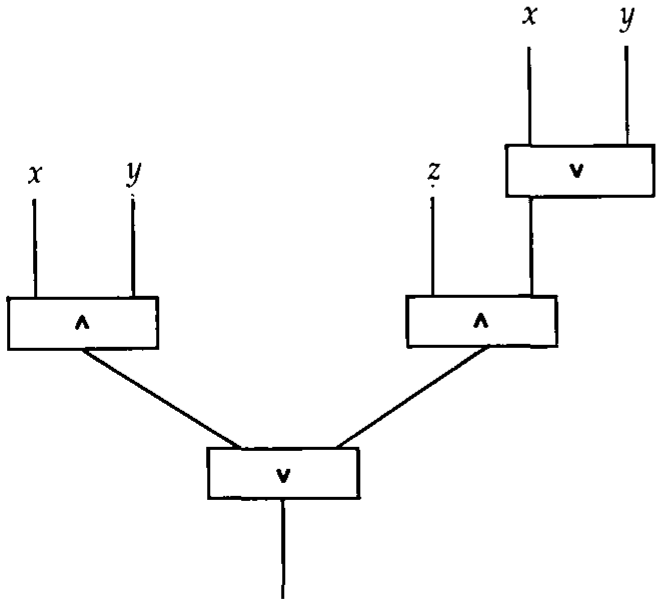
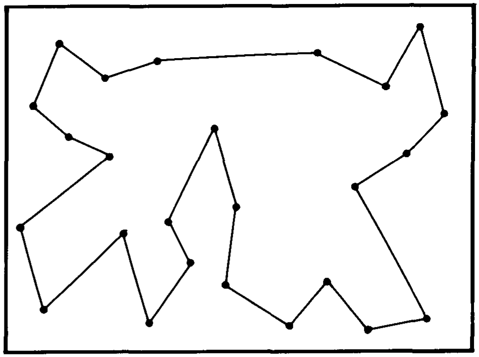
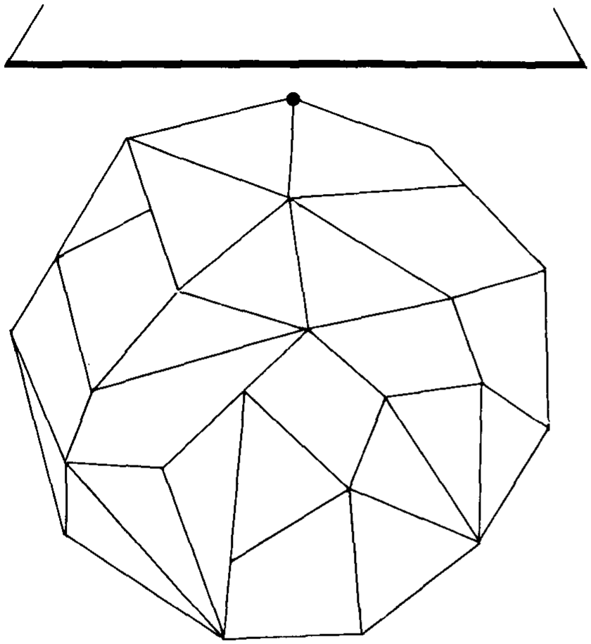
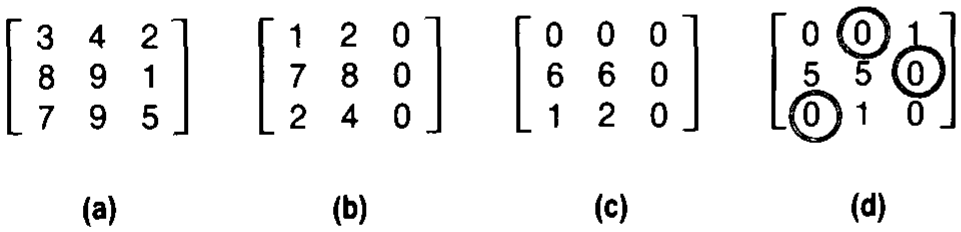
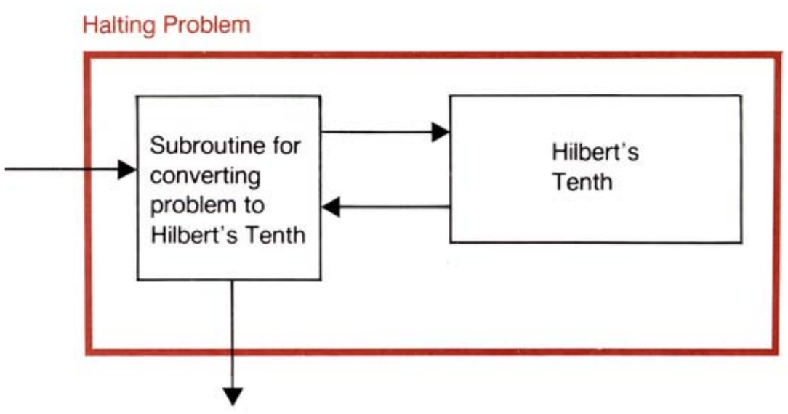
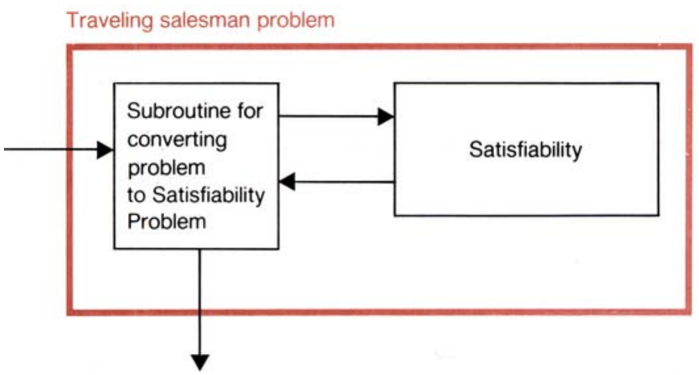
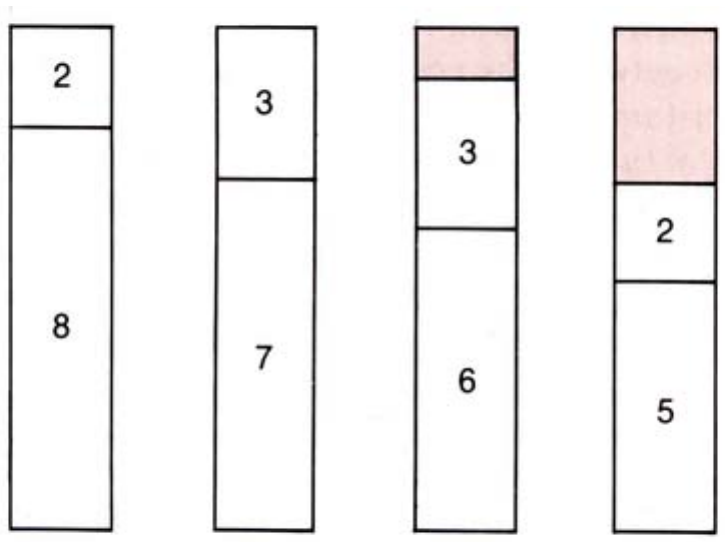
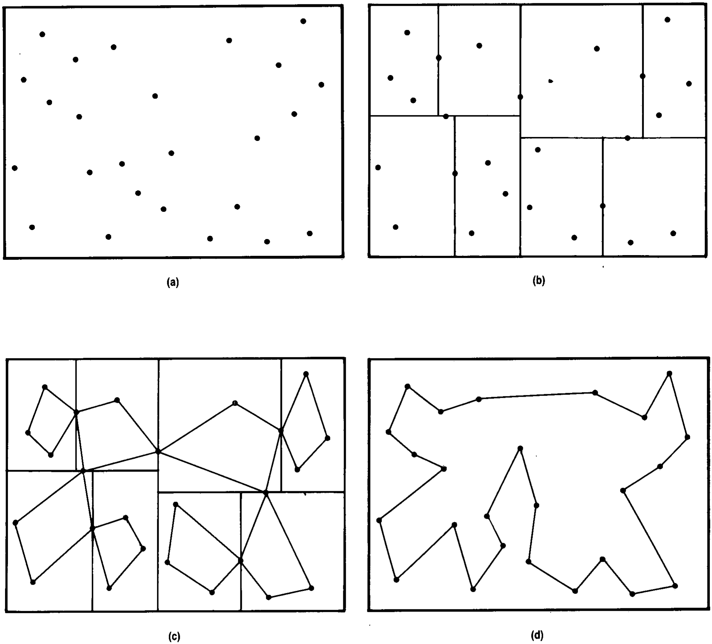
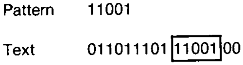

# 组合数学、复杂性与随机性

**Combinatorics, Complexity, and Randomness**

> 作者 理查德·卡普(Richard M. Karp)
> 1985 年 ACM 图灵奖演讲
> 原载 *Communications of the ACM*, Vol. 29, No. 2 (1986 年 2 月), pp. 98–109
> 译自 `1283920.1283942.pdf`(个人学习用途)

> 1985 年图灵奖得主就这一后来被称为"理论计算机科学"领域的发展历程分享了他的见解。

这篇演讲献给我的父亲,亚伯拉罕·路易斯·卡普(Abraham Louis Karp)。

获此殊荣,我深感荣幸与欣慰。尽管获得认可令人满足,但我发现,我最大的满足感源于研究本身,源于我在 25 年组合算法与计算复杂性研究生涯中结下的友谊。今天,我想带各位回顾这段历程,谈谈那些对我产生深远影响的概念,以及那些启发过我的人。

## 引言

我进入计算机领域纯属偶然。1955 年我从哈佛学院(Harvard College)〔译注1〕数学系毕业,当时面临着下一步该做什么的抉择。为了谋生,我曾在数学领域找过工作,但那个时代更强调抽象与通用性,而我喜欢的具体且应用性强的数学似乎已经过时了。

于是,我顺理成章地进入了哈佛计算实验室(Harvard Computation Laboratory)〔译注2〕攻读博士学位。当时,后来成为计算机科学课程核心的大多数课题甚至还未成形,因此我选修了一系列庞杂的课程:开关理论、数值分析、应用数学、概率统计、运筹学、电子学以及数理语言学。虽然当时的课程体系在深度和连贯性上仍有欠缺,但空气中弥漫着一种特殊的精神;我们知道自己正在见证一门以计算机为中心的新科学学科的诞生。我发现算法结构中蕴含着美与优雅,而且我发现自己对那些构成计算机与计算基础的离散数学有着某种天赋。简而言之,我或多或少是偶然踏入了一个非常合我心意的领域。

## 易与难的组合问题

从那时起,我就对组合搜索问题产生了特殊的兴趣——这类问题可以比作拼图游戏,你必须以某种特定的方式将有限的部分组合起来。这类问题涉及在有限但极其庞大的、结构化的可能解、模式或排列集合中进行搜索,以找到一个满足规定条件的解。这类问题的例子包括集成电路芯片上的元件布局与布线、国家橄榄球联盟(National Football League)的赛程安排,以及校车车队的路线规划。

在任何一个组合谜题中都潜伏着组合爆炸(combinatorial explosion)的可能性。由于可能性数量巨大且增长迅猛,除非在搜索可能解的空间时采用某种微妙的方法,否则计算可能会陷入僵局。我想从讲述我最初几次与组合爆炸交手的经历开始这篇演讲的技术部分。

我第一次败在这一现象手下是在 1959 年加入 IBM 约克敦高地(Yorktown Heights)〔译注3〕研究中心之后。我被分配到一个由 J. P. Roth 〔译注4〕领导的小组,他是一位在开关理论方面做出过显著贡献的杰出代数拓扑学家。我们小组的任务是开发一个计算机程序,用于自动合成开关电路。程序的输入是一组布尔公式,规定了电路的输出应如何取决于输入;程序则应利用最少数量的逻辑门生成一个完成该任务的电路。图 1 展示了一个实现三变量 $x, y, z$ 多数决函数(majority function)的电路;当 $x, y, z$ 中至少有两个为高电平时,输出为高。

**图 1**：多数决函数(majority function)的电路。

我们设计的程序包含许多优雅的捷径和改进,但其基本机制只是简单地按成本递增的顺序枚举所有可能的电路。随着输入变量数量的增加,以及作为结果的电路序列的增长,程序不得不以惊人的速度处理海量电路。很快,我们在解决玩具级问题之外就再也无法取得进展了。今天,我们对这种幼稚的枚举方法感到不屑,但我们并不是唯一掉进这个陷阱的人;过去二十年里,自动定理证明领域的大部分工作也是在最初对玩具级问题成功解决的兴奋之后,紧接着就陷入了对组合爆炸现象严重性的幻灭。

大约在同一时间,我开始与 IBM 的 Michael Held 〔译注5〕合作研究旅行商问题(traveling salesman problem)。这个问题得名于这样一种情境:一名商人希望访问其领地内的所有城市,从家乡城市出发并最终回到家乡,同时使总旅行成本最小化。在城市是平面上的点且旅行成本等同于欧几里得距离的特殊情况下,问题就是找到一条经过所有城市的周长最小的多边形(见图 2)。几年前,兰德公司(Rand Corporation)的 George Dantzig、Raymond Fulkerson 和 Selmer Johnson 结合人工与自动计算,成功解决了一个 49 城市的问题,我们希望能打破他们的记录。

**图 2**：一次旅行商回路(traveling salesman tour)。

尽管旅行商问题看起来很无辜,但它具有组合爆炸的潜力,因为在平面上经过 $n$ 个城市的可能巡回路径数量是 $(n-1)!/2$,这是一个随 $n$ 增长极快的函数。例如,当城市数量仅为 20 时,以每秒一百万条路径的速度进行暴力枚举所需的时间将超过一千年。

Held 和我尝试了多种方法来解决旅行商问题。我们首先重新发现了一个基于动态规划(dynamic programming)的捷径,该方法最初由 Richard Bellman 〔译注6〕提出。动态规划方法将搜索时间减少到 $n^2 2^n$,但这个函数也会发生爆炸式增长,该方法在实践中仅限于处理最多 16 个城市的问题。有一段时间,我们放弃了精确解决问题的想法,转而实验局部搜索方法(local search methods),这些方法倾向于产生良好但非最优的路径。使用这些方法,人们从一条路径开始,反复寻找能改进它的局部变化。这个过程一直持续到找到一条无法通过任何此类局部变化来改进的路径为止。我们的局部改进方法相当笨拙,后来 Shen Lin 和 Brian Kernighan 〔译注7〕在贝尔实验室发现了更好的方法。如果不需要严格的最优解,这类"快速但粗糙"的方法在实践中通常非常有用,但人们永远无法保证它们的表现有多好。

随后,我们开始研究分支定界法(branch-and-bound methods)〔译注8〕。这类方法在本质上也是枚举式的,但它们通过剪掉可能解空间的大部分来提高效率。这是通过计算每条包含某些链接且不包含另一些链接的路径的成本下界来实现的;如果下界足够大,就可以推断出任何此类路径都不可能是最优的。经过一系列长时间的失败实验后,Held 和我偶然发现了一种计算下界的强大方法。这种定界技术使我们能够大幅削减搜索空间,从而使我们能够解决多达 65 个城市的问题。我认为我的任何理论结果都没有像 Held 和我第一次测试我们的定界方法那天晚上看到计算机中涌出的数字那样令我激动。后来我们发现,我们的方法是现在分支定界法中常规使用的、被称为拉格朗日松弛(Lagrangian relaxation)〔译注9〕的老技术的一个变体。

在很短的一段时间内,我们的程序是世界上最强的旅行商问题求解器,但现在已经存在更令人印象深刻的程序了。它们基于一种被称为多面体组合数学(polyhedral combinatorics)〔译注10〕的技术,该技术试图将旅行商问题的实例转换为非常庞大的线性规划问题。此类方法可以解决超过 300 个城市的问题,但这种方法并不能完全消除组合爆炸,因为解决问题所需的时间仍随城市数量呈指数级增长。

旅行商问题一直是一个迷人的谜团。最近出版了一本超过 400 页的书,涵盖了关于这个难以捉摸的问题的大部分已知知识。稍后,我们将讨论 NP 完全性理论,该理论提供的证据表明旅行商问题本质上是难解的,因此无论多么聪明的算法设计都无法完全战胜潜伏在该问题中的组合爆炸潜力。

20 世纪 60 年代初,约克敦高地的 IBM 研究实验室拥有一支卓越的组合数学家团队,在他们的指导下,我学习了解决某些组合问题而不陷入组合爆炸的重要技术。例如,我熟悉了 Dantzig 著名的用于线性规划的单纯形算法(simplex algorithm)〔译注11〕。线性规划问题是在高维空间的多面体上找到距离给定外部超平面最近的点(多面体是二维空间中多边形或三维空间中普通多面体形状的推广,而超平面是平面中直线或三维空间中平面的推广)。距离超平面最近的点总是多面体的一个角点或顶点(见图 3)。在实践中,单纯形法可以被信赖能非常快速地找到所需的顶点。

**图 3**：线性规划问题：距离超平面最近的点总是多面体的一个顶点。

我还学习了 Lester Ford 和 Fulkerson 优美的网络流理论(network flow theory)〔译注12〕。该理论关注的是商品(如石油、天然气、电力或信息位)在网络中传输的速率,其中每个链接都有一个限制其传输速率的容量。许多乍看之下与网络流无关的组合问题都可以重构为网络流问题,该理论使得此类问题能够优雅且高效地解决,除了加法和减法外不需要任何算术运算。

让我通过简述所谓的匈牙利算法(Hungarian algorithm)〔译注13〕来展示这一优美的理论,该算法用于解决一种被称为婚姻问题(marriage problem)的组合优化问题。这个问题涉及一个由 $n$ 名男性和 $n$ 名女性组成的社会。问题是以最小成本将男女进行一对一配对,其中每种配对都被赋予了一定的成本。这些成本由一个 $n \times n$ 矩阵给出,其中每一行对应一名男性,每一列对应一名女性。通常, $n$ 名男性与 $n$ 名女性的每种配对都对应于从矩阵中选择 $n$ 个条目,其中任意两个条目都不在同一行或同一列;配对的成本是所选 $n$ 个条目的总和。可能配对的数量是 $n!$,这个函数增长如此之快,以至于暴力枚举将无济于事。图 4a 展示了一个 $3 \times 3$ 的例子,其中我们可以看到将男性 3 与女性 2 配对的成本等于 9,即给定矩阵第三行第二列的条目。

匈牙利算法背后的关键观察是,如果从矩阵的某一特定行中的所有条目减去相同的常数,问题保持不变。利用这种改变矩阵的自由,算法试图创建一个所有条目均为非负的矩阵,使得每种完整配对都具有非负的总成本,并且其中存在一种条目全为零的完整配对。这样的配对显然对于所创建的成本矩阵是最优的,对于原始成本矩阵也是最优的。在我们的 $3 \times 3$ 例子中,算法首先从每行中减去该行的最小条目,从而创建一个每行至少包含一个零的矩阵(图 4b)。然后,为了在每列中创建一个零,算法从尚未包含零的每列的所有条目中减去该列的最小条目(图 4c)。在这个例子中,所得矩阵中的所有零都位于第一行或第三列;由于完整配对在每行或每列中仅包含一个条目,因此尚无法找到完全由零条目组成的完整配对。为了创建这样的配对,有必要在矩阵的左下部分创建一个零。在这种情况下,算法通过从第一列和第二列减去 1,并给第一行加上 1 来创建一个零(图 4d)。在所得的非负矩阵中,三个圈出的条目给出了一种成本为零的完整配对,因此该配对在最终矩阵和原始矩阵中都是最优的。

**图 4**：婚姻问题(匈牙利算法)的一个实例：(a)-(d) 依次展示算法的矩阵变换过程。

这种算法比暴力枚举要微妙且高效得多。它解决婚姻问题所需的时间仅随矩阵行数和列数 $n$ 的三次方增长,因此,解决具有数千行和数千列的实例是可能的。

创立线性规划理论和网络流理论的那一代研究人员对计算复杂性问题持务实态度:如果一个算法在实践中运行得足够快,就被认为是高效的,证明它在所有可能情况下都很快并不特别重要。1967 年,我注意到解决某些网络流问题的标准算法存在一个理论缺陷,这导致它在某些人为构造的例子上运行得非常慢。我发现纠正这个缺陷并不困难,并在普林斯顿的组合数学研讨会上就我的结果做了报告。普林斯顿的人告诉我,国家标准局(National Bureau of Standards)的研究员 Jack Edmonds 〔译注14〕在前一周的同一个研讨会上展示了非常相似的结果。

由于这次巧合,Edmonds 和我开始合作研究网络流算法的理论效率,并适时发表了一篇联合论文。但我们合作的主要影响是强化了一些我已经在摸索中的关于计算复杂性的想法,这些想法将对我未来的研究历程产生强大影响。Edmonds 是一位出色的工匠,他利用与线性规划相关的想法为许多组合问题开发了惊人的算法。但是,除了构建算法的技巧外,他在另一个重要方面也领先于同时代人:他对自己所谓的算法"高效"有着清晰而精确的理解。他的论文阐述了这样一个观点:如果一个算法的运行时间被输入规模的某个多项式函数〔译注15〕(而不是指数函数)所界定,那么该算法就应该被认为是"好"的。例如,根据 Edmonds 的概念,解决婚姻问题的匈牙利算法是一个好算法,因为它的运行时间随输入规模的三次方增长。但据我们所知,旅行商问题可能不存在好算法,因为我们尝试过的所有算法在运行时间上都随问题规模呈指数级增长。Edmonds 的定义为我们提供了一个清晰的思路,即如何定义简单组合问题与困难组合问题之间的界限,并首次(至少在我的思考中)开启了这样一种可能性:我们也许有一天能得出一个定理,证明或反驳旅行商问题本质上是难解的这一猜想。

## 组合优化与计算复杂性理论的发展历程

*   **1900 年**: 希尔伯特(Hilbert)提出基本问题:数学是完备的、一致的且可判定的吗?
*   **1900 年**: 希尔伯特第十问题〔译注16〕:是否存在丢番图方程的通用判定程序?
*   **1930 年代**: 可计算性先驱。
*   **1937 年**: 图灵(Turing)〔译注17〕引入数字计算机的抽象模型,并证明了停机问题(Halting Problem)〔译注18〕及一阶逻辑判定问题的不可判定性。
*   **1947 年**: Dantzig 为线性规划问题设计了单纯形法。
*   **1957 年**: Ford 和 Fulkerson 等人给出了解决网络流问题的有效算法。
*   **1959 年**: Rabin 等人启动了对随机化算法的研究。
*   **1959-1960 年**: Rabin 〔译注19〕, McNaughton, Yamada: 计算复杂性理论的最初萌芽。
*   **1965 年**: Hartmanis 和 Stearns 〔译注20〕定义了"复杂性"——引入了使用抽象机器的计算复杂性框架——获得了关于复杂性类结构的结果。
*   **1965 年**: Edmonds 将"好"算法定义为运行时间受输入规模多项式函数界定的算法。发现了解决匹配问题(Matching Problem)的此类算法。
*   **1970 年代**: 基于成本比率上界的近优解搜索。
*   **1971 年**: 在 Davis, Robinson 和 Putman 工作的基础上,Matiyasevic 解决了希尔伯特第十问题:不存在求解丢番图方程的通用判定程序。
*   **1971 年**: 库克定理(Cook's Theorem)〔译注21〕: 所有 NP 问题都可在多项式时间内归约为可满足性问题(Satisfiability Problem)〔译注22〕。Levin 〔译注23〕也独立发现了这一原理。
*   **1972 年**: Karp 利用多项式时间归约证明了装箱、匹配、覆盖等 21 个问题〔译注24〕是 NP 完全的。
*   **1973 年**: Meyer, Stockmeyer 等人证明了逻辑与自动机理论中某些判定问题的难解性。
*   **1975 年**: Karp 偏离最坏情况范式,开始研究组合算法的概率分析〔译注25〕。
*   **1976 年**: Rabin 等人启动了对随机化算法的研究。
*   **约 1980 年**: Borgwardt, Smale 〔译注26〕等人对单纯形算法进行概率分析。
*   **1984 年**: Karmarkar 设计了理论上高效且实用的线性规划算法。

## 通往 NP 完全性之路

在组合算法领域发展的同时,20 世纪 60 年代另一股主要的研究力量正在汇聚——计算复杂性理论。这一学科的基础是由包括艾伦·图灵(Alan Turing)在内的一群逻辑学家在 20 世纪 30 年代奠定的,他们关注的是是否存在自动程序来判定数学陈述的真伪。

图灵和其他可计算性理论的先驱首先证明了某些定义明确的数学问题是不可判定的,也就是说,原则上不可能存在能够解决此类问题所有实例的算法。此类问题的第一个例子是停机问题(Halting Problem),它本质上是一个关于计算机程序调试的问题。停机问题的输入是一个计算机程序及其输入数据;问题是判定该程序最终是否会停机。对于这样一个定义明确的问题,怎么会没有算法呢?困难源于无限搜索的可能性。显而易见的解法是直接运行程序直到它停机。但在什么时候放弃、判定程序不会停机才算合乎逻辑呢?似乎没有办法为所需的搜索量设定限制。利用一种被称为对角线法(diagonalization)的技术,图灵证明了不存在能够成功处理停机问题所有实例的算法。

多年来,在数学的几乎每个分支中都发现了不可判定问题。数论中的一个例子是求解丢番图方程(Diophantine equations): 给定一个多项式方程,如
$$4xy^2 + 2xy^2z^3 - 11x^3y^2z^2 = -1164$$
是否存在整数解?寻找求解此类丢番图方程的通用判定程序的问题最初由大卫·希尔伯特(David Hilbert)于 1900 年提出,后来被称为希尔伯特第十问题。该问题一直悬而未决,直到 1971 年才被证明不存在此类判定程序。

在划分可解问题与不可解问题界限时使用的基本工具之一是归约(reducibility)概念,这一概念最初通过逻辑学家埃米尔·波斯特(Emil Post)〔译注27〕的工作而受到重视。如果给定一个能够解决问题 B 的子程序,就可以构造一个算法来解决问题 A,那么就称问题 A 可归约为问题 B。作为一个例子,一个里程碑式的结果是停机问题可归约为希尔伯特第十问题(见图 5)。由此可见,希尔伯特第十问题必然是不可判定的,否则我们就能利用这种归约推导出停机问题的算法,而已知停机问题是不可判定的。当我们讨论 NP 完全性和 P : NP 问题时,归约的概念会再次出现。

**图 5**：停机问题可归约为希尔伯特第十问题。

复杂性理论从可计算性理论继承的另一个重要主题是解决问题的能力与检查解的能力之间的区别〔译注28〕。尽管没有通用的方法来寻找丢番图方程的解,但检查一个提议的解却很容易。例如,要检查 $x = 3, y = 2, z = -1$ 是否构成上述丢番图方程的解,只需代入给定值并进行简单的算术运算即可。正如我们稍后将看到的,解决与检查之间的区别正是 P : NP 问题的核心所在。

理论计算机科学中一些最持久的分支起源于可计算性理论的抽象机器和其他形式化方法。其中最重要的分支之一是计算复杂性理论。复杂性理论不只是简单地询问一个问题是否可判定,而是询问解决该问题的难度。换句话说,复杂性理论关注的是当对执行时间或内存使用量施加限制时,通用计算设备(如图灵机)的能力。复杂性理论的最初萌芽可以追溯到 Michael Rabin 以及 Robert McNaughton 和 Hideo Yamada 在 1959 年和 1960 年发表的论文,但 1965 年 Juris Hartmanis 和 Richard Stearns 的论文标志着现代复杂性理论时代的开始。Hartmanis 和 Stearns 以图灵机作为抽象计算机模型,为"复杂性类"提供了精确定义,该类由所有可在步数受输入长度 $n$ 的某个给定函数界定的情况下解决的问题组成。借鉴图灵证明停机问题不可判定性时使用的对角线法,他们证明了许多关于复杂性类结构的有趣结果。我们所有读过他们论文的人都意识到,我们现在有了一个令人满意的形式化框架来追求 Edmonds 早些时候以直觉方式提出的问题——例如,关于旅行商问题是否可以在多项式时间内解决的问题。

同年,我从哈特利·罗杰斯(Hartley Rogers)〔译注29〕的一本卓越著作中学习了可计算性理论,他曾是我在哈佛的老师。我记得当时在想,在可计算性理论中如此核心的归约概念是否也能在复杂性理论中发挥作用,但我没看出如何建立这种联系。大约在同一时间,1976 年图灵奖得主 Michael Rabin 从耶路撒冷希伯来大学休假,在约克敦高地的 IBM 研究实验室访问。我们碰巧住在纽约市郊的同一栋公寓楼里,并养成了共同长途通勤去约克敦高地的习惯。Rabin 是一位具有深刻原创性的思想家,也是自动机理论和复杂性理论的创始人之一。通过每天在锯木河园林公路(Sawmill River Parkway)〔译注30〕上与他的讨论,我对逻辑、可计算性理论和抽象计算机器理论有了更广阔的视角。

1968 年,或许是受当时席卷全国的社会动荡影响,我决定搬到加州大学伯克利分校,那里是行动的中心。在 IBM 的岁月对我作为科学家的成长至关重要。能与 Alan Hoffman、Raymond Miller、Arnold Rosenberg 和 Shmuel Winograd 等杰出科学家共事的机会简直是无价之宝。我的新同事圈子包括:招揽我来伯克利的著名语言理论家 Michael Harrison 〔译注31〕;组合优化专家 Eugene Lawler 〔译注32〕;复杂性理论创始人 Manuel Blum 〔译注33〕,他后来在数论与密码学的交叉领域做出了杰出工作;以及 Stephen Cook,他的复杂性理论工作在几年后对我产生了巨大影响。在数学系,有 Julia Robinson 〔译注34〕,她关于希尔伯特第十问题的工作很快就结出了硕果;Robert Solovay 〔译注35〕,一位著名的逻辑学家,后来发现了一种用于测试一个数是否为素数的重要随机化算法;以及 Steve Smale,他关于线性规划算法概率分析的开创性工作在几年后影响了我。而在湾区对岸的斯坦福大学,有线性规划之父 Dantzig;创立了数据结构和算法分析领域的 Donald Knuth 〔译注36〕;以及当时还是研究生的 Robert Tarjan 〔译注37〕和从康奈尔大学来休假的 John Hopcroft 〔译注38〕,他们正才华横溢地将数据结构技术应用于图算法分析。

1971 年,当时已转到多伦多大学的 Cook 发表了他具有历史意义的论文《定理证明过程的复杂性》(On the Complexity of Theorem-Proving Procedures)。Cook 讨论了我们现在称为 P 和 NP 的问题类,并引入了我们现在称为 NP 完全性(NP-completeness)〔译注39〕的概念。非正式地说,P 类由所有可以在多项式时间内解决的问题组成。因此,婚姻问题属于 P,因为匈牙利算法在约 $n^3$ 步内解决规模为 $n$ 的实例;但旅行商问题似乎不属于 P,因为目前已知的每种解决方法都需要指数时间。如果我们接受这样一个前提,即除非存在多项式时间算法来解决它,否则计算问题就是不可处理的,那么所有可处理的问题都属于 P。NP 类由所有提议的解可以在多项式时间内检查的问题组成。例如,考虑旅行商问题的一个版本,其中输入数据包括所有城市对之间的距离,以及一个"目标数值" $T$,任务是判定是否存在长度小于或等于 $T$ 的巡回路径。判定是否存在这样的路径似乎极其困难,但如果给我们一个提议的路径,我们可以很容易地检查其长度是否小于或等于 $T$;因此,这个版本的旅行商问题属于 NP 类。类似地,通过引入目标数值 $T$ 的手段,商业、科学和工程领域通常考虑的所有组合优化问题都有属于 NP 类的版本。

因此,NP 是组合问题通常落入的区域;在 NP 内部存在 P,即具有高效解法的问题类。一个基本问题是:P 类和 NP 类之间的关系是什么?显然 P 是 NP 的子集,而 Cook 引起关注的问题是 P 和 NP 是否可能是同一个类。如果 P 等于 NP,将产生惊人的后果:这意味着每个解易于检查的问题也将易于解决;这意味着每当一个定理有简短证明时,一个统一的程序就能快速找到该证明;这意味着所有通常的组合优化问题都可以在多项式时间内解决。简而言之,这意味着组合爆炸的诅咒可以被根除。但是,尽管有所有这些启发式证据表明如果 P 和 NP 相等就太美好了而不真实,但从未发现过 $P \neq NP$ 的证明,甚至一些专家认为永远不会找到证明。

Cook 论文最重要的成就是证明了 $P = NP$ 当且仅当一个被称为可满足性问题(Satisfiability Problem)的特定计算问题属于 P。可满足性问题源于数理逻辑,在开关理论中有应用,但它可以被表述为一个简单的组合谜题:给定若干个由大写和小写字母组成的序列,是否可能从每个序列中选择一个字母,而不选择任何字母的大写和小写版本?例如,如果序列是 Abc、BC、aB 和 ac,则可以从第一个序列中选择 A,从第二个和第三个中选择 B,从第四个中选择 c;注意,同一个字母可以被多次选择,只要我们不同时选择它的大写和小写版本。一个无法进行所需选择的例子由 AB、Ab、aB 和 ab 这四个序列给出。

可满足性问题显然在 NP 中,因为检查提议的字母选择是否满足问题条件很容易。Cook 证明了,如果可满足性问题可以在多项式时间内解决,那么 NP 中的每个问题都可以在多项式时间内解决,从而 $P = NP$。因此我们看到,这个看似古怪且无关紧要的问题是一个原型组合问题;它持有高效解决 NP 中所有问题的钥匙。

Cook 的证明基于我们早先在讨论可计算性理论时遇到的归约概念。他证明了 NP 中任何问题的任何实例都可以转换为可满足性问题的相应实例,使得原始实例有解当且仅当可满足性实例有解。此外,这种转换可以在多项式时间内完成。换句话说,可满足性问题足够通用,可以捕捉 NP 中任何问题的结构。由此可见,如果我们能在多项式时间内解决可满足性问题,那么我们就能构造一个多项式时间算法来解决 NP 中的任何问题。该算法将由两部分组成:一个将给定问题的实例转换为可满足性问题实例的多项式时间转换程序,以及一个用于解决可满足性问题本身的多项式时间子程序(见图 6)。

**图 6**：旅行商问题(TSP)多项式时间归约为可满足性问题(SAT)。

读完 Cook 的论文后,我立刻意识到他的原型组合问题概念是将长期以来作为组合优化民间传说的想法形式化。该领域的从业者知道,整数规划问题(本质上是判定线性不等式组是否有整数解的问题)足够通用,可以表达任何常见组合优化问题的约束。Dantzig 曾在 1960 年发表过一篇关于该主题的论文。因为 Cook 对定理证明而非组合优化感兴趣,他选择了一个不同的原型问题,但基本思想是一样的。然而,有一个关键区别:通过使用复杂性理论的工具,Cook 创造了一个框架,在这个框架内,给定问题的原型性质可以成为一个定理,而不仅仅是一个非正式的论题。有趣的是,当时在列宁格勒、现为波士顿大学教授的 Leonid Levin 也独立发现了基本相同的一套想法。他的原型问题与用骨牌铺设平面有限区域有关。

我决定调查某些长期以来被认为难解的经典组合问题是否在 Cook 的意义上也是原型的。我称此类问题为"多项式完备"(polynomial complete),但该术语后来被更精确的术语"NP 完全"(NP-complete)所取代。如果一个问题属于 NP 类,且 NP 中的每个问题都可以在多项式时间内归约为它,那么该问题就是 NP 完全的。因此,根据库克定理,可满足性问题是 NP 完全的。要证明 NP 中的一个给定问题是 NP 完全的,只需证明某个已知为 NP 完全的问题可以在多项式时间内归约为该给定问题。通过构造一系列多项式时间归约,我证明了组合优化中出现的大多数经典的装箱、覆盖、匹配、划分、路径规划和调度问题都是 NP 完全的。我在 1972 年的一篇名为《组合问题间的可归约性》(Reducibility among Combinatorial Problems)的论文中发表了这些结果。我的早期结果很快被其他研究者改进和扩展,在接下来的几年里,几乎在每个进行计算的领域中出现的数百个不同问题都被证明是 NP 完全的。

## 应对 NP 完全问题

我对 NP 完全问题的研究为我换来了一个行政职位。从 1973 年到 1975 年,我领导了伯克利新成立的计算机科学系(Computer Science Division),我的职责让我几乎没有时间进行研究。结果,在一个非常活跃的时期里,我坐在了场边,期间发现了许多 NP 完全问题的例子,并且绕过 NP 完全性负面影响的最初尝试也开始了。

20 世纪 70 年代初证明的 NP 完全性结果表明,除非 $P = NP$,否则商业、科学和工程中出现的大多数组合优化问题都是难解的:没有任何解决方法可以完全逃避组合爆炸。那么,我们在实践中该如何应对此类问题呢?一种可能的方法源于这样一个事实:近优解通常就足够好了:一个旅行商可能会对比最优路径长百分之几的路径感到满意。沿着这种方法,研究人员开始寻找多项式时间算法,这些算法被保证能为 NP 完全组合优化问题产生近优解。在大多数情况下,近似算法的性能保证是以算法产生的解的成本与最优解成本之间的比率上界的形式给出的。

关于具有性能保证的近似算法,一些最有趣的工作涉及一维装箱问题(one-dimensional bin-packing problem)。在这个问题中,必须将一组大小各异的物品装入箱子中,所有箱子的容量都相同。目标是在满足装入任何箱子的物品大小之和不得超过箱子容量的约束下,使所使用的箱子数量最少。在 20 世纪 70 年代中期,一系列关于装箱近似算法的论文在 David Johnson 对首次适应递减算法(first-fit-decreasing algorithm)〔译注40〕的分析中达到顶峰。在这个简单的算法中,物品按其大小递减的顺序考虑,每个物品依次放入第一个能容纳它的箱子中。例如,在图 7 的例子中,有四个容量为 10 的箱子,以及八个大小从 2 到 8 不等的物品。Johnson 证明了这种简单方法被保证能达到最多 2/9 的相对误差;换句话说,所需的箱子数量永远不会比最优解中的箱子数量多出约 22% 以上。几年后,这些结果得到了进一步改进,最终证明相对误差可以根据需要变得任意小,尽管为此所需的多项式时间算法缺乏 Johnson 分析的首次适应递减算法的那种简洁性。

**图 7**：首次适应递减(first-fit-decreasing)算法产生的一个装箱。

对多项式时间近似算法的研究揭示了 NP 完全组合优化问题之间的有趣区别。对于某些问题,相对误差可以变得任意小;对于另一些问题,它可以降低到一定水平,但似乎无法进一步降低;其他问题则抵制了所有寻找具有有界相对误差算法的尝试;最后,对于某些问题,具有有界相对误差的多项式时间近似算法的存在将意味着 $P = NP$。

在结束行政任期后的休假年里,我开始反思组合优化领域理论与实践之间的差距。在理论方面,消息是暗淡的。几乎所有人们想要解决的问题都是 NP 完全的,而且在大多数情况下,多项式时间近似算法无法提供在实践中有用的那种性能保证。然而,有许多算法在实践中似乎运行得非常好,尽管它们缺乏理论血统。例如,Lin 和 Kernighan 为旅行商问题开发了一种非常成功的局部改进策略。他们的算法只是从一条随机路径开始,通过添加和删除一些链接来不断改进它,直到最终创建出一条无法通过此类局部变化来改进的路径。在人为构造的实例上,他们的算法表现灾难性,但在实际实例中,它可以被信赖能给出近乎最优的解。单纯形算法也存在类似的情况,它是所有计算方法中最重要的算法之一:它可靠地解决了应用中出现的大型线性规划问题,尽管某些人为构造的例子会导致它运行指数级的步数。

似乎这种不精确或经验法则式算法的成功是一种需要解释的经验现象。而且进一步看来,对这一现象的解释将不可避免地要求偏离复杂性理论的传统范式,传统范式根据算法在可能呈现给它的最坏输入上的表现来评估算法。传统的最坏情况分析(worst-case analysis)——复杂性理论中的主导流派——对应于这样一种场景:要解决的问题实例是由一个无限聪明的对手构造的,他了解算法的结构并选择能最大限度地使算法难堪的输入。这种场景导致了单纯形算法和 Lin-Kernighan 算法无可救药地存在缺陷的结论。我开始追求另一种方法,在这种方法中,假设输入来自一个用户,他只是从某种合理的概率分布中提取其实例,既不试图阻挠也不试图帮助算法。

1975 年,我决定硬着头皮,致力于组合算法的概率分析研究。我必须说,这个决定需要一些勇气,因为这条研究路线有其反对者,他们非常正确地指出,没有办法知道什么样的输入会被呈现给算法,而且如果能得到的话,最好的保证是最后情况保证。然而,我觉得在 NP 完全问题的情况下,我们不会得到我们想要的最坏情况保证,而概率方法是理解为什么启发式组合算法在实践中运行得如此良好的最好方法,或许也是唯一的方法。

概率分析始于这样一个假设:问题的实例是从指定的概率分布中提取的。以旅行商问题为例,一种可能的假设是 $n$ 个城市的位置是从单位正方形上的均匀分布中独立提取的。基于这一假设,我们可以研究最优路径长度或特定算法产生的路径长度的概率分布。理想情况下,目标是证明某些简单的算法以高概率产生最优或近优解。当然,只有当假设的问题实例概率分布与现实生活中出现的实例群体有某种相似之处,或者概率分析足够稳健以至于对广泛的概率分布都有效时,这样的结果才有意义。

概率论中最引人注目的现象之一是大数定律,它告诉我们,大量随机事件的累积效应是高度可预测的,即使单个事件的结果是高度不可预测的。例如,我们可以自信地预测,在长期的一系列公平硬币抛掷中,大约一半的结果将是正面。概率分析揭示了同样的现象支配着许多组合优化算法的行为,当输入数据是从简单的概率分布中提取时:以极高的概率,算法的执行以高度可预测的方式演进,并且产生的解是近乎最优的。例如,Beardwood、Halton 和 Hammersley 在 1960 年的一篇论文中表明,如果旅行商问题中的 $n$ 个城市是从单位正方形上的均匀分布中独立提取的,那么当 $n$ 非常大时,最优路径的长度几乎肯定会非常接近某个绝对常数乘以城市数量的平方根〔译注41〕。受他们结果的启发,我证明了当城市数量极其庞大时,一个简单的分治算法(divide-and-conquer algorithm)几乎肯定会产生一条长度非常接近最优路径长度的路径(见图 8)。该算法首先将城市所在的区域划分为矩形,每个矩形包含少量城市。然后,它构造一条经过每个矩形内城市的最优路径。所有这些小路径的并集非常类似于一条整体旅行商路径,但由于对位于矩形边界上的城市进行了额外访问而有所不同。最后,算法进行某种局部手术以消除这些冗余访问并产生一条路径。

**图 8**：平面旅行商问题的分治算法：(a)-(d) 展示区域划分、局部路径构造与局部手术消除冗余的过程。

还可以举出许多进一步的例子,在这些例子中,简单的近似算法几乎肯定能为 NP 完全优化问题的随机大型实例提供近优解。例如,我的学生 Sally Floyd 在 Bentley、Johnson、Leighton、McGeoch 和 McGeoch 早期关于装箱工作的基础上,最近证明了如果待装箱的物品是从区间 $(0, 1/2)$ 上的均匀分布中独立提取的,那么无论有多少物品,首次适应递减算法几乎肯定会产生一个浪费空间少于 10 个箱子容量的装箱。

概率分析最显著的应用之一是线性规划问题。从几何上看,这个问题相当于找到距离某个外部超平面最近的多面体顶点。从代数上看,它相当于在多项式不等式约束下使线性函数最小化。线性函数衡量到超平面的距离,而线性不等式约束对应于界定多面体的超平面。

用于线性规划问题的单纯形算法是一种爬山法。它反复从一个顶点滑动到相邻顶点,始终向外部超平面靠近。当算法到达一个比任何相邻顶点都更靠近该超平面的顶点时终止;这样的顶点被保证是最优解。在最坏情况下,单纯形算法所需的迭代次数随描述多面体所需的线性不等式数量呈指数级增长,但在实践中,迭代次数很少超过线性不等式数量的三到四倍。

西德的 Karl-Heinz Borgwardt 和伯克利的 Steve Smale 是首批利用概率分析来解释单纯形算法及其变体不合理成功的学者。他们的分析取决于对某些多维积分的评估。由于我在数学分析方面的背景有限,我发现他们的方法难以理解。幸运的是,我在伯克利的一位同事 Ilan Adler 建议了一种有望导致概率分析的方法,其中几乎不需要计算;人们将使用某些对称性原理来进行所需的平均,并神奇地得出答案。

沿着这条研究路线,Adler、Ron Shamir 和我在 1983 年证明,在相当广泛的概率假设下,单纯形算法的某个版本执行的预期迭代次数仅随线性不等式数量的平方增长。Michael Todd 以及 Adler 和 Nimrod Megiddo 也通过多维积分获得了相同的结果。我相信这些结果极大地促进了我们对单纯形法为何表现如此出色的理解。

组合优化算法的概率分析是我过去十年研究的一个主要主题。1975 年,当我第一次致力于这一研究方向时,此类分析的例子非常少。到目前为止,已经有数百篇关于该主题的论文,所有经典的组合优化问题都接受了概率分析。结果提供了对这些问题在实践中可以在多大程度上被驯服的相当深入的理解。尽管如此,我认为这次尝试只是部分成功。由于我们技术的局限性,我们继续使用最简单的概率模型,即便如此,许多最有趣且成功的算法仍超出了我们的分析范围。归根结底,实用的组合优化算法设计仍然既是一门科学,也是一门艺术。

## 随机化算法

在执行过程中抛硬币的算法自计算机诞生之初就时有提出,但对这种随机化算法(randomized algorithms)〔译注42〕的系统研究直到 1976 年左右才开始。对该主题的兴趣是由两个用于测试一个数 $n$ 是否为素数的惊人高效的随机化算法激发的;其中一个算法由 Solovay 和 Volker Strassen 提出,另一个由 Rabin 提出。Rabin 随后发表的一篇论文为随机化算法的系统研究提供了进一步的例子和动力,而 John Gill 在我的同事 Blum 指导下的博士论文为随机化算法的通用理论奠定了基础。

为了理解抛硬币的优势,让我们再次回到与最坏情况分析相关的场景,在这种场景中,全知的对手选择最能考验给定算法的实例。随机化使得算法的行为即使在实例固定时也是不可预测的,从而使对手难以甚至不可能选择一个可能引起麻烦的实例。这与美式橄榄球有一个有用的类比,其中算法对应于进攻方,对手对应于防守方。确定性算法就像一支在战术调用上完全可预测的球队,允许对方堆叠防守。正如任何四分卫都知道的那样,战术调用的一点多样化对于保持防守方的诚实至关重要。

作为抛硬币优势的具体说明,我展示了一个由 Rabin 和我在 1980 年发明的简单随机化模式匹配算法。模式匹配问题是文本处理中的一个基本问题。给定一个被称为模式(pattern)的 $n$ 位字符串,以及一个被称为文本(text)的长得多的位字符串,问题是判定模式是否作为文本中的一个连续块出现(见图 9)。解决该问题的暴力方法是将模式直接与文本中的每个 $n$ 位块进行比较。在最坏情况下,该方法的执行时间与模式长度和文本长度的乘积成正比。在许多文本处理应用中,除非模式非常短,否则该方法慢得令人无法接受。

**图 9**：一个模式匹配问题(pattern matching)。

我们的方法通过一个简单的哈希技巧绕过了这一困难。我们定义了一个"指纹函数"(fingerprinting function),它将每个 $n$ 位字符串与一个短得多的字符串(称为其指纹)联系起来。选择指纹函数时,要使其能够快速遍历文本,计算每个 $n$ 位长块的指纹。然后,我们不是将模式与每个此类文本块进行比较,而是将模式的指纹与每个此类块的指纹进行比较。如果模式的指纹与每个块的指纹都不同,那么我们就知道模式没有作为块出现在文本中。

比较短指纹而不是长字符串的方法大大减少了运行时间,但它导致了错误匹配(false matches)的可能性,即当某个文本块与模式具有相同的指纹,即使模式和文本块并不相等时。错误匹配是一个严重的问题;事实上,对于任何特定的指纹函数选择,对手都有可能构造一个模式和文本的例子,使得在文本的每个位置都发生错误匹配〔译注43〕。因此,需要某种备份方法来防御错误匹配,而指纹方法的优势似乎丧失了。

幸运的是,通过随机化可以恢复指纹识别的优势。随机化方法不是使用单一的指纹函数,而是拥有一大族不同的易于计算的指纹函数。每当呈现一个由模式和文本组成的实例时,算法从这个大族中随机选择一个指纹函数,并使用该函数测试模式与文本之间的匹配。由于指纹函数预先未知,对手不可能构造一个可能导致错误匹配的问题实例;可以证明,无论模式和文本如何选择,错误匹配的概率都非常小。例如,如果模式长 250 位,文本长 4000 位,人们可以使用易于计算的 32 位指纹,仍能保证在每个可能的实例中错误匹配的概率小于千分之一。在许多文本处理应用中,这种概率保证足以消除对备份例程的需求,从而重新获得了指纹识别方法的优势。

随机化算法和算法的概率分析是偏离确定性算法最坏情况分析的两种对比方式。在前一种情况下,随机性被注入到算法本身的行为中;在后一种情况下,随机性被假设存在于问题实例的选择中。基于随机化算法的方法当然更具吸引力,因为它避免了关于算法使用环境的假设。然而,随机化算法在对抗 NP 完全问题的组合爆炸特征方面尚未证明有效,因此看来这两种方法都将继续发挥其作用。

## 结语

我的故事到此结束,最后我想简要谈谈今天在理论计算机科学领域工作的感受。

每当我参加一年一度的 ACM 计算理论研讨会(STOC),或参加每月的湾区理论研讨会,或登上伯克利校园后山前往正在进行为期一年的计算复杂性项目的数学科学研究所(MSRI)时,我都会被该领域正在进行的工作的水准所打动。我为能与一个正在进行如此多优秀工作的研究领域联系在一起而感到自豪,并很高兴我能不时地处于一个位置,帮助极具天赋的年轻研究人员在这个领域找到方向。感谢各位给我机会在这次盛会上作为我所在领域的代表。

## 参考文献

1. Beardwood, J., Halton, J. H., and Hammersley, J. M. The shortest path through many points. *Proc. Cambridge Philos. Soc. 55* (1959), 299–327.
2. Bellman, R. E. *Dynamic Programming*. Princeton University Press, Princeton, N.J., 1957.
3. Bentley, J. L., Johnson, D. S., Leighton, F. T., McGeoch, C. C., and McGeoch, L. A. Some unexpected expected behavior results for bin packing. In *Proceedings of the 16th Annual ACM Symposium on Theory of Computing* (Washington, D.C., Apr. 30–May 2). ACM, New York, 1984, pp. 279–288.
4. Borgwardt, K. H. The average number of steps of the simplex method are polynomial. *Z. Oper. Res. 26* (1982), 157–177.
5. Cook, S. A. The complexity of theorem-proving procedures. In *Proceedings of the 3rd Annual ACM Symposium on Theory of Computing* (Shaker Heights, Ohio, May 3–5). ACM, New York, 1971, pp. 151–158.
6. Dantzig, G. B. *Linear Programming and Extensions*. Princeton University Press, Princeton, N.J., 1963.
7. Edmonds, J. Paths, trees, and flowers. *Can. J. Math. 17* (1965), 449–467.
8. Ford, L. R., Jr., and Fulkerson, D. R. *Flows in Networks*. Princeton University Press, Princeton, N.J., 1962.
9. Hartmanis, J., and Stearns, R. E. On the computational complexity of algorithms. *Trans. Am. Math. Soc. 117* (1965), 285–306.
10. Held, M., and Karp, R. M. A dynamic programming approach to sequencing problems. *J. Soc. Ind. Appl. Math. 10*, 1 (Mar. 1962), 196–210.
11. Held, M., and Karp, R. M. The traveling-salesman problem and minimum spanning trees. *Oper. Res. 18*, 6 (Nov.–Dec. 1970), 1138–1162.
12. Held, M., and Karp, R. M. The traveling-salesman problem and minimum spanning trees: Part II. *Math. Program. 1*, 1 (Oct. 1971), 6–25.
13. Karp, R. M. Reducibility among combinatorial problems. In *Complexity of Computer Computations*, R. E. Miller and J. W. Thatcher, Eds. Plenum Press, New York, 1972, pp. 85–103.
14. Lawler, E. L., Lenstra, J. K., Rinnooy Kan, A. H. G., and Shmoys, D. B., Eds. *The Traveling Salesman Problem: A Guided Tour of Combinatorial Optimization*. Wiley, New York, 1985.
15. Levin, L. A. Universal search problems. *Probl. Inf. Transm. 9*, 3 (1973), 265–266 (in Russian).
16. Lin, S., and Kernighan, B. W. An effective heuristic algorithm for the traveling-salesman problem. *Oper. Res. 21*, 2 (Mar.–Apr. 1973), 498–516.
17. Rabin, M. O. Probabilistic algorithms. In *Algorithms and Complexity: New Directions and Recent Results*, J. F. Traub, Ed. Academic Press, New York, 1976, pp. 21–39.
18. Rogers, H., Jr. *Theory of Recursive Functions and Effective Computability*. McGraw-Hill, New York, 1967.
19. Smale, S. On the average number of steps of the simplex method of linear programming. *Math. Program. 27*, 3 (Dec. 1983), 241–262.
20. Solovay, R., and Strassen, V. A fast Monte-Carlo test for primality. *SIAM J. Comput. 6*, 1 (Mar. 1977), 84–85.
21. Turing, A. M. On computable numbers, with an application to the Entscheidungsproblem. *Proc. London Math. Soc. Ser. 2, 42* (1936), 230–265.

作者当时地址: Richard Karp, 571 Evans Hall, University of California, Berkeley, CA 94720.

---

## 译注

**文本与翻译说明**

1. 标题 *Combinatorics, Complexity, and Randomness* 亦有译作《组合学、复杂性与随机性》。
2. 文中数学符号(如 $P, NP, n^2 2^n$)及算法复杂度表示均对照原刊页面图像校订。

**背景与文化注**(译者补注,原文无)
1. 〔译注1〕 哈佛学院(Harvard College):哈佛大学的本科部。Karp 于此获得数学学士学位。
2. 〔译注2〕 哈佛计算实验室(Harvard Computation Laboratory):由计算机先驱 Howard Aiken 创立,是世界上最早的计算机研究机构之一。
3. 〔译注3〕 IBM 约克敦高地(Yorktown Heights)研究中心:即著名的 Thomas J. Watson 研究中心,IBM 的全球研究总部。
4. 〔译注4〕 J. P. Roth (John Paul Roth):IBM 资深研究员,以开发测试数字电路的 D 算法(D-algorithm)闻名。
5. 〔译注5〕 Michael Held:IBM 研究员,与 Karp 长期合作研究组合优化,两人共同提出了 TSP 的动态规划解法及基于 1-树(1-tree)的定界技术。
6. 〔译注6〕 Richard Bellman:动态规划(Dynamic Programming)之父,1970 年代曾提出 TSP 的 $O(n^2 2^n)$ 算法。
7. 〔译注7〕 Shen Lin (林慎)与 Brian Kernighan:贝尔实验室研究员。Kernighan 是 C 语言与 UNIX 的共同创造者之一;两人合作开发的 Lin-Kernighan 算法(1973)至今仍是解决 TSP 问题最成功的启发式算法之一。
8. 〔译注8〕 分支定界法(branch-and-bound):一种在解空间树中搜索最优解的算法,通过"分支"缩小搜索范围,通过"定界"剪掉不含最优解的子树。
9. 〔译注9〕 拉格朗日松弛(Lagrangian relaxation):一种通过将难约束移入目标函数并赋予惩罚项(拉格朗日乘子)来获得原问题对偶界限的技术。
10. 〔译注10〕 多面体组合数学(polyhedral combinatorics):研究组合优化问题的可行解集所构成的凸多面体性质的学科,是解决大规模 TSP 等问题的理论基础。
11. 〔译注11〕 单纯形算法(simplex algorithm):由 George Dantzig 于 1947 年提出,是解决线性规划问题最经典的算法,尽管最坏情况是指数级的,但在实践中极快。
12. 〔译注12〕 网络流理论(network flow theory):研究网络中流量分配的最优化问题。Ford 和 Fulkerson 的《网络流》(1962)是该领域的奠基之作。
13. 〔译注13〕 匈牙利算法(Hungarian algorithm):由 Harold Kuhn 于 1955 年提出,用于解决指派问题(即文中的婚姻问题),得名于它很大程度上基于匈牙利数学家 Kőnig 和 Egerváry 的工作。
14. 〔译注14〕 Jack Edmonds:组合优化大师,1965 年提出"多项式时间"作为算法高效的标准,并给出了匹配问题的第一个多项式算法(花朵算法)。
15. 〔译注15〕 多项式函数(polynomial function):指运行时间 $T(n) = O(n^k)$。Edmonds 和 Karp 确立了以多项式时间作为"易解"与"难解"分界线的现代计算观。
16. 〔译注16〕 希尔伯特第十问题:1900 年希尔伯特提出的 23 个数学问题之一。1970 年由苏联数学家 Yuri Matiyasevic 最终证明其不可判定。
17. 〔译注17〕 艾伦·图灵(Alan Turing):计算机科学之父。1936 年发表的论文(参考文献 [21])定义了图灵机,确立了可计算性的边界。
18. 〔译注18〕 停机问题(Halting Problem):判定一个程序是否会在有限步内结束。图灵证明了不存在通用的算法能解决所有程序的停机判定。
19. 〔译注19〕 Michael Rabin:1976 年图灵奖得主,在非确定性自动机、复杂性理论及随机化算法方面有开创性贡献。
20. 〔译注20〕 Juris Hartmanis 与 Richard Stearns:1993 年图灵奖得主。他们 1965 年的论文(参考文献 [9])开创了现代计算复杂性理论。
21. 〔译注21〕 Stephen Cook:1982 年图灵奖得主。1971 年证明了 SAT 问题的 NP 完全性(库克定理)。
22. 〔译注22〕 可满足性问题(Satisfiability Problem, SAT):判定一个布尔公式是否存在使结果为真的变量赋值。
23. 〔译注23〕 Leonid Levin:苏联裔美国计算机科学家,独立于 Cook 发现了 NP 完全性理论(Levin-Cook 定理)。
24. 〔译注24〕 21 个问题:Karp 在 1972 年的论文(参考文献 [13])中证明了包括 TSP、团问题、集合覆盖等在内的 21 个经典组合问题均为 NP 完全,从而确立了该理论的广泛影响力。
25. 〔译注25〕 概率分析(probabilistic analysis):研究算法在随机输入下的平均表现,而非最坏情况表现。
26. 〔译注26〕 Steve Smale:菲尔兹奖得主,伯克利数学家,后来转向计算复杂性研究,分析了单纯形法的平均复杂度。
27. 〔译注27〕 埃米尔·波斯特(Emil Post):美国逻辑学家,独立于图灵提出了计算模型,并深入研究了递归可枚举集的归约性。
28. 〔译注28〕 P 与 NP:P 指多项式时间内可解的问题;NP 指多项式时间内可验证解的问题。"P 是否等于 NP"是计算机科学最重要的未解之谜。
29. 〔译注29〕 哈特利·罗杰斯(Hartley Rogers):哈佛大学教授,其著作《递归函数论与有效可计算性》(1967)是该领域的经典教材。
30. 〔译注30〕 锯木河园林公路(Sawmill River Parkway):连接纽约市与约克敦高地 IBM 研究中心的主要公路。
31. 〔译注31〕 Michael Harrison:伯克利教授,形式语言与自动机理论专家。
32. 〔译注32〕 Eugene Lawler:伯克利教授,组合优化专家,曾编写 TSP 问题的权威指南(参考文献 [14])。
33. 〔译注33〕 Manuel Blum:1995 年图灵奖得主,复杂性理论先驱,Karp 在伯克利的长期同事。
34. 〔译注34〕 Julia Robinson:著名女数学家,在解决希尔伯特第十问题中起到了关键作用。
35. 〔译注35〕 Robert Solovay:伯克利数学家,在集合论和计算复杂性方面有重要贡献。
36. 〔译注36〕 Donald Knuth (高德纳):1974 年图灵奖得主,《计算机程序设计艺术》作者。
37. 〔译注37〕 Robert Tarjan:1986 年图灵奖得主,图算法与数据结构大师。
38. 〔译注38〕 John Hopcroft:1986 年图灵奖得主,与 Tarjan 共同因图算法贡献获奖。
39. 〔译注39〕 NP 完全性(NP-completeness):NP 中最难的一类问题,如果其中任何一个有平滑的多项式解,则 P=NP。
40. 〔译注40〕 首次适应递减算法(first-fit-decreasing, FFD):装箱问题的一种启发式算法,先将物品降序排列,再依次放入第一个能容纳的箱子。
41. 〔译注41〕 Beardwood, Halton, and Hammersley (1960): 证明了随机 TSP 路径长度的渐近性质,即著名的 BHH 定理。
42. 〔译注42〕 随机化算法(randomized algorithms):在运行过程中利用随机比特(抛硬币)来指导决策的算法,如 Miller-Rabin 素性测试。
43. 〔译注43〕 错误匹配(false match): 在模式匹配中,指两个不同的字符串具有相同的指纹(哈希值),即哈希碰撞。

**OCR 与印刷勘误**

46. 扫描件中多处数学公式 OCR 损坏:如 $n^2 2^n$ 被识别为 "n22", $n!$ 被识别为 "nt", 线性规划算法被识别为 "programming a gorithm"。本译文均对照原刊图像校正。
47. 图 4 中的矩阵数值及圈选位置已对照原刊第 102 页图像重绘/校对。
48. 参考文献 [15] Levin 的论文原刊年份印为 1973,系俄文版发表年份。
49. 原文九幅插图已按原版样式从扫描页中提取为 PNG 并内嵌于正文相应位置（见 zh/assets/1985-karp/）：图 1 多数决函数电路（第 2 页）、图 2 旅行商回路（第 2 页）、图 3 线性规划问题（第 5 页）、图 4 婚姻问题实例（第 5 页）、图 5 停机问题归约（第 6 页）、图 6 SAT 归约（第 8 页）、图 7 装箱问题（第 9 页）、图 8 分治 TSP（第 10 页）、图 9 模式匹配（第 12 页）。其中图 5/6/7 原稿为 150 dpi 嵌入 JPEG，放大后略软；图 9 原刊的模式匹配箭头在此扫描件中缺失（仅余 Pattern/Text 两行字符串）。

