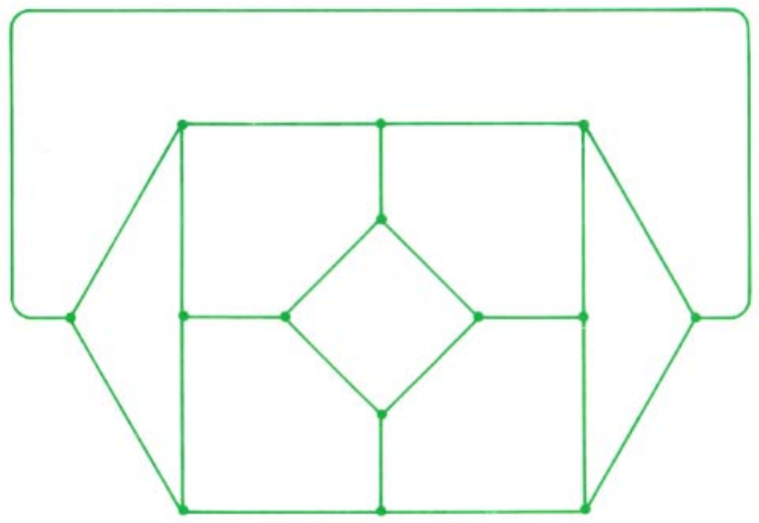
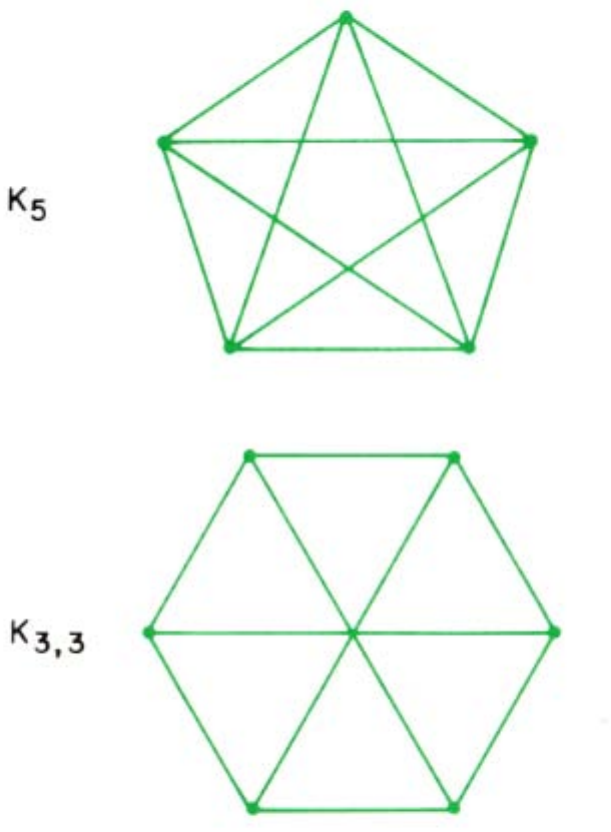
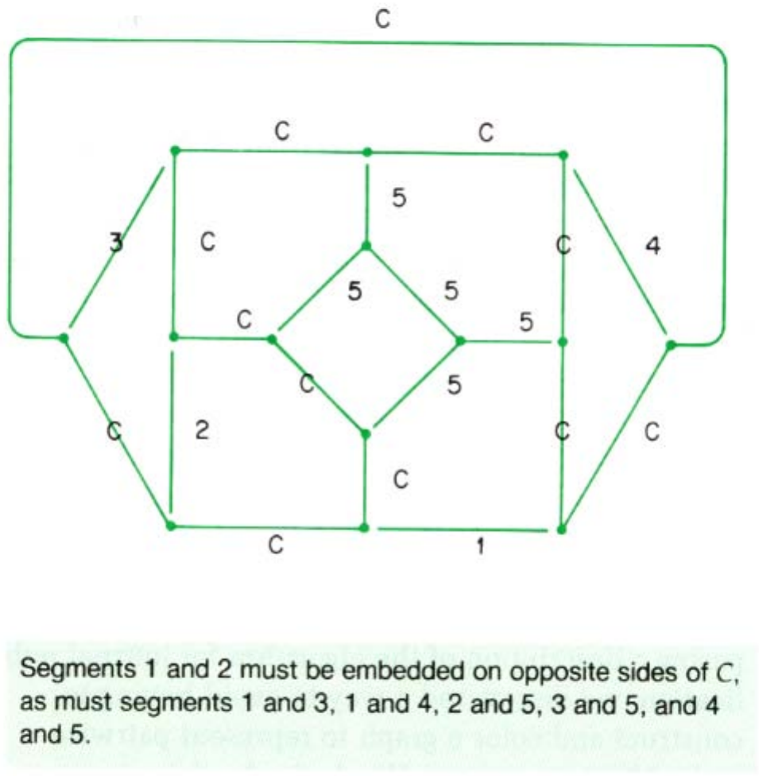
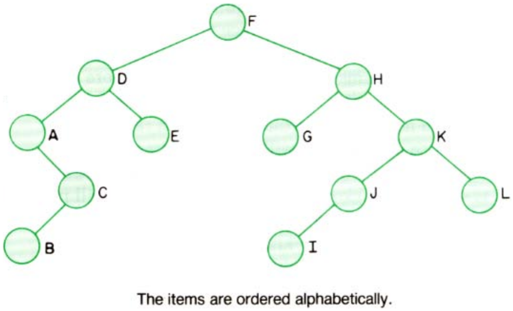
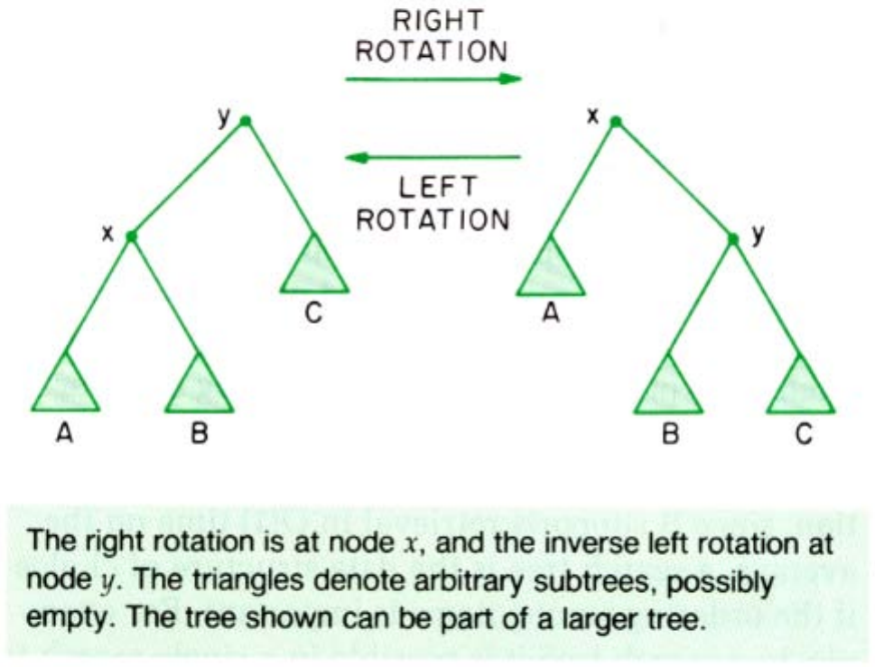
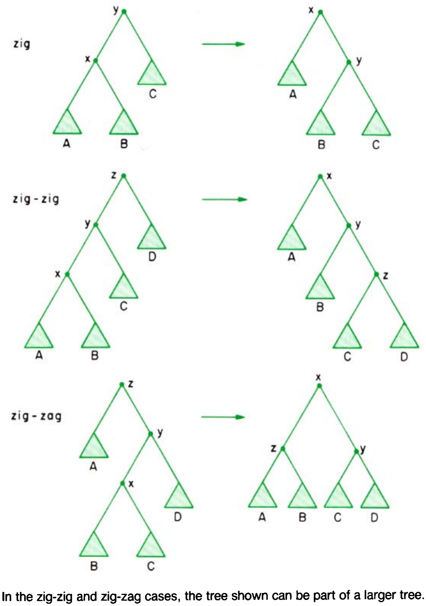
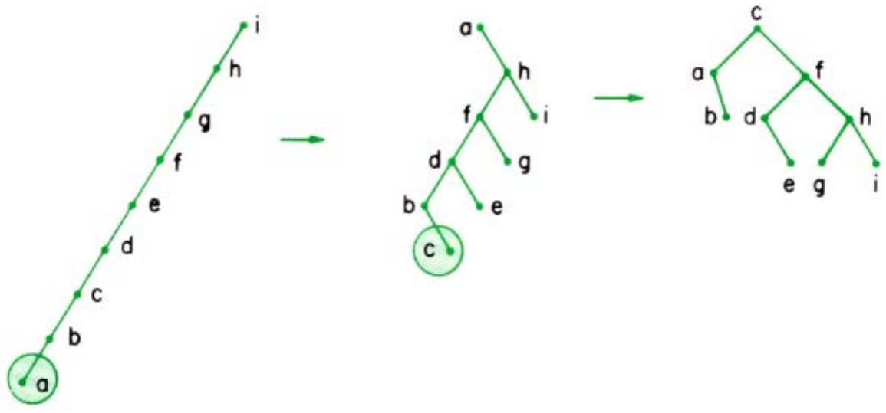

# 算法设计

**Algorithm Design**

> 作者 罗伯特·塔扬(Robert E. Tarjan)
> 1986 年 ACM 图灵奖演讲(与 John Hopcroft 同获)〔译注1〕
> 原载 *Communications of the ACM*, Vol. 30, No. 3 (1987 年 3 月), pp. 204–212
> 译自 ACM DL 扫描件 `1283920.1283944.pdf`(个人学习用途)

> 对计算方法效率的追求,不仅产生了快速算法,还带来了洞见,从而引向优雅、简单且通用的问题解决方法。

得知我被选为 1986 年图灵奖的共同获得者,我感到既惊讶又欣喜。然而,当我开始思考这份巨大荣誉所带来的责任——向计算界就我自己选择的主题发表演讲时,我的欣喜变成了不安。我的许多朋友建议我做某种布道,但我不是那种喜欢说教的人,所以我决定只与各位分享一些关于我所做的工作及其与现实计算世界相关性的想法。

我的大部分研究涉及高效计算机算法的设计与分析。这一领域的目标是设计出尽可能快、使用存储空间尽可能少的问题解决方法。算法的效率不是通过编程并在实际计算机上运行来衡量的,而是通过进行数学分析来给出其潜在的时间和空间消耗界限。这种理论分析有一个明显的优势:它独立于算法的编程实现、编写程序所用的语言以及运行程序的特定计算机。这意味着从这种分析中得出的结论往往具有广泛的适用性。此外,理论上高效的算法在实践中通常也是高效的(当然并非总是如此)。

但高效算法的设计还有一个更深层次的维度。为理论效率而设计需要专注于问题的重要方面,从而避免冗余计算,并设计出能够精确表示解决问题所需信息的数据结构。如果这种方法成功了,结果不仅是一个高效的算法,还包括从设计过程中提取的一系列洞见和方法,这些可以转移到其他问题上。由于理论家考虑的问题通常是现实世界问题的抽象,正是这些洞见和通用方法对从业者最有价值,因为它们提供了可用于构建现实世界问题解决方案的工具。

我将通过讲述两个特定算法的历史背景来阐述算法设计。一个是图算法,用于测试图的平面性(planarity),是我与 John Hopcroft〔译注2〕共同开发的。另一个是数据结构,一种自调整形式的搜索树,是我与 Danny Sleator〔译注3〕共同设计的。

1969 年 6 月,我从加州理工学院(CalTech)毕业,获得数学学士学位,决定攻读博士学位,但尚未决定是在数学还是计算机科学领域。我最终决定选择计算机科学,并于秋季进入斯坦福大学攻读研究生。我想,作为一名计算机科学家,我可以利用我的数学技能来解决比纯数学提出的问题更具直接实际意义的问题。我希望从事人工智能方面的研究,因为我想了解推理,或者至少是数学推理的工作方式。但我在斯坦福的课程导师是 Don Knuth〔译注4〕,我想他对我的未来另有打算:他给我的第一个建议是阅读他的书《计算机程序设计艺术》(*The Art of Computer Programming*)的第一卷。

到 1970 年 6 月,我成功通过了博士资格考试,并开始寻找论文题目。就在那个月, John Hopcroft 从康奈尔大学来到斯坦福开始他的休假年。我们开始讨论为各种图问题开发高效算法的可能性。

作为计算效率的衡量标准,我们确定了在顺序随机存取机(sequential random-access machine,顺序通用数字计算机的抽象)上运行的算法的最坏情况时间(worst-case time),它是输入规模的函数。我们选择忽略运行时间中的常数因子,这样我们的衡量标准就可以独立于任何机器模型和任何算法实现的细节。按此标准高效的算法在实践中往往也是高效的。这种衡量标准在分析上也是易于处理的,这意味着我们将能够从中推导出有趣的结论。

我们考虑过的其他方法各有弱点。在 20 世纪 60 年代中期,Jack Edmonds〔译注5〕强调了多项式时间算法和非多项式时间算法之间的区别,尽管这种区别在 70 年代初期引向了如今在复杂性理论中占据核心地位的 NP 完全性(NP-completeness)理论,但它太弱了,无法为实践中选择算法提供太多指导。另一方面,Knuth 实践了一种算法分析风格,其中常数因子甚至低阶项都会被估算。然而,对于我们想要研究的复杂算法,这种详细的分析非常难以进行,并且牺牲了实现独立性。另一种可能性是进行平均情况(average-case)分析而不是最坏情况分析,但对于图问题来说,这非常困难且可能不切实际:分析上易于处理的平均情况图模型似乎无法捕捉到实践中常见图的重要属性。

因此,60 年代末算法设计的状态并不令人满意。可用的分析工具几乎完全处于闲置状态;关于组合算法的典型论文内容是对算法的描述、一个计算机程序、程序在样本数据上的一些计时,以及基于这些计时的结论。由于编程细节的变化会使计算机程序的运行时间产生一个数量级的差异,因此此类结论不一定合理。John 和我希望通过使用最坏情况运行时间作为选择算法方法和数据结构的指南,帮助将组合算法的设计建立在更坚实的基础上。

我们活动的焦点变成了测试图的平面性问题。如果一个图可以画在平面上,使得每个顶点成为一个点,每条边成为连接相应顶点对的一条简单曲线,并且除了在公共顶点处外,没有两条边相触,那么该图就是平面的(见图 1)。

**图 1.** 一个平面图。展示了一个具有 8 个顶点和 12 条边的图,边在平面上不交叉。

Casimir Kuratowski 的一个优美定理指出,一个图是平面的,当且仅当它不包含五顶点完全图($K_5$)或三三完全二部图($K_{3,3}$)作为子图(见图 2)。

**图 2.** Kuratowski 的"禁止"子图。上方为 $K_5$(五角星形状),下方为 $K_{3,3}$(六个顶点分为两组,每组三个,两组之间全连接)。

不幸的是,Kuratowski 的准则并没有以任何明显的方式引向实用的平面性测试。已知的测试平面性的高效方法涉及实际尝试将图嵌入平面。要么嵌入过程成功,在这种情况下图是平面的;要么过程失败,在这种情况下图是非平面的。没有必要指定嵌入的几何形状;指定其拓扑结构即可。例如,了解每个顶点周围其关联边的顺时针排序就足够了。

Louis Auslander 和 Seymour Parter 在 1961 年制定了一种平面性算法,称为路径添加法(path addition method)。该算法很容易递归地表述:在图中找到一个简单回路(cycle),然后移除该回路,将图的其余部分分解为若干段(segments)。(在平面嵌入中,每一段必须完全位于嵌入回路的内部或完全位于外部;某些段对被约束在回路的相反两侧。见图 3。)通过递归应用该算法,测试每一段连同回路的平面性。如果每一段都通过了平面性测试,则确定这些段是否可以分配到回路的内部和外部,从而满足所有的成对约束。如果是这样,该图就是平面的。

**图 3.** 通过移除回路 $C$ 对图 1 中的图进行划分。展示了回路 $C$ 以及由其划分出的 5 个段。说明文字指出:段 1 和 2 必须嵌入在 $C$ 的相反两侧,段 1 和 3、1 和 4、2 和 5、3 和 5、4 和 5 亦然。

正如 A. Jay Goldstein 在 1963 年指出的,必须确保算法选择一个能产生两个或更多段的回路;如果只产生一个段,算法可能会陷入死循环。Rob Shirey 在 1969 年提出该算法的一个版本,在 $n$ 顶点图上运行时间为 $O(n^3)$。John 和我致力于开发该算法的一个更快版本。

关于平面图的一个有用事实是它们是稀疏的:在 $n$ 顶点图可以包含的 $n(n-1)/2$ 条边中,平面图最多只能包含 $3n-6$ 条边(如果 $n \ge 3$)。因此,John 和我(大胆地)希望能设计出一个 $O(n)$ 时间的平面性测试。最终,我们成功了。

第一步是确定合适的图表示方式,一种利用稀疏性的表示方式。我们使用了一种非常简单的表示,由每个顶点的关联边列表组成。对于一个可能是平面的图,这种表示的大小是 $O(n)$。

第二步是发现如何进行必要的预处理。路径添加法要求图是双连通的(biconnected,即没有移除后会使图不连通的顶点)。如果一个图不是双连通的,它可以被划分为极大双连通子图,即双连通分量(biconnected components)。一个图是平面的,当且仅当其所有双连通分量都是平面的。因此,可以通过先将图划分为双连通分量,然后测试每个分量的平面性来测试平面性。我们设计了一种算法,可以在 $O(n+m)$ 时间内找到具有 $n$ 个顶点、$m$ 条边的图的双连通分量。该算法使用了深度优先搜索(depth-first search, DFS)〔译注6〕,这是一种系统地探索图并访问每个顶点和边的方案。

我们现在面临平面性测试本身。有两个主要问题需要解决。如果路径添加法是以迭代而非递归的方式表述的,该方法就变成了嵌入一个初始回路,然后一次向不断增长的平面嵌入中添加一条路径。每条路径除了其端点顶点外,与之前的路径是不相交的。通常有不止一种方法来嵌入一条路径,而后续路径的嵌入可能会迫使之前路径的嵌入发生改变。我们需要一种将图划分为路径的方法,以及一种跟踪到目前为止处理的路径的可能嵌入的方法。

在仔细研究了深度优先搜索的性质后,我们开发了一种利用深度优先搜索在 $O(n)$ 时间内生成路径的方法。我们最初跟踪替代嵌入的方法使用了一种复杂且临时的嵌套结构。为了使这种方法正确工作,路径必须以特定的、动态确定的顺序生成。幸运的是,我们的路径生成算法足够灵活,可以满足这一要求,我们获得了一个运行时间为 $O(n \log n)$ 的平面性算法。

我们将该算法的运行时间降低到 $O(n)$ 的尝试失败了,于是我们转向了一种略有不同的方法,其中第一步是生成所有路径,第二步是构建一个表示它们成对嵌入约束的图,第三步是用两种颜色对这个约束图进行着色,对应于嵌入每条路径的两种可能方式。这种方法的问题在于可能存在二次方数量的成对约束。获得线性时间界限需要显式计算足够多的约束,使得它们的满足能保证所有剩余约束也得到满足。完善这一想法引出了一个 $O(n)$ 时间的平面性算法,这成为了我博士论文的主题。该算法不仅在理论上是高效的,而且在实践中也很快:我的实现是用 Algol W 编写并在 IBM 360/67 上运行的,在大约 12 秒内测试了具有 900 个顶点 and 2694 条边的图。这比我在文献中能找到的任何其他声称的时间界限快了大约 80 倍。不计注释,该程序长约 500 行。

然而,故事并没有到此结束。在准备期刊发表的算法描述时,我们发现了一种避免构建和着色表示成对嵌入约束的图的方法。我们设计了一种称为双栈堆(pile of twin stacks)的数据结构,它可以表示到目前为止处理的路径的所有可能嵌入,并且易于更新以反映新路径的添加。这引出了一个更简单的算法,仍然具有 $O(n)$ 时间界限。我的学生 Don Woods 为这个更简单的算法编写了程序,在 IBM 370/168 上,8 秒内测试了具有 7000 个顶点的图。程序长度约为 250 行 Algol W,其中平面性测试仅需约 170 行,其余部分用于实际构建平面表示。

通过这项研究,我们不仅获得了一个快速的平面性算法,还获得了一种对解决许多其他问题都有用的算法技术(深度优先搜索)和一种数据结构(双栈堆)。深度优先搜索已被用于解决各种图问题的有效算法中;双栈堆已被用于解决排序和识别平面自交曲线代码的问题。

我们的算法并不是在 $O(n)$ 时间内测试平面性的唯一方法。Abraham Lempel、Shimon Even 和 Israel Cederbaum 的另一种方法是通过一次添加一个顶点及其关联边来构建嵌入。该算法的直接实现给出了 $O(n^2)$ 的时间界限。当 John 和我进行研究时,我们没有看到改进这一界限的方法,但后来 Even 和我以及 Kelly Booth 和 George Lueker 的工作产生了这个算法的 $O(n)$ 时间版本。同样,该方法结合了深度优先搜索(在预处理步骤中确定顶点添加的顺序)和一种复杂的数据结构,即 Booth 和 Lueker 的 PQ 树(PQ-tree),用于跟踪可能的嵌入。(这种数据结构本身也有其他几种应用。)

还有第三种 $O(n)$ 时间的平面性算法。我最近才发现,Leo Guibas、Mike Plass、Ed McCreight 和 Janet Roberts 在 1977 年发明的一种称为手指搜索树(finger search tree)的新型搜索树,可以用于 John 和我开发的原始平面性算法,将其运行时间从 $O(n \log n)$ 提高到 $O(n)$。推导时间界限需要解决一个分治递归式。手指搜索树在发明后的几年里没有特别引人注目的应用,但现在有了,在排序和计算几何以及图算法中都有应用。

最终,选择正确的数据结构对于高效算法的设计至关重要。这些结构可能很复杂,可能需要数年时间才能将复杂的数据结构或算法提炼到其本质。但一个好的想法最终总会变得更简单,并为预期之外的问题提供解决方案。正如在数学中一样,计算机科学中表面上各异的部分之间存在着丰富而深刻的联系。

我现在想把重点从图算法转向数据结构,反思一下最坏情况运行时间是否是衡量数据结构效率的合适标准。图算法通常一次运行在一个图上。然而,对数据结构的操作并不是孤立发生的;它是对该结构进行的一长串类似操作中的一个。在大多数应用中,重要的是整个操作序列所花费的时间,而不是任何单个操作所花费的时间。(例外情况发生在实时应用中,在这些应用中,最小化每个单独操作的时间很重要。)

我们可以通过将操作的最坏情况时间乘以操作次数来估算操作序列的总时间。但这可能会产生一个过于悲观以至于毫无用处的界限。如果在这种估算中,我们用操作的平均情况时间代替最坏情况时间,我们可能会得到一个更紧凑的界限,但这个界限取决于概率模型的准确性。这两种估算的缺点在于它们没有捕捉到连续操作对数据结构可能产生的关联影响。一个简单的例子可以在平面性测试中使用的双栈堆中找到:在 $n$ 个操作的序列中,单个操作可能花费与 $n$ 成正比的时间,但序列中 $n$ 个操作的总时间始终是 $O(n)$。在这种情况下,合适的衡量标准是摊还时间(amortized time)〔译注7〕,定义为在最坏情况操作序列中平均每个操作的时间。在双栈堆的情况下,每个操作的摊还时间是 $O(1)$。

摊还效率的一个更复杂的例子可以在表示不相交集合(disjoint sets)的并集(set union)操作的数据结构中找到。在这种情况下,每个操作的最坏情况时间是 $O(\log n)$,其中 $n$ 是所有集合的总大小,但每个操作的摊还时间在所有实际用途中都是常数,但在理论上随 $n$ 增长非常缓慢(摊还时间是阿克曼函数(Ackermann's function)的一个泛函逆)〔译注8〕。

这两个例子说明了使用摊还分析来对已知数据结构提供更严密的分析。但摊还分析还有一个更深远的用途。在设计数据结构以减少摊还运行时间时,我们被引向了一种与试图减少最坏情况运行时间不同的方法。我们不再精心构建一个具有精确正确属性以保证良好最坏情况时间界限的结构,而是可以尝试设计简单的局部重构操作,如果重复应用这些操作,就能改善结构的状态。这种方法可以产生"自调整(self-adjusting)或自组织(self-organizing)"的数据结构,它们能够适应其用法,并且在广泛的竞争结构类中具有接近最优的摊还效率。

伸展树(splay tree)是我和 Danny Sleator 开发的一种自调整形式的二叉搜索树,就是这样一种数据结构。为了讨论它,我首先需要回顾一些关于搜索树的概念和结果。二叉树要么为空,要么由一个称为根(root)的节点和两个节点不相交的二叉树组成,这两个二叉树分别称为根的左子树和右子树。左(右)子树的根是树根的左(右)孩子。二叉搜索树(binary search tree)是一棵二叉树,其节点中包含来自全序集的项,每个节点一项,各项按对称顺序排列;也就是说,左子树中的所有项都小于根中的项,右子树中的所有项都大于根中的项(见图 4)。

**图 4.** 一棵二叉搜索树。展示了一棵包含字母 A 到 L 的树,满足二叉搜索树的性质。说明文字:各项按字母顺序排列。

二叉搜索树支持对其表示的集合中的项进行快速检索。基于二分查找的检索算法很容易递归地表述。如果树为空,停止:所需的项不存在。否则,如果根包含所需的项,停止:项已找到。否则,如果所需的项大于根中的项,搜索左子树;如果所需的项小于根中的项,搜索右子树。此类搜索花费的时间与所需项的深度成正比,深度定义为搜索过程中检查的节点数。最坏情况检索时间与树的深度成正比,深度定义为最大节点深度。

二叉搜索树上的其他高效操作包括插入新项和删除旧项(树分别增加或减少一个节点)。此类树提供了一种表示静态或动态变化的有序集的方法。尽管在许多情况下哈希表(hash table)是首选表示,因为它支持平均 $O(1)$ 时间的检索,但如果项之间的顺序很重要,搜索树就是首选数据结构。例如,在搜索树中,可以在单次搜索中找到小于给定项的最大项,而在哈希表中这需要检查所有项。搜索树还支持更复杂的操作,例如检索给定项对之间的所有项(范围检索)以及列表的连接和拆分。

一个 $n$ 节点的二叉树必有深度至少为 $\log_2 n$ 的节点;因此,对于任何二叉搜索树,最坏情况检索时间至少是 $\log n$ 的常数倍。可以通过使用平衡树(balanced tree)来保证 $O(\log n)$ 的最坏情况检索时间。从 1962 年 Georgii Adelson-Velskii 和 Evgenii Landis 发现高度平衡树(AVL 树)开始,许多种类的平衡树被发现,它们都基于相同的通用思想。树被要求满足平衡约束,即保证深度为 $O(\log n)$ 的某种局部性质。在更新(如插入或删除)后,通过在树上执行一系列局部变换来恢复平衡约束。在二叉树的情况下,每个变换都是一次旋转(rotation),它花费常数时间,改变某些节点的深度,并保持项的对称顺序(见图 5)。

**图 5.** 二叉搜索树中的旋转。展示了右旋(RIGHT ROTATION)和左旋(LEFT ROTATION)的过程。说明文字:右旋发生在节点 $x$ 处,其逆操作左旋发生在节点 $y$ 处。三角形表示任意子树,可能为空。所示树可以是更大树的一部分。

尽管在理论上具有巨大意义,但平衡搜索树在实践中也有缺点。维护平衡约束需要在节点中存储平衡信息的额外空间,并且需要具有许多情况的复杂更新算法。如果树中的项被访问得或多或少是均匀的,那么在实践中根本不平衡树会更简单且更高效;随机的插入序列将产生深度为 $O(\log n)$ 的树。另一方面,如果访问分布显著倾斜,那么平衡树将无法最小化总访问时间,甚至无法达到常数因子以内。据我所知,在实践中广泛使用的唯一一种平衡树是 Rudolph Bayer 和 Ed McCreight 的 B 树(B-tree),它通常每个节点有两个以上的孩子,适用于在磁盘等二级存储介质上存储超大型数据集。B 树之所以有用,是因为平衡的好处随着每个节点孩子数量的增加以及相应的最大深度的减少而增加。在实践中,B 树的最大深度是一个很小的常数(三或四)。

伸展树的发明源于我在 20 世纪 70 年代末在斯坦福大学与我的两名学生 Sam Bent 和 Danny Sleator 所做的工作。在康奈尔和伯克利待了一段时间后,我作为教员回到了斯坦福。Danny 和我当时正试图设计一种高效的算法来计算网络中的最大流。我们将这个问题简化为构建一种特殊的搜索树,其中每项都有一个正权重,检索一项所需的时间取决于其权重,较重的项比较轻的项更容易访问。最难满足的要求是能够快速执行剧烈的更新操作;每棵树都要表示一个列表,我们需要允许列表拆分和连接。Sam、Danny 和我经过大量工作,成功设计出平衡搜索树的一种合适的推广,称为偏向搜索树(biased search trees),这成为了 Sam 博士论文的主题。Danny 和我将偏向搜索树与其他想法结合起来,获得了我们一直寻求的高效最大流算法。该算法反过来又是 Danny 博士论文的主题。构成该算法核心的数据结构称为动态树(dynamic tree),具有多种其他应用。

偏向搜索树和我们最初版本的动态树的问题在于它们很复杂。原因之一是我们曾试图设计这些结构来最小化每个操作的最坏情况时间。在这方面我们并没有完全成功;这些结构上的更新操作仅在摊还意义上具有所需的效率。在 Danny 和我于 1980 年底都搬到 AT&T 贝尔实验室后,他建议通过显式寻求摊还效率而非最坏情况效率来简化动态树的可能性。这个想法自然而然地引向了设计一种"自调整"搜索树的问题,这种搜索树将像平衡树一样高效,但仅在摊还意义上。公式化这个问题后,我们只用了几周时间就想出了一个候选数据结构,尽管分析它花了我们更长的时间(分析目前仍不完整)。

在伸展树中,每次检索一项后都会进行树的重构,称为伸展操作(splay operation)。(Splay 作为动词,意思是"展开"。)伸展将检索到的节点移动到树根,使检索过程中访问的所有节点的深度大约减半,并使树中任何节点的深度最多增加二。因此,伸展使得检索过程中访问的所有节点在以后更容易访问,同时使树中的其他节点最多变得稍微难访问一点。

伸展操作的细节如下(见图 6):要在节点 $x$ 处进行伸展,重复以下步骤直到节点 $x$ 成为树根。

**伸展步(Splay Step)**。应用以下三种情况中合适的一种:
*   **Zig 情况**。如果 $x$ 是树根的孩子,在 $x$ 处旋转(此情况为终止步)。
*   **Zig-zig 情况**。如果 $x$ 是左孩子且其父节点也是左孩子,或者两者都是右孩子,先在 $x$ 的父节点处旋转,然后在 $x$ 处旋转。
*   **Zig-zag 情况**。如果 $x$ 是左孩子且其父节点是右孩子,反之亦然,在 $x$ 处旋转,然后再次在 $x$ 处旋转。

**图 6.** 伸展步的情况。展示了 zig、zig-zig 和 zig-zag 三种情况下的树结构变换。说明文字:在 zig-zig 和 zig-zag 情况下,所示树可以是更大树的一部分。

如图 7 所示,在最初非常不平衡的伸展树上进行一系列代价高昂的检索,将迅速使其进入合理的平衡状态。事实上,一个 $n$ 节点伸展树的摊还检索时间是 $O(\log n)$。伸展树具有甚至更引人注目的理论性质。对于任意但足够长的检索序列,伸展树在常数因子内与为最小化该给定序列的总检索时间而专门构建的最优静态二叉搜索树一样高效。伸展树在摊还意义上的表现与偏向搜索树一样好,这使得 Danny 和我获得了动态树的一个简化版本,即我们最初的目标。

**图 7.** 在最初不平衡的树上进行两次代价高昂的伸展序列。展示了通过伸展操作,树从一条长链逐渐变得平衡的过程。

基于这些结果,Danny 和我推测伸展树在以下意义上是一种普遍最优(universally optimum)形式的二叉搜索树:考虑一个固定的 $n$ 项集合和 $m \ge n$ 次对这些项的任意检索序列。考虑任何通过从初始二叉搜索树开始执行这些检索的算法,每次检索通过从根节点以标准方式搜索来执行,并间歇性地通过在树中任何位置执行旋转来重构树。算法的成本是检索项被检索时的深度之和加上旋转的总次数。我们推测,从任意糟糕的初始树开始,伸展算法的总成本在任何算法的最小成本的常数因子之内。也许这个推测好得令人难以置信。支持该推测的一个额外证据是,使用伸展按顺序访问二叉搜索树的所有项仅需线性时间。

除了其有趣的理论性质外,伸展树在实践中也具有潜在价值。伸展易于实现,它也使得插入和删除等树更新操作变得简单。Doug Jones 的初步实验表明,在实现离散模拟系统中的事件列表方面,伸展树与所有其他已知数据结构相比都具有竞争力。它们可能在各种其他应用中有用,尽管验证这一点需要大量系统且仔细的实验。

伸展树的发展引出了几个结论。对一个已经解决的问题继续工作可以带来重大的简化和额外的洞见。为摊还效率而设计可以产生简单的自适应数据结构,它们在实践中比其最坏情况高效的近亲更高效。更一般地,所选择的效率衡量标准暗示了处理算法问题应采取的方法,并指导了解决方案的开发。

我想就我认为算法设计领域需要什么谈几点看法。说我们需要理论与实践之间更紧密的耦合是陈词滥调,但这确实是事实。实践世界为研究人员提供了丰富多样的研究问题来源。研究人员不仅可以为特定问题提供实用算法,还可以提供在各种应用中都有用的广泛方法和通用技术。

有两件事将支持理论与实践之间更好的互动。一是更多关于算法实验分析的工作。算法的理论分析建立在坚实的基础之上。实验分析则不然。我们需要一种严谨、系统、科学的方法。实验分析在某种程度上比理论分析难得多,因为实验分析需要编写实际程序,而且很难避免通过编码过程或样本数据的选择引入偏差。

另一个需求是需要一种既易于人类理解又能在机器上高效执行的编程语言或记号。传统的编程语言强加了过多的无关细节,而更新的极高水平语言则提出了具有挑战性的实现任务,需要对数据结构、算法方法及其选择进行更多的工作。

现在理论界和实践界都在为并行性(parallelism)问题而沸腾。对于理论家来说,并行性提供了一种新的计算模型,从而改变了理论分析的游戏规则。对于从业者来说,并行性提供了一种在解决某些问题时获得巨大加速的可能性。然而,并行硬件不会使理论分析变得不重要。事实上,随着可解决问题规模的增加,渐近分析变得越来越重要,而不是越来越不重要。将开发出利用并行性的新算法,但为顺序计算开发的许多想法也将转移到并行设置中。重要的是要意识到,并非所有问题都适合并行解决。理解并行性的影响是当今算法设计研究的一个核心目标。

我从事算法设计研究,不仅是因为它提供了影响现实计算世界的可能性,还因为我热爱这项工作本身,它揭示了问题与解决方案之间丰富而令人惊讶的联系,以及它提供的与富有创造力、激励人心且深思熟虑的同事共同发现新想法的机会。我感谢美国计算机协会(ACM)和整个计算界授予我这个奖项,这不仅是对我个人想法的认可,也是对我有幸与之共事的个人的认可。他们人数众多,无法在此一一列举,但我想要感谢所有人,特别是 John Hopcroft 和 Danny Sleator,感谢他们在这一发现过程中分享的想法和努力。

---

**参考文献** (References)

1. Adelson-Velskii, G. M., and Landis, E. M. An algorithm for the organization of information. *Dokl. Akad. Nauk SSSR 146* (1962), 263–266 (in Russian). English translation in *Soviet Math. Dokl. 3*, 1259–1263.
2. Auslander, L., and Parter, S. V. On imbedding graphs in the sphere. *J. Math. Mech. 10* (1961), 517–523.
3. Bayer, R., and McCreight, E. Organization and maintenance of large ordered indexes. *Acta Inf. 1* (1972), 173–189.
4. Bent, S. W., Sleator, D. D., and Tarjan, R. E. Biased search trees. *SIAM J. Comput. 14*, 3 (Aug. 1985), 545–568.
5. Booth, K. S., and Lueker, G. S. Testing for the consecutive ones property, interval graphs, and graph planarity using PQ-tree algorithms. *J. Comput. Syst. Sci. 13* (1976), 335–379.
6. Edmonds, J. Paths, trees, and flowers. *Can. J. Math. 17* (1965), 449–467.
7. Even, S., and Tarjan, R. E. Computing an st-numbering. *Theor. Comput. Sci. 2* (1976), 339–344.
8. Goldstein, A. J. Recursive topology as applied to lay-out problems. In *Proceedings of the 15th ACM National Conference* (1963).
9. Guibas, L. J., McCreight, E. M., Plass, M. F., and Roberts, J. R. A new representation for linear lists. In *Proceedings of the 9th Annual ACM Symposium on Theory of Computing* (1977), 49–60.
10. Hopcroft, J. E., and Tarjan, R. E. Efficient algorithms for graph manipulation. *Commun. ACM 16*, 6 (June 1973), 372–378.
11. Hopcroft, J. E., and Tarjan, R. E. Efficient planarity testing. *J. ACM 21*, 4 (Oct. 1974), 549–568.
12. Knuth, D. E. *The Art of Computer Programming, Vol. 1: Fundamental Algorithms*. Addison-Wesley, Reading, Mass., 1968.
13. Kuratowski, C. Sur le problème des courbes gauches en topologie. *Fund. Math. 15* (1930), 271–283.
14. Lempel, A., Even, S., and Cederbaum, I. An algorithm for planarity testing of graphs. In *Theory of Graphs: International Symposium* (Rome, 1966), P. Rosenstiehl, Ed., Gordon and Breach, New York, 1967, 215–232.
15. Shirey, R. W. Implementation and analysis of efficient graph planarity testing algorithms. Ph.D. dissertation, University of Wisconsin, Madison, 1969.
16. Sleator, D. D., and Tarjan, R. E. A data structure for dynamic trees. *J. Comput. Syst. Sci. 26*, 3 (June 1983), 362–391.
17. Sleator, D. D., and Tarjan, R. E. Self-adjusting binary search trees. *J. ACM 32*, 3 (July 1985), 652–686.
18. Tarjan, R. E. An efficient planarity algorithm. *J. ACM 21*, 4 (Oct. 1974), 549–568.
19. Tarjan, R. E. Amortized computational complexity. *SIAM J. Alg. Disc. Math. 6*, 2 (Apr. 1985), 306–318.

---

## 译注

**文本与翻译说明**

1. 〔译注1〕 罗伯特·塔扬(Robert E. Tarjan)与 John Hopcroft 因在算法和数据结构设计与分析方面的基础性贡献,共同获得 1986 年图灵奖。
2. 〔译注2〕 John Hopcroft,1986 年图灵奖得主,Tarjan 的博士导师,两人合作开发了许多经典的图算法。
3. 〔译注3〕 Danny Sleator,卡内基梅隆大学教授,Tarjan 的长期合作伙伴,共同发明了伸展树(Splay Tree)和动态树(Link-Cut Tree)。

**背景与文化注**(译者补注,原文无)

4. 〔译注4〕 Don Knuth,即高德纳,1974 年图灵奖得主,《计算机程序设计艺术》作者。Tarjan 在斯坦福时的课程导师。
5. 〔译注5〕 Jack Edmonds,组合优化领域的先驱,提出了多项式时间算法作为"高效"定义的标准。
6. 〔译注6〕 深度优先搜索(DFS)虽非 Tarjan 发明,但他系统地展示了如何利用 DFS 配合辅助数据结构(如低链路值)在 $O(n+m)$ 时间内解决双连通分量、强连通分量等复杂图问题,这被认为是现代图算法的基石。
7. 〔译注7〕 摊还分析(Amortized Analysis)是 Tarjan 对算法分析最重要的贡献之一。它不关注单个操作的最坏情况,而是关注一系列操作的总成本。这为许多自调整数据结构(如伸展树、斐波那契堆)的效率提供了理论证明。
8. 〔译注8〕 阿克曼函数的反函数 $\alpha(n)$ 增长极其缓慢,对于宇宙中任何可想象的 $n$,其值都不超过 5。Tarjan 证明了并查集(Union-Find)在使用路径压缩和按秩合并时的摊还时间复杂度正是 $O(\alpha(n))$,这是算法分析史上最著名的结果之一。

**OCR 与印刷勘误**

9. 扫描件中数学符号和下标存在多处 OCR 错误(如 $O(n 3)$ 应为 $O(n^3)$,$n _> 3$ 应为 $n \ge 3$),已对照原刊页面图像并结合上下文逻辑全部校正为 LaTeX 格式。
10. 参考文献 [12] 原刊印作 "Vol. 1: Fundamental Algorithins",已修正为 "Algorithms"。
11. 原文七幅插图已按原版样式从扫描页中提取为 PNG 并内嵌于正文相应位置（见 zh/assets/1986-tarjan/）：图 1 平面图（第 3 页）、图 2 Kuratowski 禁止子图 K5 与 K3,3（第 3 页）、图 3 移去回路 C 划分图（第 4 页）、图 4 二叉搜索树（第 6 页）、图 5 二叉搜索树旋转（第 7 页）、图 6 伸展步 zig/zig-zig/zig-zag（第 8 页）、图 7 两次昂贵伸展的序列（第 8 页）。扫描件线条较浅,放大后可正常辨识。
