# 微流水线

**Micropipelines**

> 伊凡·萨瑟兰(Ivan E. Sutherland)〔译注1〕
> 1988 年 ACM 图灵奖演讲
> 原载 *Communications of the ACM*, Vol. 32, No. 6 (1989 年 6 月), pp. 720–738
> 译自 `1283920.1283946.pdf`(个人学习用途)

流水线处理器是超高速计算机制的一种常见范式。流水线处理器之所以能提供高速，是因为它们的各个阶段可以并发运行，就像制造装配线上的不同工人在物料流经生产线时并发工作一样。尽管流水线处理器的并发性使其设计成为一项艰巨的任务，但它们广泛存在于图形处理器、信号处理设备、用于算术运算的集成电路组件，以及通用计算机制的指令解释单元和算术运算单元中。

由于我计划描述各种形式的流水线处理器，我将首先为它们的各种形式建议名称。流水线处理器，或者更简单地称为流水线（pipelines），在数据流经它们时对其进行操作。流水线的延迟（latency）是衡量单个数据值通过它所需时间的指标。流水线的吞吐率（throughput rate）是衡量单位时间内可以通过它的数据值数量的指标。

流水线既存储数据又处理数据；其中的存储元件和处理逻辑沿其长度交替排列。我稍后将描述流水线的完整形式，但首先我将只关注它们的存储元件，剥离所有的处理逻辑。

剥离了所有处理逻辑后，任何流水线都表现为一系列数据可以流经的存储元件。流水线可以是时钟驱动的（clocked）或事件驱动的（event-driven），这取决于它们的部件是响应某种广泛分布的外部时钟，还是在局部事件允许时独立行动。有些流水线是非弹性的（inelastic）；其中的数据量是固定的。非弹性流水线的输入速率和输出速率必须完全匹配。剥离了任何处理逻辑后，非弹性流水线就像一个移位寄存器。其他流水线是弹性的（elastic）；其中的数据量可能会发生变化。由于内部缓冲，弹性流水线的输入速率和输出速率可能会暂时不同。剥离了所有处理逻辑后，弹性流水线就变成了一个流通过式先进先出存储器，即 FIFO。FIFO 可以是时钟驱动的或事件驱动的；它们的重要属性是具有弹性。

我将一种特别简单的、带有或不带有内部处理的事件驱动弹性流水线命名为微流水线（micropipeline）。这个名字中的“微”（micro）部分对我来说似乎很合适，因为微流水线包含非常简单的电路，因为微流水线在非常短的长度下也很有用，而且因为微流水线适合以微电子形式布局。

我选择微流水线作为本次演讲的主题有三个原因。首先，微流水线简单易懂。我相信简单的想法是最好的，我发现微流水线的简单和对称中蕴含着美。其次，我看到围绕 FIFO 设计存在混乱。我提供对微流水线的这种描述，希望能减少其中的一些混乱。

我选择这个主题的第三个原因是为了应对目前数字系统设计中常用的时钟逻辑（clocked-logic）概念框架所强加给我们的限制。我相信，这种概念框架或思维定势掩盖了像微流水线这样简单实用的结构，使我们无法思考它们；如果给定一个不同的概念框架，这些结构是很容易设计和应用的。由于微流水线是事件驱动的，它们的简单性在时钟逻辑概念框架内是无法获得的。我提供对微流水线的这种描述，希望能将注意力集中在另一种替代的跳变信令（transition-signalling）〔译注2〕概念框架上。

我们需要一个新的概念框架，因为超大规模集成电路（VLSI）技术的复杂性现在已经达到了设计时间和设计成本往往超过制造时间和制造成本的程度。此外，当今设计的大多数系统都是单体式的，难以进行中期改进。跳变信令概念框架提供了通过从更简单的碎片进行分层组合来构建复杂系统的机会。由此产生的系统很容易修改。我相信，跳变信令概念框架在降低复杂系统的设计时间和成本、增加其使用寿命方面大有可为。我提供对微流水线的这种描述，作为跳变信令概念框架的一个例子。

直到最近，只有极少数人使用跳变信令概念框架进行设计，因为它太难了。设计由 10 到 100 个晶体管组成的、构成复杂系统所组成的元素级构建块几乎是不可能的。然而，在过去的五年里，在这两个方面都取得了很大进展。华盛顿大学的 Charles Molnar 及其同事开发了一种设计小型基本构建块的简单方法 [9]。埃因霍温理工大学 Martin Rem 的“VLSI 俱乐部”一直有效地致力于事件驱动系统的数学研究 [6, 10, 11, 19]。这些新兴的概念工具现在使跳变信令成为广泛使用的有力竞争者。

## 两个概念框架

在时钟逻辑概念框架中，由公共时钟操作的触发器寄存器将处理逻辑的各个阶段分开。每当流水线时钟进入其活动状态时，一个新的数据元素就会进入每个寄存器。数据元素步调一致地穿过连续的寄存器，每个寄存器花费固定数量的时钟周期来通过内置于系统中的固定数量的寄存器和干预逻辑阶段。时钟逻辑概念框架之所以被广泛使用，是因为：1) 它提供了一种设计计算设备的简单方法；2) 它被广泛教授和理解；3) 因为带有时钟的部件随处可见；4) 因为系统噪声在时钟事件发生时已经消失。

为了构建这里描述的微流水线，我们必须抛弃时钟逻辑概念框架，转而思考一种不同但同样简单的控制形式，称为跳变信令。作为回报，我们获得了三种新型的灵活性。在硬件设计中，我们获得了一种新的灵活性，可以从先前设计和测试的小部件组合成系统；在软件中，我们获得了一种新的灵活性来处理变长向量；在系统中，我们享有了通过在改进的速度或成本可用时更换隔离部件来延长系统寿命的新灵活性。

抛弃一个概念框架往往很难。图 1 中所示的著名谜题说明了这种困难，它要求我们用四条直线连接纸上的九个点，笔尖不离开纸面。我们对图形和背景的自然观念表明，这些线应该画在点组成的方框内，这种概念框架使得任务无法完成。只有通过在点的边界之外画线，谜题才能解开。

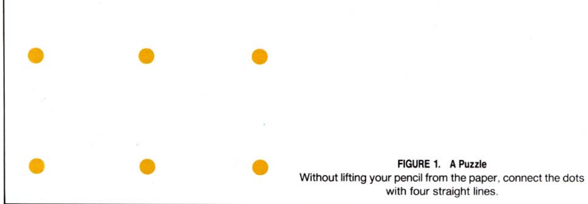

**图 1.** 一个谜题。不离开纸面，用四条直线连接这些点。

在 FIFO 的设计中也可以看到抛弃概念框架的类似困难。时钟逻辑概念框架中的传统智慧认为，流通过式 FIFO 的每个阶段都应该有一个时钟寄存器，将其输出馈送到下一阶段的输入。现在回想一下，FIFO 必须是弹性的；它必须能够存储可变数量的数据；如果它有固定数量的阶段，其中一些阶段必须是未占用的。继续使用时钟逻辑概念框架，需要为每个阶段配备一个“满”或“空”的时钟触发器，以使 FIFO 具有弹性。

每个阶段还必须具有涉及其自身触发器状态和其他阶段状态的逻辑，以决定何时捕获新数据。一条简单的控制规则如下：a) 每当每个阶段为空且其前驱为满时，该阶段捕获新数据并将其触发器设置为满状态。b) 每当每个阶段为满且其后继为空时，该阶段将其触发器设置为空状态。这条规则每隔一个时钟周期传递一次输出数据。更复杂的同步 FIFO 控制规则通过超前查看多个阶段来获得更好的性能，以决定在即将到来的周期中是否可以移动整个数据块。时钟逻辑框架本身造成了这种复杂性，因为所有寄存器必须同时动作；任何现在未能动作的寄存器都必须为它们的下一次机会承受一整个周期的延迟。

时钟逻辑概念框架与 FIFO 设计不太匹配的另一个原因是：FIFO 经常连接具有独立时钟的发送器和接收器。设计具有独立输入和输出时钟的 FIFO 的困难在询问使用输入时钟还是输出时钟来控制内部阶段时尤为明显。在 FIFO 中没有自然的点可以将控制从输入时钟转移到输出时钟。转移应该发生在开头、中间还是流水线的末端？为什么？

如果输入和输出端使用传统的时钟，并且这两个时钟是独立的，那么设计中某处就需要仲裁（arbitration）或同步（synchronization）。之所以需要仲裁或同步，是因为数据必须从输入时钟的控制传递到输出时钟的控制，即使时钟之间的相位关系是未知且多变的。独立时钟之间总会存在某种相位关系，违反锁存器或触发器的建立或保持时间要求。

仲裁或同步是必需的这一事实在时钟驱动的 FIFO 中引入了许多问题 [1]。不可能制造出完全可靠的仲裁器或同步器；相反，必须设计一个故障概率低到可以忽略不计的电路。遗憾的是，尽管同步器和仲裁器固有的问题已为人所知多年，但同步器故障仍然造成困难，而且值得注意的是，关于仲裁和同步的讨论在现在的 FIFO 描述中基本上是缺失的。固有同步器问题的解决方案留给了用户。

我将在这里描述的微流水线的内部阶段既不直接从输入控制信号获得定时信号，也不直接从输出控制信号获得定时信号。相反，每个内部阶段在接受了当前值且其前驱阶段有了新数据准备就绪时捕获一个新的数据值。每个阶段以自己的步调运行，仅使用来自相邻阶段的控制信息。让每个阶段独立运行，无需公共时钟，避免了对仲裁的需求并简化了设计。虽然在时钟逻辑概念框架内设计 FIFO 和其他流水线非常困难，但一旦抛弃该框架转而支持跳变信令，设计就会变得很容易，正如我将在整个演讲中所做的那样。

## 跳变信令

在跳变信令中，任何跳变（无论是上升沿还是下降沿）都具有相同的含义，如图 2 所示；任何一种跳变都被称为一个事件（event）。如图中所示，并由其名称所暗示的，跳变信令避免了区分两种类型的跳变，尽管它们看起来可能完全不同。实际上，对跳变信号的所有响应都是边沿触发的，并且在上升沿和下降沿都会触发。由于跳变信令同时使用上升沿和下降沿作为触发事件，它可能提供两倍于传统时钟的速度潜力。

**图 2.** 两个等效晶体管。信令线上的上升和下降跳变具有相同的含义。它们被称为事件。

跳变信令避免了为控制信号的绝对高电平或低电平分配含义。我将仅相对于其他相关控制信号的状态来使用控制信号的状态；一个控制信号的状态可能与另一个控制信号的状态相同或不同，但其绝对状态永远无关紧要。由于跳变控制信号的绝对状态并不重要，因此无需将其返回到事件之间的某个中性状态。通过避免这种返回中性或低电平状态的操作，跳变信令节省了返回跳变的时间和能量成本，以及不必要事件的设计混乱。跳变信令非常类似于非归零（NRZ）磁记录。

许多人起初很难理解上升沿和下降沿应该具有相同含义的概念。这并不奇怪，因为需要改变概念框架。大多数人习惯于区分高电平和低电平，以及返回到动作之间中性状态的时钟。但即使起初看起来很奇怪，跳变信令概念框架很快就会变得非常容易使用。抛弃时钟逻辑概念框架而支持跳变信令概念框架，可以在速度和简单性方面提供真正的优势，这在微流水线中尤为突出。

跳变信令电路必须相对于控制信号的高电平和低电平状态对称，因为上升和下降跳变具有相同的含义。在整个演讲中寻找这种对称性。还要注意，我对电路动作的描述仅以相对术语谈论控制信号电平，即相同或不同，而不是绝对术语，即高或低，同样是为了保持对称性。我仅对数据值使用传统电平（高或低）。跳变信令的对称性为互补金属氧化物半导体（CMOS）电路提供了极具吸引力的简单性，因为它非常适合 CMOS 电路所构建的互补晶体管的对称性。

## 二相捆绑数据约定

如果发送器和接收器使用跳变信令进行通信，则它们之间将有两条控制线和许多数据线，如图 3 所示。数据线携带传统的电平来传达真或假布尔数据。发送器将数据值放在数据线上，然后在其控制线上产生一个称为“请求”（request）的事件，以指示有效数据可用。在某些周期中，请求事件将是上升跳变，而在某些周期中，它将是下降跳变；我们不区分它们。接收器接受数据，然后在其控制线上产生一个称为“确认”（acknowledge）的事件，以指示数据已被接受。这三个事件：数据改变、请求事件、确认事件，始终按循环顺序排列，如图 4 所示。连续的周期可能花费不同量的时间，如图中周期的长度差异所示。有时使用“请求”和“确认”以外的名称来命名这两条控制线 [7]。您可能希望将此协议与图 5 的非重叠时钟协议进行比较。

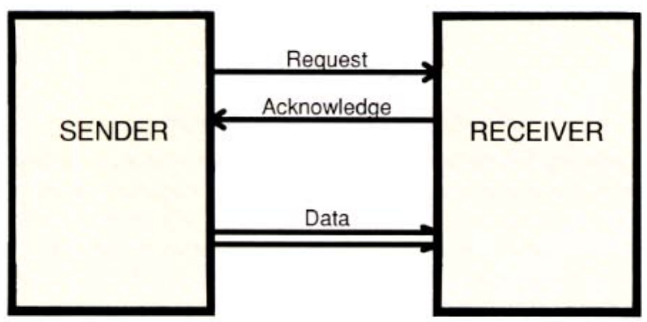

**图 3.** 捆绑数据接口。除了任意数量的数据线外，遵循二相捆绑数据约定的接口还有两条信令线，分别称为“请求”和“确认”。发送器将有效数据放在数据线上，然后在请求线上产生一个事件。接收器获取数据，然后在确认线上产生一个事件。请求和确认线有时被赋予其他名称。

Seitz [13] 将图 4 的协议描述为我们现在称之为二相捆绑数据约定（two-phase bundled data convention）的协议。这个名称中的“二相”部分表示仅区分两个操作阶段：发送器的活动阶段和接收器的活动阶段。一个事件终止每个阶段：请求事件终止发送器的活动阶段，确认事件终止接收器的活动阶段。发送器可以在其活动阶段自由更改数据，并且在使数据有效后必须在请求线上产生一个事件；然后它必须在接收器的活动阶段保持数据恒定。“捆绑数据”部分表示数据线和请求信令线必须被视为一个捆绑；数据传输中的延迟必须小于传输请求事件的延迟，以免请求事件先于有效数据到达接收器。确认信令线不需要被捆绑。

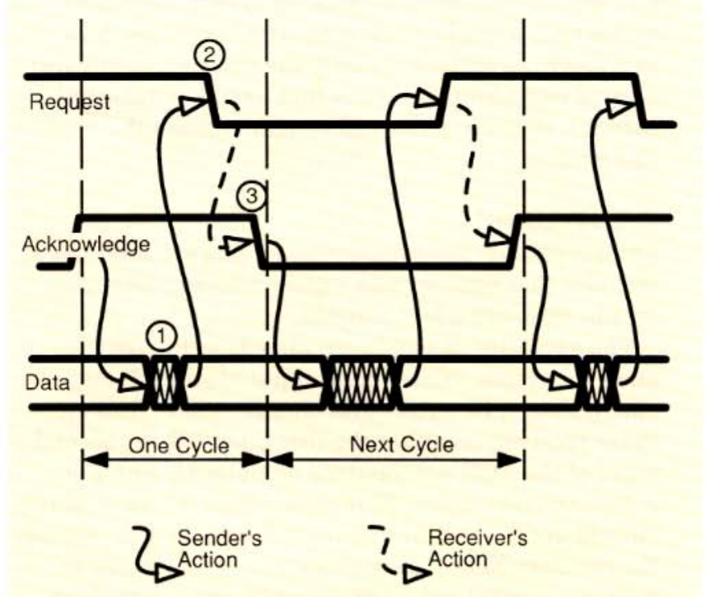

**图 4.** 二相捆绑数据约定。每个周期的三个事件按所示顺序循环发生。它们是: ① 在发送器的活动阶段（用实线箭头表示），发送器可以随意更改数据。② 在发送器建立正确的数据值后，它通过产生请求事件来结束其活动阶段。在接收器的活动阶段（用虚线箭头表示），发送器必须保持数据恒定。③ 在接收器不再需要数据值后，它通过产生确认事件来结束其活动阶段。每个阶段可以持续其控制单元决定的任意长或短的时间。注意请求和确认边沿事件交替发生。

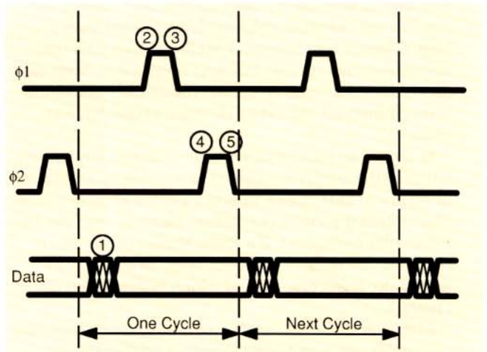

**图 5.** 非重叠时钟。传统的非重叠时钟 $\phi 1$ 和 $\phi 2$ 每个周期需要 5 个事件。它们是: ① 数据改变，② $\phi 1$ 上升，③ $\phi 1$ 下降，④ $\phi 2$ 上升，以及 ⑤ $\phi 2$ 下降。将此与图 4 的每个周期三个事件进行比较。

除了几根数据线外，使用二相捆绑数据约定的接口还需要两根控制线。有人可能认为这比传统的时钟系统更昂贵，后者只需要一根时钟线。然而，这两根线不仅取代了时钟线，还取代了在时钟系统中使流水线具有弹性所需的至少两根额外的线。

## 事件逻辑

用于跳变信令的控制电路是由形成事件的各种逻辑组合的模块构建的。这里有几个例子：

异或（XOR）电路充当事件的“或”（OR）元件。当 XOR 电路的任一输入改变状态时，其输出也会改变状态。因此，在 XOR 的第一个输入或第二个输入上接收到的事件将产生一个输出事件。对于两个以上的输入，XOR 推广为奇偶校验；XOR 电路充当事件的多输入 OR。我们使用标准的 XOR 逻辑符号，带有两个或更多输入来表示这些事件的 OR 元件。此类元件有时被称为合并（MERGE）元件，因为它们合并了两个或更多事件流。

穆勒 C 元件（Muller C-element）[8]（我稍后将展示其电路）充当事件的“与”（AND）元件。当两个输入处于相同的逻辑状态时，Muller C 元件的状态及其输出是该状态的副本。当两个输入不同时，Muller C 元件使用内部存储来保持其先前的状态并保持其输出不变。因此，只有在两个输入都发生事件后，Muller C 元件才会在其输出端产生一个事件。Muller C 元件很容易推广到三个或更多输入，要求所有输入在复制该新状态到输出之前达到一个新的逻辑状态。我们使用标准的 AND 逻辑符号，中间有一个大写的 C 来表示实现跳变事件逻辑 AND 的 Muller C 元件。此类元件有时被称为汇合（RENDEZVOUS）元件，因为它们仅在所有输入事件都到达后才动作。

在 CMOS 中，一种极具吸引力的简单动态实现是可能的，如图 6 所示。该电路使用内部节点的电容作为 Muller C 元件所需的存储元件。如果需要静态 Muller C 元件，则必须使用静态逻辑增强节点电容，其中一种形式如图 7 所示。

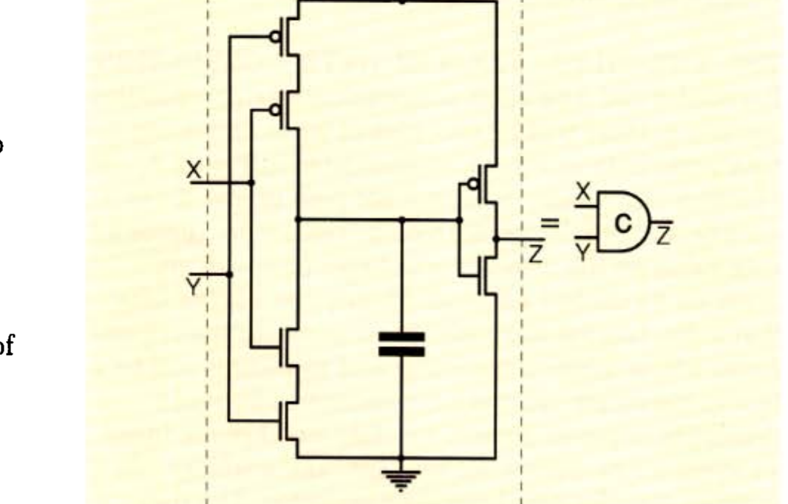

**图 6.** 动态穆勒 C 元件。在 CMOS 中，Muller C 元件有一个特别简单的动态实现，它使用内部节点的电容作为存储元件。图中未显示在主清除期间用于初始化 Muller C 元件的晶体管。

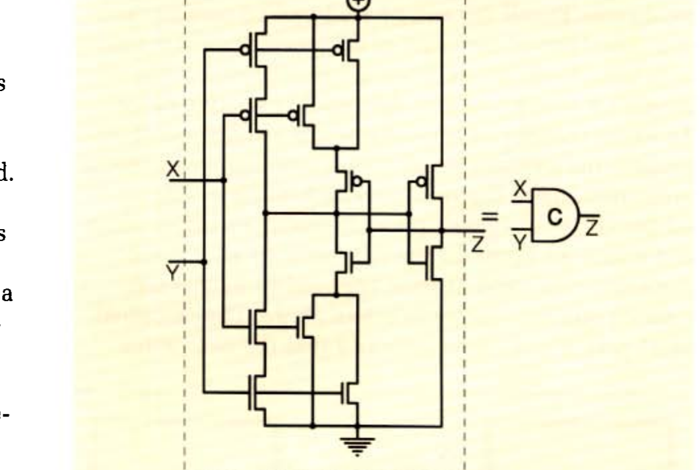

**图 7.** 静态穆勒 C 元件。用晶体管替换图 6 的电容器，如图所示，产生一个静态 Muller C 元件。在集成电路布局中，此处显示的晶体管具有较小的符号，可以非常窄，因为它们仅用于保持预先建立的值。该电路以显而易见的方式推广到三个或更多输入。

虽然跳变信号的绝对状态并不重要，但它相对于其他相关信号的状态却很重要。因此，有时反转跳变信号很重要。我们使用输入或输出上的“气泡”来表示这种反转，如图 8 所示。每个流经事件符号的环路必须包含奇数个反转。此类环路实际上是振荡器，其振荡通过 Muller C 元件或其他模块在环路连接处的动作与其他环路的振荡相协调。

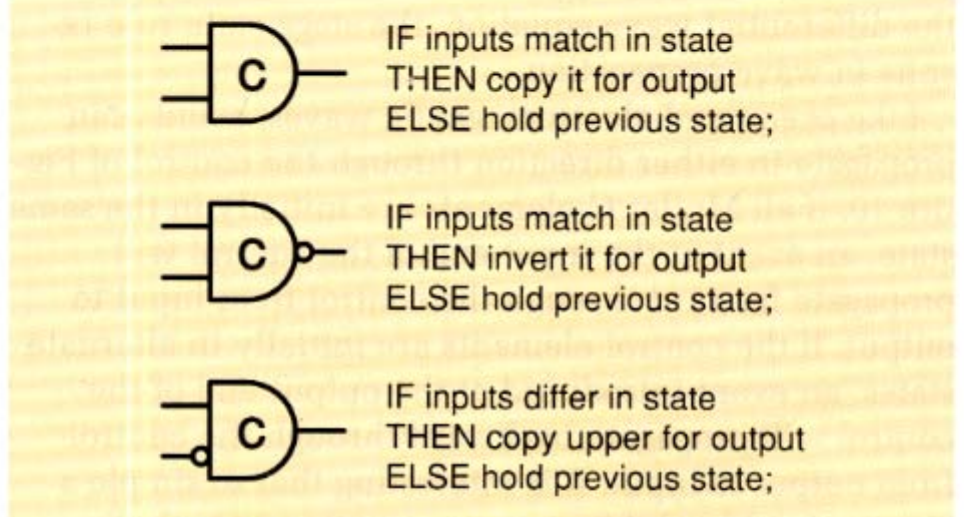

**图 8.** 带反相器的穆勒 C 元件。Muller C 元件包含存储器，以在某些输入条件下保持先前的状态。当输入或输出线包含反相器时（如这些符号中的气泡所示），动作如表所示。Muller C 元件为事件提供 AND 功能。

图 9 显示了一些其他有用的事件逻辑电路的方框符号，这些电路实现了程序员熟悉的某些基本操作。触发（TOGGLE）电路在其两个输出端交替产生事件，以响应其输入端的事件；在某些主清除信号之后的第一个事件和随后的每一个其他事件通过带点的输出。选择（SELECT）模块根据数据输入的值将传入事件引导至一个输出或另一个输出；它用于测试条件表达式中的布尔条件。布尔值必须在它引导的传入事件之前可用，这一要求类似于图 4 协议中的捆绑条件。调用（CALL）元件记住其哪个输入最近接收到事件，并在被调用过程完成后将事件返回到匹配的输出端。CALL 元件中的存储器充当子程序返回地址的角色。只有当每个调用在后续调用发生之前完成时，CALL 元件才能正常工作。仲裁器（ARBITER）在到达顺序未知的两个事件之间做出干净的决定，仅为其中一个产生授权事件，即使它们几乎同时到达。像编程中的信号量一样，它延迟后续授权，直到在与先前授权对应的完成（done）线上接收到事件，从而在任何时候只有一个授权是未决的。仲裁器可以直接连接到 CALL 元件，以允许两个完全独立的进程调用单个共享过程。

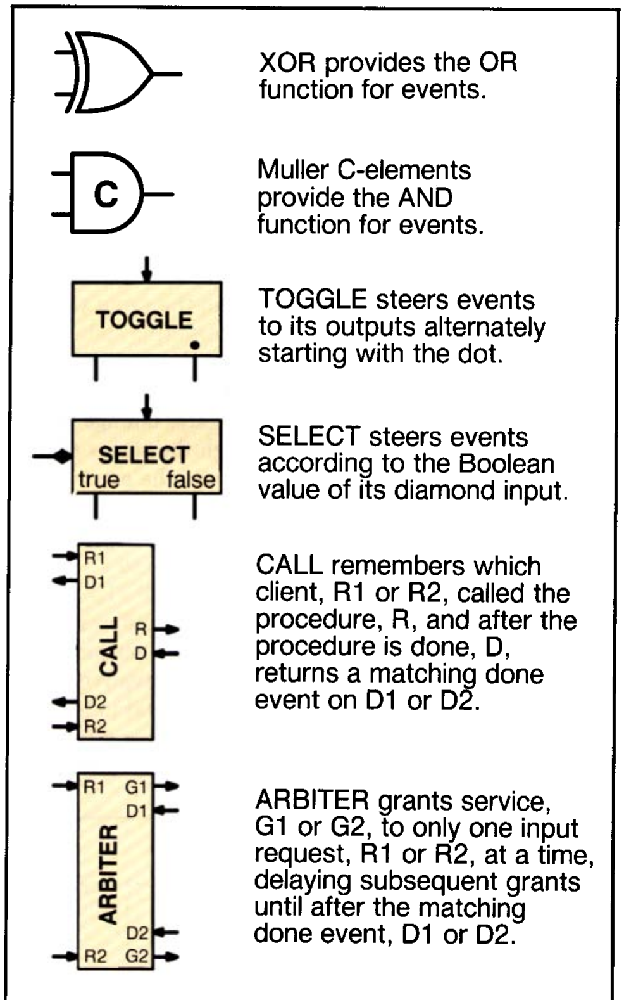

**图 9.** 事件逻辑模块。由 10 到 100 个晶体管组成的模块可以执行有用的事件逻辑功能。显示其符号的模块提供所示的功能。注意这些功能与编程中使用的基本结构的相似性。有人可能认为仲裁器需要 8 个端子，因为左侧的请求信号似乎缺乏相应的确认信号。根据应用，授权或完成信号用于确认传入的请求。

## 微流水线的控制

一串中间插有反相器的 Muller C 元件（如图 10 所示）是控制本演讲中描述的微流水线所需的唯一逻辑。我发现这个电路中流水线的正向和反向之间的对称性非常显著。观察图 10，请求和确认信号在控制的相邻阶段之间传递。数据线也穿过各个阶段，我稍后将描述，但这些在图 10 中未显示。在阶段之间的每个接口处，请求和确认信号以及数据值完全遵循图 4 的二相捆绑数据约定。

注意在图 10 中，请求和确认线在输入接口处与输出接口处是相同的。输入端和输出端信令形式的相似性确保了任意数量的此类控制系统（即使是原始速度明显不同的系统）在串联连接时都能正常工作，尽管是以最慢系统的速度运行。微流水线的这种组合性使得组装长信号处理流水线变得容易；只需将一个微流水线的请求、确认和数据线连接到后续微流水线输入端的相应线上即可。复合控制只是图 10 所示控制系统的进一步重复。

看待图 10 控制电路的一种方式是将其视为一系列事件流经的环路。每个环路中都有一个反相器，因此每个环路都会振荡。Muller C 元件协调相邻环路中的振荡。这种观点可以很容易地看出，每个接口处的请求和确认事件必须交替发生。

看待此电路工作方式的另一种方式需要我们关注每个 Muller C 元件相对于其前驱和后继 Muller C 元件状态的状态。记住 Muller C 元件的行为，带有一个反相输入，我们可以很容易地看到控制的每个阶段都遵循一个非常简单的阶段状态规则：

> 如果前驱和后继状态不同
> 则复制前驱的状态
> 否则保持当前状态。

这个阶段状态规则使得控制系统在所有阶段处于相同状态时以及在交替阶段处于相反状态时都保持稳定。所有控制元件处于相同状态的情况对应于空流水线，而交替阶段处于相反状态的情况对应于满流水线。还有其他稳定的条件，输入端附近的阶段处于相同状态，而输出端附近的阶段处于交替状态；这些对应于部分填充的流水线。阶段状态规则还使控制系统在某些状态下不稳定；这种不稳定的状态随着事件在流水线阶段传播而立即改变。要将微流水线初始化为空状态，其 Muller C 元件可以全部通过主清除信号设置为相同状态。我省略了执行此操作所需的复位电路。

上述以 IF THEN ELSE 形式描述的阶段状态规则是描述海洋波和电磁波的微分方程的数字等价物。在波动方程中，时间导数（在本例中为复制前驱的状态）被设置为等于空间导数（在本例中为前驱和后继状态是否不同）。与物理定律描述的微分波动方程一样，阶段状态规则会导致波传播。

像海洋波和电磁波一样，事件可以通过图 10 的控制向任一方向传播。如果所有 Muller C 元件最初处于相同状态，则输入端的事件将通过控制从输入向输出向前传播。如果控制元件最初处于交替状态，则在输出端引入的事件将通过控制从输出向输入向后传播。有趣的是，如此简单的电路竟然能在两个方向上表现出波传播。

图 10 控制系统中事件的正向和反向传播在控制微流水线时都很有用。事件通过控制电路的正向传播将迫使信息通过微流水线向前移动，就像海洋波将冲浪者推向岸边一样。反向传播将通过流水线将末端创建的空数据空间扫回开头。空位穿过被占用的部分，就像半导体中的空穴或水中的气泡上升一样。

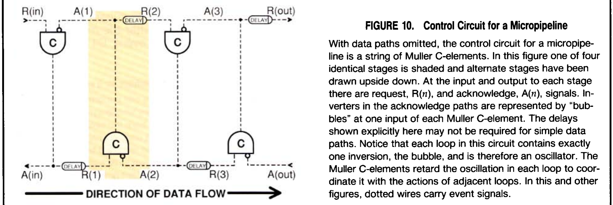

**图 10.** 微流水线的控制电路。省略了数据通路，微流水线的控制电路是一串 Muller C 元件。在此图中，四个相同阶段中的一个被阴影遮住，并且交替阶段被颠倒绘制。在每个阶段的输入和输出处，请求 $R(n)$ 和确认 $A(n)$ 信号。确认路径中的反相器由每个 Muller C 元件一个输入端上的“气泡”表示。此处显示的延迟对于简单的数据通路可能不是必需的。注意此电路中的每个环路恰好包含一个反相器（即气泡），因此是一个振荡器。Muller C 元件延迟每个环路中的振荡，以将其与相邻环路的动作协调起来。在此图和其他图中，虚线携带事件信号。

## 事件控制存储元件

本节介绍一种适用于跳变信令控制系统的存储元件。为了使这些电路更容易理解，我将使用一个开关符号来代表晶体管的几种配置之一，其中一种如图 11 所示。正如您在图中看到的，该开关的晶体管实现利用了其控制信号 $C$ 及其补码形式 $\sim C$ 的真值，这意味着图中未明确显示控制信号的反转。注意该电路相对于其控制信号的高值或低值是完全对称的，当其控制为高时选择一个输入，当其控制为低时选择另一个输入。我将始终将此类开关绘制在当其控制信号为低时所占据的位置。

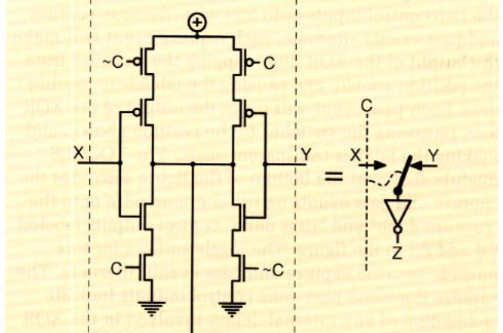

**图 11.** 开关符号的电路。虚线框内显示的晶体管电路代表右侧的双掷开关符号。当控制线 $C$ 为低电平时，输出端 $Z$ 由 $Y$ 输入控制，如图所示。当控制线为高电平时，开关翻转到 $X$ 输入。这种形式的开关输出由其选定的输入控制，但在值上是反相的。使用传输晶体管的其他此类开关实现也是可能的。

适用于跳变信令控制系统的存储元件必须响应跳变事件。与传统锁存器不同（在传统锁存器中，时钟信号的“高”和“低”状态可以执行不同的功能），事件控制存储元件必须对上升和下降跳变给出类似的响应。两个名为“捕获”（capture）和“通过”（pass）的控制线在图 12 中说明。这两个电路中的每一个都并排使用两个锁存器，并交替激活它们。在只有三个反相器的电路中，输出反相器在两个锁存器之间共享。注意，由于开关控制中隐含的反相器，这两个电路相对于其控制信号的高值和低值是完全对称的。您可能希望将这些电路与图 13 所示的传统 D 触发器电路进行比较。

事件控制存储元件的行为很容易使用其两个控制信号的相对状态来描述。当其两个控制信号处于相同状态时，出现图 12 所示的条件，事件控制存储元件是透明的（transparent），并将其输入数据直接传递到其输出，根本不充当存储元件。您可以看到一条路径通过开关和反相器直接从输入通向输出。当其两个控制信号状态不同时，图 12 所示的一个或另一个开关被翻转。正如您可以想象的那样，如果其中一个开关被翻转，就会形成一个包含两个反相器的环路。这样的环路捕获并保留数据值。如果一个开关翻转形成这样的环路，则不存在从输入到输出的路径，事件控制存储元件对其输入端的更改变得不敏感，并报告其输出端仅在环路中捕获的数据。

事件控制存储元件的行为也可以用事件来描述。让我们假设事件控制存储元件最初是透明的，正如在图 12 中所示。捕获和通过控制信号事件总是交替发生。其捕获控制线上的一个事件翻转捕获线连接到的两个开关，从而导致存储元件捕获并保持数据值，然后数据值通过它。此事件将元件的输出值与输入端的更改隔离开来，但不更改输出值。随后在通过控制线上的事件翻转另一个开关，使元件返回透明状态，允许下一个数据值出现在其输出端，并可能更改其输出值。在元件的通过控制线上的每个事件之后，都会出现一个新的输出值。这正是使微流水线与已经描述的控制系统一起工作所需的行为。

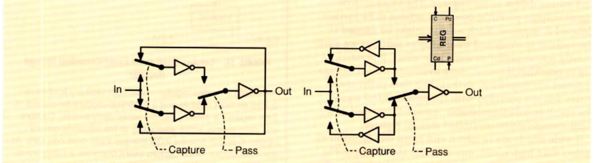

**图 12.** 事件控制存储元件。事件控制存储元件响应两条控制线（在此图中称为“捕获”和“通过”）上的事件。显示了两种不同的配置。右侧的形式有五个反相器，比左侧的形式（只有三个反相器）稍快，因为其反馈路径仅包含一个开关而不是两个。在主清除后，开关将处于所示位置，形成直接连接而没有输入和输出之间的环路，在这种状态下，存储元件被称为是透明的。每种类型的存储元件都被组装成寄存器，就像通过并联连接其捕获和通过控制线将触发器组装成寄存器一样。寄存器符号包括控制输出 $Cd$ 和 $Pd$，它们是控制输入信号 $C$ 和 $P$ 的放大版本，因此必然延迟。$Cd$ 和 $Pd$ 分别命名为“捕获完成”和“通过完成”，在寄存器完成其动作后传递输出事件。

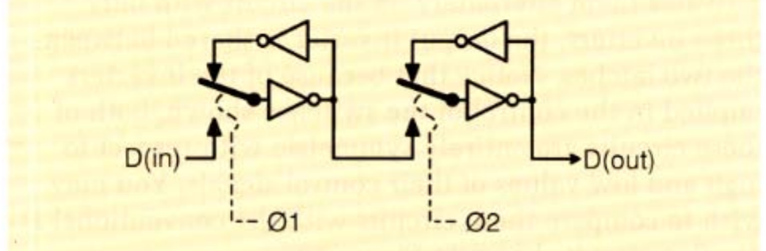

**图 13.** 传统 D 触发器。传统的 D 触发器由图 5 所示的非重叠时钟信号 $\phi 1$ 和 $\phi 2$ 控制。将此电路与图 12 的事件控制存储元件进行比较。

事件控制存储元件成组连接以形成事件控制寄存器。每个这样的寄存器由若干个事件控制存储元件组成，它们的捕获和通过控制线并联连接。由于捕获和通过线驱动许多晶体管，因此在寄存器设计中包含合适的放大器。这些放大器具有一些未知的延迟，并且由于导线的物理长度还会引入进一步的延迟。因此，我在每个事件控制寄存器上包含捕获完成（$Cd$）和通过完成（$Pd$）事件输出，如图 12 的寄存器符号所示。这些输出上的事件完全遵循寄存器输入端的事件，但被延迟以说明放大和布线延迟。显式的完成信号输出允许后续动作在需要时进一步延迟。如果寄存器由更简单的部件组成（正如我们很快将看到的），或者执行某些副作用，则可能需要这样的延迟。有趣的是，如果两个或更多事件控制存储寄存器串联连接，使它们的数据通路串联并提供相同的控制信号，则结果与单个事件控制存储寄存器无法区分，除了总延迟外。

如果涉及宽字且需要小尺寸而不是高速度，则可以使用图 14 的电路作为事件控制存储寄存器。该电路每位仅使用一个锁存器，但需要额外的控制设备。需要额外的控制设备是因为锁存器只有一根控制线，捕获和通过事件都必须流经该控制线。当然，额外设备引入的延迟也会延迟捕获完成和通过完成输出。

图 14 电路的操作很容易理解。显示在顶部的 XOR 电路将来自两个控制输入的捕获和通过事件合并到一根线上。由于捕获和通过事件交替发生，每个捕获事件将使 XOR 的输出变高，将开关从所示位置翻转，并导致锁存器捕获数据。每个通过事件将使 XOR 的输出变低，使开关返回到所示位置，并使锁存器再次透明。底部的 TOGGLE 模块将捕获完成和通过完成输出分离到公共线上。TOGGLE 模块足以满足此目的，因为捕获和通过事件交替发生。捕获完成和通过完成输出指示 XOR 和 TOGGLE 模块中涉及的任何内部延迟的完成，以及驱动寄存器中许多锁存器的控制线的延迟。

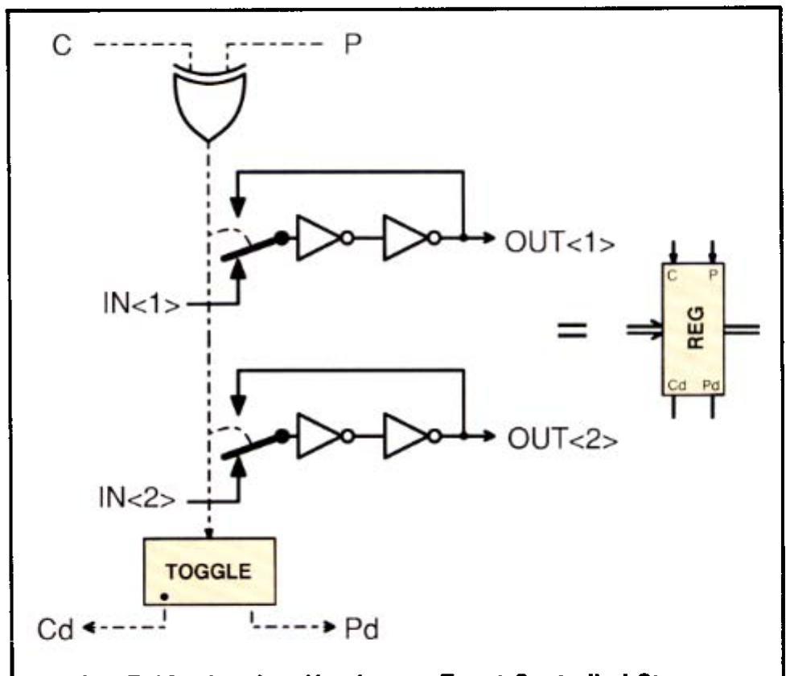

**图 14.** 用作事件控制存储寄存器的锁存器。由普通锁存器制成的事件控制寄存器需要一个 XOR 模块和一个 TOGGLE 模块进行控制。显示了一个 2 位寄存器；虚线携带控制。捕获和通过事件交替到达单独的控制输入 $C$ 和 $P$，但 XOR 将它们合并到一根线上。在 XOR 输出端，每个捕获事件变成一个上升跳变，翻转开关，导致锁存器捕获数据。每个通过事件变成锁存器控制线上的下降跳变，使开关返回到所示位置，使锁存器再次透明。TOGGLE 模块在寄存器完成其动作后，将捕获和通过事件重新分离到两个单独的输出路径 $Cd$ 和 $Pd$ 中。该电路比图 12 的事件控制寄存器慢，并且相应地延迟其输出事件 $Cd$ 和 $Pd$，但除了延迟外提供完全相同的功能。

## 不带处理的微流水线

不带处理的微流水线（即 FIFO）可以通过将图 10 的控制与图 12 或图 14 的存储寄存器相结合来构建。一组事件控制存储寄存器串联作为其数据通路，而一串 Muller C 元件作为其控制，如图 15 所示。每个事件控制存储寄存器使用来自其控制阶段的控制信号作为其捕获控制信号，并使用来自后继阶段的控制信号作为其通过控制信号。当此 FIFO 为空时，其所有存储寄存器都是透明的，因此存在一条直接从其数据输入端到其数据输出端的路径。

我安排图 15 的布局不仅是为了使其易于阅读，而且还为了建议一种集成电路实现的布局。Muller C 元件位于寄存器的两端，以便控制信号在芯片上呈之字形穿过。控制寄存器的导线从寄存器的一侧驱动，并用于控制寄存器的 Muller C 元件。由于控制寄存器的导线很长，并且由于导线控制寄存器中的许多开关，因此在控制寄存器中总是存在一些延迟。将驱动寄存器的布置从一侧驱动并在另一侧感测其控制信号，不仅适应了驱动放大器的延迟，还适应了导线本身的任何延迟。

如果在微流水线中不需要处理（即对于 FIFO），图 16 的更简单的数据通路电路将起作用 [17]。在此电路中，事件控制存储元件的并排锁存器配置在阶段之间扩展。两条独立的数据通路仅在 FIFO 的输出端通过一个与事件控制存储元件中使用的非常相似的输出选择开关再次汇合。第一、第三和其他奇数索引的数据值通过上方数据通路，而偶数索引的值通过下方数据通路。

看看图 16 中的所有对称性。除了其输出（显示在图的右侧）外，其数据通路在 FIFO 的正向和反向之间完全没有区别。起初我觉得这一定表明其设计存在缺陷。没有缺陷；图 16 的电路虽然非常规，但工作良好。抛弃传统的锁存器观念，为 FIFO 产生了一个简单有效的电路。

当然，数据通过微流水线的传播速度必须快于控制事件通过其控制的传播速度。这通常由三个因素保证。首先，控制电路中使用的 Muller C 元件比数据通路中使用的存储元件更复杂，因此本质上更慢。其次，由于控制系统的每个阶段必须驱动在每个寄存器中保存并行字的许多存储元件，因此必须放大控制信号以驱动多个负载。这种放大不可避免地延迟了控制信号。第三，图 15 中建议的布局确保了控制信号的之字形路径中的导线比数据通路中的导线长。当然，当使用图 14 的电路作为寄存器时，来自每个寄存器的捕获完成和通过完成控制输出应该用于驱动相邻阶段的 Muller C 元件输入，以便 XOR 和 TOGGLE 模块中的任何延迟都包含在总控制信号延迟中。如果没有在数据通路中放置显著的处理逻辑，人们可以很容易地建立信心，即数据通路比控制通路快。只有当在数据通路的存储单元之间放置显著的处理逻辑时，才需要在控制通路中设置特殊的延迟。

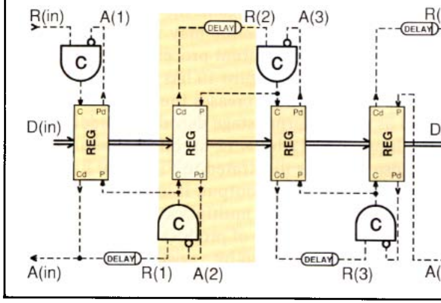

**图 15.** 不带处理的微流水线。不带处理的微流水线具有用于数据通路的事件控制寄存器和用于控制的 Muller C 元件。显示了四个阶段；其中一个被阴影遮住。阶段之间的每个接口都遵循图 4 的二相捆绑数据约定。此图建议了集成电路布局的形式；控制信号在数据通路上来回穿过以适应传输延迟。

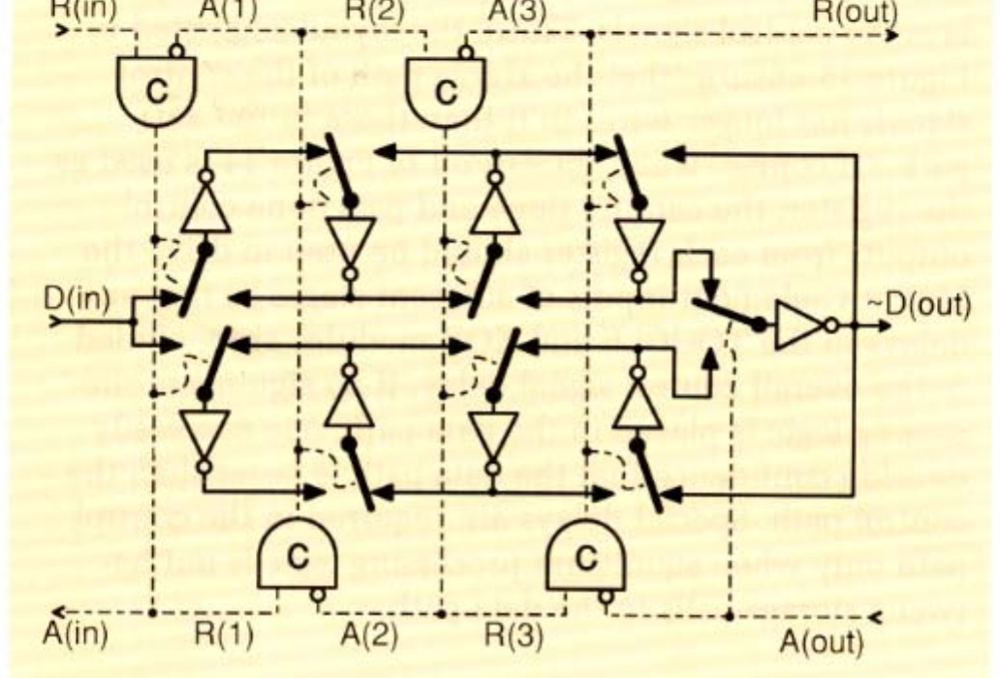

**图 16.** 一个 FIFO 电路。如果不需要处理（如在 FIFO 中），图 15 中的事件控制存储元件可以用这个更简单的电路代替 [17]。在此图中，虚线携带控制信号，实线携带数据值，并显示了四个阶段。开关绘制为它们在空 FIFO 中所处的位置。所示的 FIFO 为 1 位宽，因此可以存储 4 位；更多的长度或宽度随着此数据通路内部部件的进一步重复而到来。交替的输入通过数据通路的上下导轨，仅在输出端再次合并。当 FIFO 为空时（如所示），它是透明的；人们可以追踪从数据输入到数据输出的直接路径。当每个开关改变时，相同的数据被呈现给其每个输入；因此开关在改变时可能会暂时将其两个输入短接在一起。所示的微流水线具有奇数个反转，因此反转其数据值。

## 带处理的微流水线

微流水线框架为各种流水线处理器提供了基础 [18]。我的同事和我已经使用微流水线框架设计了乘法器、二进制到 N 选一译码器、存储器控制器和其他电路。在每种情况下，图 10 的微流水线控制模板都提供了设计基础。在某些情况下，这个简单的模板会用由图 9 的事件逻辑模块组成的电路进行修饰，以提供更复杂的控制功能。例如，仅使用一个 TOGGLE 模块和一个 XOR 模块，就可以很容易地构建一个为每个输入事件执行两次操作的电路。以不同方式连接的相同两个模块形成一个仅为每隔一个输入事件执行一次操作的电路。

当需要逻辑处理时，合适的组合电路被放置在存储寄存器之间，如图 17 的方框图所示。人们可以权衡存储阶段的数量和干预逻辑的复杂性，以在延迟和吞吐率之间获得合适的平衡。阶段之间的组合逻辑越少，存储阶段越多，就能以更大的延迟为代价获得更高的吞吐率。图 18 和 19 的译码器电路使用不同数量的存储执行相同的功能。

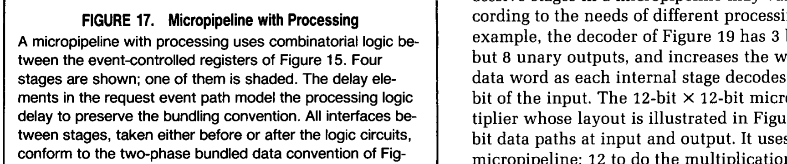

**图 17.** 带处理的微流水线。带处理的微流水线在图 15 的事件控制寄存器之间使用组合逻辑。显示了四个阶段；其中一个被阴影遮住。请求事件路径中的延迟元件模拟处理逻辑延迟以保持捆绑约定。阶段之间的所有接口（无论是在逻辑电路之前还是之后）都遵循图 4 的二相捆绑数据约定。每个寄存器的捕获完成 $Cd$ 输出显示为连接到其前驱的通过 $P$ 输入，这比图 15 中使用的连接更保守；两种连接都可以工作。

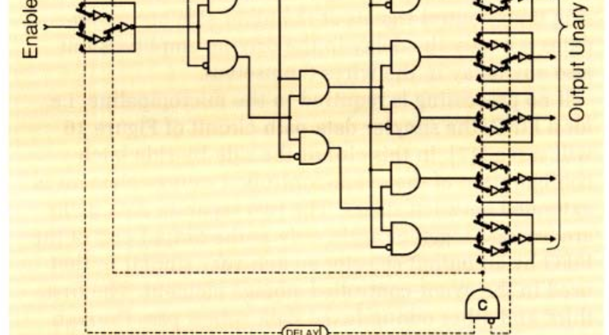

**图 18.** 具有两个微流水线阶段的译码器。这个两阶段微流水线将三个二进制输入位译码为八个一元输出位。它可以存储两个值，一个尚未译码，另一个已完全译码。图中心的处理逻辑由三排普通 AND 门组成。图底部的延迟必须延迟请求事件，至少延迟量等于三排组合逻辑延迟数据的量。

微流水线连续阶段寄存器中的位数可能会根据不同处理步骤的需要而有很大差异。例如，图 19 的译码器有 3 个二进制输入但有 8 个一元输出，并且随着每个内部阶段译码输入的额外位而增加数据字的宽度。图 20 中所示布局的 12 位 $\times$ 12 位微流水线乘法器在输入和输出端具有 24 位数据通路。它使用 24 级微流水线：12 级用于进行乘法，12 级用于解析产生的进位保留形式的乘积。在流水线的中心，需要 36 位寄存器，因为乘积的一半是进位保留形式，需要两位数据来表示乘积的每一位。

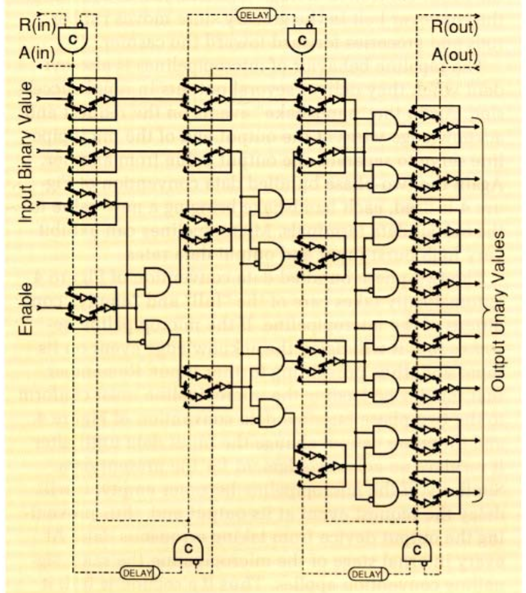

**图 19.** 具有四个微流水线阶段的译码器。这个四阶段微流水线也将三个二进制输入位译码为八个一元输出位。它执行与图 18 电路相同的功能，但它具有更多用于部分译码结果的存储空间。它可以存储四个值，第一个尚未译码，两个部分译码的值，以及最后一个完全译码的值。这些请求路径中的三个延迟中的每一个都可以比图 18 中的短，因为每个延迟仅模拟一排组合逻辑。该译码器比图 18 的功能等效译码器具有更高的吞吐率。

由于它有 24 个阶段，这个乘法器可以容纳多达 24 个部分处理的乘积。它也可以容纳更少。考虑到已经排队等待输出的乘积，它会自动尽可能多、尽可能快地处理任何部分完成的乘积。在全速运行时，它提供流水线处理的极高吞吐量。然而，当为空时，它没有存储空间，并充当组合乘法器以产生单个乘积。永远不需要插入哑数据来将先前输入的信息冲出微流水线。

作为一个更复杂的例子，我们使用微流水线框架设计了一个存储器控制器。该存储器控制器旨在用于对 16 位、$2^{24}$ 字的动态随机存取存储器（DRAM）进行字节串行访问。其输入和输出寄存器为 8 位宽，以适应字节串行数据格式。我们使用图 4 的二相捆绑数据约定作为该存储器控制器输入和输出端的字节传输协议。它包含七个部分：四个事件控制存储寄存器和它们之间的三个逻辑阶段。

存储器控制器中的每个控制阶段的操作非常类似于图 10 的微流水线控制中的一个简单阶段。与图 10 的阶段一样，每个阶段都包含一个 Muller C 元件，并且每个阶段仅使用图 4 的二相捆绑数据约定与相邻阶段通信。每个阶段的控制由图 9 所示的事件逻辑元件组成：XOR、Muller C 元件、SELECT、TOGGLE 和 CALL。在某些阶段，这些元件连接成环路，以允许在阶段内发生多次动作，然后才确认来自前一阶段的数据或请求来自后续阶段的服务。这样的环路执行数据的打包和拆包。一个单独的存储器刷新程序使用仲裁器（ARBITER）中断正常操作。

存储器控制器每个阶段的逻辑执行不同的功能。第一阶段对来自 8 位输入寄存器的字节串行输入进行译码，将其转换为包含存储器周期所需的所有地址、数据和控制信息的 54 位并行字。该阶段在请求下一阶段动作之前接受并确认多个输入字节。在第一和第二逻辑阶段之间是一个 54 位事件控制寄存器。第二阶段使用每个 54 位并行字来控制对外部 DRAM 芯片的一次访问。从存储器读取时，此访问将 54 位地址和控制信息转换为 16 位数据值。控制包括存储器芯片的定时模型，并在请求下一阶段动作之前等待存储器周期完成。在第二和第三逻辑阶段之间是一个 16 位事件控制寄存器，用于捕获从 DRAM 芯片输出的数据。第三阶段将 16 位输出数据重新打包为字节串行形式，并通过 8 位事件控制输出寄存器将其呈现在输出端。

该存储器控制器作为流水线运行，可以在进行存储器访问的同时，并发地打包先前访问的数据并拆包下一次访问的字节串行地址和控制信息。由于各阶段没有公共时钟且各阶段以自己的步调运行，因此流水线是弹性的。这种弹性允许每当在输入端呈现一组地址和命令值时就发生存储器周期（这可能需要多个输入字节），即使没有提供进一步的输入。

微流水线的行为是组合行为和流水线处理的混合。记住，事件控制存储元件在为空时是透明的，并且可以像组合电路一样工作，不存储任何东西。因此，当微流水线为空时，它的行为就像组合电路一样。在它们的数据通路延迟之后，图 18 和 19 的译码器如果为空，会忠实地报告任何给定二进制输入的正确 N 选一代码。您可以通过检查图 18 和 19 并记住开关全部绘制在数据通路为空时所占据的位置来确认这一点。注意，从输入到输出存在不涉及存储的完整路径。类似地，图 20 的乘法器如果为空，会在其数据通路延迟后忠实地报告其输入操作数的乘积。这种行为使得微流水线的数据通路易于测试。

当微流水线被快速连续地给予多个输入时，其流水线行为是显而易见的。微流水线输入端的请求和确认线上的跳变事件根据图 4 的二相捆绑数据约定将一个输入数据元素与另一个分开。请求-确认线上的“握手”事件就像杂货店结账线上用于将一个顾客的杂货与另一个顾客的分开的橡胶棒。每一对请求-确认事件将一组数据与前导或后续数据组分开。Muller C 元件控制系统的波传播特性使这些数据分离事件在控制电路中向前移动，控制事件迫使数据向前通过事件控制存储寄存器，就像杂货店传送带的运动使橡胶棒和杂货向收银员方向移动一样。

当微流水线快速连续交付多个输出时，其流水线行为也是显而易见的。同样，微流水线输出端的请求和确认线上的“握手”事件用于将一个输出值与另一个分开。同样使用图 4 的二相捆绑数据约定，每次握手都会为输出数据端带来一个新值。微流水线可以表现出非常高的突发输入和输出数据速率。

图 4 的二相捆绑数据约定自动处理微流水线的“满”和“空”条件。如果微流水线变满，它将延迟其输入端的确认事件，从而防止进一步输入。记住，馈送微流水线的设备必须遵循图 4 的二相捆绑数据约定，因此在收到当前数据的确认之前不能更改输入数据。类似地，如果微流水线变空，它将延迟其输出端的请求事件，从而防止输出设备获取错误数据。在微流水线的每个内部阶段，应用相同的信令约定。因此，如果一个部分已满，它将自动延迟来自微流水线早期部分的新数据。

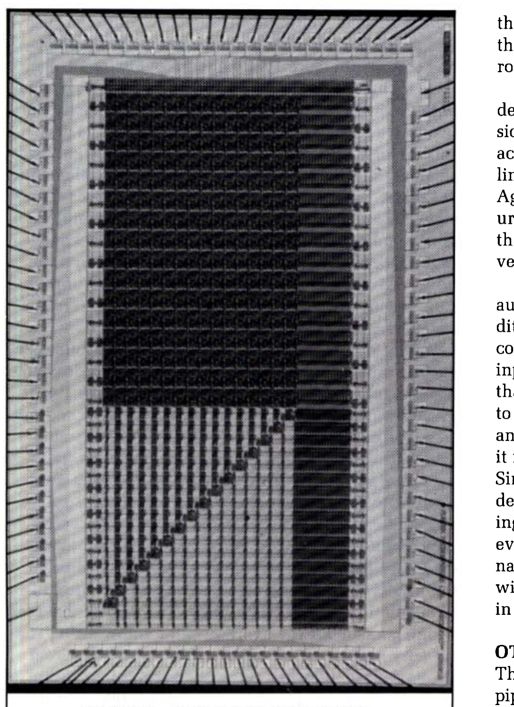

**图 20.** 微流水线乘法器芯片。这张照片中显示的实验性微流水线乘法器由 Austek Microsystems 制造。它使用 24 级微流水线对 12 位数字对进行乘法运算；前 12 级在乘法阵列中，最后 12 级解析进位保留形式的乘法器输出。当为空时，乘法器的行为就像一个无存储的组合乘法器，但当作为流水线使用时，它可以在交付其第一个乘积之前接受多达 24 对操作数。

## 使用相同协议的其他设备

微流水线中使用的二相捆绑数据约定也可以应用于其他类型的设备。例如，可以构建一个环形缓冲 FIFO，其接口特性与图 15 或图 16 的微流水线 FIFO 相同。这样的设备可以使用外部随机存取存储器进行所需的存储，并使用两个地址计数器作为指针（一个用于读取，一个用于写入），将存储器视为环形缓冲区。它会比较两个指针的值以识别环形缓冲区是满还是空，如果是，则延迟其终端处的握手信号。环形缓冲指针以及比较它们产生的满和空信号可以是控制外部不可用的私有内部信号。

如果在这样的环形缓冲 FIFO 中使用单端口存储器，则必须使用仲裁器来决定下一个存储器周期是用于读取还是写入。之所以需要仲裁，是因为单个资源（即存储器访问端口）必须在两个独立定时的进程（输入进程和输出进程）之间共享。如果在完全相同的时刻，输入进程交付一个新的输入值，而输出进程请求一个新的输出值，仲裁器必须干净地决定先服务哪个请求。这种环形缓冲 FIFO 的跳变逻辑控制如图 21 所示。

虽然图 21 的电路看起来像流程图，但它实际上是一个电路。它由简单的跳变控制模块组成，所有这些模块都使用跳变信令。由于这些模块对延迟不敏感，将它们组合成电路非常像绘制流程图。使用我的同事 David Dill 开发的工具，Bob Sproull 证明了如果图 10 和图 21 的 FIFO 控制能工作，那么对于等效的存储器大小，它们在功能上是等效的 [5]。因此，我们可以确信，这种环形缓冲 FIFO 和微流水线 FIFO 是可以互换的。进行此类证明的能力是跳变信令概念框架的吸引人之处之一。

在微流水线阶段之间使用图 4 的二相捆绑数据约定留下了很大的余地，可以使各个阶段以多种方式执行其功能。例如，用于算术规格化的流水线设备可以用许多阶段或单个阶段构建。多阶段版本在每个阶段执行单比特移位，具有非常高的吞吐量，表现出长延迟，并提供大量缓冲空间。单阶段设备顺序执行其移位，吞吐量和缓冲空间减少，但需要的电路显著减少。

这种单阶段顺序规格化器的数据通路的三个位如图 22 所示。串联使用两个图 14 形式的寄存器来捕获和保持数据。图顶部的开关选择是输入数据还是移位后的数据进入寄存器。该电路左侧的 XOR 和 TOGGLE 模块的作用类似于图 14 中的模块。标记为“开始捕获数据过程”的线上的每个事件在每个锁存器控制线上产生两个事件，从而将寄存器开关从所示位置翻转出来，然后又翻转回所示位置，在寄存器中捕获一个新的数据值。

您应该将图 22 视为捕获数据过程（LATCH DATA PROCEDURE）的定义。该过程有一个输入参数，即所示的“移位控制”信号，以及一个输出参数，即“规格化或全零”信号，该信号由图中省略的电路产生。

顺序形式的规格化器的运行方式就像计算机的规格化程序一样，该程序一次只能向左移位一位。控制电路如图 23 所示。图顶部是一个 Muller C 元件，类似于我们在其他微流水线阶段看到的那些。事件离开 Muller C 元件后，其第一个动作是通过使用 CALL 模块的上层客户端终端 $R1$ 来访问由菱形表示并在图 22 中定义的捕获数据过程，从而捕获输入数据。当捕获数据过程完成时，它向 CALL 模块的 $D$ 终端返回一个事件，该模块又向其 $D1$ 终端返回一个事件。因此，在捕获数据后不久且在规格化之前，控制在其输入确认线 $A(in)$ 上产生一个事件。从微流水线阶段的角度来看，$A(in)$ 下方的算法其余部分只是 $R(out)$ 之前的延迟。

捕获输入数据后，控制使用 while 循环将数据移位为规格化形式。while 循环包含一个 XOR 模块、一个 SELECT 模块，以及通过 CALL 模块的下层客户端终端访问的捕获数据过程。只要数据尚未规格化，事件就会在 while 循环中循环并穿过捕获数据过程，每次循环引起一次移位。移位之间的时间由循环延迟确定，并且可以像所涉及的电路一样快或慢。当 while 循环结束时，事件通过 SELECT 模块的“真”输出退出循环。因此，当移位完成时，控制在输出请求线 $R(out)$ 上产生一个事件。

图 23 左侧所示的移位控制线值得特别提及。我们可以从两个方面来思考它。首先，从事件的角度考虑，我们应该在 while 循环开始之前在此控制线上放置一个事件，以将移位控制开关翻转到移位位置，并且在 while 循环结束时我们需要在其上放置另一个事件以将开关翻转回输入位置。驱动移位控制线的 XOR 元件的两个输入用于包围 while 循环，从而交付所需的两个事件。另一种思考移位控制的方式考虑了 XOR 模块输出的值。只要 while 循环处于活动状态，其输入和输出控制端子将处于不同状态，因此 XOR 模块的输出将为高电平，将开关设置在正确的移位位置。

设计像这里说明的控制电路相当像为程序制作方框图。事件逻辑模块不仅提供了程序员熟悉的条件、过程调用和其他元素，而且它们对事件的响应使它们易于组合成循环和类似于程序中发现的其他结构。使用微流水线控制的形式，也很容易构建并发处理设备。我们和其他人已经构建并测试了此类事件逻辑模块的库，并发现它们非常易于使用；至少自 1960 年代的宏模块（macromodule）项目 [2, 3] 以来，组合事件驱动模块与编程的相似性已在少数地方得到认可并被利用。我认为，它为传统的硬件设计提供了一个令人兴奋的选择。

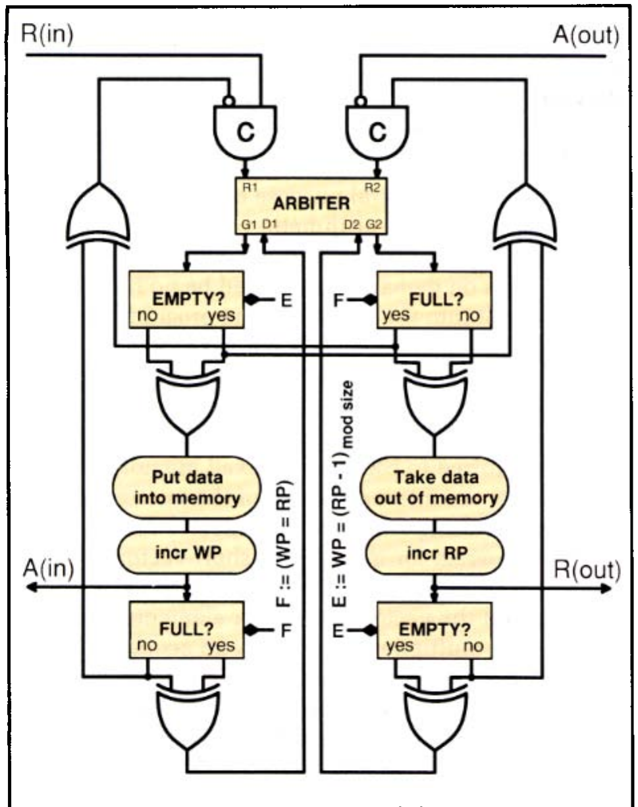

**图 21.** 环形缓冲 FIFO 控制逻辑。环形缓冲 FIFO 的控制逻辑可以由图 9 所示的事件逻辑模块组成。除了测试值外，此处显示的所有导线都携带事件信号；未显示数据通路、地址指针和存储器。在四个 SELECT 模块的每一个中，我都写下了其测试的名称；标记为“E”和“F”的导线携带所需的布尔值。四个菱形中描述的功能包括存储器访问以及增加读写指针 RP 和 WP。虽然此图看起来像方框图，但它实际上是一个准备直接实现的电路。已经证明 [5]，外部观察者无法将此环形缓冲 FIFO 控制电路与图 10 的微流水线控制电路区分开来。

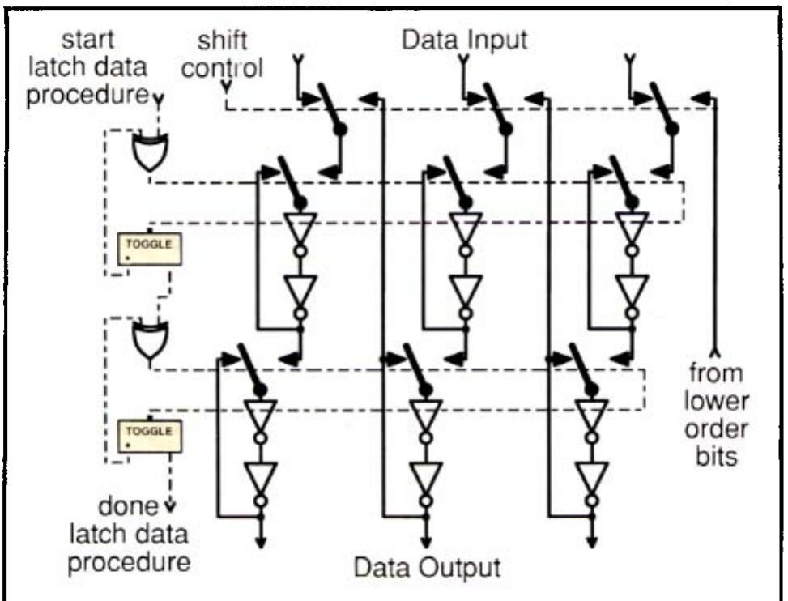

**图 22.** 顺序规格化器的数据通路。顺序规格化器的数据通路定义了捕获数据过程。仅显示了寄存器的三个位。未显示用于检测全零情况或数字已正确规格化的电路。数据通路顶部的开关选择寄存器是获取输入数据还是移位后的数据。图左侧的 TOGGLE 和 XOR 模块按顺序连接到两个“执行两次”循环中。在标记为“开始捕获数据过程”的端子收到事件后，两排锁存器依次捕获数据。在数据被锁存后，最后的 TOGGLE 模块向标记为“完成捕获数据过程”的端子交付单个事件。

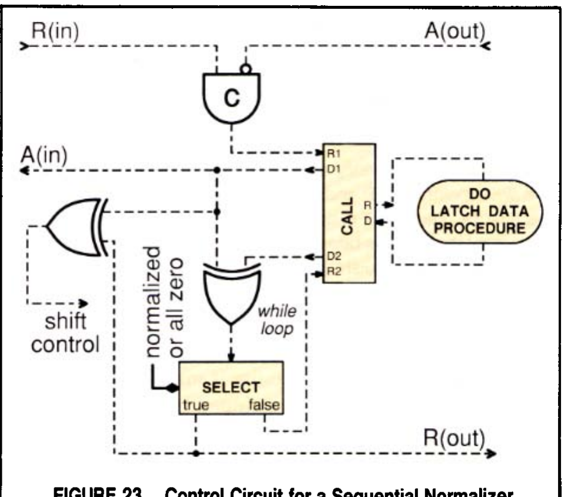

**图 23.** 顺序规格化器的控制电路。顺序规格化器的控制电路使用调用模块使捕获数据过程可用于两个不同的目的。上层客户端使用捕获数据过程来捕获输入数据，移位控制开关处于图 22 顶部所示的位置。下层客户端是包含 XOR 和 SELECT 模块的 while 循环的一部分。只要值尚未规格化，事件就会在此循环中循环。注意，当 while 循环开始时，会向移位控制线提供一个事件，从而将数据通路中的移位开关翻转到移位位置。当 while 循环结束时，另一个事件传递到移位控制线，从而使移位开关返回到输入数据位置。

## 通用计算中的微流水线

通用计算机器将流水线用于两个目的：计算数据通路和指令译码。如果使用微流水线框架构建通用的存储器部件和控制器，它们也可以在存储器取操作中使用流水线。让我们依次考虑这三种应用中的每一种，看看微流水线框架如何提高系统性能或可用性。

让我们想象一台具有用于算术向量处理的微流水线的通用计算机器。由于微流水线提供的存储量随需求而变化，因此机器中不需要内置固定的向量长度。程序可以自由地将任何长度（直到最大值）的向量加载到这样的微流水线中，并随后卸载结果。例如，使用微流水线加法器，程序可能会堆入计算索引存储器引用所需的一组地址和偏移加法任务，并使用微流水线的内部存储来保存产生的地址序列直到需要。用于将短向量乘以小矩阵（计算机图形学中常用的一种操作）的程序可能会将向量和矩阵元素加载到微流水线乘法器中，后跟累加器。2、3 或 4 个分量的向量可以由相同的设备轻松高效地处理。此外，由于输入和输出操作可能在时间上分开，因此存储器访问所需的索引可能会简化。

也许微流水线最重要的应用将涉及向量长度发生变化的操作。一个这样的例子是计算机图形学中广泛使用的裁剪（clipping）操作 [14, 15]。裁剪操作移除位于参考窗口之外的一组对象的部分。裁剪可能导致集合中对象数量的增加或减少。由于整个对象可能被移除，输出可能少于输入，但由于连接的边也可能被破碎成多块，输出也可能多于输入。可以使用微流水线框架构建具有非常简单接口特性的此类裁剪设备。

排序是微流水线的另一个重要应用，其中向量长度会发生变化。微流水线可以应用于排序中使用的分区和合并操作。对于分区，假设两个微流水线连接到快速微流水线分区器的输出端。给定一个输入值向量，分区器可以根据某些分区标准将它们分成两个输出向量，将每个向量的元素交付到相应的输出微流水线中。当然，两个输出向量中每一个的元素数量是数据相关的，但微流水线是弹性的，可以通过按需增加或减少可用存储量来轻松适应变长向量。两个微流水线的输出可以交付分区后的值，而无需任何启动或冲洗。

微流水线也可以应用于合并操作。在这种情况下，用于存储输入向量的两个微流水线连接到合并设备的两个输入端。该合并设备可以在呈现给它的数据值之间进行任何适当的比较，并选择其中一个进行输出。输入微流水线的弹性特性允许合并设备以数据值要求的任何顺序从其中任何一个获取数据。分区和合并设备在信号处理流水线中也很有用，例如，在多个并行流水线之间分配工作负载。

现在让我们从算术转向指令处理。流水线指令处理已变得非常普遍，并且随着精简指令集计算机（RISC）架构的出现，现在已得到很好的理解。其副作用之一被称为“延迟分支”（delayed branch）。这个名称描述了这样一个事实：在每个跳转或条件跳转指令之后，在分支实际生效之前，将按顺序执行某些精确数量的指令（例如恰好 2 条）。这些“悬挂”（overhang）指令对于在新的跳转地址生效时保持非弹性指令处理流水线繁忙是必要的。如果在这些悬挂指令中无法完成任何有用的工作，则必须在指令处理流水线完成跳转指令的工作时，将 NOP 作为输入插入其中。

让我们想象一个微流水线指令处理器。这样的处理器可以避免对悬挂指令的要求，但允许包含它们以获得额外的速度。虽然微流水线延迟可能会在跳转后产生相当于两条指令的时间延迟，但这样的处理器不需要强加 NOP 的存储成本。如果没有有用的事情可做，可以省略 NOP 以节省存储空间。如果在跳转后可以有用地完成某些其他数量的指令（例如一条或三条），则可以插入它们。通过按需扩展或收缩指令处理流水线中使用的存储量，微流水线框架可以增加程序员的灵活性。流水线不再必须包含精确固定数量的存储单元。

条件码可以有用地通过微流水线传递。诸如算术比较或奇偶校验之类的条件（流水线为其提供高吞吐量）可以以向量方式计算。为了获得最大吞吐量，程序应该在计算条件和测试其结果之间插入其他操作。如果在计算条件和测试其结果之间没有有用的事情可做，则可以省略干预指令，微流水线条件的行为就像组合电路一样。这样的程序可能会遭受微流水线延迟的延迟，但会正常工作。

有了用于存储条件码的微流水线，程序可以在测试第一个条件之前计算多个条件。条件码以先进先出的顺序保留在微流水线中，直到被测试。这在多路译码树中特别有用，例如三个条件控制一个 8 路分支的情况。计算每个条件的指令仅需要一次，由此产生的三个代码存储在微流水线中，直到在分支树中被测试。在传统机器中，计算第二个和第三个条件的指令必须在测试树的每个分支中重复。

最后，存储器系统显然非常适合微流水线框架。人们可以使用微流水线设计动态随机存取存储器（DRAM）部件。这样的存储器部件可以比传统的 DRAM 部件提供至少两倍的吞吐量改进。这种改进之所以产生，是因为这样的存储器部件可以在译码下一个地址以及用先前检索的数据驱动其数据输出引脚的同时，并发地访问其存储器阵列。这种改进的部件需要相对较少的额外电路，因为 DRAM 中的许多动作已经由内部定时链驱动。只需在现有的 DRAM 逻辑、控制机制和延迟模型中添加合适的事件控制锁存器和 Muller C 元件以形成微流水线即可。当不需要并发时，微流水线将为空，使事件控制存储元件透明，并允许微流水线 DRAM 部件的行为非常像目前广泛使用的单周期 DRAM 部件。

有人可能会担心带有微流水线的 DRAM 部件将需要四根控制线（输入端口两根，输出端口两根），而现有部件只有两根，称为 RAS 和 CAS。事实并非如此，因为事实证明，使用基于制造商最坏情况规范的 DRAM 行为的外部定时模型，比让系统中的每一个 DRAM 部件自行报告完成要好。输入和输出端口的完成信号引脚可以从单个 DRAM 部件中省略，因为外部定时模型代表整个存储器系统提供两个缺失的完成信号，使用其 DRAM 行为模型来提供合适的延迟。单个 DRAM 部件的输入端口仅需要请求线，单个 DRAM 部件的输出端口仅需要确认线。这两个控制线上的事件分别告诉 DRAM 部件何时接受新的地址信息或要写入的数据，以及何时呈现新的输出值。外部定时模型本身将是一个微流水线，其阶段延迟逐阶段等于或超过 DRAM 部件中微流水线中的相应延迟。

高速缓存（Cache）也非常适合微流水线框架。在此框架内构建的极高吞吐量高速缓存可以并发执行译码、检测“命中”并驱动其输出。这样的高速缓存具有两个接口对，都使用类似于图 4 的二相捆绑数据约定的信令约定。一对接口将高速缓存连接到处理器，另一对将其连接到存储器，如图 24 所示。处理器和高速缓存之间的接口对应该与高速缓存和存储器之间的接口对相同，以便系统可以在有或没有高速缓存的情况下运行，如图 24 和 25 所示。

处理器、高速缓存和存储器共同构成一个微流水线。来自处理器的存储器请求以微流水线方式流入高速缓存并返回，仅在必要时才流向存储器并返回。处理器可以在获得任何数据返回之前并发地向高速缓存发出多个存储器请求。为了获得最高吞吐量，处理器应该交付连续的存储器请求流，但如果它一次仅发出一个请求，它也能正确运行，尽管吞吐量会有所降低。由于图 4 的二相捆绑数据约定允许发送器或接收器任意延迟下一次事务，因此高速缓存或存储器访问延迟会自动延迟来自处理器的后续请求。类似地，处理器中消耗存储器数据的部分会等待发出有效数据存在信号的事件所需的任何时长。

如果高速缓存不包含所需信息，它会将请求传递给存储器。在这种情况下，处理器会遭受从存储器获取信息所需的额外延迟。由于处理器仅在检测到验证请求事件时才接受来自高速缓存的数据，因此处理器很容易适应任何额外的存储器延迟。事实上，如果高速缓存将每个请求都发送到存储器，或者如果省略高速缓存，系统仍将正常运行，尽管吞吐量会有所降低。

这引出了微流水线最重要的含义。由于它们使用事件控制接口而不是公共时钟，具有不同固有速度的微流水线可以直接组合成功能正确的系统，尽管是以最慢部分的速度运行。如果省略图 24 的高速缓存或将其替换为具有不同成本和性能特性的高速缓存，系统仍将正确运行。类似地，处理器性能或存储器性能可以升级，系统仍将工作，利用任何可用的速度改进。

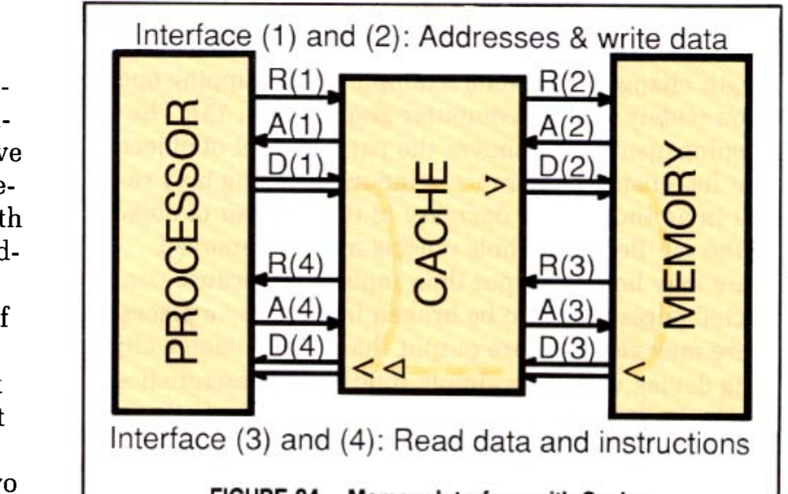

**图 24.** 带高速缓存的存储器接口。处理器、高速缓存和存储器系统可以使用遵循图 4 的二相捆绑数据约定的接口。接口 1 和 2 携带要写入的地址和数据；接口 3 和 4 携带读取的数据和指令。整个系统可以作为微流水线以其最慢参与者的最大吞吐率运行。

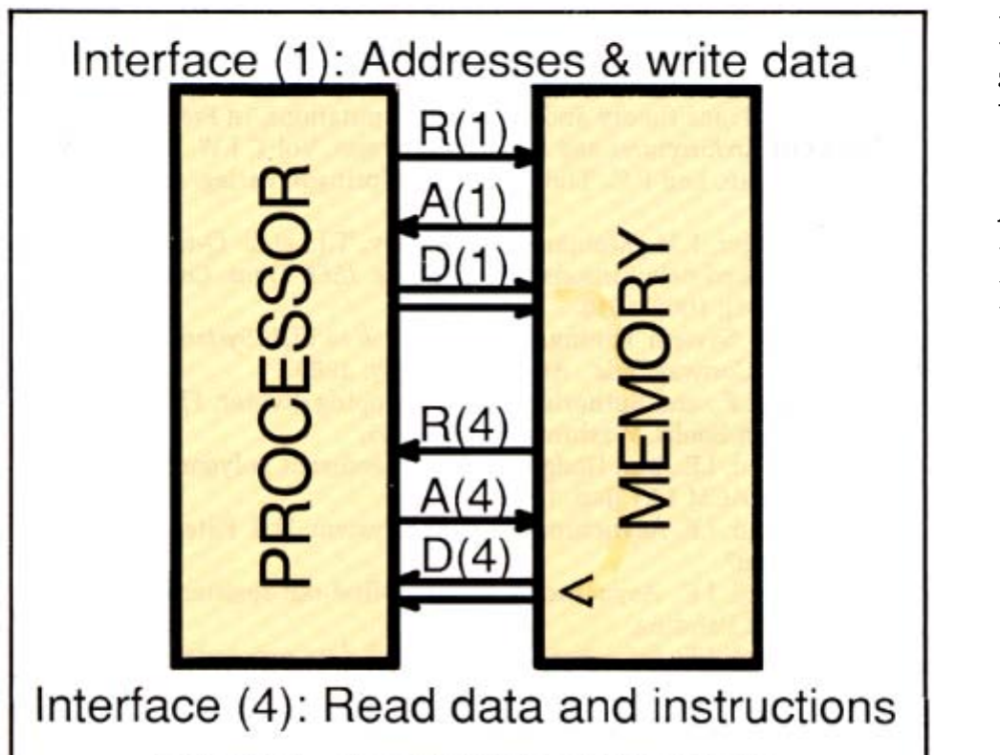

**图 25.** 不带高速缓存的存储器接口。省略高速缓存后，处理器和存储器仍可一起工作。由于每个接口都适应任意延迟，因此在省略高速缓存或更换具有不同性能特性的高速缓存时，不需要进一步的设计更改。

## 结论

在跳变信令概念框架中，FIFO 和流水线设计简单且易于理解。在时钟逻辑概念框架内设计它们相对困难。通过抛弃时钟逻辑而支持跳变信令，人们能够制造出非常简单的微流水线，这些微流水线很容易组装成更大的结构。这里建议的概念框架的变化简化了系统设计，因为简单的模块及其组合可以进一步组合成大型系统。

微流水线和跳变信令提供的组合性可能是它们最重要的属性。复杂的功能很容易从提供编程中已经熟悉的基本功能的简单模块中组合而成。更复杂的系统可以通过将它们构建为基本模块和先前设计的组合的分层结构来构建。即使基本构建块很难设计（现在已经不难了），它们也是值得的，因为它们非常容易组合成系统。

这种同样的组合性提供了一种在改进的电路可用时升级系统性能的简单方法。事件驱动的接口协议允许旧组件被具有改进的吞吐量、延迟或成本特性的新组件替换。由于这里使用的握手会自动处理交付或利用数据时的延迟，因此可以确信系统仍将正常运行。另一方面，在时钟逻辑概念框架中构建的大型系统难以进行增量改进，因为时钟速度的任何增加都必须在整个系统中得到适应。随着对我在这里概述的系统进行改进，可以预期系统中最慢或最昂贵的部分将首先被替换，从而每次替换都会提高系统性能或降低系统成本。因此，跳变信令概念框架、微流水线和图 4 的二相捆绑数据约定结合在一起，不仅简化了初始系统设计，而且允许在新技术可用时对系统进行快速的中期升级。

我希望这次演讲能帮助系统设计跟上不断进步的组件技术。今天，新的集成电路技术每六个月左右就能提供成本或性能方面的显著改进。利用这种改进的性能通常很困难，因为加快整个系统中的时钟是一项充满危险的艰巨任务。当今受时钟逻辑概念框架约束的系统设计师需要数年时间才能生产出新系统。因此，正在销售的系统可能会比现代技术提供的潜在速度或成本效益落后数年。我相信，我在这里描述的微流水线框架可以减少时钟逻辑概念框架强加的机会成本。

## 致谢

跳变信令概念框架已在少数地方使用了很长时间。我知道伊利诺伊大学 David Muller、犹他大学 Al Davis 和麻省理工学院 Jack Dennis 的早期工作；我为漏掉其他项目而预先道歉。

我自己在跳变信令概念框架方面的教育归功于少数能干的人。我第一次意识到跳变信令是在 1960 年代初期，当时由 Wes Clark 领导的圣路易斯华盛顿大学的一个小组在设计一套宏模块（macromodules）[2, 3] 时使用了它。从 1966 年开始的十多年里，我从目前在加州理工学院任教的 Charles Seitz 那里学到了更多关于它的知识，当时作为麻省理工学院的研究生，他教会了我关于数字设计的大部分知识。我们在哈佛大学以及 Evans and Sutherland 计算机公司合作，在用于计算机图形学的处理器中使用了几乎正确版本的微流水线，包括原始的“裁剪除法器”[14]。他在著名的 Mead 和 Conway 关于 VLSI 的书中的章节是关于跳变信令的最出色且最易获得的参考资料之一 [13]。

另外两个人对我的教育也很重要。长期以来对我最重要的是 Bob Sproull，二十五年前我从他那里开始了终身教育，我对他知识和能力的敬畏之情至今未减。当我的思维模糊时，他经常修正我的想法，并使这次演讲比我独自完成的更准确。在过去的五年里，他和我也领导了一项“异步系统研究”，以学习和教授跳变信令。作为其中的一部分，我们为各种目的设计了微流水线，包括我在这里描述的那些。我们已经向几百人教授了我们的主题，并且有两本书正在准备中。最后，我想提到 Charles Molnar，他在华盛顿大学的小组继续着我之前提到的开拓性工作。他不仅慷慨地为我的教育贡献了他的时间和想法，还贡献了他的热情。他对跳变信令概念框架的贡献不仅包括绝对必要的逻辑模块综合方法 [9]（没有它，新框架很难使用），还包括整体数学理论的许多重要部分，以及对有用电路的新构想 [12]。他与埃因霍温 Martin Rem 的小组合作进行的理论工作 [6, 10, 11, 19] 正开始证明关于在跳变信令概念框架中设计的系统正确性的定理。

这里报告的工作导致了由 Sutherland, Sproull and Associates, Inc. 进行的更广泛的“异步系统研究”，并得到了六家工业赞助商的支持：Apple Computer、Austek Microsystems Ltd.、Digital Equipment Corp.、Evans and Sutherland Computer Corp.、Floating Point Systems 和 Schlumberger 研究实验室。我们在卡内基梅隆大学和伦敦大学帝国理工学院的配合下完成了这项工作。Erik Brunvand、Ed Frank、Ian Jones、Charles Molnar 和 Bert Sutherland 与我们合作。我们能够测试由南加州大学信息科学研究所运营的 MOSIS 集成电路制造服务为我们制造的微流水线电路。我们很自豪能成为第一个商业 MOSIS 客户。

## 参考文献

1. Chaney, T.J., and Molnar, C.E. Anomalous behavior of synchronizer and arbiter circuits. *IEEE Trans. Comput. C-22*, 4 (Apr. 1973), 421–422.
2. Clark, W.A. Macromodular computer systems. In *Proceedings of the Spring Joint Computer Conference*, AFIPS, April 1967.
3. Clark, W.A., and Molnar, C.E. Macromodular computer systems. *Computers in Biomedical Research*, Vol. 4, R. Stacy and B. Waxman, Eds., Academic Press, New York, 1974, 45–85.
4. Dally, W.J., Seitz, C.L. Deadlock-free message routing in multiprocessor interconnection networks. *IEEE Trans. Comput. 36*, 5 (May 1987), 547–553.
5. Dill, D.L., Nowick, S.M., and Sproull, R.F. Specification and automatic verification of self-timed queues. Computer Systems Laboratory Report, Stanford University, 1988.
6. Ebergen, J.C. Translating programs into delay-insensitive circuits. Ph.D. dissertation, Eindhoven University of Technology, 1987.
7. Levy, J.V. Buses, the skeleton of computer structures. In *Computer Engineering*, C.G. Bell, J.C. Mudge, and J.E. McNamara, Eds., Digital Press, 1978.
8. Miller, R.E. "Sequential Circuits", Chapter 10, In *Switching Theory*, Vol 2, Wiley, NY, 1965.
9. Molnar, C.E., Fang, T.P., and Rosenberger, F.U. Synthesis of delay-insensitive modules. In *Proceedings of the 1985 Chapel Hill Conference on VLSI*, H. Fuchs, Ed., Computer Science Press, 1985.
10. Rem, M., van de Snepscheut, J.L.A., and Udding, J.T. Trace theory and the definition of hierarchical components. In *Proceedings of the Caltech Conference on VLSI*, 1983.
11. Rem, M. Trace theory and systolic computations. In *Proc. PARLE (Parallel Architectures and Languages Europe)*, Vol 1, J.W. deBakker, A.J. Nijman, and P.C. Treleaven, Eds, Springer-Verlag, 1987, pp. 14–34.
12. Rosenberger, F.U., Molnar, C.E., Chaney, T.J., et al. Q-modules: Locally clocked delay-insensitive modules. *IEEE Trans. Comput. 37*, 9 (Sept. 1988), 1005–1018.
13. Seitz, C.L. System Timing. In *Introduction to VLSI Systems*, C.A. Mead and L.A. Conway, Eds., Addison-Wesley, 1980.
14. Sproull, R.F., and Sutherland, I.E. A clipping divider. *FJCC 1968*, Thompson Books, Washington, D.C., 765.
15. Sutherland, I.E., and Hodgman, G.W. Reentrant polygon clipping. *Commun. ACM 17*, 1 (Jan. 1974), 32–42.
16. Sutherland, I.E. Asynchronous queue system, U.S. Patent 4,679,213, July 7, 1987.
17. Sutherland, I.E., Asynchronous first-in-first-out register structure. US Patent Pending.
18. Sutherland, I.E. Asynchronous pipelined data processing system. US Patent pending.
19. Udding, J.T. A formal model for defining and classifying delay-insensitive circuits and systems. *J. Distrib. Computg. 1*, 1986, 197–204.

作者当时地址: Ivan E. Sutherland, Sutherland, Sproull and Associates, Inc., 4516 Henry Street, Pittsburgh, PA 15213.

---

## 译注

**文本与翻译说明**

1. 〔译注1〕 伊凡·萨瑟兰(Ivan E. Sutherland)因其在计算机图形学领域的开创性贡献(特别是 Sketchpad 系统)获得 1988 年图灵奖。他被公认为“计算机图形学之父”，也是虚拟现实(VR)技术的先驱。
2. 〔译注2〕 **跳变信令**(transition-signalling): 异步电路设计中的一种控制方式，其中信号的上升沿和下降沿具有相同的含义，代表一个“事件”。这与传统的“电平信令”(level-signalling)相对。

**背景与文化注**(译者补注,原文无)

3. **为什么图形学先驱谈论异步电路?** 萨瑟兰在 1980 年代后期转向异步系统研究，主要是为了解决超大规模集成电路(VLSI)中日益严重的全局时钟偏斜(clock skew)和设计复杂性问题。他认为异步设计(如本文提出的微流水线)是提高系统组合性和可升级性的关键。
4. **Sutherland-Sproull-Associates**: 萨瑟兰与 Bob Sproull 共同创立的咨询公司，专注于异步系统研究。该公司后来被 Sun Microsystems 收购，成为 Sun Labs 的核心。
5. **Muller C-element**: 由 David Muller 在 1950 年代发明，是异步逻辑中的核心元件，其功能类似于事件的“与”门：只有当所有输入都发生跳变后，输出才会跳变。
6. **Charles Molnar**: 异步电路领域的先驱，宏模块(Macromodules)项目的核心人物，对萨瑟兰的异步电路思想有深远影响。
7. **Charles Seitz**: 加州理工学院教授，异步系统专家，曾与萨瑟兰在哈佛和 Evans & Sutherland 合作。他在 Mead & Conway 的经典教材《VLSI 系统导论》中编写了关于系统定时的章节。
8. **Bob Sproull**: 萨瑟兰的长期合作伙伴，计算机图形学和系统专家，曾任 Sun Microsystems 副总裁。
9. **Wes Clark**: 宏模块(Macromodules)项目负责人，该项目是 1960 年代对模块化、异步计算系统的宏大尝试。

**OCR 与印刷勘误**

10. 扫描件中部分电路图符号(如 Muller C 元件中的 'C')在 OCR 文本中常被识别为乱码或丢失，已对照原刊图像校正。
11. 参考文献 [19] 标题中 "assifying" 应为 "classifying"，已校正。
12. 图 16 说明文字中 "micropipeline shown has an odd number of inversions" 指出该电路具有奇数个反相，因此会反转数据值，这在翻译中已予以保留。
13. 原文 25 幅插图已按原版样式从 PDF 中提取为 PNG 并内嵌于正文相应位置（见 zh/assets/1988-sutherland/）：图 1 九点谜题、图 2 等效晶体管、图 3 捆绑数据接口、图 4/5 时序约定、图 6/7 Muller C 元件、图 8–25 各种微流水线电路、芯片照片等。多数图形为嵌入位图（1bpc 线图），放大后仍清晰；图 20 为芯片照片。部分图（图 10、17、18）的图题直接印在图中，MD 中仍按正文图题保留。
