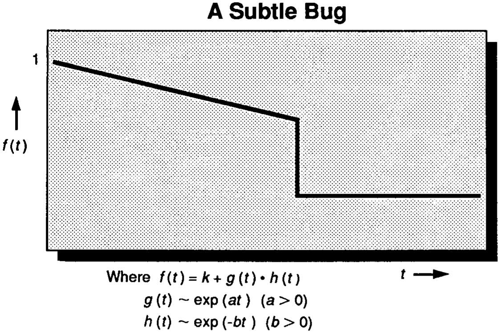
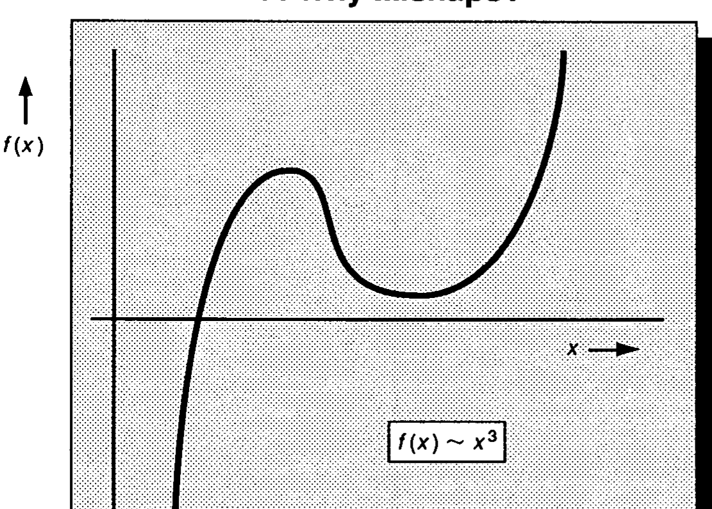
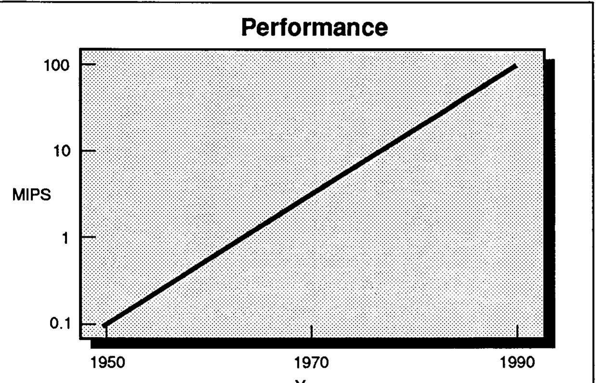
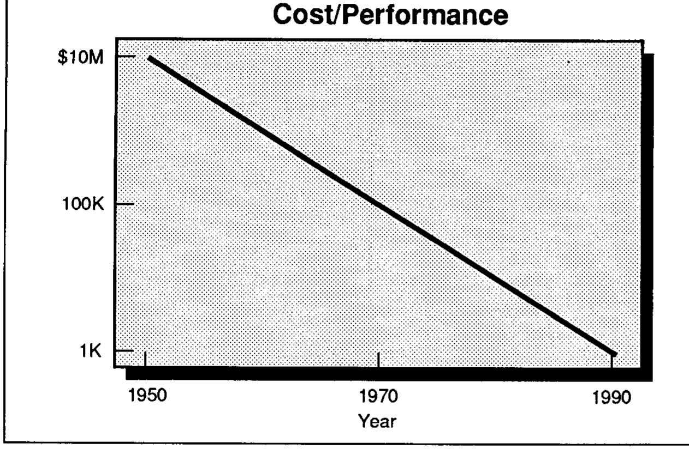
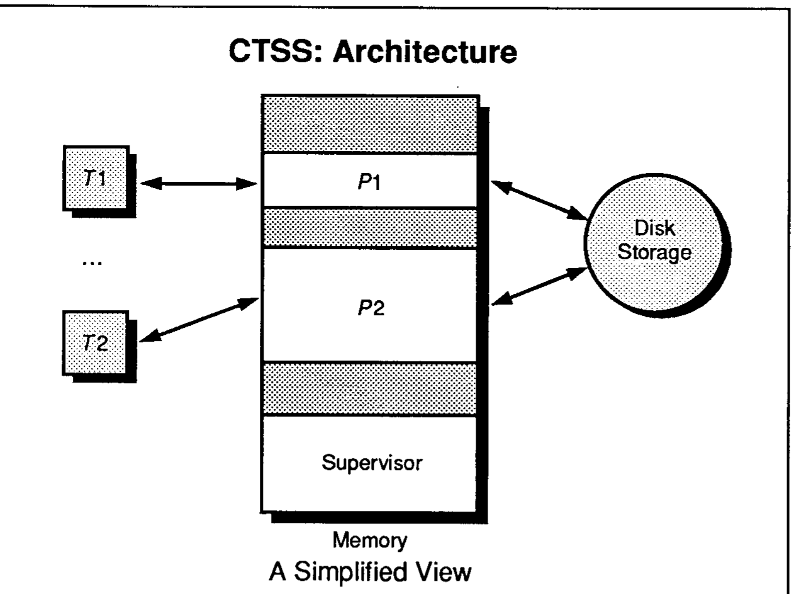

# 论构建注定失败的系统

**On Building Systems That Will Fail**

> 作者 费尔南多·科尔巴托 (Fernando J. Corbató)
> 1990 年 ACM 图灵奖演讲
> 原载 *Communications of the ACM*, Vol. 34, No. 9 (1991 年 9 月), pp. 72-81
> 译自 ACM DL 扫描件 `1283920.1283947.pdf`(个人学习用途)

> 授予费尔南多·科尔巴托,以表彰他在组织概念并领导开发通用大规模分时与资源共享计算机系统 CTSS 和 Multics 方面的工作。

荣获图灵奖,我深感荣幸与欣喜。我的工作始终围绕计算机系统展开,这也将是我今天演讲的主题。

系统的本质在于整合。它需要对所处理的问题领域有广博的了解,而所需的细节知识极少能由一人独自掌握。因此,系统工作通常由团队完成。正因如此,我不仅是为自己,更是代表与我共事过的众多同仁接受这一奖项。要列举所有做出贡献的人并不现实。尽管如此,我仍想特别提及 Marjorie Daggett 和 Bob Daley,他们在 CTSS 的诞生中发挥了作用;还要提及 Bob Fano 以及已故的 Ted Glaser,他们为 Multics 系统的开发做出了关键贡献〔译注11〕。

现在谈谈我这篇演讲的题目:《论构建注定失败的系统》。当然,这个题目带点噱头。我曾考虑过几个备选题目,但最终都放弃了:《论构建混乱的系统》听起来太轻浮,且暗示没有系统化的方法;《论掌控系统复杂性》听起来又像是我掌握了所有答案。最接近的一个题目是《论构建可能出现故障的系统》,但它没能表达出我想要暗示的那种"必然性"。

我真正想探讨的是那一类系统,由于没有更好的措辞,我称之为"雄心勃勃的系统"〔译注1〕。几乎可以肯定,雄心勃勃的系统永远不会完全按预期运行。事情总会出错,有时甚至是以戏剧性的方式出错。这引出了我的核心论点:在设计此类系统时,要问的问题不是"如果出了错怎么办",而是"什么时候会出错"。

## 一些例子

事实上,注定失败的雄心勃勃的系统比我们意识到的要普遍得多。在某些情况下,我们甚至追求这种状态,沉浸在意外带来的刺激中。例如,我想请各位想想我们的国球,即美式橄榄球。比赛的全部目标就是让每支球队都发挥出能力的极限。除了纯粹的体能技巧,还有复杂的战略、临场喊话(audibilize)的能力,以及对意外情况的快速反应,这些都是比赛的核心部分。当然,偶尔会有一支球队接近完美,所有的战术都奏效了,比赛反而变得索然无味。

另一个追求完美却过于雄心勃勃的系统例子是军事战争。同样的元素也存在于此:敌对双方必须不断即兴发挥,应对意外。事实上,我们从军方那里得到了一个绝妙的缩写词 SNAFU,它被委婉地翻译为"情况正常,一团乱麻"〔译注2〕。如果各位仍有怀疑,请想想一旦战事爆发,"精确轰炸"和"外科手术式打击"这类词汇会多么迅速地被"战争迷雾"和"友军误伤"所取代。

说点轻松的,我想以在波士顿开车为例,说明注定失败的系统。汽车交通是分布式控制的一个绝佳案例,它有一套通用的协议,即交通法规。波士顿地区因司机对这些讨厌的法规进行"自由发挥"而臭名昭著,其中最典型的莫过于环岛(rotary)〔译注3〕。环岛确实有其优点:它们很高效,无需等待迟钝的交通信号灯;它们很直接;而且它们为创造性的即兴发挥提供了绝佳机会,从而为驾驶这项运动增添了乐趣。

一种最有效的策略是:司机在接近环岛时僵住脖子,目视前方,当然,暗地里要把余光发挥到极致。如果司机在进入环岛时加速,效果会更好;有些司机还会给最后一步加点戏,摆出一副狂喜的疯子模样。其效果当然是威慑,一种"啄序"〔译注4〕会迅速形成。之所以没有发生更多事故,唯一的理由是大多数司机还有第二套策略,即假设其他人可能都是疯子(他们往往是对的),并且每个司机都做好了在几英寸距离内刹停的准备。我们再次看到一个例子:雄心勃勃的战术与谨慎的防备共同构成了一个有效的解决方案。

到目前为止,我给出的例子可能暗示雄心勃勃系统的失败源于人为因素,而系统的技术部分至少是可以正确构建的。特别是在计算机系统方面,似乎只要调试好代码就行了。有人认为严格的测试可以解决问题,有人则寄希望于证明程序的正确性。但不幸的是,在许多情况下,这些技术都无法百分之百奏效。请允许我提供一个简单的例子,如图 1 所示。

**图 1**：调试代码(Debugging the Code)——简单例子中函数行为的图示。

考虑一个复杂的数值计算案例:变量 f 代表某个物理值,是在参数 t 的一定范围内对一组点进行计算得到的。物理变量的特性是它们通常不会表现出突然的变化或不连续性。那么这里发生了什么?如果我们看 f 的表达式,会发现它是常数 k 加上另外两个函数 g 和 h 的乘积。进一步观察,我们发现函数 g 随 t 指数级增长,而函数 h 则随 t 指数级减小。g 和 h 的乘积随 t 的增加几乎保持恒定,直到出现一个突跳,f 的曲线变平了。

出了什么问题?答案是在曲线的关键点发生了浮点下溢(underflow)。也就是说,负指数的表示超出了这台特定计算机浮点表示的字段大小,硬件自动将函数 h 的值设为零。通常这很合理,因为极小的数可以被正确地近似为零,但在本例中并非如此,我们的结果出现了严重错误。更糟糕的是,由于 f 的计算可能是内部进行的,不难想象这里显示的故障可能根本不会被察觉。

由于正确处理这个例子所代表的病态情况是一项额外的工程麻烦,因此下溢问题经常被忽视也就不足为奇了。但从这个例子中可以学到的更深刻教训是,微妙的错误极难避免,而且在某种程度上是不可避免的。

我的下一个例子是在我还是研究生、在先驱性的 Whirlwind 计算机〔译注5〕上编程时遇到的。一天晚上,在我等待轮到我使用机器时,排在我前面的研究生开始抱怨他的某些计算是多么"棘手"。他说他正在计算一系列情况下特定机翼结构的振动频率。实际上,他的方程是三次方程,他使用的是牛顿-拉夫逊迭代法(Newton-Raphson method)。由于他不理解的原因,他的方法能找到其中一个根,但其他根却无法"收敛"。他试图通过修改程序来解决这个问题:当遇到这些棘手的根时,程序在尝试固定次数后就放弃迭代。

这里有几处错误:首先,他的三次方程系数是基于实验数据的,其中一些点根本就是错的。因此,如图 2 所示,他只有一个实根和一对虚根。这样,他的迭代法永远无法在第二和第三个根上收敛,而他第一个根的值也完全是垃圾。其次,三次方程有精确的解析闭式解,因此完全没有必要使用迭代法。第三,基于他对现状不完整的模型和理解,他在修补程序以忽略那些看似难以计算的值时,做出了非常糟糕的判断。

**图 2**：不收敛的迭代法(Nonconverging Iterative Method)——由糟糕的根初值(Poor Root Value)引起。

## 雄心勃勃系统的特性

接下来谈谈雄心勃勃系统的一些普遍特性。首先,它们通常规模宏大,拥有远超简单复制的重大组织结构。其次,它们往往复杂而精细,即使是一个小团队也难以独立开发。第三,如果它们真的雄心勃勃,那么它们就是在挑战人类能力的极限,因此在何时能够完成方面总存在一定程度的不确定性。由于开始一个雄心勃勃的项目必须是个乐观主义者,因此低估完成时间成为常态也就不足为奇了。

第四,雄心勃勃的系统一旦运行,往往会开辟新天地,提供新服务,并很快变得不可或缺。最后,雄心勃勃的系统往往因为开辟了新的应用领域,而引来大量的改进和变化。

有人可能会争辩说,雄心勃勃的系统其实只在头一两次比较困难。这只是个学习如何去做的问题。一旦学会了,只需画好相应的 PERT 图〔译注6〕,聘请优秀的经理,确保充足的预算,然后开干就行了。也许在某些情况下这行得通,但至少在计算机系统领域,有一个根本原因导致它行不通。

我们似乎无法正确构建雄心勃勃系统的一个关键原因是变化。计算机领域沉醉于变化之中。在过去的四十年里,我们见证了飞速的增长,而且这种增长似乎仍未放缓。这个领域尚未成熟,却已经直接或间接地占据了国民生产总值(GNP)的很大一部分。更重要的是,计算机革命(这场第二次工业革命)改变了我们的生活方式,并催生了无数新的应用领域。所有这些变化和增长不仅改变了我们生活的世界,还提高了我们的期望,激励着在航空订票、银行、信用卡和空中交通管制等各个领域出现日益雄心勃勃的系统。

计算机行业惊人增长的背后,当然是数字逻辑原始性能发生的同样令人难以置信的变化。图 3 并不精确,各位可能以前在某种形式上见过,它按年代给出了顶级计算机的性能。如你所见,纵轴 MIPS〔译注7〕是对数刻度。特别是在过去的十年里,图表变得与具体问题相关,因此线条的右上端应该分裂成某种"胡须"状,因为越来越多的计算机是为特殊应用和并行处理而定制的。

**图 3**：顶级计算机按年代的性能(Performance of a Top-of-the-Line Computer by Decade),纵轴 MIPS 为对数刻度。

更复杂的是,并行处理并非所有问题的解决方案。某些本质上是串行的计算,如火箭轨道,从并行计算机中获益非常有限。这当然让人想起那个老笑话:军方加速怀孕的方法是让九个女人花一个月时间来完成这项任务。

正如图 4 所示,推动增长的不只是性能,而是性价比,或者简单地说,是良好的经济效益。该图虽然过于简化,但代表了过去四十年中具有给定性能的计算机机型的成本。纵轴同样是对数刻度,从 1950 年的一千万美元下降到 1990 年的一千美元。随着我们接近现在,对应于个人电脑,图表实际上应该变得更加复杂,因为计算机变得超级便宜的一个后果是,它们越来越多地被嵌入到其他设备中。现代汽车就是一个例子。而当前这一波带有手写笔输入的掌上电脑会有多通用,仍有待观察。

**图 4**：四十年来给定性能计算机的成本(Cost for Given-Performance Computer Model over Four Decades),纵轴为对数刻度,从 1950 年的一千万美元降至 1990 年的一千美元。

此外,当我们看到一张拍摄于 1960 年左右、只有一名操作员值守的"机房"照片时,我们会想起计算机技术发生的巨大变化。那些箱子巨大无比,像淋浴房一样大,整体印象就像某个小工厂。你理应感到震撼,而操作员则被要求系上领带以保持端庄。如果他没系,至少你可以肯定 IBM 的维护工程师会系。

另一个提醒我们技术发生巨大变化的例子是计算机主存的物理尺寸。例如,如果看 20 世纪 50 年代中期拍摄的磁芯存储器(core memory)〔译注8〕系统的老照片,通常会看到一个大约网球拍头大小的磁芯平面,它可以存储约 1000 比特的信息。相比之下,今天的 4Mb 存储芯片比大拇指还小。

今天授予我这个奖项,很大程度上是基于我在两个先驱性的分时系统(CTSS 和 Multics)方面的工作〔译注9〕。事实上,正是通过参与这两个系统,我获得了今天所分享的系统构建视角。因此,回顾这两个系统作为雄心勃勃系统的案例,并探讨为什么任务的复杂性使得几乎不可能在第一次就正确构建这些系统,似乎是恰当的。

首先看 CTSS,让我们记住当时的"黑暗时代"。那是 20 世纪 60 年代初。当时的计算机庞大且昂贵,计算中心的管理员觉得有义务节省这些宝贵的资源。用户(即程序员)被要求以一叠打孔卡片的形式提交计算任务。然后,这些任务与其他任务合并成一批存入磁带,由计算机操作系统处理。这就像把衣服丢进自助洗衣店一样,毫无魅力和刺激可言。

问题在于,即使是一个微小的输入打字错误,任务也会被中止。正如各位所知,分时技术是解决无法与计算机交互这一问题的方案。现代分时技术的总体愿景主要由约翰·麦卡锡(John McCarthy)阐述,我很高兴地注意到他也是本次会议的主讲嘉宾。在英国,克里斯托弗·斯特雷奇(Christopher Strachey)独立提出了一种有限的交互式计算,但其主要目标是调试。很快,全国各地出现了许多开发各种形式交互式计算的小组,但在几乎所有情况下,产生的系统都有重大局限。

正是在这种背景下,我自己的小组开发了我们版本的分时愿景。我们称之为"兼容分时系统"(Compatible Time-Sharing System),简称 CTSS。我们最初的抱负很谦虚。首先,该系统旨在作为演示原型,在其他人尝试的更雄心勃勃的设计实现之前先行一步。其次,它旨在处理通用编程。第三,它旨在使运行多年来在批处理环境下开发的大量软件成为可能。这就是其名称的由来。

运行 CTSS 的基本方案很简单。始终驻留在主存中的监控程序(supervisor program)会在用户程序之间切换,在间隔定时器的帮助下,轮流运行每个程序一小段时间。如图 5 所示,用户程序可以通过类似打字机的终端以及磁盘存储单元进行输入/输出。

**图 5**：CTSS(兼容分时系统)的简化视图(A Simplified View of CTSS)：监控程序在用户程序之间切换,用户程序通过终端与磁盘存储进行输入/输出。

但这张图过于简化了。关键困难在于主存短缺,并非所有活跃用户的程序都能同时留在内存中。因此,监控程序不仅必须在磁盘存储单元之间搬运程序,还必须作为用户程序发起的所有 I/O 的中介。因此,所有的 I/O 线路都应该只指向监控程序。

更复杂的是,监控程序必须防止用户程序相互践踏。为此,需要对处理器进行特殊的硬件修改,设置只能由监控程序设置的内存边界寄存器。尽管有这些复杂性,最初的监控程序由于足够简单,仅占用约 22KB 的存储空间,甚至比这篇演讲稿所需的空间还要小!

创建 CTSS 的大部分战斗都涉及解决当时没有标准方案的问题。例如:没有标准的终端;没有简单的调制解调器;计算机的 I/O 是按字而非按字符进行的,更糟的是,不支持小写字母;当时的计算机既没有中断定时器,也没有日历时钟;没有办法防止用户程序随机发出原始 I/O 指令;没有内存保护方案;也没有简单的方法来存储具有相对快速随机访问能力的大量数据。

构建 CTSS 的总体结果是改变了计算风格,但有几个影响值得一提。其中最重要的一点是,我们发现编写交互式软件与编写批处理软件截然不同,即使在今天这个个人电脑时代,交互式界面的演进仍在继续。

回想起来,有几项设计决策促成了 CTSS 的成功,其中两点至关重要。首先,我们可以进行通用编程,特别是使用系统本身开发新的监控软件。其次,通过使系统能够兼容旧的批处理代码,我们继承了大量现成的旧软件。

开发 CTSS 的一个重要后果是,用户第一次拥有了程序和数据的持久在线存储。突然之间,信息的隐私、保护和备份问题必须被正视。开发的另一个副产品是,由于我们通过调制解调器操作终端,远程操作成为了常态。此外,在中央文件系统中在线保存信息的新自由,突然使得用户之间共享和交换信息变得格外方便。

当然也有意外。令我们沮丧的是,那些在批处理下忍受了数小时任务等待的用户,在响应时间超过一秒时突然变得焦躁不安。此外,许多让 CTSS 构建得如此简单的简化假设(如一级文件系统)突然开始显得捉襟见肘。似乎我们做得越多,用户想要的就越多。

关于 CTSS 系统还有另外两点观察。首先,它的寿命远超我们的预期。虽然 CTSS 在 1961 年 11 月就以原始形式进行了演示,但直到 1963 年作为 Project MAC〔译注10〕夏季研究的载体才得到广泛应用。有一段时间曾有两套系统硬件,但到 1973 年,最后一套也被关闭并报废了,主要是因为 IBM 7094 硬件的维护成本变得极其昂贵。直到最后一刻,仍有用户拼命想再多用几个小时。

其次,当时新兴的晶体管和大型随机访问磁盘文件对分时技术的成功至关重要。前一代的电子管对于持续的实时运行来说实在太不可靠了,当然,大型磁盘文件对于用户程序和数据的中央存储也至关重要。

## 一次意外

我的核心主题是试图说服各位:在构建系统时,当你必须应对大量新颖问题时,错误是不可避免的。事实上,我们在使用 CTSS 时就遇到了一个"精彩"的错误。让我描述一下:事情发生在 Project MAC 的一个下午,当时 CTSS 被用作主要的分时主力机。任何登录的用户都发现,终端上打印出来的不是往常的"每日消息"(message-of-the-day),而是整个用户口令文件〔译注15〕。这种情况持续了 15 到 20 分钟,直到一位特别认真的用户打电话给系统管理员,开口便问:"你知道吗……?"不用说,这种巨大的安全漏洞引起了普遍的惊恐,系统被匆忙关闭,接下来的 12 个小时里,大家英勇地为每个人更改了口令。问题是,这怎么会发生呢?让我解释一下。

为了简化最初 CTSS 系统的组织,我们做出了一项设计决策:让终端上的每个用户都关联到他或她自己的文件目录。此外,系统本身被组织成一种准用户,拥有自己的目录,其中包含大量的支持应用程序和文件,包括每日消息和口令文件。到目前为止一切尚好。通常,一名系统程序员可以登录到系统目录并进行任何必要的更改。但系统程序员的人数已增加到十几个,而且到那时系统几乎是连续运行的,因此对系统文件进行实时维护变得至关重要。不出所料,系统程序员认为"一个用户对应一个目录"的限制是他们的一大瓶颈。于是,他们开始游说我,让系统目录成为一个例外,以便多个人可以同时登录。他们向我保证会小心行事,不犯错误。

但错误当然还是发生了。标准系统文本编辑器中的一个软件设计决策被忽视了。当时假设编辑器在同一个目录中一次只能由一个用户使用,因此编辑器的所有实例都可以使用相同的临时文件名。但是,当两名系统程序员同时在系统目录中进行编辑时,编辑器的临时文件发生了交换,灾难就这样发生了。

我们可以从中吸取两个教训:首先,设计缺陷往往很微妙,并且随着系统的演进而发生,当新功能或新用途被添加到系统中时,早期的假设往往会被遗忘。其次,即使是技术精湛的程序员也会犯错。

## Multics

现在谈谈 Multics 的开发。我会简短一些,因为该系统已有详尽的文档记录,并且已经有了两篇回顾性论文。Multics 系统旨在"正确地"实现分时,并取代之前像 CTSS 这样的权宜之计系统。它始于麻省理工学院 Project MAC、贝尔电话实验室以及通用电气公司计算机部门(后被霍尼韦尔收购)之间的合作。出于宏大的目标,我们承担了一长串的创新任务。

其中最重要的包括:首先,我们在处理器硬件中引入了分页和分段机制,以及周密的访问控制方案。其次,我们引入了围绕监控软件的保护环(rings of protection)概念。第三,我们从一开始就计划系统由可互换的多处理器、内存模块等组成。第四,我们决定几乎整个系统都使用新定义的编译语言 PL/I 来实现。

让我分享一些关于 Multics 经历的观察。我们委托定制的新颖硬件意味着系统必须从头开始构建,因此我们面临着巨大的任务。

使用编译器实现系统软件的决定是正确的,但我们当时没有意识到新语言 PL/I 给我们带来了两大困难:首先,该语言包含本质上非常复杂的结构,系统程序员需要一段学习期来学会避开它们。其次,没有人知道如何很好地实现该编译器。最终我们克服了这些困难,但耗费了宝贵的时间。

Multics 能够成功是了不起的,因为它是三个高度独立的组织合作的结果,且没有行政首脑。这意味着决策是通过说服和共识做出的。因此,很难拒绝那些平庸的想法,直到在它们身上花费了大量的时间和精力。

Multics 系统确实转化为了商业产品。它的一些主要优势包括虚拟内存系统、文件系统、对安全性的重视、在线重新配置的能力以及文件系统的信息备份系统。而且,与 CTSS 一样,Multics 开发团队的许多成员后来都在计算机领域发挥了重要作用。

关于雄心勃勃的 Multics 经历,还可以做进一步的观察。特别是,我们被之前系统(如 CTSS)的成功所误导,在那些系统中,我们能够"一砖一瓦"地构建,在已经运行的大量软件基础上逐步增加想法。

我们也因为无法为项目的不同阶段设定并达成准确的时间表而感到尴尬。回想起来,我们本不该如此,因为我们以前从未做过类似的事情。然而在许多情况下,我们的估计应该被称为猜测。

Unix 系统是对 Multics 的一种反作用。甚至连名字都是个笑话。肯·汤普森曾是贝尔实验室 Multics 项目的一员,由于对试图掌控大型系统开发的尝试感到沮丧,他决定从头开始。他的策略很明确:从小处着手,随着他发现如何很好地实现这些想法,再逐一构建。众所周知,Unix 已经演进并取得了巨大成功,成为工作站的首选系统。尽管如此,Multics 的某些方面在 Unix 中从未被复制。

作为霍尼韦尔和 Bull 公司的商业产品, Multics 培养了一批忠实的追随者。在鼎盛时期,全球约有 77 个站点,即使在今天,由于缺乏替代方案,许多站点仍在顽强地运行。

## 复杂性的来源

雄心勃勃系统的普遍问题是复杂性。接下来我尝试归纳一些主要原因。最显而易见的复杂性问题源于规模。特别是,所需人员越多,管理层级就越多。即使我们使用简单的计算也能看出问题。假设监督比例固定(例如 1 比 6),管理层级将随人员数量的对数增长。困难在于,随着管理层级的增加,最高层会与底层的相关问题脱节,随机的偶然沟通的可能性也会降低。

组织的另一个问题是下属讨厌报告坏消息,有时是害怕"杀掉信使",有时是因为他们的目标与高层管理人员不同。最后,大型项目鼓励专业化,导致很少有团队成员了解项目的全貌。误解和沟通不良开始出现,很快项目资源的大部分就被浪费在处理内部混乱上。当然,错误也就随之而来了。

下一类复杂性源于新的设计领域。最生动的例子来自物理系统世界,但软件也面临同样的问题,尽管通常以更微妙的方式表现出来。

想想 1940 年 11 月 7 日华盛顿州塔科马海峡大桥(Tacoma Narrows Bridge)的毁坏。这座大桥在大约四个月前才自豪地落成。各位可能都看过那段幸运记录下来的业余坍塌视频。当时发生的情况是,那天刮起了一阵强劲但并不罕见的侧风。很快,由主跨电缆悬挂的路基开始像芦苇一样振动,它弯曲得越厉害,呈现给风的横截面就越好。结果是,随着振荡变得剧烈,大桥分崩离析。这是一个进入新设计领域的案例:关注重力载荷结构的传统造桥者进入了航空学领域。结果酿成了一个重大错误。

接下来,让我们看看源于人类使用计算机系统的复杂性。在使用允许共享或交换信息的在线系统时(联网工作站显然属于此类),人们面临着一个两难境地:如果完全信任所有其他用户,就容易受到任何恶意用户的反社会行为的攻击,想想病毒的情况;但如果试图完全隐居和孤立,不仅会感到无聊,而且自己的信息宇宙将停止增长,无法通过与他人的互动而得到增强。结果是,我们大多数人都在一个复杂的权衡区域内运作,有着各种信任和安全机制的安排。即使是像口令这样简单的想法也经常出问题:它们记起来很麻烦,很容易在不经意间泄露,而且如果共享了就无法有选择地撤销。隐私和安全问题特别难以处理,因为责任往往分散在用户、经理和供应商之间。

更糟糕的是,没有办法仅仅通过"观察"一个系统就确定其隐私和安全影响。难怪这个领域总是出错。

使用计算机系统的后果之一是,信息越来越多地在线保存在中央存储设备中。计算机存储设备已经变得非常可靠,除非它们坏掉,而这正是症结所在。即使是最有经验的计算机用户,也可能被当今设备近乎完美的运行所迷惑,产生一种虚假的安全感。供应商的态度加剧了这一问题,这与汽车工业最初对安全性的态度不无相似:不可避免的磁盘故障被视为会抑制销售的负面问题。

我们需要的是对一长串"如果……怎么办"保持持续警惕:硬件故障、人为疏忽、蓄意破坏、盗窃、火灾、地震、长期介质失效,甚至关于恢复程序的机构记忆丧失。只要还有人必须通过"惨痛的教训"来学习,错误就会继续发生。

讨论风险或可靠性的另一个复杂因素是,缺乏一种良好的对话语言。统计数据被误用的频率与其被误解的频率一样高。我们还会听到荒谬的绝对论断,如"战略防御倡议(SDI)将产生一个完美的、不可饱和的核攻击盾牌"〔译注10〕,或者"反应堆不可能过热"。问题在于,我们的生活中一直存在风险,我们从来都不擅长讨论它们,而有了计算机,我们现在有了许多新的风险源。

复杂性的另一个来源是快速的变化,这种变化通常由技术进步驱动。结果是,程序或用途发生了变化,新的漏洞也随之产生。例如,在电话网络领域,光缆与铜线相比具有经济性和高效性,正迅速导致国家电话设施的大规模升级和更换。由于一根光缆能以合理的成本承载相当于数千根铜线的流量,光纤正在迅速取代铜线。结果是,可能会发生一种转变:给定区域内的网络链路变得更加稀疏,原本多重互连的节点变得连接较少。

困难在于冗余减少了,对孤立事故的脆弱性大大增加。不久前在芝加哥地区,一个光纤交换中心发生火灾,导致大量客户断网数周。最近在纽约市,由于新泽西州的一台挖掘机(backhoe)发生了一次意外,导致金融交易所关闭了数小时。显然,在这两个例子中,效率都跑到了稳健性的前面。

我要指出的最后一个复杂性来源是,当人类用户被迫应对现代生活中多种多样的技术时所表现出的脆弱。在短短一个多世纪的时间里,技术发生了惊人的进步,从电话和电力,到汽车、电影和无线电,我甚至不想列完这个清单,因为大家都耳熟能详。总体后果是我们的生活方式发生了巨大变化,我们甚至在今天仍能看到这些变化。想想几十年来电视编辑风格的变化,投影仪对大学课堂的影响,以及我们现在使用自动取款机办理银行业务的方式。而且,随着文字处理、答录机、传真机和电子邮件的出现,生活方式的变化似乎正以更快的速度继续。

众多生活方式变化的后果之一是,一些人因过多的输入而感到压力和过度刺激。自然的防御手段是日益依赖他人充当信息过滤器。但压力重重的生活方式与对原始数据的隔绝相结合,不可避免地会导致更多的混乱和错误。

## 结论

这篇演讲的大部分内容都在试图说服各位:复杂、雄心勃勃的系统发生故障是不可避免的。然而,如果我不谈谈解决问题的方法,那就是我的失职。不幸的是,我能提供的清单相当短,但值得简要回顾。

首先,强调简单和优雅的价值至关重要,因为复杂性会加剧困难,正如我们所见,还会制造错误。我对优雅的定义是:以最少的机制和最大的清晰度实现给定的功能。

其次,隐喻(metaphors)的价值不应被低估。隐喻的优点在于其预期行为是所有人都能理解的。不必要的沟通和误解减少了,学习和教育也变得更快。实际上,隐喻是一种内化和抽象概念的方式,它让人的思维处于更高的层面,从而避免低级错误。

第三,使用受限语言进行设计或综合是一种强大的方法论。通过不允许程序员或设计师表达无关的想法,可能出错的领域就变得有限得多。

第四,必须设法预见人为使用错误和硬件故障,并妥善开发必要的应急路径。这种玩"如果……怎么办"游戏的过程并不像听起来那么容易,因为隐含着需要为事件附加发生概率,并处理故障独立性问题。

第五,在设计系统时,应该假设它必须被修复或修改。总体效果将是一个更加稳健的系统,具有高度的功能模块化和结构化,且修复起来很容易。

第六,也是最后一点,在大型项目中,最好的投资之一是对团队进行交叉培训,使几乎每个人都知道比他或她需要知道的更多的东西。显然,有了教育冗余,团队在面对意外悲剧或人员离职时会更有韧性。此外,团队成员意识的提高有助于及早发现全局性或系统性错误。这确实是"三个臭皮匠顶个诸葛亮"。

最后,我在这次演讲中涉及了许多不同的主题,但我将挑出三点:首先,技术的演进为雄心勃勃的愿景和梦想提供了广阔的前景,而这必然涉及复杂的系统。其次,必须始终努力从过去的错误中学习,但同时要警惕新情况需要新解决方案的可能性。第三,必须记住,雄心勃勃的系统需要一种防御性的设计和实现哲学。换句话说,"不要怀疑是否会发生意外,而要问当意外发生时该怎么办。"

---

## 译注

**文本与翻译说明**

1. "ambitious systems" (雄心勃勃的系统) 是科尔巴托用来描述那些规模宏大、结构复杂、挑战技术极限的系统的术语。
2. SNAFU 是美军俚语,原意为 "Situation Normal: All Fouled Up",意为"情况正常,一团乱麻"。
3. 环岛(rotary)在波士顿地区非常普遍,且以交通混乱著称。科尔巴托以此作为分布式控制系统中"注定失败"但又通过人为策略达成平衡的绝佳隐喻。
4. "啄序"(pecking order)原指群居鸟类通过斗争建立的等级制度,此处指司机在环岛博弈中形成的临时优先权。

**背景与文化注**(译者补注,原文无)

5. Whirlwind 计算机是麻省理工学院在 20 世纪 40 年代末至 50 年代初研制的先驱性计算机,是第一台实时处理数据的计算机,也是磁芯存储器的发源地。
6. PERT 图(Program Evaluation and Review Technique)是一种项目管理工具,用于分析和表示完成给定项目所涉及的任务。
7. MIPS (Million Instructions Per Second) 是衡量计算机处理速度的指标,即每秒百万条指令。
8. 磁芯存储器(core memory)是 20 世纪 50 年代至 70 年代计算机主存的主流技术,由 Jay Forrester 在 Whirlwind 项目中发明。
9. CTSS (Compatible Time-Sharing System) 是世界上第一个实用的分时系统;Multics (Multiplexed Information and Computing Service) 是其继任者,对后来的 Unix 产生了深远影响。关于两者的历史背景及与 Unix 的渊源,可参见本合集中 Dennis Ritchie 的演讲《软件研究之反思》。
10. Project MAC 是麻省理工学院于 1963 年启动的研究项目,旨在开发分时系统,MAC 是 "Multiple Access Computer" 或 "Machine Aided Cognition" 的缩写。该项目后来演变为麻省理工学院计算机科学与人工智能实验室(CSAIL)。
11. 此处提及的 Marjorie Daggett、Bob Daley、Bob Fano、Ted Glaser 以及后文提及的 Vyssotsky、Ossanna、Saltzer 等均为 CTSS 和 Multics 开发的核心成员。其中 Joe Ossanna 也是 Unix 重要工具 troff 的作者。
12. 战略防御倡议(Strategic Defense Initiative, SDI),又称"星球大战计划",是美国在 20 世纪 80 年代提出的反弹道导弹系统。大卫·帕纳斯(David Parnas, 参考文献 [14])曾发表著名的文章论证其软件系统因过于复杂而无法实现。

**OCR 与印刷勘误**

13. 扫描件中部分数学符号和图表标注存在 OCR 识别错误(如 `f(t)=k+ g(t).h(t)` 中的点号识别不一),本译文已对照原刊页面图像校正。
14. 参考文献 [11] 提到的 Peter G. Neumann 是 Multics 资深成员,长期主持 ACM 的 "Risks Digest" 论坛,是计算机风险研究的权威。
15. 这是 CTSS 历史上著名的安全事故。由于系统管理员和系统程序员为了方便而打破了"一用户一目录"的隔离原则,导致编辑器的临时文件冲突,最终将口令文件误当作"每日消息"发布。
16. 原文五幅插图已按原版样式从扫描页中裁剪提取为 PNG 并内嵌于正文相应位置（见 zh/assets/1990-corbato/）：图 1 调试代码（A Subtle Bug，f(t) 阶梯曲线，第 3 页左栏）、图 2 不收敛的迭代法（Why Mishaps，f(x)≈x³ 曲线，第 3 页左栏）、图 3 顶级计算机按年代的性能图（MIPS 对数图，第 3 页左栏）、图 4 给定性能计算机的成本图（Cost/Performance 对数图，第 5 页左栏）、图 5 CTSS 架构简化视图（第 5 页左栏）。
