# 交互的要素

**Elements of Interaction**

> 罗宾·米尔纳(Robin Milner)
> 1991 年 ACM 图灵奖演讲
> 原载 *Communications of the ACM*, Vol. 36, No. 1 (1993 年 1 月), pp. 78–89
> 译自 ACM DL 扫描件 `1283920.1283948.pdf`(个人学习用途)

我深感荣幸能获得这一以阿兰·图灵命名的奖项。或许图灵会感到欣慰，因为这一奖项授予了一位曾在他母校——剑桥大学国王学院〔译注1〕受教的人。1956 年在那儿时，我写下了我的第一个计算机程序；它运行在 EDSAC 上。当然，EDSAC 创造了历史。但我很惭愧地说，它当时并没有吸引我进入计算领域，我有四年时间没去理会计算机。1960 年，我觉得处理计算机可能比对付学童更清静——我当时是一名教师——于是我申请了伦敦 Ferranti 公司的一份工作，那是 Pegasus 的时代。面试时我被问到是否愿意将一生奉献给计算机。这个令人生畏的想法从未在我的脑海中闪过。好了，我现在依然在这里，并且有幸与计算机科学一同成长。

这一奖项提供了一个难得的机会，我也希望获得一份许可，来从个人视角反思一段研究历程。我想我应该抓住这个机会，因为在我的兴趣中，有一条主线已经占据了我 20 年的时间。描述这种经历肯定能带来洞察，只要人们记住这只是一条个人的主线；科学是由许多这样的主线交织而成的，当每一条主线在成品织物中都难以寻觅其踪迹时，科学反而会变得更加强大。

我想拾起的这条主线是并发计算的语义基础。我将首先解释我是如何意识到并发需要一种全新的方法，而不仅仅是解释顺序计算的实体和构造库的延伸。然后，我将谈谈我在顺序语义经验的指导下，为寻找并发的基本构造所做的努力。这项工作最终导向了通信系统演算（CCS）〔译注2〕。在那一点上，我将简要讨论这些构造在多大程度上可以像通过函数理解顺序计算那样，在数学上得到理解。最后，我将概述一种新的并发基本演算；它突出了“命名”或“引用”这一古老思想，而这一思想迄今为止一直被计算理论视为二等公民。

我先做一个声明。我不认为对于像并发计算这样庞大的事物——它在某种意义上构成了我们学科的全部，包含了作为行为良好的特殊领域的顺序计算——可以存在唯一的概念模型或某种首选的形式化方案。我们需要许多层面的解释：针对不同的专业领域，需要许多不同的语言、演算和理论。应用是多种多样的：保险公司的信息流、网络通信、飞行控制计算机之间的实时通信、数据库中的并发控制、并行面向对象程序的行为、并发逻辑编程中变量的语义分析。我们当然不指望所有这些讨论和分析的术语都是一样的。

但还有一个互补的主张：计算机科学家和所有科学家一样，都在寻求一个共同的框架，用以联系和组织许多层面的解释；此外，这个共同框架必须是语义的，因为我们的解释（包括程序）通常是用形式语言表达的——而且往往是多种形式化的混合，以处理作为我们业务的大型异构系统。对于小得多的顺序计算世界，一个共同的语义框架建立在数学函数这一核心概念之上，并形式化地表达为函数演算——其中阿隆佐·丘奇（Alonzo Church）的 $\lambda$-演算（$\lambda$-calculus）是著名的原型。可以说，当我们讨论顺序编程的语义时，函数是我们呼吸的空气中必不可少的成分。但对于并发编程和一般的交互系统，我们还没有类似的东西。

那么，我们从哪里寻找并发的语义成分，或者我们如何提炼它们？这是一个宏大的目标，因为正如我早些时候所说，并发无处不在。我相信，解释并发计算的正确思想只能来自于逻辑和数学模型与实践经验的恰当提炼之间的辩证法。

我进行了一场辩证。我试图调和两者之间的对立——因为它看起来确实像是一种对立：一方面是以函数演算为代表的纯粹与简洁，另一方面是编程和通信现实所暗示的关于并发与交互的一些非常具体的想法。

## 实体

在整个 20 世纪 70 年代，我逐渐确信，并发和交互理论需要一个新的概念框架，而不仅仅是对我们发现的顺序计算自然框架的改进。

通常，那些给人以信念的经历并非计划好的，也不深刻。但我还是想回顾一下我自己的一个经历，因为它以不止一种方式服务于这个主题。它产生于我试图扩展 Scott-Strachey 的编程语言语义方法〔译注3〕时，该方法精美地处理了最复杂的顺序语言，也能很好地处理并发语言。这种尝试必须进行，而我对成功持乐观态度。

在那种方法中，一个顺序程序，假设没有中间输入/输出，可以完美地由一个从存储到存储的函数来表示。（我使用术语“存储”来表示存储状态，包含所有程序变量的值。）但 Dana Scott 开发了一套域（domains）理论——部分有序的特殊性质集合——它为 $\lambda$-演算（即纯函数演算）提供了意义。因此，在 Scott-Strachey 方法中，命令式程序的意义在于由方程给出的域中：

$$ \text{Program Meanings} = \text{Memories} \to \text{Memories} $$

在这一领域，一切都运行良好，原因在于：对于任何顺序语言中的每一个句法构造，都存在一个相应的抽象操作，它从其组件程序的意义构建出复合程序的意义。也就是说，语义是组合式的（compositional）——这是一个基本的属性。

现在，并发引入的一件事是非确定性（nondeterminism）。（当然，你也可以在没有并发的情况下拥有非确定性，但在我看来，是并发将非确定性强加于你。）Plotkin 利用他的幂域（powerdomain）构造处理了非确定性，这是域理论的一项杰作。它为任何合适的域 $D$ 提供了幂域 $\mathcal{P}(D)$，其元素是 $D$ 的子集。因此，考虑到非确定性，我们可以将程序的意义重新定义为：

$$ \text{Program Meanings} = \text{Memories} \to \mathcal{P}(\text{Memories}) $$

——本质上是存储上的关系。对于通过在顺序语言中添加“不关心”（don't care）分支而获得的那种非确定性语言，这种语义是完美的组合式语义。

但并发带来了一个冲击；如果你可以将子程序组合起来并行运行，组合性就会丢失，因为它们可以互相干扰。准确地说，存在程序 $P_1$ 和 $P_2$，它们具有相同的关系意义，但当它们各自与第三个程序 $Q$ 并行运行时，表现却不同。一个简单的例子是：

$$ \text{Program } P_1 : x := 1 ; x := x + 1 $$
$$ \text{Program } P_2 : x := 2 $$

在没有干扰的情况下，$P_1$ 和 $P_2$ 都通过将 $x$ 的值替换为 2 来转换初始存储，因此它们具有相同的意义。但如果你取程序：

$$ \text{Program } Q : x := 3 $$

并依次将其与 $P_1$ 和 $P_2$ 并行运行：

$$ \text{Program } R_1 : P_1 \text{ par } Q $$
$$ \text{Program } R_2 : P_2 \text{ par } Q $$

那么程序 $R_1$ 和 $R_2$ 具有不同的意义。（即使赋值语句是不可分割地执行的，$R_1$ 最终可能使 $x$ 等于 2、3 或 4，而 $R_2$ 最终只能使 $x$ 等于 2 或 3。）因此，组合式语义必须更加精细；它必须考虑到程序与存储交互的方式。

事后看来，这种现象并不令人惊讶。但如果我们不能使用存储上的函数或关系来解释并发程序，那么我们可以使用什么呢？嗯，人们可以很自然地给关系意义一个更细的粒度，以便它记录程序从一次存储访问到下一次访问所采取的每一步——这可以在不离开域理论的情况下完成。但这一现象教会了我一个更彻底的教训：一旦存储不再受单一主人的支配，那么程序与存储关系的“主从”（或：函数到值）视图就变得有点虚构了。一句古老的谚语说：事奉两个主人的，一个也事奉不了。最好是开发一个通用的交互系统模型，其中程序与存储的交互只是对等体之间交互的一个特例。

这有助于可视化。图 1 非常非正式地展示了共享存储模型。它只是通过使用不同形状的节点来表示组件之间的主动/被动区别。（在我的图中，我将始终对主动进程使用正方形，对被动事物使用圆形。）当然，通常程序会使用存储在 $M$ 中的多个变量。

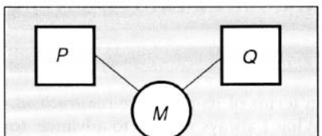

**图 1.** 共享存储模型

为了消除主动/被动的区别，我们将把 $M$ 提升到进程的地位；然后我们将程序变量 $x, y, \dots$ 视为程序与存储之间交互通道的名称，如图 2 所示。

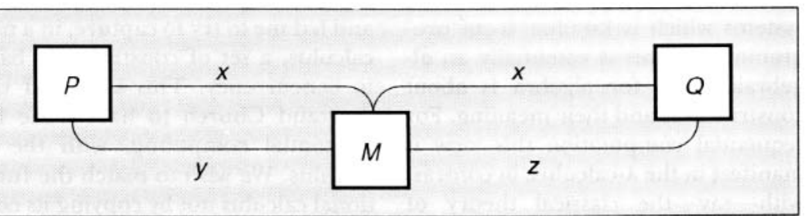

**图 2.** 作为交互进程的存储

现在，更一般地考虑，让我们使用存储来阐明这样一种思想：任何种类的进程都可以组合成更大的进程。

在顺序世界中，人们可以维持“存储是单体”的便利虚构；但在并发编程中，这是非常不现实的，因为存储的不同部分可能会被同时访问。因此，我们更进一步，如图 3 所示，将存储的每个单元视为一个进程（例如 $X$），通过一个适当命名的通道链接到一个或多个程序（它们本身也是进程）。

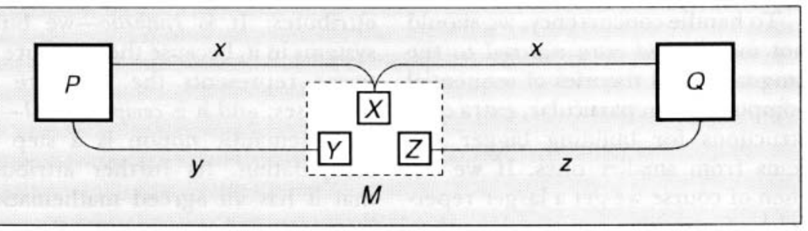

**图 3.** 作为分布式进程的存储

软件工程师很可能会抵制这种同质化处理，并坚定地坚持共享存储模型；这对他们很重要，因为它允许一种有助于编写正确程序的方略。理论家可能会反驳说，在一个基本模型中容忍两种实体，而一种实体就足够了，这是科学上的大忌；他们还可能指出，共享存储模型的主动/被动区别不容易适应混合体，例如一个在你不用它时会自我重组的数据库。而这两种态度都是正确的。

因此，让我们回想一下对许多层面解释的需求。奥卡姆的威廉反对实体的增殖，但仅限于超出需求（*praeter necessitatem*）的情况！计算机系统工程师迫切需要丰富的本体；他们欢迎为不同目的使用不同概念和模型的能力。例如，共享存储模型是他们工具库中自然的一部分。但计算机科学家也必须寻找各种模型背后的基本东西；他们不仅对单个设计和系统感兴趣，而且对它们的成分的统一理论感兴趣。为了在并发的基本模型中实现统一，所有的交互——以及所有的交互者——必须被同等对待；这就是为什么我把这项工作称为“交互的要素”。

为了避免给人留下我所想到的唯一交互者是程序、存储或计算机系统的印象，我在图 4 中展示了一个移动电话网络，其中的通道是无线电通道。通信协议允许汽车切换到最近的基站，整个系统由中央监控和控制。现在，我们希望我们的构造能在离散层面上完美地描述此类系统；交互的要素绝不能仅限于计算机系统。

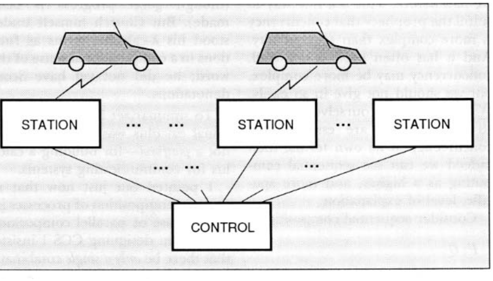

**图 4.** 移动电话网络

我一直在说的很多东西在 20 世纪 60 年代就已经被 Carl-Adam Petri 所理解，他开创了离散并发系统的科学建模。Petri 的工作在并发理论的根基中占有稳固的地位。他宣称，他的网论（theory of nets）应该——在其最低层面上——公正地作为物理世界的模型和计算的模型。对他来说，存储寄存器和程序已经由同一种对象建模——即网——这打破了主动/被动的二分法。网论的概念框架极其精简。这确实在分析单个系统和系统分类方面带来了清晰度和深度。

## 静态构造

除了质疑系统组成实体的“主动/被动”二分法外，并发还要求在其原始构造方面采用一种全新的方法。我一直想推进的，作为 Petri 网论补充的，是从编程中熟悉的系统的合成或组合视图。这本质上是一种代数视图，因为代数是关于构造及其意义的。对于顺序计算，这种视图在 $\lambda$-演算中显而易见，这与——比方说——经典的自动机理论形成了对比。

为了处理并发，我们不应该仅仅在顺序计算的语言和理论中添加额外的内容——特别是用于从较小系统构建较大系统的额外构造。如果我们这样做，那么我们当然会得到比以前更大的原始构造库。这是实现“并发比顺序更复杂”这一预言的好方法。而且这种做法经常发生。嗯，并发可能更复杂，但我们不应该这么轻易屈服。我们应该将自己限制在并发自身术语中必不可少的构造上；然后我们确实可以将顺序计算视为一个更高、更具体的解释层面。

考虑顺序组合：

$$ P ; Q $$

——熟悉的分号，顺序命令式编程的基本粘合剂。为了获得并发，我们是否应该保留顺序组合并仅仅添加并行组合？嗯，我们可能想为编程语言这样做，因为我们必须给程序员提供他们熟悉的工具以及更新的东西。但我们应该在基本演算中这样做吗？我相信不应该；因为当这种构造被正确理解时，顺序组合确实是并行组合的一个特例：

$$ P \mid Q $$

我将其理解为 $P$ 和 $Q$ 并肩行动，以我们设计的任何方式进行交互。因此，顺序组合是只有当 $P$ 结束且 $Q$ 开始时才发生交互的特例。在这里允许一种特殊的交互将违反我们的原则，即在基本模型中，所有交互都是同一种类的。

正是这种平凡的观察阻止了我试图从顺序性中推导，并引导我尝试在一个新的演算中捕捉一组并发的基本构造。这就是我理解中丘奇通过 $\lambda$-演算为顺序计算所做的事情。我们希望通过效仿函数演算的两个属性来与之匹配，而不是复制它的构造：它是合成的（synthetic）——我们在其中构建系统，因为项的结构代表了进程的结构；它是计算的（computational）——它的基本语义概念是计算的一步。它的进一步属性，即它具有公认的数学解释，我们还无法匹配（尽管正在取得良好进展）。但丘奇本人将他的 $\lambda$-演算项理解为计算意义上的函数；他当时还没有 Scott 的指称。

总结一下：对我来说，函数演算是一个范式——但不是平台——用于构建通信系统演算。

我刚才指出，进程的顺序组合是并行组合的一个特例。事实上，在设计 CCS 时，我坚持只使用单一的组合算子来组合交互或共存的进程。这似乎是一个很高的要求，因为我还坚持将存储寄存器建模为进程，因此这同一个组合算子必须能够将它们组装成存储，组合使用它们的进程，并将进程与存储结合起来。但一个组合算子确实足够了，这是因为所有的交互确实可以以同样的方式处理。例如，我们可以将图 3 的系统写为：

$$ P \mid M \mid Q \quad \text{其中 } M = X \mid Y \mid Z $$

或者写为：

$$ P \mid X \mid Y \mid Z \mid Q $$

即使程序 $P$ 和 $Q$ 以某种其他方式交互，除了通过存储进行的交互之外，或者当 $X, Y$ 和 $Z$ 不仅仅是存储寄存器，而是程序与远程存储之间的中介进程时，也将使用完全相同的表达式。表达式的形式与这五个进程的性质无关。

演算的代数性质开始显现，这个单一的组合算子处于其核心。并行组合背后的直觉是，我们只是将系统的组件组装在一起——因此我们期望组合算子满足结合律和交换律。这就是为什么我们的表达式中没有括号。成员的每种不同排序和括号化都将代表系统划分为子系统的不同方式。

我们的代数如何更明确地反映由系统组件之间的链接所诱导的结构？我们首先注意到，图 3 中的组件 $P, Q, X, \dots$ 本身将是进程表达式；此外，通道 $y$ 仅链接成员 $P$ 和 $Y$，因为这些将是通道名 $y$ 出现的唯一表达式。我们在这里不给出像 $Y$ 这样的寄存器的进程表达式；只需说每个这样的表达式都将确定其作为通道名的位置。因此我们可以说，从 $P$ 的视角来看，名称 $y$ 定位了单元 $Y$。现在图 3 非常清晰地展示了这种位置的思想；我们也希望我们的代数能够捕捉到这一思想。为此，我们引入了一个进一步的组合算子，以确保寄存器 $Y$ 仅对 $P$ 可访问——即通道 $y$ 对它们是局部的。我们称这个新算子为限制（restriction）；例如，在表达式中：

$$ \nu y (Y \mid P) $$

通道 $y$ 被限制在 $Y$ 和 $P$ 之间使用。希腊字母 $\nu$ 的使用部分是为了取“new”的谐音；事实上，限制只是编程中局部变量声明概念的提炼。因此，对于图 3 的整个系统，我们可以更准确地写为：

$$ \nu x (X \mid \nu y (Y \mid P) \mid \nu z (Z \mid Q)) \quad (1) $$

这种表达式很好地代表了交互系统的一般空间或静态结构，尽管我们仅针对程序和存储对其进行了说明。像图 3 这样的图表，我们可以称之为流图（flow graphs），是相当形式化的对象。事实上，限制和组合遵循定义流图代数理论的某些方程。

## 动态构造

现在让我们转向此类系统的动态方面：它们的行为。事实上，正是在动态性中，我们可以将 $\lambda$-演算的顺序、层次化控制与 CCS 的并发、异层化（heterarchical）控制进行对比。在 $\lambda$-演算中，所有的计算都归结为一件事，称为归约（reduction）——将参数传递给函数的操作；我们可以称之为 $\lambda$-演算的行为原子。以同样的方式，一次交互——进程之间单个数据的传递——是 CCS 的行为原子。我们现在将看到这如何允许伙伴之间的对称性，以及它如何反映社区中每个进程具有持久身份的思想。

我们将根据每个演算的基本计算规则来看待这种对比。在每个演算中，系统都是使用二元组合算子构建的。在 $\lambda$-演算中，组合算子称为应用（application），它既不满足交换律也不满足结合律。当一个项 $M$ 应用于另一个项 $N$ 时：

$$ M(N) $$

那么第一个项 $M$——算子（operator）——掌握着控制权。算子致力于接收 $N$，即操作数（operand）；如果且当算子采取抽象 $\lambda x.M[x]$ 的形式时（其中方括号表示 $M$ 可能包含绑定变量 $x$），那么符号 $\lambda$ 代表算子的控制中心，并且将发生以下归约：

$$ (\lambda x.M[x])(N) \to M[N] $$

（其中右侧的括号表示 $N$ 已替换 $M$ 中的 $x$）。这是 $\lambda$-演算的基本计算规则，函数应用的动态过程；对于许多人来说，它作为 Algol60 的副本规则（copy rule）更为熟悉，该规则就是从中衍生出来的。图 5 形象地展示了这一操作；请注意，操作数 $N$ 由一个圆形表示，在归约中是一个被动数据——只有在 $M$ 允许的情况下，它稍后才会作为算子承担控制权。

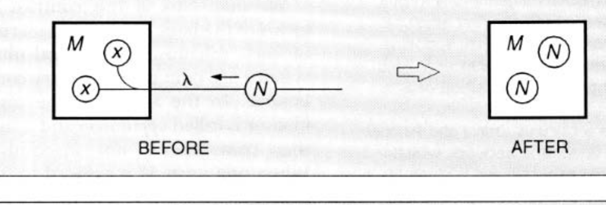

**图 5.** λ-演算归约

另一方面，在 CCS 中，当两个项 $P$ 和 $Q$ 并行组合时：

$$ P \mid Q $$

那么两者都掌握着控制权。$P$ 可能从 $Q$ 接收消息，就像 $Q$ 可能从 $P$ 接收消息一样。一个项可以采取两种所谓的动作（actions），使其能够与另一个项交互。当一个伙伴采取输入形式 $\lambda x.P[x]$ 而另一个采取输出形式 $\bar{\lambda}V.Q$ 时，我们就有了组合：

$$ \lambda x.P[x] \mid \bar{\lambda}V.Q $$

其中伙伴们拥有可以被称为互补控制中心 $\lambda$ 和 $\bar{\lambda}$ 的东西——即名为 $\lambda$ 的通道的正端和负端。那么可能会发生以下交互：

$$ \lambda x.P[x] \mid \bar{\lambda}V.Q \to P[V] \mid Q $$

这是伙伴动作的同步。

但至关重要的是，在并发中存在许多通道，而不仅仅是一个；因此，代表 $\lambda$-演算中单一控制中心的符号 $\lambda$，现在变成了许多通道中的一个，可能并发活跃。CCS 对此类通道使用简单的名称 $a, b, c, \dots$。因此，我们得出了 CCS 的基本计算规则，如图 6 所示。计算仅由这一单一规则的迭代组成，不断转换表达式；在任何阶段，表达式的结构都代表系统的空间配置。图 6 中的图表显示了动态行为——被动数据的传递——叠加在代表空间配置的流图上。

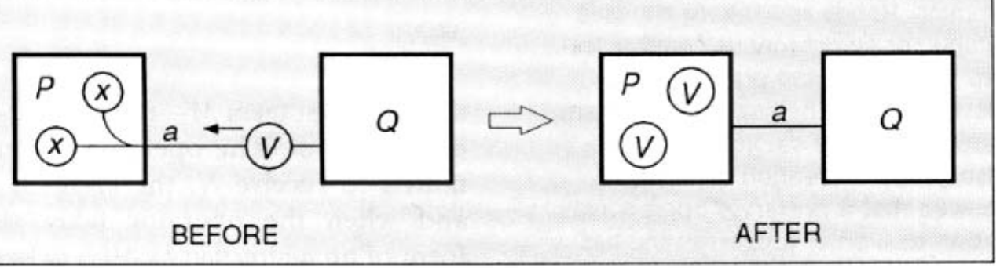

**图 6.** CCS 交互

让我们更仔细地看看这里的区别。首先，在 $\lambda$-演算的情况下，第二个伙伴仅仅是被动数据，但在 CCS 的情况下，它交出其数据 $V$ 并继续独立存在。正是这一点允许并发进程之间持续的交互，每个进程都保留其身份。

其次，并行组合是满足交换律的；$P \mid Q$ 与 $Q \mid P$ 意义相同。在 CCS 中，与 $\lambda$-演算相反，任何一方都可以充当接收者——而且该伙伴稍后确实可以成为发送者。

第三，并行组合也满足结合律；结合交换律，这使交互纪律从项结构中解放出来，而项结构在 $\lambda$-演算中代表层次化控制。正如我们在程序-存储交互的例子中看到的，控制纪律现在由哪些通道 $a, b, \dots$ 链接哪些进程来确定。

这些细节有些技术性。但焦点在于：并发计算与顺序计算之间的区别可以集中在各自演算的单一基本计算规则中。通过修改 $\lambda$-演算中的归约概念，我们获得了一条并发进程的交互规则，这是我们在函数模型的纯粹性与真实并发系统的动态性之间进行合成的第一阶段。

同步交互作为编程原语的思想在我在代数形式中表达它之前就已经被 Tony Hoare 所知。这些步骤是独立采取的，动机不同，这一事实证明了这一思想是自然的。Hoare 将这一思想纳入了他的编程语言 CSP〔译注4〕中，后来与同事们围绕它开发了一套理论。它为 Ada 的会合（rendezvous）机制提供了基础，并成为编程语言 Occam 中的交互原子。我的贡献是将交互作为代数演算的基石。20 世纪 80 年代开发的进程代数，如 CCS、CSP 和 Bergstra 与 Klop 的 ACP，一直是许多语义研究的主题。它们也已经成为或成长为活跃使用的设计工具；特别是规范语言 Lotos 已被广泛应用于通信协议。

## 意义

我想消除一种恐惧，即并发——至少以我处理它的方式——是极度具体和机械的。难道在这一切之下没有抽象的数学事物吗？我们难道不应该保留“进程”这个术语来称呼它们——而不是把我们的代数表达式冠以这个名字吗？毕竟，我们已经习惯于在抽象意义上使用“函数”这个术语，因此当我们指向 $\lambda$-演算中的一个表达式并说“那个函数”时，人们通常理解我们的意思是“该表达式所表示的数学函数”。如果一个表达式没有公认的指称，我们可能会感到不舒服。

进程语义学有着大量且不断增长的文献。它并不简单；但已经取得了一些令人兴奋的进展。我早些时候谈到了 Scott 域在并发程序中的可能用途，事实上，人们为进程代数研究了各种有趣的域。关于由进程的可观察行为确定的进程意义，也有很多研究。其思想是：观察一个进程正是与其交互，而两个系统——比如 CCS 中的两个进程项——应该具有相同的指称，当且仅当通过观察无法区分它们。这项研究主要致力于对可以做出的更强和更弱的可观察区分进行分类，并为每种情况提供数学刻画（如互模拟〔译注5〕）。已经取得了很大成就；还有很多工作要做。

到目前为止，这些关于观察的评论同样适用于顺序进程；但是——正如预期的那样——并发提出了其自身特有的问题。一个重要的课题是因果独立性（causal independence）的概念，它是 Petri 网论的核心。现在，两个进程——每个都有并发组件——对外在观察者来说可能是不可区分的，但在其观察到的动作之间的因果关系上却有所不同。我可能观察到你从树上掉下来，然后观察到救护车到达，但我仍然不知道是否是一个导致了另一个。因此，观察语义忽略了因果关系。但也有充分的理由支持尊重因果连接的语义模型——例如 Nielsen 等人的事件结构（event structures）。这个话题太复杂，无法在这里讨论；我提到它只是为了说明并发确实提出了新的语义问题。

无论研究何种数学模型，我相信进程演算都为研究提供了必不可少的视角。许多人只有当并发系统的语义理论——最终——既成为一种形式理论又成为一种抽象理论时才会感到满意。但为了实现这一目标，我们必须首先提炼交互动态性的本质；这就是像 CCS 这样的形式化进程演算试图做的事情。

## 值

我们现在开始在函数范式与交互现实之间进行合成的第二阶段。这一次，我关注的是使并发演算在其自身概念框架内具有完全的表达能力。首先，我需要解释 $\lambda$-演算在这方面是如何成功的，而 CCS 和类似的并发演算则有所欠缺。稍后我们将找到补救办法。

通常人们非正式地使用 $\lambda$-演算，仅仅是为了在熟悉的数据上推导出新的算子。在讨论算术时，他们会写：

$$ f = \lambda x (x^2 + 1) $$

或者：

$$ F = \lambda f \lambda x (f(x) + 1) $$

——也就是说，他们将 $\lambda$-演算的构造与算术的构造混合在一起，不希望将一个编码到另一个中。这样处理，$\lambda$-演算就像是一些计算脚手架，真正的工人在上面爬上爬下：数据（如数字）和算子（如平方、加法或微分）。

这种 $\lambda$-演算的辅助用途非常自然，但在函数框架内很难构成一个自包含的计算模型。每当我们添加新类型的数据结构——如数组、列表、树——我们实际上是在扩展演算。但对于理解编程语言来说，重要的是我们用来解释它们的基本模型应该尽可能同质和完整，不需要临时扩展。

非常显著的是，$\lambda$-演算确实实现了这种同质性和完整性。在其纯粹形式下，它确实具有表示数据结构并对其进行计算的全部能力；我们可以仅凭脚手架完成一切。丘奇在算术方面证明了这一点；Böhm 和其他人将其扩展到了其他形式的数据结构。此外，还存在类型纪律——特别是 Girard-Reynolds 二阶 $\lambda$-演算——它允许以受控的方式完成这项工作，为分析顺序编程语言及其各自的类型纪律构建了一个统一的框架。

现在，并发又如何呢？大多数并发形式化也提供了一种不同种类的脚手架，值和算子可以在上面移动；这些值和算子与脚手架本身截然不同。再看看 CCS（图 6）；在那次交互中，数据 $V$ 实际上是一个代表像数字之类事物的表达式——与进程表达式 $P$ 是完全不同种类的动物。

为了强调这一点，图 7 显示了一个进程 `Double` 的 CCS 定义，它重复地沿 $a$ 通道输入一个数字，并沿 $b$ 通道输出该数字的两倍：

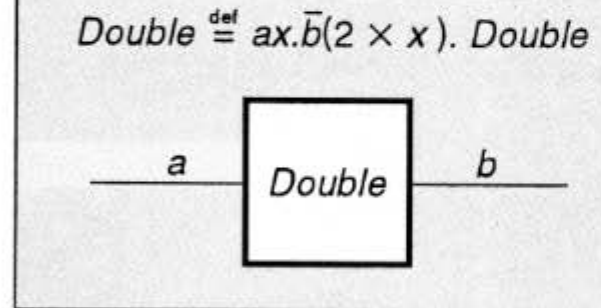

**图 7.** CCS 中的倍增进程 Double

$$ \text{Double} \stackrel{def}{=} ax.\bar{b}(2 \times x). \text{Double} $$
看这个简短的定义，它包含了不少于五种不同的事物：进程（例如 `Double`）、通道（$a, b$）、变量（$x$）、算子（$\times$）和值表达式（$2 \times x$）。而其中四种（除了算子之外的所有）已经出现在 CCS 的基本计算规则中——见图 6。这种混杂难道不是过分的吗？

嗯，这在高级编程语言或规范语言（如 Lotos）中是完全可以接受的，用户期望一个丰富且冗余的工具箱。但对于一个真正的基本演算来说，情况就不那么令人舒适了。基本演算应该尽可能少地施加分类，因为不同的更高层面的解释将施加不同的分类。

现在，纯 $\lambda$-演算仅由两种事物构建：项和变量。我们能否为进程演算实现同样的经济性？Carl Hewitt 凭借他的参与者（Actors）模型，很久以前就回应了这一挑战；他宣称，一个值、一个作用于值的算子和一个进程都应该是同一种事物：一个参与者。这一目标给我留下了深刻印象，因为它暗示了我们讨论过的表达的同质性和完整性。但过了很久，我才明白如何根据代数演算来实现这一目标。我知道 CCS 有所欠缺；但我希望，找到剩下的路会带来洞察。

## 命名

最近，在 Engberg 和 Nielsen 的重要见解基础上，我的同事 Joachim Parrow、David Walker 和我发现了一个演算，它具有与纯 $\lambda$-演算相同的内部完整性。它也很简洁；在代数进程演算的传统中，很难看出它如何能被进一步简化。我们称之为 $\pi$-演算（$\pi$-calculus）〔译注6〕，其核心思想是命名（naming）或引用（reference）。（也许我们不应该感到惊讶，我们通过赋予命名更大的权重来实现更完整的表达；因为系统中的并发活动蕴含了其组件的独立身份，而利用这种身份需要一种识别手段。）

命名虽然在某些模型（如函数模型）中隐藏得很好，但在实际计算中无处不在。想想它所有的变体。本质上，它就是提供访问……嗯，任何事物的手段；但我们倾向于在不同语境下对变量、地址、位置、指针、通道有不同的看法——实际上是因为它们提供了对不同事物的访问。在编程语言中，无论古今，其多样性都是惊人的：Algol60 的变量、Pascal 的指针、Ada 或 Occam 的通道、逻辑编程的逻辑变量、面向对象编程的对象引用，等等。因此，本着 Hewitt 的精神，我们的第一步是要求所有由项表示或通过名称访问的事物——值、寄存器、算子、进程、对象——都是同一种事物：它们都应该是进程。此后，我们将“按名访问”视为计算的原始材料；然后我们要做的就是定义进程——它们本身是可访问的——操纵访问的手段。

为了领略这一激进变化的滋味，再看看 CCS 计算规则，图 6。在那张图中，$a, x$ 和 $V$ 是不同种类的：一个通道、一个变量、一个值。在 $\pi$-演算中，通道和变量都将只是名称，而像 $V$ 这样的值将是一个由名称定位的进程。核心直觉是：一个值只是一种特殊类型的进程，它可以重复地成为同一观察的对象。因此，表达式 $V$ 现在确实将与任何其他进程表达式属于同一类——为了观察它，必须有一个交互通道。因此，值 $V$ 将由一个名称（比如 $v$）定位，就像存储单元 $X$（见图 3）由名称 $x$ 定位一样。因此在 $\pi$-演算中，计算步骤采取以下形式：

$$ ax.P[x] \mid V \mid \bar{a}v.Q \to P[v] \mid V \mid Q $$

计算步骤形象地展示在图 8 中。在那张图中，每个大写字母代表一个进程，而每个小写字母是一个名称。还要注意，一个名称既可以作为通道被主动使用（如 $a$ 的情况），也可以作为数据被被动提及（如 $x$ 和 $v$ 的情况）。

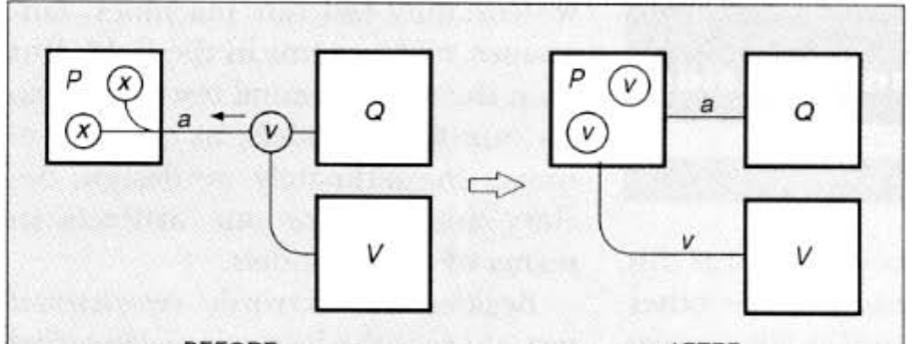

**图 8.** π-演算交互

但在这次交互中，值 $V$ 不再是一个参与者，甚至不是被动的。因此，呈现交互的最简单方式如下：

$$ ax.P[x] \mid \bar{a}v.Q \to P[v] \mid Q $$

这最终是 $\pi$-演算的基本计算规则；它清楚地显示了与 CCS 的关键区别——传递的数据现在“仅仅”是一个名称，一种访问手段。由于名称没有结构，计算步骤是真正的原子性的——这与 $\lambda$-演算形成对比，后者的归约操作数可能是一个复杂的数据。

你可能对这有两种反应。首先，你可能觉得没什么新鲜的；你一直意识到在真实的、脚踏实地的计算中，传递的是指针而不是实际的值。我回答说，如果交互的要素已经从编程中为人所熟知，那么这反而更好——而且，我们也将把它们应用在编程领域之外。

其次，你可能会反对说，所有这些机械事务——指针之类的——都被扫到了地毯下面，并且当我们开始以一种恰当抽象的方式思考计算时，它们本应保持隐藏。我同意，在某种程度上：虽然我们以一种非常抽象的方式思考顺序计算，但在并发方面我们还没有走得那么远。但关键在于：一方面，当我们正视现实时，引用的概念拒绝保持隐藏；另一方面，它似乎抵制理论处理——至少，它得到的处理很少。我相信 $\pi$-演算开始解决这一僵局；它开始为引用提供一种可处理的理论，从而也为并发和交互提供理论。

我将不详细讨论 $\pi$-演算。但为了说明它在经济性上接近 $\lambda$-演算，让我并排展示两个演算的语法（见图 9 和图 10）。

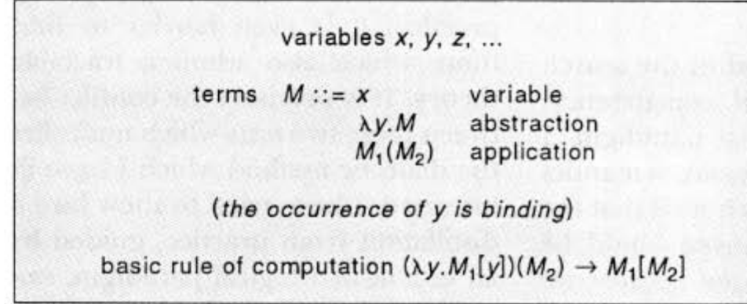

**图 9.** λ-演算

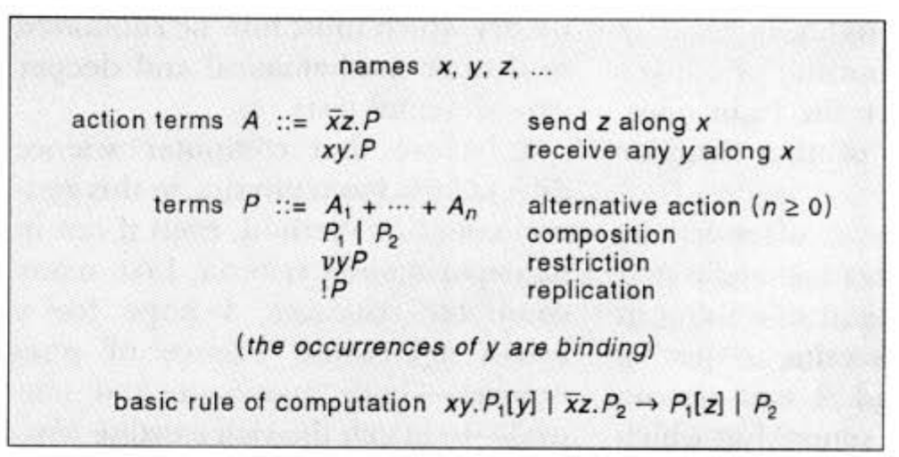

**图 10.** π-演算的一种简单形式

$\pi$-演算的选择动作构造意味着——如在 CSP、CCS 或 Occam 中——恰好会发生一个备选项。复制构造 $!P$ 大致意味着 $P \mid P \mid \dots$，即并行地拥有任意多份 $P$ 的副本。我们已经说明了其他构造。

为了了解该演算如何工作，回想一下图 4 的移动电话网络。我们将汽车与基站之间的通道建模为两个 $\pi$-演算名称——一个用于通话（talk），一个用于切换（switch）；见图 11。该图显示了 `CAR` 进程的定义，以这两个通道为参数：

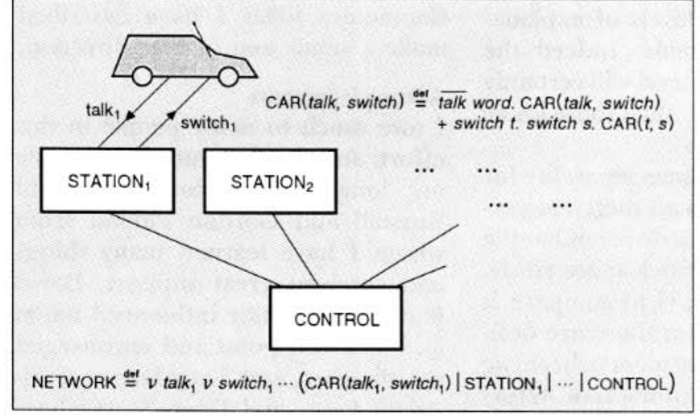

**图 11.** π-演算中的移动电话网络

$$ \text{CAR}(\text{talk}, \text{switch}) \stackrel{def}{=} \text{talk word}. \text{CAR}(\text{talk}, \text{switch}) + \text{switch } t. \text{switch } s. \text{CAR}(t, s) $$

`CAR` 有两个备选动作；它可以通话，或者如果基站请求，它可以切换通道。（`CAR` 在这里是递归定义的，但在 $\pi$-演算中递归可以从复制中导出。）该图还显示了一个定义整个网络的表达式：

$$ \text{NETWORK} \stackrel{def}{=} \nu \text{talk}_1 \nu \text{switch}_1 \dots (\text{CAR}(\text{talk}_1, \text{switch}_1) \mid \text{STATION}_1 \mid \dots \mid \text{CONTROL}) $$
其他组件与 `CAR` 一样容易定义。

在这个例子中，汽车从一个基站到另一个基站的“移动”，与图 10 中建模的值 $V$ 的“移动”没有什么不同。因此，移动并不局限于值；各种进程之间的相互移动都可以以这种方式建模。$\pi$-演算的本质在于它对限制（它建模空间配置，例如图 3 的表达式 (1)）与配置的动态变化之间相互作用的技术管理。

总结一下：有几个理由可以声称 $\pi$-演算具有通用性，即使是这种简单的形式：

* 它直接描述了改变其配置的系统，例如移动电话网络，或具有作业流和资源分配的分布式操作系统。
* 它允许以统一的方式定义数据结构。因此，它支持像 CCS 这样的进程代数作为更高层面的解释。
* 存在一个从 $\lambda$-演算本身到 $\pi$-演算的简单翻译，该翻译忠实于计算行为。因此，它支持函数式编程作为更高层面的解释。
* 它为面向对象编程以及其他编程范式提供了便利的语义底层。
* 它像 $\lambda$-演算一样，易于接受类型纪律；这将允许我们在一个可处理的语义框架中添加那些非常重要的分类。

实际上，这五个属性中的第一个，也是最具体的一个，是我们首先努力实现的：描述移动性或改变配置的能力。这是塑造 $\pi$-演算的目标。令人意外的惊喜是，移动性实际上是关键；一旦这在技术上被掌握，其他属性就被发现无需进一步添加即可存在。

## 结论

我追踪了在顺序范式指导下寻找并发基本模型的一条主线。我敢于谈论语义，是因为我一直希望正确的语义原语能为我们所有人所熟悉——不是因为我们思考它们，而是因为我们自然地根据它们来构思。无论我讨论的原语是否正确，它们肯定具有那种熟悉的性质。

你可能被我持久的还原论所冒犯；我一次又一次地根据另一件事来解释一件事（一个值“仅仅”是一个进程，等等）。我看不到其他方法可以达到既通用又可处理的境界。但让我重复一遍：许多层面的解释是必不可少的。事实上，更高层面的实体肯定比低层面的实体具有更大的多样性。

我声称 $\pi$-演算具有一定的通用性，尽管肯定有一些事情它不能直接处理。它需要更多的研究。一项重要的任务是将其与 Hewitt 的参与者模型进行比较；我们遵循参与者直觉的地方有明确的共识点，也有一些微妙的区别，例如对名称的处理。更一般地，$\pi$-演算是一个形式演算，而参与者模型在精神上更接近物理学的方法，旨在识别支配交互原始概念的规律。

最后，我们如何评估或测试一个计算模型，如进程演算？在重要的意义上，计算机科学确实是一门实验科学，尽管——正如 Alan Newell 和 Herbert Simon 在他们 1975 年的图灵奖演讲〔译注7〕中所指出的——它可能不符合实验方法的狭隘刻板印象，因为我们肯定在现场测试我们的机器、语言和系统。但随后实验测试也间接地作用于我们的基本模型；因为最终我们是根据这些模型来设计、定义和分析我们的制成品的。

除了外在的实验测试，还有内在的数学测试。隔离出真正对计算实践至关重要的思想已经足够困难；找到那些也允许可处理理论的思想就更难了。正是这两个测试之间的冲突构成了我所阐述的辩证法的基础。我试图展示如何从实践中提炼，在既有的逻辑范式指导下，产生一个定义明确的候选理论，该理论现在必须提交给更深层的数学和更深层的实验测试。

我相信计算机科学在这种一般的科学方法上与物理学差别不大，即使在实验标准上有所不同。像许多计算机科学家一样，我希望有一门广泛的信息科学来研究各种现象——无论是人造的还是自然的——以匹配现有的丰富的物理科学。如果我描述的这些基本思想能朝那个方向迈出一小步，我将感到高兴。

## 致谢

在这一努力中，我欠许多人很多，并感谢他们所有人；特别是我的长期同事 Rod Burstall 和 Gordon Plotkin，我从他们那里学到了很多东西并得到了巨大的支持；David Park，他在一个重要时刻对我产生了强烈影响并一直鼓励我；以及 Tony Hoare、Carl-Adam Petri 和 Dana Scott，他们的工作一直是我灵感的源泉。

## 参考文献

1. Abramsky, S. A domain equation for bisimulation. *J. Inf. Comput. 92* (1991), 161-218.
2. Agha, G.A. *Actors: A Model of Concurrent Computation in Distributed Systems*. MIT Press, Cambridge, Mass., 1986.
3. Astesiano, E. and Zucca, E. Parametric channels via label expressions in CCS. *J. Theor. Comput. Sci. 33* (1984), 45-64.
4. Baeten, J.C.M. and Weijland, W.P. *Process Algebra*. Cambridge University Press, Cambridge, Mass., 1990.
5. Barendregt, H.P. *The Lambda Calculus*. North Holland, Amsterdam, 1981.
6. Böhm, C. and Berarducci, A. Automatic synthesis of typed $\lambda$-programs on term algebras. *J. Theor. Comput. Sci. 39* (1985), 135-154.
7. Brinksma, E. On the design of Extended LOTOS, A specification language for open distributed systems. Ph.D. dissertation, Univ. of Twente, 1988.
8. Brookes, S.D., Hoare, C.A.R., and Roscoe, A.W. A theory of communicating sequential processes. *J. ACM 31* (1984), 560-599.
9. Church, A. *The Calculi of Lambda Conversion*. Princeton University Press, Princeton, N.J., 1946.
10. Engberg, U. and Nielsen, M. A calculus of communicating systems with label passing. Rep. DAIMI PB-208, Computer Science Dept., Univ. of Århus, Århus, Denmark, 1986.
11. Girard, J.-Y. The system F of variable types, fifteen years later. *J. Theor. Comput. Sci. 45* (1986), 159-192.
12. Goldberg, A. and Robson, D. *Smalltalk-80: The Language and its Implementation*. Addison-Wesley, Reading, Mass., 1983.
13. Gunter, C.A. and Scott, D.S. Semantic domains. In *Handbook of Theoretical Computer Science*, vol A. Elsevier, New York, 1990, pp. 633-674.
14. Hennessy, M. *Algebraic Theory of Processes*. MIT Press, Cambridge, Mass., 1988.
15. Hewitt, C.E., Bishop, P., and Steiger, R. A universal modular Actor formalism for artificial intelligence. In *Proceedings of the International Joint Conference on Artificial Intelligence*. 1973, pp. 235-245.
16. Hoare, C.A.R. Communicating sequential processes. *Commun. ACM 21* (1978), 666-677.
17. Hoare, C.A.R. *Communicating Sequential Processes*. Prentice-Hall, Englewood Cliffs, N.J., 1985.
18. Honda, K. and Tokoro, M. An object calculus for asynchronous communication. In *Proceedings of the European Conference on Object-Oriented Programming*. Lecture Notes in Computer Science, vol. 512. Springer-Verlag, New York, 1991, pp. 133-147.
19. Kennaway, J.R. and Sleep, M.R. Syntax and informal semantics of DyNe, a parallel language. In *Lecture Notes in Computer Science*, vol. 207. Springer-Verlag, New York, 1985, pp. 222-230.
20. Milner, R. Flow graphs and flow algebras. *ACM 26*, 4 (Oct. 1979), 794-818.
21. Milner, R. *A Calculus of Communicating Systems*. Lecture Notes in Computer Science, vol. 92. Springer-Verlag, New York, 1980.
22. Milner, R. *Communication and Concurrency*. Prentice-Hall, Englewood Cliffs, N.J., 1989.
23. Milner, R. The polyadic $\pi$-calculus: A tutorial. Res. Rep. LFCS-91-180, Lab. for Foundations of Computer Science, Computer Science Dept., Edinburgh Univ., 1991.
24. Milner, R. Functions as processes. Res. Rep. No. 1154, INRIA, Sophia Antipolis, 1990.
25. Milner, R., Parrow, J. and Walker, D. A calculus of mobile processes. Rep. ECS-LFCS-89-85 and -86, Lab. for Foundations of Computer Science, Computer Science Dept., Edinburgh Univ., 1989.
26. Newell, A. and Simon, H.A. Computer science as empirical enquiry: Symbols and search. *Commun. ACM 19* (1976), 113-126.
27. Nielson, F. The typed $\lambda$-calculus with first-class processes. In *Proceedings of PARLE 89*. Lecture Notes in Computer Science, vol. 366. Springer-Verlag, New York, 1989.
28. Nielsen, M., Plotkin, G.D. and Winskel, G. Petri nets, event structures and domains. *J. Theor. Comput. Sci. 13* (1981).
29. Orava, F. and Parrow, J. An algebraic verification of a mobile network. Internal Rep., SICS, Sweden.
30. Park, D.M.R. Concurrency and automata on infinite sequences. In *Lecture Notes in Computer Science*, vol. 104. Springer-Verlag, New York, 1980.
31. Petri, C.A. *Kommunikation mit Automaten*. Schriften des Institutes für Instrumentelle Mathematik, Bonn, 1962.
32. Plotkin, G.D. A powerdomain construction. *SIAM J. Comput. 5* (1976), 452-487.
33. Reisig, W. *Petri Nets*. EATCS Monographs on Theoretical Computer Science, Springer-Verlag, New York, 1983.
34. Reynolds, J.C. Towards a theory of type structure. In *Lecture Notes in Computer Science*, vol. 19. Springer-Verlag, New York, 1974, pp. 408-425.
35. Sangiorgi, D. *Expressing Mobility in Process Algebras: First-Order and Higher-Order Paradigms*. Ph.D. thesis, Univ. of Edinburgh, 1992.
36. Tennent, R.D. *Principles of Programming Languages*. Prentice-Hall, Englewood Cliffs, N.J., 1981.
37. Thomsen, B. *Calculi for higher-order communicating systems*. Ph.D. dissertation, Imperial College, London Univ., 1990.
38. Walker, D.J. $\pi$-calculus semantics of object-oriented programming languages. In *Proceedings of the Conference on Theoretical Aspects of Computer Software (Japan)*. Lecture Notes in Computer Science, vol. 526. Springer-Verlag, New York, 1991, pp. 532-547.

## 关于作者

**罗宾·米尔纳 (ROBIN MILNER)** 是爱丁堡大学计算机科学系的计算理论教授，他已在那里工作了 20 年。在此之前，他在斯坦福大学人工智能实验室进行了两年的研究。1986 年，他成为爱丁堡大学计算机科学基础实验室 (LFCS) 的创始主任。目前，他持有英国科学与工程研究委员会颁发的为期五年的高级研究奖学金。

作者当时地址: Robin Milner, Computer Science Department, University of Edinburgh, Edinburgh, Scotland.

---

## 译注

**文本与翻译说明**

1. 〔译注1〕 **剑桥大学国王学院**（King's College, Cambridge）：米尔纳的母校，他于 1950 年代在此攻读数学并长期担任该学院研究员，此后一直与剑桥渊源深厚。

2. 〔译注2〕 CCS (Calculus of Communicating Systems)：米尔纳于 1980 年提出的并发计算模型，奠定了进程代数的基础。
3. 〔译注3〕 Scott-Strachey 方法：即指称语义（Denotational Semantics），由 Dana Scott 和 Christopher Strachey 在 20 世纪 70 年代创立。
4. 〔译注4〕 CSP (Communicating Sequential Processes)：Tony Hoare 于 1978 年提出的并发模型。米尔纳在文中提到 Hoare 独立发现了同步交互作为编程原语的思想。
5. 〔译注5〕 互模拟 (Bisimulation)：由 David Park 提出并由米尔纳推广的等价关系，用于刻画进程行为的等价性。
6. 〔译注6〕 $\pi$-演算 ($\pi$-calculus)：米尔纳等人在 20 世纪 80 年代末提出的并发演算，允许通道名作为消息传递，从而支持移动性（mobility）。本演讲实际上是 $\pi$-演算的宣言。
7. 〔译注7〕 Newell 和 Simon 的 1975 年图灵奖演讲：即《作为经验探究的计算机科学：符号与搜索》（*Computer Science as Empirical Enquiry: Symbols and Search*），强调了计算机科学的实验科学属性。
8. 〔译注8〕 LCF (Logic for Computable Functions)：米尔纳在 20 世纪 70 年代开发的定理证明系统，是现代交互式定理证明器的先驱。
9. 〔译注9〕 ML 语言：米尔纳为 LCF 设计的元语言 (Meta-Language)，引入了多态类型推断 (Hindley-Milner 类型系统) 和异常处理，对后世函数式语言影响深远。

米尔纳因在 LCF〔译注8〕定理证明系统、ML〔译注9〕编程语言和 CCS 并发理论方面的贡献获得 1991 年图灵奖。本演讲于 1992 年在 ACM 年度会议上发表，后刊于 CACM 1993 年 1 月号。

原文图 1-4 展示了从共享存储到分布式进程的演进，以及移动电话网络的拓扑。图 5-6 对比了 $\lambda$-演算的归约与 CCS 的交互。图 7-11 展示了 $\pi$-演算的语法和应用。这些插图已按原稿提取为 PNG 内嵌于正文相应位置（见译注 14）。

**OCR 与印刷勘误**
11. 扫描件中存在少量 OCR 错误，如 "Pdan Turing" 应为 "Alan Turing"、"kn" 应为 "\n"（在某些代码段中）、"V" 应为 "\\" 等。本译文已根据上下文和视觉校对修正。
12. 参考文献 [31] 原文标题为 "Kommunikation mit Automaten"，德语。
13. 参考文献 [35] 在发表时为 "Forthcoming"，现已补全题目和年份。
14. 原文全部 11 幅插图已从扫描件中提取为 PNG 并内嵌于正文相应位置（见 zh/assets/1991-milner/）：图 1 共享存储模型、图 2 记忆作为交互进程、图 3 记忆作为分布式进程、图 4 移动电话网络（以上在第 4 页右栏，自上而下排列）、图 5 λ-演算归约、图 6 CCS 交互（第 7 页左栏）、图 7 倍增进程 Double、图 8 π-演算交互、图 9 λ-演算语法框、图 10 π-演算语法框、图 11 π-演算中的移动电话网络（第 10 页右栏）。本扫描件整体偏淡、对比度低，提取图形略浅但可辨识。