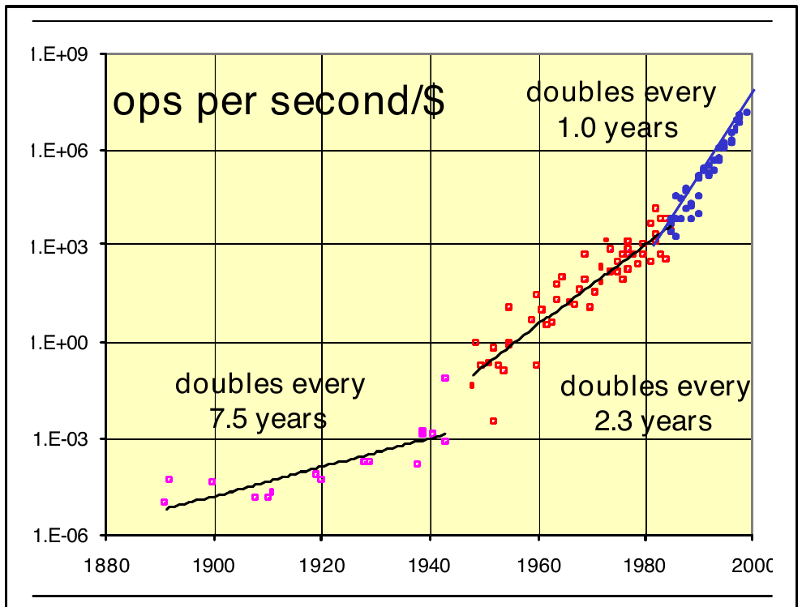
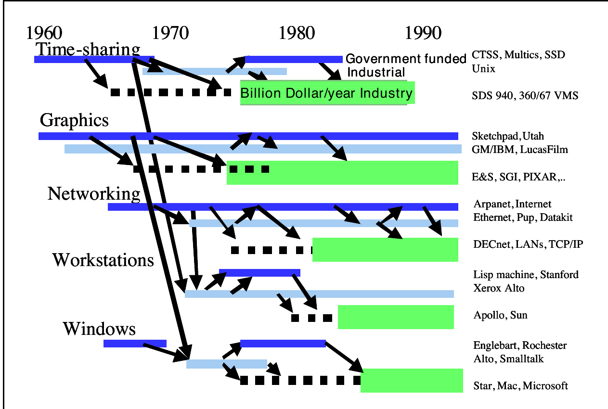
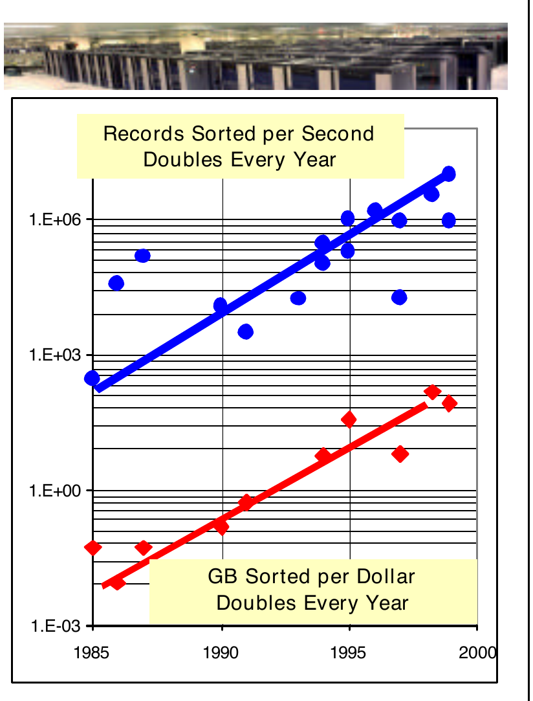

# 下一步是什么：信息技术研究的十二个目标

**What Next? A Dozen Information-Technology Research Goals**

> 作者 吉姆·格雷(Jim Gray)〔译注1〕
> 1998 年 ACM 图灵奖演讲(讲稿整理为微软技术报告 MS-TR-99-50, 1999 年 6 月)〔译注2〕
> 译自 `1283920.2159561.pdf`(个人学习用途)

## 摘要

查尔斯·巴贝奇(Charles Babbage)〔译注3〕对计算的愿景已基本实现。我们正处在实现万尼瓦尔·布什(Vannevar Bush)〔译注4〕的 Memex 的边缘。但是,我们距离通过图灵测试(Turing Test)还有一段距离。这三个愿景及其相关问题为我们中的许多人提供了长期的研究目标。例如,可扩展性(scalability)问题已经激励了我几十年。本次演讲定义了一组基础研究问题,拓宽了 Babbage、Bush 和 Turing〔译注5〕的愿景。它们扩展了 Babbage 的计算目标,将高度安全、高度可用、自动编程、自我管理和自我复制的系统纳入其中。它们扩展了 Bush 的 Memex 愿景,使其包含一个能像人类一样自动组织、索引、消化、评估和总结信息的系统。另一组问题扩展了 Turing 的智能机器愿景,包括视觉、言语、听觉和其他感官的义体。每个问题都陈述简单,且彼此正交,尽管它们共享一些共同的核心技术。

## 1. 引言

本次演讲首先论证了长期研究具有社会效益,既能创造新思想,又能培养出能产生更好思想、并将这些思想转化为产品的人才。教育成分是为什么大部分研究应该在大学环境中进行的原因。这支持了政府对大学长期研究的资助。演讲的第二部分概述了长期信息系统研究目标的示例。

我想首先感谢 ACM 奖项委员会选择我作为 1998 年 ACM 图灵奖获得者。也要感谢 Lucent Technologies 提供的丰厚奖金。

最重要的是,我要感谢我的导师和同事。在过去的 40 年里,我从许多才华横溢的人那里学到了东西。这段时间里我所做的一切都是团队努力的结果。当我想到任何一个项目时,它都是 Mike 和 Jim,或者 Don 和 Jim,或者 Franco 和 Jim,或者 Irv 和 Jim,或者 Andrea 和 Jim,或者 Andreas 和 Jim,Dina 和 Jim,或者 Tom 和 Jim,或者 Robert 和 Jim,以此类推直到今天。在每种情况下,我都很难指出任何我个人做过的事情：一切都是协作的成果。与这些我最亲密的朋友一起工作是一种快乐。

更广泛地说,有一个庞大的社区在致力于解决构建自动化、可靠的数据存储和事务处理系统的问题。我为能成为这项努力的一部分而感到自豪,也为被选中代表整个社区而感到自豪。谢谢大家！

### 1.1. 指数级增长意味着持续的剧变

在过去的 100 年里,指数级增长一直驱动着信息产业。Moore's Law〔译注21〕预测每 18 个月翻一番。这意味着在接下来的 18 个月里,产生的新存储量将相当于以往建造的所有存储量的总和,产生的新处理能力将相当于以往建造的所有处理器的总和。接下来的 18 个月里曲线下的面积等于整个人类历史中曲线下的面积。

1995 年,George Gilder 预测部署的带宽每年将翻三倍,这意味着每 8 个月翻一番。到目前为止,他的预测还是保守的：部署的带宽增长似乎比这还要快！

这种翻番只对底层技术成立,我们领域的科学产出翻番的速度要慢得多。文献每年增长约 15%,每五年翻一番。

指数级增长不可能永远持续下去。大肠杆菌(E. coli,你胃里的细菌)每 20 分钟翻一番。最终会发生某些事情来限制增长。但是,在过去的 100 年里,信息产业通过发明新方法绕过每一个接连出现的障碍,成功维持了这种翻番。事实上,进步似乎正在加速(见图 1)。一些人认为这种加速将持续下去,而另一些人则认为它可能很快停止。当然,如果我们停止创新,它明天就会停止。

这些技术的快速翻番意味着信息技术必须不断重新定义自己：许多十年前极其困难的事情,现在相对容易了。现在的权衡取舍不同了,十年后它们将变得非常不同。

**图 1**：图中绘制了性能/价格随时间的变化,其中
性能 = (每秒操作数) x (每操作位数)
价格 = 3 年的系统价格
性能/价格的提升似乎正在加速。似乎存在三条增长曲线：(1) 在晶体管出现之前(1890-1960),性能/价格每七年翻一番。(2) 随着分立电子元件的出现,在 1955 年到 1985 年间,性能/价格每 2.3 年翻一番。(3) 自 1985 年以来,随着 VLSI 的出现,性能/价格每年翻一番。来源：Hans Moravec, Larry Roberts 和 Gordon Bell [1]。

### 1.3. 网络空间是一个新世界

思考信息技术革命的一种方式是将网络空间(cyberspace)视为一片新大陆,相当于 500 年前发现美洲。网络空间正在用新的商品和服务改变旧世界。它正在改变我们学习、工作和娱乐的方式。它已经是一个每年万亿美元规模的产业,自 1993 年以来创造了万亿美元的财富。经济学家认为,美国经济增长的 30% 来自 IT 产业。这些是高薪、高出口的行业,被归功于长期的繁荣。自这次繁荣开始以来,美国经济已经跳过了两次衰退。

随着这么多资金的涌动,出现了一种圈地式的淘金热心态。有初创公司在圈地,人们非常乐观。总的来说,这是一件非常好的事情。

### 1.4. 这个新世界需要探索者、先驱和定居者

有些人忽视了一个事实,即我们现在正在开发的网络空间领土,大部分是由几十年前的 IT 先驱们首先探索的。那些原型现在正转化为产品。

淘金热心态正导致许多研究科学家致力于近期项目,这些项目可能会让他们致富,而不是采取更长远的眼光。如果所有的探索者都去了初创公司,下一代将从哪里获得原型？如果教职员工为了工业界离开大学,下一代学生将从哪里来？

许多人认为,现在是开始对网络空间进行 Lewis 和 Clark 式探险〔译注7〕的时候了：主要的大学研究工作应探索超前的想法,并培养下一代研究科学家。回想一下,当 Thomas Jefferson 从法国购买路易斯安那领地时,他因这种行为而受到嘲笑。当时,Jefferson 预测这些领地到 2000 年才会被定居。为了加速这一进程,他派出了 Lewis 和 Clark 探险队去探索这些领地。那次探险带回了地图、社会学研究,以及一批带领移民浪潮跨越密西西比河的探索者 [6]。

我们今天也有类似的机遇：我们可以投资于此类探险,为 2020 年的 IT 产业创造智力和人才的种子。政府、工业界和私人慈善机构有责任为我们的孩子进行这项投资,就像我们的父母为我们进行这项投资一样。

### 1.5. 先驱性研究在长期内会有回报

为了明白我的意思,我建议你阅读 NRC 的 Brooks-Sutherland 报告《发展高性能计算与通信计划以支持国家信息基础设施》[2],或者更近期的《资助一场革命》[3]。图 2 基于这两份报告中都出现过的一个图表。

它展示了政府资助和工业界资助的分时系统(Time Sharing)研究如何在十年后变成了一个十亿美元规模的产业。类似的事情也发生在图形学、网络、用户界面和许多其他领域的研究中。顺便提一下,这些研究工作大部分符合 Pasteur's Quadrant〔译注8〕的定义。IT 研究通常关注基础性问题,但其结果对社会产生了巨大的影响和效益。

**图 2**：政府资助的 IT 研究,在五到十年后,许多变成了产品,再过五到十年变成了十亿美元规模的产业。基于 [2]。Internet 和 World-Wide Web 是报告撰写后变成巨大产业的近期例子。

回到我自己的学科,在关系数据库成为产品之前,经历了近十年的研究。其中许多产品在能够兑现其易用性、可靠性和性能承诺之前,需要更多的研究。事实上,针对这些问题的积极研究一直持续到今天,新的研究思想不断注入产品中。与此同时,研究人员继续探索可以搜索海量数据库的并行和分布式数据库系统,并探索可以快速总结数据并发现数据中感兴趣的模式、趋势或异常的数据挖掘技术。这些研究思想现在正创造另一个每年十亿美元规模的产业。

研究思想通常需要十年的孕育期才能转化为产品。由于淘金热,这个时间滞后正在缩短。研究思想在成为产品之前仍然需要时间来成熟和发展。

### 1.6. 长期研究是一种公共物品

如果正在赚取这数十亿资金,政府为什么要资助一个每年万亿美元规模产业的研究呢？毕竟,这些公司很富有且增长迅速,为什么它们不自己做研究呢？

答案是："它们中的大多数都在做。" 领先的 IT 公司(IBM, Intel, Lucent, Hewlett Packard, Microsoft, Sun, Cisco, AOL, Amazon, ...) 将其收入的 5% 到 15% 用于研发(R&D)。其中约 10% 的研发不是产品开发。我猜想其中约 10% (总额的 1%) 是与任何近期产品无关的纯长期研究(研发中的 R 大部分实际上是高级开发,试图改进现有产品)。所以,我猜想 IT 产业在长期研究上的投入超过 5 亿美元,资助了约 2500 名研究人员。这是一个保守的估计,其他人估计这个数字是两到三倍。按照这个保守的衡量标准,工业界长期 IT 研究的规模与美国计算机科学系中终身制教职员工的人数相当。

大多数 IT 产业确实资助长期 IT 研究。但是,为了保持竞争力,一些公司无法做到。MCI-WorldCom 的年度报告中没有研发项目,咨询公司 EDS 也没有。Dell 计算机的研发预算很小。一般来说,服务公司和系统集成商的研发预算非常小。

其中一个原因是,长期研究是一种社会效益,不一定对公司有利。AT&T 发明了晶体管、UNIX 以及 C 和 C++ 语言。Xerox 发明了 Ethernet、位图打印、图标界面和 WYSIWYG 编辑。其他公司如 Intel, Sun, 3Com, HP, Apple 和 Microsoft 从这些研究中获得了主要的商业利益。

社会获得了更好的产品和服务,这就是为什么研究是一种公共物品。既然长期研究是公共物品,就需要以此类方式获得资助：让所有的船只一起升高。这就是为什么资金应该部分来自社会：工业界通过做长期研究在交税。但是,收益是如此巨大,以至于社会可能想要增加投入,并资助大学研究。资助大学研究还有培养下一代研究人员和 IT 工作者的额外好处。我不主张政府资助没有强大教学成分的工业研究实验室或政府实验室。

有人可能会争辩说,美国政府资助长期研究惠及了世界上的每一个人。那么美国为什么要资助长期研究呢？毕竟,这是一种社会效益,而美国不到世界的 10%。如果研究将帮助欧洲人、亚洲人和非洲人,联合国应该资助长期研究。

这里的论点要么是利他的,要么是沙文主义的。利他的论点是,长期研究是对全球子孙后代的投资。沙文主义的论点是,美国领导着 IT 产业。美国工业界极其擅长将研究思想转化为产品,比任何其他国家都强得多。

为了保持 IT 领导地位,美国需要人才(来自大学的学生),也需要新的思想来商业化。但要明确的是,这是一个高度竞争的行业,网络空间是全球性的,工作者是国际化的。如果美国变得自满,IT 领导地位将转移到其他国家。

### 1.7. PITAC 报告及其建议

我对这个话题的大部分看法源于总统信息技术咨询委员会(PITAC)〔译注6〕的一项为期两年的研究 [4]。该报告建议政府赞助 21 世纪的 Lewis 和 Clark 式探险,建议政府将大学 IT 研究经费翻倍,并建议资助机构将重点转向长期研究。通过提供更大规模和更长期的资助,我们希望大学研究人员能够攻克更大、更雄心勃勃的问题。

它还建议我们通过促进技术专家的移民来解决近期的员工问题。国会去年根据该建议采取了行动：为技术专家增加了 115,000 个额外的 H1 签证。整个配额在 6 个月内就用完了：最后一批 99 财年的 H1 签证在 6 月初发放。

## 2. 长期信息技术系统研究目标

在呼吁资助长期研究之后,我们到底在谈论什么？我们心目中的长期研究目标有哪些例子？我提出了十二个长期系统研究项目的例子。其他的图灵奖演讲已经提出了理论计算机科学的研究议程。我的清单是对那些议程的补充。

### 2.1. 什么是好的长期研究目标？

在展示我的清单之前,描述一个好目标的属性是很重要的。一个好的长期目标应该具有五个关键属性：

**易于理解**：目标应该陈述简单。一句话,或者最多一个段落,就足以向聪明人解释清楚这个目标。有一个清晰的陈述有助于招募同事和获得支持。能够告诉你的朋友和家人你到底在做什么也是很棒的。

**具有挑战性**：如何实现目标不应该是显而易见的。事实上,目标通常已经存在了很长时间。我要描述的大多数目标多年来一直是显性或隐性的目标。通常,有一派人认为目标是不可能实现的。

**有用**：如果目标实现了,由此产生的系统应该对许多人显然有用。我指的不只是计算机科学家,我指的是广大民众。

**可测试**：目标的解决方案应该有一个简单的测试,以便人们可以衡量进度,并能判断目标何时实现。

**渐进式**：目标具有中间里程碑是非常理想的,这样可以在过程中衡量进度。这些小步走是让研究人员坚持下去的动力。

### 2.2. 可扩展性：一个目标示例

举一个具体的例子,我的大部分工作都受到了 John Cocke 向我描述的可扩展性目标的启发。目标是设计一种可以无限制扩展的软件和硬件架构。现在,肯定会有某种限制：数十亿美元,或者吉瓦(giga-watts),或者仅仅是空间。所以,更现实的目标是能够从一个节点扩展到一百万个节点,所有节点都致力于解决同一个问题。

1. **可扩展性**：设计一种软件和硬件架构,使其能够扩展 10⁶ 倍。也就是说,一个应用程序的存储和处理能力可以自动增长一百万倍,通过增加更多资源,使任务执行得更快(10⁶ 倍加速)或在相同时间内完成 10⁶ 倍规模的任务(10⁶ 倍扩展)。

攻克可扩展性问题会导致对大型计算机系统各个方面的研究。系统通过增加模块来增长,每个模块执行整体任务的一小部分。随着系统的增长,数据和计算必须迁移到新模块。当一个模块发生故障时,其他模块必须屏蔽此故障并继续提供服务。自动管理、容错和负载分配仍然是具有挑战性的问题。

这种愿景的好处在于它提示了问题和攻击计划。人们可以从研究自动并行化和负载均衡开始。然后研究容错或自动管理。人们可以从研究 10 倍扩展问题开始,同时着眼于更大的问题。

我个人的研究重点是构建高度并行的数据库系统,能够每秒处理数千个事务。我们开发了一个简单的模型来描述事务何时可以并行运行,并展示了如何自动提供这种并行性。这项工作引发了对计算机为何发生故障以及如何提高计算机可用性的研究。

最近,我一直在探索超大型数据库应用,如 TerraServer〔译注9〕和 SDSS〔译注10〕。

回到可扩展性目标,多年来可扩展性工作取得了怎样的成功？进展是惊人的,原因有二。
1. 已经有了很多进展。
2. 其中很大一部分来自一个意想不到的方向：Internet。

Internet 是一个让我们所有人都感到惊讶的世界级计算机系统。一个拥有 1 亿个节点的计算机系统,现在规模每年翻一番。它可能会增长得更大。PITAC 担心我们不知道如何扩展网络和服务器。我也有同样的忧虑,并认为在协议和网络工程方面需要更多的研究。

另一方面,我们确实知道如何构建巨大的服务器。公司已经展示了每天可以处理 10 亿个事务的单一系统。这相当于美国一天内所有的现金交易。这相当于 AOL 一天内所有的交互。这非常多。

此外,这些系统处理一个事务的成本约为一微美元(micro-dollar)。也就是说,它们非常便宜。正是这些廉价的事务允许免费访问 Internet 数据服务器。本质上,访问费用可以通过广告支付。

通过硬件(每年 60% 的改进)和软件(每年 40% 的改进)的结合,性能和价格性能自 1985 年以来每年翻一番。这种进步还能持续好几年(见图 1 和图 3)。

尽管如此,我们还有一些非常肮脏的衣服要洗。计算机科学家尚未使并行编程变得容易。大多数可扩展系统,如数据库、文件服务器和在线事务处理,都是令人尴尬地并行的(embarrassingly parallel)。并行性来自应用程序。我们只是学会了如何保留它,而不是自动创造它。

**图 3**：顶部为 LANL 的 6000 节点计算机照片；底部为数据排序的可扩展性。排序速度和排序性价比在过去 15 年里每年翻一番,这一进步部分归功于硬件,部分归功于软件。

当涉及到在高度并行的计算机上运行大型单体作业时,进展有限。自动提供并行性并更快给出答案的并行数据库系统非常成功。要求程序员显式编写并行程序的并行编程系统仅被视为最后的手段。这方面最好的例子是科学家用来获得非常廉价超级计算机的 Beowulf 集群〔译注11〕,以及由数千个处理器组成的巨大 ASCI 机器〔译注12〕(见图 3 顶部)。这两个群体都报告了惊人的性能,但也报告了相当大的痛苦。

管理这些巨大的集群也是一个严重的问题。为可扩展系统假设的自动化只有一部分得以实现。几乎所有的大型集群都有定制的管理系统。我们稍后会回到这个问题。

可扩展性问题在未来十年将变得更加紧迫。看来新的计算机架构将在单个芯片上拥有多个执行流：因此每个处理器芯片都将是一个 SMP(对称多处理器)。其他人正在追求嵌入在内存、磁盘和网络接口卡中的处理器。另一个趋势是处理器向微机电系统(MEMS)〔译注13〕的转移。每个 10 美元的 MEMS 将拥有传感器、执行器和板载处理能力。对一百万个 MEMS 系统的集合进行编程是一个挑战 [7]。

所以,可扩展性问题仍然是一个有趣的长期目标。但是,在本次演讲中,我想描述更广泛的系统研究目标。

## 2. 长期信息技术系统研究目标

在寻找剩下的十一个长期研究问题时,我阅读了之前的图灵奖演讲,咨询了许多人,并最终决定在三个开创性愿景家的背景下组织这些问题。

在 19 世纪 70 年代,Charles Babbage 提出了可编程计算机的愿景,这种计算机可以存储信息,计算速度比人快得多。在 20 世纪 40 年代,Vannevar Bush 阐述了他对存储人类所有知识的机器的愿景。1950 年,Alan Turing 论证了机器最终将具有智能。

我选择的问题是系统问题。之前的图灵奖演讲在阐述 IT 理论研究议程方面做得非常好。这里的一些问题必然带有"并证明它"的条款。这些问题提出了具有挑战性的理论问题。在选择问题时,我试图避免特定的应用程序,而是试图专注于似乎对所有应用程序都通用的信息技术核心问题。

有一个领域我希望我能多说一点,那就是普适应计算(ubiquitous computing)。Alan Newell 首先阐述了智能宇宙的愿景,在这个宇宙中,我们环境的每个部分都是智能且联网的 [8]。这里提到的许多研究问题都与这个普适计算愿景有关,但我一直无法清晰地陈述一个该领域特有的具体长期研究目标。

## 3. 图灵的机器智能愿景

首先,回想一下 Alan Turing 在 1950 年发表的著名论文《计算机器与智能》[9]。Turing 认为在 50 年内,计算机将具有智能。

这在当时是一个非常激进的想法。当时激烈的辩论在今天很大程度上得到了回响：计算机将是工具,还是将成为具有身份、意志和自由意志的有意识实体？Turing 是一个务实主义者。他只是在寻找智能,而不是试图定义或评估自由意志。他提出了一个测试,现在被称为图灵测试(Turing Test)〔译注12〕,对他来说,这是一个智能的试金石。

### 3.1 图灵测试

图灵测试基于模仿游戏(Imitation Game),由三个人玩。在模仿游戏中,一个男人和一个女人在一个房间里,裁判在另一个房间里。三个人看不见彼此,所以他们通过电子邮件交流。裁判对他们进行五分钟的提问,试图发现两人中谁是男人,谁是女人。这本该非常容易,除非男人撒谎并假装成女人。女人则试图帮助裁判发现真相。如果男人是一个非常好的模仿者,他可能会在 50% 的时间里骗过裁判。在实践中,裁判似乎在 70% 的时间里是正确的。

现在,图灵测试用一台假装成女人的计算机取代了那个男人。如果计算机能在 30% 的时间里骗过裁判,它就通过了图灵测试。

2. **图灵测试**：构建一个至少在 30% 的时间里赢得模仿游戏的计算机系统。

Turing 关于此事的实际文本值得重读。他说的是：
"我相信在大约五十年的时间里,将有可能对存储容量约为 10⁹ 的计算机进行编程,使它们能如此出色地玩模仿游戏,以至于平均提问者在经过五分钟的提问后,做出正确识别的机会不会超过 70%。'机器能思考吗？'这个原始问题,我认为太没有意义了,不值得讨论。尽管如此,我相信在本世纪末,词语的使用和受过教育的普遍观点将发生巨大变化,以至于人们能够谈论机器思考而不会预期遭到反驳。"

从后见之明来看,Turing 的预测读起来非常不错。他的技术预测惊人地准确,尽管略显悲观。典型的计算机拥有所需的容量,并且同样强大。Turing 估计人类记忆在 10¹² 到 10¹⁵ 字节之间,这个估计的高端在今天依然成立。

另一方面,他对机器智能的预测是乐观的。很少有人将计算机描述为智能的。你可以在 Internet 上采访聊天机器人(ChatterBots)〔译注13〕并亲自判断。我认为它们距离通过图灵测试还有很长的路要走。但是,在过去的 50 年里取得了巨大的进步,我预计最终机器确实会通过图灵测试。更具体地说,我认为这将在未来 50 年内发生,因为我被这样一个论点说服了：我们正接近与简单大脑的存储和计算能力持平。

到目前为止,机器智能更多地是与科学家的伙伴关系：一种共生关系。举一些机器智能进步的惊人例子：计算机帮助证明了几个定理(四色问题是最著名的例子 [9]),并解决了一些数学上的开放问题。当 IBM 的 Deep Blue〔译注14〕击败世界象棋冠军时,这是头条新闻。现在计算机几乎帮助设计一切：它们被用于概念化、模拟、制造、测试和评估。

在所有这些角色中,计算机是作为工具和协作伙伴,而不是智能机器。Vernor Vinge〔译注14〕将此称为 IA(智能增强)〔译注15〕,以区别于 AI。这些计算机并没有形成新的概念。它们通常执行静态程序,几乎没有适应或学习。在最好的情况下,存在一个预先建立的结构,其中的参数会自动收敛到该环境的最佳设置。这是适应,但不是像孩子、甚至像蜘蛛那样学习新事物。

尽管取得了这些进步,人们对机器智能和人工智能(AI)普遍持悲观态度。我们仍处于 AI 寒冬。AI 社区承诺了突破,但他们没有兑现。已经有足够多的人在图灵测试上遇到了足够多的麻烦,以至于产生了一个表达：图灵焦油坑(Turing Tar Pit)〔译注16〕,"在那里一切皆有可能,但没有什么是容易的"。AI complete 是"甚至比 NP complete 还要难"的简称。这在一定程度上是对 Turing 最著名贡献的双关语：证明了非常简单的计算机可以计算任何可计算的东西。

矛盾的是,今天研究机器智能要容易得多,因为机器速度快得多,价格也便宜得多。这就是 Turing 使用的"计数论证"。桌面机器应该和蜘蛛或青蛙一样聪明,而超级计算机应该接近人类智能。

论证如下。各种实验和测量表明,人类大脑最多存储 10¹⁴ 字节(100 Terabytes)。神经元和突触结构每秒可以执行约 100 万亿次操作(100 tera-operations)。这比当今最大的计算机强大约三十倍。所以,我们应该随时都能在这些超级计算机中看到智能(开个玩笑)。个人计算机比这慢一百万倍,小一万倍。

这类似于人类基因组约为 10 亿个碱基对的论点。其中 90% 是垃圾,剩余部分的 90% 与黑猩猩共有,而那部分的 90% 与所有人共有。所以每个人只有一百万个独特的碱基对(可以装在一张软盘上)。

这两个论点似乎都是正确的。但两者都表明我们遗漏了一些非常基本的东西。这里发生的事情比我们看到的要多。显然,婴儿之间的差异不止一兆字节。显然,我们为超级计算机准备的软件和数据库并没有走在未来十年通过图灵测试的轨道上。需要一些完全不同的东西。需要跳出框框的激进思考。

我们被交给了两个谜题：基因组和大脑是起作用的。但我们对解决方案毫无头绪。理解答案是一个美妙的长期研究目标。

### 3.2. 另外三个图灵测试：听觉、言语和视觉义体

图灵测试中隐含了两个子挑战,它们本身就相当令人生畏：(1) 像人类一样阅读和理解,(2) 像人类一样思考和写作。这两者似乎都和图灵测试本身一样困难。

有趣的是,还有另外三个问题似乎更容易,但仍然非常困难：

计算机在听取和识别自然语言、音乐和其他声音方面取得了巨大进步。语音转文本系统现在已经非常可用。当然,它们受益于更快、更便宜的计算机,但算法也受益于更深层次的语言理解,使用了词典、良好的自然语言解析器和语义网络。这一领域的进展是稳定的,错误率每年下降约 10%。目前,使用经过训练的说话者和良好的麦克风,无限词汇量的连续语音识别率约为 95%。我开玩笑说计算机理解英语比大多数人好得多(注：大多数人根本不理解英语)。玩笑归玩笑,许多盲人、听力障碍者和残疾人使用语音转文本和文本转语音系统进行阅读、聆听或打字。

在给定准备好的文本的情况下,像人一样说话受到的关注比语音识别问题少,但它是机器与人交流的重要方式。

20 世纪 50 年代在语言翻译方面曾有过重大推动,但这个话题已经失宠。当然,简单的语言翻译系统今天已经存在。一个通过英语图灵测试的系统,很可能具有非常丰富的内部表示。如果教这样的系统第二种语言,比如普通话,那么计算机很可能对该语言中的信息具有类似的内部表示。这开启了语言之间忠实翻译的可能性。可能存在一条通往良好语言翻译的更直接路径,但到目前为止还不明显。 Bablefish〔译注17〕是当前技术水平的一个公平例子。它在英语与法语、德语、意大利语、葡萄牙语和西班牙语之间翻译上下文无关的句子。它将句子 "Please pass the Turing Test" 翻译为 "Veuillez passer l'essai de Turing",后者又被翻译回 "Please pass the test of Turing"。

第三个领域是视觉识别：构建一个能够识别场景中的物体并识别动态物体行为(马在奔跑、人在微笑、身体姿势等)的系统。

视觉渲染是计算机已经超越我们大多数人的领域。同样,这是一种人机共生,但来自 Lucasfilm 和 Pixar 的"特效"和角色令人惊叹。尽管如此,挑战仍然在于如何让孩子和成年人能够轻松地实时创造此类幻觉,以获得乐趣或交流思想。

图灵测试还暗示了记忆义体,但我将把它留到 Bush 的部分。所以三个额外的图灵测试是：

3. **语音转文本**：听力与母语人士一样好。
4. **文本转语音**：说话与母语人士一样好。
5. **像人一样看**：识别物体和行为。

尽管我们目前在这三个领域的进展有限,但它对残疾人和某些工业环境仍然是一种福音。光学字符识别被用于扫描文本,语音合成器大声朗读文本。语音识别系统被聋人用来接听电话,被患有腕管综合征和其他残疾的人用来输入文本和命令。事实上,一些程序员使用语音输入来进行编程。

对于大多数聋人来说,直接耦合到听觉神经的设备可以将声音转换为神经冲动,从而取代耳膜和耳蜗。不幸的是,目前还没有人理解身体使用的编码。但是,这个问题似乎总有一天会得到解决。

从长远来看,这些义体将帮助更广泛的受众。它们将彻底改变计算机与人之间的界面。当计算机能看能听时,与它们交流应该会变得容易得多,且侵入性更小。它们还将帮助我们看得更好、听得更好、记得更好。

我希望你同意这四个测试符合我为好目标设定的标准：它们易于理解、具有挑战性、有用、可测试,并且每个都有渐进的步骤。

## 4. 布什的 Memex

万尼瓦尔·布什(Vannevar Bush)是一位早期的信息技术专家：他在 MIT 建造过模拟计算机。第二次世界大战期间,他领导了科学研究与发展办公室。战争结束时,他为政府写了一篇精彩的文章,名为《科学：无尽的前沿》[13][14],这定义了美国过去五十年的科学政策。

1945 年,Bush 在《大西洋月刊》上发表了一篇具有远见卓识的文章《诚如所思》(As We May Think) [14]。在那篇文章中,他描述了 Memex,一张存储了"十亿本书"、报纸、小册子、期刊和其他文献的桌子,所有这些都通过超链接连接在一起。此外,Bush 提出了一个带有一体化摄像头的眼镜,可以根据需要拍摄事物,以及一个可以记录所说内容的录音机。所有这些信息也被输入到 Memex 中。

Memex 可以通过查找文档或跟随从一个文档到另一个文档的引用来搜索。此外,任何人都可以用链接对文档进行注释,这些带注释的文档可以在用户之间共享。Bush 意识到在 Memex 中查找信息将是一个挑战,因此他假设了"关联搜索",即查找符合某些相似性标准的文档。

Bush 建议机器应该识别语音命令,并且在对着它说话时它能打字。而且,如果这还不够,他随口提到,"通往人类神经系统的直接电路径"可能是一种更有效、更有效的提问和获得答案的方式。

好吧,50 年后,Memex 几乎就在这里了。大多数科学文献都在线。科学文献每 8 年翻一番,过去 15 年的大部分文献都在线。Turing 的大部分工作和 Bush 的文章都在线。大多数文学作品也在线,但受到版权保护,因此在 Web 上不可见。

国会图书馆在线,每天获得的 Web 访问者比常规访问者还多：尽管图书馆只有极小一部分在线。同样,ACM97 会议被录制并转化为一个网站。一个月后,访问该网站的人数是原始会议人数的五倍。18 个月后,10 万人在该网站上总共花费了 5 万小时观看演讲。这比实际参加活动的人数和时间要多得多。该网站现在平均每周有 200 名访客和 100 小时的访问时间。

这一切都很美妙,但任何使用过 Web 的人都意识到它的局限性：(1) 在 Web 上很难找到东西,(2) 你想要的许多东西还没有在 Web 上。尽管如此,Web 还是非常令人印象深刻,并且接近 Bush 的愿景。它是我寻找信息的首选之地。

信息正越来越多地迁移到网络空间的在线环境中。大多数新信息是在线创建的。今天,在磁磁盘上存储 100 封信(1 MB)的成本比在文件柜中存储它们便宜约 50 倍(10 美分对 5 美元)。同样,在线存储照片比打印照片并将其存储在鞋盒中便宜约五倍。每年,网络空间的成本在下降,而现实空间的成本在上升。

信息迁移到网络空间的第二个原因是它可以被机器人搜索。程序可以扫描大型文档集,并找到符合某些谓词的文档。这比人工搜索文档更快、更便宜、更容易且更可靠。这些搜索也可以从任何地方进行——英国的一份文档可以被澳大利亚的人轻松访问。

那么,为什么不是所有东西都在网络空间呢？简单的答案是,大多数信息是宝贵的财产,而目前,网络空间对财产权并不十分尊重。事实上,网络空间文化是所有信息都应该随时随地免费提供给任何人。也许信息可能夹杂着广告,但否则它应该是免费的。结果,Web 上的大多数信息确实是某种形式的广告。

在保护知识产权方面存在重大的技术问题,但真正棘手的问题围绕着法律(例如,鉴于网络空间是跨国的,各方在法律下拥有什么保护？)和商业问题(例如,这种变化的经济影响是什么？)。后两个问题正在阻碍"高价值"内容向 Internet 的迁移,并阻止图书馆提供对其馆藏的 Internet 访问。通常,客户必须来到实体图书馆才能浏览电子资产。

几种保护知识产权副本的技术方案已经摆在桌面上。它们都允许财产所有者按次查看、订阅或按时间付费。它们还允许观众和听众轻松且匿名地使用财产。但是,在法律和商业问题得到解决之前,这些技术方案将收效甚微。

也许会设计出更好的方案来保护知识产权,但与此同时,我们作为科学家必须努力让我们的科学文献在线并免费提供。其中大部分是由纳税人或公司支付的,因此不应被锁定在出版商的版权之后。值得赞扬的是,我们的技术学会 ACM 在 Web 出版方面采取了非常进步的观点。你的 ACM 技术文章可以发布在你的网站、你系的网站以及计算机科学在线研究库(CoRR)上。我希望其他学会也能效仿 ACM 的做法。

### 4.1 个人 Memex

回到研究挑战,第六个问题是构建个人 Memex。一个记录你所看到、听到或读到的一切的盒子。当然,它必须带有一些保护措施,以便只有你才能从中获取信息。但它应该根据命令找到相关事件并展示给你。这个 Memex 的关键点在于它不做任何数据分析或总结,它只是返回它所看到和听到的内容。

6. **个人 Memex**：记录一个人所看到和听到的一切,并根据要求快速检索任何项目。

既然它只记录你所看到和听到的内容,个人 Memex 似乎并不违反任何版权问题 [15]。它仍然引发了一些困难的伦理问题。如果你和我进行私人谈话,你的 Memex 有权向他人披露我们的谈话吗？你可以在未经我允许的情况下出售谈话内容吗？但是,如果采取非常保守的方法：仅在获得许可的情况下记录并使一切保持私密,那么 Memex 似乎在法律范围内。但设计者必须在这些隐私问题上保持警惕。

除了视频之外,Memex 在今天似乎是可行的。你读过的一切的个人记录约为 25 GB。记录你听到的一切需要几个 Terabytes。个人 Memex 每年将增长 250 Megabytes (MB) 来保存你读过的东西,每年增长 100 Gigabytes (GB) 来保存你听到的东西。这仅仅是一个现代磁带或 2 个现代磁盘的容量。三年后,它应该是每年一个磁盘或磁带。所以,如果你现在开始记录,你应该能够在余生中坚持使用一两个磁带。

视频 Memex 在今天似乎超出了我们的技术水平,但在几十年后,它可能会变得经济。高视觉质量将是数百倍——每年 80 Terabytes (TB)。那是很大的存储量,一生 8 Petabytes (PB)。它将继续超出大多数个人的承受能力。当然,人们可能想要他们所看到的高清和立体图像。所以,这 8 PB 很容易上升到那个数字的十倍。另一方面,识别物体的技术可能会提供巨大的图像压缩。为了将速率保持在每年 1 TB,我们目前压缩技术能提供的最好结果是每秒约 10 帧电视质量的画面。每十年质量将提高至少 100 倍。捕获、存储、组织和展示这些信息是一个迷人的长期研究目标。

### 4.2 世界 Memex

那么 Bush 关于将所有专业制作的信息放入 Memex 的愿景呢？有趣的是,一本书的文本不到 1 MB,所有书籍和其他印刷文献在 Unicode 中约为 1 PB。大约有 50 万部电影(大多数很短)。如果你用 DVD 质量记录它们,它们总计约为 1 PB。如果你扫描国会图书馆的所有书籍和其他文献,图像将是几个 PB。有 350 万份录音(大多数很短),这又增加了几个 PB。因此,国会图书馆的消费级数字化内容总计为几个 PB。想要保留图像和声音的图书馆员希望在记录和扫描图像时获得 100 倍的保真度,从而得到 1 EB (exabyte)。记录(各地的)所有电视和广播节目每年将增加 100 PB。

Michael Lesk 对"有多少信息？"这个问题做了一个很好的分析。他的结论是,有 10 或 20 EB 的记录信息(不包括个人和监控录像带) [16]。一个有趣的事实是,存储行业在 1999 年交付了 1 EB 的磁盘存储和约 100 EB 的磁带存储。近线(磁带)和在线(磁盘)存储的成本在每 TB 1 万美元到 10 万美元之间。价格下降的速度比摩尔定律还快——存储在十年内可能会便宜一百倍。所以,我们正接近可以非常廉价地记录大部分存在的信息的时候。例如,为你最近的 1 MB 研究报告或全家福照片购买一个终身网络空间墓地地块的成本约为 25 美分。那是今年 10 美分,明年 5 美分,接下来的几年 5 美分,以及 5 美分的保险费。

这引领我们走向何方？如果一切都将在网络空间中,我们如何找到任何东西？任何使用过 Web 搜索引擎的人都知道其中的喜悦和挫折：有时它们很棒,能找到你想要的东西。它们做了一些总结,给出了标题和前几句话。但它们很少做真正的分析或总结。

所以,在仅仅返回你所看到的、未经消化的内容的个人 Memex 之后的下一个挑战是,一个能够分析大量语料库并以方便的方式呈现给你的 Memex。Raj Reddy 描述了一个系统,它可以阅读教科书,然后像(优秀的)大学生一样回答书后的问题 [17]。一个更苛刻的任务是获取一个文本语料库,如 Internet、计算机科学期刊或《大英百科全书》,并能够像该领域的专家一样回答有关它的总结性问题。

一旦我们掌握了文本,下一个显而易见的步骤就是构建一个类似的系统,它可以消化声音库(演讲、谈话、音乐等)。第三个挑战是一个可以吸收和总结图片、电影和其他图像集合的系统。国会图书馆有 1.15 亿件文本和图形物品,史密森尼学会(Smithsonian)〔译注19〕有 1.4 亿件 3D 物品(例如莱特兄弟的飞机)。将这些物品移至网络空间是一个有趣的挑战。可视化人体项目(Visible Human Project)〔译注18〕——两个尸体的毫米级切片版本——让我们感受到了这可能的发展方向。另一个令人兴奋的项目是将列奥纳多·达·芬奇(Leonardo Da Vinci)的一些作品复制到网络空间。

7. **世界 Memex**：构建一个系统,给定一个文本语料库,能够像该领域的专家一样精确且快速地回答有关文本的问题并总结文本。对音乐、图像、艺术和电影做同样的事情。

每种情况下的挑战都是自动解析和组织信息。然后,当有人有问题时,可以用一种结合了语言、手势、图形和表单界面的自然界面来提出问题。系统应该以适合用户水平的答案做出回应。

这是一项艰巨的任务。它可能是 AI Complete 的,但它是一个极好的目标,可能比一台玩模仿游戏玩得和人一样好的计算机更简单、更有用。

### 4.3 远程临场

能够记录一切的一个有趣方面是其他人可以观察该事件,无论是立即观察还是回顾性观察。我现在经常听在另一个研究机构录制的讲座。有时这些是"直播",但通常是按需播放。这非常方便——事实上,我们中的许多人发现这种时间平移(time-shifting)甚至比空间平移(space-shifting)更有价值。但是,这本质上只是按需电视；或者如果只有音频,只是按需广播——将 Internet 变成了世界上最昂贵的录像机(VCR)。

通过使用计算机和虚拟现实,可以获得更高质量的体验。通过从许多角度高保真地记录一个事件,计算机可以从任何视角高保真地重建任何场景。这允许观众坐在空间中的任何位置,或在空间中漫游。对于体育赛事,观众可以在场上近距离观看比赛。对于商务会议,参与者可以坐在会议中环顾四周,在会议进行时读取面部表情和肢体语言。

挑战在于记录事件,然后根据需要创建一个虚拟环境,允许观察者体验该事件,就像实际在场一样。这被称为远程观察者(Tele-Observer),因为它实际上是面向事件的被动观察者的——要么是因为它是过去的事件,要么是因为观察者太多以至于他们必须是被动的(他们在观看,而不是互动)。电视和广播今天提供了这种体验的低质量版本,但它们是完全被动的。

下一个挑战是允许参与者与事件的其他成员互动,即远程临场(Tele-Present)〔译注20〕。远程临场已经以电话、电话会议和聊天室的形式存在。但是,那里的体验同样比实际在场要低得多。事实上,人们经常长途跋涉只是为了获得更好的体验。远程临场的运行测试是,参加远程临场课程的一组学生的得分与实际在教室里与老师在一起的学生一样好。并且老师与远程临场学生之间的默契与他与实际在场学生之间的默契相同。

8. **远程临场**：作为观察者(远程观察者)回顾性地模拟身处他处：听觉和视觉感受与实际在场一样好,且与参与者一样好；并作为参与者(远程临场)模拟身处他处：与他人和环境互动,就像你实际在那里一样。

人们对允许远程临场的人通过机器人与世界进行物理互动有着浓厚的兴趣。机器人属于电子和机械工程,系统的其余部分属于信息技术。这就是为什么我没有把机器人包括在内。正如 Dave Huffman 所说："计算机科学拥有字节和算法的专利。电子工程拥有电子,物理学拥有能量和物质。"

## 5. 查尔斯·巴贝奇的计算机

Turing 和 Bush 的愿景是令人兴奋的东西：机器智能、记录一切和远程临场。现在是时候考虑传统计算机的长期研究问题了。Charles Babbage (1791-1871) 有两种计算机设计：一种是能很好地进行数值计算的差分机(difference engine),另一种是完全可编程的分析机(analytical engine),它拥有穿孔卡片程序、3 地址指令集和用于保存变量的内存。Babbage 喜欢计算事物,并且总是在寻找趋势和模式。他想要这些机器来帮助他进行计算。

到 1955 年,Babbage 对计算机的愿景已经实现。拥有他所设想的能力的计算机正在生成数字表,进行簿记,并且通常在做计算机所做的事情。当然,关于 Babbage 的愿景还有更多工作要做。我们需要更好的计算算法,以及更好、更快的机器。

但我想专注于 Babbage 计算机的另一个方面。当计算机变得免费、无限快、拥有无限存储空间和无限带宽时会发生什么？现在,这不太可能在短期内发生。但是,自 1950 年以来,计算成本已经便宜了 1000 万倍,自 1899 年以来便宜了 1 万亿倍(见图 1)。事实上,在过去的十年里,它们已经便宜了一千倍。所以,从 1950 年的角度来看,今天的计算机几乎是免费的,并且拥有几乎无限的速度、存储和带宽。

图 1 描绘了自 Babbage 时代以来的变化。它衡量了这些系统的性能/价格。Larry Roberts 提出了一个性能/价格指标：
性能 / 价格 = (每秒操作数 × 每操作位数) / 系统价格

这衡量了每美元处理的位数。1969 年,Roberts 观察到这一指标大约每 18 个月翻一番。这与 Gordon Moore 关于每块硅芯片上门数翻番的观察是同时期的,但是是在系统层面衡量的。利用来自 Hans Moravec 网站的数据,以及 Gordon Bell 的一些修正,我们绘制了从 Herman Hollerith 以来的数据。在 1890 年到 1945 年间,系统要么是机械的,要么是机电的。它们的性能大约每七年翻一番。在 20 世纪 50 年代,计算转向了电子管和晶体管,翻番时间缩短到了 2.3 年。1985 年,微处理器和 VLSI 登场。通过降低系统价格和大幅提高机器速度的结合,翻番时间已缩短至一年。这种性能/价格的加速是惊人的,它改变了规则。类似的图表也适用于存储和带宽的成本。

这是真正的通货紧缩。当处理、存储和传输的成本仅为微美元时,唯一真正的价值就是数据及其组织。但我们计算机科学家还有一些脏衣服要洗：我们"最好"的程序通常每千行代码就有一个 bug,而我们"免费"的计算机每年至少需要一千美元的维护费用,即所谓的系统管理。

今天的计算机所有者支付的费用相对较少。掌上电脑或台式电脑几百美元,工作站几千美元,服务器也许几万美元。这些人不想雇佣庞大的运营人员来管理他们的系统。相反,他们想要一个能够自我管理的自组织系统。对于像手持电脑这样的简单系统,客户只想要系统能工作。始终运行,始终存储数据,并且永不丢失数据。当系统需要维修时,它应该"呼叫总部"并安排修复。要么更换系统通过快递寄达,要么更换模块通过快递寄达——且没有信息丢失。如果是软件或数据问题,软件或数据只需从云端服务器刷新即可。如果你买了一个新家电,你只需插上电源,它就会从云端服务器刷新(就像旧家电发生故障一样)。这是大多数服务器公司在构建信息家电时所致力于的愿景。例如,你可以通过查看 WebTV 或你的 Web 浏览器看到它的原型。

### 5.1. 无故障系统

那么,谁来管理云端服务器呢？服务器系统更加复杂。它们有一些半定制的应用程序,负载重得多,并且通常提供手持设备、家电和桌面设备所依赖的服务。在某种程度上,复杂性并没有消失,它只是转移了。

拥有服务器的人并不介意管理服务器内容,那是他们的业务。但是,他们不想成为系统管理专家。所以,服务器系统应该是自我管理的。人类系统管理员应该设定目标、策略和预算。系统应该完成剩下的工作。它应该在服务器之间分配工作。当新模块到达时,它们插上电源就应该直接加入集群。当一台服务器发生故障时,它的存储应该已经复制到了其他地方,因此存储和计算可以迁移到那些新位置。当某些硬件损坏时,系统应该自我诊断并订购通过特快专递寄达的更换模块。硬件和软件升级应该是自动的。

这提出了 Babbage 目标中的第一个：无故障系统。

9. **无故障系统**：构建一个每天被数百万人使用,却由一个兼职人员管理和维护的系统。

对此的运行测试是,它每天为数百万人提供服务,却由不到一个人的精力来管理,完成所有的管理任务。目前,这样的系统需要庞大的团队进行 24 小时覆盖。升级、维护、系统增长、数据库管理、备份、网络管理等都需要专门的专业知识。

### 5.2. 可靠系统

隐藏在先前要求中的两个问题值得特别关注。最近出现了一系列安全问题：Melissa、Chernobyl〔译注22〕,以及现在对 RSA〔译注23〕的数学攻击,使得 512 位密钥看起来危险地小。如果这种趋势持续下去,我们无法将资产托付给网络空间。系统设计者的一个主要挑战是开发一个仅为授权用途提供服务的系统。服务不能被拒绝。攻击者不能破坏数据,也不能强迫系统拒绝为授权用途提供服务。此外,除非获得授权,否则用户无法看到数据。

这里的额外难点在于,大多数系统是通过窃取密码并作为授权用户进入而被渗透的。任何基于密码或其他令牌的身份验证似乎都太不安全了。我相信我们将不得不采用生理特征手段,如视网膜扫描或其他不可伪造的身份验证器——并且所有软件必须以不可伪造的方式签名。

这一研究目标的运行测试是,一支"老虎队"(tiger team)无法渗透该系统。不幸的是,该测试并不能真正证明安全性。所以这是安全系统必须建立在证明其安全、且所有威胁已知并已防范的基础上的例子之一。

第二个属性是系统应该始终可用。我们已经从 20 世纪 50 年代的 90% 可用性提高到今天管理良好的系统的 99.99% 可用性。由于 Web 及其协议的脆弱性,以及当前对上市时间的强调,Web 用户体验到的可用性约为 99%。尽管如此,我们在 45 年里增加了三个 9,或者说可用性每提高一个数量级大约需要 15 年。我们应该以再增加五个 9 为目标：预期一个世纪内停机一秒钟。这是一个极端的目标,但如果硬件非常便宜且带宽非常高,它似乎是可以实现的。人们可以在许多地方复制服务,使用事务来管理数据一致性,使用设计多样性来避免共模故障,并在节点发生故障时快速修复。同样,这不是你可以测试的东西：因此实现这一目标将需要仔细的分析和证明。

10. **安全系统**：确保问题 9 中的系统仅为授权用户提供服务,服务不能被未经授权的用户拒绝,且信息不能被窃取(并证明它)。
11. **始终运行(AlwaysUp)**：确保系统在一百年内的不可用时间少于一秒——即 8 个 9 的可用性(并证明它)。

### 5.3. 自动编程

这引领我们走向最后一个问题：软件编写成本昂贵。它是网络空间中唯一变得越来越贵、且越来越不可靠的东西。单个软件并不是真的越来越不可靠,只是典型的程序在经过反复测试后,每千行代码仍有一个 bug。典型的软件产品增长迅速,因此在增长过程中会增加 bug。

你可能会问,程序怎么会这么贵？很简单：设计、创建和记录一个程序每行成本约为 20 美元。测试代码的成本约为该成本的 150%。然后一旦代码交付,在其生命周期内支持和维护代码的成本又是这么多。这是严峻的消息。随着计算机变得越来越便宜,程序会越来越多,这种负担会越来越重。

目前的解决方案是通过转向高级非过程化语言来减少代码行数。已经取得了一些巨大的成功。来自 SAP、PeopleSoft〔译注24〕等公司的代码重用为构建半定制应用程序的大型公司节省了巨额资金。这些公司仍然编写大量代码,但只是他们原本要编写的代码的一小部分。许多数据库应用和 Web 应用的用户编写代码极少。这些领域的工具非常令人印象深刻。通常它们基于像 JavaScript 这样的脚本语言和一组预构建的对象。这又是软件重用的一个例子。最终用户能够使用这些工具创建令人印象深刻的网站和应用程序。

如果你的问题符合这些预构建范式之一,那么你很幸运。如果不是,你就得回到用 C++ 或 Java 编程,每天产出 5 到 50 行代码,每行代码成本 100 美元。

那么,解决方案是什么？我们如何突破这个僵局？自动编程在过去的 45 年里一直是编程语言和系统的圣杯。遗憾的是,进展相对较小——也许提高了 10 倍,但肯定没有提高 1000 倍的生产率,除非你的问题符合前面提到的应用程序生成器范式。

也许循序渐进的软件工程方法最终会取得成果,但我持悲观态度。我相信需要一种全新的方法。也许现在还太早,因为这是一个图灵焦油坑。我相信我们必须 (1) 拥有一种比当前语言容易一千倍且强大一千倍的高级规范语言,(2) 计算机应该能够编译该语言,以及 (3) 该语言应该足够强大,以便可以描述所有应用程序。

我们今天的系统可以做到这三点中的任意两点,但没有一个能做到全部三点。本质上,这是针对编程团队的模仿游戏。客户来到编程团队面前描述应用程序。团队带着建议的设计回来。经过讨论,构建了一个原型,然后进行更多讨论。最终,构建了所需的应用程序。

12. **自动程序员**：设计一种规范语言或用户界面,能够：
    (a) 使人们表达设计变得容易(容易 1000 倍),
    (b) 计算机可以编译,且
    (c) 可以描述所有应用程序(是完备的)。
    系统应该能够对应用程序进行推理,询问有关异常情况和不完整规范的问题。但它使用起来不应是沉重的负担。

运行测试是用计算机取代编程团队,并产生比典型的与人类团队打交道更好且不需要更多时间的结果。是的,拥有这样的系统还需要一段时间,但如果 Alan Turing 对机器智能的看法是正确的,那只是时间问题。

## 6. 总结

这是十二个非常有趣的研究问题。每一个都是长期研究问题。现在你可以明白为什么我希望政府投资于长期研究。我怀疑在 50 年后,未来的计算机科学家将在这些问题上取得实质性进展。矛盾的是,这十二个问题中有许多(5 个)似乎需要 Alan Turing 所设想的机器智能。

这些问题分为三大类：Turing 的智能机器改善人机界面；Bush 的 Memex 记录、分析和总结发生的一切；以及 Babbage 的计算机最终将变得文明,从而能够自我编程、永不失效且安全。

无论结果如何,我确信这将是非常令人兴奋的。正如我在开头所说,进步似乎正在加速：如果摩尔定律成立,未来 18 个月的基础技术进步将等于之前所有的进步。在那之后还会有更多的翻番。

### 信息技术研究的十二个长期目标

1. **可扩展性**：设计一种软件和硬件架构,使其能够扩展 10⁶ 倍。也就是说,一个应用程序的存储 and 处理能力可以自动增长一百万倍,通过增加更多资源,使任务执行得更快(10⁶ 倍加速)或在相同时间内完成 10⁶ 倍规模的任务(10⁶ 倍扩展)。
2. **图灵测试**：构建一个至少在 30% 的时间里赢得模仿游戏的计算机系统。
3. **语音转文本**：听力与母语人士一样好。
4. **文本转语音**：说话与母语人士一样好。
5. **像人一样看**：识别物体和运动。
6. **个人 Memex**：记录一个人所看到和听到的一切,并根据要求快速检索任何项目。
7. **世界 Memex**：构建一个系统,给定一个文本语料库,能够像该领域的专家一样精确且快速地回答有关文本的问题并总结文本。对音乐、图像、艺术和电影做同样的事情。
8. **远程临场**：作为观察者(远程观察者)回顾性地模拟身处他处：听觉和视觉感受与实际在场一样好,且与参与者一样好；并作为参与者(远程临场)模拟身处他处：与他人和环境互动,就像你实际在那里一样。
9. **无故障系统**：构建一个每天被数百万人使用,却由一个兼职人员管理和维护的系统。
10. **安全系统**：确保问题 9 中的系统仅为授权用户提供服务,服务不能被未经授权的用户拒绝,且信息不能被窃取(并证明它)。
11. **始终运行(AlwaysUp)**：确保系统在一百年内的不可用时间少于一秒——即 8 个 9 的可用性(并证明它)。
12. **自动程序员**：设计一种规范语言或用户界面,能够：
    (a) 使人们表达设计变得容易(容易 1000 倍),
    (b) 计算机可以编译,且
    (c) 可以描述所有应用程序(是完备的)。
    系统应该能够对应用程序进行推理,询问有关异常情况和不完整规范的问题。但它使用起来不应是沉重的负担。

## 7. 参考文献

1. Graph based on data in Hans P. Moravec *Robot, Mere Machines to Transcendent Mind*, Oxford, 1999, ISBN 0-19-511630-5, (http://www.frc.ri.cmu.edu/~hpm/book98/) personal communication with Larry Roberts who developed the metric in 1969, and personal communication with Gordon Bell who helped analyze the data and corrected some errors.
2. CSTB–NRC, *Evolving the High-Performance Computing and Communications Initiative to Support the Nation’s Information Infrastructure*, National Academy Press, Washington DC, 1995.
3. CSTB–NRC *Funding a Revolution, Government Support for Computing Research*, National Academy Press, Washington DC, 1999. ISBN 0-309-6278-0.
4. *Information Technology Research: Investing in Our Future*, President’s Information Technology Advisory Committee, Report to the President, Feb. 1999. National Coordination Office for Computing, Information, and Communications, Arlington VA.
5. Donald E. Stokes, *Pasteur’s Quadrant: Basic Science and Technological Innovation*, Brookings, 1997, ISBN 0-8157-8178-4.
6. Stephen E. Ambrose, *Undaunted Courage: Meriwether Lewis, Thomas Jefferson, and the Opening of the American West*, Simon & Schuster, NY, 1996, ISBN: 0684811073
7. “From Micro-device to Smart Dust”, *Science News*, 6/26/97, Vol. 152(4), pp 62-63
8. Alan Newell, “Fairy Tales,” appears in R. Kruzweil, *The Age of Intelligent Machines*, MIT Press, 1990, ISBN: 0262610795, pp 420-423
9. Alan M. Turing, “Computing Machinery and Intelligence”, *Mind*, Vol. LIX. 433-460, 1950). Also on the web at many sites. K. Appel and W. Haken, “The solution of the four-color-map problem,” *Scientific American*, Oct 1977, 108-121, http://www.math.gatech.edu/~thomas/FC/fourcolor.html (1995) has a “manual” proof
11. Vernor Vinge, “Technological Singularity.” VISION-21 Symposium sponsored by NASA Lewis Research Center and the Ohio Aerospace Institute, March, 1993. also at http://www.frc.ri.cmu.edu/~hpm/book98/com.ch1/vinge.singularity.html
12. *Endless Frontier: Vannevar Bush, Engineer of the American Century*, G. Pascal Zachary, Free Press, 1997 ISBN: 0-684-82821-9
13. Vannevar Bush, *Science-The Endless Frontier*, Appendix 3, "Report of the Committee on Science and the Public Welfare,” Washington, D.C.: U.S. Government Printing Office, 1945. Reprinted as National Science Foundation Report 1990, online http://rits.stanford.edu/siliconhistory/Bush/Bush_text.html
14. Vannevar Bush ”As We May Think” *The Atlantic Monthly*, July 1945, http://www.theatlantic.com/unbound/flashbks/computer/bushf.htm
15. Anne Wells-Branscomb, *Who Owns Information?: From Privacy to Public Access* Basic Books, 1995, ISBN: 046509144X.
16. Micheal Lesk, “How much information is there in the world?” http://www.lesk.com/mlesk/ksg97/ksg.html
17. Raj Reddy, “To Dream The Possible Dream,” *CACM*, May 1996, Vol. 39, No. 5 pp106-112.

---

## 译注

**文本与翻译说明**

1. 吉姆·格雷(Jim Gray, 1944–2007), 数据库与事务处理领域的先驱,因在数据库研究方面的贡献获 1998 年图灵奖。他提出的 ACID 事务属性是现代数据库系统的基石。2007 年,他在旧金山湾外海独自航行时失踪。
2. 本文基于 Gray 的图灵奖演讲稿整理而成,最初作为微软技术报告 MS-TR-99-50 发表。

**背景与文化注**(译者补注,原文无)

3. 查尔斯·巴贝奇(Charles Babbage, 1791–1871), 英国数学家、发明家,设计了差分机和分析机,被认为是通用计算机的先驱。
4. 万尼瓦尔·布什(Vannevar Bush, 1890–1974), 美国工程师、科学管理者,二战期间领导美国科学研究与发展办公室(OSRD)。他在 1945 年发表的《诚如所思》(As We May Think)中构想了 Memex,被视为超文本和万维网的灵感来源。
5. 艾伦·图灵(Alan Turing, 1912–1954), 英国数学家、逻辑学家,计算机科学与人工智能之父。
6. PITAC: 总统信息技术咨询委员会(President's Information Technology Advisory Committee), 为美国总统提供 IT 政策建议的机构。
7. Lewis 和 Clark 探险队: 1804 年至 1806 年间,受杰斐逊总统派遣探索美国西部新领地的探险队。Gray 此处以此类比对网络空间未知领域的探索。
8. Pasteur's Quadrant: 巴斯德象限,由 Donald Stokes 提出,指代那些既追求基础科学理解又具有明确应用价值的研究。
9. TerraServer: 微软与美国地质调查局(USGS)合作的早期在线卫星地图服务,是 Google Earth 等现代地图服务的先驱。
10. SDSS: 斯隆数字巡天(Sloan Digital Sky Survey), 一个大规模的光学红移巡天项目。
11. Beowulf 集群: 使用普通个人电脑硬件构建的廉价高性能计算集群。
12. ASCI: 加速战略计算倡议(Accelerated Strategic Computing Initiative), 美国能源部旨在通过大规模并行计算模拟核试验的项目。
13. MEMS: 微机电系统(Micro-Electro-Mechanical Systems)。
14. 弗诺·文奇(Vernor Vinge), 美国数学家、计算机科学家、科幻作家,以提出"技术奇点"理论闻名。
15. IA (Intelligence Amplification): 智能增强,强调计算机作为人类智力的辅助工具,而非取代人类。
16. 图灵焦油坑(Turing Tar Pit): 由 Alan Perlis 提出,指代那些功能完备但极难使用的编程语言或系统。
17. Bablefish: 雅虎(Yahoo!)旗下的早期在线翻译服务,得名于《银河系漫游指南》中的巴别鱼。
18. 可视化人体项目(Visible Human Project): 将人体切片并数字化的解剖学研究项目。
19. 史密森尼学会(Smithsonian Institution): 美国的一系列博物馆和研究机构集合。
20. 远程临场(Telepresence): 通过技术手段让用户感觉自己身处另一个地点的技术。
21. 摩尔定律(Moore's Law): 戈登·摩尔提出的观察,即集成电路上可容纳的晶体管数目约每隔两年便会增加一倍。
22. Melissa, Chernobyl: 20 世纪 90 年代末著名的计算机病毒。
23. RSA: 一种非对称加密算法,以其三位发明者 Rivest、Shamir 和 Adleman 的首字母命名。
24. SAP, PeopleSoft: 著名的企业资源规划(ERP)软件供应商。

**OCR 与印刷勘误**

25. 本文译自数字版 PDF,文本提取质量极高。原文中 Figure 1 和 Figure 3 的图题与正文叙述一致。
26. 原文三处插图(第 3 页 Figure 1、第 4 页 Figure 2、第 8 页 Figure 3)已按原版样式从 PDF 渲染提取为 PNG(见 zh/assets/1998-gray/),内嵌于正文相应位置。Figure 3 分两部分：顶部为 LANL 的 6000 节点计算机照片,底部为数据排序性能的可扩展性图表。其中照片为 249×33 像素的小尺寸位图,放大后略显模糊,系原稿本身分辨率所限。
