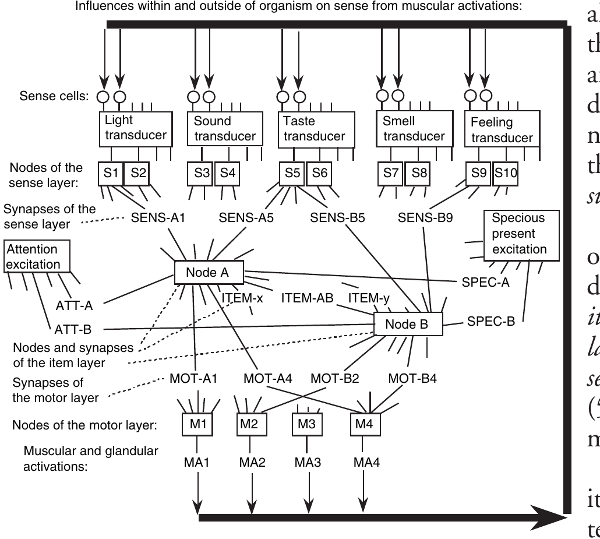
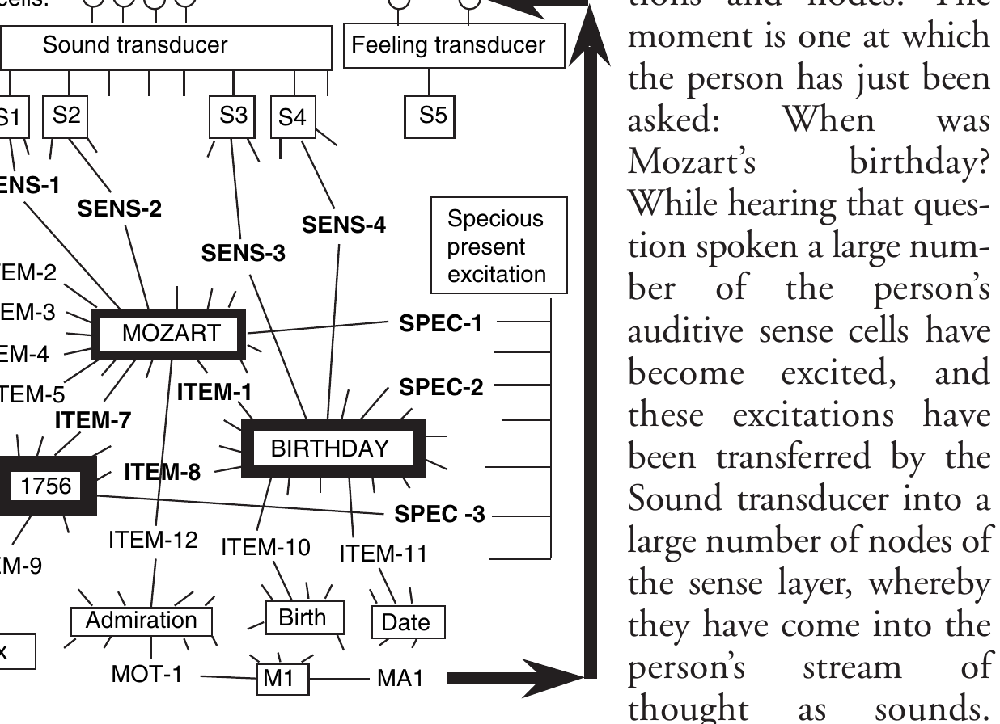

# 计算与人类思维

**Computing Versus Human Thinking**

> 彼得·瑙尔(Peter Naur)
> 2005 年 ACM 图灵奖演讲
> 原载 *Communications of the ACM*, Vol. 50, No. 1 (2007 年 1 月), pp. 85–94
> DOI 10.1145/1188913.1188922
> 译自 `1188913.1188922.pdf`(个人学习用途)

> 在本次演讲中,我将向各位概述我过去五十年来围绕标题所述主题所做的工作。关于这个标题,我请各位特别注意中间那个词——"与……相对"(versus)。这个词指出了我围绕这一主题所做努力的倾向,即阐明"计算"与"人类思维"这两个项之间的反差。我工作的这一倾向在我最新的成果中得到了最终的实现,那是一份对神经系统的描述,证明了该系统与计算机没有任何相似之处。
>
> 讽刺的是,我现在的获奖演讲是以图灵命名的。事实上,我关于计算与人类思维的工作中,有一部分正是对艾伦·图灵的一项著名贡献——他关于所谓"图灵测试"的论述 [56, 31-1986]——的明确批判或拒绝。(附注年份的参考文献指本人的作品。)
>
> 这种对目前被认为已确立的观念的拒绝,一直是我工作的重要组成部分。事实上,我发现目前关于人类思维以及科学与学术活动的许多说法都是错误的,且有害于我们的理解。我意识到,我对其中一些问题的陈述可能会冒犯到各位。对此我深表遗憾,但这无法避免。

## 描述作为科学与学术的核心问题

这种批判和拒绝既有观念的基调,根植于我最早的活动,即五十多年前的起点。早在 1955 年左右我从事天文学工作时,我意识中的一个决定性项就来自伯特兰·罗素(Bertrand Russell)对"因果"作为科学工作核心问题的明确拒绝。正如罗素清晰指出的,天文学家所追求的科学,关注的不是因果,不是逻辑,而是**描述** [53]。

大约就在那时,我进入了计算领域,参与了建立编程语言 Algol 60 [2] 的工作,我看到其中的关键问题在于描述。因此,我对这项工作的主要贡献是开发了一种新的描述形式,延续了约翰·巴克斯(John Backus) [1] 的工作,并将这种形式应用于描述 Algol 委员会采纳的编程语言。这种新的描述形式是对早期版本(即所谓的 Algol 58)所采用的描述形式的间接批判。它最初作为一份工作文件提交给 1960 年 1 月在巴黎举行的 Algol 60 会议 [8-1960]。导致 Algol 60 诞生的讨论后来由 Perlis [51] 和在 [24-1981] 中做了描述。

## 编译器设计

在接下来的几年里,我主要从事 Algol 60 编译器的设计。我的主要贡献是与 Jørn Jensen 共同设计了 Gier Algol 编译器 [9-1963]。这一设计的成功直接建立在这样一个认识上:编译器设计的首要问题不是语法分析,而是存储分配。Gier Algol 编译器有 9 个翻译阶段(pass)。在执行期间,翻译后的程序保存在一个分页系统中。该编译器的一些技术分别在 [10-1965, 12-1965, 15-1966] 中做了描述。

## 编程技术与程序描述

在随后的几年里,我参与了关于计算机编程问题以及将计算建立为一门学术学科的讨论。我建议,这类学科最恰当的名称不是"计算机科学"(computer science),而是"数据学"(datalogy),即对数据和数据过程的研究 [13-1966, 16-1968]〔译注3〕。这一建议被哥本哈根大学采纳,该领域于 1969 年以该名称建立。我在 [20-1974] 中以教科书的形式介绍了这一学科。

在论文 [14-1966]、[18-1969] 和 [22-1976] 中,我提出了旨在增强程序员对其所构建程序理解的编程技术。在 [14-1966] 中,我建议一个主要问题是算法和程序的描述问题,并提议用我所谓的"通用快照"(general snapshots)来补充编程语言的描述,即以陈述的形式描述在程序特定点上相关变量值之间保持的关系。借助此类快照,关于变量值的形式化论证和证明将成为可能,但更重要的是,通用快照作为人类读者的辅助手段是无价的。在 [18-1969] 中,我描述了一种规约——"按动作簇编程"(programming by action clusters),它通过使有关变量的关系在整个程序文本中保持不变,来帮助程序员理解。在 [22-1976] 中,我描述了将程序表述为控制记录的解释器如何能同时增强某些常见类型程序的效率和程序员的理解。

通用快照的一种用途在后来的一项工作中得到了演示,在那项工作中,我将其应用于图灵的通用机 [55, 37-1993]。结果,我在图灵的程序中发现了几个编程错误。

程序开发的问题在 1968 年 10 月的软件工程会议以及该会议的报告中被特别提出,我与 Brian Randell 共同担任了该报告的编辑 [17-1969]〔译注4〕。

在接下来的几年里,讨论特别集中在所谓的"结构化编程"思想和对所谓"程序形式化规范"的要求上。我通过对编程活动以及在数学文献和已发表的程序规范中可以找到的此类形式化进行经验研究(包括对 Algol 60 的形式化描述),参与了这场讨论 [19-1972, 23-1981, 25-1982, 26-1983, 30-1985]。通过这些研究,我成功地证明了关于形式化规范作为人类程序员工具之优势的主张是不合理的。

作为这些研究的一个主要结果,我将编程描述为一种人类活动:**理论构建**(theory building) [27-1985]〔译注5〕。通过这种描述,编程的核心是程序员对所关注事项发展出某种理解。

## 精神生活的描述

我对编程活动的工作直接引导我考虑数学和自然语言的相关方面,从而考虑人类思维的心理学和哲学问题 [11-1965, 21-1975, 34-1989]。

在这种背景下,我有机会审查了一些新发表的关于机器或人工智能以及认知科学等主题的著作,并为《计算评论》(*Computing Reviews*)撰写了相关主题的评论 [28-1985, 29-1985, 32-1988, 33-1989, 38-1993]。

通过这些评论活动,我一次又一次地证实,当今的作者们是基于完全缺陷、混乱的认知主义观念来争论精神生活的,他们使用的术语如"意识"、"知识"、"语言"、"智能"、"概念",没有一个能清晰地指代任何东西;而且,威廉·詹姆斯(William James)在其《心理学原理》[5] 中对人类精神生活的洞察是不为人知的。我逐渐意识到,整个心理学领域——本应关注精神生活——在二十世纪已经完全误入歧途,陷入了一种意识形态立场,即只接受采用受计算机启发的精神生活描述形式的讨论,而任何其他形式,包括威廉·詹姆斯在他的心理学中开发的形式,都被斥为不可接受且不可发表。

为了澄清心理学这种非同寻常的局面,我从 1986 年开始进行了一系列研究。在其中一项研究中,我对图灵关于所谓图灵测试的论文 [56] 进行了彻底的批判性分析 [31-1986],得出的结论是图灵的整个论证都是无效的,根本原因在于图灵是基于一个错误的思维观念进行论证的,即认为思维是某人或某物所做的某事。这一观念与威廉·詹姆斯 [5] 所陈述的心理学第一事实相矛盾,即:思维是正在发生的事情(thinking is something that goes on)。

## 认知

受我反复经历的、与人类认知相关的近期讨论中论证缺陷的影响,我决定对形式化、逻辑和规则在人类思维、语言活动、计算以及科学/学术活动讨论中的意义进行更系统的研究。其成果是两篇论文 [39-1994, 45-2000] 和一本名为《认知与逻辑和规则的迷思》(*Knowing and the Mystique of Logic and Rules*) [42-1995] 的书。

在这本书中,人类认知是作为从经典经验心理学中产生的事物来考察的,并延伸到语言、计算、科学和学术领域。虽然讨论从广泛的范围获取了经验支持,但对逻辑和规则之意义的主张在始终受到挑战。讨论的要点包括:

*   认知是引导人的意识流的习惯或倾向问题;
*   语言规则在语言产生和理解中没有意义,它们是对语言风格的描述;
*   可能为真或为假的陈述进入普通的语言活动,不是作为信息的元素,而仅仅是作为情境的总结,以备行动和反应之需;
*   在计算机编程中,逻辑、证明和形式化描述的意义是次要的,并取决于程序员的个性;
*   对精神活动的计算机建模分析表明,在描述人类认知时,计算机是无关紧要的;
*   在解释学术/科学活动时,逻辑和规则是无能为力的;
*   提出了一个新颖的理论:学术和科学的核心是连贯的描述。

研究的另一个主要结论是,威廉·詹姆斯 [5] 和奥托·耶斯佩森(Otto Jespersen) [6, 7] 的著作优于任何其他关于人类思维和语言活动的说明,而它们却被认知主义心理学家所忽视。

## 科学与学术

在撰写《认知》[42-1995] 一书的同时,我在两篇文章 [35-1990, 41-1995, 英文版 43-1996] 中讨论了计算相对于其他科学和学术领域的位置。在这些文章中,我主张就科学和学术活动而言,计算作为一种描述形式是有意义的,而逻辑或方法的问题则是无关紧要的。

这在对编程活动中形式化描述使用的经验研究中得到了证实 [37-1993]。

科学和学术的其他问题以对计算和人类思维的科学讨论进行意识形态压制的形式强加于我的注意力,不仅在心理学中,而且在近期的计算机文献中也是如此。以下三个事件说明了这种压制。1995 年 11 月的《ACM 通讯》刊登了心理学家 G. A. Miller 的文章《WordNet:一个英语词汇数据库》,描述了一个迄今为止尚未成功的项目,旨在开发一个据称能像人一样处理自然语言的计算机程序。Miller 用单词、词义和语言语境来描述语言。通过这种描述语言活动的方式,他陷入了困境。他说:"在多义词的可选词义之间进行选择,是一个区分该词项可用于表达该词义的不同语言语境集的问题",然后得出结论:"人们如何做出这种区分尚不清楚。"

但这种僵局仅仅源于 Miller 对语言过程的描述不足。谈论由"语言语境集"给出的口头"词义",是一种描述人类语言活动的不可能的方式。当人们说话时,并不存在在多义词的可选词义之间进行选择的问题。参与对话的每个人的行动都包含该人思维对象的持续变化。每个词的含义通过该人的习惯在情境中产生的联想,出现在每个人的思维流中。通常,一个词的含义是转瞬即逝的,完全取决于正在进行的特定对话。对于像"the"、"he"和"she"这样常见的词,这一点显而易见。

针对这篇文章,我给《ACM 通讯》的编辑写了一封信,指出了 Miller 方法的缺陷。这被编辑拒绝了。这使我退出了 ACM 的会员资格。我后来将这封信的文本包含在 [50-2005] 的 3.3 节中。

在第二个事件中,同样是在 1995 年,《计算评论》交给我 B. von Eckardt 的书《什么是认知科学?》进行评论。我写了一篇评论,指出作者未能为该领域辩护,并详细指出作者如何致力于关于科学、精神生活和计算的混乱观念。我的评论被《计算评论》的编辑拒绝了。我后来将其发表在《计算机杂志》(*The Computer Journal*) [40-1995] 上。这结束了我对《计算评论》的评论贡献。

作为第三个事件,题为《计算作为科学》的文章 [43-1996] 被《ACM 通讯》的编辑拒绝了。

## 哲学作为臆断

在写完《认知》[42-1995] 一书后,我认定心理学衰落的部分原因在于哲学的影响。其结果是一本《反哲学词典:思维——言语——科学/学术》,首先出版了丹麦语版本 [44-1999],然后出版了英语版本 [47-2001]。在书中,我对一些最著名的哲学家(如笛卡尔、伯特兰·罗素、马丁·海德格尔、吉尔伯特·赖尔和路德维希·维特根斯坦)所谓的哲学言论进行了批判性分析。

通过这些分析,我确立了哲学家关于人类精神生活的言论缺乏经验支持。该著作的总结论是,哲学是一种臆断的意识形态,对科学和学术有害;而威廉·詹姆斯对精神生活的描述和奥托·耶斯佩森对语言活动的描述虽然在洞察力上无与伦比,却不为哲学家所知。

我与 Erik Frøkjær 合作进行了一项经验研究,补充了这项工作,研究了科学和学术工作中哲学用语的重要性与否 [46-2000]。该研究基于来自各个领域的 80 位科学家和学者的言论,他们都是哥本哈根大学的教授。这些言论证实,哲学对科学和学术的影响是混乱。

## 心理学的意识形态衰落

随后,我决定更明确地揭露二十世纪心理学的意识形态衰落。这类事业的一个主要问题是选择可以理直气壮地声称代表当今心理学的文献来源。在我研究的第一个版本(丹麦语)中,我选择了《丹麦大百科全书》(*Den Store Danske Encyclopædi*) [3]。我关于这一主题的第一版作品以《科学重构中的心理学》(*Psykologi i videnskabelig rekonstruktion*) [48-2002] 为题出版。

2003 年 10 月,我决定制作该作品的英文版。由于第一版的丹麦语来源在英文版中显然是不够的,我选择了《牛津心理学百科全书》[4] 和《企鹅心理学词典》[52] 作为当今心理学的来源。该作品以《人类精神生活解剖——非意识形态重构中的心理学——包含精神生活的突触状态理论》(*An anatomy of human mental life—Psychology in unideological reconstruction—incorporating The Synapse-State Theory of mental life*) [50-2005] 为题出版。

在这本书中,精神生活的解剖主要通过从威廉·詹姆斯的《心理学原理》中精心挑选、重新排列并加注的引文呈现,分为四个主题:习惯、思维流、联想和熟识。额外的原创陈述包括:符号习惯与语言、创造性思维和艺术活动。书中详细论证了威廉·詹姆斯 1890 年的《心理学原理》是人类卓越的科学贡献,与牛顿的《自然哲学的数学原理》并列。

这一陈述的合理性在于二十世纪心理学的意识形态衰落,这是由所谓的"美国心理学企业"(American-psychology-enterprise)的活动带来的。这种衰落通过对《牛津心理学百科全书》中 63 位作者的 51 篇文章以及《企鹅心理学词典》中的文章进行的详细、批判性分析得到了证明。所审查的大多数文章都被发现存在谬误,大多是意识形态方面的。关于 2000 年左右"美国心理学企业"活动状况的结论是:

*   关于精神生活现象的讨论被无效的意识形态所主导:行为主义和认知主义,导致了一种混乱,即对所使用的术语没有清晰的共同理解,也未能解释任何人的生活经验。
*   所实践的心理治疗是大陆规模的江湖骗术。
*   学术活动由混乱的意识形态小规模冲突和与人类生活几乎没有关联的实验室实验组成,而心理治疗师所进行的江湖骗术则被忽视了。在对心理治疗的态度和处理上,2000 年的美国心理学企业就像 1800 年左右的普通医学一样。

## 精神生活的突触状态理论

《解剖》[50-2005] 的工作使我有机会在 2003 年 11 月仔细研读查尔斯·谢林顿(Charles Sherrington)的《神经系统的整合作用》(*The Integrative Action of the Nervous System*) [54]。这立即告诉我,在神经系统的什么地方可以找到詹姆斯非常清晰地指出的、必须作为习惯之神经基础的塑性,即:在突触中。于是,通往神经系统的神经生理学描述之路开启了,我称之为"突触状态理论"(Synapse-State Theory) [49-2004]。

精神生活的突触状态理论在经验上部分建立在人人皆知的精神生活基础上,部分建立在 1910 年左右确立的对神经系统的神经生理学洞察基础上。

精神生活在任何时候都为人所体验,但只有像威廉·詹姆斯这样的天才才能连贯地描述它,正如他在《心理学原理》[5] 中所呈现的那样。詹姆斯主要描述了人人皆知的经验和行动。此外,他还描述了在青蛙实验中凭经验确立的某些神经生理学特征。

首先,我们的经验和行动中最普遍的特征是习惯。詹姆斯立即指出:习惯建立在神经系统的塑性之上。这是我理论中的一个核心问题。在习惯的同时,詹姆斯还描述了本能,它们可以说是习惯的起源。

接下来是伟大的现象:思维在进行。这就是詹姆斯所说的"思维流"或"意识流":我们体验到思想和情感。更详细地说:在任何时刻,我们都体验到一个思维对象。思维对象是复杂的。它有某些带有模糊边缘的核心。当一个人思考任何明确的主题时,思维流中会有成千上万的其他事物:边缘。

核心是思维流的锚点,詹姆斯称之为"概念",但我更愿意称之为"熟识对象"(acquaintance objects)。我们可以知道我们思考的是与之前场合相同的事物——但关于它的思考,即边缘中的内容,从未相同。我可以想到我的母亲。我一生都能做到这一点。我的母亲是我生命中一个不可改变的熟识对象。但每次我想到母亲时,想法都是不同的。但我知道我想到的是我所熟识的那位母亲。

思维对象在不断变化。关于这些变化有一些重要的情况。其中之一涉及**注意**(attention)。那是思维对象内部在任何时刻、短时间内向一个熟识对象的集中。我们的注意在思维对象内部来回跳跃。这发生在大约一秒钟的时间尺度内。

然后是另一种相当不同的变化方式,即詹姆斯所说的"伪现在"(specious present)〔译注6〕。这涉及我们在某一时刻思考的任何内容都以微弱的形式包含了几秒钟前思考的内容。它是目前处于注意中的熟识对象的一种"尾巴",在 20 或 40 秒的时间尺度内,以至于我们 20 秒前思考的内容仍然存在,只是逐渐变弱。

注意和伪现在结合在思维流变化的一种情况中,詹姆斯通过区分他所谓的思维流的"实质部分"(substantive parts)和"过渡部分"(transitive parts)来描述这种情况。在过渡部分,注意仅指向思维对象中那些在最近的伪现在内曾是注意对象的熟识对象,而不指向任何其他熟识对象。詹姆斯将其比作飞行中的鸟。向实质部分的过渡发生在注意指向边缘中的熟识对象时。这将作为先前过程的结果而被体验到,从而作为思维流中的一个休息点。鸟儿在此栖息。

一个从边缘被召唤到注意中的熟识对象,是通过同时被激发而习惯性地连接到思维对象中一个或多个其他熟识对象的对象。熟识对象之间的这种习惯性连接被称为**联想**(association)。

在这种活动中,存在特殊的过程:感觉和知觉。在知觉中,被感觉到的东西将注意导向一个熟识对象。

此外还有回想和记忆。记忆是通过联想对与过去某事相关联的熟识对象的回想。詹姆斯所说的记忆与现代认知主义者所说的记忆没有任何关系。

对时间的理解建立在伪现在和联想之上。

行动,无论是本能的还是自愿的,都受思维对象的控制。在这种背景下,威廉·詹姆斯非常关注生理学:神经元和冲动、感觉细胞、肌肉和腺体。他特别强调了神经生理学的一个普遍属性:冲动的总和(summation of impulses)。释放我们内部行动的可能是各种冲动。而且可能是这样:这些冲动中的每一个本身都不足以使行动发生。如果这两个冲动同时发生,它们就会相加,然后行动就被释放了。

关于人人皆知且由威廉·詹姆斯描述的精神生活就说这么多。我们不必进一步深入,它是众所周知的,我们只需要阅读威廉·詹姆斯。至于当今没有心理学家了解它,那是另一回事。

另一个主要来源是查尔斯·谢林顿:《神经系统的整合作用》[54],该书提出了基础性的经验研究,特别是对狗的研究——例如狗抓挠自己——那是如何发生的。通过这些研究,谢林顿发现神经激发的路径,即神经元,是由他所谓的"突触"(synapses)连接的。突触在传递神经激发的方式上具有塑性。通过谢林顿的研究,突触以几种不同的形式出现,并且受到药物的影响。

所有这些都是经验基础。

> **2005 年 A.M. 图灵奖——彼得·瑙尔**
>
> "表彰其在编程语言设计和 Algol 60 定义、编译器设计,以及计算机编程艺术与实践方面的基础性贡献。"

这引导我得出了关于中枢神经系统的理论——描述,如图 1 所示。神经系统由三种事物组成:突触、神经元以及神经元相遇的节点。神经系统的活动由激发组成。激发沿着神经元传递,通过突触,并在节点中求和与分配。节点的这种功能体现了冲动的总和。

在结构上,我有机会谈论五个不同的层:(1) 项层(item-layer),(2) 注意层(attention-layer),(3) 伪现在层(specious-present-layer),(4) 感觉层(sense-layer),(5) 运动层(motor-layer)。所有这些都可以在图 1 中看到。

在图中,项层位于中心,注意层在左侧,伪现在层在右侧,感觉层在顶部,与感觉传感器紧密连接,运动层在底部,连接到肌肉和腺体。这些层中的每一层都有其具有不同属性的突触。节点显示在方框内,神经元是线条,突触被标识为 ITEM、ATT、SPEC、SENS 或 MOT。

让我们从中心——项层开始。凭借其突触,这体现了我们有机体的长期习惯。换句话说,所有在我们生命中存在多年、或多或少突出的东西。它由神经元大量汇合的节点组成。图中显示了两个节点:节点 A 和节点 B。此类节点大约有 100,000 个。每个此类节点都通过一条由神经元、突触和神经元组成的路径连接到每一个其他节点。图中显示了其中一条路径:节点 A、神经元、ITEM-AB、神经元、节点 B。这种带有突触的连接将该层中的每一对节点连接起来。因此,必须有大约 100 亿个突触。这些突触具有体现我们精神生活所有长期习惯的塑性。

**图 1.** 神经系统的突触状态描述。图中展示了五个层次的交互:顶部的感觉层(Sense cells)通过 SENS 突触连接到中心的项层(Nodes of the item layer);左侧的注意层通过 ATT 突触连接到项层节点;右侧的伪现在层通过 SPEC 突触连接到项层节点;底部的运动层(Nodes of the motor layer)通过 MOT 突触连接到项层节点,并最终驱动肌肉和腺体(MA1-MA4)。图中还用粗黑箭头标出了肌肉活动对感觉细胞的影响。

在图中,我示意了连接到每个节点的许多神经元——每个节点都有许多短线。从每个节点出发大约有 100,000 条短线,因为它们应该连接到其他 100,000 个节点。节点是熟识对象的神经生理学体现。

ITEM 突触的塑性属性是这样的:在新生个体中,它们的导电性很低。但一旦与突触连接的两个节点同时被激发,突触就会变得具有导电性。每当两个连接节点被激发时,它都会发展,以塑性的方式变得更具导电性。通过这种方式,两个节点变得联想在一起,其效果是每当其中一个被激发时,另一个也会被激发,因为连接它们的突触将传递激发。而且它将在两个方向上导电。如果没有再次激发发生,突触将在数年内缓慢、逐渐地再次失去导电性。

这就是在项层中发生的情况。

注意层:项层中的每个节点都通过一个注意突触连接到一个公共节点,称为"注意激发"(Attention excitation)。因此,ATT-A 和 ATT-B 是两个注意突触。但它们的属性与项层中的突触完全不同。一个注意突触(例如 ATT-A)的工作方式是:如果连接的节点(这里是节点 A)被激发到超过一定的强度水平——这可能通过它与感觉层节点(如 S1 和 S5)的连接和激发,或从与其联想的项层其他节点(如节点 B)的激发而发生——如果这种激发上升到一定水平,它将激发注意突触 ATT-A,结果是该突触在大约一秒钟的时间内变得具有导电性,并将来自"注意激发"的强激发传导到节点 A。这将影响该节点中的冲动总和。如果节点 A 已经受到强烈激发,然后又额外接收到来自注意突触 ATT-A 的激发,它将具有额外的强度。这就是我们所说的——吸引注意的冲动。在这一时刻,注意位于节点 A。

当突触 ATT-A 传递了这一冲动后——它仅持续约一秒钟——它将停止激发,并可以假设在这次行动后感到疲劳。可能它必须恢复大约 20 或 30 秒才能准备好再次行动。

关于注意层就说这么多。

伪现在层:项层中的每个节点都连接到仅一个伪现在突触,我将其表示为 SPEC。每个 SPEC 突触都连接到一个公共节点,称为"伪现在激发"(specious-present-excitation)。这些突触的工作方式有点像注意突触,但速度较慢。通常它们没有导电性,因此不会有来自伪现在激发的激发通过。但当它们连接的节点被激发到超过一定水平时——也许是因为连接的注意突触传递了一个冲动——伪现在突触就会被激发,然后将来自伪现在激发的激发传导到同一个节点,这种额外的激发将在大约 20 秒的时间尺度内逐渐下降。这意味着可能有一把这样的突触(也许是 5 个或 10 个)都处于激发下降的某个阶段。它们形成了一个在最近一分钟左右被强烈激发的节点队列。

关于伪现在层就说这么多。

现在来看感觉层。它有许多节点,图中仅显示了几个:S1, S2, ..., S10。每个此类节点都从其中一种感觉中获得激发。感觉传感器中存在某种感觉冲动的转换,每种感觉都不同,产生的冲动被发送到节点。从每个此类节点出发,都通过一个突触连接到项层中的每一个节点。我们看到了其中的几个:SENS-A1, SENS-A5, SENS-B5 和 SENS-B9。这些突触同样具有塑性。在年轻个体中,它们的导电性很低。但通过同时从两侧被激发,它们获得了导电性,这种导电性在朝向项层节点的方向上较高,在相反方向上较低。因此,每当我们有感觉时,就会有一种趋势,即某些项节点会被激发。当感觉到特定的东西时,整整一簇节点 S1, S2, ..., S10——可能有数百个——将接收到激发。如果从这数百个节点中的每一个都有一个导电突触进入一个特定的项节点,该节点通过冲动的总和将变得强烈激发。当这种激发强到足以激发该节点的注意突触时,这被称为对相应熟识对象的**知觉**(perception)。

节点中体现的可能是例如我母亲这个熟识对象。某些冲动使我想起我的母亲,也就是说使我的母亲出现在我的思维流中。这可能是感觉印象,但也可能是许多其他事物及事物的组合。

相反方向(从 ITEM 节点到 SENS 节点)的导电性是**意象**(imagery)的问题。当我们想到某事时,通过相反方向的激发,我们在思维流中得到一个模糊的图像。但图像是微弱且模糊的。它是模糊的,因为激发项节点的冲动集与感觉层节点之间没有严格的关系。

应该说一件非常重要的事情:感觉层节点 S1, S2, ..., S10 的激发,就是**体验**发生的地方。那就是我们所看到的、听到的、闻到的、尝到的、感觉到的。每当这些节点中的一个被激发时,我们就在思维流中体验到它。

关于感觉层就说这么多。

最后关于运动层。它有许多节点 M1, M2, ..., 其中每一个都可能激发一块肌肉或一个腺体。这些节点中的每一个都通过一种特殊类型的突触(MOT 突触)连接到项层中的每一个节点。这就是肌肉激活发生的地方,取决于某些突触是否再次以塑性的方式变得具有导电性,并且再次具有长期塑性,但其时间尺度比 ITEM 突触的情况要短——我认为这里应该以周或月来计算,而在项层中则是以年计算。肌肉动作的训练衰减得相当快。当在吹长笛时训练了一个特定的肌肉模式,不到一周时间它就会明显退化。这是 MOT 突触的问题。

但同样,活跃突触的导电性通过训练而增加。

关于运动层就说这么多。

最后,图 1 用粗黑箭头将注意力转向一个普遍、重要的问题,该箭头显示了肌肉激活对感觉细胞的影响。这是威廉·詹姆斯非常清晰地指出的一种现象,即我们所谓的感情和情绪全都是肌肉中含有感觉细胞的问题。当我们感觉到某事时,首要现象是某些肌肉被激活。然后,在肌肉中,在有机体的任何地方,都有受活动影响的感觉细胞。这是一个一直发生的重要过程,我们以这种方式体验、感受我们自己身体的状态。这就是粗线所指示的内容。

它也可能是一个人通过视觉捕捉到的肌肉动作,例如手的移动。一个人看到了移动。冲动走的是同样的路径。

这种连接是我们的运动受神经系统控制的一个决定性情况。

作为说明,我将展示一张典型激发模式的图片。图 1 显示了永久连接。图 2 显示了在某一时刻被激发的某些突触连接和节点,并通过粗体和节点周围框线的厚度显示了其中一些连接和节点激发的相对强度。这一时刻是该人刚刚被问到:"莫扎特的生日是什么时候?"

**图 2.** 激发模式:莫扎特的生日是什么时候? 图中展示了听到问题时的动态激发。S1、S2 等感觉节点受到强烈激发(粗框),通过 SENS-1、SENS-2 突触将冲动汇聚到 MOZART 节点。MOZART 节点处于注意中心,并连接到 SPEC-1 伪现在突触。同时,BIRTHDAY 节点也被激发。这两个节点通过 ITEM-7 和 ITEM-8 突触共同指向 1756 节点,使其成为注意的焦点(ATT-3 被激发)。图中还展示了与 MOZART 联想的边缘节点如 Salzburg、Jupiter、Symphony 等。

在听到这个问题被说出时,该人的大量听觉感觉细胞变得兴奋,这些激发通过声音传感器转移到感觉层的大量节点中,从而作为声音进入该人的思维流。此外,在听到"莫扎特"(Mozart)这个词时,许多节点(如 S1 和 S2)通过具有高导电性的突触(SENS-1 和 SENS-2)连接到 MOZART 节点,受到了强烈激发。这些许多激发将通过求和合并到 MOZART 节点中,结果是该节点的注意和伪现在突触变得兴奋。几秒钟后,这些激发仍然留在 SPEC-1 突触中,使 MOZART 节点在伪现在的持续时间内保持兴奋。这种 MOZART 节点从感觉层的感觉节点受到强烈激发的过程被称为知觉。以完全类似的方式,听到口语词"生日"(Birthday)以及随之而来的节点和突触(如 S3, S4, SENS-3 和 SENS-4)的激发,导致了 BIRTHDAY 节点的知觉激发。

MOZART 和 BIRTHDAY 节点的强烈知觉激发将立即通过导电突触(体现联想)转移到大量其他节点中,这些节点在此时将形成思维对象的边缘。图中仅显示了极少数这些边缘节点:通过与 MOZART 的联想:萨列里(Salieri)、萨尔茨堡(Salzburg)、朱庇特(Jupiter)、交响曲(Symphony)、1756、钦佩(Admiration);通过与 BIRTHDAY 的联想:出生(Birth)、日期(Date)、1756。这些节点中的任何一个都可能通过运动层中的导电突触激发肌肉或腺体激活。因此,"钦佩"节点通过 MOT-1 突触和 M1 节点激活肌肉 MA1,该肌肉在激活中影响感觉细胞,感觉细胞反过来通过激发 S5 节点,在思维流中产生钦佩感。

1756 节点将同时受到来自 MOZART 和 BIRTHDAY 的激发,因此将激发其注意突触 ATT-3 和伪现在突触 SPEC-3。因此,作为听到口语问题"莫扎特的生日是什么时候?"的结果,1756 节点将变得强烈激发。

应该明确指出,图 2 中放在节点上的标识标签(如 MOZART、BIRTHDAY 和 1756)仅用于描述目的。在神经系统中,项层的节点都是一样的,仅通过它们连接的突触状态来区分。例如,MOZART 节点的独特之处在于 SENS-1、SENS-2、ITEM-1、ITEM-2、ITEM-3、ITEM-4、ITEM-5、ITEM-7 和 ITEM-12 等突触的状态。口语的、发声的词"莫扎特"仅通过感觉层突触(如 SENS-1、SENS-2 等)的状态附着在 MOZART 节点上,当在听觉中感觉到"莫扎特"一词时,这些突触就会变得兴奋,如上所述。

同样,一个人发出的附着在描述中某个节点的词,是连接到运动层中此类节点的导电突触的问题,当这些节点被激发时,将激活发音和发声的肌肉。在图 2 中,连接到"Seventeenfiftysix"(一七五六)的 ITEM-9 可能就是这样一个突触。

总之,根据图 2 的描述,该人思维流中对"莫扎特的生日是什么时候?"这一问题的反应是以下两点的问题:(1) 该人拥有体现"莫扎特"、"生日"和"1756"熟识对象的节点,以及 (2) 连接它们的突触 ITEM-7 和 ITEM-8 在该人的过去已被置于导电状态。这种反应既不涉及任何形式的"语言处理",也不涉及任何"记忆"容器。有时被称为"短期记忆"的东西,是项层节点的问题,这些节点通过其 SPEC 突触(如图 2 中的 MOZART、BIRTHDAY 和 1756)在伪现在的持续时间内保持兴奋。

这种描述形式如何解释精神生活的所有特征是一个更长的故事,我为此写了一系列文章,一篇关于意识流,一篇关于感觉和知觉,一篇关于威廉·詹姆斯所说的记忆(这与现代心理学家所说的记忆完全不同),我正在撰写关于本能和自愿行动的说明。我曾尝试将这些文章发表在期刊上,但到目前为止没有任何成功。目前的陈述在《ACM 通讯》上发表时,实际上将是精神生活的突触状态理论在期刊上的首次呈现。

所以我显然处于科学突破被接受通常所需的二十年期限的开始。

## 结论

因此,作为对标题所给主题讨论的结论:计算为我们提供了一种描述形式。这种形式对于描述这个世界的各种现象非常有用,但人类思维不是其中之一,原因是人类思维基本上是神经系统元件塑性的问题,而计算机——图灵机——没有塑性元件。为了描述人类思维,人们需要一种非常不同的、非数字的形式,正如突触状态理论所证明的那样。

**致谢**:我想记录我对 Erik Frøkjær 的巨大感激,他在多年的持续活动中一直作为我思想的共鸣板,给予我批评和鼓励,此外还在他自己关于人机界面的工作中证实了我对人类思维的理解。

---

## 译注

**文本与翻译说明**

1. Naur 在文中多次提到 "versus" 一词,强调计算与思维的"对立"或"反差"。在中文语境下,标题译为"计算与人类思维"虽是惯例,但读者应留意作者在开篇即强调的 versus 所蕴含的批判性立场。
2. 瑙尔(Peter Naur)是 1960 年 Algol 60 报告的编辑,BNF(Backus-Naur Form)中的 N 即代表他。他在职业生涯后期转向心理学和哲学研究,对主流人工智能和认知科学持强烈的批判态度。

**背景与文化注**(译者补注,原文无)

3. **数据学**(datalogy):Naur 极力反对 "computer science" 一词,认为科学不应以工具命名。他提出的 "datalogy" 在丹麦语中为 "datalogi",至今仍是哥本哈根大学等北欧院校相关专业的正式名称。
4. **1968 年软件工程会议**:这是计算机史上著名的 Garmisch 会议,正式提出了"软件危机"和"软件工程"的概念。Naur 是该会议报告的共同编辑。
5. **理论构建**(Programming as Theory Building):这是 Naur 最著名的论文之一(1985),他认为编程的核心不是产出代码,而是程序员头脑中关于问题的"理论"。这一观点对后来的敏捷开发和知识管理有深远影响。
6. **伪现在**(specious present):威廉·詹姆斯借用的术语,指人类意识所感知的"现在"并非一个几何学上的点,而是一个具有持续时间的区间,包含了刚刚过去的余韵。
7. **波普尔批判**:虽然文中未直接点名,但 Naur 对"科学即逻辑"的攻击直指卡尔·波普尔的证伪主义。Naur 认为科学的核心是"描述"而非逻辑推演。
8. **本演讲的争议**:本篇图灵奖演讲在当时引起了极大争议。Naur 利用这一最高荣誉的讲坛,对 ACM、认知科学主流以及图灵本人的遗产发起了全面挑战,甚至在文中公开记录了自己因稿件被拒而退出 ACM 的往事。

**OCR 与印刷勘误**

9. 原文图 1 和图 2 中的手绘风格图示在扫描件中较为清晰,译文根据页面图像进行了详细的文字描述。两幅插图现已从扫描页中裁剪提取为 PNG 并内嵌于正文相应位置（见 zh/assets/2005-naur/）：图 1 神经系统的突触-状态描述图（第 7 页中部通栏框图），图 2 激发模式图——"莫扎特的生日是什么时候?"（第 9 页右栏）。
10. 参考文献 [9] 中的 "Sovremennoye Programmirovanie" 为俄语"现代编程"的音译。
