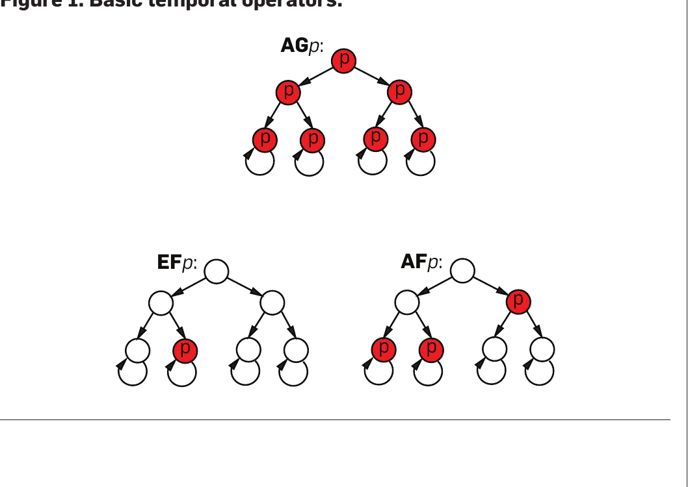
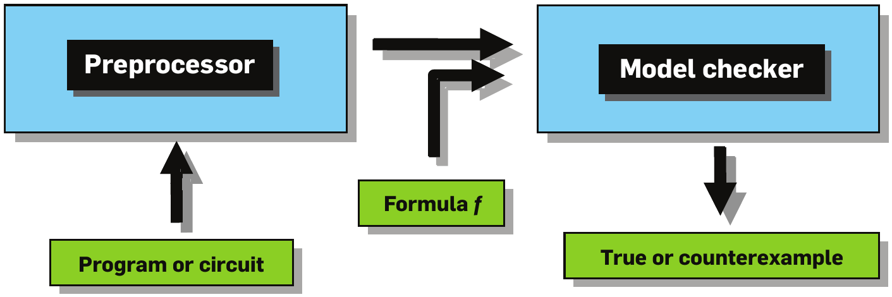
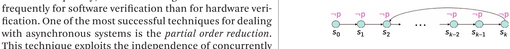
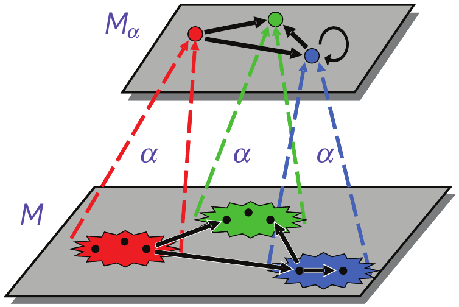
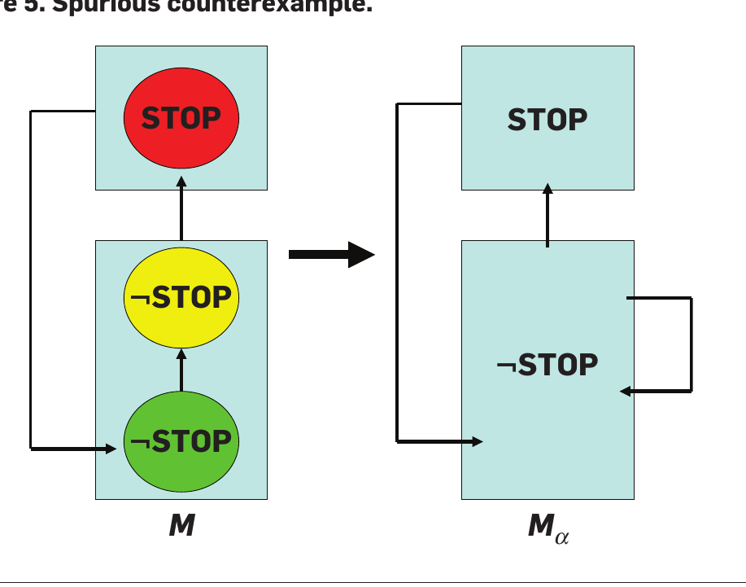
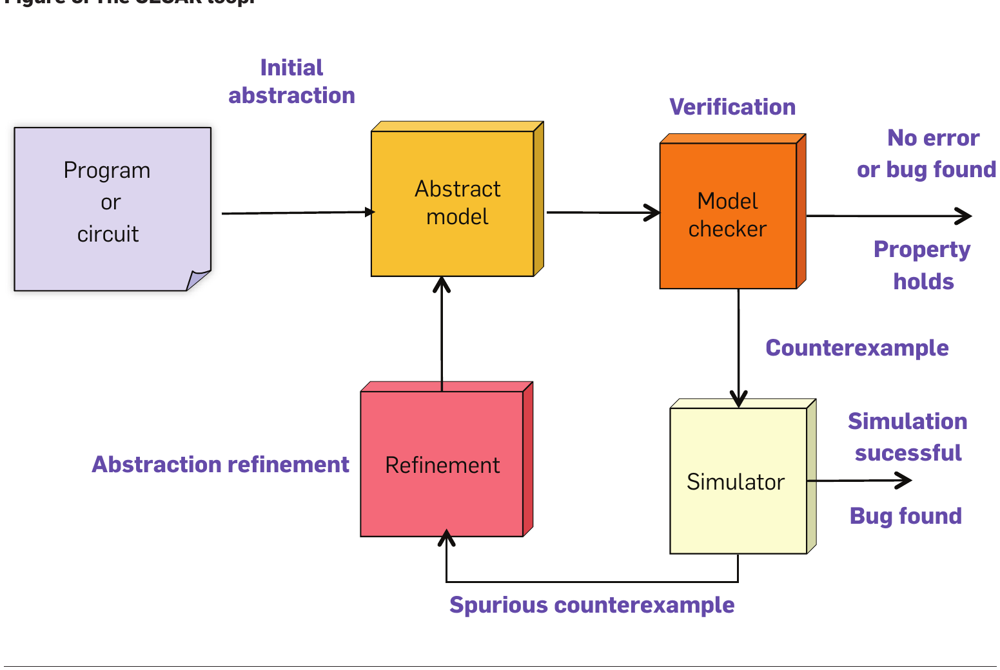

# 模型检测:算法化的验证与调试

**Model Checking: Algorithmic Verification and Debugging**

> 作者 爱德蒙·克拉克(Edmund M. Clarke)、艾伦·爱默生(E. Allen Emerson)、约瑟夫·西法基斯(Joseph Sifakis)
> 2007 年 ACM 图灵奖演讲
> 原载 *Communications of the ACM*, Vol. 52, No. 11 (2009 年 11 月), pp. 74, 84
> 译自 `1592761.1592781.pdf`(个人学习用途)

> 1981 年,在美国工作的爱德蒙·克拉克与艾伦·爱默生,以及在法国独立工作的约瑟夫·西法基斯,发表了奠基性的论文,开创了如今已取得巨大成功的模型检测(Model Checking)领域。这一验证技术提供了一种算法化手段,用以确定一个抽象模型(例如硬件或软件设计)是否满足以时序逻辑(Temporal Logic, TL)公式表达的形式化规范。此外,如果性质不成立,该方法还能识别出一条显示问题根源的反例(counterexample)执行路径。
>
> 模型检测向复杂系统应用演进的过程,要求开发出精妙的手段来应对所谓的"状态爆炸问题"(state explosion problem)。在过去的 28 年里,如今已非常庞大的国际研究群体在这一问题上取得了长足进步。其结果是,许多主要的硬件和软件公司开始在实践中使用模型检测。其应用实例包括超大规模集成电路(VLSI)、通信协议、软件设备驱动程序、实时嵌入式系统以及安全算法的验证。
>
> 克拉克、爱默生和西法基斯的工作始终处于这一研究领域成功的核心地位。他们多年来的工作促成了用于规范说明的新逻辑、新验证算法以及令人惊讶的理论成果的诞生。由学术界和工业界团队创建的模型检测工具,带来了一种全新的验证和测试用例生成方法。例如,这种方法通常使电子行业的工程师在设计复杂系统时,对其初始设计的正确性具有相当大的把握。模型检测有望在未来对硬件和软件行业产生更大的影响。
>
> , Moshe Y. Vardi, 总编辑

---

## 1. 艾伦·爱默生:模型检测鸟瞰

### 1.1. 形式化验证

程序正确性的形式化验证取决于数学逻辑的使用。程序是一个数学对象,具有定义良好但可能复杂且直觉上难以捉摸的行为。数学逻辑可以用来精确描述什么是正确的行为。这使得通过数学手段建立程序行为符合正确性规范成为可能。在大多数早期工作中,这涉及构造正确性的形式化证明。

与之相对,模型检测避免了证明。

从 20 世纪 60 年代开始,Floyd-Hoare 风格的演绎验证(deductive verification)是形式化验证的主流模式。这种经典而优雅的方法需要手动构造证明,通常在形式演绎系统中使用公理和推理规则,且往往面向顺序程序。这种证明构造过程既乏味又困难,且需要人类的创造力。这一领域在智力上取得了巨大成功,催生了关于组合或模块化证明系统、程序证明系统的可靠性及其完备性的工作(见第 3 节)。案例研究证实,这种方法对于小型程序确实有效,尽管一个短程序可能需要一个长证明。然而,手动验证无法很好地扩展到大型程序。证明构造实在太难了。

### 1.2. 时序逻辑

鉴于尝试构造程序证明的困难,似乎应该有一种更好的方法。这种方法受到了时序逻辑(Temporal Logic, TL)的启发,这是一种描述随时间变化的规范。如果一个程序可以用 TL 规范说明,它就可以被实现为一个有限状态系统。这启发了模型检测的想法,检查一个有限状态图是否是某个 TL 规范的模型。

在 Pnueli 的里程碑式论文中,提出了使用 TL 对持续运行的并发程序进行推理的关键建议〔译注1〕。这类系统理想情况下表现出非终止行为,因此不符合 Hoare 风格的范式。它们通常也是非确定性的。例子包括硬件电路、微处理器、操作系统、银行网络、通信协议、汽车电子以及许多现代医疗设备。Pnueli 使用了一种带有基本时序算子 $F$(sometime, 某时)和 $G$(always, 总是)的时序逻辑。加上 $X$(next-time, 下一时刻)和 $U$(until, 直到),这在今天被称为 LTL(线性时序逻辑, Linear Time Logic)。

另一种被广泛使用的逻辑是 CTL(计算树逻辑, Computation Tree Logic)。其基本时序模态是 $A$(对于所有未来)或 $E$(对于某个未来),后跟 $F$(某时)、$G$(总是)、$X$(下一时刻)和 $U$(直到)之一;复合公式由 CTL 子公式的嵌套和命题组合构建而成。CTL 是一种分支时序逻辑,因为它可以区分 $AFp$(在所有未来路径上,$p$ 最终成立,因此是必然的)和 $EFp$(在某条未来路径上,$p$ 最终成立,因此是可能的)。分支时序逻辑 CTL* 涵盖了 CTL 和 LTL(见图 1)。

〔图 1:基本时序算子。AGp: 状态图中所有路径上的所有状态都满足 p; AFp: 所有路径上最终都会到达满足 p 的状态; EFp: 存在一条路径最终到达满足 p 的状态。〕

时序逻辑公式是在给定的有限状态图上解释的,该图也称为(Kripke)结构 $M$,由状态集 $S$、全二元转换关系 $R \subseteq S \times S$ 以及用在该状态下为真的原子事实(命题,如 $P$)对状态进行的标记 $L$ 组成。可能还有一个特殊的(初始)状态 $s_0$。按照数学逻辑的惯例,为了精确定义逻辑,我们使用元记号 $M, s_0 \models f$ 作为"在结构 $M$ 的状态 $s_0$ 处,公式 $f$ 为真"的简写,其中 $f$ 是 CTL(或 CTL*)公式。当 $s_0$ 已知时,我们可以简写为 $M \models f$。例如,$M, s_0 \models AFp$ 当且仅当对于 $M$ 中所有路径 $x = s_0, s_1, s_2, \dots$,存在 $i \ge 0$ 使得 $P \in L(s_i)$。

在实践中进行规范说明时,我们可能只写 $AFp$ 来断言公式 $p$ 是必然的。LTL 公式 $\eta$ 是在一条路径上解释的,然后通过隐含的全称路径量化在结构上解释:在实际规范中,我们写 $\eta$ 但意指 $A\eta$。

LTL 公式 $G\neg(C_1 \wedge C_2)$ 捕捉了进程 1 和进程 2 临界区(分别对应断言 $C_1$ 和 $C_2$)的互斥。在 CTL 中,我们会为互斥写成 $AG\neg(C_1 \wedge C_2)$,而为"每当进程 1 进入其尝试区域($T_1$)时,它必然进入其临界区($C_1$)"写成 $AG(T_1 \Rightarrow AFC_1)$。CTL 公式 $AGEFstart$ 断言系统总是可以重启;这在 LTL 中是无法表达的。CTL* 公式 $EGFsend$ 断言存在一种公平行为,沿着该行为 $send$ 条件反复发生。这类公平性条件对于确保并发系统中的目标得以实现至关重要。

LTL、CTL 和 CTL* 逻辑已被证明非常有影响力,催生了工业界的扩展和应用,以及许多学术应用和理论成果。著名的工业逻辑包括基于 CTL 的 IBM Sugar、基于 LTL 的 Intel ForSpec,以及融合了 CTL* 特性的 PSL(IEEE-1850 标准),它们通过特殊的"宏"(即展开为基本算子较长组合的紧凑高层算子)专门为硬件验证量身定制。

最后,还有(命题) $\mu$-演算(mu-calculus),这是一种特殊但非常通用的时序逻辑。它允许将时序正确性性质表征为递归定义的固定点(fixed points 或 fixpoints)。例如 $EFp = p \vee EX(EFp)$。$\mu$-演算在模型检测中起着至关重要的作用。它的表达能力非常强:CTL、CTL* 以及 LTL 都可以编码在 $\mu$-演算中。时序正确性性质的固定点表征是许多常规和符号模型检测算法以及实践中使用的工具的基础。

### 1.3. 模型检测

在 20 世纪 80 年代初,克拉克和爱默生提出了模型检测,这是一种用于有限状态并发系统自动(且算法化)验证的方法;约瑟夫·西法基斯独立提出了基本相同的方法。在模型检测中,TL 被用来规范说明正确的系统行为。一种高效、灵活的搜索程序被用来在并发系统的有限状态图中寻找正确的时序模式。该方法的导向是提供一种实用的验证方法。模型检测问题的技术表述很简单:给定一个有限结构 $M$、状态 $s$ 和一个 TL 公式 $f$,是否有 $M, s \models f$? 另一种表述是,给定 $M$ 和 $f$,计算 $\{s : M, s \models f\}$。克拉克和爱默生的主要结果是,CTL 模型检测可以在 $O(|f| \cdot |M|^2)$ 时间内完成;也就是说,在公式和结构大小的多项式时间内完成。(西法基斯的结果是针对稍弱的时序逻辑。)

该算法基于基本时序模态的固定点表征。例如,令 $\tau(Z)$ 表示 $p \vee AXZ$。我们看到 $AFp = \tau(AFp)$ 是 $\tau(Z)$ 的一个固定点,因为 $AFp$ 成立当且仅当 $p$ 成立或 $AXAFp$ 成立。通常,可能存在多个固定点。可以证明 $AFp$ 是最小固定点(least fixpoint),我们将其记为 $\mu Z = \tau(Z)$,其中 $\tau(Z)$ 如上所述。直观地说,最小固定点只捕捉良基(well-founded)或有限的行为。性质的固定点表征 $\mu Z = \tau(Z)$ 使得迭代计算 $AFp$ 为真的状态集成为可能。这利用了每个公式都对应于它在其中为真的状态集这一事实。我们计算递增的、越来越大的状态集欠近似(under-approximations)升链的最大值: $false \subseteq \tau(false) \subseteq \tau^2(false) \subseteq \dots \subseteq \tau^k(false) = \tau^{k+1}(false)$,其中 $k$ 最多为(有限)状态空间的大小。更一般地,Tarski-Knaster 定理允许对表征为最小固定点 $\mu Z = \tau(Z)$ 的任何时序性质 $\rho$ 进行升链迭代计算 $\cup \tau^i(false)$,前提是 $\tau(Z)$ 是单调的,这通过 $Z$ 仅以非否定形式出现来保证。对于最大固定点,计算从 $true$ 开始。西法基斯给出了基本相同的算法。

以下是值得注意的扩展。CTL 模型检测可以在 $O(|M| \cdot |f|)$ 时间内完成,即与状态图的大小和公式的大小成线性关系。LTL 模型检测可以在 $O(|M| \cdot \exp(|f|))$ 时间内完成;由于 $M$ 通常非常大而 $f$ 很小,指数因子可能是可以忍受的。Vardi 和 Wolper 描述了 LTL 模型检测的自动机理论方法。Emerson 和 Lei 提出的公平性简洁固定点表征被用来使 LTL 模型检测在实践中更加高效。分支时间 CTL* 模型检测可以被有效地归约为相同总体界限下的线性时间 LTL 模型检测。

### 1.4. 表达能力

逻辑的一个重要标准是表达能力(expressiveness),反映了逻辑可以和不可以捕捉哪些正确性性质。有趣的性质包括安全性(safety, "坏事不会发生", 例如 $G\neg bad$)、活性(liveness, "好事终会发生", 例如 $Fgoal$)和公平性(fairness, "某事反复发生", 例如 $GFtry$)。可以认为,表达能力是模型检测中最基本的特征,甚至比效率更关键。能够表达所有需要的正确性性质是至关重要的。如果不能满足这一基本要求,那么从一开始就没有必要使用这种验证方法。在实际使用中,一种特定的形式化系统(通常是 TL 系统)提供了所需的表达能力。它包括几个基本时序算子,这些算子可以组合产生几乎无限的断言。TL 的另一个好处是它与自然语言相关,这可以促进其使用。

描述系统行为复杂模式的能力是基础性的。LTL 自然适合这项任务。在路径上,它在某种意义上是表达完备的,等价于线性序的一阶语言。像 $G_{even}P$ 这样表示 $P$ 在所有偶数时刻 $0, 2, 4, \dots$ 成立的性质,在 LTL 中是无法表达的。它在需要计算时钟周期的硬件验证应用中很有用。(线性时间) $\mu$-演算以及 PSL 可以表达这种性质。

CTL 非常适合捕捉计算树上的正确性。使用显式路径量化符($A, E$)区分必然行为和可能行为的分支时间能力提供了显著的表达能力。坏路径的存在性 $EFbad$,无法由任何 $Ah$ 形式的公式表达(其中 $h$ 在 LTL 中),甚至无法由任何全称 CTL* 公式表达(其中所有路径量化符都是 $A$,且只有原子命题以否定形式出现)。因此,LTL 在语义否定下是不封闭的:编写不变式 $G\neg bad$ 意味着 $AG\neg bad$,其语义否定是 $EFbad$,如上所述,它无法由任何 $Ah$ 公式表达。关于 LTL 还是分支时间逻辑更适合程序推理一直存在争议。线性时间具有简单性的优势,但代价是表达能力显著降低。分支时间潜在的更强表达能力可能会带来更大的概念(和计算)复杂性。

一个相关的标准是简洁性(succinctness),反映了性质可以被多么紧凑地表达。CTL* 公式 $E(FP_1 \wedge FP_2)$ 不是 CTL 公式,但在语义上等价于较长的 CTL 公式 $EF(P_1 \wedge EFP_2) \vee EF(P_2 \wedge EFP_1)$。对于 $n$ 个合取项,转换对于 $n$ 是指数级的。在实践中,最重要的是便利性(convenience)标准,反映了性质可以多么容易和自然地被表达。表达能力和简洁性可能部分适用于数学定义和研究。简洁性和便利性通常相关,但并不总是如此。然而,便利性本质上是非正式的。但在实际使用中它极其重要。这就是为什么例如投入了许多人年(person-years)来制定 PSL 等工业级逻辑的原因。

### 1.5. 效率

另一个重要标准是效率,它与逻辑的模型检测问题的复杂性以及逻辑的模型检测算法的性能有关。一个在理论上可能具有高复杂度但在实际使用中反复观察到复杂度显著降低的算法,可能比一个具有更好理论复杂度但观察性能较差的算法更受欢迎。此外,还存在权衡。例如,表达能力更强的逻辑可能效率较低。更简洁的逻辑可能更方便,但效率甚至更低。需要一些经验才能达到良好的权衡。对于许多模型检测应用,$M$ 足够小,可以显式地表示在计算机内存中。这种基本的枚举式模型检测对于具有 $10^6$ 个状态的系统可能是足够的。

然而,更多的系统 $M$ 具有天文数字甚至无限大的状态空间。有一些应对庞大状态空间的基本策略。首要的是使用抽象(abstraction),通过抑制无关紧要的细节,将原始的、庞大复杂的系统 $M$ 简化,得到一个更小、更简单的系统 $\bar{M}$ 的表示。

状态图的紧凑表示产生了另一种重要策略。符号模型检测(symbolic model checking)的出现,结合了 CTL、固定点计算和用于紧凑表示大型状态集的数据结构,使得检查许多具有天文数字状态的系统成为可能。

如果存在许多重复或相似的子组件,通常可以分解出原始 $M$ 中固有的对称性,从而得到指数级缩减的抽象 $\bar{M}$。大多数关于对称性的工作都要求使用 $M$ 的显式表示。将对称性和符号表示结合起来的自然尝试被证明在本质上是不可行的。然而,一种基于动态重组符号表示的非常有利的结合克服了这些限制。最后,人们可能拥有一个无限状态系统,例如由所有规模 $n > 1$ 的哲学家就餐问题解 $M_n$ 组成的系统。在许多情况下,这个参数化正确性问题可以归约为对固定有限规模系统 $M_c$ 的模型检测。

### 1.6. 模型检测的演进

模型检测早期的接受度是克制的。模型检测起源于 20 世纪 80 年代初的理论氛围。当时有一个被称为"程序逻辑"(Logics of Programs)的研究领域,处理逻辑在程序推理中的理论和偶尔的使用。各种模态和时序逻辑发挥了突出作用。当时研究的关键技术问题是可满足性(satisfiability):给定任何公式 $f$,确定是否存在某个结构 $M$ 使得 $M \models f$。分析这些逻辑的可满足性的可判定性和复杂性是主要焦点。然而,模型检测是指在给定的解释 $M$ 下,给定公式 $f$ 的真值。这个概念隐含在 Tarski 的真值定义中,但经典上并不被视为一个有趣的问题。模型检测应该为有限状态系统提供验证的想法当时并未得到赏识。早期对模型检测的反应大多是困惑和不感兴趣。它似乎是一个令人不安的新奇事物。它不是可满足性。它不是有效性(validity)。它是什么?它甚至被称为"令人迷失方向的"。许多人认为它在实践中不可能很好地工作。在最近的一段时间里,出现了一些更正面的评价。模型检测是"一个可以接受的拐杖",Edsger W. Dijkstra;它是"迈向该领域工程化的第一步",A. Pnueli。

哪些因素促成了模型检测的成功部署?首先,最初的框架是可行且易于理解的。它建立在 TL 和算法的有效结合之上。它提供了一种"一键式"(即自动化的)验证方法。它允许检测错误以及验证正确性。由于大多数程序都是错误的,这在实践中极其重要。顺便提一下,证明论验证方法对错误检测的支持有限,这导致了它们的采用率较低。此外,虽然边构造程序边构造证明的方法确实有其优点,但它不容易自动化。这阻碍了它的部署。通过模型检测,系统开发与验证 and 调试的分离(见第 2 节)无疑促进了模型检测在工业界的接受。开发团队可以继续生产系统设计的各个方面。验证者或验证工程师团队可以独立进行验证。希望许多微妙的错误能被检测到并修复。作为实际问题,系统可以在截止日期前以任何盛行的"可接受的正确性"水平投入生产。最后,摩尔定律带来了更大的计算机主内存,这使得开发越来越强大的模型检测工具成为可能。

### 1.7. 讨论与总结

模型检测的关键成就是什么?关键贡献是,使用模型检测的验证现在已在广泛的基础上常规地进行,用于许多大型系统,包括工业级系统。大型组织从硬件供应商到政府机构都依赖模型检测来促进其目标的实现。与 28 年前相比,我们不再只是谈论验证;我们正在实践它。有些令人惊讶的概念性发现是,通过自动化搜索而非手动证明,可以极其出色地完成验证。

模型检测在很小程度上实现了莱布尼茨(Leibniz, 1646-1716)的梦想。这是一个关于通用推理系统的提议。它由一种通用特征语言(lingua characteristica universalis)组成,所有知识都可以在其中形式化表达。TL 在有限的表述中扮演了这一角色。还有一个演算推理器(calculus ratiocinator),一种计算此类形式化断言真值的方法。模型检测算法提供了计算真值的手段。我们希望,随着时间的推移,模型检测将实现莱布尼茨梦想中越来越大的部分。

---

## 2. 爱德蒙·克拉克:征服状态爆炸问题的 28 年征程

### 2.1. 模型检测器与调试

模型检测器通常有三个主要组件:(1) 基于命题 TL 的规范说明语言〔译注3〕,(2) 一种对代表待验证系统的状态机进行编码的方法,以及 (3) 一种验证程序,它使用对状态空间的智能穷举搜索来确定规范是否为真。如果规范不满足,大多数模型检测器会生成一条反例执行轨迹,显示规范为何不成立。无论如何高估这一特性的重要性都不为过。反例在调试复杂系统时具有无与伦比的价值。有些人仅仅为了这一特性而使用模型检测。EMC 模型检测器最初并未为错误的 CTL 全称性质提供反例,也未为正确的存在性质提供见证(witness)。Michael C. Browne 在 1984 年为 MCB 模型检测器增加了这一特性。自那以后,它一直是模型检测器的一个重要特性(见图 2)。

〔图 2:带有反例的模型检测器。输入包括程序或电路以及公式 $f$,经过预处理进入模型检测器,输出为"真"或反例。〕

### 2.2. 状态爆炸问题

状态爆炸是模型检测中的主要问题。具有许多进程的并发系统的全局状态数量可能极其庞大。很容易看出原因。$n$ 个进程的异步组合,如果每个进程有 $m$ 个状态,则可能有 $m^n$ 个状态。类似的问题也发生在数据上。一个 $n$ 位计数器的状态转换系统将有 $2^n$ 个状态。所有模型检测器都受此问题困扰。复杂性理论的论证可以表明,在最坏情况下该问题是不可避免的(假设 $P \neq PSPACE$)。幸运的是,在过去的 28 年里,针对实践中经常出现的特殊类型系统已经取得了稳步进展。事实上,状态爆炸问题一直是模型检测研究和新模型检测器开发的驱动力。我们在下面讨论已经取得的关键突破,以及一些需要额外研究的重要案例。

### 2.3. 重大突破

#### 2.3.1. 使用 OBDD 的符号模型检测
在模型检测算法的最初实现中,转换关系由邻接表显式表示。对于具有少量进程的并发系统,状态数量通常相当小,这种方法往往非常实用。在具有许多并发部分的系统中,全局状态转换系统中的状态数量太大而无法处理。1987 年秋,当时还是卡内基梅隆大学研究生的 McMillan 意识到,通过对状态转换系统使用符号表示,可以验证大得多的系统。这种新的符号表示基于 Bryant 的有序二元决策图(OBDD)〔译注4〕。OBDD 为布尔公式提供了一种规范形式,通常比合取或析取范式紧凑得多,并且已经开发出非常高效的算法来处理它们。由于符号表示捕捉了由电路和协议确定的状态空间中的某些规律性,因此可以验证具有极其庞大状态数量的系统,比显式状态算法能处理的状态多出许多个数量级。利用这种新的状态转换系统表示,我们可以验证一些拥有超过 $10^{20}$ 个状态的例子。自那以后,OBDD 技术的各种改进已将状态计数推高至超过 $10^{120}$。

#### 2.3.2. 偏序归约
验证软件给模型检测带来了重大问题。软件往往比硬件结构化程度低。此外,并发软件通常是异步的,即不同进程采取的大多数活动是独立执行的,没有全局同步时钟。由于这些原因,状态爆炸问题对于软件尤为严重。因此,模型检测在软件验证中的使用频率低于硬件验证。处理异步系统最成功的技术之一是偏序归约(partial order reduction)。该技术利用了并发执行事件的独立性。直观地说,当以任何顺序执行两个事件都导致相同的全局状态时,这两个事件就是相互独立的。在这种情况下,可以避免探索状态转换系统中的某些路径。Valmari 的顽固集(stubborn sets)、Godefroid 的持久集(persistent sets)以及 Peled 的充足集(ample sets)在具体细节上有所不同,但包含许多相似的想法。Holzmann 开发的 SPIN 模型检测器极好地利用了充足集归约。

#### 2.3.3. 使用 SAT 的有界模型检测
虽然使用 OBDD 的符号模型检测是状态爆炸问题上的第一个重大突破且仍被广泛使用,但 OBDD 存在一些限制可检查模型规模的问题。从 OBDD 根节点到叶节点的每条路径上的变量顺序必须相同。寻找一个能产生小型 OBDD 的顺序是非常困难的。事实上,对于某些布尔公式,不存在空间效率高的顺序。一个简单的例子是两个 $n$ 位数相乘的组合乘法器的中间输出位公式。可以证明,对于所有变量顺序,该公式的 OBDD 大小对于 $n$ 都是指数级的。

命题可满足性(SAT)是确定合取范式("积之和形式")的命题公式是否存在使其为真的真值指派的问题。该问题是 NP 完全的。尽管如此,在过去的 15 年里,现代 SAT 求解器在处理实践中出现的问题时的能力提升是惊人的。它已成为模型检测在计算机硬件和软件应用中的关键赋能技术。使用快速 SAT 求解器的计算机硬件有界模型检测(Bounded Model Checking, BMC)现在可能是使用最广泛的模型检测技术。它找到的反例正是通过将电路的状态转换系统及其线性 TL 规范的否定展开到某个固定深度 $k$ 而得到的命题公式的满足实例。

BMC 的基本思想非常简单。扩展到完整的 LTL 会掩盖这种简单性,因此我们仅描述如何检查形式为 $FP$ 的性质,其中性质 $P$ 是一个原子命题(例如 "Message_Received")。BMC 确定是否存在长度为 $k$ 的反例(我们假设 $k \ge 1$)。换句话说,它检查是否存在一条长度为 $k$ 且以循环结束的路径,其中每个状态都被标记为 $\neg P$(见图 3)。假设状态转换系统 $M$ 有 $n$ 个状态。每个状态可以用一个由 $\lceil \log(n) \rceil$ 个布尔变量组成的向量 $\vec{v}$ 来编码。

〔图 3:长度最多为 $k$ 的反例。展示了从 $s_0$ 到 $s_k$ 的路径,每个状态满足 $\neg p$,且 $s_k$ 有回到之前某个状态的转换形成循环。〕

初始状态集可以由命题公式 $I(\vec{v})$ 指定,该公式对于且仅对于对应于初始状态的 $\vec{v}$ 指派成立。同样,转换关系可以由命题公式 $R(\vec{v}, \vec{v}')$ 给出。从初始状态开始的长度为 $k$ 的路径可以通过以下公式编码:
$$path(k) = I(\vec{v}_0) \wedge R(\vec{v}_0, \vec{v}_1) \wedge \dots \wedge R(\vec{v}_{k-1}, \vec{v}_k) \qquad (1)$$

当且仅当以下公式成立时,路径以循环结束:
$$cycle(k) = R(\vec{v}_k, \vec{v}_0) \vee \dots \vee R(\vec{v}_k, \vec{v}_{k-1}) \vee R(\vec{v}_k, \vec{v}_k) \qquad (2)$$

当且仅当以下公式成立时,性质 $P$ 在 $k$ 个步骤的每一步中都为假:
$$property(k) = \neg P(\vec{v}_0) \wedge \neg P(\vec{v}_1) \wedge \dots \wedge \neg P(\vec{v}_k) \qquad (3)$$

因此,活性性质 $FP$ 具有长度为 $k$ 的反例,当且仅当公式 1、2 和 3 的合取 $W(k)$ 是可满足的:
$$W(k) = path(k) \wedge cycle(k) \wedge property(k) \qquad (4)$$

我们从 $k = 1$ 开始。如果公式 $W(k)$ 是可满足的,我们就知道 $FP$ 有一个长度为 $k$ 的反例。可以从 $W(k)$ 的满足指派中提取出反例执行轨迹。如果公式 $W(k)$ 不可满足,那么情况可能是时序公式 $FP$ 在从初始状态开始的所有路径上都成立(我们的规范为真),或者存在一个比 $k$ 更长的反例。当 $W(k)$ 不可满足时,我们可以做两件事之一:要么增加 $k$ 的值并寻找更长的反例,要么在超出时间或内存限制时停止。

我们注意到,通过归约为命题可满足性来检查诸如 $GP$ 之类的安全性性质的想法隐含在 Kautz 和 Selman 的工作中。然而,他们没有考虑更通用的时序性质,例如我们上面考虑的活性性质。

在实践中,BMC 经常能在具有数千个锁存器(latches)和输入的电路中找到反例。Armin Biere 最近报告了一个例子,其中电路有 9510 个锁存器 and 9499 个输入。这产生了一个具有 $4 \times 10^6$ 个变量 and $1.2 \times 10^7$ 个子句的命题公式。长度为 37 的最短 bug 在 69 秒内就被找到了!许多其他人也报告了类似的结果。

如果没有找到反例,BMC 能否被用来证明正确性?很容易看出,对于形式为 $FP$ and $GP$ 的安全性和活性性质(其中 $P$ 是命题公式),如果存在反例,则存在一个小于状态转换系统直径(即任意两个状态之间最长的最短路径)的反例。因此,直径可以用来为转换关系需要展开多少次设定一个上限。不幸的是,当状态转换系统以电路形式隐式给出,或者以初始状态集、转换关系 and 坏状态集的命题公式给出时,计算直径在计算上似乎是困难的。使 BMC 完备的其他方法基于立方体扩大(cube enlargement)、电路共因子分解(circuit co-factoring)、归纳法以及 Craig 插值(Craig interpolants)。但该问题仍是一个活跃的研究课题。与此同时,一种寻找微妙反例的高效方法在调试电路设计中仍然非常有用。

#### 2.3.4. 抽象精化循环
该技术使用反例来精化初始抽象。我们首先定义一个状态转换系统是另一个系统的抽象意味着什么。我们用 $M_a = \langle S_a, s_{0a}, R_a, L_a \rangle$ 表示状态转换系统 $M = \langle S, s_0, R, L \rangle$ 关于抽象映射 $\alpha$ 的抽象。我们假设 $M$ 的状态由来自原子命题集 $A$ 的原子命题标记,而 $M_a$ 由来自 $A$ 的子集 $A_a$ 的原子命题标记。我们称 $M$ 为具体系统, $M_a$ 为抽象系统。

定义 1. 函数 $\alpha: S \to S_a$ 是从具体系统 $M$ 到抽象系统 $M_a$ 关于 $A_a$ 中命题的抽象映射,当且仅当:
- $\alpha(s_0) = s_{0a}$。
- 如果 $M$ 中存在从状态 $s$ 到状态 $t$ 的转换,则 $M_a$ 中存在从 $\alpha(s)$ 到 $\alpha(t)$ 的转换。
- 对于所有状态 $s$, $L(s) \cap A_a = L_a(\alpha(s))$。

这三个条件确保了 $M_a$ 模拟(simulates) $M$。注意,只有具体模型中标记相同(模去 $A_a$ 中不存在的命题)的状态才会被映射到抽象模型的同一个状态(见图 4)。联系具体系统 and 抽象系统的关键定理是性质保持定理(Property Preservation Theorem):

定理 1 (Clarke, Grumberg, and Long). 如果一个全称 CTL* 性质在抽象模型上成立,那么它在具体模型上也成立。

这里,全称 CTL* 性质是指在写成否定范式时不包含存在路径量化符的性质。例如, $AFP$ 是全称性质,但 $EFP$ 不是。

〔图 4:具体系统及其抽象。展示了多个具体状态映射到单个抽象状态的过程。〕

该定理的逆命题不成立,如图 5 所示。在具体系统中成立的全称性质在抽象系统中可能不成立。例如,性质 $AGF STOP$(无穷多次 STOP)在 $M$ 中成立,但在 $M_a$ 中不成立。因此,抽象系统中性质的一个反例在具体系统中可能不是反例。这类反例被称为虚假反例(spurious counterexamples)。这导致了一种被称为反例引导的抽象精化(Counterexample Guided Abstraction Refinement, CEGAR)的验证技术。全称性质在一系列对原始系统越来越精确的抽象上进行检查。如果性质成立,则根据性质保持定理,它在具体系统上也必然成立,我们可以停止。如果不成立 and 我们得到了一个反例,那么我们必须在具体系统上检查该反例,以确保它不是虚假的。如果反例在具体系统上通过检查,那么我们就找到了一个错误,也可以停止。如果反例是虚假的,那么我们利用反例中的信息来精化抽象映射 and 重复循环。图 6 中的 CEGAR 循环推广了早期的一种称为局部化归约(localization reduction)的顺序电路抽象技术,该技术由 R. Kurshan 开发。CEGAR 被用于许多软件模型检测器中,包括微软的 SLAM 项目。

〔图 5:虚假反例。展示了抽象模型中存在一条不满足性质的路径,但在具体模型中对应的路径并不存在。〕

〔图 6:CEGAR 循环。初始抽象 -> 抽象模型 -> 模型检测器 -> (性质成立 -> 结束) 或 (反例 -> 模拟器 -> (找到 bug -> 结束) 或 (虚假反例 -> 抽象精化 -> 循环))。〕

### 2.4. 面向未来的状态爆炸挑战

状态爆炸问题可能仍将是模型检测中的主要挑战。未来关于该问题的研究有许多方向,其中一些列举如下:
- 软件模型检测,特别是结合模型检测 and 静态分析
- 针对实时 and 混合系统的高效模型检测算法
- 复杂系统的组合模型检测
- 对称性归约 and 参数化模型检测
- 概率 and 统计模型检测
- 结合模型检测 and 定理证明
- 解释长反例
- 进一步扩大规模

---

## 3. 约瑟夫·西法基斯:追求正确性:挑战与展望

### 3.1. 我们现状如何?

验证技术肯定已经找到了重要的应用。在经历了前二十年的密集研究 and 开发后,近年来的特点是关注点 and 强度的转移。

算法化验证涉及三个不同的任务:(1) 需求规范说明,(2) 构建可执行系统模型,以及 (3) 开发可扩展的算法,既用于检查需求,也用于在需求未满足时提供诊断。下面讨论每个任务的状态。

#### 3.1.1. 需求规范说明
需求表征了系统的预期行为。它们可以遵循两种范式来表达。基于状态的需求使用转换系统来指定系统的可观察行为。基于性质的需求使用声明式风格。这些需求被表达为某种形式化系统(如 TL)中的一组公式。为了增强表达能力,两种范式的结合是必要的,例如在 PSL 语言中。基于状态的范式足以表征事件之间的因果依赖关系,例如动作序列。相比之下,基于性质的范式更适合全局性质,例如活性 and 互斥。对于并发系统,一个重要的趋势是转向基于状态的形式化系统的语义变体,例如 Live Sequence Charts。

使用 TL 肯定是理解 and 形式化并发系统需求的一个突破。尽管如此,在表征活性 and 公平性等常见概念时的细微差别(这取决于底层的时间模型,例如分支时间或线性时间)表明,编写严谨的逻辑规范并非易事。

此外,基于性质的需求表达中的声明式 and 密集风格并不总是容易掌握 and 理解。需求必须是可靠的(sound),即它们必须能被某个模型满足。此外,它们必须是完备的(complete),即关于所规范系统的任何重要信息都没有被遗漏。与可靠性(这是一个被很好理解且可以使用判定程序自动检查的性质)不同,对于需求规范说明中究竟什么构成完备性,以及如何实现完备性,目前还没有共识。绝对完备性(意味着规范精确地描述了系统)仅具有理论意义,对于非平凡系统来说可能是无法实现的。

现有的需求规范说明形式化系统主要适用于表达功能需求。我们缺乏严谨的形式化系统来表达额外功能需求,如安全性质(例如隐私)、可重构性性质(例如可重构特性的非干扰性)以及服务质量(例如抖动程度)。

#### 3.1.2. 构建可执行模型
验证方法的成功应用需要构建能够忠实代表系统或其抽象的可执行模型的技术。忠实性意味着待验证系统与其模型通过一种可检查的、保持语义的关系相关联。这将确保模型的可靠性。换句话说,我们为模型验证的任何性质都将在真实系统中成立。此外,为了避免在构建模型时出错并应对其复杂性,模型应该从系统描述中自动生成。

对于硬件验证,从 RTL 描述生成精确的逻辑有限状态模型(表达为布尔方程组)相对直接。这可能解释了模型检测在该领域取得的强大且立即的成功。对于软件,问题更加困难。与逻辑硬件模型相比,我们需要正式定义编程语言的语义。对于 C 或 Java 等语言,这可能不是一项容易的任务,因为它需要对概念进行一些澄清并对它们的语义做出额外的假设。一旦语义确定,就可以通过抽象从真实软件中提取出可处理的模型。这使我们能够应对数据 and 动态特性的复杂性。目前,我们还不知道如何为由硬件 and 软件组成的系统构建与纯硬件或软件相同细节水平的忠实模型。理想情况下,对于运行在平台上的应用软件组成的系统,相应的模型可以通过组合软件模型 and 平台模型来获得。主要的困难在于理解 and 形式化这两类模型之间的交互,特别是考虑到时间方面以及内存 and 能量等资源。此外,这应该在某种适当的抽象水平上完成,以允许可处理的模型。

今天,我们只能使用 Uppaal 等工具来规范 and 验证用于可调度性分析的高层时间模型。这些模型考虑了硬件时间方面以及应用软件的一些抽象。即使是像无线传感器网络中的节点这样相对简单的系统的确认,也是通过测试物理原型或通过临时仿真进行的。我们需要建模复杂异构系统的理论、方法 and 工具。系统建模标准 and 语言方面的现状也存在弱点。将 UML 扩展到涵盖调度 and 资源管理问题的努力未能为此提供严谨的基础。同时,硬件描述语言向涵盖更多异步执行模型(如 SystemC and TLM)的扩展,由于缺乏形式化语义基础,只能用于仿真。

#### 3.1.3. 可扩展的验证方法
今天我们拥有相当高效的验证算法。然而,当应用于大型系统时,所有算法都受困于众所周知的固有复杂度限制。为了应对这种复杂性,我看到了两条主要途径。

第一条途径是开发新的抽象技术,特别是针对特定的语义域,这取决于系统处理的数据 and 待验证的性质。模型检测与抽象解释(abstract interpretation)之间的融合可能会带来重大突破。这两种主要的算法方法在近三十年的时间里相当独立地发展,但有着共同的基础:在特定的语义域中求解固定点方程。

最初,模型检测专注于有限状态系统的验证,如硬件或复杂的控制密集型反应式系统(如通信协议)。后来,模型检测研究通过使用抽象解决了无限状态系统的验证问题。抽象解释的发展则是由寻找合适的抽象域以通过计算可达集近似值来高效验证程序性质的需求驱动的。模型检测具有更广泛的应用范围,包括硬件、软件 and 系统。此外,根据待检查性质的类型,模型检测算法可能涉及多个固定点的计算。我相信这两种算法方法的结合仍能带来显著的进步,例如在模型检测算法中使用抽象域库。

第二条途径致力于在战胜复杂性方面取得重大的长期进展。它涉及从单体验证转向组合技术(compositional techniques)。我们需要分而治之的方法,从组件的性质推导出系统的全局性质。目前的现状并未达到我们最初的预期。主要方法是"假设-保证"(assume-guarantee),其中性质被分解为两个部分。一个是关于组件所在系统全局行为的假设;另一个是当关于环境的假设成立时,由组件保证的性质。正如最近的一篇论文所讨论的,许多问题使得应用假设-保证规则变得困难,特别是由于假设的合成(在可行时)可能与单体验证的成本一样高。

在我看来,任何通用的组合验证理论都将是高度难处理的,且仅具有理论意义。我们需要研究特定类别性质 and/或 特定类别系统的组合性结果,如下所述。

### 3.2. 从事后验证到构造性

计算机工程与基于物理的更成熟学科(如电子工程)之间的一个巨大区别是验证对于实现正确性的重要性。这些学科已经发展出了通过构造(by construction)来保证人工制品的正确性和可预测性的理论。例如,基尔霍夫定律的应用允许构建满足给定性质的电路。

我的愿景是研究特定性质的组合验证与允许构造性的结果之间的联系。目前,计算机科学中存在大量关于架构 and 分布式算法的构造性结果。

1. 我们需要构建复杂系统忠实模型的理论 and 方法,将其作为异构组件(例如混合软硬件系统)的组合。这是确保异构观点正确互操作、有意义的精化 and 集成的核心问题。异构性有三个基本来源,当组合具有以下特征的组件时会出现:(a) 不同的执行模型,例如同步 and 异步执行;(b) 不同的交互机制,如锁、监视器、函数调用 and 消息传递;以及 (c) 不同的执行粒度,例如硬件 and 软件。我们需要从基于使用单一低层并行组合算子(例如基于自动机的组合)的组合框架,转向涵盖协议、调度器 and 总线等架构特性的统一组合范式。

2. 与现有方法相反,我们应该研究高层组合算子 and 特定类别性质的组合性技术。我建议研究两个独立的方向:
- 一个方向是研究特定类别性质的技术。例如,寻找保证无死锁或互斥的组合验证规则,而不是研究一般的安全性性质规则。潜在的死锁可以通过分析组件间交互引起的依赖关系来发现。为了证明互斥,需要一种不同类型的分析。
- 另一个方向是研究特定架构的技术。架构表征了系统组件之间组织交互的方式。例如,我们可以有益地研究环形或星型架构、具有可抢占任务 and 固定优先级的实时系统、时间触发架构等的组合验证规则。组合验证规则应该应用于架构层级使用的高层协调机制,而无需将其转换为低层的基于自动机的组合。

由此获得的结果应该允许我们识别"可验证性"条件(即在这些条件下,特定性质 and/或 系统类别的验证变得可扩展)。这类似于寻找使系统可测试、可适配等的条件。通过这种方式,组合性规则可以转化为"构造即正确"(correct-by-construction)的技术。

D-Finder 工具中实现的最新结果为这些想法提供了一些说明。D-Finder 使用启发式方法,从组件的无死锁性出发,组合地证明基于组件的系统的全局无死锁性。该方法是组合式的,分两步进行:
- 首先,它检查单个组件是否无死锁。也就是说,它们只能在等待与其它组件同步的状态下阻塞。
- 其次,它检查组件的交互图是否无环。这是以低成本建立全局无死锁性的充分条件。它仅取决于系统架构。否则,D-Finder 会根据第一步的结果,符号化地计算系统越来越强的全局无死锁不变式。如果存在某个满足系统初始状态的不变式,则建立无死锁性。基准测试表明,这种针对无死锁性的专门化结合组合性技术,比通用的单体验证工具具有显著更好的性能。

事后(a posteriori)验证不是保证正确性的唯一途径。系统设计者通过仔细应用在操作上相关且在技术上成功的架构原理来开发复杂系统。验证应该有利地考虑到架构及其特性。在完全构造性与事后验证之间存在着巨大的探索空间。这一愿景有助于弥合形式化方法与计算机科学中大量构造性结果之间的鸿沟。

---

## 参考文献

1. Ball, T., Rajamani, S.K. The SLAM toolkit. In *Computer-Aided Verification (CAV’01)*. Volume 2102 of Lecture Notes in Computer Science (2001), 260-264.
2. Basu, A., Bozga, M., Sifakis, J. Modeling heterogeneous real-time components in BIP. In *SEFM* (2006), 3-12.
3. Behrmann, G., Cougnard, A., David, A., Fleury, E., Larsen, K.G., Lime, D. Uppaal-tiga: Time for playing games! In *CAV*. W. Damm and H. Hermanns, eds. Volume 4590 of Lecture Notes in Computer Science (Springer, 2007), 121-125.
4. Ben-Ari, M., Pnueli, A., Manna, Z. The temporal logic of branching time. *Acta Inf.* 20 (1983), 207-226.
5. Bensalem, S., Bozga, M., Nguyen, T.-H., Sifakis, J. D-finder: A tool for compositional deadlock detection and verification. In *CAV*. A. Bouajjani and O. Maler, eds. Volume 5643 of Lecture Notes in Computer Science (Springer, 2009), 614-619.
6. Bensalem, S., Bozga, M., Sifakis, J., Nguyen, T.-H. Compositional deadlock detection and verification of B-I-P models. In *CONCUR* (2008).
7. Biere, A., Cimatti, A., Clarke, E.M., Zhu, Y. Symbolic model checking without BDDs. In *TACAS* (1999).
8. Burch, J.R., Clarke, E.M., McMillan, K.L., Dill, D.L., Hwang, L.J. Symbolic model checking: $10^{20}$ states and beyond. *Inf. Comput.* 98, 2 (1992), 142-170.
9. Clarke, E.M., Emerson, E.A., Jha, S., Sistla, A.P. Symmetry reductions in model checking. In *CAV* (1998).
10. Clarke, E.M., Emerson, E.A. Design and synthesis of synchronization skeletons using branching time temporal logic. In *Logics of Programs* (1981).
11. Clarke, E.M., Emerson, E.A., Sistla, A.P. Automatic verification of finite-state concurrent systems using temporal logic specifications. *ACM Trans. Program. Lang. Syst.* 8, 2 (1986), 244-263.
12. Clarke, E.M., Grumberg, O., Jha, S., Lu, Y., Veith, H. Counterexample-guided abstraction refinement. *J. ACM* 50, 5 (2003), 752-794.
13. Clarke, E.M., Grumberg, O., Long, D.E. Model checking and abstraction. *ACM Trans. Program. Lang. Syst.* 16, 5 (1994), 1512-1542.
14. Clarke, E.M., Jha, S., Enders, R., Filkorn, T. Exploiting symmetry in temporal logic model checking. *Formal Methods Syst. Des.* 9, 1-2 (1996), 77-104.
15. Cobleigh, J.M., Giannakopoulou, D., Pasareanu, C.S. Learning assumptions for compositional verification. In *TACAS* (2003).
16. Cousot, P., Cousot, R. Abstract interpretation: A unified lattice model for static analysis of programs by construction or approximation of fixpoints. In *POPL* (1977).
17. Damm, W., Harel, D. LSCs: Breathing life into message sequence charts. *Formal Methods Syst. Des.* 19, 1 (2001), 45-80.
18. Davis, M. *The Universal Computer: The Road from Leibniz to Turing*. W.W. Norton & Company, 2000.
19. Emerson, E.A. Temporal and modal logic. In *Handbook of Theoretical Computer Science, Volume B: Formal Models and Semantics*. J. van Leeuwen, ed. (1990), 995-1072.
20. Emerson, E.A., Clarke, E.M. Using algorithms to infer the correctness of finite-state programs from model-theoretic specifications. *ACM Trans. Program. Lang. Syst.* 4, 4 (1982), 719-742.
21. Emerson, E.A., Halpern, J.Y. "Sometimes" and "not never" revisited: On branching versus linear time temporal logic. *J. ACM* 33, 1 (1986), 151-178.
22. Emerson, E.A., Kahlon, V. Reducing model checking of the many to the few. In *CADE* (2000).
23. Emerson, E.A., Lei, C.-L. Modalities for model checking: Branching time logic strikes back. *Sci. Comput. Program.* 8, 3 (1987), 275-306.
24. Emerson, E.A., Lei, C.-L. Efficient model checking in fragments of the propositional mu-calculus. In *LICS* (1986).
25. Emerson, E.A., Wahl, T. On the complexity of symbolic model checking under symmetry. In *CAV* (2005).
26. Ganai, M.K., Gupta, A., Ashar, P. Efficient SAT-based unbounded symbolic model checking using circuit cofactoring. In *ICCAD* (2004).
27. Godefroid, P. *Partial-Order Methods for the Verification of Concurrent Systems: An Algorithmic Nature*. Volume 1032 of Lecture Notes in Computer Science (1996).
28. Gössler, G., Sifakis, J. Compositional hierarchy of models of components. *Sci. Comput. Program.* 55, 1-3 (2005), 153-183.
29. Jantsch, A. *Modeling Embedded Systems and SoCs: Concurrency and Time in Models of Computation*. Morgan Kaufmann, 2003.
30. Kautz, H.A., Selman, B. Pushing the envelope: Planning, propositional logic, and stochastic search. In *AAAI* (1996).
31. Kozen, D. Results on the propositional mu-calculus. *Theor. Comput. Sci.* 27 (1983), 333-354.
32. Kurshan, R.P. *Computer-Aided Verification of Coordinating Processes: The Automata-Theoretic Approach*. Princeton University Press, 1994.
33. Lichtenstein, O., Pnueli, A. Checking that finite state concurrent programs satisfy their linear temporal specifications. In *POPL* (1985).
34. Loiseaux, C., Graf, S., Sifakis, J., Bouajjani, A., Bensalem, S. Property preserving abstractions for the verification of concurrent systems. *Formal Methods Syst. Des.* 6, 1 (1995), 11-44.
35. McMillan, K.L. *Symbolic Model Checking*. Kluwer Academic Publishers, 1993.
36. McMillan, K.L. Applying SAT methods in unbounded symbolic model checking. In *CAV* (2002).
37. McMillan, K.L. Interpolation and SAT-based model checking. In *CAV* (2003).
38. Peled, D.A. All from one, one for all: On model checking using representatives. In *CAV* (1993).
39. Pnueli, A. The temporal logic of programs. In *FOCS* (1977).
40. Pnueli, A. Verification engineering: A future profession. In *PODC* (1997).
41. Queille, J.P., Sifakis, J. Specification and verification of concurrent systems in CESAR. In *International Symposium on Programming* (1982).
42. Sheeran, M., Singh, S., Stålmarck, G. Checking safety properties using induction and a SAT-solver. In *FMCAD* (2000).
43. Sistla, A.P., Gyuris, V., Emerson, E.A. SMC: A symmetry-based model checker for verification of safety and liveness properties. *ACM Trans. Softw. Eng. Methodol.* 9, 2 (2000), 133-166.
44. Tarski, A. A lattice-theoretical fixpoint theorem and its applications. *Pac. J. Math.* 5, 2 (1955), 285-309.
45. Valmari, A. A stubborn attack on state explosion. *Formal Methods Syst. Des.* 1, 4 (1992), 297-322.
46. Vardi, M.Y., Wolper, P. An automata-theoretic approach to automatic program verification. In *LICS* (1986).
47. Wolper, P. Temporal logic can be more expressive. *Inf. Control* 56, 1-2 (1983), 72-99.

---

## 译注

**文本与翻译说明**

1. **Amir Pnueli (1941-2009)**: 1996 年图灵奖得主,因"将时序逻辑引入计算科学,并对程序与系统验证做出杰出贡献"获奖。他的演讲摘要见本合集 `zh/1996-pnueli-验证工程:一个未来的职业.md`。模型检测正是建立在 Pnueli 将时序逻辑引入并发系统验证的基础之上。
2. **CTL (Computation Tree Logic)**: 由克拉克与爱默生于 1981 年提出,是一种分支时间逻辑。

**背景与文化注**

3. **命题时序逻辑 (Propositional TL)**: 此处主要指 Pnueli 在 1977 年论文中提出的逻辑框架。
4. **OBDD (Ordered Binary Decision Diagrams)**: 兰德尔·布莱恩特(Randal Bryant)于 1986 年提出的数据结构,为符号模型检测奠定了基础。
5. **CEGAR (反例引导的抽象精化)**: 处理大规模状态空间的关键技术,尤其在软件验证领域(如微软的 SLAM 项目)取得了巨大成功。
6. **三位获奖者的背景**:
    * **爱德蒙·克拉克 (Edmund M. Clarke)**: 卡内基梅隆大学教授,符号模型检测的先驱。
    * **艾伦·爱默生 (E. Allen Emerson)**: 德克萨斯大学奥斯汀分校教授,与克拉克共同提出了 CTL 和模型检测。
    * **约瑟夫·西法基斯 (Joseph Sifakis)**: 法国国家科学研究中心(CNRS)研究员,Verimag 实验室创始人,独立提出了模型检测概念。

**插图说明**

7. 原文六幅插图已按原版样式从 PDF 中提取为 PNG 并内嵌于正文相应位置（见 zh/assets/2007-clarke-emerson-sifakis/）：图 1 基本时序算子（第 3 页）、图 2 带反例的模型检查器框图（第 5 页）、图 3 长度至多 k 的反例状态序列（第 6 页）、图 4 具体系统 M 与其抽象 M_a 示意图（第 7 页）、图 5 伪反例示意图（第 8 页）、图 6 CEGAR 循环图（第 8 页）。
