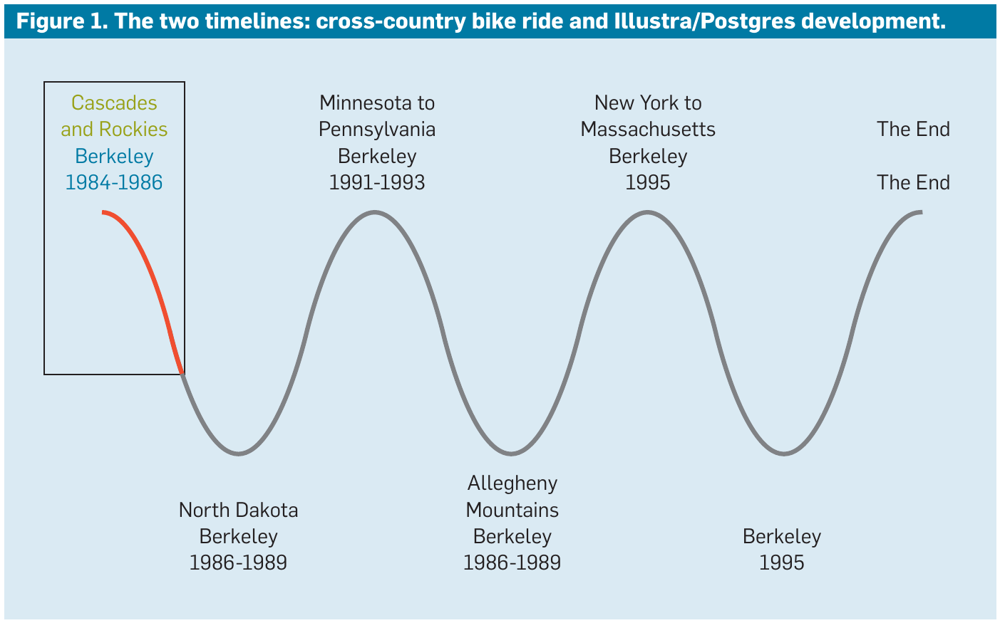
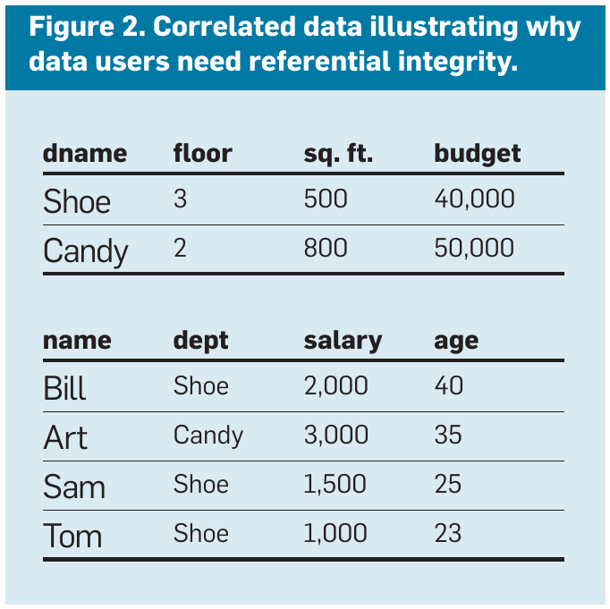
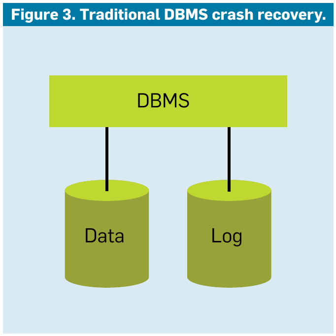
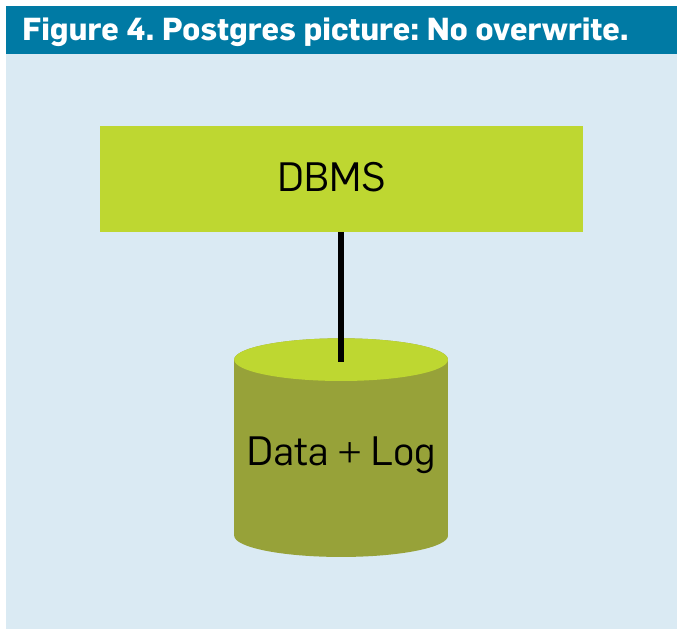

# 陆行鲨上了电话会议

**The Land Sharks Are on the Squawk Box**

> 作者 迈克尔·斯通布雷克(Michael Stonebraker)
> 2014 年 ACM 图灵奖演讲〔译注 2〕
> 原载 *Communications of the ACM*, Vol. 59, No. 2 (2016 年 2 月), pp. 74–83
> DOI 10.1145/2869958
> 译自 `2869958.pdf`(个人学习用途)

> 〔译注 1：本演讲交织了两条叙事线（见图 1）。第一条是我的妻子贝丝（Beth）和我本人在 1988 年夏天进行的一次横跨美国的单车之旅；第二条是 Postgres 的设计、构建与商业化历程，它跨越了从 20 世纪 80 年代中期到 90 年代中期的 12 年时间。在讲述完这两个故事后，我将得出系列观察与结论。为区分起见，单车之旅的部分以引用块（blockquote）形式排版。〕

事实证明，骑行横跨美国不仅仅是构建系统软件的一个便利隐喻。



**图 1**：两条时间线：横跨美国的单车之旅与 Illustra/Postgres 的开发历程。

1993 年夏天，缅因州肯尼巴格（Kennebago）。“陆行鲨”〔译注 4〕上了电话会议（squawk box）〔译注 5〕，Illustra（商业化 Postgres 的公司）已经到了山穷水尽的边缘，而我正与投资者进行电话会议，试图争取更多资金。唯一的问题是，我当时正在缅因州我哥哥的垂钓小屋参加家庭活动，而投资者们则在加利福尼亚通过扬声器（即“电话会议箱”）进行通话。我们八个人挤在狭小的空间里，我躲在浴室里试图达成一项协议。对话内容令人沮丧地熟悉。他们说“多给钱、降估值”；我说“少给钱、提估值”。我们最终达成了口头协议，Illustra 得以继续生存，以待来日再战。

与这些“鲨鱼”谈判总是令人沮丧。他们极其擅长讨价还价；毕竟，这就是他们整天在做的事情。相比之下，我觉得自己就像个初出茅庐的雏儿。

> **顺利起航**
>
> **华盛顿州安纳科特斯（Anacortes），1988 年 6 月 3 日。** 我们的车塞得满满当当，我们四个人（贝丝；我们 18 个月大的女儿莱斯利；玛丽·安妮，我们的司机兼保姆；还有我）挤在里面。这是压力巨大的一天。车顶上放着这一切的起因——我们全新的双人单车。我们下午在西雅图的自行车店修理它。在从湾区北上的路上，玛丽·安妮把车开进了一个限高低于车身加自行车高度的停车场。谢天谢地，损坏已经修复，我们都准备好出发了，尽管有点疲惫。明天早上，贝丝和我将开始沿着北卡斯卡德风景公路（North Cascades Scenic Highway）向东骑行；我们的目的地是约 3500 英里外的马萨诸塞州波士顿。因此，我们将我们的自行车命名为“波士顿号”（Boston Bound）。
>
> 我们只骑过一次双人单车，也从未进行过超过五天的自行车旅行，但这并没有让我们感到不安。我们从未爬过像眼前这些直接矗立在面前的大山，这一事实同样没有让我们退缩。贝丝和我情绪高涨；我们正在开始一场伟大的冒险。

**加州伯克利，1984 年。** 我们已经在 Ingres 上工作了十年。首先，我们构建了一个学术原型，然后使其功能完全齐备，接着创办了一家商业公司。然而，四年前（1980 年）利用我们的开源代码库起步的 Ingres 公司已经取得了显著进展，其代码现在远优于学术版本。继续在我们的软件上进行原型开发已经没有任何意义了。将代码推下悬崖是一个痛苦的决定，但在那一刻，一个新的 DBMS 诞生了。那么，Postgres 将会是什么样子呢？

有一点很明确：Postgres 将在数据类型上寻求突破。到那时，我已经读过十几篇类似形式的论文：“关系模型很棒，所以我尝试将其应用于[选择一个垂直应用领域]。我发现它行不通，为了解决这个问题，我建议在关系模型中增加[某些新想法]。”

选定的垂直领域包括地理信息系统（GIS）、计算机辅助设计（CAD）和图书馆信息系统。对我来说非常清楚的是，如果我们以这种方式随机添加功能，简洁、简单的关系模型将变成一团乱麻。人们可以将这视为“被 100 个疣子折磨致死”。

根本问题在于，现有的关系系统——特别是 Ingres 和 System R——在设计时考虑的是商业数据处理用户。毕竟，那是当时主要的 DBMS 市场，两组开发人员都试图在这一流行用例上做得比现有的竞争对手（即 IMS 和 Codasyl）更好。我们从未想过要关注其他市场，因此 RDBMS 在这些市场上表现不佳。然而，加州大学伯克利分校由 Pravin Varaiya 教授领导的一个研究小组在 Ingres 之上构建了一个 GIS，我们亲眼目睹了这一过程是多么痛苦。在 Ingres 的浮点数、整数和字符串之上模拟点、线、多边形和线组，场面并不好看。

对我来说很清楚，必须支持适合特定应用的数据类型，而这需要用户定义的数据类型。这个想法早些时候已被编程语言社区在 EL1 等系统中研究过，所以我所要做的就是将其应用于关系模型。例如，考虑以下对存储为整数的工资进行的 SQL 更新：

```sql
Update Employee set (salary = salary + 1000) where name = ‘George’
```

为了处理它，必须使用库函数 `string-to-integer` 将字符串 1000 转换为整数，然后调用 C 库中的整数 `+` 例程。为了支持使用新类型（例如 `foobar`）的此命令，只需添加两个函数 `foobar-plus` 和 `string-to-foobar`，然后在适当的时间调用它们。添加一个新的 DBMS 命令 `ADDTYPE` 是很直接的，其中包含新数据类型的名称以及与 ASCII 之间的转换例程。对于此新类型上每个所需的运算符，可以添加运算符的名称和要调用以应用它的代码。

当然，细节决定成败。必须能够使用 B 树或哈希对新数据类型进行索引。索引需要“小于”和“等于”的概念。此外，还需要交换律和结合律规则来决定新类型如何与其他类型一起使用。最后，还必须处理如下形式的谓词：

```sql
not salary < 100
```

这是合法的 SQL，每个 DBMS 都会将其翻转为：

```sql
salary ≥ 100
```

因此，必须为每个运算符定义一个否定器（negator），以便进行这种优化。

我们已经在 Ingres 中对这一功能进行了原型设计 [8]，它看起来运行良好，因此抽象数据类型（ADT）的概念显然将成为 Postgres 的基石。

> **华盛顿州温思罗普（Winthrop），第 3 天。** 当我躺在汽车旅馆房间的床上时，我的双腿在抽痛。事实上，我从臀部以下都很酸痛，但心情很愉快。我们从今天早上 5 点就开始骑行了；我们一根电线杆接一根电线杆地努力向上爬了 50 英里。一路上，我们上升了 5000 英尺进入卡斯卡德山脉，穿上了我们带来的每一件衣服。即便如此，我们还是对山口附近的暴风雪准备不足。寒冷、潮湿且疲惫，我们终于到达了名副其实的“雨天山口”（Rainy Pass）顶部。经过短暂的下坡后，我们又爬升了 1000 英尺到达“华盛顿山口”（Washington Pass）顶部。然后是向温思罗普的辉煌俯冲。我现在精疲力竭，但精神抖擞；还有更多的山口要爬，但我们已经翻过了前两个。我们已经证明了我们可以对付大山。

**加州伯克利，1985–1986 年。** Chris Date 在 1981 年写了一篇关于引用完整性（referential integrity）的开创性论文 [1]，他在文中定义了这一概念并指定了强制执行它的规则。基本上，如果有一个表 `Employee (name, salary, dept, age)`，主键为 `name`，第二个表 `Dept (dname, floor)`，主键为 `dname`，那么 `Employee` 中的属性 `dept` 就是一个外键；也就是说，它引用了另一个表中的主键；这两个表的示例如图 2 所示。在这种情况下，如果从 `dept` 表中删除一个部门会发生什么？



**图 2**：相关性数据示例，说明数据用户为何需要引用完整性。

例如，删除 `candy` 部门将使 `Employee` 表中每个在现已删除的部门工作的人都留下一个悬空引用。Date 确定了关于插入和删除操作的六种情况，所有这些情况都可以通过一个相当原始的“如果-那么”（if-then）规则系统来指定。在看过 Prolog 和 R1 中的程序后，我对这种方法非常警惕。看着任何超过 10 条语句的规则程序，都很难弄清楚它是做什么的。此外，此类规则是过程性的，根据调用规则的顺序，可能会得到各种奇怪的行为。例如，考虑以下两个（有些滑稽的）规则：

1. 如果 `Employee.name = ‘George’`，那么设置 `Employee.dept = ‘shoe’`
2. 如果 `Employee.salary > 1000` 且 `Employee.dept = ‘candy’`，那么设置 `Employee.salary = 1000`

考虑一个将 George 从 `shoe` 部门移至 `candy` 部门并将其工资更新为 2000 的更新。根据这两个规则的处理顺序，将得到不同的最终答案。值得注意的是，如果规则按此处的顺序执行，那么 George 最终将拥有 2000 的工资；如果规则顺序反过来，那么他的最终工资将是 1000。具有依赖于顺序的规则语义是非常糟糕的。

关系模型的一个基本原则是，查询评估的顺序（包括访问记录的顺序）由系统决定。因此，无论选择哪种查询计划执行，都应始终给出相同的最终结果。可以想象，构造出对于不同的查询计划给出不同答案的规则集是轻而易举的——这显然是不可取的系统行为。

在几年的时间里，我花了很多小时寻找其他方法。最终，我首选的方法是在查询语言中添加一个关键字 `always`。因此，查询语言中的任何表达都应具有它似乎在持续运行的语义。例如，如果 Mike 必须与 Sam 拥有相同的工资，那么以下 `always` 命令将达到目的：

```sql
Always update Employee, E
set salary = E.salary
where Employee.name = ‘Mike’
and E.name = ‘Sam’
```

每当 Mike 收到工资调整时，此命令就会介入并将他的工资重置为 Sam 的工资。每当 Sam 获得加薪时，它都会传播给 Mike。Postgres 将拥有这个 `always` 命令，并避免（某些）“如果-那么”规则系统的丑陋。这是个好消息；Postgres 将尝试一些不同的、有可能奏效的方法。

> **蒙大拿州玛丽亚山口（Marias Pass），第 15 天。** 我简直不敢相信。我们转过一个弯，看到了山口顶部的标志。我们到达了大陆分水岭！卡斯卡德山脉和落基山脉中无尽的爬坡已在身后，我们可以看到大平原在面前延伸。现在到芝加哥都是下坡路了！为了庆祝这一里程碑，我们将一小瓶从安纳科特斯带来的太平洋海水倒在山口的东侧，它最终将流向墨西哥湾。

**加州伯克利，1986 年。** 我在 Ingres 的经验使我确信，用于恢复目的的数据库日志编写起来既乏味又难以编码。事实上，金标准规范是在 C. Mohan 等人的 ARIES [3] 中。此外，一个 DBMS 实际上是两个 DBMS，一个管理我们所知的数据库，第二个管理日志，如图 3 所示。日志是实际的记录系统，因为 DBMS 的内容可能会丢失。



**图 3**：传统 DBMS 的崩溃恢复。

我们在 Postgres 中探索的想法是支持“时间旅行”。与其就地更新数据记录，然后将新内容和旧内容都写入日志，我们能否保留旧记录不动，并在实际数据库中写入包含新内容的第二条记录？这样，日志将合并到正常的数据库中，不需要单独的日志处理，如图 4 所示。



**图 4**：Postgres 示意图：不覆写（No overwrite）。

这种架构的一个附带好处是能够支持时间旅行，因为旧记录在数据库中很容易查询。最后，标准的会计系统在记录保存方法中不使用覆盖，因此 Postgres 将与这种策略兼容。

在高层次上，Postgres 将在三个领域做出贡献：一个 ADT 系统、一个基于 `always` 命令的简洁规则系统，以及一个时间旅行存储系统。这些功能的大部分在 Stonebraker 和 Rowe [6, 7] 中有描述。有关 Postgres 范围的更多信息，可以查阅庆祝我 70 岁生日的座谈会视频录像 [2]。我们带着一个有趣的技术计划出发并开始运行了。

> **第一批减速带**
>
> **北达科他州德雷克（Drake），第 26 天。** 我们真的很沮丧。北达科他州很荒凉。过去几天一直是如下的单调重复：
> - 看到前方标志着下一个城镇的谷物升降机
> - 朝着升降机骑行一小时
> - 几分钟内穿过城镇
> - 看到下一个谷物升降机……
>
> 然而，杀掉我们的并不是树木的缺失（我们开玩笑说北达科他州的州树是电线杆）和荒凉的景观。通常情况下，人们只需在车座上坐直，就能被盛行风吹过全州，盛行风通常从西向东呼啸。风确实在呼啸，但今年夏天的天气反常。我们正经历着从东向西、直扑面门的烈风。虽然我们期望以每小时 17-18 英里的速度被吹着走，但我们却在努力挣扎以达到 7 英里。我们今天只骑了 51 英里，精疲力竭。我们的目的地是哈维（Harvey），距离这里还有 25 英里，我们无法到达了。更不祥的是，林木线（以及明尼苏达州边界）仍有 250 英里远，我们不确定如何到达那里。我们费尽全力才拒绝了一位皮卡车司机的搭车提议，他提出要把我们送到下一个城镇。
>
> 食物也变得成问题。早餐是可靠的。我们找到一个城镇，然后寻找皮卡车最多的咖啡馆（通常是唯一的一家）。我们吃所有此类餐厅中都能找到的标准菜单。然而，晚餐变得非常无聊。菜单上全是标准的油炸食品；我们渴望意大利面和沙拉，但菜单上从未出现过。
>
> 我们建立了一套常规。每天的气温都在华氏 80 或 90 度（约 27-32 摄氏度）左右，所以贝丝和我早上 5 点就上路了。玛丽·安妮和莱斯利起得晚得多；她们在汽车旅馆逗留，然后在路上超过我们，前往我们将要过夜的城镇。当我们到达新的汽车旅馆时，我们中的一个人接替玛丽·安妮，而另一个人则试图寻找有我们愿意吃的食物的地方。虽然我们带了露营设备，但在路上辛苦了一天后，想到充气床垫并不吸引人。事实上，我们从未露营。莱斯利愉快地适应了这套常规，她 18 个月大时最喜欢的词之一是“制冰机”。我们的目标是在平原地区每天骑行 80 英里，在山区每天骑行 60 英里。我们每周骑行六天。

**加州伯克利，1986 年。** 我曾与一位 Ingres 客户交谈，他在实现了日期和时间作为新数据类型（根据美国国家标准学会规范）后。他说：“你实现这个新数据类型的方式不对。” 实际上，他想要一种与标准格里高利历所支持的不同的时间概念。更准确地说，他计算华尔街型金融债券的利息，无论一个月有多长，债券持有者获得的利息金额都是相同的。也就是说，他想要一种“债券时间”的概念，其中 3 月 15 日减去 2 月 15 日始终是 30 天，且每年分为 30 天的月份。在操作上，他只是想用他自己的概念来重载时间减法。这在 Ingres 中当然是不可能的，但在 Postgres 中很容易做到。这验证了我们的 ADT 是个好主意。

**加州伯克利，1986 年。** 我的合伙人“品酒师”（The Wine Connoisseur）和我关于 Postgres 数据模型的讨论已经持续了近一年。考虑前面提到的 Employee-Dept 数据库。一个明显的查询是连接这两个表，例如，查找员工的姓名和楼层号，如以下 SQL 命令所述：

```sql
Select E.name, D.floor
From Employee E, Dept D
Where E.dept = D.dname
```

在编程语言中，此任务将以过程化的方式编码为类似如下的内容（见代码段 1）。程序员编写算法来查找所需的结果。相比之下，关系模型的一个原则是程序员应陈述他们想要什么，而无需编写搜索算法。这项工作落到了查询优化器身上，它必须（在大规模情况下）决定是先迭代 `Employee` 还是先迭代 `Dept`，或者在连接键上对两个表进行哈希处理，或者对两个表进行排序以进行合并，或者……

我在 Ingres 的经验使我确信优化器非常困难，任何数据库公司的“脑外科医生”几乎肯定都是优化器专家。现在我们正在考虑扩展关系模型以支持更复杂的类型。在其最通用的形式中，我们可以考虑一列，其字段是指向结构数组的指针，而结构数组又包含……我无法想象为如此复杂的东西设计查询优化器。另一方面，我们应该舍弃什么？最后，“品酒师”和我感到沮丧，因为我们选择了一个具有基本复杂对象的设计点。为了支持我们选择的概念，仍然有很多代码。

**加州伯克利，1987 年。** Postgres 中时间旅行的设计见 Stonebraker [5]。虽然这在理论上是一个优雅的构造，但在实践中使其性能良好是很棘手的。基本问题是图 3 传统架构中的两个数据库的优化方式非常不同。数据是“读优化的”，因此查询很快，而日志是“写优化的”，因此可以快速提交事务。Postgres 必须尝试在单个存储中实现这两个目标；例如，如果在一个事务中更新了 10 条记录，那么 Postgres 必须在提交时强制将这些记录所在的页面全部写入磁盘。否则，DBMS 可能会产生“健忘症”，这是绝对禁止的。传统的日志会将所有日志记录分组在一小部分页面上，而数据记录保持读优化。由于我们将这两种构造合并到一个存储结构中，我们必须解决一个棘手的记录放置问题，以尝试实现这两个目标，而我们的初始实现并不是很好。我们花了很多时间试图修复这个子系统。

**加州伯克利，1987 年。** “品酒师”和我曾用 C 语言编写过 Ingres，不想再用它了。那听起来太像“似曾相识”（déjà vu）了。然而，C++ 还不够成熟，其他语言处理器无法在 Unix 上运行。到这时，任何脱离 Unix 更改操作系统的想法都不是一个选项；所有的伯克利学生都在接受 Unix 培训，它正迅速成为通用的学术操作系统。因此，我们选择喝下人工智能的“酷爱饮料”（Kool-Aid），开始用 Lisp 编写 Postgres。

一旦我们运行了一个初步版本的 Postgres，我们就看到了这是一个多么灾难性的性能错误——绝对在所有方面都有至少一个数量级的性能惩罚。我们立即将部分代码库扔下悬崖，并将其他所有内容转换为 C。我们回到了“似曾相识”（用 C 编码），损失了一堆时间，但至少我们学到了一个重要的教训：在没试过深浅之前，不要跳入未知的水域。这是几次重大代码重写中的第一次。

**加州伯克利，1988 年。** 不幸的是，我无法想出一种方法使我们的 `always` 命令足够通用，以至少涵盖 Chris Date 的六种引用完整性情况。经过几个月的尝试，我放弃了，我们决定回归到更传统的规则系统。更多的代码被扔下悬崖，更多的新功能需要编写。

总之，几年来我们一直在努力兑现最初的 Postgres 想法。我记得这段时间是漫长的“沼泽中的苦行”。

> **另一个高潮**
>
> **北达科他州卡灵顿（Carrington），次日下午。** 天气真的很热，我累得要命。我正在轮值“莱斯利任务”，在镇上走了一圈后，我们驻扎在随处可见（且有空调）的当地 Dairy Queen。我看着莱斯利吸吮着软冰淇淋，感觉“上帝站在我们这一边”，因为今天机缘巧合帮了大忙。不，风依然从东向西猛烈地吹着。机缘巧合是以我哥哥的形式出现的。他从缅因州赶来和我们一起骑行一周。玛丽·安妮昨天下午在米诺特（Minot）机场接到了他和他的自行车。他精力充沛，是一个非常非常强壮的骑手。他提出为我们挡风，就像你在自行车赛中看到的那样。经过一些实地训练（以及当我们撞到他的后轮时几次冲进麦田的经历），贝丝和我摸索出了如何骑在他后轮后面六英寸处。随着我们努力通过“快-慢-快”的对话保持同步，我们今天骑了 79 英里。现在很清楚，我们已经“度过了难关”，如果有必要，我们会紧贴着我哥哥的车轮骑出北达科他州。
>
> **明尼苏达州巴特尔莱克（Battle Lake），1988 年 7 月 4 日，第 30 天。** 我们今天休息，参加这个小镇一年一度的 7 月 4 日游行。这是一次非凡的经历——当地乐队、分发糖果的小丑（莱斯利高兴地收下了），还有开着小车的共济会成员（Shriners）。这是我永远不会忘记的一段美国缩影。美国农村对我们照顾得非常好，无论是超车时给我们的自行车留出宽阔的余地，还是在经过时友好地挥手，心甘情愿地兑换我们的旅行支票，或者提醒我们注意道路危险和绕行。

**加州伯克利，1992 年。** 根据我的经验，在 DBMS 领域真正产生影响的唯一方法是将你的想法推向商业市场。理论上，人们可以接触 DBMS 公司并试图说服他们采用新事物。事实上，当时有一个明显的“友好”公司——Ingres 公司——尽管它当时有自己的优先事项。

我很少见到技术转移以这种方式发生。哈佛商学院教授克莱顿·克里斯坦森（Clayton Christiansen）写过一本精彩的书，名为《创新者的窘境》（*The Innovator's Dilemma*）。他的论点是，技术颠覆对现有企业来说是非常具有挑战性的。具体来说，拥有旧技术的成熟供应商很难在不失去客户群的情况下转型到新方法。因此，颠覆性的想法通常不会在成熟供应商中找到接受的受众，而启动一家初创公司来证明自己的想法是首选方案。

到 1992 年年中，我结束了与 Ingres 的关联，并且已经过去了足够长的时间，使我摆脱了与该公司的竞业禁止协议。我准备创办一家商业 Postgres 公司，并联系了我的朋友“高个鲨”。他欣然同意参与。随后是与“首席陆行鲨”就条款进行的有些痛苦的谈判，我在融资合同的条款和条件方面接受了在职培训。最后，我明白了要求我签署的内容。那是一段艰难的时期，我不止一次改变主意。最后，我们达成了一项协议，Postgres 获得了 100 万美元的风险投资来启动。

很快，学术 Ingres 团队的两名明星——“安静”（Quiet）和“EMP1”——搬过来帮忙。不久之后，“三块石”（Triple Rock）也加入了他们，我们有了一个核心实现团队。我还联系了“妈妈”和她的丈夫“矮个子”，他们也加入了进来，我们开始运行了，“高个鲨”担任临时 CEO。我们最初的工作是将研究代码线打造成商业状态，将查询语言从 QUEL 转换为 SQL，编写文档，修复错误，并清理系统各处的“陈年积垢”（cruft）。

**加州埃默里维尔，1993 年。** 在经历了几个命名失误后，我们选择了 Illustra，我们的目标是找到愿意使用（并希望付费购买）初创公司系统的客户。我们必须找到一个引人注目的垂直市场，我们选择关注的是地理数据。“三块石”编写了一组关于点、线和多边形的抽象数据类型，并配有适当的函数（如点到线的距离）。

在获得包括“创业者转型的鲨鱼”在内的新投资者注资后，我们的钱再次用完了，引发了前面提到的来自肯尼巴格的电话。此后不久，我们有幸聘请了“经验之声”担任真正的 CEO，他招募了“圆滑”（Smooth）担任销售副总裁，补充了此前聘请负责营销的“阿普顿”（Uptone）。我们拥有了一家真正的公司，拥有一支运作良好的工程团队和世界级的高管。未来看起来一片光明。

> **密歇根州拉丁顿（Luddington），第 38 天。** 我们推着“波士顿号”走下密歇根湖渡轮，开始向东南方向骑行。无尽的中西部上游已在身后；现在距离波士顿不到 1000 英里了！不知为何，想到我们不再需要跨越水域，这令人感到安心。我们感觉很好。看起来我们可能真的能成功。

**高潮并不持久**

> **纽约州埃利科特维尔（Ellicottville），第 49 天。** 今天是非常糟糕的一天。我们的第一个问题发生在我穿着自行车锁鞋走下宾夕法尼亚州科里（Corry）酒店楼梯时。我在大理石地板上滑倒了，扭伤了膝盖。今天，我们只有三条好腿在推动“波士顿号”前进。然而，更大的问题是我们遇到了阿勒格尼山脉（Alleghany Mountains）。威斯康星州、密歇根州和俄亥俄州都是平坦的。那种轻松的骑行结束了，我们的自行车地图正引导我们一遍又一遍地爬上爬下同样的 500 英尺。此外，这里的道路规划者似乎不相信之字形山路；我们换到了 21 个档位中的最低档来爬上其中的一些山坡，这是极其累人的工作。你可以想象，我们的心情并不好。当贝丝安顿莱斯利睡觉时，我问了埃利科特维尔的旅店老板一个简单的问题：“我们如何才能不爬这些山就到达纽约州奥尔巴尼？”

**加州埃默里维尔，1993 年。** 我们的第一个营销挑战凭空出现了。很明显，我们的“甜点区”是任何可以通过 ADT 加速的应用。只要这是真的，我们将比任何其他 DBMS 拥有不公平的优势。然而，我们面临着一个“先有鸡还是先有蛋”的困境。在获得几个“灯塔”客户后，更谨慎的客户明确表示，他们希望从主要的 GIS 供应商（如 ArcInfo 和 MapInfo）那里获得 GIS 功能。我们需要招募特定垂直市场的应用公司，并说服他们将软件的内核重构为 ADT——这不是一项微不足道的任务。应用供应商自然会说：“帮我理解一下为什么我们要在这个联合项目中与你们合作。”说得更直白一点，“你们有多少客户，我能期望从这个为我的产品增加的分销渠道中赚多少钱？”也就是说，我们将这种重新架构视为任何理性的应用供应商都应拥抱的改变游戏规则的技术转变。然而，应用供应商仅将其视为一个新的分销渠道。这带来了困境：没有 ADT 我们就无法获得客户，而没有客户我们就无法获得 ADT。我们正在思考这种令人沮丧的情况，试图弄清楚该怎么办时，下一次危机发生了。

**加州奥克兰，1994 年。** 我们的钱又用完了，陆行鲨们宣布我们在实现公司目标方面没有取得良好进展。说得更直白一点，他们会投入额外的资本，但价格要低于上一轮融资。我们面临着可怕的“下调融资”。在最初的（通常是痛苦的）谈判之后，当所有权是公司团队和陆行鲨之间的零和博弈时，投资者和团队通常站在桌子的同一边。目标是建立一家成功的公司，在必要时以不断增长的股票价格筹集资金。唯一的争论点在于“支出”。投资者自然希望你花更多的钱以取得更快的进展，因为这将确保他们拥有公司越来越多的所有权百分比。相比之下，团队想要“亲吻每一枚镍币”以尽量减少筹集的资金量并最大化他们的所有权。解决这些分歧通常非常直接。当需要新一轮资金时，通常会引入一名新投资者来设定该轮的价格。让这个价格尽可能高符合团队的利益。目前的投资者将被要求支持该轮融资，按商定的任何价格增加他们的按比例份额。

然而，如果目前的投资者拒绝以更高的价格支持新一轮融资会发生什么？自然地，新投资者会跟随当前投资者的领导，并建立一个新的较低价格。此时，大多数融资协议中都有一项条款，即公司必须追溯性地将之前的融资轮次价格下调至新价格。你可以想象，下调融资对团队来说在财务上具有极大的稀释性，团队自然会说：“如果你想让我们继续，你需要补足我们的期权。”因此，讨论变成了现有投资者、新投资者和团队之间的三方谈判。这是另一个痛苦的零和博弈。

当尘埃落定时，Illustra 的员工在很大程度上通过新期权得到了补偿，陆行鲨之间的所有权百分比仅略有变化，整个过程留下了苦涩的味道。此外，管理层已经分心了几个月。陆行鲨们似乎在玩某种我无法理解的奇怪权力游戏。无论如何，Illustra 将继续战斗。

**未来再次看好**

> **纽约州特洛伊（Troy），第 56 天。** 埃利科特维尔的旅店老板告诉了我们对于任何在 19 世纪在东部沿海和中部地区之间运输货物的人来说显而易见的事情。他说：“向北骑到伊利运河，然后向右转。” 在莫霍克河谷（Mohawk Valley）进行了一段愉快（且平坦）的骑行后，我们到达了特洛伊，并看到了我们的第一块波士顿路标，现在只有 186 英里远了。终点就在三天后！我想起了加州奥林达（Orinda）野猫峡谷路（Wildcat Canyon Road）底部的一块彩绘标志，就在通往伯克利的东湾山坡起点处。它简单地写着“最后一座山”。我们现在正处于我们的最后一座山。我们只需要翻越伯克希尔山脉（Berkshires）到达马萨诸塞州皮茨菲尔德（Pittsfield）。然后到波士顿就是轻松的骑行了。

**加州奥克兰，1995 年。** 在我们的下调融资和关于 ADT 的困境之后不久，机缘巧合再次发生。互联网正在兴起，大多数企业都在试图弄清楚该如何利用它。阿普顿执行了 Illustra 的一次精彩重新定位。我们成为了“网络空间的数据库”，能够存储文本和图像等互联网数据。此外，他通过自愿让 Illustra 成为“网络空间 24 小时”的数据库，获得了令人难以置信的出镜时间，这是一项由摄影记者发起的全球性活动，每小时创建一个网页，获得了大量正面宣传。突然间，Illustra 成为了“新事物”，我们沉浸在反射的光辉中。销售额回升，未来看起来很光明。“经验之声”加大了马力，我们雇佣了新员工。也许这就是广受羡慕的“曲棍球棒式增长”的开始。我们被要求为一个非常大的网络供应商做一个试点应用，这是一笔潜在的决定公司命运的交易。然而，我们也正在与传统的 RDBMS 进行一场公开测试（bake-off）。

**好景不长**

**加州奥克兰，1995 年。** 现实很快露出了丑陋的面目。网络供应商没有在我们擅长的任务（如地理搜索或将文本与结构化数据和图像集成）上进行基准测试，而是决定在传统的“面包加黄油”式事务处理用例上对我们进行比较，其目标是在标准银行应用上执行尽可能多的每秒事务数。它为自己的选择辩解说：“在每个互联网应用中，都有一个伴随多媒体要求的业务数据处理子部分，所以我们要先测试那个。”

我的胃里立刻感到一阵翻江倒海，因为 Postgres 从未被设计成在联机事务处理（OLTP）方面表现出色。我们专注于 ADT、规则和时间旅行，而不是试图在当前 RDBMS 已经优化的领域与其竞争。虽然我们乐于处理事务，但这远非我们的强项。我们的性能将比我们竞争的传统供应商提供的性能差一个数量级。问题在于我近十年前做出的一系列架构决策，这些决策并不容易撤销；例如，Illustra 为每个用户作为一个操作系统进程运行。这种架构被公认为易于实现，但在许多用户执行简单操作的高并发工作负载下表现糟糕。此外，我们没有积极地编译查询计划，因此我们执行简单操作的开销很高。当面对复杂的查询或我们的 ADT 具有优势的用例时，这些缺点并不是问题。但在运行简单的业务数据处理时，我们会输，而且会输得很惨。

我们面临着严酷的现实：我们必须大幅提高事务处理性能，这既不简单也不快速。我和“矮个子”花了几个小时试图找到一种方法，在不需要大量重新编码、精力、成本和延迟的情况下实现这一目标。我们一无所获。Illustra 将不得不经历一次代价高昂的架构重组。

**故事的终结**

> **马萨诸塞州索顿（Sutton），第 59 天。** 马萨诸塞州的道路标识很差，我们从未见过更不礼貌的司机。在这里骑行并不愉快，我们无法想象试图驾驶“波士顿号”进入波士顿市中心，更不用说找到可以接触海洋的地方了。相反，我们决定在马萨诸塞州昆西（Quincy）的沃拉斯顿海滩（Wollaston Beach）结束，那里位于波士顿以南约 10 英里处。在履行完将自行车拖过海滩并将前轮浸入海浪的例行公事后，我们完成了。我们在海滨咖啡馆喝了一杯香槟，思考接下来会发生什么。

**加州奥克兰，1996 年 2 月。** 机缘巧合再次发生。在网络供应商的基准测试中与我们竞争的一家供应商受到了该基准测试的严重威胁。它看到 Illustra 将轻而易举地赢得各种互联网风格的基准测试，并且网络供应商在这方面将有实质性的需求。因此，它选择收购 Illustra。在许多方面，这是我们所有问题的答案。该公司拥有一个高性能的 OLTP 平台，我们可以将 Illustra 的功能插入其中。它也是一家大公司，拥有足够的“投射重量”来让应用供应商在其系统中添加 ADT。我们完成了一笔我们认为互惠互利的交易，并开始着手将 Illustra 的功能放入其引擎中。

我将在这里结束 Illustra 的故事，尽管还有很多故事可以讲，其中大部分相当阴暗——股东诉讼、多位新 CEO，以及最终公司的出售。显而易见的教训是，在选择同意结婚的公司时要非常小心。

**为什么讲自行车的故事？**

你可能会想，我为什么要讲这个自行车故事。有三个原因。首先，我想给你们一个成功骑行横跨美国的算法。

```
Until (海洋) {
    早起；
    向东骑；
    坚持，并克服出现的任何障碍；
}
```

很明显，遵循这个算法将会成功。如果发生机缘巧合，就撒上一点。现在通过用“目标”代替“海洋”，用“适当的行动”代替“向东骑”，将其抽象化：

```
Until (目标) {
    早起；
    适当的行动；
    坚持，并克服出现的任何障碍；
}
```

既然我会再次使用这个算法，我将把它做成一个宏：

`Make-it-happen (目标);`

有了这段开场白，我可以给出我 1988 年左右简历的简要草图。

`Make-it-happen (博士学位);`
`Make-it-happen (终身教职);`
`Make-it-happen (海洋);`

根据我的经验，获得博士学位（大约五年）是该算法在起作用的一个例子。有高潮（通过初试），有低谷（第一次资格考试失败），还有很多在沼泽中的苦行（写出一篇委员会可以接受的论文）。获得终身教职（另外五年）是该算法在起作用的一个更不愉快的例子。

这引出了展示该算法的第二个原因。显而易见的问题是，“为什么有人会想进行这次自行车旅行？”它漫长且非常困难，伴随着沮丧、欣喜和无聊的时期，以及随处可见的糟糕食物。我只能说，“它听起来像个好主意，我立刻就会再去一次。”就像博士学位和终身教职一样，它是“让它发生”（make-it-happen）在行动中的一个例子。显而易见的结论是，我被编程为寻找“让它发生”的机会，并从中获得巨大的满足感。

我想在这里过渡到讲自行车故事的第三个原因。骑行横跨美国是构建系统软件的一个便利隐喻。让我先写下构建新 DBMS 的算法（见代码段 2）。

接下来的问题是，“我如何产生一个新想法？”答案是，“我不知道。”然而，这并不会阻止我发表一些评论。从个人经验来看，我从未通过去山顶思考而产生过任何想法。相反，我的想法来自两个来源：与面临真实问题的真实用户交谈，然后尝试解决这些问题。这确保了我产生的想法是有人关心的，并且是脚踏实地而不是异想天开的。第二个来源是将可能的好（或坏）想法抛给会挑战它们的同事。总之，产生好主意的最佳机会是花时间在现实世界中，并找到一个你会在智力上受到挑战的环境（如 MIT/CSAIL 和伯克利/EECS）。

如果你的想法站得住脚，并且你有一个工作的原型，那么你可以进入第二阶段，它现在看起来已经很熟悉了（见代码段 3）。

与其他系统软件一样，构建一个新的 DBMS 是困难的，需要十年左右的时间，并涉及欣喜和沮丧的时期。与骑行横跨美国不同，骑行只需要肌肉和毅力，而构建新的 DBMS 还涉及其他挑战。在原型阶段，必须弄清楚新的接口，包括内部接口和面向应用的接口，以及面向操作系统、网络和持久存储的接口。根据我的经验，第一次就做对是不寻常的。不幸的是，人们通常必须先构建它，才能看到应该如何构建它。你将不得不扔掉代码并重新开始，也许不止一次。此外，一切都影响着其他一切。在驾驭巨大的设计空间的同时无情地避免复杂性是一项至高上上的工程挑战。使软件快速且可扩展只会让事情变得更加困难。这很像骑行横跨美国。

商业化增加了它自己的一系列挑战。软件必须真正工作，生成正确的答案，永不崩溃，并成功处理所有的边缘情况，包括耗尽任何计算机资源（如主内存和磁盘）。此外，客户依赖 DBMS 永不丢失他们的数据，因此事务管理必须是防弹的。这比看起来要困难，因为 DBMS 是多用户软件。可重复的错误，或“波尔缺陷”（Bohrbugs），很容易从系统中清除，留下的是杀手级的、不可重复的错误，或“海森堡缺陷”（Heisenbugs）。试图寻找不可重复的错误是一项令人沮丧的练习。更糟糕的是，海森堡缺陷通常存在于事务系统中，导致客户丢失数据。这种现实在好几次场合都让我感到胃部剧烈翻腾。生产（和测试）系统软件需要很长时间并花费很多钱。能够做到这一点的系统程序员令我钦佩。总之，构建和商业化一个新的 DBMS 可以概括为：

拥有一个好主意（或两个或三个）；
让它发生——持续十年左右；

这引出了显而易见的问题：“为什么有人会想做这么困难的事情？”答案与博士学位、获得终身教职或骑行横跨美国是一样的。我倾向于接受此类挑战。我花了十年时间努力使 Postgres 成为现实，并且立刻就会再去一次。事实上，自 Postgres 以来，我已经做过多次了。

**现状**

我将跳到 2016 年，谈谈事情最终的结果，以此结束这段叙事。对于那些期望这篇文章是对当前好主意（以及不那么好的主意）的评论的人，你可以观看我在 2015 年 IEEE 国际数据工程会议上关于这一主题的演讲〔译注 7〕（http://kdb.snu.ac.kr/data/stonebraker_talk.mp4），或者观看本篇文章在 ACM 数字图书馆中的附带视频。

**新罕布什尔州莫尔顿伯勒（Moultonborough），现在。** “波士顿号”到达加利福尼亚的方式和它离开时一样，放在我们车顶上。它现在躺在我们新罕布什尔州的地下室里吃灰。自从在沃拉斯顿海滩那天起，它就再也没被骑过。

我仍然倾向于接受身体上的挑战。最近，我决定爬完新罕布什尔州所有 48 座海拔 4000 英尺以上的山峰。在较软的维度上，我正在努力掌握五弦班卓琴。

莱斯利现在是纽约市一家由天使投资人支持的初创公司的营销总监，顺便说一下，该公司的软件运行在 Postgres 上。她拒绝主修计算机科学。

Illustra 被成功整合到了 Informix 代码库中。该系统仍可从 IBM 获得，IBM 于 2001 年收购了 Informix。原始的 Illustra 代码线仍存在于 IBM 档案的某个地方。学术 Postgres 代码线在 1995 年得到了巨大的推动，当时“快乐”（Happy） and “严肃”（Serious）用 SQL 接口取代了 QUEL 查询语言。随后，它被一支专门的临时团队接管，他们直到今天仍在指导其发展。这是开源开发在运行中的一个光辉典范。有关这一演变的简短历史，请参阅 Momjian [4]。这条开源代码线也被整合到了几个当前的 DBMS 中，包括 Greenplum 和 Netezza。大多数商业 DBMS 都用 Postgres 风格的 ADT 扩展了它们的引擎。

我现在想以三个最后的想法结束。首先，我想提到我构建的其他 DBMS——Ingres、C-Store/Vertica、H-Store/VoltDB 和 SciDB——都有与 Postgres 类似的开发故事。我本可以挑选其中任何一个在本文中讨论。所有这些都有一群超级巨星研究程序员，我是骑在他们的肩膀上前进的。多年来，他们将我的想法变成了工作的原型。其他编程巨星将原型转换为用于生产部署的防弹工作代码。经验丰富的初创公司高管小心翼翼地指导着这些小型脆弱的公司。我特别感谢我目前的商业伙伴“光头”（Cueball），感谢他在波涛汹涌的水域中细心的掌舵。此外，我要感谢陆行鲨，没有他们的资本，这一切都不可能实现，特别是“信徒”（Believer），他支持了我多家东海岸公司。

我特别感谢我的合伙人 Larry Rowe，以及以下 39 位编写 Postgres 的伯克利学生和工作人员：Jeff Anton, Paul Aoki, James Bell, Jennifer Caetta, Philip Chang, Jolly Chen, Ron Choi, Matt Dillon, Zelaine Fong, Adam Glass, Jeffrey Goh, Steven Grady, Serge Granik, Marti Hearst, Joey Hellerstein, Michael Hirohama, Chin-heng Hong, Wei Hong, Anant Jhingren, Greg Kemnitz, Marcel Kornacker, Case Larsen, Boris Livshitz, Jeff Meredith, Ginger Ogle, Mike Olson, Nels Olsen, Lay-Peng Ong, Carol Paxson, Avi Pfeffer, Spyros Potamianos, Sunita Surawagi, David Muir Sharnoff, Mark Sullivan, Cimarron Taylor, Marc Teitelbaum, Yongdong Wang, Kristen Wright, 和 Andrew Yu。

其次，我想感谢我的妻子贝丝。她不仅在横跨美国时不得不花两个月时间看着我的后背，她还必须应对我的目标导向、创办公司的愿望，以及通常对“下一步”的无情关注。我很难相处，而她长期忍受。我不确定她是否意识到，她很大程度上负责防止我从我个人的悬崖上掉下去。

第三，我想感谢我的朋友、同事和偶尔的共鸣板——吉姆·格雷（Jim Gray），1998 年 ACM A.M. 图灵奖得主。他在九年前的 2007 年 1 月 28 日失踪于大海。我想代表整个数据库界说：

吉姆：我们每天都在想念你。

---

## 参考文献

1. Date, C. Referential integrity. In *Proceedings of the Seventh International Conference on Very Large Data Bases Conference* (Cannes, France, Sept. 9–11). Morgan Kaufmann Publishers, 1981, 2–12.
2. Madden, S. Mike Stonebraker’s 70th Birthday Event. MIT Computer Science and Artificial Intelligence Laboratory, Cambridge, MA, Apr. 12, 2014; http://webcast.mit.edu/spr2014/csail/12apr14/
3. Mohan, C., Haderle, D., Lindsay, B., Pirahesh, H., and Schwarz, P. Aries: A transaction recovery method supporting fine granularity locking and partial rollbacks using write-ahead logging. *ACM Transactions on Database Systems 17*, 1 (Mar. 1992), 94–162.
4. Momjian, B. *The History of PostgreSQL Open Source Development*; https://momjian.us/main/writings/pgsql/history.pdf
5. Stonebraker, M. The design of the Postgres storage system. In *Proceedings of the 13th International Conference on Very Large Data Bases Conference* (Brighton, England, Sept. 1–4). Morgan Kaufmann Publishers, 1987, 289–300.
6. Stonebraker, M. and Rowe, L. The design of Postgres. In *Proceedings of the 1986 SIGMOD Conference* (Washington, D.C., May 28–30). ACM Press, New York, 1986, 340–355.
7. Stonebraker, M and Rowe, L. The Postgres data model. In *Proceedings of the 13th International Conference on Very Large Data Bases Conference* (Brighton, England, Sept. 1–4). Morgan Kaufmann Publishers, 1987, 83–96.
8. Stonebraker, M., Rubenstein, B., and Guttman, A. Application of abstract data types and abstract indices to CAD databases. In *Proceedings of the ACM-IEEE Workshop on Engineering Design Applications* (San Jose, CA, May). ACM Press, New York, 1983, 107–113.

---

## 译注

**文本与翻译说明**

1. **排版说明**：原文通过不同的字体和排版交织了两条叙事线。本译文采用引用块（blockquote）来标识单车之旅的叙事，以保持这种独特的互文感。
2. **演讲背景**：Stonebraker 因其对现代数据库系统的贡献（尤其是 Ingres 和 Postgres）获得 2014 年图灵奖。本篇讲稿基于其获奖演讲。

**背景与文化注**

3. **高个鲨 (Tall Shark)**：指 Gary Morgenthaler，Stonebraker 的长期商业伙伴，曾任 Ingres 和 Illustra 的高管。
4. **陆行鲨 (Land Shark)**：源自《周六夜现场》（SNL）中的经典短剧，其中陆行鲨是一个伪装成上门推销员或修理工诱骗受害者的角色。Stonebraker 用它来形容风险投资人（VC）既能提供资金，又可能在条款和控制权上表现出掠夺性。
5. **电话会议 (Squawk Box)**：原指交易大厅的对讲扬声器，此处指代办公室里的免提扩音器或电话会议终端。
6. **Illustra**：Stonebraker 基于 Postgres 创办的公司，旨在将"对象-关系"数据库推向市场。
7. **一刀切不合时宜 (One size does not fit all)**：这是 Stonebraker 最著名的学术观点之一，认为不同的应用场景（如 OLTP、分析、流处理）需要不同的数据库架构，不存在万能的数据库。
8. **关系模型与历史**：文中提到的"关系模型的一大原则是程序员只需声明他们想要什么"（第 78 页），其奠基人是 1981 年图灵奖得主埃德加·科德（Edgar Codd）。Stonebraker 的工作（Ingres/Postgres）是在科德的关系模型基础上，对查尔斯·巴赫曼（Charles Bachman，1973 年图灵奖得主）倡导的网状模型（Network Model）的进一步超越与演进。本演讲集亦收录了两人的演讲。
9. **酷爱饮料 (Kool-Aid)**：源自 1978 年琼斯镇惨案，后引申为盲目接受某种思想或教义。文中指当时学术界对人工智能（及 Lisp 语言）的盲目追捧。
10. **海森堡缺陷 (Heisenbugs)**：借用量子力学中的海森堡测不准原理，指那些在尝试观察或调试时会消失或改变行为的软件缺陷。

**OCR 与印刷勘误**

11. 原文第 83 页参考文献 [3] 中 "ARIES" 误印为 "Aries"，已按惯例校正为全大写。

**插图说明**

12. 原文第 3 页 Figure 1（两条时间线）、第 3 页 Figure 2（相关性数据）、第 4 页 Figure 3（传统 DBMS 崩溃恢复）与第 4 页 Figure 4（Postgres 无覆写）的插图均已从原 PDF 中提取为 PNG 并内嵌于正文对应位置（见 `zh/assets/2014-stonebraker/` 下的 fig-01.png 至 fig-04.png）。
