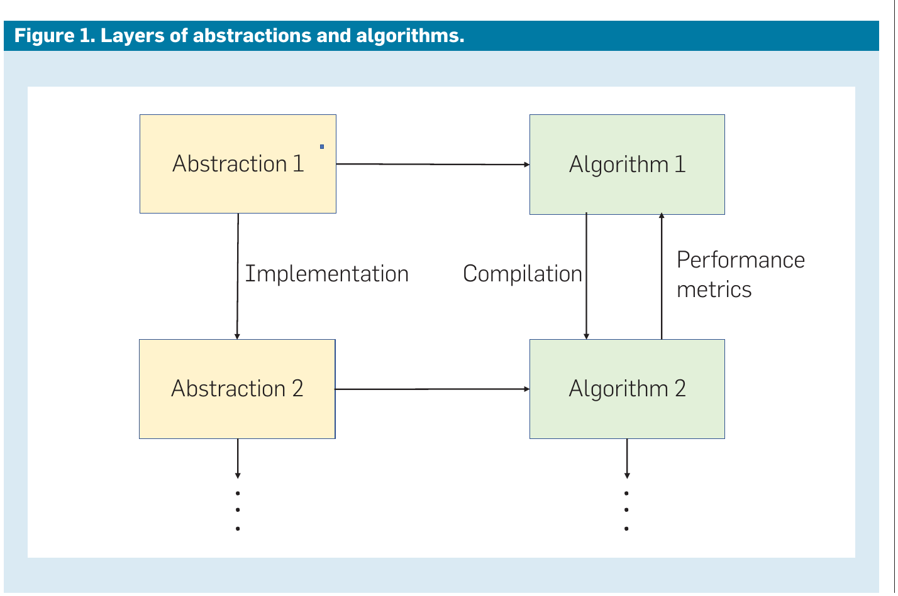
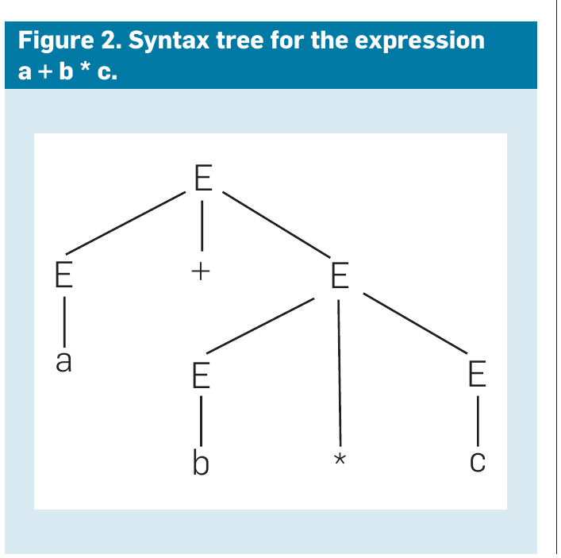
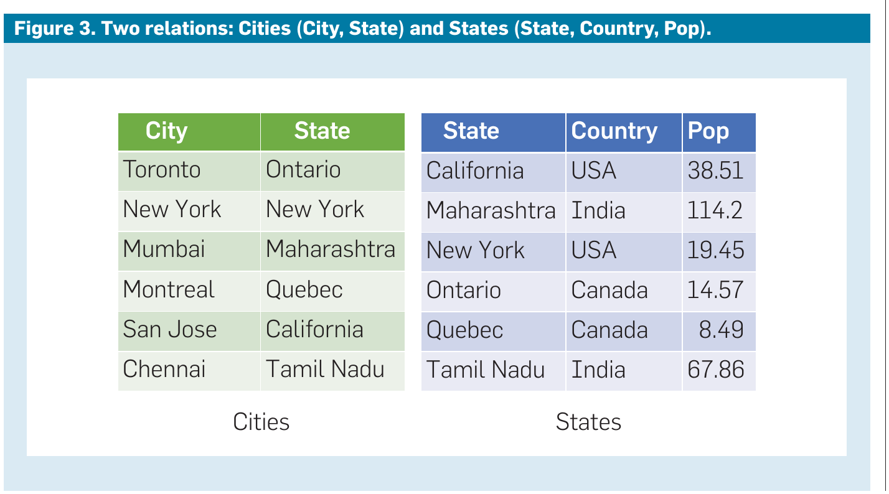
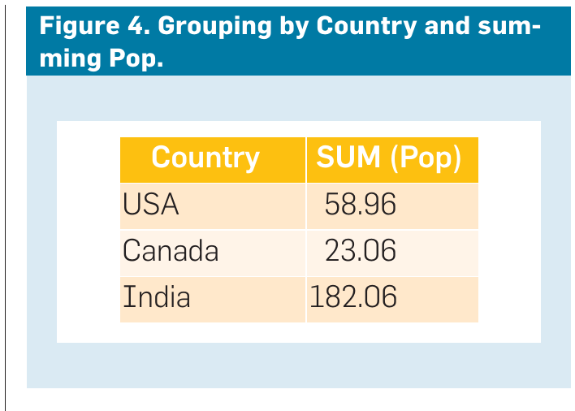
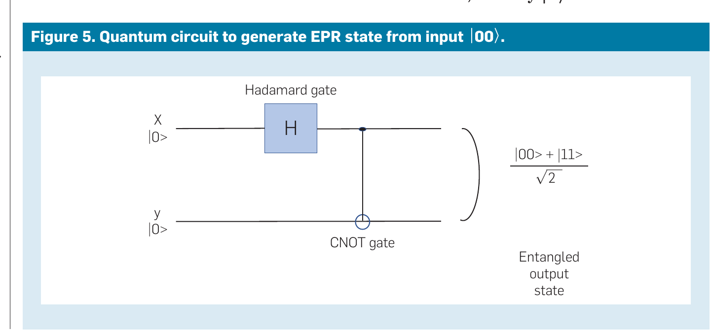

# 抽象、它们的算法与它们的编译器

**Abstractions, Their Algorithms, and Their Compilers**

> 作者 阿尔弗雷德·阿霍(Alfred V. Aho)、杰弗里·乌尔曼(Jeffrey D. Ullman)
> 2020 年 ACM 图灵奖演讲
> 原载 *Communications of the ACM*, Vol. 65, No. 2 (2022 年 2 月), pp. 76–91
> DOI 10.1145/3490685
> 译自 `3490685.pdf`(个人学习用途)

> 阿尔弗雷德·阿霍(Alfred V. Aho)与杰弗里·乌尔曼(Jeffrey D. Ullman)是 2020 年 ACM A.M. 图灵奖得主。他们因在程序设计语言实现的基础算法和理论方面的开创性贡献,以及将这些成果与他人的研究综合进极具影响力的著作中,从而教育了几代计算机科学家而获得表彰。

## 1. 抽象

计算思维(Computational Thinking)的核心在于为问题设计抽象,以便通过计算步骤和高效算法来解决。这一概念不仅服务于计算机科学(CS),而且正逐渐渗透到更多的科学领域和日常生活中。自周以真(Jeannette Wing)发表了关于计算思维的极具影响力的论文 [50]〔译注1〕以来,关于计算思维的讨论在规模上已大大扩展,涵盖了诸如将自然过程建模为信息处理等主题 [18]。

计算思维的核心是抽象,这也是本文的主题。虽然抽象一直是计算机科学的重要组成部分,但现代对计算思维的强调突显了在向广大受众教授 CS 时抽象的重要性。

抽象在塑造几乎每一个科学领域中都发挥着重要作用。然而,在计算机科学中,抽象并不受物理现实的束缚,因此我们发现有用的抽象遍布整个领域。例如,我们将在第 4 节中遇到一个来自物理学的重要抽象:量子力学。由此衍生出一个名为量子电路(quantum circuits)的计算抽象,它始于物理思想,但已发展出用于模拟的程序设计语言,以及利用其独特能力、有朝一日可能在大型机器上实现的理论算法。

计算机科学中的每一个抽象都由以下部分组成:

1. **数据模型**:一种或多种类型的数据,以及它们之间可能的联系。例如,无向图可以描述为由一组节点和一组边组成,每条边是两个节点的集合。
2. **操纵该数据的方法**:即某种程序设计语言。这可能是一种传统的程序设计语言,也可能像几个特定操作那样简单。这种语言总是具有形式语义(formal semantics)——即关于程序如何影响数据的规范。

请注意,正是第二部分将计算机科学中的抽象与其他领域的抽象区分开来。

因此,每种抽象都允许我们设计算法以某些特定方式操纵数据。我们希望设计"好"的抽象,而抽象的好坏是多维度的。抽象在设计解决方案时的易用性是一个重要指标。例如,我们将在第 3.1 节讨论关系模型如何导致数据库使用的普及。还有其他性能指标,例如所得算法在串行或并行机器上的运行时间。

同样,我们青睐那些易于实现且易于为重要问题创建解决方案的抽象。最后,一些抽象提供了一种衡量算法效率的简单方法(正如我们可以找到传统程序设计语言中程序的运行时间"大 O"估计),而其他抽象则要求我们在讨论算法效率(哪怕是近似值)之前,先指定较低层次的实现。

### 1.1. 编译

有些抽象处于足够高的层次,以至于它们不提供有意义的性能指标。因此,高层抽象的操作可能需要在较低层次上实现——一个更接近我们所认为的程序执行的层次。事实上,可能存在多个抽象层次,它们逐渐接近机器本身。如图 1 所示,高层抽象(抽象 1)的操作可以由低层抽象(抽象 2)实现,而后者又可以由更低层的抽象(图中未显示)实现。存在有趣的抽象层次结构,将我们从高层程序带到机器指令、物理硬件、逻辑门、晶体管,最后到电子。然而,我们将只专注于较高的层次。



**图 1.** 抽象层次。


使用抽象 1 的操作的算法被编译成低层抽象 2 中的算法。在本文中,我们将在非常广义的意义上使用"编译器"(compiler)一词——不仅指作为《龙书》[9]〔译注2〕核心关注点的传统程序设计语言编译器,还指任何将一种抽象的程序转换为第二种(通常是更低层)抽象的程序的算法。

因此,在某些情况下,编译过程是直接的,高层的每个操作都被低层的一个或多个特定操作所取代。在其他情况下,特别是当编译是从传统语言(如 C)到机器级语言时,翻译算法非常复杂。在另外一些情况下,例如当高层抽象使用强大的代数操作(如线性代数或关系代数)时,优化至关重要,因为幼稚的编译通常会导致算法耗时比优化编译生成的算法多出几个数量级。

抽象 2 可能足够接近机器,从而具有有意义的性能指标。如果是这样,抽象 1 可以继承这些指标,为在抽象 1 中编写的算法提供质量概念。然而,我们应该记住,高层抽象通常可以用几种不同的低层抽象来实现。这些抽象中的每一个都可能提供截然不同的运行时间或其他指标概念,从而暗示高层算法优劣的不同概念。

**例 1.1**。对于许多读者来说应该很熟悉的一个例子(我们将在第 2.1 节详细讨论),抽象 1 可以是正则表达式(RE),其数据模型是字符串集合,其"程序设计语言"是由并、连接和克莱尼星号(Kleene star)〔译注3〕这三种操作构成的正则表达式。我们可以通过将正则表达式转换为确定性有限自动机(DFA)来实现它们,因此 DFA 扮演了抽象 2 的角色。正则表达式抽象中的算法就是正则表达式本身。该算法可以被"编译"成 DFA,而 DFA 又在某种传统程序设计语言中被"编译"(即模拟),后者又被编译成机器语言。给定一个合理的模拟,DFA 的运行时间是每个输入符号 \(O(1)\)。因此,原始正则表达式的运行时间也是每个输入符号 \(O(1)\),尽管仅根据正则表达式的定义,这一点远非显而易见。

### 1.2. 抽象的分类

我们可以根据其预期用途识别出至少四种不同类型的抽象。在构成本文主体的讨论中,我们将给出每种抽象的例子并探讨它们的相互作用。

#### 1.2.1. 基础抽象(Fundamental abstractions)

与所有抽象一样,这些抽象由数据模型和操作组成。这些抽象通常被认为是面向对象程序设计语言中实现的抽象数据类型 [31, 46]。然而,基础抽象没有特定的操作实现或特定的数据结构来表示其数据。人们也可以将这些抽象比作 Java 中的接口 [48],但与接口不同,这些抽象的操作具有预期的含义,而不仅仅是操作的名称。

研究基础抽象实际上有两个略有不同的目的。在某些情况下,它们代表了值得独立研究且具有多种实现方法的通用操作。例如,我们将在第 1.4 节讨论字典(具有插入、删除和查找操作的集合)。此类抽象的其他例子包括栈、队列、优先队列以及我们在 Aho 等人 [7] 和 Aho 与 Ullman [10] 中编目的许多其他抽象。

其他抽象足够广泛,可以支持应用程序的大型组件。熟悉的例子包括各种树和图——例如有向图、无向图、带标签图和不带标签图。我们将在第 2.3 节讨论一个重要的例子——流图。这些抽象具有一套广泛的操作,可以以各种方式组合。然而,操作本身并不是图灵完备的(能够描述图灵机可以执行的任何计算)。相反,它们被假定嵌入在一种图灵完备的语言中,使用该模型的算法就是在这种语言中构建的。例如,在图抽象中,我们可能有一个诸如"查找相邻节点"的操作。在该抽象之外,我们可能假设存在一种程序设计语言,允许对所有相邻节点进行迭代。该操作的实现和图本身的表示未指定,因此我们没有具体的运行时间概念。我们可以将这些抽象与面向对象程序设计语言中的典型类及其方法进行类比。区别在于类的方法在底层程序设计语言中具有特定的实现。我们同样可以将程序设计语言库或 TeX 宏包视为此类抽象。

#### 1.2.2. 抽象实现(Abstract implementations)

这些代表了实现方法,通常是一个或多个基础抽象的实现。这些本身不是图灵完备的语言,它们通常可以被编译成几种不同的机器模型——例如串行或并行机器,或者假设主存或二级存储的模型。这些机器模型中的每一个都提供了一个运行时间概念,该概念可以转化为抽象实现的运行时间,然后再转化为所支持的基础抽象的运行时间。例如,我们将在第 1.6 节讨论哈希表作为字典的一种实现。许多其他数据结构也属于这一类,例如链表或各种类型的树(见第 1.5 节和第 1.7.2 节)。这一组中还有自动机,如确定性或非确定性有限自动机(见第 2.1.1 节和第 2.1.3 节)以及移进-归约解析器(见第 2.2.1 节)。

#### 1.2.3. 声明式抽象(Declarative abstractions)

抽象最重要的用途之一是促进一种编程风格,即你说明想要做什么,而不是如何去做。因此,我们发现了许多不同的抽象,它们由数据模型和比传统语言更高层次的程序设计语言组成;这些语言通常是某种代数。例子包括正则表达式(将在第 2.1 节讨论)和关系代数(我们将在第 3 节提到)。上下文无关文法(第 2.2 节)是此类抽象的另一个例子,尽管严格来说不是代数。

这些抽象的特殊特征是它们的编译需要相当程度的优化。与传统语言的优化(你很高兴能将一台机器上的运行时间提高两倍)不同,对于这些抽象,好坏实现之间的运行时间可能存在几个数量级的差异。另一个特征是声明式抽象的程序设计语言不是图灵完备的。任何图灵完备语言的不可判定性都将排除有效且通用地处理程序想要做什么而不被告知如何做的优化器的存在。

#### 1.2.4. 计算抽象(Computational abstractions)

与抽象实现相反,这些抽象接近于物理实现的机器。也就是说,没有人会为了实现一个抽象实现而专门建造一台机器,但人们通常会实现一个计算抽象或易于翻译成它的东西。因此,计算抽象提供了有意义的性能指标,即使它们不是 100% 准确。

你可能熟悉许多此类抽象,因为它们包括所有通用的程序设计语言以及机器指令集。此类抽象的其他例子更具理论性,例如随机存取机(RAM)模型 [19] 或并行 RAM (PRAM)模型 [20]〔译注4〕。在这里,我们将在第 1.7 节讨论一种强调二级存储作用的传统机器模型。我们还将讨论并行计算的抽象:第 3.5 节的大块同步(bulk-synchronous)和第 3.6 节的 MapReduce。

虽然许多计算抽象与传统计算机有关,但也存在一些例外。图灵机 [43] 就是一个,还有一些甚至不是图灵完备的,但在计算机科学中发挥着重要作用。例如,继周以真(Claude Shannon)的硕士论文之后,布尔电路和布尔代数是发展中的计算科学中最早使用的抽象。而我们将在第 4 节讨论的量子电路抽象则是最新的抽象之一。

### 1.3. 一些分类学评论

我们并不声称这种分类是详尽无遗的,也不声称它是最好的分类。欢迎读者对这一结构进行补充或重新思考。然而,我们确实相信这种组织反映了计算机科学领域四个最重要的发展。基础抽象在某种意义上是由应用需求决定的。另一方面,抽象实现代表了计算机科学家为支持基础抽象而做出的反应,它们代表了许多关于数据结构的最早思考。声明式抽象代表了计算机科学通过支持将大型复杂操作封装为单个步骤的记号,使编程变得越来越容易的趋势。而计算抽象则代表了不断变化的硬件技术对我们计算方式的影响。

### 1.4. 抽象空间的探索

为了对抽象链的性质及其关系获得一些视角,我们将看一个基础抽象的常见例子:字典(dictionary)。然后我们将探索其下方的实现层次及其对运行时间评估的影响。

**例 1.2**。字典是具有许多替代实现的抽象的常见例子,并说明了当高层抽象被编译成低层抽象时出现的一些问题。字典的数据模型由以下部分组成:

1. 一个全集 \(U\)。
2. \(U\) 的一个子集 \(S\)。最初,\(S\) 为空。

字典的"程序设计语言"由以下三个操作的直线序列组成:

1. `insert$x$`:如果元素 \(x \in U\) 尚不在集合 \(S\) 中,则将其插入;\(S := S \cup \{x\}\)。
2. `delete$x$`:从 \(S\) 中移除 \(x\);\(S := S - \{x\}\)。
3. `lookup$x$`:如果 \(x \in S\) 则返回 true,否则返回 false。

例如,字典可以用来描述编译器中符号表(symbol table)的行为。\(U\) 将是程序设计语言中可能标识符的集合。当编译器扫描程序时,\(S\) 将是在程序每个点具有定义含义的标识符集合。然而,对于符号表,你需要为每个标识符附加数据——例如,它的定义数据类型和它出现的嵌套块层次(以便我们可以区分同名的标识符)。当编译器发现声明时,它将声明的标识符插入集合 \(S\)。当它到达过程或函数的末尾时,它删除与该程序块关联的标识符。当程序中使用标识符时,编译器查找该标识符并检索其类型和其他必要信息。

请注意,字典的程序设计语言相当琐碎,它肯定不具备图灵机的能力。此外,没有真正的算法设计概念,因为"程序"只是其他过程正在做的事情的反映——例如例 1.2 中提到的符号表操作。同样,没有真正的运行时间概念,因为不清楚每个操作需要多长时间。我们可以定义每个操作花费单位时间,但由于我们无法控制"程序"的长度,这种运行时间没有意义。

### 1.5. 字典的实现

许多不同的抽象实现可以用来实现字典。链表(linked list)可以胜任,尽管即使对于最高效的列表实现,它们也不提供良好的运行时间。

**例 1.3**。链表是所有人都应该熟悉的抽象实现。其数据模型由以下部分组成:

1. 包含一个值(某个全集 \(U\) 的成员)和指向另一个单元(可能为空)的链接的单元(cell)。
2. 标题(header),即指向单元的命名链接(可能为空)。

我们假设读者熟悉典型的允许操作,如创建单元或标题、从列表中插入和删除单元,以及返回指定单元中包含的数据。你可以通过将集合 \(S\) 中的所有元素制成链表来实现字典。将三个字典操作编译成列表操作是直接的。

如果我们假设链表是在计算机的 RAM 模型中实现的,我们就有了现实的运行时间概念。我们可以为列表单元上的每个基本操作分配一个时间单位,因为我们知道在 RAM 上,这些操作中的每一个都将花费恒定的时间,与集合 \(S\) 的大小无关。这一观察让我们将 RAM 的运行时间概念提升到链表的运行时间概念,然后再提升到字典的层次。不幸的是,消息并不乐观。平均而言,我们必须遍历至少一半的列表,通常是一直遍历到末尾,才能实现任何字典操作。因此,单个字典操作的运行时间与当时集合 \(S\) 的大小成正比。

另一类众所周知的实现字典的抽象使用搜索树。当三个字典操作的算法保持树平衡时——例如 AVL 树 [2] 或红黑树 [22]——每个操作的运行时间与操作时集合 \(S\) 大小的对数成正比。但通常首选的实现字典的抽象是哈希表(hash table) [36],我们接下来将考虑它。

### 1.6. 哈希抽象

哈希(Hash)的数据模型由以下部分组成:

1. 一个全集 \(U\)。
2. 若干个桶(bucket) \(B\);桶的编号从 \(0\) 到 \(B - 1\)。
3. 一个从 \(U\) 到 \(\{0, 1, \dots, B - 1\}\) 的哈希函数 \(h\)。每个桶 \(b\) 是 \(U\) 中满足 \(h(x) = b\) 的那些元素 \(x\) 的子集。

通常的操作是计算 \(h(x)\)(其中 \(x \in U\)),并在编号为 \(h(x)\) 的桶中插入、删除或查找 \(x\)。例如,哈希表的插入操作将表示为 `h-insert(x, b)`,其中 \(b = h(x)\)。哈希程序由交替计算某个 \(h(x)\) 然后对 \(x\) 和桶 \(h(x)\) 执行三个操作之一组成。

将字典程序编译成哈希程序很简单。例如,字典操作 `insert$x$` 被翻译为 `b := h$x$; h-insert$x, b$`。

哈希不够接近机器,以至于我们无法直接使用它来确定运行时间。一个问题是哈希相当不寻常,因为在最坏情况下(集合 \(S\) 的所有元素都落入同一个桶中),其性能比平均情况(对所有可能的哈希函数取平均)要差得多。为了简单起见,我们将正确地假设在平均情况下,几乎所有桶包含的元素数量都接近平均值——即 \(|S|/B\)。但即使我们同意只讨论平均情况,我们仍然不知道对一个元素和一个桶的每个操作需要多长时间。

本质上,每个桶本身就是一个小字典,所以我们必须决定如何实现它的操作。如果 \(S\) 的大小保持在 \(B\) 的数量级,我们可以使用桶的链表实现,并期望每个操作在 RAM 或真实机器上花费 \(O(1)\) 的平均时间。然而,如果 \(|S|\) 远大于 \(B\),那么表示桶的列表的平均长度是 \(O(|S|/B)\)。这仍然优于链表情况下的每个操作 \(O(|S|)\)。然而,当 \(S\) 如此之大以至于无法放入主存时,RAM 模型就不再适用,我们需要考虑另一种完全不同的计算抽象。

### 1.7. 二级存储抽象

作为 RAM 计算抽象(其中任何数据都可以在 \(O(1)\) 时间内访问)的替代方案,我们可以在多个层次上引入访问局部性。我们将只讨论一种具有基于磁盘的二级存储的抽象,其中大数据块(例如 64KB)在磁盘和主存之间作为一个整体移动。数据如果要被读取或写入,必须在主存中。与数据在主存中时对其执行典型操作的成本相比,在主存和二级存储之间移动一个块的成本非常大。因此,在这个新模型中,将运行时间简单地视为磁盘 I/O 的次数——即块从二级存储移动到主存或反之亦然的次数——变得合理。〔译注5〕

在底层机器的二级存储模型中,实现哈希表的最佳方式与使用 RAM 模型时的首选方法略有不同。特别是,每个桶将由一个或多个完整的磁盘块组成。为了利用局部性,我们希望典型的桶由尽可能少的磁盘块组成,但我们希望让这些磁盘块尽可能满。因此,假设主存能够容纳全集的 \(M\) 个元素,而磁盘块容纳 \(P\) 个此类元素。那么我们希望桶的数量 \(B\) 为 \(B = M/P\),这样我们就可以在主存中为每个桶保留一个磁盘块,并且该块很可能接近满。

随着集合 \(S\) 大小的增长,我们使用磁盘块的链表来表示每个桶,其中只有第一个块在主存中。三个字典操作在最坏情况下要求我们检查单个桶中的所有磁盘块。因此,平均而言,我们期望每个操作的磁盘 I/O 次数为 \(O(|S|/BP)\),因为 \(S\) 的元素将大致均匀地分布在 \(B\) 个桶中,并且一个桶的元素将以 \(P\) 个一组打包进磁盘块。由于 \(B = M/P\),每个操作的运行时间为 \(O(|S|/M)\)。

#### 1.7.1. 通过哈希进行的数据库操作

这个运行时间令人印象深刻吗?并不尽然。如果我们使用了链表实现但允许列表随机增长到磁盘上,我们可以使用 \(M\) 个桶,平均每个桶将由长度为 \(|S|/M\) 的链表表示。即使列表上的每个单元都在不同的磁盘块中,我们每个字典操作仍然只需要 \(O(|S|/M)\) 次磁盘 I/O。然而,数据库管理领域有一类重要的操作,磁盘块模型在其中产生了重要的效率。在这些操作中(哈希连接 [25] 是一个主要例子),我们只需将集合 \(S\) 划分为桶,而既不删除也不查找元素。

**例 1.4**。让我们考虑一个比哈希连接更简单的问题,但在基于磁盘的抽象中具有类似的解决方案。假设给定一个由对 \((x, y)\) 组成的集合 \(S\),我们想通过计算一个表来对 \(x\) 进行聚合,该表为每个 \(x\) 提供相关 \(y\) 的总和。我们假设 \(S\) 很大,以至于无法放入主存。如上所述,我们将使用 \(B = M/P\) 个桶,但我们的哈希函数只是 \(x\) 的函数,而不是 \(y\) 的函数。然后我们将 \(S\) 的每个成员插入适当的桶中。最初,主存中每个桶的块都是空的。当它填满时,我们将其移动到磁盘,并在主存中为该桶创建一个新的空块。新块链接到我们刚刚移动到磁盘的块,后者又链接到该桶之前的块(如果有)。整个 \(S\) 的划分所需的磁盘 I/O 次数大约是容纳 \(S\) 所需的块数——即 \(|S|/P\)。这是处理该大小集合所需的最小可能磁盘 I/O 次数。

然后,我们一次处理一个桶。假设桶本身足够小,可以放入主存——即 \(|S| \le M^2/P\)——我们只需要将每个磁盘块移动到主存一次。由于一个桶包含具有给定 \(x\) 的所有或不包含任何对 \((x, y)\),我们可以依次对每个桶按 \(x\) 的值进行排序,从而为哈希到该桶的每个 \(x\) 计算 \(y\) 的总和。由于在这个模型中我们只计算磁盘 I/O,而事实上排序一个桶的时间通常小于将其块移入或移出主存的成本,因此该算法的运行时间(即 \(O(|S|/P)\) 次磁盘 I/O)是现实的,并且在很小的常数因子内是能想象到的最好的。

#### 1.7.2. B 树

二级存储抽象的另一个有趣结果是,它提供了一种字典抽象的实现,通常比哈希更高效。在 RAM 计算模型中,即使是平衡搜索树通常也不被认为比哈希表实现字典更高效。但在二级存储模型中,平衡搜索树的类似物确实非常高效。B 树 [13] 本质上是一棵平衡搜索树,其中树的节点是完整的磁盘块。每个叶节点块容纳了被表示集合 \(S\) 的一半到全部成员。此外,每个内部节点至少半满,包含分隔其子树内容的值以及指向这些子节点的指针。

由于磁盘块很大,每个内部节点都有许多子节点,以至于在实践中即使是非常大的集合也可以存储在三层 B 树中。此外,至少根节点,或许还有根节点的子节点,都可以存储在主存中。结果是,除了偶尔用于重新平衡树的磁盘 I/O 外,每个插入或删除操作只需要两到四次 I/O,而查找操作只需要一到两次 I/O。

## 2. 编译器的抽象

现代编译器将翻译过程细化为多个阶段的组合,每个阶段将源程序的一种表示形式翻译成另一种语义等价的表示形式,通常处于较低的抽象层次。编译器的阶段通常包括词法分析、语法分析、语义分析、中间代码生成、代码优化和目标代码生成。一个由所有阶段共享的符号表用于收集并提供源程序中各种构造的信息。前四个阶段通常被称为编译器的前端(front end),最后两个阶段被称为后端(back end)。

编译器实现的进步史涉及许多重要的抽象。我们将专门讨论三种此类抽象:正则表达式、上下文无关文法和流图。前两者是具有有趣优化故事的声明式抽象。第三种虽然不是声明式的,但也提出了有趣的实现挑战。

### 2.1. 正则表达式与词法分析

词法分析是编译器的第一个阶段,它将源程序作为字符序列读取,并将其映射为称为记号(tokens)的符号序列,这些记号被传递给下一个阶段——语法分析器。

**例 2.1**。如果源程序包含语句:
```
fahrenheit = centigrade * 1.8 + 32
```
词法分析器可能会将此语句映射为由七个记号组成的序列:
```
<id> <=> <id> <*> <real> <+> <int>
```
这里,`id` 是任何程序变量或标识符的记号。运算符 `=`, `*` 和 `+` 本身就是记号,两个常量分别被转换为记号 `real` 和 `int`。〔译注6〕

编译器构造的一个重大进步是词法分析器生成器(lexical-analyzer generator)的创造——例如 Lex [30] 这样的程序,它接受记号的描述作为输入,并生成一个程序,该程序将源程序分解为记号并返回与源程序对应的记号序列。使 Lex 成为可能的抽象是正则表达式 [26]。

正如克莱尼(Kleene)最初定义的那样,我们可以将正则表达式视为一种抽象,其数据模型是特定字符字母表(例如 ASCII)上的字符串,其程序设计语言是具有并(union)、连接(concatenation)和克莱尼星号(即"任意数量")运算符的代数。我们假设读者熟悉这些运算符及其对字符串集合的影响。在实践中,使用正则表达式抽象的系统(如 Lex)采用了一些有用的简写,使编写正则表达式更容易,但不改变该抽象可以定义的字符串集合。

**例 2.2**。某些程序设计语言中合法标识符的字符串集合可以定义如下:
```
letter = [a-zA-Z]
digit = [0-9]
id = letter(letter+digit)*
```
在这种简写中,像 `a-z` 这样的表达式代表 ASCII 码在 `a` 和 `z` 之间的单字符字符串的并。因此,在原始的三个运算符中,`letter` 的正则表达式是:
```
a+b+... +z+A+B+... +Z
```
数字的定义类似,然后记号 `<id>` 的字符串集合被定义为由任何字母后跟任何零个或多个字母和/或数字组成的字符串。

#### 2.1.1. Lex 之前:文献检索

从理论研究中可以清楚地了解到,正则表达式抽象可以被编译成几种抽象实现之一,例如确定性或非确定性有限自动机(分别为 DFA 和 NFA)。然而,当实际问题需要解决方案时,仍有一些技术有待发现。一个有趣的步骤是在贝尔实验室(Bell Laboratories)迈出的,这与第一次尝试自动化检索相关文献有关。他们磁带上存有整个贝尔实验室图书馆的藏书书名,并开发了软件来接受关键词列表并查找包含这些关键词的文档。然而,当给定一个很长的关键词列表时,搜索速度很慢,因为它对磁带上的每个关键词都进行了一次扫描。

阿霍(Aho)和科拉西克(Corasick) [6] 做出了一项重大改进。他们没有分别搜索每个关键词,而是将关键词列表视为包含任何关键词出现的字符串集合的正则表达式,即:
```
.*(keyword1 + keyword2 + ... + keywordk).*
```
请注意,点号 `.` 是一个扩展,代表"任何字符"。该表达式被转换为确定性有限自动机。这样,无论涉及多少个关键词,都可以对磁带进行单次扫描。有限自动机对每个书名检查一次,看其中是否包含任何关键词。

#### 2.1.2. 词法分析器生成器的设计

本质上,像 Lex 这样的词法分析器生成器使用与第 2.1.1 节相同的思想。我们为每个记号编写正则表达式,然后对这些表达式应用并运算符。该表达式被转换为确定性有限自动机,并从程序的某个点开始工作。该自动机将读取字符,直到找到与记号匹配的字符串前缀。然后,它从输入中移除已读取的字符,将该记号添加到其输出流中,并重复该过程。

还有一些额外的考虑因素,因为与关键词不同,记号之间可能存在一些复杂的相互作用。例如,`while` 看起来像一个标识符,但它实际上是程序中用于控制流的关键词。因此,当看到这个字符序列时,词法分析器必须返回记号 `<while>`,而不是 `<id>`。在 Lex 中,正则表达式在输入文件中列出的顺序打破了此类歧义,因此你只需在标识符之前列出关键词,以确保关键词被视为关键词,而不是标识符。另一个问题是某些记号可能是另一个记号的前缀。如果输入中的下一个字符是 `=`,我们就不希望将 `<` 识别为记号。相反,我们希望将 `<=` 识别为记号。为了避免此类错误,词法分析器被设计为只要目前看到的内容被有限自动机接受为合法记号,就继续读取。

#### 2.1.3. DFA 的惰性求值

还有一种优化可以提高使用正则表达式抽象的算法的运行时间:惰性求值(lazy evaluation)。你可能熟悉将正则表达式转换为确定性有限自动机的标准方法。正则表达式首先通过麦克诺顿(McNaughton)和山田(Yamada)的算法 [34] 转换为非确定性有限自动机。这种转换很简单,如果正则表达式的长度为 \(n\),则产生一个最多有 \(2n\) 个状态的 NFA。麻烦始于将 NFA 转换为 DFA,这需要拉宾(Rabin)和斯科特(Scott)的子集构造法 [38]。在最坏情况下,该构造可以将具有 \(2n\) 个状态的 NFA 转换为具有 \(2^{2n}\) 个状态的 DFA,这即使对于相对较短的正则表达式也是不可用的。在实践中,最坏情况很少见——例如,为典型程序设计语言的词法分析构造的 DFA 的状态数甚至可能不会超过其每个记号的正则表达式长度之和。

然而,正则表达式还有其他应用,在这些应用中,接近最坏的情况确实会发生。最早的 UNIX 命令之一是 `grep`,代表"获取正则表达式并打印"(get regular expression and print)。该命令接受一个字符串,并确定它是否具有给定正则表达式语言中的子串。最简单的实现是将正则表达式转换为 NFA,然后再转换为 DFA,并让 DFA 读取字符串。当 DFA 很大时,将 NFA 转换为 DFA 所花费的时间远多于扫描字符串所花费的时间。

然而,当正则表达式仅用于扫描一次字符串时,有更高效的方法来实现像 `grep` 这样的命令。肯·汤普森(Ken Thompson)的第一篇研究论文 [42] 表明,与其将一个小 NFA 转换为一个大 DFA,不如直接模拟 NFA 更高效。也就是说,读取字符串的 NFA 在读取每个字符后通常处于一组状态中。因此,只需跟踪每个字符后的那些 NFA 状态,并在读取下一个字符时,根据前一组状态构建在该字符上可达的状态集。

通过 NFA 到 DFA 的惰性转换可以实现更高的效率。也就是说,一次读取一个输入字符,并随读随记,将到目前为止读取的前缀实际产生的 NFA 状态集制成表。这些 NFA 状态集对应于 DFA 状态,因此我们只构建处理这个特定输入字符串所需的 DFA 转换表部分。如果给定正则表达式的 DFA 不太大,大部分或全部 DFA 将在处理完字符串之前构建完成,我们就获得了直接使用 DFA 而不是在字符串的每个字符后构造 NFA 状态集的益处。但如果 DFA 比字符串大,我们永远不会构建 DFA 的大部分,因此我们获得了两种情况的最佳效果。这一改进在名为 `egrep` [4] 的 `grep` 版本中得以实现。

### 2.2. 上下文无关文法与解析

编译器的第二个阶段是语法分析器(syntax analyzer)或"解析器"(parser),它将词法分析器产生的记号序列映射为一种树状表示,使记号序列中的语法结构显式化。典型的表示是语法树(syntax tree),其中每个内部节点代表某种结构,该节点的子节点代表该结构的组件。

**例 2.3**。例如,语法分析器可能会将记号序列 `a + b * c` 映射为图 2 所示的语法树。这里,`E` 代表表达式。操作数 `a`, `b` 和 `c` 本身就是表达式。但 `b * c` 也是一个表达式,由运算符记号 `*` 和两个表达式 `b` 与 `c` 组成。在根部,我们看到另一个表达式,这个表达式使用了运算符 `+` 和两个操作数表达式 `a` 与 `b * c`。

重要的是要观察关于运算符优先级的许多约定之一。通常,乘法优先于加法,这就是为什么语法树在加 `a` 之前先将 `b` 乘以 `c`,而不是先加 `a` 和 `b`。



**图 2.** 表达式 a + b * c 的语法树。

给定程序设计语言的语法树所需结构通常由声明式抽象——上下文无关文法(CFG)定义,我们期望你熟悉这一概念。CFG 是称为产生式(productions)的规则集合,提供了从其他语法类别和终结符(即词法分析器产生的记号)构建各种语法类别(如表达式或语句)的方法。例如,如果 `E` 代表语言中格式良好的表达式的语法类别,那么我们可能会发现如下规则:
```
E -> E + E
```
意味着构建表达式的一种方法是在两个较小的表达式之间放一个加号。

#### 2.2.1. LR(k) 解析

在 20 世纪 60 年代,关于如何从 CFG 构造高效的语法分析器有一系列提议。人们认识到,对于通用的程序设计语言,只要文法具有某些属性,就可以对程序进行单次从左到右的扫描,而无需回溯,并根据该语言的文法构建语法树。

有些决定很棘手。例如,在处理表达式 `a + b * c` 时,仅读取 `a + b` 后,你必须决定是否将表达式 `a` 和 `b` 与加号结合以构成一个更大的表达式。如果你向后看一个记号并看到 `*`,你就知道结合 `a` 和 `b` 是不正确的,相反,你必须继续进行,最终将 `b` 与 `c` 结合。只有在那一点上,将 `a` 与表达式 `b * c` 结合才是正确的。

这种风格的语法分析被称为移进-归约解析(shift-reduce parsing)。你维护一个符号栈,符号可以是记号或语法类别。当你扫描输入时,你在每一步决定是移进(shift)下一个输入记号(将其压入栈中),还是归约(reduce)栈顶的符号。当你归约时,被归约的符号必须是 CFG 某个产生式的右侧。这些符号从栈中弹出,并被同一产生式的左侧替换。此外,你为产生式左侧的符号创建一个语法树节点。它的子节点是刚刚从栈中弹出的符号对应的树的根。如果从栈中弹出的是记号,它的树只是一个单节点;但如果弹出的是语法类别,那么它的树就是之前为栈上该符号构建的任何内容。

在总结于 Aho 等人 [9] 的一系列日益通用的提议之后,唐纳德·克努斯(Don Knuth)提出了 LR(k) 解析 [27],它本质上适用于可以在单次从左到右扫描输入的情况下正确解析的最通用的文法类,使用移进-归约范式并最多向后看 \(k\) 个输入符号。这项工作似乎解决了语法分析器应如何构造的问题。然而,并非每个 CFG,甚至并非典型程序设计语言的每个 CFG 都满足成为任何 \(k\) 的 LR(k) 文法所必需的条件。虽然通用的程序设计语言似乎确实具有 LR(1) 文法——即可以使用仅一个符号的向后看进行移进-归约解析的文法——但这些文法设计起来相当复杂,并且通常具有比直觉所需的语法类别多出一个数量级的语法类别。

例如,你不需要为所有表达式设置一个语法类别,而是需要为语言中的每个运算符优先级层次设置一个语法类别,通常有十几个或更多层次。

#### 2.2.2. 解析器生成器 Yacc

因此,在克努斯的论文发表后,人们进行了几次尝试,试图找到使用 LR(1) 解析方法但使其适用于更简单 CFG 的方法。我们受到了普林斯顿大学的一位研究生同学阿尔·科伦雅克(Al Korenjak)的启发,他的论文是关于压缩 LR(1) 解析器的方法 [28]。我们想到,对于通用的语言,可以从一个不是 LR(1) 的文法开始,仍然为该文法构建一个从左到右的移进-归约解析器。当一个文法不是 LR(1) 时,会出现一些情况,文法告诉我们要归约和移进,或者使用两个不同的产生式进行归约。但我们可以通过考虑运算符的优先级并向后看一个输入记号来解决实际情况中的歧义。

**例 2.4**。考虑例 2.3 中建议的情况。在处理了输入 `a + b * c` 的 `a + b` 之后,我们在栈顶会有 `E + E`,其中 `a` 和 `b` 之前都已被归约为表达式。存在产生式 `E -> E + E`,因此我们可以将 `E + E` 归约为一个 `E`,并构建一个标签为 `E`、子节点为 `E`, `+` 和 `E` 的解析树节点。但 `*` 优先于 `+` 这一事实,以及我们看到 `*` 作为下一个输入符号,告诉我们移进 `*` 到栈上才是正确的。稍后,我们也移进 `c` 并将 `c` 归约为表达式 `E`。此时我们在栈顶有 `E + E * E`。我们正确地将顶部的三个符号归约为一个 `E`,留下 `E + E`。现在,将这些符号归约为一个 `E` 是正确的,因为输入中没有剩余内容(或者输入中有其他不属于表达式的内容,例如结束语句的分号)。通过这种方式,我们将产生如图 2 所示的语法树。

我们在贝尔实验室的同事史蒂夫·约翰逊(Steve Johnson)采用了这个想法,并实现了一个名为 Yacc [8] 的解析器生成器。为了帮助解决移进和归约动作之间,或两个不同产生式归约之间的歧义,Yacc 使用产生式出现的顺序。在两个产生式都可以用于归约的情况下,首选先出现的产生式。为了解决移进和归约之间的冲突,假设在 Yacc 输入文件中先出现的运算符具有优先级。〔译注7〕

Yacc 很快成为实现编译器的必备工具——不仅是通用程序设计语言的编译器,还有许多用途更有限的"小语言"(little languages)的编译器。与 Lex 一起,Yacc 提供了一种简单的方法来实验新语言语法结构的设计。这两个工具经常用于学术界的一学期编译器课程中,学生在课程中设计并实现一种新的领域特定程序设计语言 [5]。

### 2.3. 流图与代码优化

编译器的代码优化阶段接受源程序的中间形式,通常是像三地址代码(three-address code)之类的东西。在那里,大型表达式被分解为简单的步骤,其中(最多)两个操作数应用单个运算符以产生单个结果——例如 `a := b + c`。三地址代码使用其他步骤,例如基于单个值的分支,但我们在这次简短的讨论中将忽略这些。

代码优化的一个关键抽象是流图(flow graph)。流图起源于维索茨基(Vyssotsky)和韦格纳(Wegner) [45],对该抽象算法的科学研究通常被认为始于艾伦(Allen)的工作 [11]。流图的数据模型始于一个有向图,其中每个节点代表中间代码的一个基本块(basic block)——一系列只能在中间没有分支的情况下执行的三地址步骤。数据模型还有更多内容,我们稍后会讲到。

使用流图抽象的算法通常旨在收集有关整个程序的信息,并识别何时可以进行某些优化。

**例 2.5**。我们可以使用流图抽象收集的一种有用信息是到达定值(reaching definitions)。我们想知道,在中间语言程序的每个点 \(p\) 处,以及对于该程序的每个变量 \(X\),程序中哪些地方可能是 \(X\) 最后被定义的地方。通常会有几个不同的地方。但如果只有一个这样的地方,且该地方将常量 \(c\) 赋给 \(X\),那么我们知道在点 \(p\) 处,\(X\) 肯定具有值 \(c\)。如果 \(X\) 在 \(p\) 处被使用,那么我们可以用 \(c\) 替换 \(X\) 的使用,这通常会产生比必须读取 \(X\) 的值时执行更快的代码。

基尔达尔(Kildall) [24] 提出了一个优雅的流图抽象。在这个框架中,有一个值的半格(semilattice) \(L\),它是数据模型的一部分,连同图本身。与流图的每个节点关联的是 \(L\) 的两个成员,一个用于该节点代表的三地址代码的开始,一个用于结束。该抽象的操作如下:

1. 与每个节点 \(n\) 关联的传递函数(transfer function) \(f_n\)。\(f_n\) 的目的是从与 \(n\) 开始关联的值 \(I\) 计算与 \(n\) 结束关联的值 \(O = f_n(I)\)。例如,如果我们试图计算到达定值(如例 2.5 所示),那么 \(f_n\) 将通过从 \(I\) 中剔除定义了变量(该变量也被 \(n\) 代表的三地址代码定义)的每个点来计算 \(O\)。如果 \(n\) 中有一个或多个变量 \(X\) 的定义,那么 \(f_n\) 将加入这些 \(X\) 定义中的最后一个。
2. 汇合算子(confluence operator),允许我们从流图中一个节点的所有前驱节点的结束值计算与该节点开始关联的值。例如,如果正在计算到达定值,那么我们将使用并集作为汇合算子,因为对于变量 \(X\) 的定义要到达流图节点的开始,只需要该定义到达其前驱节点之一的结束即可。对汇合算子有一些代数要求,即半格的交(meet)算子的要求:交换律、结合律和幂等律。

刚才描述的流图抽象允许使用许多不同的算法来求解每个节点开始和结束处的值,给定与每个节点关联的传递函数和汇合算子。这些方法大多具有迭代性质,缓慢收敛到正确答案。然而,有许多有趣的变体,通常始于艾伦的区间(Interval)方法 [11],该方法利用了程序的常见结构,即循环嵌套深度通常很小。此外,这些算法不仅可以用于求解到达定值,还可以用于求解基本上任何对代码优化有用的程序信息类型。欢迎你查阅 Aho 等人 [9] 中的详尽故事。

## 3. 大规模数据抽象

当我们思考最大的可用数据集以及可用于操纵它们的算法时,我们需要几种新的抽象。第 1.7 节的二级存储模型很重要,但还有其他抽象表达了各种形式的并行和分布式计算。我们将在这里概述最相关的抽象。

### 3.1. 关系数据模型

首先,科德(Codd)的关系模型 [15] 已被证明是大规模数据处理的核心。简而言之,数据被组织成一组表或关系(relations),图 3 展示了两个例子。左边是一个名为 `Cities` 的关系,它有两列:`City` 和 `State`。关系的模式(schema)是它的名称和列名列表——在本例中为 `Cities $City, State$`。关系本身是一组行或元组(tuples)。例如,关系 `Cities` 的其中一行是 `$Toronto, Ontario$`。第二个关系名为 `States`;它有名为 `State`, `Country` 和 `Pop`(州人口,以百万计)的列。

关系模型程序设计语言的选择是一个有趣的故事。科德本可以将关系模型视为一种基础抽象(如树或图),嵌入在通用语言中。关系语言的操作本可以是简单的导航步骤,例如"查找给定行和列中的值"或"给定一行,查找下一行"。事实上,早期的数据库抽象(如网状模型和层次模型)正是如此。幸运的是,科德的观点是声明式抽象,随着程序设计语言的演进,这一选择被始终如一地遵循,并成为使关系模型成为数据库管理主导方法的关键。

在最初的表述中 [16],关系模型的程序设计语言被认为是无递归的一阶逻辑,或者等价地,是五种代数操作的集合:并、差、选择、投影和连接,称为关系代数。后三种可能比较陌生,定义如下:

- **选择(Selection)**:接受关系 \(R\) 的列名上的条件 \(C\),并返回 \(R\) 中满足 \(C\) 的那些行。例如,如果我们将条件 "Country = India" 应用于图 3 中的关系 `States`,我们将得到一个新的关系,其列名仍为 `State`, `Country` 和 `Pop`,但只有 `States` 的第二行和第六行。
- **投影(Projection)**:接受关系的一组列名,并产生一个新的关系,该关系具有相同的行集,但只有这些列。
- **连接(Join)**:接受两个关系和涉及两个关系列名的条件 \(C\),并通过以下方式产生一个新关系:
    1. 考虑每一对行,分别来自两个关系;
    2. 如果这两行中的值满足条件 \(C\),则将这两行的连接(concatenation)添加到结果关系中。

**例 3.1**。假设我们使用两个关系的 `State` 列必须一致的条件来连接图 3 中的两个关系 `Cities` 和 `States`。原则上,我们必须考虑所有 36 对行(每个关系各出一行)。然而,`Cities` 的每一行将只与 `States` 中具有相同 `State` 列值的一行满足条件。例如,`Cities` 的第一行 `$Toronto, Ontario$` 仅与 `States` 的第四行 `$Ontario, Canada, 14.57$` 匹配。因此,结果中的六行之一是这两行的连接:
```
(Toronto, Ontario, Ontario, Canada, 14.57)
```
在条件仅要求两个属性相等的常见情况下,我们通常消除两个相同列中的一个,并将结果关系的模式写为 `$City, State, Country, Pop$`,刚才讨论的行写为 `$Toronto, Ontario, Canada, 14.57$`。〔译注8〕



**图 3.** 两个关系:Cities (City, State) 和 States (State, Country, Pop)。

### 3.2. SQL 抽象

在关系模型提出后不久,一个重大的进步是开发了一种更丰富的程序设计语言,称为 SQL [14]。在最初的表述中,SQL 仍不是图灵完备的语言。然而,它支持的内容比原始关系模型更多。底层数据模型允许集合(sets)和多重集(bags)——即同一行可以出现多次——并且还可以根据一列或多列中的值对关系的行进行排序。除了前面描述的关系代数运算符外,SQL 还支持分组与聚合(grouping and aggregation)。也就是说,SQL 允许程序员按一个或多个属性的值对关系的行进行分组,然后对每个组中一列或多列的值进行聚合——例如求和或求平均值。回想一下,例 1.4 讨论了以求和作为聚合的分组。

**例 3.2**。考虑图 3 中的关系 `States`。我们可以按 `Country` 列的值对行进行分组,然后为每个国家计算该国家各州的人口总和。结果表如图 4 所示。

随着 SQL 的发展,标准中增加了许多功能,包括编写递归程序的能力和调用通用程序设计语言代码的能力。因此,SQL 现在原则上是图灵完备的。幸运的是,绝大多数 SQL 程序并不使用使其图灵完备的功能。因此,在实践中,仍然可以以一种利用我们对声明式抽象所期望的许多优化机会的方式来编译 SQL。



**图 4.** 按 Country 分组并对 Pop 求和。

### 3.3. SQL 的编译

用 SQL 编写的程序通常被编译成较低层次的语言,如 C。C 代码大量使用库函数,例如执行选择或连接等操作。编译的早期阶段——词法分析、解析等——与任何通用语言类似。SQL 与常规语言的不同之处在于代码优化阶段(通常称为查询优化)。回想一下,像 C 这样语言的优化必须满足于在这里或那里节省一条机器指令,因此两倍的加速就是一个很好的结果。〔译注9〕但 SQL 和整个关系模型的操作比机器指令强大得多。例如,语法树的一个运算符可以像执行一个步骤一样连接两个巨大的关系。

结果是,与 C 或其同类语言相比,一个 SQL 程序由相对较少的步骤组成,但如果按原样实现,这些步骤中的每一个都可能花费巨大的时间。因此,SQL 编译器通常会对等效的语法树进行几乎穷举的搜索,这些语法树执行所需的时间将减少几个数量级。即使花费相对于 SQL 程序大小呈指数级的时间来优化一个只执行一次的程序也是有意义的,因为该程序通常会在足够大的关系上执行,从而证明编译时间的支出是合理的。关于优化 SQL 或类似语言的技术已有大量研究;例如参见 Garcia-Molina 等人 [21]。

**例 3.3**。这里有一个非常简单的例子,说明查询优化如何使 SQL 程序的运行时间产生巨大差异。假设给定如图 3 所示的 `Cities` 和 `States` 关系,但这些关系要大得多;它们包含地球上每个城市和每个州。我们想找到多伦多(Toronto)所在的国家。这是人们自然会写的 SQL 查询:
```sql
SELECT Country
FROM Cities, States
WHERE Cities.State = States.State
AND City = 'Toronto';
```
该程序的字面含义如下:
1. 连接关系 `Cities` 和 `States`,使用两个关系的 `State` 值相同的条件——即执行例 3.1 中描述的连接。
2. 从 (1) 的结果中选择多伦多的行。
3. 打印 (2) 中该行的 `Country` 值。

这个计划可以直接翻译成 C 代码并执行。但这是一个灾难。它要求我们完整地连接两个关系——即使使用第 1.7.1 节讨论的哈希连接技术高效地完成,这项任务也将需要与关系大小之和成正比的运行时间。

然而,在至少某些情况下,可以使用一个花费恒定时间的计划,而与关系的大小无关。本质上,我们颠倒了前两个步骤的顺序。也就是说,我们首先使用选择运算符从 `Cities` 关系中仅选择多伦多的行。然后,我们获取多伦多的 `State` 值,并从 `States` 关系中仅选择该州的行。最后,我们打印该行的 `Country` 值。

但我们需要稍微小心一点。仅仅因为我们只想要 `Cities` 中的多伦多行,并不意味着我们总能像图 3 中建议的那样首先找到它。相反,由于关系是集合或多重集,我们可以在任何地方找到该行。然而,我们也可以使用另一种抽象来组织关系,使某些操作变得非常快。关于如何针对各种操作进行这种组织,已经有了实质性的理论,但在这种情况下,至少有一种组织是显而易见的。我们可以根据 `City` 值对 `Cities` 的行进行哈希处理。然后,给定任何城市名称,我们可以立即转到包含该城市行的桶,而无需扫描整个关系。同样,我们可以将 `States` 关系组织成一个哈希表,其哈希函数仅取决于 `State` 值,从而使查找给定州的行变得非常快。

### 3.4. 分布式计算抽象

多年来,人们已经认识到单个处理器的能力正在达到极限。为了处理日益庞大的数据集,有必要开发共同使用许多独立机器的算法。许多让我们思考分布式计算算法的抽象已经被实现并投入严肃使用。通常,这些抽象具有一些共同特征:

1. 它们的数据模型是传统程序设计语言的数据模型,但数据本身分布在许多不同的任务中,我们称之为计算节点(compute nodes)。在实践中,同一个处理器上可能会执行多个任务,但将任务视为处理器本身通常很方便。
2. 程序也是用传统语言编写的,但同一个程序可以在每个节点上同时运行。
3. 存在一种节点与其他节点通信的设施。这种通信分阶段发生,并与计算阶段交替进行。

这类抽象有几个令人感兴趣的性能指标。显而易见的一个是并行执行所有节点涉及的程序所花费的墙钟时间(wall-clock time)。但有时,瓶颈是节点之间通信所需的时间,特别是当需要在节点之间共享大量数据时。第三个运行时间问题是算法所花费的轮数(rounds,一个计算阶段后跟一个通信阶段)。

### 3.5. 大块同步抽象

一种流行的抽象是瓦利安特(Valiant)的大块同步(bulk-synchronous)模型 [44],我们不打算详细讨论。该模型最近在计算集群的背景下通过 Google 的 Pregel 系统 [32] 得到普及,此后出现了许多类似的实现。参见综述 [47]。

在大块同步模型中,计算节点可以被视为完全图的节点。在初始化阶段,每个节点对其本地数据执行初始化程序,从而为其他特定节点生成一些消息。当所有计算完成后,所有消息都被传送到目的地。在第二轮中,所有节点对其接收到的消息和本地数据执行"主"程序,这可能会导致生成额外的消息。计算平息后,这些消息被传送到目的地,第三轮开始,主程序再次在新的接收消息上执行。这种计算和消息传递的交替持续进行,直到在某一轮不再生成消息。

### 3.6. MapReduce 抽象

MapReduce [17] 已被证明是创建并行程序的非常强大的工具,无需程序员显式思考并行性。Google 的迪恩(Dean)和格玛沃特(Ghemawat)最初的实现通过 Hadoop [12] 以及最近的 Spark [51] 得到了普及。此外,该模型能够轻松支持通常最耗时的关系模型操作:连接和分组/聚合,以及许多其他重要的大规模数据操作。

MapReduce 的数据模型是键值对(key-value pairs)集合。然而,这种意义上的"键"通常不是唯一的;它们只是对的第一个组件。MapReduce 中的程序是用某种传统程序设计语言编写的,每个 MapReduce 作业都有两个关联的程序,不出所料地被称为 "Map" 和 "Reduce"。作业的输入是一组键值对。Map 程序被编写为应用于单个键值对,并产生任意数量的键值对作为其输出。输出对的数据类型通常与输入对的类型不同。由于 Map 独立地应用于每个键值对,我们可以创建许多称为 mapper 的任务,每个任务接受输入对的一个子集并对其应用 Map。因此,mapper 可以使用我们可用的任意数量的处理器并行执行。

在 mapper 完成工作后,一个通信阶段收集应用于所有输入对的 Map 的所有输出,并按键对它们进行排序。也就是说,整个输出键值对集合被组织成 reducer,每个 reducer 是一个单个键(假设为 \(x\))和所有相关值的列表,即满足存在输出对 \((x, y)\) 的 \(y\) 的列表。然后我们在每个 reducer 上执行程序 Reduce。由于每个 reducer 独立于其他 reducer,我们可以将 reducer 组织成任务并在不同的处理器上运行每个任务。整个作业的输出是从每个 reducer 产生的键值对集合。

**例 3.4**。让我们看看如何使用两个关系的 `State` 值必须相同的条件来连接图 3 中的两个关系。连接的 MapReduce 实现本质上与例 3.1 中讨论的哈希连接算法相同。然而,我们不是将行投入桶中,而是将它们投入 reducer 中,每个 reducer 保证只有一个 `State` 值,而桶可能包含多个州。

输入由键值对 \((x, y)\) 组成,其中 \(y\) 是关系 \(x\) 的一行。Map 函数接受输入 \((x, y)\) 并产生一个单个键值对 \((s, (x, z))\),其中 \(s\) 是行 \(y\) 的 `State` 组件,\(z\) 是行 \(y\) 的其他组件。也就是说,如果 \(x\) 是 `Cities`,那么 \(z\) 只是行 \(y\) 的 `City` 组件;但如果 \(x\) 是 `States`,那么 \(z\) 是 \(y\) 的 `Country` 和 `Pop` 组件。

现在,按键排序操作将所有这些键值对(两个关系的每一行对应一个对)分组到 reducer 中。每个 reducer 由一个单个 `State` 值和具有该 `State` 的两个关系的所有行列表组成。使用图 3 的数据,对于任何 `State`,将恰好有一行 `States`,但通常会有许多行 `Cities`。针对州 \(s\) 的 reducer 的工作是将具有 `State = s` 的 `Cities` 的每一行与具有 `State = s` 的 `States` 的每一行结合起来。输出是一组键值对,其中键始终是输出关系的名称(由 Reduce 程序选择),每个对的值是连接的一行。

### 3.7. MapReduce 的性能指标

什么样才算是一个好的 MapReduce 算法,其概念出人意料地棘手。在像例 3.4 这样 Map 函数仅产生一个键值对的例子中,通信不太可能成为瓶颈,因此,我们可以仅考虑执行所有 mapper 和所有 reducer 所需的时间。mapper 和 reducer 可以分配给可用的处理器,因此墙钟时间与处理器数量成反比——也就是说,在给定硬件的情况下,时间越短越好。但还有其他应用,其中每个 mapper 产生许多对,那么通信可能成为瓶颈,或者至少是需要考虑的问题。将数据包从一个处理器发送到另一个处理器需要大量时间来形成数据包,并且在通过网络时可能会有延迟。

对于许多问题,发送到每个 reducer 的键值对数量(reducer 大小)与一个 mapper 产生的对数(复制率,replication rate)之间存在关系。通常,这两个量的乘积存在一个下界,但在该约束下有许多不同的算法可供选择。如果我们将在通信一个键值对的成本转化为一段时间,那么 Afrati 等人 [3] 的设计理论允许我们选择最佳的 reducer 大小和复制率,前提是适用于手头问题的任何下界约束。因此,我们可以最小化由于 mapper 和 reducer 的计算以及 mapper 和 reducer 之间的通信而产生的墙钟时间。

人们还尝试检查某些问题所需的 MapReduce 轮数(一个映射阶段后跟一个归约阶段)。这个问题有一个陷阱,即如果不限制 MapReduce 算法的操作方式,答案总是"一轮"。也就是说,给定任何串行算法 \(A\),我们可以使用以下方法:

1. 一个 Map 函数,接受其输入并产生一个键为 1、输入对为值的对。
2. 一个 Reduce 函数,将算法 \(A\) 应用于与键 1 关联的值列表。

因此,所有工作都在与键 1 关联的单个 reducer 处完成,我们只是将串行算法伪装成了 MapReduce 作业。

为了禁止这种行为,Koutris 和 Suciu [29] 使用了一个模型 MPC,该模型将 MapReduce 算法视为由参数 \(R\)(轮数)和 \(L\)(允许任何任务使用的最大数据量)来表征。这两个参数都是给定问题实例输入大小 \(n\) 的函数。他们进一步要求 \(L\) 是 \(O(n^{1-\epsilon})\),对于某个 \(\epsilon > 0\);也就是说,随着输入变大,任何任务都不能访问超过数据中微不足道的一小部分。在这种限制下,他们能够获得某些问题的 \(L\) 和 \(R\) 之间关系的下界。Karloff 等人 [23] 增加了两个额外的要求:任务必须在输入大小 \(n\) 的多项式时间内执行,并且轮数必须是 \(n\) 的多对数(polylogarithmic)。在这个模型中还有许多有趣的开放问题——例如,你能在 \(o(\log n)\) 轮内找到大小为 \(n\) 的图的连通分量吗?

## 4. 量子计算

最近,世界各地对量子计算和量子程序设计语言产生了浓厚的兴趣。量子计算特别有趣,因为量子程序设计语言底层的计算模型与经典程序设计语言中的计算模型截然不同。

故事始于量子力学,这是 20 世纪初发展起来的物理学基础理论,描述了自然界在原子和亚原子尺度上的物理性质。我们将介绍量子力学的基本公设,量子力学的所有定律都可以从这些公设中推导出来。从这些公设中,我们可以推导出量子电路的抽象,这是量子程序设计语言底层的基本计算模型之一。

### 4.1. 量子力学公设

复线性代数和希尔伯特空间(Hilbert spaces,具有内积的复向量空间)通常用于描述量子力学公设。Nielsen 和 Chuang [35] 是学习该学科的良好来源。首先,让我们回顾一下公设中使用的复线性代数的一些基本定义。

将算子视为作用于向量的复数矩阵是有帮助的。矩阵 \(U\) 的厄米共轭(Hermitian conjugate)记为 \(U^\dagger\);它是矩阵 \(U\) 的共轭转置——即取 \(U\) 的转置,然后对每个值的复数部分取反。

酉算子(unitary operator)的概念在量子力学中至关重要。如果 \(UU^\dagger = I\)(其中 \(I\) 是单位矩阵),则算子 \(U\) 是酉的。这意味着每个酉变换的作用都是可逆的。可逆意味着可回溯——也就是说,我们可以从输出重建输入。如果 \(U = U^\dagger\),则称算子 \(U\) 为厄米算子(Hermitian operator)。厄米算子是自伴的。

**公设 1**。孤立物理系统的状态空间可以用希尔伯特空间来建模。系统的状态由该状态空间中的一个单位向量完全描述。

公设 1 允许我们将量子比特(qubit)定义为二维状态空间中的单位向量。量子比特是经典计算中比特(0 或 1)的量子计算模拟。如果使用向量 \(|0\rangle = (1, 0)\) 和 \(|1\rangle = (0, 1)\) 作为二维希尔伯特空间的正交规范基,那么该空间中的任意状态向量 \(|\psi\rangle\) 可以写为 \((\alpha, \beta)\) 或:
$$|\psi\rangle = \alpha|0\rangle + \beta|1\rangle$$
其中 \(\alpha\) 和 \(\beta\) 是复数。由于 \(|\psi\rangle\) 是单位向量,所以 \(|\alpha|^2 + |\beta|^2 = 1\)。

量子比特 \(|\psi\rangle\) 表现出量子力学的一种内在现象,称为叠加(superposition)。与经典计算中始终为 0 或 1 的比特不同,在不知道 \(\alpha\) 和 \(\beta\) 的情况下,不可能说量子比特 \(|\psi\rangle\) 肯定处于状态 \(|0\rangle\) 或肯定处于状态 \(|1\rangle\)。我们只能说它处于这两个状态的某种组合中。

**公设 2**。封闭量子系统状态随时间的演化可以用酉算子来描述。

还有一种使用薛定谔方程表述公设 2 的等效方法。然而,我们在这里只考虑酉表述,因为它自然地引向量子电路计算模型。

**公设 3**。为了从封闭量子系统中获取信息,我们可以对系统应用测量(measurements)。测量以一定的概率返回一个结果。可能结果的概率之和为 1。测量会改变量子系统的状态。

我们不打算深入讨论公设 3 的细节,但为了这里的讨论,我们可以将对单个量子比特 \(|\psi\rangle\) 的测量视为一个厄米算子,它以概率 \(|\alpha|^2\) 返回结果 0,以概率 \(|\beta|^2\) 返回结果 1。回想一下,由于 \(|\psi\rangle\) 是单位向量,\(|\alpha|^2 + |\beta|^2 = 1\)。测量使状态向量坍缩(collapses)为 2D 希尔伯特空间的两个基向量之一。我们注意到,量子力学中著名的海森堡不确定性原理可以从复线性代数规则和公设 1-3 中推导出来。

第四个公设展示了当我们组合物理系统时,复合物理系统的状态空间维度是如何增长的。

**公设 4**。复合物理系统的状态空间是各组成物理系统状态空间的张量积(tensor product)。〔译注10〕

公设 4 表明,如果我们向物理系统添加一个量子比特,我们就会将其状态空间的维度增加一倍。因此,如果我们组合 \(n\) 个单量子比特系统,通过取 \(n\) 个单量子比特系统状态空间的张量积,我们得到一个状态空间维度为 \(2^n\) 的复合系统。状态空间大小的这种指数级增长使得在经典计算机上模拟大型量子系统的行为变得困难。

### 4.2. 量子电路

从量子力学的四个公设中,我们可以推导出一种称为量子电路(quantum circuits)的计算模型,它是量子程序设计语言底层的基本抽象。

量子电路由于门(gates)和线(lines)组成。它们类似于经典计算中的布尔电路,但有几个重要的区别。将量子门视为复数的正交矩阵,将其输出视为通过将矩阵应用于输入向量而获得的向量,是有帮助的。

**单量子比特门**。单量子比特门有一条进入门的线和一条离开门的线。输入线将量子比特 \(|\psi\rangle\) 送入门。门对进入的量子比特 \(|\psi\rangle\) 应用酉变换 \(U\),并将传出的量子比特 \(U|\psi\rangle\) 交付给输出线。

在经典布尔电路中,只有一个非平凡的单比特逻辑门,即布尔非门(NOT-gate)。在量子电路中,2D 复希尔伯特空间中的任何酉变换都可以是单量子比特量子门。这里有两个重要的量子单量子比特门。

**例 4.1**。量子非门(quantum-NOT gate),通常记为 \(X\),将量子比特 \(\alpha|0\rangle + \beta|1\rangle\) 映射到量子比特 \(\beta|0\rangle + \alpha|1\rangle\)。基本上,它翻转了代表 2D 希尔伯特空间中量子比特的向量的系数。注意 \(X|0\rangle = |1\rangle\) 且 \(X|1\rangle = |0\rangle\)。量子非门 \(X\) 可以用 \(2 \times 2\) 矩阵表示:
$$X = \begin{pmatrix} 0 & 1 \\ 1 & 0 \end{pmatrix}$$

**例 4.2**。量子哈达玛门(quantum-Hadamard gate),记为 \(H\),将量子比特 \(\alpha|0\rangle + \beta|1\rangle\) 映射到量子比特:
$$\alpha \frac{|0\rangle + |1\rangle}{\sqrt{2}} + \beta \frac{|0\rangle - |1\rangle}{\sqrt{2}}$$
注意 \(HH = I\),即单位算子。量子哈达玛门 \(H\) 可以用 \(2 \times 2\) 矩阵表示:
$$H = \frac{1}{\sqrt{2}} \begin{pmatrix} 1 & 1 \\ 1 & -1 \end{pmatrix}$$
还有许多其他有用的单量子比特量子门。

**多量子比特门**。多量子比特量子门有 \(n\) 条进入门的输入线和 \(n\) 条从门发出的输出线。门由一个酉算子 \(U\) 组成,该算子可以用一个 \(2^n \times 2^n\) 的复数矩阵表示,其行和列是正交规范的。

**例 4.3**。受控非门(controlled-NOT gate,简称 CNOT)是一个非常有用的双量子比特门。它有两条输入线和两条输出线,一条称为控制线,另一条称为目标线。该门的作用如下:如果控制线上的进入量子比特是 \(|0\rangle\),则目标线上的量子比特保持不变通过。如果进入的控制量子比特是 \(|1\rangle\),则目标量子比特被翻转。在任何一种情况下,控制量子比特都不改变。如果 \(|\psi_1 \psi_2\rangle\) 代表 \(|\psi_1\rangle \otimes |\psi_2\rangle\)(量子比特 \(|\psi_1\rangle\) 和 \(|\psi_2\rangle\) 的张量积),那么我们可以将 CNOT 门的作用描述如下:
$$CNOT|00\rangle = |00\rangle$$
$$CNOT|01\rangle = |01\rangle$$
$$CNOT|10\rangle = |11\rangle$$
$$CNOT|11\rangle = |10\rangle$$

**电路**。我们现在可以描述量子电路了,这是量子计算和量子程序设计语言底层的一个基本计算模型。量子电路是由线、量子门和测量门组成的有向无环图。

由于量子电路是无环的,因此不能有循环或反馈。由于逻辑或(OR)不是酉操作,因此不能有将线连接在一起的扇入(fan-in)。此外,在量子力学中,不可能复制未知的量子状态(不可克隆定理,no-cloning theorem),因此扇出(fan-out)也是不可能的。

测量门接受一条带来处于状态 \(|\psi\rangle = \alpha|0\rangle + \beta|1\rangle\) 的单个量子比特的线作为输入,并产生一个概率性的经典比特作为输出,其值以概率 \(|\alpha|^2\) 为 0,或以概率 \(|\beta|^2\) 为 1。

我们以一个说明量子计算不寻常性质的例子来结束量子电路的讨论:纠缠(entanglement)。

**例 4.4**。考虑一个具有两条输入线 \(x\) 和 \(y\) 的量子电路,如图 5 所示。\(x\) 线连接到一个哈达玛门,哈达玛门的输出成为 CNOT 门的控制线。\(y\) 线是 CNOT 门的目标线。我们将此称为 EPR 量子电路,以爱因斯坦(Einstein)、波多尔斯基(Podolsky)和罗森(Rosen)的名字命名,他们指出了该电路输出状态的奇怪性质。以下是该电路对两个输入量子比特 \(|xy\rangle\) 的四个值的作用:
$$|00\rangle \to \frac{|00\rangle + |11\rangle}{\sqrt{2}}$$
$$|01\rangle \to \frac{|01\rangle + |10\rangle}{\sqrt{2}}$$
$$|10\rangle \to \frac{|00\rangle - |11\rangle}{\sqrt{2}}$$
$$|11\rangle \to \frac{|01\rangle - |10\rangle}{\sqrt{2}}$$

你可以将量子电路的操作描述为状态向量序列,显示应用每一级门后量子系统的状态。对于图 5,我们将得到以下结果:
1. H 门之前:\(|00\rangle\)
2. H 门之后,CNOT 门之前:\(\frac{|0\rangle + |1\rangle}{\sqrt{2}} \otimes |0\rangle = \frac{|00\rangle + |10\rangle}{\sqrt{2}}\)
3. CNOT 门之后:\(\frac{|00\rangle + |11\rangle}{\sqrt{2}}\)

一个复合量子系统的状态,如果不能写成其组成系统状态的张量积,就被称为是纠缠的。可以证明上面的 EPR 输出状态是纠缠的。不存在两个单量子比特状态 \(|\psi_1\rangle\) 和 \(|\psi_2\rangle\) 使得状态 \(\frac{|00\rangle + |11\rangle}{\sqrt{2}} = |\psi_1\rangle \otimes |\psi_2\rangle\)。

纠缠在量子计算中起着至关重要的作用,但纠缠的物理现象对物理学家来说仍然是一个谜。事实上,爱因斯坦称之为"幽灵般的超距作用"(spooky action at a distance)。



**图 5.** 从输入 |00> 生成 EPR 状态的量子电路。

### 4.3. 量子算法

量子计算设备很可能被用作由经典计算机控制的辅助设备。量子计算机的程序通常表示为经典计算和量子算法的混合体。量子算法通常呈现为具有以下结构的量子电路:

1. 电路开始时,所有输入量子比特都设置为特定状态,通常为 \(|0\rangle\)。
2. 电路进入状态叠加。
3. 电路使用酉门作用于这种叠加。
4. 测量门对电路中的量子比特进行测量,将经典比特(0 和 1)作为输出返回给控制经典计算机。

1994 年,贝尔实验室的彼得·秀尔(Peter Shor)发表了一种算法,使用混合经典计算机/量子计算机以 \(O(n^3)\) 次操作分解 \(n\) 位整数 [39],量子计算因此获得了巨大的推动。即便在今天,在经典计算机上分解整数仍没有已知的多项式时间算法。

秀尔利用经典数论将整数分解问题简化为求阶(order finding)问题。求阶问题如下:给定正整数 \(x\) 和 \(N\),其中 \(x < N\) 且 \(x\) 与 \(N\) 互质,找到最小的正整数 \(r\),使得 \(x^r \pmod N = 1\)。整数 \(r\) 被称为 \(x\) 在 \(N\) 中的阶。例如,5 在 21 中的阶是 6,因为 6 是使得 \(5^6 \pmod{21} = 1\) 的最小正整数。

秀尔设计了一种量子算法,用多项式数量的量子门来解决求阶问题。在经典计算机上,没有已知的多项式时间解决求阶问题的算法。量子算法通常使用传统计算机算法中没有的专门技术。例如,秀尔算法(Shor's algorithm)使用量子傅里叶变换作为其求阶计算的一部分。

## 5. 未来方向

正如本文所论证的,抽象对计算机科学的许多领域产生了相当大的影响。但计算机科学中关于抽象的故事还有许多篇章。以下是一些可能对理论家感兴趣且具有实际重要性的方向。

### 5.1. 量子未来

量子计算仍是一个处于起步阶段的领域。虽然量子电路可以以任何所需的精度近似任意酉算子,但今天的量子门计算机只有 50-100 个可用的量子比特。此外,目前只有少数几种具有实际用途的量子算法,因此在量子计算的硬件和算法领域都需要做更多的工作来克服这些局限性 [33]。

在理论方面,许多开放性问题依然存在。例如,如果我们能证明在经典计算机上无法在多项式时间内分解整数,那么我们就得到了一个量子计算机比经典计算机解决得更快的例子。这只是许多仍未解决的深层理论问题之一。你可能希望查阅 Aaronson [1] 以获取量子抽象中的算法挑战列表。

目前已经开发了许多全栈量子计算程序设计语言。哥伦比亚大学的一位博士生克里斯塔·斯沃(Krysta Svore) [40] 表明,第 2 节讨论的编译器架构可以与纠错结合到量子计算设计工具的分层软件架构中。毕业后,她加入了微软研究院(Microsoft Research),随后她和同事们开发了 Q# 量子程序设计语言,它是微软量子开发工具包(Microsoft Quantum Development Kit)的一部分 [41]。除了 Q#,维基百科在"量子编程"条目下现在列出了十几种量子程序设计语言。

### 5.2. 计算机系统与硬件的抽象

MapReduce 和其他针对特定计算平台(在本例中为计算集群)的高层抽象的成功表明,针对其他平台可能存在类似的抽象。例如,目前人们对无服务器计算(serverless computing) [49] 很感兴趣,其中数据仅保存在文件系统中,计算通过短时间租用一台或多台服务器来完成。

在较小的尺度上,专用硬件是一个日益增长的趋势,并且很可能在加速大规模数据上重要算法的执行方面发挥越来越重要的作用。你可能听说过图形处理器(GPUs)和现场可编程门阵列(FPGAs)。Plasticine [37] 是另一种旨在支持高通信带宽和并行性的芯片,可能很快就会面世。拥有与这些架构相匹配的高层抽象将非常有用,即使用这些抽象编写的算法可以被编译成使用一种或多种此类芯片类型的高效实现。

### 5.3. 抽象分类学

多年来,人们发明了与程序设计语言处理相关的强大抽象,这些抽象帮助将编译器设计领域从一门艺术转变为一门科学。但最后的篇章尚未写就。将我们在第 1.2 节中初步建立的抽象分类学扩展到涵盖更多的程序设计语言和编译器领域,乃至更多的计算机科学领域,将是非常有用的。与持续运行的系统(如操作系统、网络和互联网)相关的抽象将是自然包含的内容。

此外,我们希望分类学不仅对组织数据结构课程的讲座有用。特别是,我们希望研究是什么使一种抽象比另一种更有用。例如,我们在第 3.1 节提到关系模型如何自然地成为一种声明式抽象,而之前的数据库模型并不适用于像 SQL 这样能够实现极高层编程的语言。同样,正则表达式似乎非常适合描述程序设计语言记号和其他有趣的字符串集合,而等效的记号(如乔姆斯基的 3 型文法,即 CFG 的特例)在词法分析等应用中从未得到太多使用。很自然会问:"为什么?"

一个引人注目的新领域是使用机器学习来创建软件应用程序,使用数据而不是用某种程序设计语言编写的源程序。在某种意义上,机器学习是一种不涉及传统编译的创建软件的方法。能够指导使用机器学习高效创建鲁棒应用程序的抽象将非常有益。

**致谢**。我们感谢彼得·丹宁(Peter Denning)的仔细阅读和评论。我们还要感谢几位匿名审稿人的评论和帮助。

## 参考文献

1. Aaronson, S. Ten semi-grand challenges for quantum computing theory. (2005), https://www.scottaaronson.com/writings/qchallenge.html.
2. Adel’son-Vel’skii, G.M. and Landis, E.M. An algorithm for organization of information. In *Doklady Akademii Nauk 146* (1962), Russian Academy of Sciences, 263–266.
3. Afrati, F.N., Sarma, A.D., Salihoglu, S., and Ullman, J.D. Upper and lower bounds on the cost of a map-reduce computation. In *Proceedings of the VLDB Endowment 6*, 4 (2013), 277–288.
4. Aho., A.V. *Algorithms for Finding Patterns in Strings*. MIT Press, Cambridge, MA, USA (1991), 255–300.
5. Aho., A.V. Teaching the compilers course. *SIGCSE Bull 40*, 4 (Nov. 2008), 6–8.
6. Aho., A.V. and Corasick, M.J. Efficient string matching: An aid to bibliographic search. *Comm. ACM 18*, 6 (June 1975), 333–340.
7. Aho., A.V., Hopcroft, J.E., and Ullman, J.D. *Data Structures and Algorithms*. Addison-Wesley, (1983).
8. Aho., A.V., Johnson, S.C., and Ullman, J.D. Deterministic parsing of ambiguous grammars. In *Conf. Record of the ACM Symposium on Principles of Programming Languages*. P.C. Fischer and J.D. Ullman, Eds. ACM Press, (Oct. 1973), 1–21.
9. Aho, A.V., Lam, M.S., Sethi, R., and Ullman, J.D. *Compilers: Principles, Techniques, and Tools*, 2nd Edition. Addison-Wesley Longman Publishing Co., Inc., USA, (2006).
10. Aho, A.V. and Ullman, J.D. *Foundations of Computer Science*. W.H. Freeman and Co., USA (1994).
11. Allen, F. Control flow analysis. *Sigplan Not 5* (1970), 1–19.
12. Apache Software Foundation. Hadoop.
13. Bayer, R. and McCreight, E.M. Organization and maintenance of large ordered indices. In *Record of the 1970 ACM SIGFIDET Workshop on Data Description and Access*, 107–141.
14. Chamberlin, D.D. and Boyce, R.F. Sequel: A structured English query language. *SIGFIDET ‘74*, Association for Computing Machinery (1974), 249–264.
15. Codd, E.F. A relational model of data for large shared data banks. *Commun. ACM 13*, 6 (June 1970), 377–387.
16. Codd, E.F. Relational completeness of database sublanguages. In *Database Systems*. Prentice-Hall (1972), 65–98.
17. Dean, J. and Ghemawat, S. MapReduce: Simplified data processing on large clusters. In *OSDI* (2004), 137–150.
18. Denning, P. and Tedre, M. *Computational Thinking*. MIT Press Essential Knowledge Series. MIT Press (2019).
19. Elgot, C.C. and Robinson, A. Random-access stored-program machines, an approach to programming languages. *J. of the ACM 11*, 4 (Oct. 1964), 365–399.
20. Eppstein, D. and Galil, Z. Parallel algorithmic techniques for combinatorial computation. *Annual Reviews Inc.* (1988), 233–283.
21. Garcia-Molina, H., Ullman, J.D., and Widom, J. *Database Systems: The Complete Book*. Prentice Hall Press, USA (2008).
22. Guibas, L.J. and Sedgewick, R. A dichromatic framework for balanced trees. In *19th Annual Symposium on Foundations of Computer Science* (1978), 8–21.
23. Karlo, H., Suri, S., and Vassilvitskii, S. A model of computation for MapReduce (2010), 938–948.
24. Kildall, G.A. A unified approach to global program optimization. In *Proceedings of the 1st Annual ACM SIGACT-SIGPLAN Symp. on Principles of Programming Languages* (1973), 194–206.
25. Kitsuregawa, M., Tanaka, H., and Moto-Oka, T. Application of hash to database machine and its architecture. *New Gener. Comput 1*, 1 (1983), 63–74.
26. Kleene, S.C. Representation of events in nerve nets and finite automata, *Automata Studies 34*, Princeton University Press, Princeton, NJ, USA (1956), 37–40.
27. Knuth, D.E. On the translation of languages from left to right. *Inf. Control 8*, 6 (1965), 607–639.
28. Korenjak, A.J. A practical method for constructing LR(k) processors. *Commun. ACM 12*, 11 (Nov. 1969), 613–623.
29. Koutris, P. and Suciu, D. A guide to formal analysis of join processing in massively parallel systems. *ACM SIGMOD Rec 45*, 4 (2016), 18–27.
30. Lesk, M.E. and Schmidt, E. *Lex—A Lexical Analyzer Generator*. W.B. Saunders Company, USA (1990), 375–387.
31. Liskov, B. and Zilles, S. Programming with abstract data types. *SIGPLAN Not 9*, 4 (Mar. 1974), 50–59.
32. Malewicz, G., Austern, M.H., Bik, A.J., Dehnert, J.C., Horn, I., Leiser, N., Czajkowski, G. Pregel: A system for large-scale graph processing. *SIGMOD ‘10*, Association for Computing Machinery (2010), 135–146.
33. Martonosi M. and Roetteler, M. Next steps in quantum computing: Computer science’s role. *Computing Community Consortium* (2019).
34. McNaughton, R. and Yamada, H. Regular expressions and state graphs for automata. *IRE Transactions on Electronic Computers 9*, 1 (1960), 39–47.
35. Nielsen, M.A. and Chuang, I.L. *Quantum Computation and Quantum Information: 10th Anniversary Edition*. Cambridge University Press, USA (2011).
36. Peterson, W.W. Addressing for random-access storage. *IBM J. of Res. Dev 1*, 2 (1957), 130–146.
37. Prabhakar, R., Zhang, Y., Koeplinger, D., Feldman, M., Zhao, T., Hadjis, S., Pedram, A., Kozyrakis, C., and Olukotun, K. Plasticine: A reconfigurable architecture for parallel patterns. In *Proceedings of the 44th Annual Intern. Symp. on Computer Architecture* (2017), 389–402.
38. Rabin, M.O. and Scott, D. Finite automata and their decision problems. *IBM J. of Res. Dev, 3* (Apr. 1959), 114–125.
39. Shor, P.W. Algorithms for quantum computation: Discrete logarithms and factoring. In *Proceedings of the 35th Annual Symp. on Foundations of Computer Science* (1994), 124–134.
40. Svore, K.M., Aho, A.V., Cross, A.W., Chuang, I.L., and Markov, I.L. A layered software architecture for quantum computing design tools. *Computer 39*, 1 (2006), 74–83.
41. Svore, K.M., Geller, A., Troyer, M., Azariah, J., Granade, C.E., Heim, B., Kliuchnikov, V., Mykhailova, M., Paz, A., and Roetteler, M. Q#: Enabling scalable quantum computing and development with a high-level DSL. In *Proceedings of the Real World Domain Specific Languages Workshop* (Feb. 2018), 7:1–7:10.
42. Thompson, K. Programming techniques: Regular expression search algorithm. *Commun. ACM 11*, 6 (June 1968), 419–422.
43. Turing, A.M. On computable numbers, with an application to the Entscheidungsproblem. In *Proc. London Math. Soc 2, 42* (1936), 230–265.
44. Valiant, L.G. A bridging model for parallel computation. *Commun. ACM 33*, 8 (Aug. 1990), 103–111.
45. Vyssotsky, V. and Wegner, P. A graph theoretical Fortran source language analyzer. *Bell Laboratories Internal Document* (1963).
46. Wikipedia, 2021. https://en.wikipedia.org/wiki/Abstract_data_type.
47. Wikipedia, 2021. https://en.wikipedia.org/wiki/Bulk_synchronous_parallel.
48. Wikipedia, 2021. https://en.wikipedia.org/wiki/Interface_(Java).
49. Wikipedia, 2021. https://en.wikipedia.org/wiki/Serverless_computing.
50. Wing, J.M. Computational thinking. *Commun. ACM 49*, 3 (2006), 33–35.
51. Zaharia, M., Xin, R.S., Wendell, P., Das, T., Armbrust, M., Dave, A., Meng, X., Rosen, J., Venkataraman, S., Franklin, M.J., Ghodsi, A., Gonzalez, J., Shenker, S., and Stoica, I. Apache spark: A unified engine for big data processing. *Commun. ACM 59*, 11 (Oct. 2016), 56–65.

作者当时地址:
Alfred Aho, Lawrence Gussman Professor Emeritus of Computer Science at Columbia University, New York, NY.
Jeffrey Ullman, computer science professor emeritus at Stanford University in Stanford, CA.

---

## 译注

**文本与翻译说明**

1. 〔译注1〕 **计算思维(Computational Thinking)**:由周以真(Jeannette M. Wing)在 2006 年正式提出并推广。她认为计算思维是每个人的基本技能,而不仅仅是计算机科学家的专利。
2. 〔译注2〕 **《龙书》(Dragon Book)**:即《编译原理》(Compilers: Principles, Techniques, and Tools),因封面绘有骑士与龙而得名。阿霍和乌尔曼是该书的主要作者。该书是编译领域的经典教材,历经多个版本(红龙书、紫龙书等)。
3. 〔译注3〕 **克莱尼星号(Kleene star)**:得名于逻辑学家斯蒂芬·克莱尼(Stephen Kleene),在正则表达式中表示"零个或多个"重复。
4. 〔译注4〕 **RAM 与 PRAM 模型**:RAM (Random-Access Machine) 是单处理器计算机的抽象模型;PRAM (Parallel Random-Access Machine) 是共享内存并行计算机的抽象模型。
5. 〔译注5〕 原文脚注:虽然我们不讨论它,但还有另一种类似的抽象,其中数据被假定在主存中,但需要移动到缓存中才能读取或写入。数据以缓存行(cache lines)为单位在主存和缓存之间移动,缓存行的大小通常约为磁盘块的 1/1000,但仍使访问局部性变得重要。
6. 〔译注6〕 原文脚注:在实践中,词法分析器不仅会产生记号序列,还会在某些记号中包含一个值,以区分记号的一个实例与另一个实例。例如,每个 `id` 记号都会有一个关联的指向符号表的指针,而像 `real` 或 `int` 这样的记号会有指向给出这些常量实际值的表的指针。像 `=` 这样的运算符记号不会有关联值。在接下来的讨论中,我们将忽略这些关联值。
7. 〔译注7〕 原文脚注:虽然在编译器中词法分析先于解析,但从历史上看,Yacc 先于 Lex。因此,利用出现顺序来解决歧义的技巧实际上属于史蒂夫·约翰逊。
8. 〔译注8〕 原文脚注:现在我们可以看到例 1.4 的基于磁盘的哈希技术如何用于实现基于哈希的高效连接算法。我们可以根据两个关系的 `State` 组件对它们的所有行进行哈希处理,并确保任何连接的两行都会落入同一个桶中。这允许我们像在该例中那样,逐桶生成连接的行。
9. 〔译注9〕 原文脚注:当然,让世界上所有的软件运行速度提高一倍是美妙的;我们不希望贬低传统语言代码优化的重要性。

**背景与文化注**(译者补注,原文无)

10. 〔译注10〕 **张量积与维度爆炸**:公设 4 揭示了量子计算强大能力的来源之一。$n$ 个量子比特的状态空间维度是 $2^n$,这意味着描述 $n$ 个量子比特的状态需要 $2^n$ 个复参数。当 $n=300$ 时,参数数量就超过了宇宙中的原子总数,这正是经典计算机难以模拟量子系统的原因。
11. 〔译注11〕 **AWK 语言**:阿霍(Aho)是 AWK 语言(Aho, Weinberger, Kernighan)的共同创造者之一,其中的 'A' 即代表 Aho。AWK 是一种强大的文本处理语言,广泛应用于 UNIX 系统。
12. 〔译注12〕 **正则表达式的血统**:正则表达式由 Kleene 提出理论基础,后由肯·汤普森(Ken Thompson)引入 UNIX(如 `ed` 和 `grep`)。阿霍在此基础上进一步开发了 `egrep` 和 `awk`,引入了更丰富的正则语法。
13. 〔译注13〕 **贝尔实验室背景**:阿霍、乌尔曼、汤普森、里奇(Ritchie)等人均曾在贝尔实验室工作。贝尔实验室是 UNIX、C 语言、正则表达式工具以及许多现代计算理论的摇篮。
14. 〔译注14〕 **LR 解析与 Knuth**:唐纳德·克努斯(Donald Knuth)在 1965 年提出了 LR 解析理论,证明了它可以处理所有确定性上下文无关语言。阿霍和乌尔曼在后续研究中将其工程化,使其成为 Yacc 等工具的核心。
15. 〔译注15〕 **量子计算术语**:文中提到的"叠加"(superposition)、"纠缠"(entanglement)和"测量"(measurement)是量子力学的三大核心概念。秀尔算法(Shor's algorithm)是量子计算领域的里程碑,它证明了量子计算机在特定任务上具有超越经典计算机的指数级优势。

**OCR 与印刷勘误**

16. 本译文根据 CACM 原刊数字化版本翻译,未发现明显印刷错误。数学公式均采用 LaTeX 重新排版以确保清晰。
17. 原文五幅插图已按原版样式从 PDF 中提取为 PNG 并内嵌于正文相应位置（见 zh/assets/2020-aho-ullman/）：图 1 抽象层次示意（第 2 页）、图 2 表达式 `a + b * c` 的语法树（第 7 页）、图 3 关系 Cities 与 States 两表（第 9 页）、图 4 按 Country 分组求和结果表（第 10 页）、图 5 生成 EPR 态的量子线路（第 14 页）。


